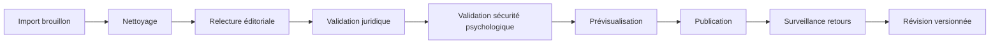

# Spécifications fonctionnelles détaillées

## 1. Objectifs fonctionnels

L’application doit permettre :

1. de consulter des modules de rétablissement ;
2. de répondre à des feuilles de travail ;
3. de sauvegarder des notes personnelles ;
4. de construire un plan de rétablissement ;
5. d’utiliser des moyens d’adaptation en situation difficile ;
6. de retrouver rapidement des ressources humaines en cas de détresse ;
7. de partager volontairement certains éléments avec une personne ou un groupe ;
8. d’administrer les contenus sous licence ;
9. de protéger l’utilisateur, ses données et son rythme.

## 2. Rôles utilisateurs

| Rôle | Description | Droits principaux |
|---|---|---|
| Visiteur | Personne non connectée. | Lire pages publiques, ressources de crise, créer session locale si activée. |
| Utilisateur | Personne avec compte personnel. | Modules, réponses, journal, plan, export, suppression. |
| Utilisateur invité/local | Personne sans compte cloud. | Stockage local navigateur/appareil, export manuel, pas de synchronisation. |
| Personne de confiance | Contact invité par l’utilisateur. | Voir uniquement les éléments partagés explicitement. |
| Facilitateur | Pair aidant, animateur de groupe, professionnel ou bénévole. | Créer groupe, proposer modules, animer sessions, voir contributions volontairement partagées. |
| Admin contenu | Gestion éditoriale. | Import, versionnement, publication, retrait, licences. |
| Admin conformité | DPO, sécurité, conformité. | Journaux d’audit, demandes RGPD, politiques, incidents. |
| Super admin | Exploitation technique limitée. | Gestion environnement, jamais accès par défaut au contenu sensible déchiffré. |

## 3. Personas

### 3.1 Personne en autonomie

- Souhaite écrire seule.
- Peut être méfiante vis-à-vis des institutions.
- Veut garder le contrôle.
- A besoin d’une interface rassurante, mobile, privée.

### 3.2 Participant à un groupe de pair-aidance

- Utilise l’outil avant, pendant ou après un atelier.
- Peut vouloir partager une partie de ses réponses.
- A besoin de clarté sur qui voit quoi.

### 3.3 Facilitateur

- Prépare des séances.
- Choisit un module selon le thème du groupe.
- Ne doit pas avoir accès aux journaux privés.
- A besoin d’outils d’animation non intrusifs.

### 3.4 Administrateur éditorial

- Import de contenus validés juridiquement.
- Relit, versionne, publie.
- Gère traductions et avertissements.

### 3.5 DPO / responsable conformité

- Suit les consentements.
- Répond aux demandes d’accès/suppression.
- Vérifie logs, hébergement, sous-traitants.

## 4. Parcours utilisateur principaux

### 4.1 Parcours A — Démarrer sans compte

1. L’utilisateur arrive sur la page d’accueil.
2. Il lit la promesse : cahier de réflexion, non substitut aux urgences.
3. Il choisit “Essayer en mode privé/local”.
4. L’application explique que les données restent dans le navigateur, avec risque de perte si cache supprimé.
5. L’utilisateur choisit un module doux.
6. Il répond à une question.
7. Il peut exporter ou créer un compte pour synchroniser.

Critères d’acceptation :

- aucune donnée sensible n’est envoyée au serveur en mode local ;
- un avertissement clair explique les limites du stockage local ;
- l’utilisateur peut supprimer toutes les données locales en un clic.

### 4.2 Parcours B — Créer un compte

1. Choix entre magic link, mot de passe, OIDC ou WebAuthn.
2. Affichage des conditions d’utilisation, politique de confidentialité, avertissement non médical.
3. Consentements granulaires : stockage cloud, rappels, partage, IA optionnelle.
4. Création d’un profil minimal : pseudonyme, langue, pays pour ressources de crise.
5. Accès au tableau de bord.

Critères d’acceptation :

- aucune donnée de santé n’est requise à l’inscription ;
- le pays sert uniquement à personnaliser les ressources d’aide ;
- le consentement IA est séparé et désactivé par défaut.

### 4.3 Parcours C — Répondre à une feuille de travail

1. L’utilisateur ouvre un module.
2. L’application affiche niveau d’intensité et durée estimée.
3. L’utilisateur peut choisir : lire, commencer, ajouter au favoris, passer.
4. Les questions apparaissent une par une ou toutes ensemble selon préférence.
5. Sauvegarde automatique des brouillons.
6. Bouton “faire une pause”.
7. À la fin : sauvegarder, exporter, relire, ajouter au plan, ne rien faire.

Critères d’acceptation :

- la question peut être ignorée ;
- la saisie longue ne se perd pas ;
- aucune analyse cachée des réponses ;
- un bouton “ressources immédiates” reste visible.

### 4.4 Parcours D — Construire un plan de rétablissement

1. Accès au module “Plan de Rétablissement” ou au menu “Mon plan”.
2. Sections guidées : signes, aides, contacts, lieux, actions, phrases, ressources.
3. Possibilité d’ajouter des réponses existantes depuis des modules.
4. Versionnage du plan.
5. Export en PDF/Markdown.
6. Partage optionnel avec une personne de confiance.

Critères d’acceptation :

- un plan peut être modifié sans perdre les versions précédentes ;
- l’utilisateur choisit quelles sections partager ;
- le plan contient une section de crise configurable.

### 4.5 Parcours E — Situation de détresse

1. L’utilisateur clique sur “J’ai besoin d’aide maintenant”.
2. L’application affiche une page calme, sans collecte de données obligatoire.
3. Ressources selon pays : numéros, texte court, actions immédiates.
4. Boutons : appeler, copier, afficher plan personnel, contacter personne de confiance.
5. Si l’utilisateur écrit dans un champ de détresse, l’application peut afficher une bannière non intrusive avec ressources, sans prétendre évaluer le risque.

Critères d’acceptation :

- la page est disponible sans connexion ;
- les numéros sont configurables par pays ;
- le système ne remplace pas les urgences ;
- aucun pop-up bloquant ne culpabilise l’utilisateur.

### 4.6 Parcours F — Groupe privé

1. Facilitateur crée un groupe.
2. Il choisit modules visibles.
3. Il invite participants par lien ou code.
4. Chaque participant garde son espace privé.
5. Le facilitateur voit uniquement : présence volontaire, réponses explicitement partagées, commentaires de groupe.
6. Les discussions de groupe peuvent être désactivées pour le MVP.

Critères d’acceptation :

- séparation stricte privé/partagé ;
- aucune réponse privée n’est visible par le facilitateur ;
- les invitations expirent ;
- le participant peut quitter le groupe et retirer ses partages.

## 5. Fonctionnalités détaillées

### 5.1 Catalogue de modules

Exigences :

| ID | Exigence | Priorité |
|---|---|---|
| F-CAT-001 | Afficher les guides disponibles. | MUST |
| F-CAT-002 | Afficher les modules par guide et par parcours thématique. | MUST |
| F-CAT-003 | Filtrer par thème, intensité, durée, statut commencé/terminé. | SHOULD |
| F-CAT-004 | Masquer les modules très sensibles par défaut si l’utilisateur le souhaite. | SHOULD |
| F-CAT-005 | Rechercher un module par mot-clé. | SHOULD |
| F-CAT-006 | Afficher le statut des droits de contenu côté admin. | MUST admin |

### 5.2 Page module

Éléments :

- titre ;
- résumé ;
- durée estimée ;
- intensité ;
- tags ;
- avertissement si nécessaire ;
- texte sous licence ou adaptation ;
- bouton commencer ;
- boutons passer / sauvegarder / partager ;
- ressources associées ;
- modules plus doux.

### 5.3 Moteur de feuilles de travail

Types de questions :

| Type | Description | Exemple non issu des sources |
|---|---|---|
| `long_text` | Réponse libre longue. | “Qu’aimeriez-vous vous rappeler aujourd’hui ?” |
| `short_text` | Réponse courte. | “Un mot pour décrire votre état actuel.” |
| `list` | Liste d’éléments. | “Ajoutez jusqu’à trois choses utiles.” |
| `steps` | Étapes d’un plan. | “Quelle première action est possible ?” |
| `contact` | Personne de soutien. | “Qui pourriez-vous contacter ?” |
| `scale_optional` | Échelle non clinique. | “À quel point ce module vous semble intense ?” |
| `choice` | Choix simple. | “Voulez-vous l’ajouter à votre plan ?” |

Fonctions :

- autosave toutes les 5 secondes ou sur changement ;
- sauvegarde manuelle ;
- mode brouillon ;
- historique de modification ;
- export ;
- suppression ;
- chiffrement ;
- verrouillage par code local optionnel ;
- marquage “à revoir plus tard”.

### 5.4 Journal personnel

Fonctions :

- créer entrée libre ;
- associer à un module ;
- taguer ;
- rechercher localement ;
- exporter ;
- supprimer ;
- masquer dans l’interface ;
- verrouiller ;
- afficher chronologie.

Règles :

- pas de scoring émotionnel obligatoire ;
- humeur optionnelle sous forme de mots ou pictogrammes ;
- pas de partage par défaut.

### 5.5 Moyens d’adaptation

Bibliothèque personnelle :

- respiration ;
- douche ;
- musique ;
- marche ;
- personne de confiance ;
- animal ;
- activité agréable ;
- phrase utile ;
- lieu sûr ;
- liste de gratitude ;
- pause numérique.

Chaque moyen d’adaptation :

```yaml
coping_tool:
  title: string
  category: physical | relational | creative | grounding | practical | spiritual | custom
  instructions: string
  estimated_duration_minutes: integer
  works_when: string[]
  caution: string | null
  created_by_user: boolean
```

### 5.6 Plan de rétablissement

Fonctionnalités :

- modèle guidé ;
- sections personnalisables ;
- version actuelle + historique ;
- export hors ligne ;
- partage partiel ;
- “mode crise” qui affiche seulement les éléments utiles ;
- rappels de mise à jour non culpabilisants.

### 5.7 Ressources de crise

Fonctions :

- page permanente accessible depuis toutes les pages ;
- ressources par pays ;
- en France : 3114 pour prévention du suicide, et urgence médicale via services d’urgence configurés ;
- texte clair : “si danger immédiat, contactez les urgences locales” ;
- aucune obligation de remplir un formulaire ;
- bouton “afficher mon plan” ;
- bouton “contacter quelqu’un”.

### 5.8 Export utilisateur

Formats :

- Markdown ;
- PDF ;
- JSON portable ;
- archive ZIP chiffrée optionnelle.

Exigences :

- export complet RGPD ;
- export d’un module seul ;
- export du plan de rétablissement ;
- export sans contenu protégé si droits insuffisants ;
- filigrane possible : “réponses personnelles de l’utilisateur”.

### 5.9 Notifications

Types :

- rappel doux de revenir à un module ;
- rappel de mettre à jour le plan ;
- rappel de groupe ;
- message administratif ;
- sécurité du compte.

Règles :

- opt-in ;
- fréquence limitée ;
- contenu discret : ne jamais révéler un thème sensible dans une notification verrouillée ;
- désactivation facile ;
- plage horaire respectueuse.

### 5.10 Back-office contenu

Fonctions :

- créer guide ;
- importer modules ;
- ajouter traduction ;
- ajouter avertissement ;
- ajouter questions ;
- lier ressources ;
- prévisualiser ;
- workflow brouillon → revue → publié → archivé ;
- gérer droits/licences ;
- journaliser les modifications.

Workflow :



## 6. Écrans principaux

### 6.1 Page d’accueil

- promesse ;
- bouton commencer ;
- bouton ressources immédiates ;
- explication confidentialité ;
- choix compte/local ;
- mentions non médicales.

### 6.2 Tableau de bord

- reprendre dernier module ;
- mon plan ;
- mes moyens d’adaptation ;
- modules recommandés non personnalisés cliniquement ;
- favoris ;
- exports ;
- paramètres de confidentialité.

### 6.3 Écran module

- navigation simple ;
- progression locale ;
- bouton pause ;
- bouton aide immédiate ;
- taille de texte ajustable ;
- mode lecture confortable ;
- affichage questions.

### 6.4 Écran réponse

- champ large ;
- sauvegarde visible ;
- “je passe cette question” ;
- “ajouter à mon plan” ;
- “supprimer cette réponse” ;
- “exporter”.

### 6.5 Écran groupe

- thème de la séance ;
- consignes ;
- réponses privées ;
- espace partagé volontaire ;
- règles de confidentialité ;
- bouton quitter.

## 7. Règles de confidentialité fonctionnelle

| Situation | Comportement attendu |
|---|---|
| Réponse créée | Privée par défaut. |
| Facilitateur de groupe | Ne voit rien sans partage explicite. |
| Personne de confiance | Ne voit que les sections choisies. |
| Admin technique | Ne voit pas le contenu déchiffré par défaut. |
| Export | Demandé activement par l’utilisateur. |
| Suppression | Suppression logique immédiate + purge programmée. |
| Analytics | Agrégés, sans contenu sensible. |

## 8. Critères d’acceptation globaux du MVP

- L’utilisateur peut utiliser au moins 10 modules sans compte cloud si mode local activé.
- L’utilisateur peut créer un compte et sauvegarder ses réponses chiffrées côté serveur.
- L’utilisateur peut exporter ses réponses au format Markdown.
- L’utilisateur peut supprimer son compte et toutes ses réponses.
- L’application affiche une ressource d’aide immédiate en permanence.
- Le back-office peut importer un pack de contenu en brouillon.
- Aucun contenu protégé n’est publié sans statut de licence validé.
- Les tests automatisés couvrent au moins les parcours inscription, module, réponse, export, suppression.
- L’interface respecte les critères WCAG 2.2 AA prioritaires.
- Les journaux applicatifs ne contiennent jamais de réponses utilisateur.

## 9. Exigences non fonctionnelles utilisateur

| ID | Exigence | Cible |
|---|---|---|
| NF-UX-001 | Chargement initial mobile | < 3 s sur 4G correcte. |
| NF-UX-002 | Autosave | Perte maximale < 10 s de saisie. |
| NF-UX-003 | Disponibilité ressources crise | 99,95 %. |
| NF-UX-004 | Accessibilité clavier | 100 % des fonctions critiques. |
| NF-UX-005 | Contraste | WCAG AA minimum. |
| NF-UX-006 | Export | < 30 s pour 1 an d’entrées ordinaires. |
| NF-UX-007 | Suppression compte | Confirmation immédiate, purge selon politique. |

## 10. Backlog fonctionnel priorisé

### Must

- Authentification.
- Mode local ou cloud.
- Catalogue.
- Module.
- Feuilles de travail.
- Journal.
- Plan.
- Ressources d’urgence.
- Export.
- Suppression.
- Back-office contenu.
- Consentements.

### Should

- Groupes privés.
- Personne de confiance.
- Notifications.
- Recherche.
- Favoris.
- Tags.
- Multilingue.

### Could

- PWA offline avancée.
- IA rédactionnelle.
- Audio.
- Mode imprimable atelier.
- Bibliothèque de contenus associatifs.

### Won’t for MVP

- Chat communautaire public.
- Diagnostic.
- Scoring clinique.
- Publicité.
- Revente de données.
