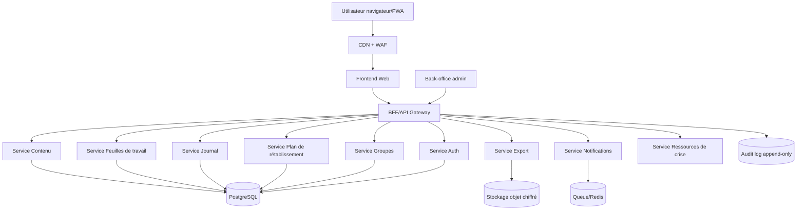
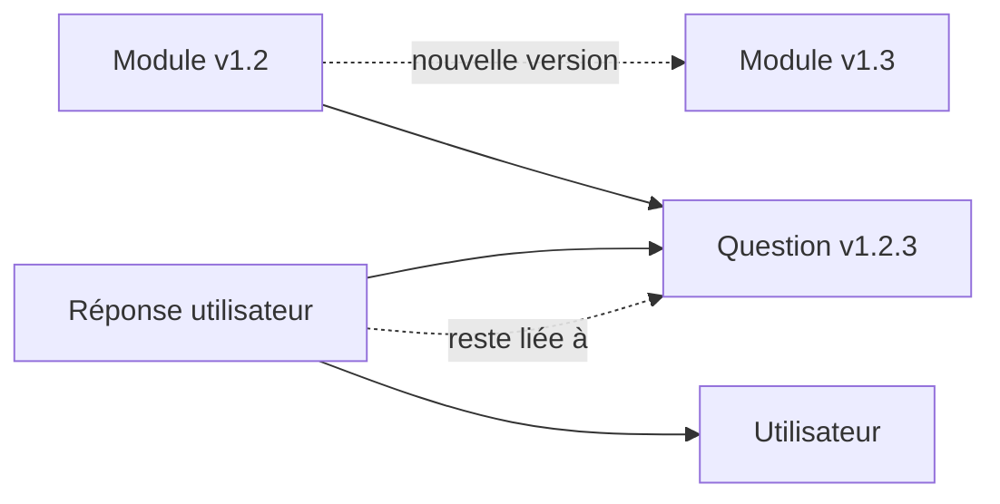
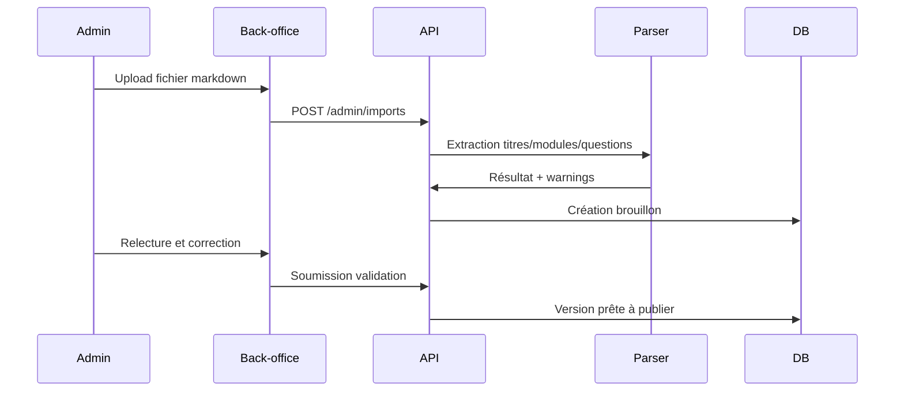
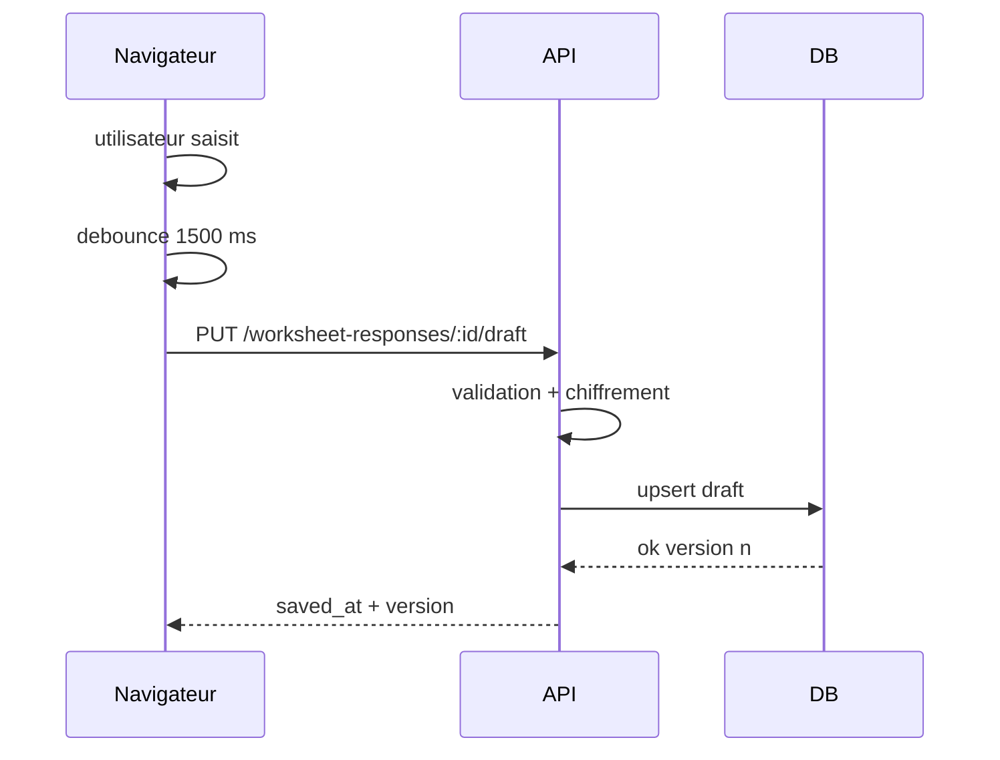
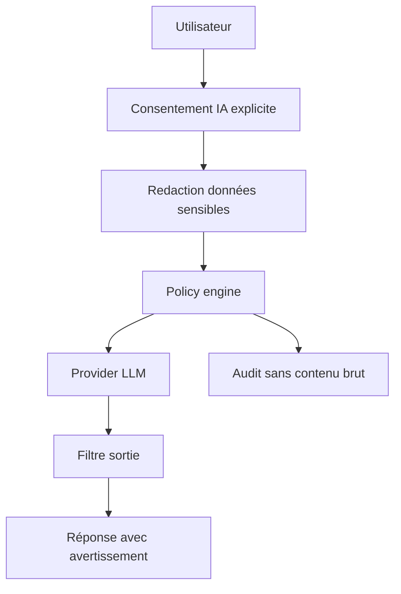
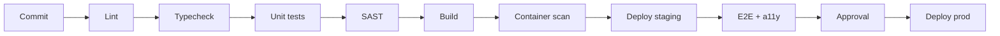

# Spécifications techniques et architecture

## 1. Objectifs techniques

L’architecture doit fournir :

- confidentialité forte ;
- traçabilité des accès ;
- séparation entre contenu éditorial et données personnelles ;
- haute disponibilité des ressources de crise ;
- capacité mobile-first ;
- accessibilité ;
- simplicité d’exploitation ;
- évolutivité vers groupes, multilingue, exports et PWA ;
- possibilité de conformité HDS si données de santé hébergées en France.

## 2. Architecture logique



## 3. Stack recommandée

### 3.1 Frontend

Option recommandée :

- Next.js ou Remix ;
- TypeScript strict ;
- React Server Components si Next.js ;
- Design system accessible ;
- CSS variables + tokens ;
- PWA via service worker ;
- i18n via message catalogs ;
- tests Playwright + axe-core.

Alternative : Vue/Nuxt ou SvelteKit si l’équipe maîtrise mieux.

### 3.2 Backend

Option recommandée :

- Node.js TypeScript avec NestJS ou Fastify ;
- API REST documentée OpenAPI ;
- validation Zod ou TypeBox ;
- ORM Prisma ou Drizzle ;
- jobs BullMQ / RabbitMQ / Cloud Tasks ;
- séparation services modulaires dans un monorepo.

Alternative robuste : Python FastAPI + SQLAlchemy + Celery.

### 3.3 Base de données

- PostgreSQL 16+ ;
- extension `pgcrypto` si chiffrement applicatif complémentaire ;
- Row-Level Security possible pour séparation tenant/groupe ;
- migrations versionnées ;
- sauvegardes chiffrées ;
- réplication.

### 3.4 Cache et queue

- Redis compatible TLS ;
- utilisé pour sessions courtes, rate limiting, jobs d’export, notifications ;
- ne jamais stocker durablement les réponses sensibles non chiffrées dans Redis.

### 3.5 Stockage objet

- S3 compatible, en région UE ;
- chiffrement côté serveur ;
- liens signés courts ;
- cycle de vie automatique ;
- suppression sur demande.

### 3.6 Hébergement

Scénarios :

| Scénario | Description | Recommandation |
|---|---|---|
| Bien-être sans stockage santé serveur | contenu + local-only | Cloud UE standard possible. |
| Stockage cloud de journaux de santé mentale | données sensibles | Hébergement HDS recommandé/à valider. |
| Partenariat association santé | données de groupes | HDS + AIPD + contrats sous-traitants. |
| Déploiement international | multi-pays | régions séparées, ressources crise locales, conformité locale. |

## 4. Architecture applicative

### 4.1 Modules backend

```text
src/
  auth/
  users/
  consent/
  content/
  modules/
  worksheets/
  journal/
  recovery-plan/
  coping-tools/
  groups/
  sharing/
  crisis-resources/
  export/
  notifications/
  audit/
  admin/
  privacy/
  billing/                # seulement si modèle payant, jamais nécessaire au MVP associatif
```

### 4.2 Frontend routes

```text
/
/start
/help-now
/auth/login
/dashboard
/guides
/guides/:guideSlug
/modules/:moduleSlug
/modules/:moduleSlug/work
/journal
/journal/:entryId
/recovery-plan
/coping-tools
/groups
/groups/:groupId
/settings/privacy
/settings/export
/admin/content
/admin/content/:guideId
/admin/audit
```

### 4.3 Séparation contenu / réponses

Principe :

- le contenu éditorial est public ou semi-public, versionné ;
- les réponses utilisateur sont privées, chiffrées, contrôlées par l’utilisateur ;
- un module peut changer de version sans modifier les réponses historiques ;
- une réponse référence la version exacte de la question au moment de la réponse.



## 5. Chiffrement

### 5.1 En transit

- TLS 1.3 ;
- HSTS ;
- cookies `Secure`, `HttpOnly`, `SameSite=Lax/Strict` ;
- désactivation des suites faibles.

### 5.2 Au repos

- chiffrement disque/cloud ;
- chiffrement champ applicatif pour contenus sensibles : réponses, journal, plan, contacts ;
- clés gérées via KMS/HSM ;
- rotation des clés ;
- séparation clés par environnement ;
- audit des accès aux clés.

### 5.3 Option chiffrement côté client

Niveau avancé :

- le contenu sensible est chiffré dans le navigateur avant envoi ;
- serveur stocke ciphertext ;
- récupération multi-appareil via clé dérivée mot de passe ou passkey ;
- complexité UX élevée ;
- export/restauration à concevoir soigneusement.

Recommandation MVP : chiffrement applicatif serveur + KMS + accès très restreint. Étudier E2EE en v2.

## 6. Authentification et sessions

### 6.1 Modes

- magic link par e-mail ;
- mot de passe fort + MFA optionnelle ;
- passkey/WebAuthn ;
- OIDC pour organisations ;
- mode local sans compte.

### 6.2 Sessions

- access token court ;
- refresh token rotation ;
- révocation ;
- détection d’anomalie basique ;
- limitation des appareils ;
- déconnexion partout.

### 6.3 Autorisations

Modèle RBAC + ABAC :

```yaml
roles:
  - user
  - trusted_contact
  - facilitator
  - content_admin
  - compliance_admin
  - super_admin
attributes:
  owner_id
  group_id
  shared_scope
  consent_flags
  content_license_status
```

Règle centrale : un utilisateur ne voit que ce qu’il possède ou ce qui lui est explicitement partagé.

## 7. Service de contenu

### 7.1 Responsabilités

- stocker guides, modules, questions ;
- versionner ;
- publier/archiver ;
- appliquer droits ;
- fournir contenu selon langue ;
- gérer avertissements et tags ;
- ne jamais mélanger contenu et réponses utilisateur.

### 7.2 Pipeline d’import



### 7.3 Validation d’import

- titre obligatoire ;
- slug unique ;
- niveau d’intensité ;
- droits renseignés ;
- questions typées ;
- avertissement pour niveau 3+ ;
- pas de contenu publié si `rights_status != cleared`.

## 8. Service de feuilles de travail

Responsabilités :

- créer réponses ;
- autosave ;
- historique ;
- export ;
- lien au plan ;
- chiffrement ;
- suppression.

### 8.1 Flux autosave



### 8.2 Résolution conflits

- chaque sauvegarde porte un `client_revision` ;
- si conflit : conserver deux versions ;
- afficher “version appareil A / version appareil B” ;
- jamais écraser silencieusement une réponse longue.

## 9. Service groupes

### 9.1 Modèle

- groupe privé ;
- invitation par code ;
- rôles groupe ;
- séance ;
- modules assignés ;
- partage volontaire.

### 9.2 Règles

- pas de visibilité automatique des réponses ;
- le facilitateur voit seulement les réponses marquées `shared_with_group` ;
- le partage est révocable ;
- export individuel exclut contributions d’autres personnes.

## 10. Service export

### 10.1 Formats

- Markdown ;
- PDF ;
- JSON ;
- ZIP.

### 10.2 Architecture

- demande export → job queue ;
- génération dans worker isolé ;
- stockage objet temporaire ;
- lien signé ;
- suppression automatique après 24 h ;
- journal d’audit.

### 10.3 Protection droits d’auteur

Si le contenu du guide n’a pas licence claire, l’export ne doit contenir que :

- titre du module ;
- date ;
- réponses personnelles ;
- références minimales ;
- pas de texte intégral ni questions originales.

## 11. Notifications

### 11.1 Architecture

- table `notification_preferences` ;
- queue ;
- providers e-mail/SMS/push ;
- templates sans contenu sensible ;
- logs minimaux.

### 11.2 Exemples de templates

Autorisé :

- “Votre espace personnel vous attend.”
- “Vous avez demandé un rappel aujourd’hui.”

À éviter :

- “Reprenez votre module sur les pensées extrêmes.”
- “Votre plan de crise n’est pas terminé.”

## 12. Recherche

### 12.1 Recherche contenu

- PostgreSQL full-text pour MVP ;
- OpenSearch si volumétrie élevée ;
- index sur contenu public seulement ;
- pas d’indexation des réponses personnelles sans consentement.

### 12.2 Recherche personnelle

- recherche locale côté client possible ;
- ou index chiffré avancé en v2 ;
- MVP : recherche serveur sur métadonnées non sensibles + contenu si utilisateur consent.

## 13. PWA et offline

### 13.1 MVP

- cache statique ;
- page ressources de crise toujours disponible ;
- brouillon local temporaire si perte réseau ;
- synchronisation après reconnexion.

### 13.2 V2

- mode offline complet ;
- base IndexedDB chiffrée ;
- sync conflict-aware ;
- verrouillage local par biométrie/passcode.

## 14. Option IA générative

L’IA doit être un module séparé, désactivé par défaut.

### 14.1 Usages acceptables

- reformuler une réponse personnelle à la demande ;
- suggérer une structure de plan sans interpréter médicalement ;
- proposer des questions générales non cliniques ;
- aider à résumer ses propres notes pour soi.

### 14.2 Usages interdits ou à forte contrainte

- diagnostic ;
- évaluation de risque suicidaire comme décision ;
- recommandation de traitement ;
- substitution à un professionnel ;
- entraînement du modèle sur données utilisateur ;
- partage à des tiers sans consentement.

### 14.3 Architecture IA si activée



Règles :

- pas de logs prompts/réponses chez le provider si possible ;
- contrat DPA ;
- région UE si disponible ;
- désactivation par organisation ;
- tests prompt injection ;
- fallback non IA.

## 15. Observabilité

### 15.1 Logs

- logs structurés JSON ;
- corrélation request ID ;
- aucune réponse utilisateur ;
- masquage e-mail/téléphone ;
- rétention limitée ;
- journal d’audit séparé.

### 15.2 Métriques

- disponibilité API ;
- latence p95/p99 ;
- erreurs 4xx/5xx ;
- temps génération export ;
- taux autosave échec ;
- uptime page aide immédiate ;
- taux de livraison notifications.

### 15.3 Alertes

- API down ;
- page aide immédiate indisponible ;
- erreur DB ;
- échec sauvegarde > seuil ;
- anomalie auth ;
- job export bloqué ;
- seuil budget IA.

## 16. Environnements

| Environnement | Données | Accès |
|---|---|---|
| local | fausses données | développeurs. |
| dev | données synthétiques | équipe technique. |
| staging | données synthétiques réalistes | QA, sécurité. |
| preprod | éventuellement anonymisé | accès contrôlé. |
| prod | données réelles | accès très restreint. |

Règle : jamais de données utilisateur réelles en local/dev.

## 17. CI/CD

Pipeline minimal :



Contrôles :

- dépendances vulnérables bloquantes ;
- migration DB testée ;
- tests accessibilité ;
- tests sécurité headers ;
- rollback automatisé.

## 18. Performances cibles

| Indicateur | Cible MVP |
|---|---:|
| Time to First Byte | < 800 ms |
| LCP mobile | < 2,5 s pour pages critiques |
| API p95 | < 300 ms hors export |
| Autosave p95 | < 500 ms |
| Export Markdown | < 10 s pour 100 entrées |
| Export PDF | < 30 s pour 100 entrées |
| Page aide immédiate | disponible même dégradée |
| Disponibilité globale | 99,9 % |

## 19. Résilience

- sauvegardes quotidiennes chiffrées ;
- restauration testée mensuellement ;
- RPO cible 24 h MVP, 1 h v1 ;
- RTO cible 8 h MVP, 2 h v1 ;
- multi-AZ en production ;
- feature flags ;
- mode dégradé : lecture contenu + aide immédiate.

## 20. Dépendances externes

| Dépendance | Risque | Mitigation |
|---|---|---|
| Provider e-mail | indisponibilité | provider secondaire. |
| SMS | coût + confidentialité | opt-in, templates neutres. |
| LLM | fuite/erreur | optionnel, consentement, pas de données brutes si possible. |
| Cloud | localisation | contrat, HDS si nécessaire. |
| CDN/WAF | blocage | configuration testée, bypass admin sécurisé. |
| PDF renderer | vulnérabilités | sandbox worker, pas de HTML non filtré. |

## 21. Choix recommandé pour MVP

- Frontend : Next.js + TypeScript + PWA partielle.
- Backend : NestJS/Fastify + PostgreSQL + Redis.
- Auth : magic link + passkeys optionnelles.
- Hébergement : cloud UE certifié, HDS si stockage santé mentale serveur.
- Chiffrement : TLS + at-rest + field-level encryption.
- IA : désactivée au MVP.
- Groupes : v1.1 sauf besoin immédiat.
- Export : Markdown MVP, PDF v1.1.
