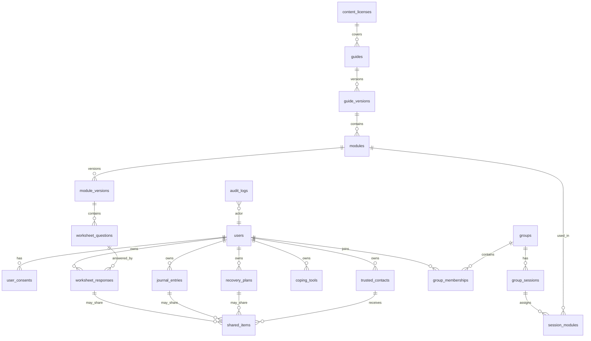

# Modèle de données et API

## 1. Principes de modélisation

Le modèle doit séparer quatre domaines :

1. **Identité et consentement** : compte, sessions, préférences, consentements.
2. **Contenu éditorial** : guides, modules, questions, versions, licences.
3. **Données personnelles sensibles** : réponses, journal, plan, contacts, moyens d’adaptation.
4. **Collaboration contrôlée** : groupes, partages, invitations, rôles.

Chaque donnée sensible doit être liée à son propriétaire et, si possible, chiffrée au niveau champ avant persistance.

## 2. Diagramme entité-relation simplifié



## 3. Tables principales

### 3.1 `users`

```sql
CREATE TABLE users (
  id UUID PRIMARY KEY DEFAULT gen_random_uuid(),
  email CITEXT UNIQUE,
  email_verified_at TIMESTAMPTZ,
  pseudonym TEXT NOT NULL,
  locale TEXT NOT NULL DEFAULT 'fr-FR',
  country_code CHAR(2),
  timezone TEXT DEFAULT 'Europe/Paris',
  status TEXT NOT NULL DEFAULT 'active',
  created_at TIMESTAMPTZ NOT NULL DEFAULT now(),
  updated_at TIMESTAMPTZ NOT NULL DEFAULT now(),
  deleted_at TIMESTAMPTZ
);
```

### 3.2 `user_consents`

```sql
CREATE TABLE user_consents (
  id UUID PRIMARY KEY DEFAULT gen_random_uuid(),
  user_id UUID NOT NULL REFERENCES users(id),
  consent_type TEXT NOT NULL,
  granted BOOLEAN NOT NULL,
  version TEXT NOT NULL,
  source TEXT NOT NULL,
  created_at TIMESTAMPTZ NOT NULL DEFAULT now(),
  revoked_at TIMESTAMPTZ,
  metadata JSONB NOT NULL DEFAULT '{}'
);

CREATE INDEX idx_user_consents_user_type ON user_consents(user_id, consent_type);
```

Consent types :

- `terms`
- `privacy_policy`
- `cloud_storage`
- `notifications_email`
- `notifications_sms`
- `group_sharing`
- `trusted_contact_sharing`
- `ai_assistance`
- `analytics_privacy_preserving`

### 3.3 `content_licenses`

```sql
CREATE TABLE content_licenses (
  id UUID PRIMARY KEY DEFAULT gen_random_uuid(),
  name TEXT NOT NULL,
  rights_holder TEXT,
  rights_status TEXT NOT NULL CHECK (rights_status IN ('unknown','permission_required','cleared','expired','restricted')),
  allowed_uses JSONB NOT NULL DEFAULT '{}',
  document_uri TEXT,
  valid_from DATE,
  valid_until DATE,
  notes TEXT,
  created_at TIMESTAMPTZ NOT NULL DEFAULT now()
);
```

### 3.4 `guides`

```sql
CREATE TABLE guides (
  id UUID PRIMARY KEY DEFAULT gen_random_uuid(),
  slug TEXT NOT NULL UNIQUE,
  title TEXT NOT NULL,
  subtitle TEXT,
  author TEXT,
  publisher TEXT,
  source_reference TEXT,
  language TEXT NOT NULL DEFAULT 'fr',
  license_id UUID REFERENCES content_licenses(id),
  publication_status TEXT NOT NULL DEFAULT 'draft',
  created_at TIMESTAMPTZ NOT NULL DEFAULT now(),
  updated_at TIMESTAMPTZ NOT NULL DEFAULT now()
);
```

### 3.5 `modules`

```sql
CREATE TABLE modules (
  id UUID PRIMARY KEY DEFAULT gen_random_uuid(),
  guide_id UUID NOT NULL REFERENCES guides(id),
  slug TEXT NOT NULL,
  order_index INT NOT NULL,
  canonical_title TEXT NOT NULL,
  default_intensity INT NOT NULL DEFAULT 1,
  default_duration_minutes INT,
  created_at TIMESTAMPTZ NOT NULL DEFAULT now(),
  UNIQUE(guide_id, slug)
);
```

### 3.6 `module_versions`

```sql
CREATE TABLE module_versions (
  id UUID PRIMARY KEY DEFAULT gen_random_uuid(),
  module_id UUID NOT NULL REFERENCES modules(id),
  version TEXT NOT NULL,
  title TEXT NOT NULL,
  summary TEXT,
  body_markdown TEXT,
  body_rights_status TEXT NOT NULL DEFAULT 'permission_required',
  language TEXT NOT NULL DEFAULT 'fr',
  intensity INT NOT NULL DEFAULT 1,
  tags TEXT[] NOT NULL DEFAULT '{}',
  content_warnings TEXT[] NOT NULL DEFAULT '{}',
  status TEXT NOT NULL DEFAULT 'draft',
  published_at TIMESTAMPTZ,
  created_at TIMESTAMPTZ NOT NULL DEFAULT now(),
  UNIQUE(module_id, version)
);
```

### 3.7 `worksheet_questions`

```sql
CREATE TABLE worksheet_questions (
  id UUID PRIMARY KEY DEFAULT gen_random_uuid(),
  module_version_id UUID NOT NULL REFERENCES module_versions(id),
  order_index INT NOT NULL,
  question_type TEXT NOT NULL,
  prompt_markdown TEXT NOT NULL,
  prompt_rights_status TEXT NOT NULL DEFAULT 'permission_required',
  help_text TEXT,
  required BOOLEAN NOT NULL DEFAULT false,
  config JSONB NOT NULL DEFAULT '{}',
  created_at TIMESTAMPTZ NOT NULL DEFAULT now()
);
```

### 3.8 `worksheet_responses`

```sql
CREATE TABLE worksheet_responses (
  id UUID PRIMARY KEY DEFAULT gen_random_uuid(),
  user_id UUID NOT NULL REFERENCES users(id),
  question_id UUID NOT NULL REFERENCES worksheet_questions(id),
  module_version_id UUID NOT NULL REFERENCES module_versions(id),
  response_ciphertext BYTEA NOT NULL,
  response_nonce BYTEA NOT NULL,
  response_key_id TEXT NOT NULL,
  status TEXT NOT NULL DEFAULT 'draft',
  client_revision INT NOT NULL DEFAULT 1,
  tags TEXT[] NOT NULL DEFAULT '{}',
  created_at TIMESTAMPTZ NOT NULL DEFAULT now(),
  updated_at TIMESTAMPTZ NOT NULL DEFAULT now(),
  deleted_at TIMESTAMPTZ
);

CREATE INDEX idx_worksheet_responses_user ON worksheet_responses(user_id, updated_at DESC);
```

### 3.9 `journal_entries`

```sql
CREATE TABLE journal_entries (
  id UUID PRIMARY KEY DEFAULT gen_random_uuid(),
  user_id UUID NOT NULL REFERENCES users(id),
  module_id UUID REFERENCES modules(id),
  title_ciphertext BYTEA,
  body_ciphertext BYTEA NOT NULL,
  nonce BYTEA NOT NULL,
  key_id TEXT NOT NULL,
  mood_label TEXT,
  tags TEXT[] NOT NULL DEFAULT '{}',
  created_at TIMESTAMPTZ NOT NULL DEFAULT now(),
  updated_at TIMESTAMPTZ NOT NULL DEFAULT now(),
  deleted_at TIMESTAMPTZ
);
```

### 3.10 `recovery_plans`

```sql
CREATE TABLE recovery_plans (
  id UUID PRIMARY KEY DEFAULT gen_random_uuid(),
  user_id UUID NOT NULL REFERENCES users(id),
  version INT NOT NULL DEFAULT 1,
  plan_ciphertext BYTEA NOT NULL,
  nonce BYTEA NOT NULL,
  key_id TEXT NOT NULL,
  is_current BOOLEAN NOT NULL DEFAULT true,
  created_at TIMESTAMPTZ NOT NULL DEFAULT now(),
  updated_at TIMESTAMPTZ NOT NULL DEFAULT now(),
  deleted_at TIMESTAMPTZ
);
```

### 3.11 `coping_tools`

```sql
CREATE TABLE coping_tools (
  id UUID PRIMARY KEY DEFAULT gen_random_uuid(),
  user_id UUID REFERENCES users(id),
  title TEXT NOT NULL,
  category TEXT NOT NULL,
  instructions_ciphertext BYTEA,
  nonce BYTEA,
  key_id TEXT,
  is_template BOOLEAN NOT NULL DEFAULT false,
  created_at TIMESTAMPTZ NOT NULL DEFAULT now(),
  updated_at TIMESTAMPTZ NOT NULL DEFAULT now(),
  deleted_at TIMESTAMPTZ
);
```

### 3.12 `trusted_contacts`

```sql
CREATE TABLE trusted_contacts (
  id UUID PRIMARY KEY DEFAULT gen_random_uuid(),
  user_id UUID NOT NULL REFERENCES users(id),
  display_name_ciphertext BYTEA NOT NULL,
  contact_method_ciphertext BYTEA,
  nonce BYTEA NOT NULL,
  key_id TEXT NOT NULL,
  relationship_label TEXT,
  created_at TIMESTAMPTZ NOT NULL DEFAULT now(),
  deleted_at TIMESTAMPTZ
);
```

### 3.13 `groups` et `group_memberships`

```sql
CREATE TABLE groups (
  id UUID PRIMARY KEY DEFAULT gen_random_uuid(),
  name TEXT NOT NULL,
  description TEXT,
  owner_user_id UUID NOT NULL REFERENCES users(id),
  visibility TEXT NOT NULL DEFAULT 'private',
  created_at TIMESTAMPTZ NOT NULL DEFAULT now(),
  archived_at TIMESTAMPTZ
);

CREATE TABLE group_memberships (
  id UUID PRIMARY KEY DEFAULT gen_random_uuid(),
  group_id UUID NOT NULL REFERENCES groups(id),
  user_id UUID NOT NULL REFERENCES users(id),
  role TEXT NOT NULL CHECK (role IN ('participant','facilitator','observer')),
  status TEXT NOT NULL DEFAULT 'active',
  joined_at TIMESTAMPTZ NOT NULL DEFAULT now(),
  left_at TIMESTAMPTZ,
  UNIQUE(group_id, user_id)
);
```

### 3.14 `shared_items`

```sql
CREATE TABLE shared_items (
  id UUID PRIMARY KEY DEFAULT gen_random_uuid(),
  owner_user_id UUID NOT NULL REFERENCES users(id),
  target_type TEXT NOT NULL CHECK (target_type IN ('trusted_contact','group','user')),
  target_id UUID NOT NULL,
  item_type TEXT NOT NULL CHECK (item_type IN ('worksheet_response','journal_entry','recovery_plan','coping_tool')),
  item_id UUID NOT NULL,
  scope JSONB NOT NULL DEFAULT '{}',
  created_at TIMESTAMPTZ NOT NULL DEFAULT now(),
  revoked_at TIMESTAMPTZ
);
```

### 3.15 `audit_logs`

```sql
CREATE TABLE audit_logs (
  id UUID PRIMARY KEY DEFAULT gen_random_uuid(),
  actor_user_id UUID REFERENCES users(id),
  action TEXT NOT NULL,
  resource_type TEXT NOT NULL,
  resource_id UUID,
  ip_hash TEXT,
  user_agent_hash TEXT,
  metadata JSONB NOT NULL DEFAULT '{}',
  created_at TIMESTAMPTZ NOT NULL DEFAULT now()
);

CREATE INDEX idx_audit_logs_created ON audit_logs(created_at DESC);
```

## 4. Schémas JSON de contenu

### 4.1 Content pack

```json
{
  "$schema": "https://example.org/schemas/content-pack.schema.json",
  "id": "craig-lewis-fr-v1",
  "language": "fr",
  "title": "Guides de rétablissement",
  "rights": {
    "status": "permission_required",
    "rightsHolder": "Craig Lewis / Better Days Recovery Press",
    "licenseDocumentId": null,
    "notes": "Ne pas publier le texte complet sans autorisation."
  },
  "guides": [
    {
      "id": "un-jour-nouveau-fr",
      "title": "Un jour nouveau",
      "slug": "un-jour-nouveau",
      "modules": []
    }
  ]
}
```

### 4.2 Module

```json
{
  "id": "moyens-adaptation",
  "slug": "moyens-adaptation",
  "order": 7,
  "title": "Moyens d’adaptation",
  "summary": "Module sur les ressources personnelles qui aident à traverser les difficultés quotidiennes.",
  "bodyMarkdown": "Texte sous licence ou adaptation originale.",
  "rightsStatus": "cleared",
  "intensity": 1,
  "durationMinutes": 15,
  "tags": ["coping", "retablissement"],
  "contentWarnings": [],
  "worksheet": {
    "questions": [
      {
        "id": "q1",
        "type": "list",
        "promptMarkdown": "Question sous licence ou reformulée.",
        "required": false,
        "config": {
          "minItems": 0,
          "maxItems": 3
        }
      }
    ]
  }
}
```

## 5. API REST

### 5.1 Conventions

- Base URL : `/api/v1`.
- Auth : Bearer token ou cookie session sécurisé.
- Pagination : `limit`, `cursor`.
- Erreurs : RFC 7807 `application/problem+json`.
- Idempotency-Key pour POST sensibles.
- Toutes les dates en ISO 8601 UTC.

### 5.2 Erreur standard

```json
{
  "type": "https://example.org/problems/validation-error",
  "title": "Validation error",
  "status": 400,
  "detail": "A field is invalid.",
  "errors": [
    { "field": "prompt", "message": "Required" }
  ],
  "requestId": "req_01J..."
}
```

## 6. Endpoints publics

### `GET /health`

Retourne état minimal.

```json
{ "status": "ok", "version": "1.0.0" }
```

### `GET /crisis-resources?country=FR&locale=fr-FR`

Retourne ressources d’aide immédiate.

```json
{
  "country": "FR",
  "resources": [
    {
      "type": "suicide_prevention",
      "label": "3114 — numéro national de prévention du suicide",
      "phone": "3114",
      "available": "24/7",
      "description": "Ressource officielle française."
    }
  ],
  "emergencyNotice": "Si vous êtes en danger immédiat, contactez les urgences locales."
}
```

## 7. Authentification

### `POST /auth/magic-link`

```json
{ "email": "user@example.org", "locale": "fr-FR" }
```

### `POST /auth/session/refresh`

Rafraîchit session.

### `POST /auth/logout`

Révoque session courante.

### `POST /auth/logout-all`

Révoque toutes les sessions.

## 8. Guides et modules

### `GET /guides`

```json
{
  "items": [
    {
      "id": "uuid",
      "slug": "un-jour-nouveau",
      "title": "Un jour nouveau",
      "description": "Guide de rétablissement en santé mentale.",
      "language": "fr",
      "modulesCount": 38
    }
  ]
}
```

### `GET /guides/{slug}`

Inclut liste de modules.

### `GET /modules/{slug}`

Retourne module publié selon droits.

### `GET /modules/{slug}/worksheet`

Retourne questions publiables.

## 9. Réponses de feuilles de travail

### `POST /worksheet-responses`

```json
{
  "questionId": "uuid",
  "moduleVersionId": "uuid",
  "response": {
    "format": "markdown",
    "body": "Texte saisi par l’utilisateur"
  },
  "status": "draft",
  "clientRevision": 1
}
```

Réponse :

```json
{
  "id": "uuid",
  "status": "draft",
  "savedAt": "2026-06-06T10:00:00Z",
  "serverRevision": 1
}
```

### `PUT /worksheet-responses/{id}`

Met à jour réponse.

### `POST /worksheet-responses/{id}/finalize`

Passe de brouillon à finalisé.

### `DELETE /worksheet-responses/{id}`

Suppression logique.

## 10. Journal

### `GET /journal-entries`

Liste métadonnées.

### `POST /journal-entries`

```json
{
  "title": "Optionnel",
  "body": "Entrée privée",
  "moduleId": "uuid-or-null",
  "tags": ["gratitude"]
}
```

### `GET /journal-entries/{id}`

Retourne entrée déchiffrée pour propriétaire.

### `DELETE /journal-entries/{id}`

Suppression.

## 11. Plan de rétablissement

### `GET /recovery-plan/current`

```json
{
  "id": "uuid",
  "version": 3,
  "sections": {
    "earlySigns": [],
    "helpsMe": [],
    "avoid": [],
    "trustedPeople": [],
    "safePlaces": [],
    "smallActions": [],
    "crisisResources": []
  },
  "updatedAt": "2026-06-06T10:00:00Z"
}
```

### `PUT /recovery-plan/current`

Crée nouvelle version.

### `POST /recovery-plan/current/export`

Crée export.

## 12. Moyens d’adaptation

### `GET /coping-tools`

Inclut modèles + personnels.

### `POST /coping-tools`

```json
{
  "title": "Marcher 10 minutes",
  "category": "physical",
  "instructions": "Sortir, respirer, revenir."
}
```

## 13. Partage

### `POST /trusted-contacts`

Crée contact.

### `POST /shared-items`

```json
{
  "targetType": "trusted_contact",
  "targetId": "uuid",
  "itemType": "recovery_plan",
  "itemId": "uuid",
  "scope": {
    "sections": ["trustedPeople", "smallActions", "crisisResources"]
  }
}
```

### `DELETE /shared-items/{id}`

Révoque partage.

## 14. Groupes

### `POST /groups`

```json
{
  "name": "Atelier du mardi",
  "description": "Groupe privé de soutien par les pairs"
}
```

### `POST /groups/{id}/invitations`

Crée invitation expirante.

### `POST /groups/{id}/sessions`

Crée séance.

### `POST /groups/{id}/shared-items`

Partage volontaire dans groupe.

## 15. Exports

### `POST /exports`

```json
{
  "format": "markdown",
  "scope": {
    "type": "all_user_data"
  },
  "includeLicensedContent": false
}
```

Réponse :

```json
{
  "exportId": "uuid",
  "status": "queued"
}
```

### `GET /exports/{id}`

```json
{
  "exportId": "uuid",
  "status": "ready",
  "downloadUrl": "signed-url-redacted",
  "expiresAt": "2026-06-07T10:00:00Z"
}
```

## 16. Admin contenu

### `POST /admin/content/imports`

Import markdown ou JSON.

### `GET /admin/content/imports/{id}/preview`

Prévisualisation.

### `POST /admin/modules/{id}/publish`

Publication avec vérifications :

- droits `cleared` ;
- avertissements ;
- questions valides ;
- traduction validée.

## 17. OpenAPI — extrait

```yaml
openapi: 3.1.0
info:
  title: Better Days Online API
  version: 1.0.0
servers:
  - url: https://api.example.org/api/v1
paths:
  /modules/{slug}:
    get:
      summary: Get a published module
      parameters:
        - name: slug
          in: path
          required: true
          schema:
            type: string
      responses:
        '200':
          description: Module
          content:
            application/json:
              schema:
                $ref: '#/components/schemas/Module'
  /worksheet-responses:
    post:
      summary: Create worksheet response
      security:
        - bearerAuth: []
      requestBody:
        required: true
        content:
          application/json:
            schema:
              $ref: '#/components/schemas/CreateWorksheetResponse'
      responses:
        '201':
          description: Created
components:
  securitySchemes:
    bearerAuth:
      type: http
      scheme: bearer
      bearerFormat: JWT
  schemas:
    Module:
      type: object
      required: [id, slug, title, intensity]
      properties:
        id:
          type: string
          format: uuid
        slug:
          type: string
        title:
          type: string
        summary:
          type: string
        intensity:
          type: integer
          minimum: 0
          maximum: 4
        tags:
          type: array
          items:
            type: string
    CreateWorksheetResponse:
      type: object
      required: [questionId, moduleVersionId, response]
      properties:
        questionId:
          type: string
          format: uuid
        moduleVersionId:
          type: string
          format: uuid
        response:
          type: object
          required: [format, body]
          properties:
            format:
              type: string
              enum: [plain, markdown]
            body:
              type: string
              maxLength: 50000
        status:
          type: string
          enum: [draft, finalized]
```

## 18. Validation des entrées

### 18.1 Texte utilisateur

- longueur max configurable ;
- normalisation Unicode ;
- interdiction HTML brut ;
- markdown limité ;
- sanitation côté affichage ;
- stockage chiffré ;
- pas de logs.

### 18.2 Slugs contenu

Regex :

```regex
^[a-z0-9]+(?:-[a-z0-9]+)*$
```

### 18.3 Uploads

MVP : pas de pièces jointes utilisateur.  
V2 : images/audio seulement avec scan antivirus, taille max, chiffrement, consentement.

## 19. Politiques de rétention

| Donnée | Rétention proposée |
|---|---|
| Compte actif | Tant que compte actif. |
| Réponses/journal | Tant que compte actif, suppression sur demande. |
| Exports générés | 24 h par défaut. |
| Logs techniques | 30 à 90 jours sans contenu sensible. |
| Audit sécurité | 1 à 3 ans selon obligations. |
| Consentements | durée compte + preuve légale. |
| Comptes supprimés | purge planifiée sous 30 jours, sauf obligation légale. |

## 20. Données à ne jamais stocker en clair

- réponses de feuilles de travail ;
- journal ;
- plan de rétablissement ;
- contacts de soutien ;
- notes de crise ;
- exports ;
- informations de groupe sensibles.

## 21. Données à ne jamais envoyer aux analytics

- contenu des réponses ;
- titres d’entrées de journal ;
- texte des plans ;
- contact de soutien ;
- module exact si le titre est trop sensible, selon configuration ;
- adresse IP brute si non nécessaire.
