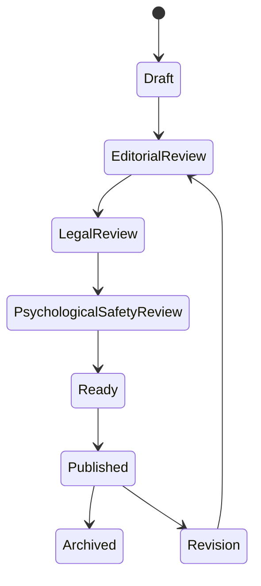
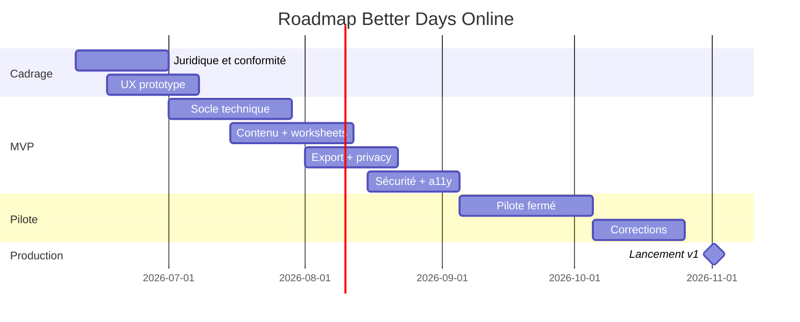

# Roadmap, tests, exploitation et gouvernance

## 1. Stratégie de réalisation

Le projet doit être construit par incréments, en commençant par un outil sûr, simple, sans IA, sans groupe public, sans claims médicaux. La priorité est de valider l’expérience d’écriture, la confidentialité, les droits de contenu et la qualité UX.

## 2. Phases recommandées

### Phase 0 — Cadrage juridique et clinique léger

Durée indicative : 2 à 4 semaines.

Livrables :

- décision de positionnement non médical ;
- revue droits d’auteur ;
- stratégie licence ;
- cartographie données ;
- décision HDS ;
- brouillon AIPD ;
- protocole crise ;
- charte éditoriale ;
- choix stack.

Critère de sortie :

- aucun développement de publication de contenu original sans statut droits défini.

### Phase 1 — Prototype UX cliquable

Livrables :

- maquettes mobile/desktop ;
- 5 modules avec contenus factices ou autorisés ;
- feuille de travail sauvegardée localement ;
- page aide immédiate ;
- test utilisateur avec 5 à 8 personnes volontaires ;
- audit accessibilité initial.

Critères :

- l’utilisateur comprend que l’outil est privé ;
- il sait passer une question ;
- il trouve la page aide immédiate ;
- il comprend le partage.

### Phase 2 — MVP technique privé

Livrables :

- auth ;
- base données ;
- catalogue ;
- modules ;
- réponses chiffrées ;
- journal ;
- plan ;
- export Markdown ;
- suppression compte ;
- back-office contenu ;
- logs et monitoring ;
- CI/CD ;
- tests E2E.

Critères :

- parcours complet de bout en bout ;
- pas de données sensibles dans logs ;
- suppression/export fonctionnels ;
- droits de publication bloquants.

### Phase 3 — Pilote contrôlé

Public : 20 à 100 utilisateurs, idéalement via association ou groupe de pairs.

Livrables :

- support ;
- collecte retours anonymisés ;
- correction bugs ;
- validation charge ;
- audit sécurité léger ;
- AIPD finalisée ;
- politique confidentialité finalisée.

Critères :

- zéro incident critique ;
- taux de sauvegarde réussi > 99,5 % ;
- page aide immédiate disponible ;
- retours utilisateurs exploitables.

### Phase 4 — Production v1

Livrables :

- durcissement sécurité ;
- hébergement cible ;
- sauvegardes testées ;
- runbooks ;
- formation admin ;
- monitoring ;
- processus support ;
- publication progressive.

### Phase 5 — v1.1 Groupes privés

Livrables :

- groupes ;
- invitations ;
- facilitateur ;
- partage volontaire ;
- charte groupe ;
- tests confidentialité.

### Phase 6 — v1.2 PWA/Offline et multilingue

Livrables :

- IndexedDB chiffrée ;
- sync ;
- conflits ;
- langues ;
- ressources par pays.

### Phase 7 — v2 IA optionnelle

Seulement après :

- validation besoins ;
- AIPD mise à jour ;
- revue AI Act ;
- tests sécurité LLM ;
- protocole crise ;
- consentement dédié ;
- contrat provider.

## 3. Planning MVP en sprints

| Sprint | Objectif | Résultat |
|---:|---|---|
| 1 | Setup projet | repo, CI, design system, DB. |
| 2 | Auth + comptes | login, sessions, paramètres. |
| 3 | Contenu | guides, modules, back-office brouillon. |
| 4 | Feuilles de travail | questions, réponses, autosave. |
| 5 | Journal + plan | entrées, plan de rétablissement. |
| 6 | Export + suppression | Markdown, demande RGPD, purge. |
| 7 | Ressources crise + accessibilité | aide immédiate, audit a11y. |
| 8 | Sécurité + pilote | hardening, monitoring, tests E2E. |

## 4. Stratégie de tests

### 4.1 Tests unitaires

Couvrir :

- validation schemas ;
- droits de contenu ;
- autorisations ;
- chiffrement/déchiffrement ;
- règles export ;
- consentements ;
- suppression logique ;
- filtrage logs.

Objectif : 80 % couverture sur domaines critiques.

### 4.2 Tests intégration

Scénarios :

- créer compte → consentir → répondre → exporter ;
- mode local → exporter ;
- publication contenu sans droits refusée ;
- partage avec contact → révocation ;
- suppression compte → données inaccessibles ;
- conflit autosave ;
- page crise sans auth.

### 4.3 Tests E2E

Outil : Playwright.

Parcours critiques :

1. inscription ;
2. module doux ;
3. module sensible avec avertissement ;
4. brouillon autosave ;
5. export ;
6. plan ;
7. suppression ;
8. page aide immédiate ;
9. back-office publication ;
10. groupe v1.1.

### 4.4 Tests accessibilité

- axe-core automatique ;
- navigation clavier manuelle ;
- lecteur écran ;
- contrastes ;
- zoom 200 % ;
- mobile ;
- test personnes concernées si possible.

### 4.5 Tests sécurité

- SAST ;
- dependency scan ;
- container scan ;
- DAST staging ;
- pentest avant production ;
- tests IDOR ;
- tests CSRF ;
- tests XSS Markdown ;
- tests rate limiting ;
- tests export URL ;
- tests admin MFA ;
- secret scanning ;
- SBOM.

### 4.6 Tests confidentialité

- vérifier aucun contenu sensible dans logs ;
- vérifier analytics sans texte ;
- vérifier export sans contenu protégé non autorisé ;
- vérifier suppression ;
- vérifier droits groupe ;
- vérifier consentement IA absent par défaut.

### 4.7 Tests de charge

Scénarios :

- 1 000 utilisateurs connectés ;
- autosave fréquent ;
- 100 exports simultanés ;
- consultation page crise ;
- import admin volumineux.

Métriques : latence p95, erreurs, saturation DB, queue jobs.

## 5. Données de test

### 5.1 Règles

- pas de données réelles hors prod ;
- générer données synthétiques ;
- textes sensibles factices ;
- pas de copier-coller de témoignages réels ;
- anonymisation irréversible si données pilote utilisées pour debug.

### 5.2 Jeu de test minimal

- 3 guides factices ;
- 20 modules factices ;
- 60 questions factices ;
- 10 utilisateurs ;
- 2 groupes ;
- 50 réponses synthétiques ;
- 5 exports.

## 6. Gouvernance contenu

### 6.1 Rôles éditoriaux

| Rôle | Responsabilité |
|---|---|
| Éditeur | prépare textes et métadonnées. |
| Relecteur | corrige langue, ton, clarté. |
| Référent pair-aidance | vérifie adéquation au vécu. |
| Référent clinique | vérifie absence de danger manifeste. |
| Juridique | valide droits. |
| Admin contenu | publie techniquement. |

### 6.2 Cycle de vie contenu

### 6.3 Versionnement

- SemVer éditorial : `major.minor.patch`.
- Major : changement substantiel ou droits.
- Minor : ajout module/question.
- Patch : correction typo.
- Les réponses restent liées à la version d’origine.

## 7. Exploitation production

### 7.1 SLO

| Service | SLO |
|---|---:|
| Auth | 99,9 % |
| API principale | 99,9 % |
| Page aide immédiate | 99,95 % |
| Autosave | 99,5 % succès |
| Export | 99 % jobs terminés < 5 min |
| Back-office | 99 % |

### 7.2 Monitoring

Dashboards :

- disponibilité ;
- latence ;
- erreurs ;
- DB connections ;
- queue depth ;
- export failures ;
- auth failures ;
- autosave failures ;
- storage ;
- coûts ;
- alertes sécurité.

### 7.3 Runbooks

Créer :

- API down ;
- DB saturation ;
- export bloqué ;
- incident auth ;
- erreur chiffrement ;
- fuite possible ;
- retrait contenu juridique ;
- page crise indisponible ;
- fournisseur e-mail down ;
- rollback release.

### 7.4 Sauvegardes

- quotidiennes minimum ;
- chiffrées ;
- test restauration mensuel ;
- séparation comptes ;
- rétention conforme ;
- purge données supprimées selon politique.

## 8. Support utilisateurs

### 8.1 Canaux

- FAQ ;
- formulaire support ;
- e-mail ;
- guide confidentialité ;
- page suppression/export ;
- documentation groupes.

### 8.2 Limites support

Le support ne doit pas :

- fournir conseil médical ;
- lire les journaux ;
- intervenir comme ligne de crise si non habilité ;
- promettre réponse 24/7 ;
- demander des détails traumatiques inutiles.

Réponse type en crise :

- encourager à contacter les urgences locales ou ressource de prévention ;
- renvoyer vers page aide immédiate ;
- rester humain et sobre.

## 9. Indicateurs de succès

### 9.1 Produit

- taux de complétion d’un module ;
- taux d’export ;
- taux de retour volontaire ;
- taux d’utilisation du plan ;
- nombre de suppressions sans friction ;
- retours qualitatifs ;
- absence de plaintes confidentialité.

### 9.2 Sécurité/conformité

- incidents critiques ;
- temps de correction vulnérabilités ;
- tests restauration réussis ;
- audit logs complets ;
- demandes RGPD traitées ;
- contenus publiés avec droits validés.

### 9.3 Accessibilité

- score automatisé ;
- bugs clavier ;
- retours personnes handicapées ;
- taux d’usage mobile ;
- temps de saisie sans perte.

## 10. Risques projet

| Risque | Probabilité | Impact | Mitigation |
|---|---:|---:|---|
| Droits d’auteur non obtenus | élevée | élevé | utiliser contenus factices/paraphrasés, négocier licence. |
| Données santé mal qualifiées | moyenne | élevé | AIPD, DPO, HDS. |
| UX déclenchante | moyenne | élevé | trauma-informed design, tests utilisateurs. |
| Fuite données | faible à moyenne | très élevé | chiffrement, ASVS, pentest. |
| Requalification dispositif médical | moyenne si claims | élevé | limiter claims, revue MDR. |
| IA dangereuse | moyenne si activée | élevé | pas d’IA MVP, garde-fous v2. |
| Support dépassé | moyenne | moyen | FAQ, limites, ressources crise. |
| Facilitateur voit trop | moyenne | élevé | partage volontaire, tests droits. |
| Notifications indiscrètes | moyenne | moyen | templates neutres. |

## 11. Budget technique relatif

| Poste | MVP | V1+ |
|---|---:|---:|
| Développement frontend | élevé | moyen |
| Backend/API | élevé | moyen |
| Sécurité/conformité | élevé | élevé |
| Hébergement | moyen à élevé si HDS | élevé |
| Contenu/licence | variable | variable |
| Support | moyen | élevé si grand public |
| IA | 0 MVP | élevé |
| Accessibilité | moyen | moyen |

## 12. Équipe recommandée

MVP :

- product owner ;
- UX/UI designer trauma-informed ;
- développeur frontend ;
- développeur backend ;
- devops/security ;
- référent conformité/DPO ;
- éditeur contenu ;
- pair aidant/référent vécu ;
- conseil juridique ponctuel.

V1+ :

- QA dédié ;
- support ;
- responsable sécurité ;
- responsable partenariats ;
- référent clinique si groupes/risque.

## 13. Definition of Done

Une fonctionnalité est terminée si :

- code review ;
- tests unitaires ;
- tests E2E si parcours critique ;
- test accessibilité ;
- logs sans données sensibles ;
- autorisations testées ;
- textes relus ;
- documentation mise à jour ;
- monitoring si production ;
- rollback possible ;
- validation sécurité si données sensibles.

## 14. Go/no-go production

Go si :

- droits contenu validés ;
- sécurité critique corrigée ;
- suppression/export OK ;
- page aide immédiate OK ;
- accessibilité critique OK ;
- backups restaurables ;
- CGU/confidentialité publiées ;
- DPO valide ;
- support prêt.

No-go si :

- contenu sans licence ;
- fuite logs ;
- suppression non fiable ;
- page crise inaccessible ;
- vulnérabilité critique ;
- confusion outil médical ;
- partage privé défectueux.

## 15. Roadmap résumée

## 16. Prochaines actions concrètes

1. Demander autorisation écrite pour usage web des contenus.
2. Décider mode de données : local-only, cloud standard ou HDS.
3. Rédiger une charte produit non médicale.
4. Créer maquette Figma mobile de 5 écrans.
5. Créer pack de contenu factice pour développement.
6. Initialiser dépôt monorepo.
7. Implémenter auth + catalogue + feuille de travail locale.
8. Faire test UX avec personnes concernées et facilitateurs.
9. Lancer AIPD.
10. Planifier audit sécurité avant pilote.
