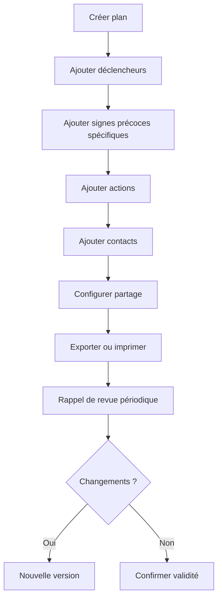
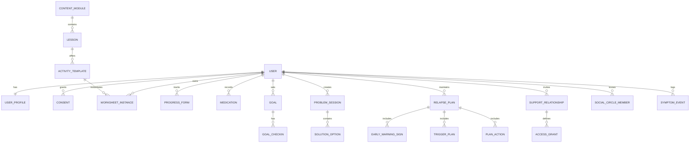
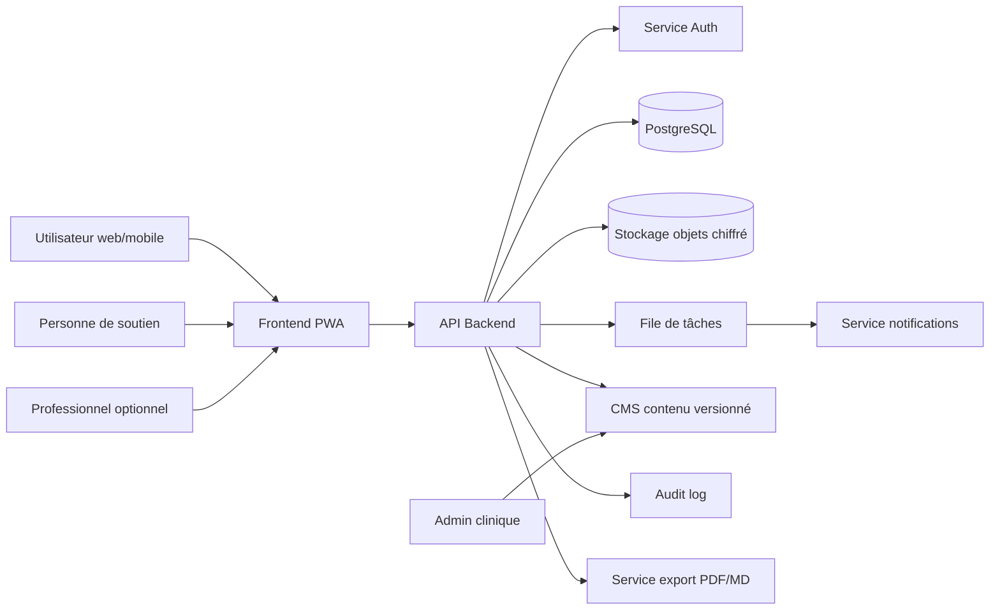
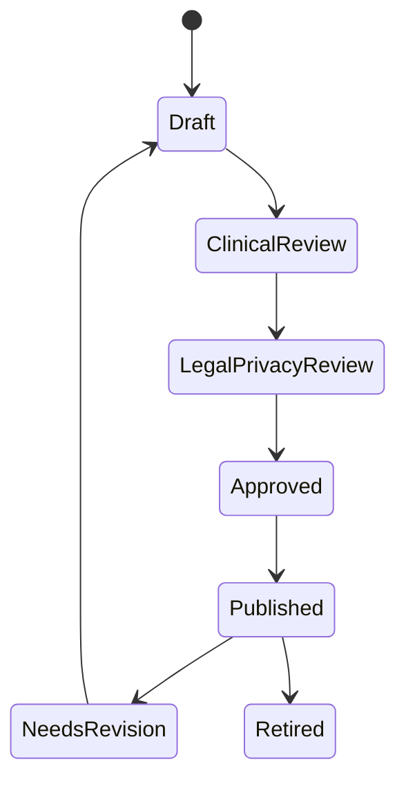

# Spécification fonctionnelle et technique exhaustive
# Application web d'utilisation en ligne du toolkit **Dealing with Psychosis**

**Version du document :** 1.0  
**Langue :** Français  
**Source fonctionnelle principale :** *Dealing with Psychosis - A toolkit for moving forward with your life*, Fraser Health / British Columbia, dernière édition indiquée dans le document : juillet 2012.  
**Objet :** convertir le toolkit papier/PDF en une application web sécurisée, accessible, interactive et utilisable par une personne vivant avec une psychose, une personne de soutien et, selon les paramètres, des professionnels de santé.

---

## 1. Résumé exécutif

Le toolkit original est un guide psychoéducatif et d'auto-soin destiné aux personnes ayant vécu une psychose et à leurs personnes de soutien. Il organise la progression autour d'un principe simple : les bons résultats reposent sur la combinaison de traitements professionnels, de soutien relationnel et de compétences pratiques. L'outil ne remplace pas le suivi par des professionnels de santé ; il accompagne ce suivi en aidant l'utilisateur à comprendre ses expériences, suivre ses progrès, prendre soin de sa santé, gérer le stress, résoudre des problèmes, fixer des objectifs, comprendre ses difficultés cognitives, renouer avec les autres, prévenir les rechutes et utiliser des stratégies non médicamenteuses complémentaires face à certains symptômes.

L'application web proposée doit transformer ces contenus et exercices en parcours numériques structurés. Elle doit permettre de remplir, sauvegarder, reprendre, partager et imprimer les feuilles de travail ; de planifier des rappels ; de suivre l'évolution de difficultés auto-évaluées ; d'élaborer un plan de prévention de rechute ; d'inviter une personne de soutien ; et de maintenir un haut niveau de confidentialité, de sécurité et de prudence clinique.

La priorité n'est pas de créer un outil médical automatisé de diagnostic ou de traitement, mais une plateforme d'accompagnement, de structuration et de continuité entre séances, avec des garde-fous forts contre toute confusion avec un avis médical.

---

## 2. Principes de conception clinique, éthique et produit

### 2.1 Finalité du produit

L'application doit :

1. fournir un accès en ligne guidé au contenu du toolkit ;
2. transformer les exercices papier en formulaires interactifs ;
3. aider l'utilisateur à suivre ses progrès dans le temps ;
4. favoriser la collaboration volontaire avec une personne de soutien ;
5. faciliter l'utilisation du toolkit en petites étapes ;
6. permettre l'export ou l'impression de certains plans importants ;
7. rappeler explicitement que les décisions médicales, en particulier concernant les médicaments, doivent être prises avec un professionnel qualifié.

### 2.2 Non-finalités

L'application ne doit pas :

- diagnostiquer une psychose ;
- déterminer si une pensée, une perception ou une expérience est réellement psychotique ;
- recommander de commencer, arrêter, augmenter ou diminuer un médicament ;
- remplacer un psychiatre, médecin, psychologue, infirmier, intervenant de crise ou service d'urgence ;
- promettre la prévention complète des rechutes ;
- inciter l'utilisateur à gérer seul des idées suicidaires, une crise aiguë ou une perte importante du contact avec la réalité.

### 2.3 Garde-fous cliniques obligatoires

L'application doit afficher et appliquer les garde-fous suivants :

- **Avertissement permanent :** l'application complète les soins professionnels et ne les remplace pas.
- **Médication :** toute modification de dose, d'horaire ou d'arrêt de médicament doit être discutée avec le prescripteur.
- **Crise ou urgence :** si l'utilisateur indique des idées suicidaires, une incapacité à faire face aux symptômes, un risque immédiat pour lui-même ou autrui, ou une détérioration rapide, l'interface doit diriger vers le plan d'urgence, les contacts de crise et les services d'urgence locaux.
- **Support Person :** la personne de soutien assiste, encourage et aide à organiser ; elle ne dirige pas les choix de l'utilisateur.
- **Données sensibles :** toutes les données de santé mentale doivent être traitées comme hautement sensibles.

### 2.4 Ton et expérience utilisateur

L'expérience doit être :

- calme, non stigmatisante et non infantilisante ;
- simple, avec des écrans courts ;
- progressive, en évitant de surcharger cognitivement l'utilisateur ;
- compatible avec une utilisation autonome ou accompagnée ;
- accessible sur ordinateur, tablette et mobile ;
- pensée pour des périodes où l'énergie, l'attention ou la mémoire peuvent être diminuées.

---

## 3. Analyse exhaustive de l'outil original

### 3.1 Public cible

Le toolkit s'adresse à deux groupes principaux :

| Public | Besoin principal | Traduction dans l'application |
|---|---|---|
| Personne en rétablissement | Comprendre la psychose, apprendre des compétences, suivre ses progrès, prévenir la rechute | Compte utilisateur principal, parcours de modules, feuilles de travail, rappels, plans exportables |
| Personne de soutien | Aider sans diriger, encourager, organiser, pratiquer certains exercices | Compte invité ou rôle lié, permissions granulaire, vues partagées, conseils spécifiques |
| Professionnel de santé, optionnel | Soutenir les exercices, revoir les plans, accompagner la médication | Portail professionnel optionnel, commentaires, validation de certains plans, export clinique |
| Administrateur de contenu | Gérer les textes, traductions, versions, ressources locales | CMS sécurisé avec validation clinique |

### 3.2 Organisation pédagogique générale

Le toolkit peut être utilisé dans n'importe quel ordre, mais il est conçu pour développer progressivement des compétences. Les exercices doivent être repris plusieurs fois, au rythme de l'utilisateur. La version web doit donc éviter un modèle linéaire obligatoire. Elle doit offrir une navigation modulaire, tout en proposant un parcours recommandé.

### 3.3 Modules de contenu et logique d'interaction

| N° | Module original | Objectif | Exercices ou sorties principales | Fonctionnalités web recommandées |
|---:|---|---|---|---|
| 1 | À propos du toolkit | Expliquer l'objectif, le rôle du soutien et la façon d'utiliser le guide | Choix d'une personne de soutien, lecture progressive | Onboarding, invitation d'une personne de soutien, préférences de rythme |
| 2 | Suivi des progrès | Mesurer une difficulté sur une échelle et suivre l'effet des stratégies | Formulaire de progrès : domaine, note avant, stratégie, note à 2 et 4 semaines | Tracker longitudinal, graphiques, rappels de réévaluation |
| 3 | Qu'est-ce que la psychose ? | Définir la psychose, présenter symptômes et facteurs associés | Liste de symptômes/problèmes, modèle à six facteurs | Psychoéducation interactive, checklists personnelles, carte des facteurs |
| 4 | Que faire face à la psychose ? | Présenter traitement, médicaments, soutien et compétences | Fiches médicaments, effets secondaires, bénéfices/inconvénients | Gestionnaire de médicaments non prescriptif, journal d'effets, questions pour professionnel |
| 5 | Prendre soin de sa santé | Sommeil, alimentation, exercice, réduction alcool/drogues | Journal de sommeil, objectifs santé, liste des effets positifs/négatifs de substances, déclencheurs | Habits tracker, objectifs, préparation aux déclencheurs |
| 6 | Gérer le stress | Relaxation et préparation | Liste d'activités relaxantes, situations stressantes à venir, plan de préparation | Bibliothèque d'exercices, rappels, scénarios de répétition, journal de stress |
| 7 | Résoudre les problèmes | Méthode en six étapes | Problème, compréhension, solutions, avantages/inconvénients, choix, action | Assistant pas-à-pas, brouillon sauvegardé, partage avec soutien |
| 8 | Fixer des objectifs et avancer | Reprendre progressivement des activités | Objectif spécifique, fréquence, moment, soutien, suivi, revue | Goal tracker, calendrier, check-ins, récompenses non monétaires |
| 9 | Comprendre la cognition | Attention, mémoire, pensée critique, cognition sociale | Checklists, stratégies personnalisées | Profils de difficultés cognitives, suggestions de stratégies, rappels contextuels |
| 10 | Se connecter aux autres | Cercle social, compétences sociales, opportunités | Carte du cercle social, forces et compétences à pratiquer, opportunités | Carte relationnelle privée, entraînement social, plan d'action social |
| 11 | Prévenir la rechute | Déclencheurs, signes précoces, plan de prévention | Plan de prévention de rechute et plan d'urgence | Plan exportable, partage, alertes, mise à jour régulière |
| 12 | Faire face aux symptômes | Distraction, vérification de réalité, remise en question de pensées irréalistes | Journal de distraction, demande de reality check, feuille de pensée | Outils rapides, contact de soutien, journal de symptômes, questions guidées |
| 13 | Félicitations | Renforcer l'effort | Message de clôture | Célébration sobre, résumé des acquis |
| 14 | Pour la personne de soutien | Conseils pour aider, rythme, organisation, soutien sans direction | Guide soutien, index, ressources | Portail soutien, micro-guides, permissions, rappels de rôle |
| 15 | Feuilles supplémentaires | Copies des principaux formulaires | Feuilles réutilisables | Bibliothèque de modèles réutilisables |
| 16 | Ressources et crédits | Ressources externes et provenance | Liens, attribution, note de non-substitution | Annuaire configurable selon pays/province, historique de contenu |

---

## 4. Modèle conceptuel clinique du toolkit

### 4.1 Formule de bon traitement

Le toolkit présente la récupération comme soutenue par trois composantes :

```text
Bon traitement = médication + soutien + compétences
```

Dans l'application, cette formule doit être représentée comme un principe pédagogique, non comme une équation clinique mesurable automatiquement.

### 4.2 Modèle à six facteurs de la psychose

Le guide propose de comprendre le déclenchement ou l'entretien de la psychose à travers six catégories qui interagissent :

1. **Situation** : stress, hostilité, conflits, événements de vie.
2. **État physique** : sommeil, substances, systèmes cérébraux, vulnérabilités biologiques.
3. **Pensées** : confusion, paranoïa, interprétations irréalistes, pensée déformée.
4. **Perceptions** : hallucinations, difficulté à filtrer l'information, sensibilité aux stimuli.
5. **Émotions** : peur excessive, émotions plates ou inadaptées, humeur élevée.
6. **Actions** : isolement, perte de motivation, retrait des activités.

#### Représentation web recommandée

- Un écran visuel en six tuiles.
- Chaque tuile contient : explication courte, exemples, champ personnel facultatif, lien vers modules associés.
- L'utilisateur peut marquer les facteurs qui semblent actuellement pertinents.
- L'outil doit éviter de conclure automatiquement qu'un facteur cause les symptômes ; il doit parler de facteurs possibles à explorer avec un professionnel.

### 4.3 Logique d'apprentissage

Le toolkit repose sur les principes suivants :

- apprentissage graduel ;
- pratique répétée ;
- écriture comme support de mémoire et d'organisation ;
- implication d'une personne de soutien ;
- objectifs petits, spécifiques et réalisables ;
- revue et ajustement plutôt qu'échec ;
- prudence lors des périodes de symptômes intenses.

---

## 5. Spécifications fonctionnelles détaillées par module

## 5.1 Module 1 - Accueil, orientation et personne de soutien

### Objectifs

- Présenter l'application.
- Expliquer qu'elle complète le traitement professionnel.
- Introduire le rôle de la personne de soutien.
- Permettre à l'utilisateur de choisir son rythme.

### Fonctionnalités

1. **Onboarding en 5 écrans maximum**
   - écran 1 : objectif de l'outil ;
   - écran 2 : limites et avertissement médical ;
   - écran 3 : choix du mode d'utilisation : seul, avec une personne de soutien, avec professionnel ;
   - écran 4 : préférences de rappel ;
   - écran 5 : choix du premier module.

2. **Gestion de la personne de soutien**
   - invitation par courriel, SMS ou lien temporaire ;
   - acceptation avec création de compte ;
   - permissions granularisées ;
   - possibilité de révoquer l'accès à tout moment ;
   - rôle affiché : soutenir, encourager, aider à organiser, ne pas diriger.

3. **Préférences d'utilisation**
   - durée souhaitée des sessions : 5, 10, 20, 30 minutes ;
   - rappels activés/désactivés ;
   - préférence d'affichage : texte court, texte complet, audio, contraste élevé ;
   - choix de langue.

### Données à collecter

- prénom ou pseudonyme ;
- fuseau horaire ;
- contacts d'urgence facultatifs ;
- préférence d'accompagnement ;
- consentements.

### Critères d'acceptation

- L'utilisateur peut terminer l'onboarding sans inviter de personne de soutien.
- L'avertissement de non-substitution médicale est visible avant toute saisie de données de santé.
- Les permissions de la personne de soutien sont désactivées par défaut sauf action explicite de l'utilisateur.

---

## 5.2 Module 2 - Suivi des progrès

### Objectifs

- Transformer le formulaire de suivi papier en outil longitudinal.
- Aider l'utilisateur à observer si une stratégie l'aide.
- Encourager la reprise régulière d'une même feuille.

### Formulaire numérique : `ProgressForm`

| Champ | Type | Obligatoire | Validation | Notes UX |
|---|---|---:|---|---|
| domaine_a_evaluer | texte court | Oui | 2-120 caractères | Exemple : mémoire, sommeil, isolement |
| note_avant | entier | Oui | 1-10 | 1 = pas de problème, 10 = problème majeur |
| strategie_utilisee | texte long | Oui | 2-1000 caractères | Peut être liée à une stratégie existante |
| date_debut | date | Oui | pas dans le futur lointain | Défaut : aujourd'hui |
| note_2_semaines | entier | Non | 1-10 | Rappel automatique à J+14 |
| note_4_semaines | entier | Non | 1-10 | Rappel automatique à J+28 |
| commentaire | texte long | Non | 0-2000 caractères | Événements, contexte, obstacles |
| partage_soutien | booléen | Oui | défaut false | Permission explicite |

### Fonctionnalités

- Création de plusieurs suivis simultanés.
- Rappels à 2 et 4 semaines.
- Graphique simple de chaque domaine.
- Export PDF/Markdown/CSV.
- Comparaison de stratégies par domaine.
- Possibilité de clore, archiver ou relancer un suivi.

### Règles métier

- La note n'est pas interprétée médicalement par l'application.
- Une hausse importante peut déclencher un message prudent : « Ce changement semble important. Pensez à en parler à votre professionnel de santé ou à votre personne de soutien. »
- Aucun score agrégé de « gravité de psychose » ne doit être calculé.

---

## 5.3 Module 3 - Qu'est-ce que la psychose ?

### Objectifs

- Expliquer la psychose en termes accessibles.
- Aider l'utilisateur à identifier des expériences personnelles sans l'étiqueter.
- Présenter symptômes, difficultés associées et modèle à six facteurs.

### Sous-modules

1. **Définition accessible**
   - difficulté à distinguer ce qui est réel de ce qui ne l'est pas ;
   - expériences fréquentes : voix, perceptions inhabituelles, pensées persistantes inhabituelles.

2. **Ce qui n'est pas nécessairement une psychose**
   - pensées inhabituelles passagères ou facilement mises de côté.

3. **Expériences possibles**
   - pensées étranges ou irréalistes qui ne disparaissent pas ;
   - entendre, voir, sentir, goûter ou ressentir des choses que d'autres ne perçoivent pas ;
   - retrait social ;
   - tristesse, anxiété, excitation inhabituelle ;
   - sommeil perturbé ;
   - difficulté à se lever ou agir ;
   - usage d'alcool ou de drogues.

4. **Six facteurs**
   - situation ;
   - état physique ;
   - pensées ;
   - perceptions ;
   - émotions ;
   - actions.

### Interface recommandée

- Le contenu doit être découpé en cartes courtes.
- Les checklists doivent utiliser un langage non jugeant : « Cela m'arrive » plutôt que « J'ai ce symptôme ».
- Chaque élément coché doit être privé par défaut.
- L'utilisateur peut ajouter ses propres mots.
- Les résultats ne doivent pas produire de diagnostic.

### Feuille de travail : `PsychosisExperienceChecklist`

| Champ | Type | Exemple |
|---|---|---|
| thoughts_unusual_text | texte long | Pensées inquiétantes ou irréalistes qui reviennent |
| perceptions_text | texte long | Voix, images, sensations inhabituelles |
| associated_problems | liste enum + autre | isolement, anxiété, sommeil, substances |
| six_factor_notes | objet | notes par facteur |
| user_language_preference | enum | termes préférés : « psychose », « épisode », « difficulté », autre |

---

## 5.4 Module 4 - Que faire face à la psychose ?

### Objectifs

- Présenter la notion de traitement combiné.
- Aider l'utilisateur à noter ses médicaments et questions.
- Encourager la discussion avec les professionnels.
- Introduire les compétences des modules suivants.

### Sous-modules

1. Médication antipsychotique et autres médicaments possibles.
2. Informations à connaître pour chaque médicament.
3. Effets secondaires possibles.
4. Raisons fréquentes d'arrêt : effets secondaires, sentiment d'aller mieux, oubli, stigmatisation.
5. Soutien et compétences.

### Composant : fiche médicament non prescriptive

| Champ | Type | Règle |
|---|---|---|
| nom_medicament | texte | Pas d'autocomplétion médicale obligatoire ; option dictionnaire local validé |
| problemes_cibles | texte | « Ce médicament est censé aider avec... » |
| dose | texte | Libre pour éviter erreurs de conversion |
| horaires | tableau | heure, note, prise avec repas oui/non |
| prescripteur | contact optionnel | Utilisé uniquement par utilisateur |
| questions_pour_professionnel | liste | Générées par l'utilisateur |
| date_derniere_mise_a_jour | date | automatique |

### Composant : effets secondaires

| Champ | Type | Notes |
|---|---|---|
| medicament_id | UUID | FK |
| effet_possible | texte | Peut venir du professionnel ou de l'utilisateur |
| effet_ressenti | texte | Saisie utilisateur |
| intensite | entier 1-10 | Auto-évaluation |
| date_debut | date | facultatif |
| urgent | booléen | Ne pas l'inférer automatiquement sauf règles locales validées |
| a_signaler_lors_du_prochain_rdv | booléen | défaut true |

### Règles de sécurité

- Afficher avant toute section médicament : « Ne modifiez jamais votre traitement sans avis du professionnel qui le prescrit. »
- Ne pas envoyer de rappels culpabilisants.
- En cas d'effet secondaire marqué, afficher : « Contactez votre professionnel de santé. Si vous pensez être en danger immédiat, utilisez les services d'urgence. »
- Les rappels de prise de médicament doivent être optionnels et configurés par l'utilisateur, non imposés.

---

## 5.5 Module 5 - Prendre soin de sa santé

### Objectifs

- Soutenir le sommeil, l'alimentation, l'activité physique.
- Aider à réfléchir à l'usage d'alcool ou de drogues sans jugement.
- Préparer les déclencheurs liés à la réduction d'usage.

### Sous-module sommeil

Fonctionnalités :

- checklist d'hygiène du sommeil ;
- journal facultatif : heure de coucher, heure de lever, réveils, sieste, caféine, écran, activité relaxante ;
- objectifs simples : horaire régulier, routine de coucher, réduction de caféine le soir ;
- lien vers module objectifs.

Champs `SleepLog` :

| Champ | Type |
|---|---|
| date | date |
| bedtime | heure optionnelle |
| wake_time | heure optionnelle |
| sleep_quality | entier 1-10 |
| caffeine_after_dinner | booléen |
| alcohol_or_nicotine_before_bed | booléen |
| nap_minutes | entier optionnel |
| notes | texte |

### Sous-module alimentation et exercice

Fonctionnalités :

- objectifs d'activité graduels ;
- suivi d'activités appréciées ;
- rappels doux ;
- association avec un ami ou une personne de soutien ;
- avertissement contre les informations de santé non validées trouvées en ligne.

Champs `ExerciseActivity` :

| Champ | Type |
|---|---|
| activity_type | texte |
| enjoyable | booléen |
| duration_minutes | entier |
| intensity_self_rated | entier 1-10 |
| with_someone | booléen |
| music_used | booléen |
| notes | texte |

### Sous-module alcool et drogues

Fonctionnalités :

- réflexion avantages/inconvénients ;
- identification des déclencheurs ;
- plan de réponse aux déclencheurs ;
- suivi des « glissements » sans jugement ;
- lien vers résolution de problème et objectifs.

Champs `SubstanceReflection` :

| Champ | Type |
|---|---|
| substance_label | texte libre |
| positive_effects | tableau texte |
| negative_effects | tableau texte |
| reduction_advantages | texte |
| triggers | tableau `TriggerPlan` |
| slips_notes | texte |

Règles de sécurité :

- Ne pas donner de conseils de sevrage médical spécifique.
- Pour dépendances importantes ou substances à risque, encourager le contact avec un professionnel.
- Ne pas afficher de contenu détaillé incitant à l'usage.

---

## 5.6 Module 6 - Gérer le stress

### Objectifs

- Apprendre plusieurs méthodes de réduction du stress.
- Pratiquer relaxation et préparation.
- Réduire la surcharge lors d'événements anticipés.

### Sous-module relaxation

Fonctionnalités :

- liste personnelle d'activités relaxantes ;
- minuteur de respiration ou relaxation ;
- journal de pratique ;
- bouton « arrêter » visible si l'exercice devient inconfortable ;
- option audio, sans déclencher automatiquement de son.

Champs `RelaxationPractice` :

| Champ | Type |
|---|---|
| technique | enum/texte : respiration, visualisation, relaxation musculaire, activité calme, autre |
| duration_minutes | entier |
| stress_before | entier 1-10 |
| stress_after | entier 1-10 |
| discomfort | booléen |
| notes | texte |

### Sous-module préparation et répétition

Fonctionnalités :

- saisie d'une situation stressante à venir ;
- plan de préparation ;
- scripts de répétition ;
- possibilité d'impliquer une personne de soutien dans un jeu de rôle ;
- estimation du niveau de stress avant/après préparation.

Champs `StressPreparationPlan` :

| Champ | Type |
|---|---|
| situation | texte |
| expected_date | date optionnelle |
| stress_rating_before | entier 1-10 |
| preparation_steps | tableau texte |
| support_person_involved | booléen |
| rehearsed | booléen |
| stress_rating_after | entier 1-10 optionnel |

---

## 5.7 Module 7 - Résoudre les problèmes

### Objectifs

- Apprendre une méthode structurée en six étapes.
- Diminuer le stress lié aux problèmes.
- Encourager les petits problèmes pour commencer.

### Parcours en six étapes

1. **Choisir le problème** : définir un problème spécifique, idéalement petit.
2. **Comprendre le problème** : qui peut aider, déjà arrivé, informations manquantes, idées associées.
3. **Trouver plusieurs solutions** : brainstorming sans jugement.
4. **Comparer les solutions** : avantages et inconvénients.
5. **Choisir la meilleure solution** : positive, réaliste, confortable, faisable rapidement.
6. **Agir** : transformer la solution en plan d'action, souvent via le module objectifs.

### Composant numérique : `ProblemSolvingSession`

| Champ | Type | Étape |
|---|---|---:|
| problem_title | texte court | 1 |
| problem_description | texte long | 1 |
| stress_rating | entier 1-10 | 1 |
| helpers | liste contacts/texte | 2 |
| previous_occurrence | texte | 2 |
| missing_information | texte | 2 |
| other_ideas | texte | 2 |
| solution_options | tableau `SolutionOption` | 3-4 |
| chosen_solution_id | UUID | 5 |
| chosen_solution_reason | texte | 5 |
| action_plan_goal_id | UUID optionnel | 6 |
| review_date | date | 6 |

`SolutionOption` :

| Champ | Type |
|---|---|
| description | texte |
| positives | texte |
| negatives | texte |
| estimated_time | texte |
| resources_needed | texte |
| comfort_rating | entier 1-10 |
| feasible | booléen |

### UX

- Sauvegarde automatique à chaque étape.
- Un seul écran par étape.
- Bouton « demander des idées à ma personne de soutien » si permission active.
- Possibilité d'ajouter plus de quatre solutions.
- Rappel : « Ne choisissez pas trop vite ; vous pouvez faire une pause. »

---

## 5.8 Module 8 - Fixer des objectifs et avancer

### Objectifs

- Aider l'utilisateur à reprendre des activités progressivement.
- Transformer les solutions en objectifs concrets.
- Créer de petites réussites qui augmentent confiance et motivation.

### Étapes

1. **Sélectionner un objectif** : petit, important, réalisable rapidement, idéalement agréable.
2. **Définir l'objectif** : spécifique, planifié, soutenu, réaliste.
3. **Avancer vers l'objectif** : calendrier, suivi, cases à cocher.
4. **Réviser l'objectif** : ajuster en cas d'obstacle, difficulté excessive ou changement d'intérêt.

### Formulaire `Goal`

| Champ | Type | Validation |
|---|---|---|
| title | texte court | 2-120 caractères |
| larger_goal_context | texte optionnel | ex. travail, santé, social |
| frequency | texte structuré | ex. 2 fois/semaine |
| exact_schedule | tableau créneaux | jour, heure, durée |
| location | texte optionnel | lieu |
| support_person_id | UUID optionnel | permission requise |
| support_action | texte | rappel, transport, encouragement |
| realistic_rating | entier 1-10 | doit encourager ajustement si très faible |
| reward | texte optionnel | récompense non monétaire possible |
| status | enum | draft, active, paused, completed, archived |

### `GoalCheckIn`

| Champ | Type |
|---|---|
| goal_id | UUID |
| scheduled_for | datetime |
| completed | booléen |
| rescheduled_to | datetime optionnel |
| barrier | texte optionnel |
| mood_after | entier 1-10 optionnel |
| note | texte |

### Règles métier

- L'application doit normaliser l'ajustement : un objectif non atteint n'est pas un échec.
- Les objectifs peuvent être réduits automatiquement sur suggestion, mais jamais modifiés sans validation de l'utilisateur.
- Les récompenses doivent être saines et non coûteuses par défaut.

---

## 5.9 Module 9 - Comprendre la cognition

### Objectifs

- Expliquer les difficultés cognitives pouvant accompagner la psychose.
- Identifier les domaines plus forts ou plus faibles.
- Proposer des stratégies compensatoires.

### Domaines couverts

1. Attention.
2. Apprentissage et mémoire.
3. Pensée critique : raisonnement, planification, organisation, résolution de problèmes, auto-surveillance.
4. Cognition sociale : lecture des indices sociaux, interprétation des comportements, hypothèses sur les pensées d'autrui.

### Fonctionnalités

- Checklists par domaine.
- Profil personnel de stratégies utiles.
- Bibliothèque de stratégies.
- Rappels contextuels : alarmes, notes, listes, routines.
- Liaison avec calendrier et objectifs.

### Exemple de mapping stratégies

| Domaine | Difficultés possibles | Stratégies numériques |
|---|---|---|
| Attention | distraction, multitâche difficile, perte du fil | minuterie courte, mode focus, tâches courtes, pause programmée |
| Mémoire | oubli de rendez-vous, médicaments, informations lues | rappels, notes rapides, listes, enregistrements vocaux, routines |
| Pensée critique | désorganisation, difficulté à commencer, décisions difficiles | découpage en étapes, priorisation, modèles de routines, assistant problème/objectif |
| Cognition sociale | malentendus, conclusions rapides | journal de situation sociale, demande d'avis à une personne de confiance, scripts de clarification |

### `CognitiveProfile`

| Champ | Type |
|---|---|
| attention_flags | liste enum |
| memory_flags | liste enum |
| critical_thinking_flags | liste enum |
| social_cognition_flags | liste enum |
| preferred_learning_conditions | objet |
| selected_strategies | tableau |
| strategy_review_dates | tableau date |

### Règles UX

- Le profil ne doit pas étiqueter l'utilisateur comme déficitaire.
- Les résultats doivent être formulés en « domaines à soutenir ».
- Le système doit recommander une ou deux stratégies à la fois, pas une liste longue.

---

## 5.10 Module 10 - Se connecter aux autres

### Objectifs

- Réduire l'isolement.
- Identifier le cercle social actuel.
- Renforcer les compétences sociales.
- Trouver des opportunités réalistes de connexion.

### Sous-module cercle social

Catégories :

- famille ;
- amis ;
- professionnels de santé ;
- autres personnes : enseignant, patron, coach, voisin, groupe.

`SocialCircleMember` :

| Champ | Type |
|---|---|
| name_or_alias | texte |
| category | enum |
| relationship | texte |
| support_level | entier 1-10 |
| contact_allowed | booléen |
| contact_info_encrypted | objet optionnel |
| notes | texte |
| visible_to_support_person | booléen |

### Sous-module compétences sociales

Compétences à suivre :

- commencer une conversation ;
- poser des questions ;
- écouter ;
- exprimer son point de vue ;
- faire un compliment ;
- répondre à une critique ;
- dire non ;
- proposer une activité ;
- être poli et remercier.

`SocialSkillPractice` :

| Champ | Type |
|---|---|
| skill | enum/texte |
| current_strength | booléen |
| needs_practice | booléen |
| practice_plan | texte |
| roleplay_with_support | booléen |
| practice_date | date |
| confidence_before | entier 1-10 |
| confidence_after | entier 1-10 |

### Sous-module opportunités

Exemples de catégories :

- reprendre contact avec une personne connue ;
- activité avec ami existant et ses connaissances ;
- groupe de soutien ;
- club ou groupe d'intérêt.

`ConnectionOpportunity` :

| Champ | Type |
|---|---|
| description | texte |
| category | enum |
| first_step | texte |
| anxiety_rating | entier 1-10 |
| goal_id | UUID optionnel |
| status | enum |

---

## 5.11 Module 11 - Prévenir la rechute

### Objectifs

- Identifier les déclencheurs modifiables.
- Reconnaître les signes précoces.
- Construire un plan de prévention de rechute.
- Prévoir un plan d'urgence.

### Déclencheurs courants à proposer

- rupture relationnelle ;
- conflits familiaux ;
- problèmes avec les amis ;
- difficultés au travail ou à l'école ;
- décès d'un proche ;
- usage d'alcool ou de drogues ;
- mauvais sommeil ;
- stress anticipé ;
- autres facteurs personnels.

### Signes précoces à proposer

- dormir trop ou trop peu ;
- anxiété ou tension ;
- concentration difficile ;
- sensibilité accrue aux sons, lumières, couleurs ;
- tristesse ;
- absence au travail ou à l'école ;
- humeur très élevée ou excitée ;
- parler plus ou moins que d'habitude ;
- perte d'intérêt pour les activités plaisantes ;
- hygiène personnelle réduite ;
- retrait familial ou amical ;
- irritabilité ;
- suspicion ;
- évitement des tâches nécessaires.

### `RelapsePreventionPlan`

| Champ | Type | Notes |
|---|---|---|
| owner_name | texte | Peut être pseudonyme |
| triggers_to_control | tableau `TriggerPlan` | Liste personnelle |
| early_warning_signs | tableau `EarlyWarningSign` | Spécifiques et observables |
| actions_when_warning_signs | tableau `PlanAction` | Actions décidées avec soutien/professionnels |
| health_professional_contacts | tableau `Contact` | chiffré |
| support_person_contacts | tableau `Contact` | chiffré |
| emergency_actions | tableau `PlanAction` | Plan d'urgence |
| shared_with | tableau `AccessGrant` | copies numériques |
| printed_at | datetime | traçabilité locale |
| last_reviewed_at | datetime | mise à jour régulière |
| next_review_at | datetime | rappel |
| professional_review_status | enum | not_requested, requested, reviewed |

`EarlyWarningSign` :

| Champ | Type | Exemple de bonne formulation |
|---|---|---|
| description | texte | « dormir 5 heures ou moins pendant 3 nuits » |
| observable | booléen | true si quelqu'un d'autre peut le voir |
| threshold | objet | durée, fréquence, intensité |
| first_seen_before | booléen | lié à un épisode antérieur |

### Règles de sécurité

- Le plan doit recommander l'implication de professionnels.
- Les actions médicamenteuses ne peuvent être ajoutées que comme texte saisi par l'utilisateur ; l'application ne propose pas de dose.
- Si l'utilisateur saisit des idées suicidaires ou « je ne peux pas faire face », afficher le plan d'urgence et les contacts de crise configurés.
- Le plan doit pouvoir être imprimé et conservé hors ligne.
- Toute modification majeure du plan doit générer une nouvelle version.

### Flux de revue



---

## 5.12 Module 12 - Faire face aux symptômes

### Objectifs

- Proposer des stratégies complémentaires lorsque certains symptômes persistent.
- Aider l'utilisateur à tester des distractions.
- Structurer une vérification de réalité avec une personne de soutien.
- Aider à questionner des pensées irréalistes ou des voix de façon prudente.

### Stratégie 1 - Se distraire

Fonctionnalités :

- bibliothèque personnelle de distractions ;
- journal d'essais ;
- notation de l'effet ;
- mise en favori des méthodes utiles ;
- combinaison de méthodes : musique + marche, hobby + appel, etc.

`DistractionAttempt` :

| Champ | Type |
|---|---|
| symptom_label | texte |
| method | texte |
| started_at | datetime |
| duration_minutes | entier |
| symptom_before | entier 1-10 |
| symptom_after | entier 1-10 |
| successful | booléen |
| notes | texte |

### Stratégie 2 - Vérification de réalité

Fonctionnalités :

- bouton rapide « demander une vérification de réalité » ;
- choix du contact de soutien ;
- message prérempli modifiable ;
- journal privé de l'expérience ;
- indication claire que la personne de soutien donne un retour, pas une vérité médicale absolue.

`RealityCheckRequest` :

| Champ | Type |
|---|---|
| description | texte |
| uncertainty_rating | entier 1-10 |
| fear_rating | entier 1-10 |
| sent_to_support_person_id | UUID |
| support_response | texte optionnel |
| outcome | enum : rassuré, encore_incertain, besoin_professionnel, urgence |
| created_at | datetime |

Règles :

- Le bouton d'urgence doit toujours être visible sur cet écran.
- Si aucune personne de soutien n'est disponible, proposer le plan de prévention, les contacts professionnels ou d'urgence configurés.
- Ne pas automatiser la réponse par IA sans validation humaine explicite ; si une aide textuelle est proposée, elle doit être limitée à des questions de clarification et à l'orientation vers les contacts.

### Stratégie 3 - Remettre en question une pensée irréaliste

Questions guidées :

1. Quelle est la pensée ?
2. Quelles preuves la soutiennent ?
3. Quelles preuves la contredisent ?
4. Puis-je obtenir plus d'informations ?
5. Quelles sont les chances qu'elle soit vraie ?
6. Si elle est vraie, que devrait-il aussi être vrai ?
7. Cette façon de penser m'aide-t-elle ou aggrave-t-elle les choses ?
8. D'autres personnes seraient-elles d'accord ?
9. Que dirait ma personne de soutien ?
10. Quelle pensée plus réaliste pourrait mieux correspondre aux faits ?

`ThoughtChallenge` :

| Champ | Type |
|---|---|
| situation_facts | texte |
| automatic_thoughts | texte |
| evidence_for | texte |
| evidence_against | texte |
| more_evidence_needed | texte |
| odds_true | texte/entier |
| implications_if_true | texte |
| usefulness_reflection | texte |
| others_perspective | texte |
| support_person_perspective | texte |
| more_realistic_thoughts | texte |
| distress_before | entier 1-10 |
| distress_after | entier 1-10 |
| shared_with_support | booléen |

### Application aux voix

Le même cadre peut être utilisé pour examiner ce qu'une voix dit, sans renforcer son autorité. Le formulaire doit parler de « ce que la voix dit » et non de « vérité de la voix ». L'objectif est de réduire son pouvoir émotionnel, pas de débattre longuement pendant une crise sévère.

### Avertissement spécifique

Avant ce sous-module, afficher :

> Cette technique peut être très difficile lorsque les symptômes sont intenses. Utilisez-la plutôt lorsque vous vous sentez suffisamment stable, et demandez l'aide de votre personne de soutien ou d'un professionnel. Si vous vous sentez en danger ou incapable de faire face, utilisez votre plan d'urgence.

---

## 5.13 Module 13 - Félicitations et consolidation

### Objectifs

- Renforcer l'effort.
- Résumer les modules complétés.
- Proposer une maintenance douce.

### Fonctionnalités

- écran de synthèse : modules commencés, feuilles créées, objectifs actifs ;
- message d'encouragement sobre ;
- suggestions de revue : plan de rechute, objectifs, progrès ;
- export d'un « dossier personnel de compétences ».

---

## 5.14 Module 14 - Portail personne de soutien

### Objectifs

- Expliquer comment aider efficacement.
- Permettre une collaboration limitée et consentie.
- Prévenir la prise de contrôle par la personne de soutien.

### Principes affichés à la personne de soutien

- Vous êtes un soutien, pas un directeur.
- Suivez le rythme de la personne en rétablissement.
- Commencez par de petits changements.
- Encouragez et donnez des retours positifs.
- Aidez à organiser, planifier, retrouver les feuilles et pratiquer.
- Évitez le jugement et les débats sur l'exactitude des symptômes.
- En cas de signes de crise, aidez à activer le plan convenu et les ressources professionnelles.

### Fonctionnalités

1. **Tableau de bord soutien**
   - modules partagés ;
   - demandes de vérification de réalité ;
   - objectifs où le soutien est impliqué ;
   - plan de prévention partagé ;
   - rappels de rôle.

2. **Actions autorisées selon permission**
   - lire une feuille partagée ;
   - commenter ;
   - répondre à une demande de vérification ;
   - recevoir un rappel d'objectif ;
   - accéder au plan d'urgence partagé ;
   - proposer une idée, sans modifier directement sauf autorisation explicite.

3. **Actions interdites par défaut**
   - voir toutes les données ;
   - modifier un médicament ;
   - modifier le plan de rechute sans validation de l'utilisateur ;
   - consulter des journaux privés non partagés ;
   - inviter d'autres personnes.

### `SupportRelationship`

| Champ | Type |
|---|---|
| user_id | UUID |
| support_user_id | UUID |
| relationship_label | texte |
| status | enum : invited, active, paused, revoked |
| permissions | JSON |
| created_at | datetime |
| revoked_at | datetime optionnel |
| emergency_access_enabled | booléen |
| emergency_access_scope | enum : contacts_only, relapse_plan, full_shared_plan |

---

## 6. Feuilles de travail : inventaire exhaustif et transformation numérique

| Feuille papier | Module | Entité numérique | Particularités |
|---|---|---|---|
| Formulaire de progrès | Suivi des progrès | `ProgressForm` | Notes 1-10 avant, 2 semaines, 4 semaines |
| Symptômes/problèmes possibles | Qu'est-ce que la psychose | `PsychosisExperienceChecklist` | Texte libre + checkboxes |
| Mes médicaments | Que faire | `Medication` | Non prescriptif, à remplir avec professionnel |
| Effets secondaires possibles | Que faire | `MedicationSideEffect` | Signaler au professionnel |
| Comment la médication m'a aidé / ce que je n'aime pas | Que faire | `MedicationReflection` | Bénéfices et préoccupations |
| Effets positifs/négatifs alcool/drogues | Santé | `SubstanceReflection` | Entretien motivationnel léger, non jugeant |
| Déclencheurs d'usage et réponses | Santé | `TriggerPlan` | Peut alimenter plan de rechute |
| Activités relaxantes | Stress | `RelaxationPreference` | Liste personnelle |
| Situation stressante à venir | Stress | `StressPreparationPlan` | Répétition, personne de soutien |
| Problème choisi | Résolution de problème | `ProblemSolvingSession` | Étape 1 |
| Questions sur le problème | Résolution de problème | `ProblemUnderstanding` | Étape 2 |
| Quatre solutions | Résolution de problème | `SolutionOption[]` | Étape 3 |
| Avantages/inconvénients | Résolution de problème | `SolutionOption` | Étape 4 |
| Choix de la solution | Résolution de problème | `ChosenSolution` | Étape 5 |
| Action | Résolution de problème | `Goal` ou `ActionPlan` | Étape 6 |
| Objectif | Objectifs | `Goal` | Fréquence, moment, soutien |
| Préférences d'apprentissage | Cognition | `LearningPreferenceChecklist` | Conditions d'apprentissage |
| Difficultés de mémoire | Cognition | `CognitiveProfile.memory_flags` | Checklist |
| Pensée critique | Cognition | `CognitiveProfile.critical_flags` | Checklist |
| Cognition sociale | Cognition | `CognitiveProfile.social_flags` | Checklist |
| Cercle social | Connexion | `SocialCircleMember[]` | Carte relationnelle |
| Compétences sociales | Connexion | `SocialSkillPractice` | Forces + compétences à pratiquer |
| Opportunités de connexion | Connexion | `ConnectionOpportunity` | Convertibles en objectifs |
| Déclencheurs de psychose | Prévention rechute | `TriggerPlan[]` | Contrôle des déclencheurs |
| Signes précoces | Prévention rechute | `EarlyWarningSign[]` | Spécifiques et observables |
| Plan de prévention de rechute | Prévention rechute | `RelapsePreventionPlan` | Export, partage, révision |
| Journal de distraction | Symptômes | `DistractionAttempt` | Effet sur symptôme, favori |
| Remise en question de pensée | Symptômes | `ThoughtChallenge` | Situation, pensées, preuves, alternative |
| Questions de pensée | Symptômes | `ThoughtQuestionResponse` | Peut être intégré au précédent |

---

## 7. Architecture d'information et navigation

### 7.1 Sitemap utilisateur principal

```text
/
├── Accueil
├── Onboarding
├── Tableau de bord
│   ├── Continuer le dernier module
│   ├── Mes rappels
│   ├── Mes plans importants
│   └── Bouton aide / urgence
├── Modules
│   ├── À propos
│   ├── Suivi des progrès
│   ├── Qu'est-ce que la psychose ?
│   ├── Que faire ?
│   ├── Santé
│   ├── Stress
│   ├── Résolution de problèmes
│   ├── Objectifs
│   ├── Cognition
│   ├── Connexion aux autres
│   ├── Prévention rechute
│   ├── Symptômes
│   └── Félicitations
├── Mes feuilles
├── Mes objectifs
├── Mon plan de prévention
├── Personnes de soutien
├── Ressources
├── Paramètres
└── Exporter mes données
```

### 7.2 Sitemap personne de soutien

```text
/support
├── Invitation / acceptation
├── Tableau de bord soutien
├── Conseils de rôle
├── Éléments partagés
│   ├── Objectifs partagés
│   ├── Feuilles partagées
│   ├── Demandes de vérification de réalité
│   └── Plan de prévention partagé
├── Ressources
└── Paramètres / se retirer
```

### 7.3 Sitemap professionnel optionnel

```text
/pro
├── Tableau de bord patients consentants
├── Plans à revoir
├── Commentaires sécurisés
├── Export clinique
├── Gestion des ressources locales
└── Paramètres organisation
```

---

## 8. Parcours utilisateurs clés

### 8.1 Premier usage autonome

1. L'utilisateur ouvre l'application.
2. Il lit l'avertissement et accepte les conditions.
3. Il choisit « utiliser seul pour l'instant ».
4. Il sélectionne un rythme de 10 minutes.
5. Il commence par « Suivi des progrès » ou un module recommandé.
6. Il remplit une première feuille.
7. Il reçoit une proposition de rappel à deux semaines.
8. Il peut exporter ou garder privé.

### 8.2 Usage avec personne de soutien

1. L'utilisateur invite une personne de confiance.
2. La personne accepte son rôle et lit les règles.
3. L'utilisateur choisit ce qu'il partage : objectifs, plan de rechute, demandes de vérification.
4. La personne de soutien peut commenter ou répondre uniquement aux éléments partagés.
5. L'utilisateur peut révoquer l'accès immédiatement.

### 8.3 Création d'un plan de prévention de rechute

1. L'utilisateur ouvre le module prévention.
2. Il ajoute déclencheurs et plans de contrôle.
3. Il ajoute signes précoces spécifiques et observables.
4. Il ajoute actions à prendre.
5. Il ajoute contacts de santé et soutien.
6. Il ajoute un plan d'urgence.
7. Il peut demander revue par professionnel.
8. Il partage avec personnes choisies.
9. Il imprime ou exporte.
10. Il reçoit un rappel de revue.

### 8.4 Demande de vérification de réalité

1. L'utilisateur appuie sur « Je ne suis pas sûr que ce soit réel ».
2. L'application affiche un écran calme avec trois options : contacter soutien, ouvrir plan de prévention, aide urgente.
3. L'utilisateur décrit brièvement l'expérience.
4. Il choisit une personne de soutien.
5. La personne reçoit une demande avec consignes : répondre calmement, ne pas débattre, encourager le plan si besoin.
6. La réponse est enregistrée si l'utilisateur le souhaite.
7. L'application propose de noter l'effet ou de contacter un professionnel.

---

## 9. Exigences fonctionnelles transversales

### 9.1 Comptes et profils

- Authentification par courriel + mot de passe, passkey ou SSO organisationnel.
- MFA disponible et recommandé.
- Pseudonyme autorisé.
- L'utilisateur peut utiliser l'application sans renseigner de diagnostic.
- Suppression de compte et export des données disponibles.

### 9.2 Gestion du contenu

- Les modules doivent être stockés dans un CMS versionné.
- Chaque élément de contenu doit avoir : identifiant stable, version, langue, statut de validation, auteur, date de revue.
- Le contenu clinique doit passer par une validation éditoriale et clinique avant publication.
- Le système doit permettre plusieurs variantes locales : ressources d'urgence, contacts, terminologie.

### 9.3 Moteur de feuilles de travail

- Les feuilles doivent être définies par schéma, non codées en dur.
- Chaque feuille doit supporter : brouillon, validation, sauvegarde automatique, partage, export, duplication, archivage.
- Chaque champ sensible doit pouvoir être marqué comme non partageable.
- Les feuilles doivent être utilisables hors ligne dans la PWA, avec synchronisation ultérieure.

### 9.4 Notifications

Canaux :

- notification web push ;
- courriel ;
- SMS optionnel ;
- notification in-app.

Types :

- rappel de réévaluation à 2 et 4 semaines ;
- rappel d'objectif ;
- revue du plan de prévention ;
- invitation ou réponse de personne de soutien ;
- rappel de session courte.

Règles :

- opt-in explicite ;
- contenu discret pour préserver la confidentialité ;
- pas de mention sensible dans les notifications verrouillées ;
- plage horaire silencieuse ;
- bouton désactiver facilement.

### 9.5 Export et impression

Formats :

- PDF imprimable ;
- Markdown ;
- CSV pour données tabulaires ;
- JSON complet pour portabilité ;
- ZIP chiffré pour export global.

Documents prioritaires à imprimer :

- plan de prévention de rechute ;
- contacts d'urgence ;
- objectifs actifs ;
- liste de stratégies utiles ;
- fiche médicaments à discuter avec professionnel.

### 9.6 Recherche

- Recherche plein texte dans les modules.
- Recherche dans ses propres feuilles, désactivable.
- Index local chiffré côté client si possible pour données personnelles.
- Aucune donnée personnelle ne doit être envoyée à un moteur externe.

---

## 10. Modèle de données détaillé

### 10.1 Diagramme entité-relation simplifié



### 10.2 Tables principales

#### `users`

| Colonne | Type | Contraintes |
|---|---|---|
| id | UUID | PK |
| email | citext | unique, nullable si SSO/pseudonyme local |
| password_hash | text | nullable si passkey/SSO |
| auth_provider | text | local, oidc, passkey |
| status | enum | active, suspended, deleted_pending |
| created_at | timestamptz | not null |
| updated_at | timestamptz | not null |
| last_login_at | timestamptz | nullable |

#### `user_profiles`

| Colonne | Type | Notes |
|---|---|---|
| user_id | UUID | PK/FK |
| display_name | text | pseudonyme possible |
| locale | text | fr-CA, fr-FR, en-CA |
| timezone | text | IANA |
| preferred_session_length | int | minutes |
| crisis_region | text | pour ressources locales |
| accessibility_settings | jsonb | contraste, taille texte, audio |
| onboarding_completed_at | timestamptz | nullable |

#### `consents`

| Colonne | Type |
|---|---|
| id | UUID |
| user_id | UUID |
| consent_type | enum : terms, privacy, data_processing, support_share, research_optional |
| version | text |
| granted | boolean |
| granted_at | timestamptz |
| revoked_at | timestamptz nullable |
| ip_hash | text nullable |

#### `content_modules`

| Colonne | Type |
|---|---|
| id | UUID |
| slug | text unique |
| title | jsonb par langue |
| summary | jsonb par langue |
| order_index | int |
| recommended_duration_min | int |
| clinical_review_status | enum |
| content_version | text |
| published_at | timestamptz |

#### `lessons`

| Colonne | Type |
|---|---|
| id | UUID |
| module_id | UUID |
| slug | text |
| title | jsonb |
| body_blocks | jsonb |
| order_index | int |
| safety_level | enum : normal, medication, symptoms, relapse, emergency |

#### `activity_templates`

| Colonne | Type |
|---|---|
| id | UUID |
| lesson_id | UUID |
| template_type | enum |
| title | jsonb |
| schema_json | jsonb |
| ui_schema_json | jsonb |
| scoring_rules | jsonb nullable |
| shareable | boolean |
| exportable | boolean |

#### `worksheet_instances`

| Colonne | Type |
|---|---|
| id | UUID |
| user_id | UUID |
| template_id | UUID |
| title | text |
| data_encrypted | bytea ou jsonb chiffré applicativement |
| status | enum : draft, completed, archived |
| created_at | timestamptz |
| updated_at | timestamptz |
| completed_at | timestamptz nullable |
| version | int |

#### `access_grants`

| Colonne | Type |
|---|---|
| id | UUID |
| owner_user_id | UUID |
| grantee_user_id | UUID |
| resource_type | text |
| resource_id | UUID |
| permissions | jsonb : read, comment, respond, export |
| expires_at | timestamptz nullable |
| revoked_at | timestamptz nullable |

#### `audit_logs`

| Colonne | Type |
|---|---|
| id | UUID |
| actor_user_id | UUID nullable |
| target_user_id | UUID nullable |
| action | text |
| resource_type | text |
| resource_id | UUID nullable |
| metadata | jsonb minimisé |
| created_at | timestamptz |
| ip_hash | text nullable |

### 10.3 Tables métier spécialisées

#### `progress_forms`

| Colonne | Type |
|---|---|
| id | UUID |
| user_id | UUID |
| area | text |
| before_rating | smallint |
| strategy_used | text |
| started_at | date |
| rating_2w | smallint nullable |
| rating_2w_at | date nullable |
| rating_4w | smallint nullable |
| rating_4w_at | date nullable |
| notes_encrypted | bytea |

#### `medications`

| Colonne | Type |
|---|---|
| id | UUID |
| user_id | UUID |
| name_encrypted | bytea |
| purpose_encrypted | bytea |
| dose_text_encrypted | bytea |
| schedule_encrypted | bytea |
| prescriber_contact_id | UUID nullable |
| active | boolean |
| created_at | timestamptz |
| updated_at | timestamptz |

#### `medication_side_effect_logs`

| Colonne | Type |
|---|---|
| id | UUID |
| medication_id | UUID |
| user_id | UUID |
| possible_effect_text | text |
| experienced_effect_text_encrypted | bytea |
| intensity | smallint nullable |
| report_next_visit | boolean |
| created_at | timestamptz |

#### `goals`

| Colonne | Type |
|---|---|
| id | UUID |
| user_id | UUID |
| title | text |
| description | text |
| frequency_rule | jsonb |
| schedule | jsonb |
| support_user_id | UUID nullable |
| support_action | text nullable |
| reward | text nullable |
| status | enum |
| created_at | timestamptz |
| archived_at | timestamptz nullable |

#### `relapse_plans`

| Colonne | Type |
|---|---|
| id | UUID |
| user_id | UUID |
| name | text |
| version | int |
| status | enum : draft, active, superseded, archived |
| emergency_actions_encrypted | bytea |
| contacts_encrypted | bytea |
| last_reviewed_at | timestamptz nullable |
| next_review_at | timestamptz nullable |
| created_at | timestamptz |
| updated_at | timestamptz |

#### `symptom_events`

| Colonne | Type |
|---|---|
| id | UUID |
| user_id | UUID |
| label | text |
| type | enum : voice, unusual_thought, visual, other |
| intensity | smallint |
| distress | smallint |
| occurred_at | timestamptz |
| notes_encrypted | bytea |

---

## 11. API REST proposée

### 11.1 Conventions

- Base URL : `/api/v1`.
- Authentification : Bearer token avec rotation refresh token ou session httpOnly.
- Tous les endpoints retournent JSON.
- Les erreurs suivent RFC-like `problem+json` : `type`, `title`, `status`, `detail`, `instance`, `code`.
- Les données sensibles sont minimisées dans les réponses.

### 11.2 Authentification

| Méthode | Route | Description |
|---|---|---|
| POST | `/auth/register` | Créer un compte |
| POST | `/auth/login` | Connexion |
| POST | `/auth/logout` | Déconnexion |
| POST | `/auth/refresh` | Renouveler jeton |
| POST | `/auth/passkeys/register/start` | Début passkey |
| POST | `/auth/passkeys/register/finish` | Fin passkey |
| POST | `/auth/mfa/enable` | Activer MFA |
| POST | `/auth/password/reset` | Réinitialisation |

### 11.3 Profil et consentements

| Méthode | Route | Description |
|---|---|---|
| GET | `/me` | Profil courant |
| PATCH | `/me` | Modifier préférences |
| GET | `/me/consents` | Lire consentements |
| POST | `/me/consents` | Accorder/révoquer consentement |
| POST | `/me/export` | Demander export des données |
| DELETE | `/me` | Demander suppression |

### 11.4 Contenu

| Méthode | Route | Description |
|---|---|---|
| GET | `/modules` | Liste modules publiés |
| GET | `/modules/{slug}` | Détail module |
| GET | `/modules/{slug}/lessons/{lessonSlug}` | Leçon |
| POST | `/modules/{slug}/progress` | Marquer progression |

### 11.5 Feuilles de travail génériques

| Méthode | Route | Description |
|---|---|---|
| GET | `/worksheet-templates` | Liste modèles |
| POST | `/worksheets` | Créer instance |
| GET | `/worksheets` | Liste instances utilisateur |
| GET | `/worksheets/{id}` | Lire instance |
| PATCH | `/worksheets/{id}` | Sauvegarder brouillon |
| POST | `/worksheets/{id}/complete` | Marquer complété |
| POST | `/worksheets/{id}/share` | Partager |
| DELETE | `/worksheets/{id}/share/{grantId}` | Révoquer partage |
| POST | `/worksheets/{id}/export` | Export PDF/MD |

### 11.6 Suivi des progrès

| Méthode | Route | Description |
|---|---|---|
| POST | `/progress-forms` | Créer suivi |
| GET | `/progress-forms` | Lister suivis |
| PATCH | `/progress-forms/{id}` | Mettre à jour notes |
| POST | `/progress-forms/{id}/schedule-reminders` | Rappels 2/4 semaines |

### 11.7 Médication

| Méthode | Route | Description |
|---|---|---|
| POST | `/medications` | Ajouter fiche médicament |
| GET | `/medications` | Liste médicaments |
| PATCH | `/medications/{id}` | Modifier fiche |
| POST | `/medications/{id}/side-effects` | Journal effet secondaire |
| GET | `/medications/{id}/side-effects` | Lire effets |
| POST | `/medications/export` | Export à discuter avec professionnel |

### 11.8 Objectifs

| Méthode | Route | Description |
|---|---|---|
| POST | `/goals` | Créer objectif |
| GET | `/goals` | Liste objectifs |
| PATCH | `/goals/{id}` | Modifier objectif |
| POST | `/goals/{id}/checkins` | Ajouter point de suivi |
| POST | `/goals/{id}/pause` | Mettre en pause |
| POST | `/goals/{id}/complete` | Terminer |

### 11.9 Résolution de problèmes

| Méthode | Route | Description |
|---|---|---|
| POST | `/problem-sessions` | Créer session |
| GET | `/problem-sessions` | Lister sessions |
| PATCH | `/problem-sessions/{id}` | Sauver étape |
| POST | `/problem-sessions/{id}/solutions` | Ajouter solution |
| PATCH | `/problem-sessions/{id}/solutions/{solutionId}` | Modifier solution |
| POST | `/problem-sessions/{id}/choose-solution` | Choisir solution |
| POST | `/problem-sessions/{id}/convert-to-goal` | Créer objectif depuis solution |

### 11.10 Plan de prévention

| Méthode | Route | Description |
|---|---|---|
| POST | `/relapse-plans` | Créer plan |
| GET | `/relapse-plans/current` | Plan actif |
| PATCH | `/relapse-plans/{id}` | Modifier brouillon |
| POST | `/relapse-plans/{id}/activate` | Activer version |
| POST | `/relapse-plans/{id}/share` | Partager plan |
| POST | `/relapse-plans/{id}/export` | Exporter/imprimer |
| POST | `/relapse-plans/{id}/review` | Marquer revu |

### 11.11 Symptômes

| Méthode | Route | Description |
|---|---|---|
| POST | `/symptom-events` | Journal symptôme |
| POST | `/distraction-attempts` | Enregistrer distraction |
| POST | `/reality-checks` | Demander vérification |
| PATCH | `/reality-checks/{id}` | Ajouter résultat |
| POST | `/thought-challenges` | Créer feuille de pensée |
| GET | `/thought-challenges` | Lister feuilles |

### 11.12 Personnes de soutien

| Méthode | Route | Description |
|---|---|---|
| POST | `/support/invitations` | Inviter |
| POST | `/support/invitations/{token}/accept` | Accepter |
| GET | `/support/relationships` | Lister relations |
| PATCH | `/support/relationships/{id}` | Modifier permissions |
| DELETE | `/support/relationships/{id}` | Révoquer |
| GET | `/support/shared-items` | Vue soutien |
| POST | `/support/reality-checks/{id}/respond` | Répondre |

### 11.13 Exemple de payload : plan de prévention

```json
{
  "name": "Mon plan de prévention",
  "triggers_to_control": [
    {
      "description": "Sommeil irrégulier",
      "control_plan": "Me coucher à une heure régulière et demander un rappel doux si je décale plusieurs soirs."
    }
  ],
  "early_warning_signs": [
    {
      "description": "Dormir moins de 5 heures pendant 3 nuits de suite",
      "observable": true,
      "threshold": { "duration_days": 3, "max_sleep_hours": 5 }
    }
  ],
  "actions_when_warning_signs": [
    {
      "description": "Contacter ma personne de soutien et mon professionnel référent",
      "requires_professional": true
    }
  ],
  "emergency_actions": [
    {
      "description": "Utiliser les contacts d'urgence locaux si je ne peux pas faire face aux symptômes."
    }
  ]
}
```

---

## 12. Schémas de contenu et moteur de formulaires

### 12.1 Format de module CMS

```yaml
id: module_stress
slug: gerer-le-stress
title:
  fr: Gérer le stress
  en: Managing Stress
summary:
  fr: Apprendre la relaxation et la préparation aux situations stressantes.
order: 6
recommended_duration_min: 20
safety_level: normal
lessons:
  - slug: introduction
    title:
      fr: Pourquoi gérer le stress ?
    blocks:
      - type: paragraph
        text:
          fr: "Le stress peut aggraver les difficultés. Ce module propose plusieurs stratégies à essayer progressivement."
      - type: callout
        tone: calm
        text:
          fr: "Essayez une stratégie quelque temps, puis adaptez."
  - slug: relaxation
    title:
      fr: Relaxation
    activities:
      - template_ref: relaxation_practice
```

### 12.2 Format de feuille de travail

```json
{
  "id": "thought_challenge_v1",
  "title": { "fr": "Remettre en question une pensée" },
  "version": "1.0.0",
  "fields": [
    {
      "id": "situation_facts",
      "type": "textarea",
      "label": { "fr": "Situation : écrivez seulement les faits" },
      "required": true,
      "maxLength": 2000
    },
    {
      "id": "automatic_thoughts",
      "type": "textarea",
      "label": { "fr": "Mes pensées" },
      "required": true,
      "maxLength": 3000
    },
    {
      "id": "more_realistic_thoughts",
      "type": "textarea",
      "label": { "fr": "Pensées plus réalistes" },
      "required": false,
      "maxLength": 3000
    }
  ],
  "safety": {
    "warning": "Cette technique peut être difficile lorsque les symptômes sont intenses. Demandez du soutien si nécessaire.",
    "showEmergencyButton": true
  }
}
```

### 12.3 Moteur de rendu

Le moteur de formulaires doit :

- générer UI depuis JSON Schema + UI Schema ;
- sauvegarder chaque champ automatiquement ;
- fonctionner hors ligne ;
- valider côté client et côté serveur ;
- gérer les versions de schémas ;
- migrer les anciennes instances si le modèle change ;
- permettre l'export avec mise en page fidèle et lisible.

---

## 13. Architecture technique recommandée

### 13.1 Vue d'ensemble



### 13.2 Frontend

Technologies possibles :

- Next.js ou React avec rendu hybride ;
- TypeScript strict ;
- PWA avec service worker ;
- IndexedDB chiffré pour brouillons hors ligne ;
- React Hook Form ou équivalent pour formulaires ;
- Zod/Yup pour validation client ;
- i18n avec ICU MessageFormat ;
- Design system interne sobre.

Exigences frontend :

- temps de chargement initial faible ;
- mode basse stimulation ;
- police et taille ajustables ;
- contraste élevé ;
- navigation clavier ;
- sauvegarde automatique visible ;
- bouton de sortie rapide si contexte sensible ;
- pas d'animations intrusives.

### 13.3 Backend

Technologies possibles :

- Node.js/NestJS ou Python/FastAPI ;
- API REST versionnée ;
- validation serveur stricte ;
- chiffrement applicatif pour champs très sensibles ;
- jobs asynchrones pour exports et notifications ;
- séparation claire des services : auth, contenu, feuilles, partage, notifications, export.

### 13.4 Base de données

- PostgreSQL recommandé.
- UUID pour identifiants.
- Row-Level Security possible pour isoler les locataires/organisations.
- JSONB pour schémas de formulaires et préférences.
- Chiffrement applicatif des champs sensibles avant insertion.
- Index partiels pour ressources actives.
- Audit immuable sur accès aux données partagées.

### 13.5 Stockage fichiers

- Stockage objet compatible S3.
- Chiffrement côté serveur + clé applicative pour exports sensibles.
- URLs signées à durée courte.
- Expiration automatique des exports temporaires.
- Aucun export public.

### 13.6 Notifications

- Queue : BullMQ, Celery, Sidekiq ou équivalent.
- Templates de notification discrets.
- Désactivation par canal.
- Journal d'envoi sans détails sensibles.

### 13.7 Déploiement

Options :

- conteneurs Docker ;
- Kubernetes ou plateforme PaaS certifiée santé selon juridiction ;
- IaC : Terraform/OpenTofu ;
- environnements : dev, staging, preprod, prod ;
- CI/CD avec tests, scan dépendances, SAST, migration contrôlée ;
- feature flags pour déploiements progressifs.

### 13.8 Observabilité

- logs structurés sans données sensibles ;
- traces distribuées ;
- métriques techniques : latence, erreurs, saturation ;
- métriques produit anonymisées ;
- alertes incident ;
- tableau de bord sécurité : échecs login, accès refusés, exports.

---

## 14. Sécurité, confidentialité et conformité

### 14.1 Classification des données

| Classe | Exemples | Protection |
|---|---|---|
| Publique | contenu général du module | CDN possible |
| Interne | configuration, ressources locales | accès admin |
| Personnelle | nom, courriel, préférences | chiffrement, contrôle accès |
| Santé mentale sensible | symptômes, médicaments, plan rechute, pensées, contacts | chiffrement fort, accès minimal, audit |
| Urgence | contacts, actions de crise | chiffré, mais rapidement accessible à l'utilisateur |

### 14.2 Authentification

- Mots de passe hashés avec Argon2id ou équivalent moderne.
- Passkeys recommandées.
- MFA optionnelle, obligatoire pour professionnels/admins.
- Sessions avec cookies httpOnly, Secure, SameSite.
- Rotation des refresh tokens.
- Détection d'activité inhabituelle.

### 14.3 Autorisation

Modèle hybride RBAC + ABAC :

- rôles : user, support_person, clinician, content_admin, org_admin, super_admin ;
- attributs : relation active, consentement, ressource partagée, expiration, type d'urgence ;
- principe du moindre privilège.

Exemple de politique :

```pseudo
allow read worksheet if
  actor.id == worksheet.owner_id
  OR exists AccessGrant where
    grant.resource_id == worksheet.id
    AND grant.grantee_user_id == actor.id
    AND grant.permissions.read == true
    AND grant.revoked_at is null
    AND (grant.expires_at is null OR grant.expires_at > now)
```

### 14.4 Chiffrement

- TLS 1.2+ ou supérieur pour le transport.
- Chiffrement au repos au niveau disque/base.
- Chiffrement applicatif pour champs hautement sensibles.
- Gestion des clés via KMS/HSM.
- Rotation de clés planifiée.
- Séparation des clés par environnement.

### 14.5 Confidentialité par défaut

- Les journaux de symptômes, pensées, médicaments et notes privées ne sont jamais partagés par défaut.
- Les notifications ne mentionnent pas « psychose », « médicament » ou contenu sensible sans consentement explicite.
- Les exports expirent.
- L'utilisateur peut masquer rapidement l'application.
- L'utilisateur peut supprimer ou archiver des entrées.

### 14.6 Journalisation et audit

À auditer :

- connexion/déconnexion ;
- invitation de soutien ;
- acceptation/révocation d'accès ;
- lecture d'une ressource partagée par un tiers ;
- export ;
- modification du plan de prévention ;
- actions administratives ;
- changement de contenu publié.

Ne pas journaliser :

- contenu complet des pensées, symptômes, médicaments ;
- messages de vérification de réalité en clair ;
- données sensibles dans logs d'erreur.

### 14.7 Rétention et suppression

- Politique configurable selon juridiction.
- Suppression logique immédiate puis purge physique différée.
- Exports supprimés automatiquement après délai court.
- Audit conservé sous forme minimisée.
- L'utilisateur doit pouvoir exporter avant suppression.

### 14.8 Conformité à valider

Selon le pays, la province ou l'organisation, vérifier :

- RGPD si utilisateurs dans l'Union européenne ;
- exigences canadiennes/provinciales de protection des renseignements personnels de santé si déploiement au Canada ;
- HIPAA si entité couverte ou partenaire aux États-Unis ;
- règles locales de conservation de dossiers de santé ;
- exigences de consentement pour mineurs ou jeunes adultes ;
- exigences d'hébergement et de résidence des données.

Ce document ne constitue pas un avis juridique ; une analyse par un juriste spécialisé et une évaluation d'impact relative à la vie privée sont nécessaires avant lancement.

---

## 15. Sécurité clinique et gestion des risques

### 15.1 Matrice de risques

| Risque | Exemple | Impact | Mitigation |
|---|---|---|---|
| Confusion avec avis médical | L'utilisateur modifie son médicament seul | Élevé | avertissements, pas de recommandations, export pour professionnel |
| Retard de prise en charge urgente | L'utilisateur utilise l'app pendant crise sévère | Élevé | bouton urgence, plan d'urgence, détection mots-clés prudente |
| Surpartage involontaire | Personne de soutien voit pensées privées | Élevé | privé par défaut, permissions granulaire, prévisualisation |
| Renforcement de pensées irréalistes | Outil de pensée utilisé en crise intense | Moyen/élevé | avertissement, soutien humain, pas d'IA validant contenu délirant |
| Surcharge cognitive | Trop de contenu à la fois | Moyen | sessions courtes, progression, sauvegarde, simplification |
| Notifications stigmatisantes | Message sensible sur écran verrouillé | Moyen | notifications discrètes |
| Données compromises | Brèche de données | Élevé | chiffrement, audit, tests sécurité, réponse incident |

### 15.2 Écran d'urgence

Disponible partout via bouton fixe.

Contenu :

1. « Êtes-vous en danger immédiat ? »
2. Appeler les services d'urgence locaux.
3. Appeler une ligne de crise configurée localement.
4. Contacter personne de soutien.
5. Ouvrir plan de prévention.
6. Afficher contacts professionnels.

Exigences :

- accessible sans navigation profonde ;
- utilisable hors ligne pour contacts déjà enregistrés ;
- compatible lecteur d'écran ;
- pas de collecte obligatoire avant affichage.

### 15.3 Détection de crise textuelle

Si l'application détecte dans une saisie des expressions de type suicide, danger immédiat, menace envers autrui ou incapacité à faire face, elle peut afficher un message de soutien et l'écran d'urgence. Cette détection doit :

- être transparente ;
- ne pas remplacer une évaluation clinique ;
- éviter les faux messages alarmistes ;
- ne pas transmettre automatiquement à des tiers sauf politique, consentement et cadre légal clairement définis.

---

## 16. Collaboration avec professionnels

### 16.1 Portail professionnel optionnel

Fonctions :

- voir les éléments explicitement partagés ;
- commenter un plan de prévention ;
- télécharger une synthèse ;
- proposer une ressource locale ;
- valider du contenu organisationnel.

### 16.2 Limites

- Le professionnel ne doit pas recevoir des données sans consentement.
- Les messages professionnels ne doivent pas remplacer un canal clinique officiel sauf intégration réglementée.
- Les délais de réponse doivent être clairement indiqués.

### 16.3 Exports cliniques

Format recommandé :

- résumé d'une page ;
- plan de prévention ;
- liste de questions médicaments ;
- objectifs actifs ;
- suivis de progrès sélectionnés ;
- dates et contexte.

---

## 17. Accessibilité et conception cognitive

### 17.1 Accessibilité générale

- Respecter au minimum un niveau AA du référentiel d'accessibilité applicable au projet.
- Navigation clavier complète.
- Contraste suffisant.
- Taille de police ajustable.
- Labels explicites pour formulaires.
- Aucun champ uniquement identifié par couleur.
- Messages d'erreur clairs.
- Temps de session extensible.

### 17.2 Accessibilité cognitive

- Une tâche principale par écran.
- Texte court par défaut, avec « en savoir plus ».
- Sauvegarde automatique.
- Rappels de contexte : « Vous êtes à l'étape 3 sur 6 ».
- Possibilité de faire une pause.
- Résumé avant validation.
- Icônes cohérentes.
- Pas de gamification compétitive.

### 17.3 Internationalisation

- Langues initiales : français et anglais.
- Terminologie configurable : psychose, épisode, expérience, symptômes.
- Ressources d'urgence localisées.
- Formats dates/heures selon locale.
- Contenu audio ou lecture vocale optionnelle.

---

## 18. Option IA : exigences strictes si ajoutée

L'outil peut fonctionner sans IA. Si une IA est ajoutée, elle doit être limitée et encadrée.

### Usages acceptables

- reformuler une note en langage plus clair ;
- aider à transformer une solution en objectif spécifique ;
- proposer des questions à poser à un professionnel ;
- résumer une feuille pour export ;
- suggérer des stratégies déjà présentes dans le contenu validé.

### Usages interdits

- diagnostiquer ;
- interpréter une hallucination ou une pensée comme vraie/fausse de manière autoritaire ;
- donner des recommandations médicamenteuses ;
- remplacer une personne de soutien lors d'une vérification de réalité ;
- gérer seule une crise suicidaire ;
- faire de la thérapie non supervisée.

### Architecture IA sécurisée

- RAG uniquement sur contenu validé ;
- prompts système cliniquement revus ;
- refus sur demandes médicales dangereuses ;
- journalisation minimisée ;
- pas d'entraînement sur données utilisateur sans consentement séparé ;
- évaluation de sûreté avant production ;
- bouton « signaler une réponse ».

---

## 19. Exigences de performance et fiabilité

| Exigence | Cible |
|---|---|
| Temps chargement tableau de bord | < 2 s sur connexion standard |
| Sauvegarde automatique | < 500 ms côté client, sync serveur asynchrone |
| Disponibilité production | 99,5 % minimum pour MVP, plus selon contexte clinique |
| RPO | < 24 h MVP, < 1 h pour déploiement clinique |
| RTO | < 8 h MVP, < 2 h pour déploiement clinique |
| Export plan de rechute | généré en < 10 s hors file exceptionnelle |
| Mode hors ligne | lecture contenu déjà chargé + brouillons + plan d'urgence local |

---

## 20. Tests et assurance qualité

### 20.1 Tests techniques

- unit tests : validation, permissions, schémas ;
- integration tests : API + base ;
- e2e tests : onboarding, feuilles, partage, export ;
- tests offline PWA ;
- tests migration de schémas ;
- tests charge ;
- tests restauration backup.

### 20.2 Tests sécurité

- SAST ;
- DAST ;
- scan dépendances ;
- pentest avant production ;
- revue OWASP Top 10 ;
- tests d'autorisation horizontale : un utilisateur ne peut jamais lire les feuilles d'un autre ;
- tests d'expiration liens d'invitation ;
- tests de révocation immédiate.

### 20.3 Tests cliniques et UX

- revue par cliniciens psychose précoce ;
- revue par personnes ayant vécu une psychose ;
- revue par familles/personnes de soutien ;
- tests de lisibilité ;
- tests de surcharge cognitive ;
- scénarios crise ;
- validation du ton non stigmatisant ;
- tests accessibilité avec lecteurs d'écran.

### 20.4 Critères d'acceptation MVP

- L'utilisateur peut créer un compte, lire les modules et remplir au moins les feuilles clés.
- Les données privées ne sont pas partagées sans permission.
- Le plan de prévention est exportable/imprimable.
- Les rappels 2/4 semaines fonctionnent.
- La personne de soutien peut être invitée et révoquée.
- Le bouton d'urgence est accessible partout.
- L'application fonctionne sur mobile.
- Les textes médicaux sensibles contiennent les avertissements requis.

---

## 21. Analytics et mesure d'impact

### 21.1 Indicateurs produit

- activation : onboarding terminé ;
- modules commencés/terminés ;
- feuilles créées ;
- objectifs actifs ;
- taux de retour à 2 et 4 semaines ;
- plans de prévention complétés ;
- invitations de soutien acceptées ;
- exports générés.

### 21.2 Indicateurs auto-rapportés

- évolution des notes de progrès par domaine ;
- niveau de stress avant/après relaxation ;
- effet des distractions ;
- confiance dans objectifs ;
- sentiment de soutien.

### 21.3 Limites analytics

- Ne pas inférer automatiquement une amélioration clinique globale.
- Ne pas utiliser les données pour scoring de risque sans validation clinique et consentement.
- Ne pas vendre ou partager des données sensibles.
- Agréger et anonymiser avant analyse.

---

## 22. Roadmap proposée

### Phase 0 - Cadrage

- Clarifier droits d'utilisation/adaptation du contenu.
- Revue clinique locale.
- Analyse juridique et vie privée.
- Définition ressources d'urgence par région.
- Prototype UX basse fidélité.

### Phase 1 - MVP autonome

- Authentification.
- Modules texte principaux.
- Feuilles : progrès, médicaments, résolution de problèmes, objectifs, plan rechute, pensée.
- Export PDF.
- Rappels simples.
- Bouton urgence.
- PWA de base.

### Phase 2 - Collaboration soutien

- Invitations soutien.
- Partage granulaire.
- Vérification de réalité.
- Commentaires.
- Tableau de bord soutien.

### Phase 3 - Portail professionnel et CMS

- CMS clinique.
- Portail professionnel optionnel.
- Revue de plans.
- Ressources locales configurables.
- Audit renforcé.

### Phase 4 - Personnalisation avancée

- Stratégies recommandées selon préférences utilisateur.
- Mode audio.
- Analytics anonymisées.
- Intégrations calendrier.
- IA limitée et validée si nécessaire.

---

## 23. Structure de dépôt recommandée

```text
repo/
├── apps/
│   ├── web/                    # Frontend PWA
│   ├── api/                    # Backend API
│   └── worker/                 # Jobs async
├── packages/
│   ├── ui/                     # Design system
│   ├── schemas/                # JSON schemas partagés
│   ├── i18n/                   # Traductions
│   ├── authz/                  # Politiques autorisation
│   └── clinical-content/       # Modules versionnés
├── infra/
│   ├── terraform/
│   ├── docker/
│   └── k8s/
├── docs/
│   ├── clinical-governance.md
│   ├── privacy-impact.md
│   ├── threat-model.md
│   └── runbooks/
└── tests/
    ├── e2e/
    ├── load/
    └── accessibility/
```

---

## 24. Design system

### 24.1 Composants

- `SafetyBanner` : avertissements médicaux contextuels.
- `EmergencyButton` : accès immédiat au plan d'urgence.
- `ModuleCard` : carte de module.
- `StepProgress` : étapes 1/6, 2/6, etc.
- `AutosaveIndicator` : sauvegardé / hors ligne / synchronisation.
- `WorksheetForm` : rendu générique de feuille.
- `ShareControl` : partage granulaire.
- `RatingScale` : échelle 1-10 avec labels.
- `SupportPersonHint` : conseil pour demander de l'aide.
- `ExportPanel` : PDF/MD/CSV.
- `ReviewReminder` : rappel de revue.

### 24.2 Règles visuelles

- Couleurs apaisantes, pas de rouge sauf urgence claire.
- Icônes simples avec labels texte.
- Espacement généreux.
- Longueur de ligne modérée.
- Mode « lecture simplifiée ».
- Pas de confettis ou animations intenses dans les félicitations.

### 24.3 Microcopy

Exemples :

- « Vous pouvez vous arrêter ici et revenir plus tard. »
- « Cette feuille est privée tant que vous ne choisissez pas de la partager. »
- « Ajuster un objectif fait partie du processus. Ce n'est pas un échec. »
- « Pour les médicaments, notez vos questions et discutez-en avec le professionnel qui vous suit. »
- « Si vous vous sentez en danger ou incapable de faire face, ouvrez votre plan d'urgence. »

---

## 25. Exemples de règles métier détaillées

### 25.1 Échelle de progrès

```pseudo
function validateProgressRating(value):
  return integer(value) and value >= 1 and value <= 10

function progressDelta(before, after):
  if before is null or after is null:
    return null
  return after - before

function progressMessage(delta):
  if delta <= -2:
    return "Votre note a diminué. Cette stratégie pourrait vous aider."
  if delta >= 2:
    return "Votre note a augmenté. Pensez à revoir la stratégie ou à demander du soutien."
  return "Votre note est relativement stable. Vous pouvez continuer, ajuster ou essayer autre chose."
```

### 25.2 Rappel de revue du plan de rechute

```pseudo
on RelapsePlanActivated(plan):
  scheduleReminder(plan.owner, plan.activated_at + 30 days, "Revoir votre plan")
  scheduleReminder(plan.owner, plan.activated_at + 90 days, "Revoir votre plan")

on ContactChanged(user):
  if user has active relapse_plan:
    prompt "Vos contacts ont changé. Voulez-vous mettre à jour votre plan de prévention ?"
```

### 25.3 Révocation de partage

```pseudo
on RevokeSupportAccess(owner, supportRelationship):
  set relationship.status = "revoked"
  set all active grants revoked_at = now()
  invalidate support sessions for shared resources
  write audit log without sensitive content
  notify support person: "L'accès a été retiré."
```

---

## 26. Spécifications d'export PDF

### 26.1 Exigences générales

- PDF clair, imprimable noir et blanc.
- Titre, date, version.
- Mention : « Document généré par l'utilisateur ».
- Avertissement non-substitution.
- Pagination.
- Pas de données non sélectionnées.
- Option de masquer certains champs.

### 26.2 Plan de prévention

Sections :

1. Nom/pseudonyme.
2. Déclencheurs à contrôler.
3. Signes précoces.
4. Actions à prendre.
5. Contacts professionnels.
6. Personnes de soutien.
7. Plan d'urgence.
8. Date de dernière revue.
9. Personnes avec qui le plan a été partagé.

### 26.3 Fiche professionnel

Sections :

1. Questions principales.
2. Médicaments notés par l'utilisateur.
3. Effets secondaires ressentis.
4. Objectifs ou difficultés prioritaires.
5. Suivis de progrès sélectionnés.

---

## 27. Gouvernance de contenu

### 27.1 Cycle de vie



### 27.2 Métadonnées de contenu

| Champ | Description |
|---|---|
| content_id | Identifiant stable |
| source_reference | Origine ou module original |
| language | Langue |
| reading_level | Niveau de lisibilité cible |
| clinical_reviewer | Nom/rôle interne |
| legal_reviewer | Nom/rôle interne |
| version | SemVer |
| change_log | Résumé modifications |
| next_review_due | Date revue |

### 27.3 Droits d'auteur et adaptation

Avant publication, il faut :

- confirmer les droits de reproduction et d'adaptation du toolkit ;
- attribuer correctement les auteurs et organismes sources ;
- distinguer contenu original, traduction, adaptation locale et ajout technique ;
- documenter les modifications cliniques ;
- éviter de présenter une adaptation comme version officielle sans autorisation.

---

## 28. Back-office administrateur

### 28.1 Rôles admin

| Rôle | Permissions |
|---|---|
| Content editor | rédiger brouillons, proposer modifications |
| Clinical reviewer | valider contenu clinique |
| Legal/privacy reviewer | valider mentions, conformité |
| Org admin | gérer utilisateurs organisationnels et ressources locales |
| Security admin | consulter audit sécurité, gérer clés/configuration |
| Super admin | accès limité et journalisé à configuration globale |

### 28.2 Fonctionnalités

- CMS avec prévisualisation.
- Gestion des traductions.
- Gestion ressources locales d'urgence.
- Gestion version de formulaires.
- Feature flags.
- Audit des publications.
- Tableau de bord erreurs techniques.

---

## 29. Intégrations possibles

| Intégration | Objectif | Précaution |
|---|---|---|
| Calendrier local | Ajouter objectifs/rappels | Ne pas inclure détails sensibles dans titre |
| SMS/email | Rappels | Consentement, contenu discret |
| Dossier patient électronique | Partage professionnel | Accord institutionnel, conformité élevée |
| Annuaire ressources | Contacts locaux | Vérification régulière |
| Téléconsultation | Lien vers rendez-vous | Pas de données sans consentement |
| Analytics | Amélioration produit | Agrégation, anonymisation |

---

## 30. Plan de migration du PDF vers contenu numérique

### 30.1 Étapes

1. Inventorier toutes les sections et feuilles.
2. Obtenir droits d'adaptation.
3. Traduire ou adapter en français si nécessaire.
4. Découper en blocs de contenu.
5. Réécrire pour le web : phrases plus courtes, micro-étapes.
6. Créer schémas de feuilles.
7. Faire revue clinique.
8. Faire revue accessibilité.
9. Tester avec utilisateurs.
10. Publier en version bêta.

### 30.2 Stratégie de découpage

Un module original long doit être divisé en :

- introduction ;
- concept clé ;
- exemple ;
- exercice ;
- sauvegarde/revue ;
- lien vers module associé.

### 30.3 Traçabilité

Chaque bloc numérique doit garder une référence interne :

```json
{
  "source_document": "dealing-with-psychosis-2012.pdf",
  "source_section": "Preventing Relapse",
  "source_page": 65,
  "adaptation_type": "summary_and_interactive_form",
  "clinical_reviewed": true
}
```

---

## 31. Scénarios de tests d'acceptation

### 31.1 Partage privé par défaut

**Étant donné** un utilisateur avec une personne de soutien active,  
**quand** il crée une feuille de pensée,  
**alors** la personne de soutien ne peut pas la voir tant que l'utilisateur ne l'a pas explicitement partagée.

### 31.2 Révocation immédiate

**Étant donné** une feuille partagée,  
**quand** l'utilisateur révoque l'accès,  
**alors** la personne de soutien perd l'accès sans délai et l'action est auditée.

### 31.3 Médication sans conseil automatique

**Étant donné** une fiche médicament,  
**quand** l'utilisateur saisit un effet secondaire,  
**alors** l'application peut suggérer de contacter un professionnel, mais ne suggère jamais une modification de dose.

### 31.4 Plan d'urgence accessible

**Étant donné** un utilisateur sur n'importe quel écran,  
**quand** il clique sur le bouton urgence,  
**alors** les actions d'urgence et contacts configurés sont affichés en un écran.

### 31.5 Objectif non atteint

**Étant donné** un objectif programmé,  
**quand** l'utilisateur indique qu'il ne l'a pas réalisé,  
**alors** l'application propose de reprogrammer, réduire ou revoir l'objectif sans message culpabilisant.

---

## 32. Glossaire

| Terme | Définition dans l'application |
|---|---|
| Personne en rétablissement | Utilisateur principal du toolkit |
| Personne de soutien | Personne choisie par l'utilisateur pour l'aider |
| Feuille de travail | Formulaire structuré issu du toolkit |
| Plan de prévention de rechute | Plan personnel décrivant déclencheurs, signes précoces, actions et contacts |
| Vérification de réalité | Demande de retour à une personne de confiance lorsqu'une expérience semble incertaine |
| Pensée plus réaliste | Formulation alternative mieux alignée avec les faits disponibles |
| Déclencheur | Situation ou facteur pouvant augmenter le risque de difficulté ou rechute |
| Signe précoce | Changement observable pouvant précéder une rechute |
| Module | Section thématique du toolkit numérique |

---

## 33. Livrables recommandés pour l'équipe de réalisation

1. Prototype Figma basse stimulation.
2. Backlog produit détaillé par module.
3. Schémas JSON des feuilles.
4. Dictionnaire de données.
5. Politique d'autorisation.
6. Plan de sécurité et menace.
7. Plan de gouvernance clinique.
8. Plan de revue juridique/vie privée.
9. Stratégie d'accessibilité.
10. Plan de tests cliniques et utilisateurs.
11. Documentation API OpenAPI.
12. Documentation d'exploitation et réponse incident.
13. Matrice de conformité par pays/région.
14. Plan de maintenance de contenu.

---

## 34. Priorisation MVP détaillée

### Inclus dans MVP

- Onboarding.
- Modules texte adaptés.
- Feuilles interactives clés : progrès, médicaments, problèmes, objectifs, rechute, pensée.
- Sauvegarde automatique.
- Export PDF.
- Rappels simples.
- Bouton urgence.
- Compte personne de soutien avec partage limité.
- Tableau de bord utilisateur.
- Journal d'audit basique.

### Exclu du MVP

- IA conversationnelle.
- Intégration dossier patient.
- Messagerie clinique complète.
- Analytics avancées.
- Recommandations personnalisées complexes.
- Application native mobile.

### Dépendances critiques MVP

- Droits d'utilisation du contenu.
- Validation clinique de l'adaptation.
- Ressources d'urgence localisées.
- Infrastructure sécurisée.
- Tests utilisateurs avec population concernée.

---

## 35. Conclusion

La transformation du toolkit en application web doit conserver l'esprit du document original : avancer par petites étapes, écrire pour clarifier, pratiquer, chercher du soutien et rester en lien avec les professionnels de santé. Le succès technique du projet dépendra autant de la qualité des formulaires, de la confidentialité et de l'accessibilité que de l'architecture logicielle. Le succès clinique dépendra de la prudence des messages, de la non-substitution au soin, de l'implication choisie de la personne de soutien et d'une gouvernance continue du contenu.

Une bonne première version doit donc être volontairement simple, fiable, sûre, imprimable et utilisable en situation réelle, plutôt qu'une plateforme trop ambitieuse qui risquerait d'augmenter la charge cognitive ou de brouiller les responsabilités cliniques.
