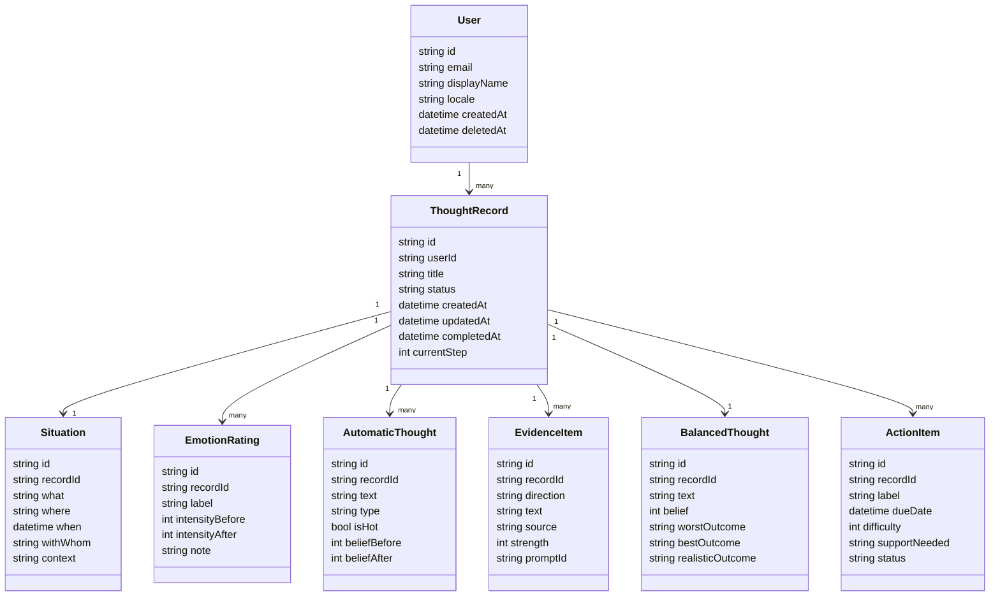

# Spécification exhaustive — Outil web « Remettre en question les pensées négatives »

**Version du document :** 1.0  
**Langue cible :** Français  
**Objet :** créer un cahier des charges fonctionnel et technique pour transformer une fiche papier de remise en question des pensées négatives en application web utilisable en ligne.  
**Source fonctionnelle :** fiche « Remettre en question les pensées négatives », structurée en 9 étapes : situation, émotions, pensées, pensée chaude, faits pour, faits contre, pensée alternative, réévaluation émotionnelle, plan d’action.  
**Positionnement :** outil d’auto-observation et d’aide à la restructuration cognitive, inspiré des pratiques de thérapie cognitive et comportementale. Il ne remplace pas un avis médical, une psychothérapie, une prise en charge d’urgence ou un diagnostic.

---

## 1. Résumé exécutif

L’application doit permettre à un utilisateur de remplir en ligne un exercice guidé de remise en question des pensées négatives. L’expérience doit reproduire la logique de la fiche d’origine tout en l’améliorant grâce aux possibilités numériques : progression étape par étape, sauvegarde automatique, aide contextuelle, notation par curseurs, synthèse finale, export, historique, confidentialité renforcée et éventuellement assistance rédactionnelle encadrée.

L’outil repose sur une séquence de 9 étapes :

1. Décrire la situation.
2. Identifier les émotions et leur intensité initiale.
3. Écrire les pensées automatiques associées.
4. Sélectionner la pensée « chaude » et évaluer le degré de croyance.
5. Recueillir les faits qui soutiennent cette pensée.
6. Recueillir les faits qui la contredisent.
7. Formuler une pensée alternative ou équilibrée.
8. Réévaluer l’intensité des émotions.
9. Définir un plan d’action.

Le produit final peut exister sous deux formes :

- **MVP individuel** : formulaire guidé, stockage local ou compte utilisateur simple, export Markdown/PDF.
- **Version avancée** : comptes sécurisés, tableaux de bord, suivi longitudinal, rappels, partage contrôlé avec un professionnel, API, chiffrement avancé, mode hors ligne, assistance IA optionnelle et garde-fous cliniques.

---

## 2. Objectifs du produit

### 2.1 Objectifs principaux

L’outil doit permettre à l’utilisateur de :

- clarifier une situation émotionnellement difficile ;
- nommer ses émotions et mesurer leur intensité ;
- identifier les pensées automatiques liées à la détresse ;
- repérer la pensée la plus chargée émotionnellement, appelée ici « pensée chaude » ;
- distinguer les faits, les interprétations et les suppositions ;
- examiner les éléments qui soutiennent et contredisent la pensée automatique ;
- construire une pensée alternative plus équilibrée ;
- mesurer l’évolution de l’intensité émotionnelle après l’exercice ;
- décider d’un plan d’action concret ou d’une réaction différente pour l’avenir ;
- conserver, exporter ou relire ses exercices.

### 2.2 Objectifs secondaires

- Rendre l’exercice moins intimidant qu’une fiche papier dense.
- Réduire la charge cognitive grâce à une interface progressive.
- Encourager une formulation factuelle plutôt qu’interprétative.
- Aider l’utilisateur à visualiser les changements d’intensité émotionnelle.
- Favoriser l’autonomie sans donner l’impression d’une prise en charge médicale automatisée.
- Permettre une utilisation anonyme ou sans compte lorsque c’est souhaitable.
- Préserver une confidentialité élevée, car les données saisies sont sensibles.

### 2.3 Non-objectifs

L’outil ne doit pas :

- établir de diagnostic ;
- prédire un trouble psychologique ;
- remplacer un thérapeute ;
- proposer une décision médicale ;
- promettre une amélioration émotionnelle ;
- envoyer automatiquement les données à un tiers sans consentement explicite ;
- utiliser les textes de l’utilisateur pour entraîner des modèles sans consentement clair, spécifique et révocable.

---

## 3. Principes de conception

### 3.1 Principe de sécurité émotionnelle

L’interface doit être calme, prévisible et non culpabilisante. Les formulations doivent éviter les injonctions telles que « soyez rationnel » ou « vos pensées sont fausses ». L’application doit préférer des formulations du type :

- « Explorons une autre façon de regarder cette situation. »
- « Certains éléments soutiennent cette pensée, d’autres peuvent la nuancer. »
- « Vous pouvez vous arrêter à tout moment. »

### 3.2 Principe de progressivité

La fiche papier contient beaucoup de questions. L’outil web doit présenter ces questions par étapes, sous-questions repliables ou cartes guidées. L’utilisateur ne doit jamais se retrouver face à un écran surchargé.

### 3.3 Principe de distinction fait/interprétation

Une difficulté centrale est d’éviter la lecture de pensée, l’interprétation excessive ou les conclusions non justifiées. L’outil doit aider l’utilisateur à distinguer :

- un **fait observable** : « Il n’a pas répondu à mon message depuis deux jours. »
- une **interprétation** : « Il me rejette. »
- une **prédiction** : « Je vais finir seul. »
- un **jugement global** : « Je suis nul. »

### 3.4 Principe de confidentialité par défaut

Les entrées peuvent contenir des informations de santé, de relation, de travail, de traumatisme ou de crise. Le produit doit donc limiter la collecte, chiffrer les données, éviter les analytics invasifs et donner à l’utilisateur un contrôle réel sur la suppression et l’export.

### 3.5 Principe d’utilisabilité clinique sans prétention clinique

L’outil peut être utile en contexte thérapeutique, mais il doit rester formulé comme un support d’auto-réflexion. Les messages d’aide doivent être pédagogiques, non prescriptifs, et orientés vers la mise en mots.

---

## 4. Terminologie fonctionnelle

| Terme | Définition opérationnelle dans l’application |
|---|---|
| Situation | Événement ou contexte concret qui a déclenché une émotion. Répond idéalement à quoi, où, quand, avec qui. |
| Émotion | Mot court décrivant un état affectif : anxiété, tristesse, colère, honte, culpabilité, dégoût, peur, fierté, etc. |
| Intensité émotionnelle | Score de 0 à 100 indiquant la force ressentie d’une émotion à un moment donné. |
| Pensée automatique | Pensée, image mentale ou souvenir survenu rapidement avant ou pendant l’émotion. |
| Pensée chaude | Pensée automatique liée à la plus grande charge émotionnelle. |
| Degré de croyance | Score de 0 à 100 indiquant à quel point l’utilisateur croit une pensée. |
| Faits pour | Observations concrètes qui semblent soutenir la pensée chaude. |
| Faits contre | Observations concrètes qui nuancent, limitent ou contredisent la pensée chaude. |
| Pensée alternative | Formulation plus équilibrée tenant compte des faits pour et contre. |
| Réévaluation | Nouvelle mesure de l’intensité émotionnelle et du degré de croyance après réflexion. |
| Plan d’action | Une ou plusieurs actions concrètes, ou une stratégie de réponse différente, pour la situation présente ou future. |

---

## 5. Publics cibles

### 5.1 Utilisateur autonome

Personne souhaitant mieux comprendre ses pensées et émotions, sans suivi professionnel direct dans l’application.

Besoins :

- accès simple ;
- langage clair ;
- possibilité de ne pas créer de compte ;
- export personnel ;
- sécurité et confidentialité.

### 5.2 Utilisateur accompagné par un professionnel

Personne utilisant l’outil entre deux séances avec un psychologue, psychiatre, médecin ou coach formé.

Besoins :

- historique des exercices ;
- export propre ;
- possibilité de partager manuellement un exercice ;
- notes personnelles ;
- version imprimable.

### 5.3 Professionnel configurant l’outil

Professionnel qui souhaite recommander l’outil à des patients ou clients.

Besoins :

- modèles personnalisables ;
- consignes adaptées ;
- confidentialité ;
- absence de promesses thérapeutiques ;
- traçabilité si un portail professionnel existe.

### 5.4 Administrateur technique

Personne responsable du déploiement, de la sécurité, des sauvegardes et de la conformité.

Besoins :

- journalisation technique ;
- monitoring ;
- gestion des incidents ;
- sauvegardes chiffrées ;
- documentation API ;
- procédures d’effacement.

---

## 6. Parcours utilisateur global

### 6.1 Parcours standard

1. L’utilisateur arrive sur la page d’accueil.
2. Il lit une courte explication de l’outil et un avertissement non médical.
3. Il choisit :
   - « Commencer sans compte » ;
   - « Se connecter » ;
   - « Créer un compte » ;
   - « Importer/continuer un exercice ».
4. Il crée un nouvel exercice.
5. L’application affiche une barre de progression en 9 étapes.
6. L’utilisateur remplit chaque étape.
7. Les données sont sauvegardées localement ou côté serveur selon le mode choisi.
8. Une synthèse finale est générée.
9. L’utilisateur peut :
   - télécharger en Markdown ;
   - télécharger en PDF ;
   - imprimer ;
   - sauvegarder dans son compte ;
   - partager manuellement ;
   - recommencer un exercice.

### 6.2 Parcours sans compte

- Les données sont stockées dans le navigateur, idéalement chiffrées avec une clé dérivée d’un mot de passe local optionnel.
- L’utilisateur est clairement informé que la perte du navigateur, du stockage local ou de la clé peut rendre les données irrécupérables.
- Aucun serveur ne reçoit le contenu sensible, sauf si l’utilisateur active une fonctionnalité nécessitant un traitement distant.

### 6.3 Parcours avec compte

- L’utilisateur peut retrouver son historique sur plusieurs appareils.
- Les données sensibles doivent être chiffrées au repos.
- Les exports et suppressions doivent être disponibles.
- La suppression de compte doit proposer :
  - suppression immédiate logique ;
  - suppression définitive après délai technique documenté ;
  - export préalable.

### 6.4 Parcours d’interruption

À tout moment, l’utilisateur peut :

- sauvegarder et quitter ;
- passer une question facultative ;
- revenir en arrière ;
- masquer le contenu sensible à l’écran ;
- activer un bouton « sortie rapide » redirigeant vers une page neutre, si l’outil est destiné à des contextes où la confidentialité immédiate peut être importante.

---

## 7. Spécification fonctionnelle détaillée par étape

## Étape 1 — Décrire la situation

### Objectif

Aider l’utilisateur à définir le contexte déclencheur de manière concrète.

### Champs recommandés

| Champ | Type | Obligatoire | Description |
|---|---:|---:|---|
| titre | texte court | non | Titre libre de l’exercice. Exemple : « Réunion d’équipe ». |
| quoi | texte long | oui | Ce qui s’est passé objectivement. |
| où | texte court | non | Lieu physique ou contexte numérique. |
| quand | date/heure ou texte | non | Moment exact ou approximatif. |
| avec_qui | texte court ou liste | non | Personnes présentes ou concernées. |
| contexte | texte long | non | Éléments de contexte utiles, sans interprétation forcée. |

### Aide contextuelle

Afficher une aide du type :

> Décrivez la scène comme si une caméra l’avait enregistrée : que verrait-on ou entendrait-on ?

### Validation

- `quoi` doit contenir au moins 10 caractères pour éviter une entrée vide.
- Ne pas bloquer si l’utilisateur ne connaît pas la date exacte.
- Proposer une alerte douce si le texte contient uniquement des jugements globaux, par exemple : « Tout était horrible ». L’outil peut suggérer : « Pouvez-vous ajouter ce qui s’est concrètement passé ? »

### Données produites

```json
{
  "situation": {
    "title": "Réunion d’équipe",
    "what": "Mon responsable a critiqué mon rapport devant deux collègues.",
    "where": "Salle de réunion",
    "when": "2026-06-06T09:30:00+02:00",
    "withWhom": ["Responsable", "Collègue A", "Collègue B"],
    "context": "Je travaillais sur ce rapport depuis plusieurs jours."
  }
}
```

---

## Étape 2 — Écrire les émotions et évaluer leur intensité initiale

### Objectif

Identifier une ou plusieurs émotions et mesurer leur intensité de 0 à 100.

### Interface recommandée

- Champ de recherche ou sélection rapide d’émotions.
- Liste de suggestions : anxiété, tristesse, colère, honte, culpabilité, peur, dégoût, frustration, solitude, humiliation, fierté, soulagement.
- Possibilité d’ajouter une émotion personnalisée.
- Curseur ou champ numérique de 0 à 100.
- Affichage sémantique optionnel :
  - 0 = absent ;
  - 25 = faible ;
  - 50 = modéré ;
  - 75 = fort ;
  - 100 = maximal.

### Champs

| Champ | Type | Obligatoire | Règles |
|---|---:|---:|---|
| emotion.label | texte | oui | Un mot ou courte expression. |
| emotion.intensityBefore | entier | oui | 0 à 100. |
| emotion.note | texte | non | Précision facultative. |

### Validation

- Au moins une émotion doit être saisie.
- Une émotion doit avoir une intensité numérique valide.
- Éviter les doublons exacts : « anxiété » et « Anxiété » doivent être fusionnables.

### Fonctionnalités utiles

- Bouton « Je ne sais pas nommer l’émotion » ouvrant une roue ou une liste d’émotions.
- Bouton « Sensations corporelles » : tension, chaleur, boule au ventre, respiration courte, etc. Ces sensations peuvent aider à identifier l’émotion sans devenir un diagnostic.

### Données produites

```json
{
  "emotions": [
    { "id": "emo_1", "label": "honte", "intensityBefore": 85 },
    { "id": "emo_2", "label": "anxiété", "intensityBefore": 70 }
  ]
}
```

---

## Étape 3 — Écrire les pensées automatiques

### Objectif

Recueillir les pensées, images ou souvenirs qui ont traversé l’esprit de l’utilisateur avant ou pendant l’émotion.

### Prompts à proposer

Les prompts doivent être présentés comme des aides facultatives :

- Qu’est-ce qui m’est passé par la tête juste avant de me sentir ainsi ?
- Qu’est-ce que cette situation semble signifier pour moi, mon futur ou ma vie ?
- Qu’est-ce que je crains ?
- Quelle serait la pire conséquence possible selon cette pensée ?
- Qu’est-ce que j’imagine que les autres pensent de moi ?
- Qu’est-ce que cette situation me fait conclure sur les gens ou le monde ?
- Est-ce qu’une image mentale ou un souvenir accompagne cette émotion ?

### Interface recommandée

- Cartes de pensée individuelles.
- Bouton « Ajouter une pensée ».
- Possibilité de marquer une pensée comme :
  - pensée verbale ;
  - image mentale ;
  - souvenir ;
  - prédiction ;
  - jugement sur soi ;
  - jugement sur autrui ;
  - conclusion sur le monde.

### Champs

| Champ | Type | Obligatoire | Description |
|---|---:|---:|---|
| thought.text | texte long | oui | Pensée automatique. |
| thought.type | enum | non | verbal, image, souvenir, prédiction, jugement_soi, jugement_autrui, conclusion_monde, autre. |
| thought.linkedEmotionIds | liste | non | Émotions associées. |
| thought.initialBelief | entier | non | Croyance initiale 0-100, facultative avant l’étape 4. |

### Validation

- Au moins une pensée est recommandée mais l’utilisateur peut continuer après confirmation s’il n’arrive pas à en formuler une.
- Empêcher uniquement les entrées totalement vides.

### Aide intelligente non intrusive

L’application peut détecter certaines formulations pour aider à clarifier :

- « toujours », « jamais », « tout le monde » → possible généralisation ;
- « il pense que », « elle croit que » → possible lecture de pensée ;
- « ça va forcément » → possible prédiction ;
- « je suis nul » → jugement global sur soi.

Important : ces détections doivent être présentées comme des hypothèses pédagogiques, jamais comme des corrections autoritaires.

---

## Étape 4 — Choisir la pensée chaude et évaluer le degré de croyance

### Objectif

Identifier la pensée automatique qui porte la plus grande charge émotionnelle.

### Interface recommandée

- Liste des pensées saisies à l’étape 3.
- Pour chaque pensée : bouton « Sélectionner comme pensée chaude ».
- Curseur « À quel point est-ce que j’y crois maintenant ? » de 0 à 100.
- Option : associer la pensée chaude aux émotions les plus fortes.

### Champs

| Champ | Type | Obligatoire | Description |
|---|---:|---:|---|
| hotThoughtId | identifiant | oui | Référence vers une pensée existante. |
| hotThoughtBeliefBefore | entier | oui | Degré de croyance initial 0-100. |
| hotThoughtReason | texte | non | Pourquoi cette pensée est la plus chargée. |

### Validation

- Une seule pensée chaude active par exercice.
- Le score de croyance doit être entre 0 et 100.
- Si aucune pensée n’a été créée, proposer de retourner à l’étape 3.

### Exemple

```json
{
  "hotThoughtId": "thought_2",
  "hotThoughtBeliefBefore": 90,
  "hotThoughtReason": "C’est la pensée qui déclenche le plus de honte."
}
```

---

## Étape 5 — Écrire les faits qui soutiennent la pensée automatique

### Objectif

Permettre à l’utilisateur de reconnaître les éléments qui semblent aller dans le sens de la pensée chaude, sans nier son expérience.

### Principe essentiel

L’outil doit demander des faits concrets, pas des interprétations. Par exemple :

- Fait : « Mon responsable a dit : “Ce passage manque de clarté.” »
- Interprétation : « Mon responsable pense que je suis incompétent. »

### Interface recommandée

- Tableau ou cartes « élément de preuve ».
- Chaque élément peut avoir :
  - description ;
  - type ;
  - niveau de solidité perçu ;
  - commentaire.

### Champs

| Champ | Type | Obligatoire | Description |
|---|---:|---:|---|
| evidenceFor[].text | texte long | oui | Fait soutenant la pensée. |
| evidenceFor[].source | enum | non | observation_directe, parole_entendue, document, comportement_observé, souvenir, autre. |
| evidenceFor[].strength | entier | non | Solidité perçue 0-100. |
| evidenceFor[].isInterpretationFlag | booléen | auto | Signal pédagogique si l’élément semble interprétatif. |

### Aide contextuelle

Afficher une consigne :

> Notez uniquement ce qui soutient réellement cette conclusion. Essayez d’éviter la lecture de pensée, les suppositions et les interprétations non vérifiées.

### Validation

- L’étape peut être vide si l’utilisateur estime qu’aucun fait ne soutient la pensée, mais l’application doit demander confirmation : « Voulez-vous noter qu’aucun fait clair ne soutient cette pensée ? »
- Les éléments très courts peuvent déclencher une demande de précision.

---

## Étape 6 — Écrire les faits qui contredisent ou nuancent la pensée automatique

### Objectif

Aider l’utilisateur à rechercher activement des éléments oubliés, minimisés ou incompatibles avec la pensée chaude.

### Prompts à proposer

Les questions doivent être affichées sous forme de cartes. L’utilisateur peut répondre à celles qui l’aident :

1. Ai-je déjà vécu des expériences qui montrent que cette pensée n’est pas toujours vraie ?
2. Que dirais-je à un ami proche qui penserait cela ?
3. Que me dirait quelqu’un qui m’aime ou me connaît bien ?
4. Quand je me sens mieux, est-ce que je vois cette situation autrement ?
5. Dans le passé, quelles pensées m’ont aidé dans une situation similaire ?
6. Ai-je déjà traversé une situation comparable ? Que s’est-il passé ?
7. Y a-t-il de petits éléments que je néglige parce qu’ils ne semblent pas assez importants ?
8. Dans cinq ans, est-ce que je regarderai cette situation de la même manière ?
9. Est-ce que j’oublie mes forces, mes qualités ou certains aspects de la situation ?
10. Est-ce que je saute à une conclusion qui dépasse les faits disponibles ?
11. Est-ce que je me blâme pour quelque chose qui n’est pas entièrement sous mon contrôle ?

### Interface recommandée

- Mode « questions guidées » avec cartes repliables.
- Mode « liste libre » pour utilisateurs avancés.
- Possibilité de convertir une réponse à une question en « fait contre ».

### Champs

| Champ | Type | Obligatoire | Description |
|---|---:|---:|---|
| evidenceAgainst[].text | texte long | oui | Fait ou nuance contredisant la pensée chaude. |
| evidenceAgainst[].promptId | identifiant | non | Question ayant déclenché la réponse. |
| evidenceAgainst[].source | enum | non | expérience_passée, avis_ami, observation_directe, perspective_future, force_personnelle, autre. |
| evidenceAgainst[].strength | entier | non | Solidité perçue 0-100. |

### Validation

- Encourager au moins un élément, mais ne pas bloquer.
- Si l’utilisateur écrit « rien », proposer quelques questions alternatives.
- Si l’utilisateur se blâme fortement, afficher une aide douce sur le contrôle réel : « Quelle part dépendait de vous, des autres, du contexte ou du hasard ? »

---

## Étape 7 — Formuler une pensée alternative ou équilibrée

### Objectif

Aider l’utilisateur à formuler une pensée plus complète, tenant compte à la fois des faits qui soutiennent et des faits qui contredisent la pensée chaude.

### Logique recommandée

L’application peut proposer une structure :

> « Il est vrai que [faits pour], et en même temps [faits contre/nuances]. Une façon plus équilibrée de voir la situation serait : [pensée alternative]. »

La pensée alternative ne doit pas être une pensée positive forcée. Elle doit rester crédible pour l’utilisateur.

### Champs

| Champ | Type | Obligatoire | Description |
|---|---:|---:|---|
| balancedThought.text | texte long | oui | Pensée alternative. |
| balancedThought.belief | entier | oui | Degré de croyance dans la pensée alternative 0-100. |
| hotThoughtBeliefAfter | entier | oui | Nouveau degré de croyance dans la pensée chaude 0-100. |
| worstOutcome | texte long | non | Pire issue plausible. |
| bestOutcome | texte long | non | Meilleure issue plausible. |
| realisticOutcome | texte long | non | Issue la plus réaliste. |
| trustedPerspective | texte long | non | Comment une personne de confiance pourrait comprendre la situation. |

### Prompts à proposer

- D’après les faits pour et contre, existe-t-il une autre manière de voir les choses ?
- Pouvez-vous combiner les deux côtés avec le mot « et » ?
- Une personne en qui vous avez confiance aurait-elle une autre compréhension de cette situation ?
- Si la pensée initiale est partiellement vraie, quelle est la pire issue ? La meilleure ? La plus réaliste ?
- À quel point croyez-vous cette pensée alternative maintenant ?
- À quel point croyez-vous encore la pensée chaude ?

### Validation

- La pensée alternative doit contenir au moins une phrase.
- Le score de croyance dans la pensée alternative est obligatoire.
- La réévaluation de la pensée chaude est obligatoire.
- Si la pensée alternative est très positive mais peu crédible, l’application peut proposer : « Pouvez-vous la rendre plus réaliste ou plus nuancée ? »

---

## Étape 8 — Réévaluer l’intensité des émotions

### Objectif

Mesurer si l’intensité émotionnelle a changé après la remise en question de la pensée chaude.

### Interface recommandée

- Reprendre les émotions de l’étape 2.
- Afficher l’intensité initiale à côté d’un nouveau curseur.
- Calculer automatiquement la différence.
- Permettre d’ajouter une nouvelle émotion apparue pendant l’exercice.

### Champs

| Champ | Type | Obligatoire | Description |
|---|---:|---:|---|
| emotion.intensityAfter | entier | oui | Intensité après exercice, 0-100. |
| emotion.delta | entier calculé | auto | intensityAfter - intensityBefore. |
| emotion.afterNote | texte | non | Commentaire facultatif. |

### Affichage recommandé

| Émotion | Avant | Après | Évolution |
|---|---:|---:|---:|
| honte | 85 | 55 | -30 |
| anxiété | 70 | 45 | -25 |

### Interprétation prudente

L’application ne doit pas présenter la baisse comme un succès obligatoire. Elle peut dire :

- « Certaines émotions peuvent diminuer, rester stables ou même augmenter pendant la réflexion. L’objectif principal est de mieux comprendre ce qui se passe. »

---

## Étape 9 — Plan d’action

### Objectif

Identifier une action concrète ou une manière différente de répondre si la situation se reproduit.

### Prompts à proposer

- Puis-je faire quelque chose pour changer la situation qui a déclenché ma détresse ?
- Si je ne peux pas changer la situation, puis-je réagir différemment la prochaine fois ?
- Quelle petite action réaliste puis-je faire dans les 24 à 72 prochaines heures ?
- De quel soutien ai-je besoin ?
- Qu’est-ce qui pourrait m’empêcher d’agir ?
- Quel serait un premier pas très simple ?

### Champs

| Champ | Type | Obligatoire | Description |
|---|---:|---:|---|
| actionPlan.summary | texte long | non | Synthèse générale. |
| actionItems[].label | texte court | non | Action concrète. |
| actionItems[].dueDate | date | non | Échéance facultative. |
| actionItems[].difficulty | entier | non | Difficulté perçue 0-100. |
| actionItems[].supportNeeded | texte | non | Aide nécessaire. |
| actionItems[].status | enum | non | todo, in_progress, done, skipped. |
| nextTimeResponse | texte long | non | Réaction différente possible à l’avenir. |

### Validation

- Le plan peut rester vide si l’utilisateur veut simplement réfléchir, mais l’application doit proposer au moins une question de clôture.
- Pour les actions datées, vérifier que la date est valide.
- Ne pas transformer le plan en injonction.

---

## 8. Synthèse finale générée

À la fin de l’exercice, l’application doit générer une synthèse lisible.

### Contenu de la synthèse

1. Titre et date.
2. Situation résumée.
3. Émotions avant/après.
4. Pensée chaude et évolution du degré de croyance.
5. Faits pour.
6. Faits contre.
7. Pensée alternative.
8. Plan d’action.
9. Notes personnelles facultatives.

### Exemple de structure Markdown exportée

```markdown
# Exercice — Réunion d’équipe

## Situation
Mon responsable a critiqué mon rapport devant deux collègues.

## Émotions
| Émotion | Avant | Après | Évolution |
|---|---:|---:|---:|
| honte | 85 | 55 | -30 |
| anxiété | 70 | 45 | -25 |

## Pensée chaude
« Je suis incompétent. »

Croyance avant : 90/100  
Croyance après : 50/100

## Faits qui soutiennent cette pensée
- Le rapport contenait une partie peu claire.
- Mon responsable a formulé une critique devant l’équipe.

## Faits qui la contredisent ou la nuancent
- D’autres parties du rapport ont été acceptées.
- J’ai déjà produit des rapports appréciés.
- Une critique sur un passage ne signifie pas que tout mon travail est mauvais.

## Pensée alternative
« Une partie de mon rapport devait être clarifiée, et cela ne prouve pas que je suis incompétent. Je peux corriger ce point et demander un retour plus précis. »

Croyance dans la pensée alternative : 75/100

## Plan d’action
- Relire la section critiquée demain matin.
- Demander à mon responsable un exemple de formulation attendue.
```

---

## 9. Exigences UX/UI

### 9.1 Architecture d’écran

#### Page d’accueil

Éléments :

- nom de l’outil ;
- explication en 3 à 5 lignes ;
- avertissement non médical ;
- bouton principal « Commencer un exercice » ;
- options secondaires : historique, importer, paramètres de confidentialité.

#### Écran d’exercice

Éléments persistants :

- barre de progression ;
- titre de l’étape ;
- consigne courte ;
- zone de saisie principale ;
- aide contextuelle repliable ;
- boutons « Précédent », « Suivant », « Sauvegarder et quitter » ;
- indicateur de sauvegarde ;
- accès aux paramètres d’affichage.

#### Écran de synthèse

Éléments :

- résumé complet ;
- graphiques simples avant/après ;
- boutons export ;
- bouton « Modifier une étape » ;
- bouton « Nouvel exercice » ;
- bouton suppression.

### 9.2 Composants UI

| Composant | Description |
|---|---|
| `StepProgress` | Affiche les 9 étapes et l’état de complétion. |
| `GuidedPromptCard` | Carte contenant une question d’aide. |
| `EmotionPicker` | Sélecteur d’émotions avec recherche et ajout libre. |
| `IntensitySlider` | Curseur 0-100 accessible au clavier. |
| `ThoughtList` | Liste éditable des pensées automatiques. |
| `HotThoughtSelector` | Sélection d’une pensée chaude parmi les pensées. |
| `EvidenceBoard` | Deux colonnes : faits pour / faits contre. |
| `BalancedThoughtComposer` | Aide à la formulation de la pensée alternative. |
| `EmotionReassessmentTable` | Tableau avant/après des émotions. |
| `ActionPlanEditor` | Liste d’actions concrètes. |
| `ReviewSummary` | Synthèse finale prête à exporter. |
| `PrivacyModeToggle` | Masque rapidement les textes sensibles. |
| `AutosaveIndicator` | Indique sauvegarde locale ou serveur. |

### 9.3 États de l’interface

Chaque étape doit gérer les états suivants :

- vide ;
- en cours de saisie ;
- partiellement complétée ;
- complétée ;
- erreur de validation ;
- sauvegarde en cours ;
- sauvegardée ;
- conflit de synchronisation ;
- lecture seule ;
- impression/export.

### 9.4 Microcopies recommandées

- Sauvegarde : « Vos réponses sont enregistrées sur cet appareil. » ou « Vos réponses sont enregistrées dans votre compte. »
- Confidentialité : « Évitez d’inclure des noms complets si ce n’est pas nécessaire. »
- Difficulté émotionnelle : « Vous pouvez faire une pause ou arrêter l’exercice. »
- Faits : « Un fait est quelque chose qu’une autre personne pourrait observer ou vérifier. »
- Pensée alternative : « Elle n’a pas besoin d’être parfaitement positive ; elle doit surtout être plus complète et crédible. »

### 9.5 Design visuel

- Interface sobre, sans couleurs agressives.
- Grande lisibilité typographique.
- Espacement généreux.
- Pas de gamification excessive.
- Graphiques simples pour les scores.
- Mode sombre.
- Mode contraste élevé.
- Mode « discret » : masque le titre explicite de l’outil et floute les contenus sensibles.

---

## 10. Accessibilité

L’application doit viser un niveau d’accessibilité élevé.

### 10.1 Navigation clavier

- Tous les champs, boutons, curseurs et cartes doivent être accessibles au clavier.
- Le focus visible doit être clair.
- L’ordre de tabulation doit suivre l’ordre logique de lecture.
- Les cartes repliables doivent être contrôlables via Entrée/Espace.

### 10.2 Lecteurs d’écran

- Utiliser des labels explicites.
- Éviter les placeholders comme seuls labels.
- Annoncer les changements d’étape.
- Les curseurs doivent annoncer la valeur courante, le minimum et le maximum.
- Les erreurs doivent être associées aux champs concernés.

### 10.3 Lisibilité cognitive

- Phrases courtes.
- Une consigne principale par écran.
- Aide contextuelle facultative.
- Possibilité de sauvegarder et reprendre.
- Possibilité d’afficher tous les prompts ou seulement les plus importants.

### 10.4 Réduction des animations

Respecter les préférences système de réduction des animations. Les transitions ne doivent pas être nécessaires à la compréhension.

---

## 11. Internationalisation et adaptation culturelle

### 11.1 Langues

Le système doit être conçu pour supporter plusieurs langues même si la première version est en français.

Structure recommandée :

```json
{
  "step1.title": "Décrire la situation",
  "step1.prompt.what": "Que s’est-il passé ?",
  "emotion.anxiety": "anxiété",
  "emotion.shame": "honte"
}
```

### 11.2 Ton

Le ton doit être :

- respectueux ;
- non infantilisant ;
- non culpabilisant ;
- non médicalisant à l’excès ;
- compatible avec une utilisation personnelle ou accompagnée.

### 11.3 Personnalisation

Options possibles :

- tutoiement/vouvoiement ;
- vocabulaire simple/avancé ;
- affichage court/détaillé ;
- choix des émotions suggérées ;
- personnalisation des prompts par un professionnel.

---

## 12. Modèle de données conceptuel

### 12.1 Entités principales



### 12.2 Statuts d’un exercice

| Statut | Description |
|---|---|
| draft | Exercice commencé mais non terminé. |
| completed | Les 9 étapes sont terminées. |
| archived | Exercice masqué de la vue principale. |
| deleted | Suppression logique avant purge définitive. |

### 12.3 Progression

La progression peut être calculée :

```text
progress = nombre_d_etapes_validées / 9
```

Chaque étape peut aussi avoir son propre état :

```json
{
  "steps": {
    "situation": "completed",
    "emotions_before": "completed",
    "automatic_thoughts": "partial",
    "hot_thought": "empty",
    "evidence_for": "empty",
    "evidence_against": "empty",
    "balanced_thought": "empty",
    "emotions_after": "empty",
    "action_plan": "empty"
  }
}
```

---

## 13. Schéma JSON complet d’un exercice

```json
{
  "$schema": "https://json-schema.org/draft/2020-12/schema",
  "$id": "https://example.org/schemas/thought-record.schema.json",
  "title": "ThoughtRecord",
  "type": "object",
  "required": ["id", "createdAt", "updatedAt", "status", "currentStep", "situation", "emotions", "thoughts"],
  "properties": {
    "id": { "type": "string", "minLength": 1 },
    "userId": { "type": ["string", "null"] },
    "title": { "type": "string", "maxLength": 160 },
    "status": { "type": "string", "enum": ["draft", "completed", "archived", "deleted"] },
    "currentStep": { "type": "integer", "minimum": 1, "maximum": 9 },
    "createdAt": { "type": "string", "format": "date-time" },
    "updatedAt": { "type": "string", "format": "date-time" },
    "completedAt": { "type": ["string", "null"], "format": "date-time" },
    "situation": {
      "type": "object",
      "required": ["what"],
      "properties": {
        "what": { "type": "string", "minLength": 1, "maxLength": 5000 },
        "where": { "type": "string", "maxLength": 500 },
        "when": { "type": ["string", "null"], "format": "date-time" },
        "whenText": { "type": "string", "maxLength": 500 },
        "withWhom": {
          "type": "array",
          "items": { "type": "string", "maxLength": 120 },
          "maxItems": 50
        },
        "context": { "type": "string", "maxLength": 5000 }
      },
      "additionalProperties": false
    },
    "emotions": {
      "type": "array",
      "minItems": 0,
      "items": {
        "type": "object",
        "required": ["id", "label", "intensityBefore"],
        "properties": {
          "id": { "type": "string" },
          "label": { "type": "string", "minLength": 1, "maxLength": 80 },
          "intensityBefore": { "type": "integer", "minimum": 0, "maximum": 100 },
          "intensityAfter": { "type": ["integer", "null"], "minimum": 0, "maximum": 100 },
          "note": { "type": "string", "maxLength": 1000 },
          "afterNote": { "type": "string", "maxLength": 1000 }
        },
        "additionalProperties": false
      }
    },
    "thoughts": {
      "type": "array",
      "items": {
        "type": "object",
        "required": ["id", "text"],
        "properties": {
          "id": { "type": "string" },
          "text": { "type": "string", "minLength": 1, "maxLength": 5000 },
          "type": {
            "type": "string",
            "enum": ["verbal", "image", "souvenir", "prediction", "jugement_soi", "jugement_autrui", "conclusion_monde", "autre"]
          },
          "linkedEmotionIds": {
            "type": "array",
            "items": { "type": "string" }
          },
          "isHot": { "type": "boolean" },
          "beliefBefore": { "type": ["integer", "null"], "minimum": 0, "maximum": 100 },
          "beliefAfter": { "type": ["integer", "null"], "minimum": 0, "maximum": 100 },
          "createdAt": { "type": "string", "format": "date-time" }
        },
        "additionalProperties": false
      }
    },
    "evidenceFor": {
      "type": "array",
      "items": { "$ref": "#/$defs/evidenceItem" }
    },
    "evidenceAgainst": {
      "type": "array",
      "items": { "$ref": "#/$defs/evidenceItem" }
    },
    "balancedThought": {
      "type": "object",
      "properties": {
        "text": { "type": "string", "maxLength": 5000 },
        "belief": { "type": ["integer", "null"], "minimum": 0, "maximum": 100 },
        "worstOutcome": { "type": "string", "maxLength": 3000 },
        "bestOutcome": { "type": "string", "maxLength": 3000 },
        "realisticOutcome": { "type": "string", "maxLength": 3000 },
        "trustedPerspective": { "type": "string", "maxLength": 3000 }
      },
      "additionalProperties": false
    },
    "actionPlan": {
      "type": "object",
      "properties": {
        "summary": { "type": "string", "maxLength": 5000 },
        "nextTimeResponse": { "type": "string", "maxLength": 5000 },
        "items": {
          "type": "array",
          "items": {
            "type": "object",
            "required": ["id", "label"],
            "properties": {
              "id": { "type": "string" },
              "label": { "type": "string", "minLength": 1, "maxLength": 500 },
              "dueDate": { "type": ["string", "null"], "format": "date" },
              "difficulty": { "type": ["integer", "null"], "minimum": 0, "maximum": 100 },
              "supportNeeded": { "type": "string", "maxLength": 1000 },
              "status": { "type": "string", "enum": ["todo", "in_progress", "done", "skipped"] }
            },
            "additionalProperties": false
          }
        }
      },
      "additionalProperties": false
    },
    "metadata": {
      "type": "object",
      "properties": {
        "locale": { "type": "string" },
        "clientVersion": { "type": "string" },
        "sourceTemplateId": { "type": "string" },
        "privacyMode": { "type": "string", "enum": ["local", "account", "encrypted_account"] }
      },
      "additionalProperties": true
    }
  },
  "$defs": {
    "evidenceItem": {
      "type": "object",
      "required": ["id", "text"],
      "properties": {
        "id": { "type": "string" },
        "text": { "type": "string", "minLength": 1, "maxLength": 5000 },
        "source": {
          "type": "string",
          "enum": ["observation_directe", "parole_entendue", "document", "comportement_observe", "souvenir", "experience_passee", "avis_ami", "perspective_future", "force_personnelle", "autre"]
        },
        "strength": { "type": ["integer", "null"], "minimum": 0, "maximum": 100 },
        "promptId": { "type": ["string", "null"] },
        "createdAt": { "type": "string", "format": "date-time" }
      },
      "additionalProperties": false
    }
  },
  "additionalProperties": false
}
```

---

## 14. Schéma relationnel SQL proposé

```sql
CREATE TABLE users (
  id UUID PRIMARY KEY,
  email TEXT UNIQUE,
  password_hash TEXT,
  display_name TEXT,
  locale TEXT NOT NULL DEFAULT 'fr-FR',
  created_at TIMESTAMPTZ NOT NULL DEFAULT now(),
  updated_at TIMESTAMPTZ NOT NULL DEFAULT now(),
  deleted_at TIMESTAMPTZ
);

CREATE TABLE thought_records (
  id UUID PRIMARY KEY,
  user_id UUID REFERENCES users(id) ON DELETE CASCADE,
  title TEXT,
  status TEXT NOT NULL CHECK (status IN ('draft', 'completed', 'archived', 'deleted')),
  current_step INTEGER NOT NULL CHECK (current_step BETWEEN 1 AND 9),
  completed_at TIMESTAMPTZ,
  created_at TIMESTAMPTZ NOT NULL DEFAULT now(),
  updated_at TIMESTAMPTZ NOT NULL DEFAULT now()
);

CREATE TABLE situations (
  id UUID PRIMARY KEY,
  record_id UUID NOT NULL UNIQUE REFERENCES thought_records(id) ON DELETE CASCADE,
  what TEXT NOT NULL,
  where_text TEXT,
  when_at TIMESTAMPTZ,
  when_text TEXT,
  with_whom JSONB NOT NULL DEFAULT '[]',
  context TEXT
);

CREATE TABLE emotion_ratings (
  id UUID PRIMARY KEY,
  record_id UUID NOT NULL REFERENCES thought_records(id) ON DELETE CASCADE,
  label TEXT NOT NULL,
  intensity_before INTEGER NOT NULL CHECK (intensity_before BETWEEN 0 AND 100),
  intensity_after INTEGER CHECK (intensity_after BETWEEN 0 AND 100),
  note TEXT,
  after_note TEXT,
  created_at TIMESTAMPTZ NOT NULL DEFAULT now(),
  updated_at TIMESTAMPTZ NOT NULL DEFAULT now()
);

CREATE TABLE automatic_thoughts (
  id UUID PRIMARY KEY,
  record_id UUID NOT NULL REFERENCES thought_records(id) ON DELETE CASCADE,
  text TEXT NOT NULL,
  type TEXT CHECK (type IN ('verbal', 'image', 'souvenir', 'prediction', 'jugement_soi', 'jugement_autrui', 'conclusion_monde', 'autre')),
  is_hot BOOLEAN NOT NULL DEFAULT false,
  belief_before INTEGER CHECK (belief_before BETWEEN 0 AND 100),
  belief_after INTEGER CHECK (belief_after BETWEEN 0 AND 100),
  linked_emotion_ids JSONB NOT NULL DEFAULT '[]',
  created_at TIMESTAMPTZ NOT NULL DEFAULT now(),
  updated_at TIMESTAMPTZ NOT NULL DEFAULT now()
);

CREATE UNIQUE INDEX one_hot_thought_per_record
ON automatic_thoughts(record_id)
WHERE is_hot = true;

CREATE TABLE evidence_items (
  id UUID PRIMARY KEY,
  record_id UUID NOT NULL REFERENCES thought_records(id) ON DELETE CASCADE,
  direction TEXT NOT NULL CHECK (direction IN ('for', 'against')),
  text TEXT NOT NULL,
  source TEXT,
  strength INTEGER CHECK (strength BETWEEN 0 AND 100),
  prompt_id TEXT,
  created_at TIMESTAMPTZ NOT NULL DEFAULT now(),
  updated_at TIMESTAMPTZ NOT NULL DEFAULT now()
);

CREATE TABLE balanced_thoughts (
  id UUID PRIMARY KEY,
  record_id UUID NOT NULL UNIQUE REFERENCES thought_records(id) ON DELETE CASCADE,
  text TEXT,
  belief INTEGER CHECK (belief BETWEEN 0 AND 100),
  worst_outcome TEXT,
  best_outcome TEXT,
  realistic_outcome TEXT,
  trusted_perspective TEXT,
  created_at TIMESTAMPTZ NOT NULL DEFAULT now(),
  updated_at TIMESTAMPTZ NOT NULL DEFAULT now()
);

CREATE TABLE action_items (
  id UUID PRIMARY KEY,
  record_id UUID NOT NULL REFERENCES thought_records(id) ON DELETE CASCADE,
  label TEXT NOT NULL,
  due_date DATE,
  difficulty INTEGER CHECK (difficulty BETWEEN 0 AND 100),
  support_needed TEXT,
  status TEXT NOT NULL DEFAULT 'todo' CHECK (status IN ('todo', 'in_progress', 'done', 'skipped')),
  created_at TIMESTAMPTZ NOT NULL DEFAULT now(),
  updated_at TIMESTAMPTZ NOT NULL DEFAULT now()
);

CREATE TABLE audit_events (
  id UUID PRIMARY KEY,
  user_id UUID REFERENCES users(id) ON DELETE SET NULL,
  record_id UUID REFERENCES thought_records(id) ON DELETE SET NULL,
  event_type TEXT NOT NULL,
  ip_hash TEXT,
  user_agent_hash TEXT,
  metadata JSONB NOT NULL DEFAULT '{}',
  created_at TIMESTAMPTZ NOT NULL DEFAULT now()
);
```

---

## 15. Architecture technique recommandée

### 15.1 Architecture MVP

```text
Navigateur
  ├── Application web statique
  ├── Stockage local chiffrable
  ├── Export Markdown/PDF côté client
  └── Aucun backend obligatoire
```

Avantages :

- confidentialité forte ;
- faible coût ;
- déploiement simple ;
- pas de base de données sensible à gérer.

Limites :

- synchronisation multi-appareil difficile ;
- récupération impossible en cas de perte du stockage local ;
- partage avec professionnel manuel seulement.

### 15.2 Architecture version compte utilisateur

```text
Client Web / Mobile Web
  ↓ HTTPS
API Gateway / Backend
  ↓
Services applicatifs
  ├── Authentification
  ├── Exercices
  ├── Export
  ├── Notifications optionnelles
  ├── Partage optionnel
  └── Assistance IA optionnelle
  ↓
Base de données relationnelle
  ↓
Stockage de sauvegardes chiffrées
```

### 15.3 Architecture modulaire recommandée

| Module | Responsabilité |
|---|---|
| `auth` | Connexion, inscription, sessions, MFA optionnel. |
| `records` | CRUD des exercices. |
| `templates` | Textes des étapes, prompts, langues. |
| `exports` | Génération Markdown, PDF, JSON. |
| `privacy` | Consentements, suppression, export de données. |
| `sharing` | Partage manuel ou lien sécurisé temporaire. |
| `notifications` | Rappels optionnels, sans contenu sensible. |
| `ai-assist` | Assistance optionnelle encadrée. |
| `audit` | Journalisation technique minimale. |

### 15.4 Choix technologiques possibles

Le cahier des charges doit rester compatible avec plusieurs piles techniques. Une pile typique :

- Frontend : application React, Vue ou Svelte.
- Backend : Node.js, Python, Ruby, Go ou autre framework web mature.
- Base de données : PostgreSQL ou équivalent relationnel.
- Cache : Redis ou équivalent pour sessions et files de tâches.
- Stockage : objet chiffré pour exports temporaires.
- Authentification : sessions sécurisées ou OAuth selon besoin.
- Déploiement : conteneurs, plateforme serverless ou PaaS.

Le choix final dépendra du niveau de confidentialité, du budget, de l’équipe et des exigences d’hébergement.

---

## 16. API REST proposée

### 16.1 Principes

- API JSON.
- HTTPS obligatoire.
- Authentification requise pour les données serveur.
- Idempotence recommandée pour les sauvegardes d’étapes.
- Validation stricte côté serveur.
- Journalisation sans contenu sensible lorsque possible.

### 16.2 Ressources principales

| Ressource | Description |
|---|---|
| `/auth` | Authentification. |
| `/users/me` | Profil et paramètres utilisateur. |
| `/records` | Exercices de pensées. |
| `/records/{id}/steps/{step}` | Sauvegarde ciblée d’une étape. |
| `/records/{id}/export` | Export Markdown/PDF/JSON. |
| `/templates` | Modèles de prompts et traductions. |
| `/privacy` | Export global, suppression, consentements. |

### 16.3 Endpoints d’authentification

```http
POST /api/auth/register
Content-Type: application/json

{
  "email": "user@example.com",
  "password": "mot-de-passe-long",
  "locale": "fr-FR"
}
```

Réponse :

```json
{
  "user": {
    "id": "usr_123",
    "email": "user@example.com",
    "locale": "fr-FR"
  },
  "session": {
    "expiresAt": "2026-06-07T12:00:00Z"
  }
}
```

```http
POST /api/auth/login
POST /api/auth/logout
POST /api/auth/password-reset/request
POST /api/auth/password-reset/confirm
```

### 16.4 Créer un exercice

```http
POST /api/records
Content-Type: application/json
Authorization: Bearer <token>

{
  "title": "Réunion d’équipe",
  "templateId": "negative-thought-challenge-fr-v1"
}
```

Réponse :

```json
{
  "id": "rec_123",
  "title": "Réunion d’équipe",
  "status": "draft",
  "currentStep": 1,
  "createdAt": "2026-06-06T10:00:00Z",
  "updatedAt": "2026-06-06T10:00:00Z"
}
```

### 16.5 Mettre à jour une étape

```http
PUT /api/records/rec_123/steps/1
Content-Type: application/json
Authorization: Bearer <token>

{
  "situation": {
    "what": "Mon responsable a critiqué mon rapport devant deux collègues.",
    "where": "Salle de réunion",
    "when": "2026-06-06T09:30:00+02:00",
    "withWhom": ["Responsable", "Collègue A", "Collègue B"],
    "context": "Je travaillais sur ce rapport depuis plusieurs jours."
  }
}
```

Réponse :

```json
{
  "recordId": "rec_123",
  "step": 1,
  "status": "saved",
  "updatedAt": "2026-06-06T10:02:00Z",
  "validation": {
    "isValid": true,
    "warnings": []
  }
}
```

### 16.6 Récupérer un exercice

```http
GET /api/records/rec_123
Authorization: Bearer <token>
```

Réponse :

```json
{
  "id": "rec_123",
  "status": "draft",
  "currentStep": 4,
  "situation": {},
  "emotions": [],
  "thoughts": [],
  "evidenceFor": [],
  "evidenceAgainst": [],
  "balancedThought": {},
  "actionPlan": {}
}
```

### 16.7 Lister les exercices

```http
GET /api/records?status=draft&limit=20&cursor=abc
Authorization: Bearer <token>
```

Réponse :

```json
{
  "items": [
    {
      "id": "rec_123",
      "title": "Réunion d’équipe",
      "status": "draft",
      "currentStep": 4,
      "createdAt": "2026-06-06T10:00:00Z",
      "updatedAt": "2026-06-06T10:15:00Z"
    }
  ],
  "nextCursor": null
}
```

### 16.8 Exporter

```http
POST /api/records/rec_123/export
Content-Type: application/json
Authorization: Bearer <token>

{
  "format": "markdown",
  "includeMetadata": true,
  "includeEmptyFields": false
}
```

Réponse :

```json
{
  "format": "markdown",
  "filename": "exercice-reunion-equipe.md",
  "content": "# Exercice — Réunion d’équipe\n..."
}
```

Pour les PDF, deux options :

1. génération côté serveur avec lien temporaire ;
2. génération côté client pour limiter l’exposition des données.

### 16.9 Supprimer un exercice

```http
DELETE /api/records/rec_123
Authorization: Bearer <token>
```

Réponse :

```json
{
  "id": "rec_123",
  "status": "deleted",
  "deletedAt": "2026-06-06T10:30:00Z"
}
```

### 16.10 Codes d’erreur

| Code HTTP | Code applicatif | Cas |
|---:|---|---|
| 400 | VALIDATION_ERROR | Données invalides. |
| 401 | UNAUTHENTICATED | Session absente ou expirée. |
| 403 | FORBIDDEN | Accès non autorisé. |
| 404 | RECORD_NOT_FOUND | Exercice introuvable. |
| 409 | VERSION_CONFLICT | Conflit de modification. |
| 413 | PAYLOAD_TOO_LARGE | Texte trop volumineux. |
| 422 | STEP_INCOMPLETE | Étape incomplète pour finalisation. |
| 429 | RATE_LIMITED | Trop de requêtes. |
| 500 | INTERNAL_ERROR | Erreur serveur. |

---

## 17. API GraphQL alternative

Si le produit nécessite une interface très interactive, GraphQL peut être envisagé.

```graphql
type ThoughtRecord {
  id: ID!
  title: String
  status: RecordStatus!
  currentStep: Int!
  situation: Situation
  emotions: [EmotionRating!]!
  thoughts: [AutomaticThought!]!
  evidenceFor: [EvidenceItem!]!
  evidenceAgainst: [EvidenceItem!]!
  balancedThought: BalancedThought
  actionPlan: ActionPlan
  createdAt: DateTime!
  updatedAt: DateTime!
}

type Mutation {
  createRecord(input: CreateRecordInput!): ThoughtRecord!
  updateSituation(recordId: ID!, input: SituationInput!): ThoughtRecord!
  updateEmotions(recordId: ID!, input: [EmotionInput!]!): ThoughtRecord!
  updateThoughts(recordId: ID!, input: [ThoughtInput!]!): ThoughtRecord!
  selectHotThought(recordId: ID!, input: HotThoughtInput!): ThoughtRecord!
  updateEvidence(recordId: ID!, direction: EvidenceDirection!, input: [EvidenceInput!]!): ThoughtRecord!
  updateBalancedThought(recordId: ID!, input: BalancedThoughtInput!): ThoughtRecord!
  updateActionPlan(recordId: ID!, input: ActionPlanInput!): ThoughtRecord!
  completeRecord(recordId: ID!): ThoughtRecord!
}
```

GraphQL est puissant mais peut compliquer la mise en cache, la sécurité fine et la limitation de profondeur. REST est souvent suffisant pour un MVP.

---

## 18. Gestion de l’état côté frontend

### 18.1 État minimal

```ts
type StepStatus = 'empty' | 'partial' | 'completed' | 'invalid';

type ExerciseState = {
  id: string;
  status: 'draft' | 'completed' | 'archived' | 'deleted';
  currentStep: number;
  steps: Record<string, StepStatus>;
  data: ThoughtRecord;
  dirty: boolean;
  lastSavedAt?: string;
  saveError?: string;
};
```

### 18.2 Autosauvegarde

Règles :

- Déclencher après 800 à 1500 ms d’inactivité.
- Sauvegarder aussi au changement d’étape.
- Afficher l’état : « non sauvegardé », « sauvegarde… », « sauvegardé », « erreur ».
- En cas d’échec, conserver les données en mémoire et en stockage local temporaire.

### 18.3 Conflits

Si l’exercice est modifié sur deux appareils :

- utiliser un champ `updatedAt` ou `version` ;
- refuser une mise à jour obsolète avec `409 VERSION_CONFLICT` ;
- proposer de charger la version serveur, conserver la version locale ou fusionner manuellement.

### 18.4 Mode hors ligne

- Stocker les modifications dans une file locale.
- Synchroniser au retour de la connexion.
- Signaler clairement ce qui est uniquement local.
- Ne jamais perdre une saisie à cause d’une navigation accidentelle.

---

## 19. Validation métier

### 19.1 Règles générales

| Règle | Type | Sévérité |
|---|---|---|
| Les scores sont entre 0 et 100. | bloquante | erreur |
| Une pensée chaude appartient à l’exercice courant. | bloquante | erreur |
| Une seule pensée chaude par exercice. | bloquante | erreur |
| La finalisation nécessite une situation, au moins une émotion initiale, une pensée chaude, une pensée alternative et une réévaluation. | bloquante pour finalisation | erreur |
| Les faits peuvent être absents si l’utilisateur confirme. | non bloquante | avertissement |
| Les champs texte ont une longueur maximale. | bloquante | erreur |
| Les dates doivent être valides. | bloquante | erreur |

### 19.2 Validation de finalisation

Un exercice peut être marqué `completed` si :

```text
situation.what existe
AND emotions.length >= 1
AND chaque émotion initiale a intensityBefore
AND thoughts contient une pensée chaude
AND pensée chaude a beliefBefore et beliefAfter
AND balancedThought.text existe
AND balancedThought.belief existe
AND chaque émotion initiale a intensityAfter
```

Le plan d’action peut être facultatif mais fortement encouragé.

### 19.3 Détection pédagogique d’interprétations

L’outil peut analyser localement certains motifs linguistiques :

| Motif | Suggestion |
|---|---|
| « il pense que », « elle croit que » | « Est-ce un fait observable ou une hypothèse sur ce que l’autre pense ? » |
| « toujours », « jamais » | « Existe-t-il une exception, même petite ? » |
| « je suis… » + jugement global | « Pouvez-vous décrire un comportement ou un événement précis plutôt qu’une conclusion globale ? » |
| « ça va forcément… » | « Est-ce une certitude ou une possibilité ? » |

Cette détection ne doit pas bloquer la saisie.

---

## 20. Sécurité, confidentialité et conformité

### 20.1 Nature sensible des données

Les données peuvent révéler :

- état émotionnel ;
- relations personnelles ;
- difficultés professionnelles ;
- santé mentale ;
- événements traumatiques ;
- noms de tiers ;
- informations familiales ;
- informations médicales indirectes.

Le principe de minimisation doit guider toute l’architecture.

### 20.2 Données à collecter

Collecte minimale :

- contenu de l’exercice ;
- date de création/modification ;
- langue ;
- identifiant utilisateur si compte ;
- préférences de confidentialité.

À éviter sauf nécessité forte :

- données de géolocalisation ;
- contacts ;
- données publicitaires ;
- analytics liés au contenu ;
- enregistrement de frappe ;
- partage automatique avec des tiers.

### 20.3 Chiffrement

Exigences recommandées :

- TLS pour les échanges réseau.
- Chiffrement au repos côté base de données ou disque.
- Chiffrement applicatif des champs sensibles si possible.
- Pour une version très confidentielle : chiffrement de bout en bout où le serveur ne peut pas lire le contenu des exercices.

### 20.4 Gestion des secrets

- Aucun secret dans le code source.
- Rotation régulière des clés.
- Stockage dans un gestionnaire de secrets.
- Séparation des environnements développement, test, production.

### 20.5 Authentification

Options :

- sans compte ;
- email + mot de passe ;
- lien magique ;
- OAuth ;
- MFA optionnel.

Exigences :

- mots de passe hachés avec algorithme robuste ;
- protection contre brute force ;
- sessions courtes ou renouvellement sécurisé ;
- cookies `HttpOnly`, `Secure`, `SameSite` si sessions cookies ;
- révocation des sessions.

### 20.6 Autorisation

- Un utilisateur ne peut accéder qu’à ses propres exercices.
- Les administrateurs techniques ne doivent pas avoir accès au contenu en clair sauf nécessité strictement encadrée.
- Le partage avec un professionnel doit être explicite, limité et révocable.

### 20.7 Journalisation

À journaliser :

- connexions ;
- erreurs techniques ;
- création/suppression d’exercice ;
- export ;
- partage ;
- changement de paramètres de confidentialité.

À ne pas journaliser :

- texte complet des pensées ;
- émotions détaillées ;
- contenu des faits ;
- exports complets.

### 20.8 Suppression et rétention

Fonctionnalités :

- supprimer un exercice ;
- supprimer tous les exercices ;
- supprimer le compte ;
- exporter avant suppression ;
- définir une durée de conservation optionnelle.

Politique recommandée :

- suppression logique immédiate ;
- purge définitive programmée ;
- purge des sauvegardes selon cycle documenté ;
- suppression des liens d’export temporaires après expiration.

### 20.9 Consentements

Demander un consentement explicite pour :

- stockage serveur ;
- partage avec un tiers ;
- assistance IA distante ;
- analytics non essentiels ;
- notifications ;
- usage de données à des fins d’amélioration produit.

Chaque consentement doit être :

- compréhensible ;
- spécifique ;
- révocable ;
- horodaté.

### 20.10 Protection contre les risques web courants

Exigences :

- validation serveur ;
- échappement HTML ;
- protection XSS ;
- protection CSRF si cookies ;
- limitation de débit ;
- politique CORS stricte ;
- en-têtes de sécurité ;
- scans de dépendances ;
- tests d’intrusion périodiques ;
- sauvegardes chiffrées ;
- restauration testée.

---

## 21. Garde-fous cliniques et gestion de crise

### 21.1 Avertissement non médical

À afficher avant le premier exercice et dans les paramètres :

> Cet outil est un support d’auto-réflexion. Il ne remplace pas l’aide d’un professionnel de santé, un diagnostic, une psychothérapie ou une prise en charge d’urgence. Si vous vous sentez en danger immédiat ou pensez pouvoir vous faire du mal ou faire du mal à quelqu’un, contactez les services d’urgence de votre pays ou une personne de confiance.

### 21.2 Détection de crise

Si l’application intègre une assistance IA ou une analyse de texte, elle doit détecter les formulations pouvant indiquer :

- intention suicidaire ;
- automutilation ;
- danger immédiat ;
- violence imminente ;
- détresse extrême ;
- incapacité à rester en sécurité.

Réponse recommandée :

- ne pas continuer comme si l’exercice suffisait ;
- afficher un message clair ;
- encourager le contact immédiat avec les urgences locales ou une personne de confiance ;
- proposer des ressources de crise configurables par pays ;
- ne pas enfermer l’utilisateur dans un chatbot.

### 21.3 Limites de l’outil

L’outil ne doit pas :

- contester frontalement une pensée délirante ou paranoïde ;
- traiter un traumatisme profond sans accompagnement ;
- demander des détails graphiques sur des violences ou automutilations ;
- donner des instructions dangereuses ;
- minimiser la détresse ;
- affirmer que les pensées de l’utilisateur sont « fausses ».

### 21.4 Escalade douce

Messages possibles :

- « Cet exercice peut être difficile. Vous pouvez faire une pause. »
- « Si cette situation vous semble ingérable, il peut être utile d’en parler à une personne de confiance ou à un professionnel. »
- « Si vous êtes en danger immédiat, contactez les services d’urgence de votre pays. »

---

## 22. Assistance IA optionnelle

L’assistance IA doit être strictement optionnelle et encadrée. Elle peut aider à reformuler, clarifier ou distinguer faits et interprétations, mais ne doit pas se comporter comme thérapeute autonome.

### 22.1 Cas d’usage acceptables

- Reformuler une pensée en langage plus clair.
- Proposer des questions de clarification.
- Aider à distinguer fait, interprétation, prédiction et jugement.
- Suggérer une structure pour la pensée alternative.
- Résumer l’exercice pour export.
- Simplifier une consigne.

### 22.2 Cas d’usage interdits ou à éviter

- Diagnostic.
- Évaluation clinique de risque sans protocole sérieux.
- Conseils médicaux.
- Promesse d’amélioration.
- Analyse de personnalité d’un tiers.
- Persuasion émotionnelle agressive.
- Décisions à la place de l’utilisateur.

### 22.3 Architecture IA

```text
Client
  ↓ demande explicite de l'utilisateur
Backend AI Gateway
  ├── suppression ou masquage optionnel des noms propres
  ├── classification de sécurité
  ├── appel modèle
  ├── filtrage de sortie
  └── réponse pédagogique
```

### 22.4 Contrôles avant envoi à l’IA

- Demander consentement séparé.
- Expliquer quelles données sont envoyées.
- Permettre de désactiver l’IA.
- Masquer automatiquement certains noms si possible.
- Ne pas envoyer tout l’historique si seule une étape est concernée.

### 22.5 Prompt système recommandé pour l’assistant IA

```text
Tu es un assistant de rédaction pour un exercice de remise en question des pensées négatives.
Tu n'es pas thérapeute, médecin ou service d'urgence.
Ton rôle est d'aider l'utilisateur à clarifier ses formulations, distinguer faits et interprétations,
et proposer des questions de réflexion non directives.

Règles :
- Ne pose pas de diagnostic.
- Ne promets pas d'amélioration.
- Ne dis jamais que la pensée de l'utilisateur est simplement fausse.
- Utilise un ton calme, respectueux et non culpabilisant.
- Propose au maximum 3 suggestions à la fois.
- En cas de danger immédiat, d'automutilation, de suicide ou de violence imminente,
  encourage l'utilisateur à contacter immédiatement les services d'urgence locaux ou une personne de confiance.
- Ne demande pas de détails graphiques.
- Ne remplace pas un professionnel.
```

### 22.6 Exemples de fonctionnalités IA

#### Clarification de fait

Entrée utilisateur :

> « Mon collègue me méprise. »

Réponse IA :

> « Cela ressemble peut-être à une interprétation. Le fait observable pourrait être : “Mon collègue n’a pas répondu à mon message” ou “Mon collègue a quitté la pièce pendant que je parlais”. Quel fait concret vous fait penser cela ? »

#### Pensée alternative

Entrée :

- Pensée chaude : « Je suis nul. »
- Faits pour : « J’ai oublié une partie de la présentation. »
- Faits contre : « J’ai répondu aux questions, et deux collègues m’ont remercié. »

Réponse :

> « Une pensée plus équilibrée pourrait être : “J’ai oublié une partie de la présentation, et cela ne résume pas toute ma compétence. Certaines parties se sont bien passées et je peux préparer un support plus clair la prochaine fois.” »

### 22.7 Évaluation de l’IA

Mesures :

- taux de réponses refusées à tort ;
- taux de réponses risquées non filtrées ;
- respect du ton ;
- absence de diagnostic ;
- absence de conseils médicaux ;
- utilité perçue ;
- taux de désactivation de l’IA.

---

## 23. Export, impression et portabilité

### 23.1 Formats d’export

| Format | Usage |
|---|---|
| Markdown | Archive personnelle, interopérabilité, import facile. |
| PDF | Impression, partage manuel avec professionnel. |
| JSON | Sauvegarde structurée, migration. |
| CSV | Export des émotions et scores pour suivi longitudinal. |

### 23.2 Exigences d’export Markdown

- Conserver la structure en 9 étapes.
- Inclure les scores avant/après.
- Ne pas inclure d’identifiants techniques sauf option avancée.
- Nom de fichier lisible.
- Encodage UTF-8.

### 23.3 Exigences d’export PDF

- Mise en page sobre.
- Tableaux lisibles.
- Sauts de page propres.
- Date d’export.
- Option « anonymiser les noms ».
- Option « masquer les notes privées ».

### 23.4 Import

L’import peut accepter :

- JSON complet signé par l’application ;
- Markdown structuré selon un format défini ;
- ancien export local.

Validation d’import :

- vérifier le schéma ;
- nettoyer le HTML ;
- avertir si des champs ne sont pas reconnus ;
- ne jamais exécuter de contenu importé.

---

## 24. Tableau de bord et suivi longitudinal

### 24.1 Objectif

Permettre à l’utilisateur de voir son évolution sans réduire son état psychologique à des chiffres.

### 24.2 Indicateurs possibles

- nombre d’exercices complétés ;
- émotions les plus fréquentes ;
- intensité moyenne avant/après ;
- pensées chaudes fréquentes ;
- évolution moyenne du degré de croyance ;
- actions réalisées.

### 24.3 Précautions

- Éviter les classements culpabilisants.
- Ne pas afficher de score global de santé mentale.
- Ne pas conclure « vous allez mieux » ou « vous allez moins bien » automatiquement.
- Présenter les tendances comme des informations de réflexion.

### 24.4 Exemple d’indicateur

```text
Sur vos 5 derniers exercices, l’intensité moyenne de l’anxiété est passée de 76 à 51 après l’exercice.
Cette mesure décrit uniquement vos réponses dans l’application, pas votre état général.
```

---

## 25. Notifications et rappels

### 25.1 Notifications possibles

- rappel de terminer un exercice commencé ;
- rappel d’une action prévue ;
- rappel de pratique hebdomadaire ;
- notification de partage consulté si partage professionnel.

### 25.2 Règles de confidentialité

Les notifications ne doivent pas contenir de texte sensible.

Exemples sûrs :

- « Vous avez un exercice à terminer. »
- « Une action prévue arrive bientôt. »

Exemples à éviter :

- « Votre pensée “je suis nul” doit être réévaluée. »
- « Votre honte est encore à 80 %. »

### 25.3 Contrôle utilisateur

- Notifications désactivées par défaut.
- Consentement explicite.
- Fréquence réglable.
- Désactivation simple.

---

## 26. Partage avec un professionnel

### 26.1 Partage manuel

MVP recommandé : l’utilisateur exporte un PDF ou Markdown et le transmet lui-même.

Avantages :

- simple ;
- contrôle utilisateur ;
- moins de responsabilités serveur.

### 26.2 Lien sécurisé temporaire

Fonction avancée :

- génération d’un lien avec expiration ;
- mot de passe optionnel ;
- révocation immédiate ;
- journal de consultation ;
- lecture seule ;
- masquage de certaines sections.

### 26.3 Portail professionnel

Fonction très avancée :

- comptes professionnels vérifiés ;
- consentement patient ;
- gestion de relation patient-professionnel ;
- séparation stricte des données ;
- obligations de conformité plus fortes.

---

## 27. Performance et disponibilité

### 27.1 Objectifs de performance

- Premier affichage rapide sur mobile.
- Sauvegarde ressentie comme immédiate.
- Export Markdown instantané côté client.
- Export PDF en quelques secondes maximum selon taille.
- Application utilisable sur connexion instable.

### 27.2 Contraintes de taille

- Limiter les bibliothèques lourdes.
- Charger l’assistance IA uniquement si activée.
- Charger les graphiques à la demande.
- Compresser les assets.

### 27.3 Disponibilité

Pour une version avec compte :

- sauvegardes régulières ;
- monitoring disponibilité ;
- alertes d’erreur ;
- procédure de restauration ;
- page de statut optionnelle.

---

## 28. Observabilité

### 28.1 Métriques techniques

- temps de chargement ;
- erreurs frontend ;
- erreurs API ;
- latence sauvegarde ;
- taux d’échec export ;
- conflits de synchronisation ;
- disponibilité.

### 28.2 Métriques produit non sensibles

- nombre d’exercices créés ;
- taux de complétion par étape ;
- étapes les plus abandonnées ;
- utilisation de l’export ;
- activation/désactivation de l’IA ;
- utilisation du mode local vs compte.

### 28.3 Données à exclure des analytics

- texte libre ;
- noms ;
- pensées ;
- émotions individuelles associées à un utilisateur identifiable ;
- contenu exporté ;
- ressources de crise consultées, sauf métrique agrégée extrêmement prudente si nécessaire.

---

## 29. Tests et assurance qualité

### 29.1 Tests unitaires

- validation des scores ;
- sélection unique de la pensée chaude ;
- calcul des deltas émotionnels ;
- génération Markdown ;
- validation JSON ;
- logique de progression ;
- anonymisation optionnelle.

### 29.2 Tests d’intégration

- création d’exercice ;
- sauvegarde étape par étape ;
- reprise d’un brouillon ;
- finalisation ;
- export ;
- suppression ;
- synchronisation offline/online ;
- conflit multi-appareil.

### 29.3 Tests E2E

Scénario standard :

1. créer un exercice ;
2. saisir situation ;
3. ajouter deux émotions ;
4. ajouter trois pensées ;
5. choisir pensée chaude ;
6. ajouter faits pour et contre ;
7. rédiger pensée alternative ;
8. réévaluer émotions ;
9. ajouter plan d’action ;
10. exporter en Markdown ;
11. supprimer l’exercice.

### 29.4 Tests d’accessibilité

- navigation clavier complète ;
- lecteur d’écran ;
- contrastes ;
- taille de police ;
- réduction des animations ;
- labels des formulaires ;
- erreurs accessibles.

### 29.5 Tests de sécurité

- XSS dans champs texte ;
- CSRF ;
- injection SQL ;
- contrôle d’accès horizontal ;
- fuite de contenu dans logs ;
- export non autorisé ;
- lien de partage expiré ;
- brute force connexion ;
- rate limiting IA.

### 29.6 Tests de contenu

Vérifier que l’application :

- ne donne pas de diagnostic ;
- ne promet pas de résultat ;
- respecte un ton non culpabilisant ;
- distingue faits et interprétations ;
- affiche les messages de crise appropriés ;
- permet d’arrêter l’exercice.

---

## 30. Critères d’acceptation MVP

### 30.1 Fonctionnels

- L’utilisateur peut créer un exercice sans compte.
- Les 9 étapes sont disponibles.
- Les scores 0-100 fonctionnent pour émotions et croyances.
- L’utilisateur peut sélectionner une pensée chaude.
- L’utilisateur peut saisir faits pour et faits contre.
- L’utilisateur peut formuler une pensée alternative.
- L’utilisateur peut réévaluer les émotions.
- L’utilisateur peut saisir un plan d’action.
- Une synthèse finale est générée.
- L’export Markdown fonctionne.
- Les données ne sont pas perdues lors d’un rafraîchissement accidentel.

### 30.2 Sécurité et confidentialité

- Aucune donnée sensible n’est envoyée au serveur en mode local.
- Les champs texte sont protégés contre XSS.
- L’utilisateur peut supprimer ses données locales.
- Un avertissement non médical est affiché.
- Les logs ne contiennent pas le contenu des exercices.

### 30.3 UX

- L’outil est utilisable sur mobile.
- La progression est claire.
- L’utilisateur peut revenir en arrière.
- Les consignes sont compréhensibles.
- L’interface n’est pas surchargée.

### 30.4 Accessibilité

- Les champs ont des labels.
- Les curseurs sont utilisables au clavier.
- Les contrastes sont suffisants.
- Les erreurs sont annoncées.

---

## 31. Roadmap recommandée

### Phase 1 — Prototype cliquable

- Maquettes des 9 étapes.
- Tests avec utilisateurs internes.
- Ajustement des consignes.
- Export statique factice.

### Phase 2 — MVP local

- Formulaire complet.
- Sauvegarde navigateur.
- Export Markdown.
- Export PDF simple.
- Mode mobile.
- Avertissements et confidentialité.

### Phase 3 — Comptes utilisateur

- Authentification.
- Historique.
- Stockage serveur chiffré.
- Suppression/export des données.
- Synchronisation multi-appareil.

### Phase 4 — Fonctionnalités avancées

- Tableaux de bord.
- Rappels optionnels.
- Partage sécurisé.
- Import/export JSON.
- Mode hors ligne complet.

### Phase 5 — Assistance IA encadrée

- Consentement séparé.
- Aide à la reformulation.
- Détection de crise.
- Évaluation sécurité.
- Désactivation simple.

---

## 32. Backlog détaillé

### Épopée A — Exercice guidé

| ID | User story | Priorité |
|---|---|---|
| A1 | En tant qu’utilisateur, je veux décrire une situation afin de clarifier le contexte. | Haute |
| A2 | En tant qu’utilisateur, je veux ajouter plusieurs émotions et scores afin de mesurer ma détresse initiale. | Haute |
| A3 | En tant qu’utilisateur, je veux lister mes pensées automatiques afin de voir ce qui me traverse l’esprit. | Haute |
| A4 | En tant qu’utilisateur, je veux choisir une pensée chaude afin de travailler sur la plus chargée émotionnellement. | Haute |
| A5 | En tant qu’utilisateur, je veux saisir les faits pour et contre afin d’examiner la pensée. | Haute |
| A6 | En tant qu’utilisateur, je veux rédiger une pensée alternative afin de repartir avec une formulation plus équilibrée. | Haute |
| A7 | En tant qu’utilisateur, je veux réévaluer mes émotions afin de comparer avant/après. | Haute |
| A8 | En tant qu’utilisateur, je veux définir un plan d’action afin de savoir quoi faire ensuite. | Moyenne |

### Épopée B — Sauvegarde et export

| ID | User story | Priorité |
|---|---|---|
| B1 | Sauvegarde automatique locale. | Haute |
| B2 | Export Markdown. | Haute |
| B3 | Export PDF. | Moyenne |
| B4 | Import JSON. | Basse |
| B5 | Suppression des données locales. | Haute |

### Épopée C — Compte et synchronisation

| ID | User story | Priorité |
|---|---|---|
| C1 | Créer un compte. | Moyenne |
| C2 | Se connecter. | Moyenne |
| C3 | Synchroniser les exercices. | Moyenne |
| C4 | Exporter toutes mes données. | Haute si compte |
| C5 | Supprimer mon compte. | Haute si compte |

### Épopée D — Confidentialité

| ID | User story | Priorité |
|---|---|---|
| D1 | Lire une politique de confidentialité claire. | Haute |
| D2 | Choisir mode local ou compte. | Haute |
| D3 | Activer un mode discret. | Moyenne |
| D4 | Masquer les noms dans un export. | Moyenne |
| D5 | Révoquer un partage. | Haute si partage |

### Épopée E — Assistance IA

| ID | User story | Priorité |
|---|---|---|
| E1 | Obtenir une aide pour distinguer fait et interprétation. | Basse/Moyenne |
| E2 | Obtenir une proposition de reformulation équilibrée. | Basse/Moyenne |
| E3 | Contrôler précisément ce qui est envoyé à l’IA. | Haute si IA |
| E4 | Désactiver l’IA. | Haute si IA |
| E5 | Recevoir un message de crise approprié en cas de danger. | Haute si IA |

---

## 33. Maquettes textuelles

### 33.1 Étape 1

```text
┌──────────────────────────────────────────────┐
│ Étape 1 sur 9 — Décrire la situation          │
│ Progression: ●○○○○○○○○                        │
├──────────────────────────────────────────────┤
│ Que s’est-il passé ?                          │
│ [__________________________________________]  │
│ [__________________________________________]  │
│                                              │
│ Où ?      [____________________]              │
│ Quand ?   [____________________]              │
│ Avec qui ?[____________________]              │
│                                              │
│ Aide: décrivez la scène comme une caméra.     │
│                                              │
│ [Sauvegarder]          [Suivant]              │
└──────────────────────────────────────────────┘
```

### 33.2 Étape 2

```text
┌──────────────────────────────────────────────┐
│ Étape 2 sur 9 — Émotions                      │
├──────────────────────────────────────────────┤
│ Ajoutez une émotion ressentie.                │
│ [anxiété ▼] Intensité [────●────] 70          │
│ [honte   ▼] Intensité [──────●──] 85          │
│                                              │
│ [+ Ajouter une émotion]                       │
│                                              │
│ [Précédent]              [Suivant]            │
└──────────────────────────────────────────────┘
```

### 33.3 Étape 6

```text
┌──────────────────────────────────────────────┐
│ Étape 6 sur 9 — Faits qui contredisent        │
├──────────────────────────────────────────────┤
│ Pensée chaude: « Je suis incompétent. »       │
│                                              │
│ Question utile                               │
│ Que dirais-je à un ami qui penserait cela ?   │
│ [__________________________________________]  │
│ [Convertir en fait contre]                    │
│                                              │
│ Faits contre                                  │
│ - J’ai déjà reçu de bons retours.             │
│ - Une critique ne résume pas tout mon travail.│
│                                              │
│ [Précédent]              [Suivant]            │
└──────────────────────────────────────────────┘
```

---

## 34. Algorithmes et logique applicative

### 34.1 Calcul d’évolution émotionnelle

```ts
function computeEmotionDelta(before: number, after: number): number {
  return after - before;
}

function formatDelta(delta: number): string {
  if (delta < 0) return `${delta} points`;
  if (delta > 0) return `+${delta} points`;
  return 'stable';
}
```

### 34.2 Progression

```ts
function computeCompletion(record: ThoughtRecord): number {
  const completedSteps = [
    hasSituation(record),
    hasInitialEmotions(record),
    hasAutomaticThoughts(record),
    hasHotThought(record),
    hasReviewedEvidenceFor(record),
    hasReviewedEvidenceAgainst(record),
    hasBalancedThought(record),
    hasReassessedEmotions(record),
    hasActionPlanOrSkipped(record)
  ].filter(Boolean).length;

  return Math.round((completedSteps / 9) * 100);
}
```

### 34.3 Sélection de la pensée chaude

```ts
function selectHotThought(record: ThoughtRecord, thoughtId: string, belief: number): ThoughtRecord {
  if (belief < 0 || belief > 100) {
    throw new Error('Le degré de croyance doit être entre 0 et 100.');
  }

  const thoughtExists = record.thoughts.some(t => t.id === thoughtId);
  if (!thoughtExists) {
    throw new Error('La pensée sélectionnée n’appartient pas à cet exercice.');
  }

  return {
    ...record,
    thoughts: record.thoughts.map(t => ({
      ...t,
      isHot: t.id === thoughtId,
      beliefBefore: t.id === thoughtId ? belief : t.beliefBefore
    }))
  };
}
```

### 34.4 Génération d’une synthèse Markdown

```ts
function renderMarkdown(record: ThoughtRecord): string {
  const hotThought = record.thoughts.find(t => t.isHot);

  return `# Exercice — ${record.title ?? 'Sans titre'}

## Situation
${record.situation.what}

## Émotions
| Émotion | Avant | Après | Évolution |
|---|---:|---:|---:|
${record.emotions.map(e => {
  const after = e.intensityAfter ?? '';
  const delta = e.intensityAfter == null ? '' : e.intensityAfter - e.intensityBefore;
  return `| ${e.label} | ${e.intensityBefore} | ${after} | ${delta} |`;
}).join('\n')}

## Pensée chaude
${hotThought?.text ?? ''}

Croyance avant : ${hotThought?.beliefBefore ?? ''}/100  
Croyance après : ${hotThought?.beliefAfter ?? ''}/100

## Faits qui soutiennent
${record.evidenceFor.map(e => `- ${e.text}`).join('\n')}

## Faits qui contredisent ou nuancent
${record.evidenceAgainst.map(e => `- ${e.text}`).join('\n')}

## Pensée alternative
${record.balancedThought?.text ?? ''}

## Plan d’action
${record.actionPlan?.items?.map(a => `- ${a.label}`).join('\n') ?? ''}
`;
}
```

---

## 35. Stratégie de stockage local

### 35.1 Clés de stockage

```text
negative-thought-tool:records:index
negative-thought-tool:records:{recordId}
negative-thought-tool:settings
negative-thought-tool:draft-recovery
```

### 35.2 Stockage recommandé

- Préférer IndexedDB pour des données structurées.
- Utiliser localStorage uniquement pour préférences non sensibles.
- Prévoir une option de chiffrement local avec mot de passe.
- Prévoir une suppression en un clic.

### 35.3 Récupération de brouillon

Si l’utilisateur ferme la page :

- conserver le dernier brouillon ;
- afficher à la prochaine ouverture : « Reprendre l’exercice commencé ? » ;
- proposer « Reprendre », « Exporter », « Supprimer ».

---

## 36. Stratégie d’anonymisation

### 36.1 Objectifs

- Réduire l’exposition de noms de personnes.
- Permettre des exports partageables plus facilement.
- Ne pas garantir une anonymisation parfaite.

### 36.2 Fonctionnalités

- Remplacement manuel de noms : « Marie » → « Personne A ».
- Détection locale de noms propres possible.
- Prévisualisation avant export.
- Avertissement : « Vérifiez le document avant partage. »

### 36.3 Exemple

Avant :

```text
Marie a dit devant Paul que mon rapport était confus.
```

Après :

```text
Personne A a dit devant Personne B que mon rapport était confus.
```

---

## 37. Déploiement

### 37.1 Environnements

- développement ;
- test ;
- préproduction ;
- production.

### 37.2 Variables d’environnement

```text
APP_ENV=production
DATABASE_URL=...
SESSION_SECRET=...
ENCRYPTION_KEY_ID=...
AI_PROVIDER_API_KEY=...
EXPORT_STORAGE_BUCKET=...
LOG_LEVEL=info
```

### 37.3 Pipeline CI/CD

Étapes recommandées :

1. installation dépendances ;
2. lint ;
3. tests unitaires ;
4. tests d’intégration ;
5. build frontend ;
6. scan dépendances ;
7. scan secrets ;
8. migration base de données ;
9. déploiement ;
10. smoke tests ;
11. monitoring post-déploiement.

### 37.4 Migrations

- Migrations versionnées.
- Sauvegarde avant migration majeure.
- Plan de rollback.
- Tests sur données anonymisées.

---

## 38. Sauvegardes et reprise après incident

### 38.1 Sauvegardes

- Sauvegarde base de données régulière.
- Chiffrement des sauvegardes.
- Test périodique de restauration.
- Séparation des droits d’accès.

### 38.2 Objectifs de reprise

À définir selon criticité :

- RPO : perte maximale de données acceptable.
- RTO : durée maximale d’indisponibilité acceptable.

Pour un outil de bien-être non urgent, les exigences peuvent être modérées, mais la perte de données personnelles sensibles peut avoir un impact fort sur la confiance.

---

## 39. Documentation utilisateur

### 39.1 Pages d’aide

- Qu’est-ce qu’une pensée automatique ?
- Qu’est-ce qu’une pensée chaude ?
- Comment distinguer un fait d’une interprétation ?
- Pourquoi noter l’intensité de 0 à 100 ?
- Que faire si je me sens plus mal pendant l’exercice ?
- Comment exporter ou supprimer mes données ?
- Comment utiliser l’outil avec mon thérapeute ?

### 39.2 Exemples pédagogiques

Inclure des exemples fictifs mais réalistes :

- situation professionnelle ;
- conflit relationnel ;
- anxiété sociale ;
- erreur ou oubli ;
- inquiétude pour l’avenir.

Éviter les exemples trop graves ou traumatiques dans l’onboarding.

---

## 40. Politique de contenu

### 40.1 Ton autorisé

- « Peut-être »
- « Il est possible que »
- « Une autre façon de formuler serait »
- « Quels éléments soutiennent cette idée ? »
- « Quels éléments la nuancent ? »

### 40.2 Ton à éviter

- « Votre pensée est fausse. »
- « Vous ne devriez pas ressentir cela. »
- « Il suffit de penser positif. »
- « Ce n’est pas grave. »
- « Vous êtes irrationnel. »

### 40.3 Contenus sensibles

L’application doit permettre à l’utilisateur de saisir des contenus difficiles, mais ne doit pas les exploiter pour :

- publicité ;
- profilage ;
- scoring psychologique ;
- recommandations commerciales ;
- entraînement de modèles sans consentement explicite.

---

## 41. Paramètres utilisateur

### 41.1 Préférences générales

| Paramètre | Valeurs |
|---|---|
| langue | fr-FR par défaut, extensible. |
| tutoiement | oui/non. |
| mode sombre | système/clair/sombre. |
| niveau d’aide | court/standard/détaillé. |
| sauvegarde | locale/compte/chiffrée. |
| notifications | désactivées par défaut. |
| IA | désactivée par défaut. |

### 41.2 Confidentialité

- Supprimer tous les exercices.
- Exporter toutes les données.
- Voir les consentements actifs.
- Révoquer les consentements.
- Gérer les sessions connectées.
- Activer le mode discret.

---

## 42. Exemple de configuration de modèle d’exercice

```json
{
  "id": "negative-thought-challenge-fr-v1",
  "name": "Remettre en question les pensées négatives",
  "locale": "fr-FR",
  "version": "1.0.0",
  "steps": [
    {
      "id": "situation",
      "order": 1,
      "title": "Décrire la situation",
      "required": true,
      "prompts": [
        "Que s’est-il passé ?",
        "Où ?",
        "Quand ?",
        "Avec qui ?"
      ]
    },
    {
      "id": "emotions_before",
      "order": 2,
      "title": "Émotions et intensité",
      "required": true,
      "scale": { "min": 0, "max": 100 }
    },
    {
      "id": "automatic_thoughts",
      "order": 3,
      "title": "Pensées automatiques",
      "required": true,
      "prompts": [
        "Quelles pensées traversaient mon esprit ?",
        "Que craignais-je ?",
        "Quelle est la pire chose qui puisse arriver ?",
        "Quelles images ou souvenirs accompagnent cette émotion ?"
      ]
    },
    {
      "id": "hot_thought",
      "order": 4,
      "title": "Pensée chaude",
      "required": true,
      "scale": { "min": 0, "max": 100 }
    },
    {
      "id": "evidence_for",
      "order": 5,
      "title": "Faits qui soutiennent la pensée",
      "required": false
    },
    {
      "id": "evidence_against",
      "order": 6,
      "title": "Faits qui contredisent ou nuancent la pensée",
      "required": false
    },
    {
      "id": "balanced_thought",
      "order": 7,
      "title": "Pensée alternative ou équilibrée",
      "required": true,
      "scale": { "min": 0, "max": 100 }
    },
    {
      "id": "emotions_after",
      "order": 8,
      "title": "Réévaluer les émotions",
      "required": true,
      "scale": { "min": 0, "max": 100 }
    },
    {
      "id": "action_plan",
      "order": 9,
      "title": "Plan d’action",
      "required": false
    }
  ]
}
```

---

## 43. Risques produit et mesures d’atténuation

| Risque | Impact | Mesure d’atténuation |
|---|---|---|
| L’utilisateur se sent jugé. | Abandon, détresse. | Ton non culpabilisant, formulations prudentes. |
| L’utilisateur confond outil et thérapie. | Attentes irréalistes. | Avertissement clair, limites visibles. |
| Données sensibles exposées. | Préjudice, perte de confiance. | Chiffrement, minimisation, suppression, logs sobres. |
| Prompts trop nombreux. | Surcharge cognitive. | Interface progressive, cartes repliables. |
| Pensée alternative trop positive. | Manque de crédibilité. | Insister sur l’équilibre, pas la positivité forcée. |
| Assistance IA trop directive. | Risque clinique et éthique. | Garde-fous, consentement, tests, désactivation. |
| Crise non détectée. | Risque grave. | Messages de crise, ressources, classification si IA. |
| Mauvaise accessibilité. | Exclusion. | Tests clavier, lecteurs d’écran, contraste. |
| Perte de brouillon. | Frustration, perte de confiance. | Autosauvegarde, récupération locale. |

---

## 44. Définition du MVP recommandé

Le MVP le plus robuste et le moins risqué devrait inclure :

1. Application web responsive.
2. Mode sans compte.
3. Sauvegarde locale.
4. Parcours guidé en 9 étapes.
5. Scores 0-100.
6. Sélection de la pensée chaude.
7. Faits pour / faits contre.
8. Pensée alternative.
9. Réévaluation émotionnelle.
10. Plan d’action.
11. Synthèse finale.
12. Export Markdown.
13. Suppression locale.
14. Avertissement non médical.
15. Protection XSS.
16. Interface accessible au clavier.

À reporter après MVP :

- comptes ;
- synchronisation ;
- partage ;
- PDF avancé ;
- tableaux de bord ;
- IA ;
- notifications.

---

## 45. Exemple d’arborescence de projet

```text
negative-thought-tool/
  apps/
    web/
      src/
        app/
        components/
          StepProgress.tsx
          EmotionPicker.tsx
          IntensitySlider.tsx
          ThoughtList.tsx
          EvidenceBoard.tsx
          BalancedThoughtComposer.tsx
          ActionPlanEditor.tsx
          ReviewSummary.tsx
        features/
          exercise/
            exercise.schema.ts
            exercise.store.ts
            exercise.validation.ts
            exportMarkdown.ts
            localPersistence.ts
        i18n/
          fr-FR.json
        styles/
        tests/
  packages/
    shared/
      schemas/
      types/
      validators/
  docs/
    product-spec.md
    privacy.md
    threat-model.md
    api.md
```

---

## 46. Exemple de types TypeScript

```ts
export type Score0To100 = number;

export type RecordStatus = 'draft' | 'completed' | 'archived' | 'deleted';

export type ThoughtType =
  | 'verbal'
  | 'image'
  | 'souvenir'
  | 'prediction'
  | 'jugement_soi'
  | 'jugement_autrui'
  | 'conclusion_monde'
  | 'autre';

export type EvidenceDirection = 'for' | 'against';

export interface Situation {
  what: string;
  where?: string;
  when?: string | null;
  whenText?: string;
  withWhom: string[];
  context?: string;
}

export interface EmotionRating {
  id: string;
  label: string;
  intensityBefore: Score0To100;
  intensityAfter?: Score0To100 | null;
  note?: string;
  afterNote?: string;
}

export interface AutomaticThought {
  id: string;
  text: string;
  type?: ThoughtType;
  linkedEmotionIds?: string[];
  isHot: boolean;
  beliefBefore?: Score0To100 | null;
  beliefAfter?: Score0To100 | null;
  createdAt: string;
}

export interface EvidenceItem {
  id: string;
  direction: EvidenceDirection;
  text: string;
  source?: string;
  strength?: Score0To100 | null;
  promptId?: string | null;
  createdAt: string;
}

export interface BalancedThought {
  text?: string;
  belief?: Score0To100 | null;
  worstOutcome?: string;
  bestOutcome?: string;
  realisticOutcome?: string;
  trustedPerspective?: string;
}

export interface ActionItem {
  id: string;
  label: string;
  dueDate?: string | null;
  difficulty?: Score0To100 | null;
  supportNeeded?: string;
  status: 'todo' | 'in_progress' | 'done' | 'skipped';
}

export interface ActionPlan {
  summary?: string;
  nextTimeResponse?: string;
  items: ActionItem[];
}

export interface ThoughtRecord {
  id: string;
  userId?: string | null;
  title?: string;
  status: RecordStatus;
  currentStep: number;
  createdAt: string;
  updatedAt: string;
  completedAt?: string | null;
  situation: Situation;
  emotions: EmotionRating[];
  thoughts: AutomaticThought[];
  evidenceFor: EvidenceItem[];
  evidenceAgainst: EvidenceItem[];
  balancedThought: BalancedThought;
  actionPlan: ActionPlan;
}
```

---

## 47. Exemple de règles de validation TypeScript

```ts
export function isScore(value: unknown): value is number {
  return Number.isInteger(value) && value >= 0 && value <= 100;
}

export function validateRecordForCompletion(record: ThoughtRecord): string[] {
  const errors: string[] = [];

  if (!record.situation?.what?.trim()) {
    errors.push('La situation doit être décrite.');
  }

  if (!record.emotions.length) {
    errors.push('Au moins une émotion initiale est requise.');
  }

  for (const emotion of record.emotions) {
    if (!isScore(emotion.intensityBefore)) {
      errors.push(`L’intensité initiale de ${emotion.label} est invalide.`);
    }
    if (!isScore(emotion.intensityAfter)) {
      errors.push(`L’intensité finale de ${emotion.label} est requise.`);
    }
  }

  const hotThoughts = record.thoughts.filter(t => t.isHot);
  if (hotThoughts.length !== 1) {
    errors.push('Une seule pensée chaude doit être sélectionnée.');
  }

  const hotThought = hotThoughts[0];
  if (hotThought && !isScore(hotThought.beliefBefore)) {
    errors.push('Le degré de croyance initial dans la pensée chaude est requis.');
  }
  if (hotThought && !isScore(hotThought.beliefAfter)) {
    errors.push('Le degré de croyance final dans la pensée chaude est requis.');
  }

  if (!record.balancedThought?.text?.trim()) {
    errors.push('Une pensée alternative est requise.');
  }

  if (!isScore(record.balancedThought?.belief)) {
    errors.push('Le degré de croyance dans la pensée alternative est requis.');
  }

  return errors;
}
```

---

## 48. Spécification des exports

### 48.1 Export Markdown — format exact

```text
# Exercice — {title}

Date de création : {createdAt}
Date de complétion : {completedAt}

## 1. Situation

### Quoi
{what}

### Où
{where}

### Quand
{when}

### Avec qui
{withWhom}

### Contexte
{context}

## 2. Émotions initiales

| Émotion | Intensité initiale |
|---|---:|
| {label} | {intensityBefore}/100 |

## 3. Pensées automatiques

- {thought.text}

## 4. Pensée chaude

{hotThought.text}

Degré de croyance initial : {beliefBefore}/100

## 5. Faits qui soutiennent la pensée

- {evidenceFor.text}

## 6. Faits qui contredisent ou nuancent la pensée

- {evidenceAgainst.text}

## 7. Pensée alternative ou équilibrée

{balancedThought.text}

Degré de croyance dans la pensée alternative : {balancedThought.belief}/100  
Nouveau degré de croyance dans la pensée chaude : {beliefAfter}/100

## 8. Réévaluation des émotions

| Émotion | Avant | Après | Évolution |
|---|---:|---:|---:|
| {label} | {before}/100 | {after}/100 | {delta} |

## 9. Plan d’action

{actionPlan.summary}

### Actions

- [ ] {actionItem.label}
```

### 48.2 Nommage des fichiers

```text
exercice-pensees-negatives-YYYY-MM-DD-slug.md
exercice-pensees-negatives-YYYY-MM-DD-slug.pdf
exercice-pensees-negatives-YYYY-MM-DD-slug.json
```

### 48.3 Métadonnées à exclure par défaut

- identifiant utilisateur ;
- adresse email ;
- IP ;
- user agent ;
- identifiants internes ;
- traces d’analytics.

---

## 49. Spécification du mode discret

### 49.1 Objectif

Permettre à l’utilisateur de masquer rapidement les contenus sensibles à l’écran.

### 49.2 Fonctionnalités

- Bouton visible : « masquer » ou icône œil.
- Raccourci clavier configurable.
- Floutage des champs texte.
- Remplacement du titre par un titre neutre, par exemple « Notes personnelles ».
- Masquage des émotions et scores.
- Désactivation des notifications visibles contenant le nom de l’outil.

### 49.3 Limites

Le mode discret ne remplace pas :

- le verrouillage de l’appareil ;
- la navigation privée ;
- le chiffrement ;
- une politique de sécurité complète.

---

## 50. Spécification de l’écran de confidentialité initial

Contenu recommandé :

```text
Avant de commencer

Cet outil vous aide à examiner une pensée négative à l’aide de questions guidées.
Vous pouvez l’utiliser sans compte. Dans ce mode, vos réponses restent sur cet appareil.
Si vous créez un compte, vos exercices peuvent être synchronisés selon les paramètres choisis.

Cet outil ne remplace pas un professionnel de santé.
Vous pouvez arrêter à tout moment.

[Commencer sans compte]
[Créer un compte]
[En savoir plus sur la confidentialité]
```

---

## 51. Critères de qualité du contenu thérapeutique

Même sans revendiquer un statut médical, le contenu doit respecter quelques critères :

- fidélité à la séquence de l’exercice ;
- distinction claire entre situation, émotion, pensée et fait ;
- absence de confrontation agressive ;
- recherche d’équilibre plutôt que positivité forcée ;
- respect de l’autonomie de l’utilisateur ;
- possibilité de reconnaître qu’une pensée peut être partiellement vraie ;
- attention aux facteurs hors du contrôle de l’utilisateur ;
- encouragement à demander de l’aide si nécessaire.

---

## 52. Exemple de parcours complet fictif

### 52.1 Situation

- Quoi : « J’ai envoyé une présentation et mon responsable a répondu seulement : “À revoir”. »
- Où : « Par email. »
- Quand : « Ce matin. »
- Avec qui : « Mon responsable. »

### 52.2 Émotions initiales

| Émotion | Intensité |
|---|---:|
| anxiété | 80 |
| honte | 65 |

### 52.3 Pensées automatiques

- « Il pense que je ne suis pas compétent. »
- « Je vais perdre sa confiance. »
- « Je n’arriverai jamais à faire ce travail correctement. »

### 52.4 Pensée chaude

- Pensée : « Je n’arriverai jamais à faire ce travail correctement. »
- Croyance initiale : 85/100.

### 52.5 Faits pour

- La présentation doit être revue.
- Le message était très court.
- J’ai déjà eu des corrections sur ce projet.

### 52.6 Faits contre

- Il n’a pas dit que tout était mauvais.
- Il demande souvent des révisions à toute l’équipe.
- J’ai déjà réussi des tâches similaires.
- Une demande de correction ne signifie pas un échec global.

### 52.7 Pensée alternative

> « Cette présentation nécessite des corrections, et cela ne veut pas dire que je suis incapable. Je peux demander ce qui doit être revu en priorité et améliorer le document étape par étape. »

- Croyance alternative : 78/100.
- Croyance dans la pensée chaude après exercice : 45/100.

### 52.8 Réévaluation

| Émotion | Avant | Après | Évolution |
|---|---:|---:|---:|
| anxiété | 80 | 55 | -25 |
| honte | 65 | 40 | -25 |

### 52.9 Plan d’action

- Relire la présentation demain matin.
- Envoyer une question précise : « Quelles sont les deux priorités à revoir ? »
- Prévoir 45 minutes de correction.

---

## 53. Questions ouvertes avant développement

1. L’outil doit-il être strictement sans compte au lancement ?
2. L’hébergement doit-il être dans une juridiction précise ?
3. L’outil sera-t-il utilisé par des professionnels ou seulement par des particuliers ?
4. L’assistance IA est-elle souhaitée dès la première version ou après validation du MVP ?
5. Faut-il prévoir une application mobile native plus tard ?
6. Faut-il inclure des ressources de crise par pays ?
7. Quel niveau de conformité réglementaire est attendu ?
8. Les exports PDF doivent-ils suivre une charte graphique ?
9. Les utilisateurs doivent-ils pouvoir personnaliser les prompts ?
10. Faut-il autoriser le partage sécurisé ou seulement l’export manuel ?

---

## 54. Recommandation finale

La meilleure stratégie consiste à lancer d’abord une version locale, sans compte et sans IA. Cette approche réduit fortement les risques de confidentialité, accélère la mise en œuvre et permet de tester l’ergonomie de l’exercice. Une fois le parcours validé, il devient possible d’ajouter progressivement les comptes, la synchronisation, le partage et l’assistance IA, en gardant une séparation claire entre aide à la rédaction, sécurité émotionnelle et responsabilité clinique.

Le cœur de l’outil doit rester simple : aider l’utilisateur à passer d’une situation émotionnelle confuse à une formulation plus structurée, plus nuancée et plus actionnable.
