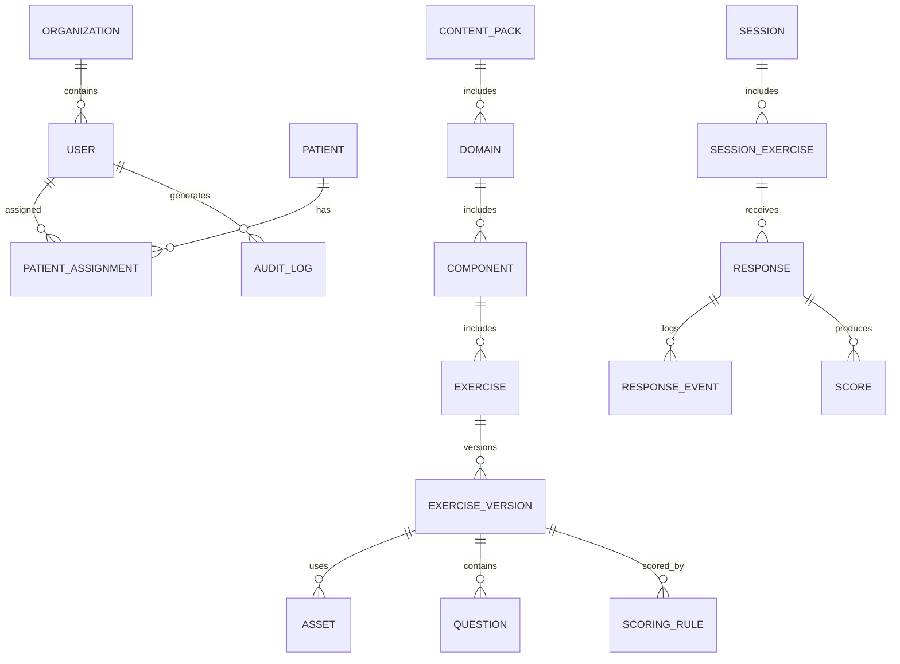
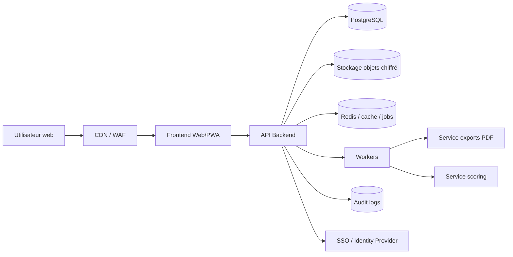
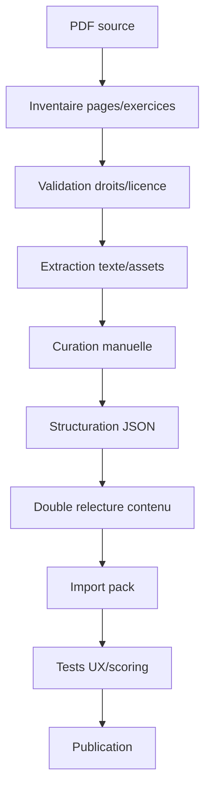

# Spécification exhaustive d'un outil web pour utiliser E.S.C.A.P.E. en ligne

**Document de spécification fonctionnelle et technique**  
**Source principale analysée :** `ESCAPE (complet).pdf`, 117 pages, *E.S.C.A.P.E. - Exercices de Stimulation Cognitive Avec Psychoéducation*, Emma Garcia et Mathieu Cerbai, © 2022.  
**Version de ce fichier :** 1.0  
**Langue cible :** français  
**Public cible du projet web :** psychologues, neuropsychologues, ergothérapeutes, orthophonistes, professionnels de remédiation cognitive, institutions de soin, associations, patients/usagers accompagnés et aidants selon paramétrage.

---

## 1. Objet du document

Ce fichier décrit de manière détaillée l'outil E.S.C.A.P.E. et propose une spécification technique complète pour développer une application web permettant de l'utiliser en ligne.

L'objectif n'est pas seulement de numériser les pages du PDF. L'objectif est de transformer l'outil en une plateforme interactive, suivable, paramétrable, sécurisée et exploitable en contexte clinique, psychoéducatif ou d'accompagnement cognitif.

Le document couvre :

- la structure pédagogique de l'outil original ;
- l'inventaire des domaines cognitifs et types d'exercices ;
- les parcours utilisateurs ;
- les modules fonctionnels attendus ;
- les modèles de données ;
- les API ;
- l'architecture logicielle ;
- les composants d'interface ;
- les algorithmes d'exercices et de scoring ;
- la sécurité, la confidentialité, l'accessibilité et la conformité ;
- le plan de migration du PDF vers une application web ;
- une feuille de route MVP puis production.

> **Point juridique important :** le PDF source indique un copyright. La mise en ligne du contenu original, de ses textes, images, exercices, solutions et illustrations doit être validée avec les ayants droit ou réalisée uniquement dans un cadre contractuellement autorisé. Le présent fichier est une spécification de conception et ne constitue pas une autorisation de reproduction.

---

## 2. Description synthétique d'E.S.C.A.P.E.

E.S.C.A.P.E. signifie **Exercices de Stimulation Cognitive Avec Psychoéducation**. L'outil combine :

1. des explications simples sur des fonctions cognitives couramment abordées en neuropsychologie ;
2. des exercices pratiques ;
3. des supports de correction et de discussion ;
4. des ressources bibliographiques et web.

Le document original présente des exercices dans six grands domaines :

| Domaine | Pages principales | Finalité générale |
|---|---:|---|
| Mémoire de travail | 4-21 | Maintien temporaire, manipulation, mise à jour, charge mentale, interférences. |
| Mémoire épisodique | 22-35 | Encodage et rappel verbal, visuel, contextuel, autobiographique/prospectif selon psychoéducation. |
| Fonctions exécutives | 36-68 | Inhibition, flexibilité, planification, organisation, adaptation à l'imprévu. |
| Attention | 69-82 | Attention sélective, attention divisée, recherche visuelle, marquage textuel, compréhension. |
| Cognition sociale | 83-93 | Théorie de l'esprit, implicites, reconnaissance émotionnelle, perception sociale. |
| Métacognition | 94-99 | Biais cognitifs, style d'attribution, biais de confirmation. |

Le fichier contient ensuite les **solutions et pistes de correction** de la page 100 à la page 116, puis une page de **ressources** en page 117.

L'introduction de l'outil indique qu'il regroupe des exercices de stimulation cognitive et de psychoéducation, que les fonctions cognitives sont découpées en sous-composantes puis déclinées en exercices, et que les solutions sont disponibles en fin d'ouvrage. Elle précise aussi que l'outil est complémentaire des techniques de remédiation cognitive centrées sur le transfert dans les activités de la vie quotidienne.

---

## 3. Principes pédagogiques et cliniques à préserver

### 3.1. Psychoéducation avant exercice

Chaque grand domaine doit proposer un module de psychoéducation avant les exercices. Dans l'application, cela doit être rendu sous forme de :

- fiche courte lisible ;
- version audio optionnelle ;
- schéma simplifié ;
- exemples de la vie quotidienne ;
- bouton « J'ai compris » ou « Passer à l'exercice » ;
- possibilité pour le thérapeute d'ajouter des commentaires personnalisés.

### 3.2. Travail guidé plutôt que simple quiz

Une partie importante des exercices n'a pas une seule bonne réponse. Certains exercices visent la discussion, l'élaboration de stratégies ou l'observation des processus, par exemple :

- organisation d'une journée ;
- plan de table ;
- adaptation face à des imprévus ;
- perception sociale ;
- biais d'attribution ;
- recherche d'hypothèses alternatives.

L'application ne doit donc pas réduire tout le contenu à une correction automatique. Elle doit distinguer :

- les exercices automatiquement scorables ;
- les exercices semi-scorables ;
- les exercices à correction thérapeute ;
- les exercices de discussion sans score normatif.

### 3.3. Complémentarité avec la remédiation cognitive

L'application doit permettre de faire le lien entre exercice et vie quotidienne. Pour chaque session, le thérapeute doit pouvoir renseigner :

- stratégie utilisée ;
- aide nécessaire ;
- transfert possible ;
- exemple personnel évoqué par l'usager ;
- tâche de généralisation à réaliser avant la prochaine séance.

### 3.4. Non-substitution au jugement clinique

L'application doit afficher clairement :

- qu'elle n'est pas un outil diagnostique autonome ;
- qu'elle ne remplace pas une évaluation neuropsychologique ;
- que les scores internes sont des indicateurs de suivi et non des normes cliniques ;
- que les interprétations doivent être effectuées par un professionnel formé lorsque l'outil est utilisé en soin.

---

## 4. Inventaire détaillé du contenu original

### 4.1. Couverture, sommaire et introduction

| Pages | Contenu | Fonction dans l'application |
|---:|---|---|
| 1 | Couverture, auteurs, domaines, titre complet. | Page d'accueil du pack de contenu, mentions, crédits. |
| 2 | Sommaire. | Navigation globale du catalogue. |
| 3 | Introduction, définitions de stimulation cognitive et psychoéducation, architecture du programme, note sur la remédiation cognitive. | Module d'orientation, avertissement clinique, tutoriel d'usage. |

### 4.2. Mémoire de travail

| Pages | Composante / exercice | Type web recommandé | Scoring |
|---:|---|---|---|
| 4 | Psychoéducation mémoire de travail : conservation temporaire, orientation vers mémoire à long terme, boucle phonologique, buffer épisodique, calepin visuospatial, exemples quotidiens. | Fiche psychoéducative enrichie. | Pas de score. |
| 5-14 | Charge mentale : anagrammes par catégories, villes, animaux, santé, desserts, divers. | Exercice `ANAGRAM_SOLVE`. | Automatique avec normalisation. |
| 15 | Mise à jour : 2-back chiffres et lettres, réponse par tap/clic quand le stimulus est identique à l'avant-dernier. | Exercice `N_BACK_STREAM`. | Automatique : hits, omissions, fausses alarmes, temps de réaction. |
| 16-17 | Mise à jour : 2-back sur lettres, lettres retenues formant des anagrammes. | Exercice `N_BACK_TO_ANAGRAM`. | Mixte : détection 2-back + résolution mot final. |
| 18-19 | Lecture : choisir des mots à retenir dans des textes, puis rappel selon ordre du texte, taille des mots ou ordre alphabétique. | Exercice `TEXT_WORD_RECALL_REORDER`. | Semi-automatique, validation thérapeute possible. |
| 20-21 | Écoute : même logique avec textes lus ou audio. | Exercice `AUDIO_TEXT_WORD_RECALL_REORDER`. | Semi-automatique. |

Sous-composantes à représenter dans les métadonnées :

- charge mentale ;
- mise à jour ;
- gestion d'interférences ;
- boucle phonologique ;
- calepin visuospatial ;
- buffer épisodique ;
- maintien/manipulation verbale ;
- maintien/manipulation auditivo-verbale.

### 4.3. Mémoire épisodique

| Pages | Composante / exercice | Type web recommandé | Scoring |
|---:|---|---|---|
| 22 | Infographie sur les mémoires : procédurale, épisodique, autobiographique, sémantique, mémoire de travail. | Fiche interactive ou infographie responsive. | Pas de score. |
| 23 | Psychoéducation mémoire épisodique : passé, futur/prospectif, verbal, non-verbal. | Fiche psychoéducative. | Pas de score. |
| 24 | Vidéo sur Nelson Mandela puis questions. | `VIDEO_MEMORY_QA`. | Semi-automatique ou manuel. |
| 25-27 | Lecture sur le Tour de France puis questions. | `READING_MEMORY_QA`. | Automatique partiel + correction humaine. |
| 28-35 | Observation d'images pendant 30 secondes puis questions de rappel. | `IMAGE_OBSERVATION_RECALL`. | Automatique partiel pour réponses fermées, manuel pour réponses libres. |

Sous-composantes à représenter :

- mémoire épisodique verbale ;
- mémoire épisodique visuelle/non verbale ;
- encodage ;
- rappel libre ;
- rappel indicé ;
- rappel de détails perceptifs ;
- rappel contextuel.

### 4.4. Fonctions exécutives

| Pages | Composante / exercice | Type web recommandé | Scoring |
|---:|---|---|---|
| 36 | Psychoéducation : flexibilité mentale, inhibition, planification/organisation, lien avec attention. | Fiche psychoéducative. | Pas de score. |
| 37 | Inhibition : dessiner l'inverse de consignes couleur/forme/position. | `INVERSE_RULE_DRAWING`. | Manuel ou automatisé si canvas structuré. |
| 38 | Inhibition : produire la consigne inverse à partir de formes. | `INVERSE_RULE_TEXT`. | Automatique possible si réponses fermées. |
| 39 | Inhibition : exercice « à contresens ». | `REVERSE_INSTRUCTION`. | À définir selon contenu graphique exact. |
| 40-46 | Planification : sélectionner la meilleure destination de vacances selon dates, critères et budget. | `CONSTRAINT_DECISION_BUDGET`. | Automatique sur choix final + justification. |
| 47-52 | Plan de table : organiser trois tables avec contraintes sociales et alimentaires. | `SEATING_PLAN_CONSTRAINT_SOLVER`. | Automatique si contraintes modélisées. |
| 53-55 | Organisation d'une journée d'anniversaire avec horaires, lieux, contraintes d'ouverture, trajets. | `SCHEDULING_PLANNING_CANVAS`. | Semi-automatique, plusieurs solutions valables. |
| 56-58 | Flexibilité : classement alphabétique, alternance catégories, nombres pairs/impairs, calculs puis tri. | `SORT_ALTERNATE_CATEGORIES`. | Automatique. |
| 59-63 | Flexibilité : organisation d'un repas de Noël, plan de logement, questions et imprévus thérapeute. | `SCENARIO_PLANNING_WITH_EVENTS`. | Manuel et grille d'observation. |
| 64-68 | Flexibilité : scénario comptable, tâches professionnelles, calculs de salaires, imprévus. | `WORKDAY_PLANNING_WITH_EVENTS`. | Semi-automatique + observation. |

Sous-composantes à représenter :

- inhibition ;
- flexibilité ;
- planification ;
- organisation ;
- résolution de contraintes ;
- adaptation à l'imprévu ;
- priorisation ;
- maintien d'objectif ;
- gestion de charge cognitive en contexte complexe.

### 4.5. Attention

| Pages | Composante / exercice | Type web recommandé | Scoring |
|---:|---|---|---|
| 69 | Psychoéducation : intensité de l'attention, alerte, vigilance, attention soutenue, sélectivité, attention sélective, attention partagée. | Fiche psychoéducative. | Pas de score. |
| 70-73 | Attention sélective : marquer des lettres ou catégories grammaticales dans des textes. | `TEXT_MARKING_SELECTIVE_ATTENTION`. | Automatique par offsets de caractères ou tokens. |
| 74-78 | Recherche visuelle : trouver rapidement certains objets dans des images. | `VISUAL_SEARCH_IMAGE`. | Clics, temps, exactitude par zones. |
| 79-82 | Attention divisée : marquer des éléments dans un texte tout en mémorisant/comprenant pour répondre à des questions. | `DIVIDED_ATTENTION_TEXT_QA`. | Double score : marquage + compréhension. |

Sous-composantes à représenter :

- alerte ;
- vigilance ;
- attention soutenue ;
- attention sélective ;
- attention divisée/partagée ;
- vitesse de traitement ;
- précision de détection ;
- double tâche.

### 4.6. Cognition sociale

| Pages | Composante / exercice | Type web recommandé | Scoring |
|---:|---|---|---|
| 83 | Psychoéducation : cognition sociale, théorie de l'esprit, perception sociale, reconnaissance des émotions. | Fiche psychoéducative. | Pas de score. |
| 84-85 | Théorie de l'esprit : présupposés. | `INFERENCE_PRESUPPOSITION`. | Semi-automatique. |
| 86-87 | Théorie de l'esprit : sous-entendus. | `INFERENCE_IMPLICIT_MEANING`. | Semi-automatique. |
| 88-89 | Reconnaissance des émotions : visages et définitions des émotions de base. | `EMOTION_RECOGNITION_FACE`. | Automatique si réponses fermées, discussion guidée. |
| 90 | Percevoir les émotions chez les autres : indices non faciaux, ton, posture, gestes. | `EMOTION_CUE_DISCUSSION`. | Pas de score normatif. |
| 91-93 | Perception sociale : adapter son comportement selon interlocuteur et contexte, jeux de rôle. | `SOCIAL_CONTEXT_ROLEPLAY`. | Grille clinique. |

Sous-composantes à représenter :

- théorie de l'esprit ;
- inférence pragmatique ;
- lecture des implicites ;
- reconnaissance émotionnelle ;
- perception sociale ;
- adaptation comportementale ;
- jeux de rôle.

### 4.7. Métacognition

| Pages | Composante / exercice | Type web recommandé | Scoring |
|---:|---|---|---|
| 94 | Psychoéducation : recul sur ses pensées, biais d'attribution, biais de confirmation, illusion de corrélation. | Fiche psychoéducative. | Pas de score. |
| 95-97 | Style d'attribution : générer plusieurs hypothèses causales pour un événement. | `ATTRIBUTION_STYLE_GENERATION`. | Manuel, grille d'équilibre des attributions. |
| 98-99 | Biais de confirmation : générer des informations contradictoires à une croyance initiale. | `CONFIRMATION_BIAS_COUNTEREVIDENCE`. | Manuel, grille qualitative. |

Sous-composantes à représenter :

- prise de recul ;
- identification de biais ;
- multiplicité d'hypothèses ;
- auto-attribution, attribution externe, attribution situationnelle ;
- recherche d'informations infirmantes ;
- flexibilité cognitive appliquée aux croyances.

### 4.8. Solutions et ressources

| Pages | Contenu | Usage web |
|---:|---|---|
| 100-116 | Réponses, solutions, exemples de correction, commentaires indiquant parfois plusieurs réponses possibles. | Module « correction thérapeute », feedback différé, banque de réponses attendues, grilles d'aide à la cotation. |
| 117 | Sources web et bibliographiques. | Page ressources, traçabilité des contenus, bibliographie. |

---

## 5. Périmètre produit

### 5.1. Objectif principal

Créer une application web permettant de consulter, administrer, réaliser, corriger et suivre les exercices E.S.C.A.P.E. dans un environnement numérique sécurisé.

### 5.2. Objectifs secondaires

- Réduire le temps de préparation des séances.
- Permettre une passation en présentiel, distanciel synchrone ou autonomie encadrée.
- Centraliser les résultats et observations.
- Autoriser des adaptations de difficulté.
- Conserver l'esprit psychoéducatif et discussionnel de l'outil.
- Faciliter l'export de comptes rendus non diagnostiques.
- Proposer un mode impression lorsque le papier reste préférable.

### 5.3. Hors périmètre à clarifier

- Diagnostic automatisé.
- Normes neuropsychologiques standardisées.
- Recommandation thérapeutique autonome.
- Génération automatique de contenu clinique sans validation professionnelle.
- Publication du contenu protégé sans licence.

---

## 6. Profils utilisateurs et permissions

### 6.1. Rôles

| Rôle | Description | Permissions clés |
|---|---|---|
| Super administrateur | Responsable plateforme. | Gestion globale, organisations, packs, sécurité. |
| Administrateur organisation | Responsable institution/cabinet. | Gestion des praticiens, licences, paramètres. |
| Thérapeute / professionnel | Utilisateur principal. | Patients, séances, exercices, corrections, notes, exports. |
| Patient / participant | Réalise les exercices. | Accès aux exercices assignés, historique personnel limité. |
| Aidant / accompagnant | Accompagne un participant. | Accès optionnel aux consignes et devoirs, jamais aux notes cliniques sauf autorisation. |
| Éditeur de contenu | Crée/adapte des exercices. | CRUD contenu non publié, soumission validation. |
| Validateur clinique | Relit et valide le contenu. | Validation, publication, dépublication. |
| Auditeur conformité | Contrôle sécurité/conformité. | Lecture journaux, rapports, pas de données cliniques nominatives sauf base légale. |

### 6.2. Matrice d'accès simplifiée

| Ressource | Admin org. | Thérapeute | Patient | Aidant | Éditeur | Validateur |
|---|---:|---:|---:|---:|---:|---:|
| Catalogue public de contenus | R | R | R limité | R limité | R/W brouillon | R/W validation |
| Données patient identifiantes | R/W org | R/W patients assignés | R soi-même | R si autorisé | Non | Non |
| Notes thérapeute | R selon politique | R/W | Non par défaut | Non | Non | Non |
| Réponses d'exercice | R agrégé | R/W correction | R soi-même selon paramétrage | Non | Non | Non |
| Solutions | R | R | Masqué jusqu'au feedback | Masqué | R/W si contenu | R/W |
| Exports | R | R/W | R limité | Non | Non | Non |
| Logs sécurité | R limité | Non | Non | Non | Non | Non |

---

## 7. Parcours utilisateurs

### 7.1. Parcours thérapeute : créer une séance

1. Connexion sécurisée.
2. Sélection ou création d'un patient.
3. Accès au catalogue E.S.C.A.P.E.
4. Filtrage par domaine cognitif, composante, durée, difficulté, modalité.
5. Ajout de fiches psychoéducatives et d'exercices dans une séance.
6. Paramétrage : temps d'exposition, consignes audio, aide autorisée, feedback immédiat ou différé.
7. Lancement en mode présentiel ou génération d'un lien sécurisé.
8. Suivi en temps réel ou correction différée.
9. Débriefing avec notes et stratégie de transfert.
10. Export PDF/HTML du résumé de séance.

### 7.2. Parcours patient : réaliser une séance guidée

1. Accès via invitation sécurisée ou connexion.
2. Consentement/confirmation d'identité simple.
3. Écran d'accueil avec consignes générales.
4. Psychoéducation courte.
5. Exercice interactif.
6. Pause entre exercices.
7. Auto-évaluation : difficulté perçue, fatigue, stratégie utilisée.
8. Feedback adapté selon paramétrage.
9. Message de fin et éventuelle tâche de généralisation.

### 7.3. Parcours thérapeute : correction et debrief

1. Accès aux réponses.
2. Visualisation des scores automatiques et éléments à corriger.
3. Annotation qualitative : persévérations, impulsivité, lenteur, stratégie, aide, fatigue.
4. Comparaison avec séances précédentes.
5. Sélection de points de discussion.
6. Génération d'une synthèse concise.

### 7.4. Parcours éditeur : créer un exercice compatible E.S.C.A.P.E.

1. Choisir un template d'exercice.
2. Renseigner le domaine, composante, objectifs, consignes.
3. Ajouter stimuli, médias, réponses attendues, critères de cotation.
4. Tester l'exercice en prévisualisation.
5. Soumettre à validation clinique et conformité.
6. Publier dans un pack versionné.

---

## 8. Modules fonctionnels

### 8.1. Module catalogue

Fonctionnalités :

- navigation par domaine ;
- recherche plein texte ;
- filtres : composante, type d'exercice, durée, difficulté, score automatique, modalité, besoin d'un thérapeute ;
- fiche exercice ;
- aperçu patient ;
- aperçu thérapeute avec solutions ;
- statut de licence du contenu ;
- page d'origine dans le PDF ;
- version du contenu ;
- tags cliniques.

### 8.2. Module séance

Fonctionnalités :

- créer une séance libre ;
- utiliser un programme prédéfini ;
- ordonner les exercices ;
- définir une durée cible ;
- insérer des pauses ;
- paramétrer feedback et solutions ;
- générer lien distanciel à usage unique ;
- contrôler l'avancement en direct ;
- reprendre une séance interrompue.

### 8.3. Moteur d'exercices

Le moteur d'exercices doit être basé sur des templates paramétriques.

Chaque template doit gérer :

- rendu des consignes ;
- rendu des stimuli ;
- collecte de réponse ;
- timer ;
- aides ;
- feedback ;
- métriques ;
- export des événements ;
- adaptation aux écrans tactiles et clavier/souris ;
- mode thérapeute et mode patient.

### 8.4. Module psychoéducation

Fonctionnalités :

- fiches simples ;
- audio TTS ou enregistrement professionnel ;
- schémas ;
- exemples du quotidien ;
- mini-questions de compréhension optionnelles ;
- bouton « reformuler » côté thérapeute ;
- association directe à des exercices.

### 8.5. Module correction

Fonctionnalités :

- correction automatique ;
- correction semi-automatique avec propositions ;
- grille manuelle ;
- notation qualitative ;
- masquage des solutions côté patient ;
- feedback différé ;
- historique des corrections ;
- justification des scores modifiés manuellement.

### 8.6. Module suivi

Fonctionnalités :

- historique par patient ;
- progression par domaine ;
- graphiques de tendances ;
- temps de passation ;
- niveau d'aide ;
- auto-évaluation fatigue/difficulté ;
- comparaison intra-individuelle ;
- export de synthèse.

### 8.7. Module contenus et licences

Fonctionnalités :

- création de packs ;
- versionnage ;
- droits par organisation ;
- mentions de copyright ;
- audit des modifications ;
- statut : brouillon, en relecture, validé, publié, archivé ;
- traçabilité de la source.

### 8.8. Module administration

Fonctionnalités :

- gestion organisations ;
- gestion utilisateurs ;
- rôles et permissions ;
- authentification forte ;
- politiques de mot de passe ou SSO ;
- gestion de conservation des données ;
- exports RGPD ;
- journaux d'audit ;
- paramétrage de sécurité.

---

## 9. Typologie exhaustive des templates d'exercices

### 9.1. `ANAGRAM_SOLVE`

**Exemples source :** charge mentale, catégories villes, animaux, santé, desserts, divers.

**Interface :**

- affichage des lettres mélangées ;
- champ de réponse ;
- bouton valider ;
- option indices : catégorie, première lettre, nombre de lettres ;
- possibilité de déplacer les lettres par glisser-déposer ;
- mode plein écran ou fiche imprimable.

**Paramètres :**

- nombre d'items ;
- catégorie ;
- casse ;
- accents acceptés ou non ;
- ordre des items ;
- durée maximale ;
- feedback immédiat/différé.

**Scoring :**

- exactitude par item ;
- temps par item ;
- nombre d'indices utilisés ;
- nombre d'essais ;
- réponse normalisée : accents, tirets, espaces, apostrophes.

### 9.2. `N_BACK_STREAM`

**Exemple source :** 2-back chiffres et lettres.

**Interface :**

- présentation séquentielle audio ou visuelle ;
- bouton/touche de réponse ;
- mode thérapeute : lecture manuelle possible ;
- mode patient : lecture automatique à cadence contrôlée ;
- retour minimal pour éviter l'apprentissage de réponse pendant l'épreuve.

**Paramètres :**

- `n` : 1-back, 2-back, 3-back ;
- type de stimulus : chiffres, lettres, images, sons ;
- intervalle inter-stimulus ;
- durée d'affichage ;
- fenêtre de réponse ;
- séquence fixe ou générée ;
- probabilité de cible ;
- pause ;
- entraînement préalable.

**Métriques :**

- hits ;
- misses ;
- fausses alarmes ;
- rejets corrects ;
- temps de réaction moyen ;
- variabilité du temps de réaction ;
- d' indicatif si souhaité ;
- évolution par bloc.

### 9.3. `N_BACK_TO_ANAGRAM`

**Exemple source :** relever les lettres 2-back puis former un mot.

**Processus :**

1. Présenter une séquence de lettres.
2. L'utilisateur signale les cibles 2-back ou les note.
3. Les lettres retenues sont utilisées pour résoudre un anagramme.
4. Le système sépare score de détection et score de résolution.

**Particularité :** ce template combine mise à jour, maintien, sélection et réorganisation.

### 9.4. `TEXT_WORD_RECALL_REORDER`

**Exemples source :** textes de lecture sur Frida Kahlo, Kurt Cobain, droit de vote, dinosaures.

**Interface :**

- texte affiché ou lu ;
- sélection de mots à retenir ;
- écran de rappel ;
- contraintes de rappel : ordre du texte, ordre alphabétique, ordre inverse, longueur croissante/décroissante.

**Scoring :**

- mots correctement rappelés ;
- ordre correct ;
- erreurs d'intrusion ;
- omissions ;
- respect de la contrainte ;
- commentaires thérapeute.

### 9.5. `VIDEO_MEMORY_QA`

**Exemple source :** vidéo Nelson Mandela.

**Interface :**

- lecteur vidéo intégré ou lien externe ;
- consentement cookies si lecteur tiers ;
- mode plein écran ;
- bloc questions ;
- réponse libre ou QCM selon configuration.

**Points techniques :**

- privilégier l'hébergement interne si licence ;
- prévoir fallback lien externe ;
- éviter de dépendre exclusivement d'une plateforme tierce ;
- enregistrer uniquement la progression, pas la vidéo elle-même sans droits.

### 9.6. `READING_MEMORY_QA`

**Exemples source :** texte Tour de France + questions.

**Interface :**

- texte masquable après lecture ;
- timer facultatif ;
- questions de rappel ;
- possibilité d'afficher ou non le texte pendant la réponse ;
- mode correction avec réponses attendues.

**Scoring :**

- questions exactes ;
- réponses partielles ;
- mots-clés attendus ;
- tolérance orthographique ;
- note qualitative.

### 9.7. `IMAGE_OBSERVATION_RECALL`

**Exemples source :** images à observer 30 secondes puis questions.

**Interface :**

- image affichée pendant une durée définie ;
- blocage ou autorisation de retour à l'image selon paramétrage ;
- questions de rappel ;
- format texte, QCM, nombre, couleur, vrai/faux.

**Scoring :**

- réponses exactes ;
- erreurs perceptives ;
- temps de réponse ;
- stratégie déclarée.

### 9.8. `INVERSE_RULE_DRAWING`

**Exemple source :** dessiner l'inverse couleur/forme/position.

**Interface :**

- règles visibles ;
- consignes une à une ;
- canvas avec grille ;
- palette limitée de formes/couleurs ;
- zones haut/bas/gauche/droite ;
- correction visuelle.

**Scoring automatique possible si :**

- les réponses sont structurées en objets `{shape, color, xZone, yZone}` ;
- les règles inverses sont modélisées ;
- le canvas impose les positions.

### 9.9. `REVERSE_INSTRUCTION`

**Usage :** faire l'inverse d'une instruction, verbalement, graphiquement ou par choix.

**Scoring :**

- exactitude de transformation ;
- inhibition de la réponse automatique ;
- délai de réponse ;
- autocorrections.

### 9.10. `CONSTRAINT_DECISION_BUDGET`

**Exemple source :** choix de destination de vacances selon dates, mer/soleil, lit, petit-déjeuner, visites, budget.

**Interface :**

- écran scénario ;
- cartes options ;
- tableau comparatif ;
- zone calcul ;
- choix final ;
- justification libre ;
- aide progressive : critères, élimination, calcul.

**Scoring :**

- destination choisie ;
- critères appliqués ;
- budget calculé ;
- justification ;
- nombre d'aides ;
- stratégie.

### 9.11. `SEATING_PLAN_CONSTRAINT_SOLVER`

**Exemple source :** plan de table avec contraintes sociales et alimentaires.

**Interface :**

- drag-and-drop des personnes ;
- trois tables ;
- choix du plat par table ;
- panneau contraintes ;
- validation contrainte par contrainte ;
- mode indices.

**Scoring :**

- nombre de contraintes satisfaites ;
- contraintes critiques non respectées ;
- solution complète ;
- nombre de déplacements ;
- temps ;
- persévérations.

### 9.12. `SCHEDULING_PLANNING_CANVAS`

**Exemple source :** organisation d'anniversaire de 9h à 17h avec tâches, commerces, trajets, horaires d'ouverture.

**Interface :**

- timeline verticale ou horizontale ;
- cartes tâches ;
- contraintes de durée ;
- lieux ;
- horaires d'ouverture ;
- alerte conflit ;
- mode thérapeute : accepter plusieurs solutions.

**Scoring :**

- respect contraintes horaires ;
- achèvement des tâches ;
- cohérence temporelle ;
- optimisation approximative ;
- stratégie d'organisation ;
- discussion plutôt que score unique.

### 9.13. `SORT_ALTERNATE_CATEGORIES`

**Exemples source :** mots par ordre alphabétique, alternance fruits/légumes, villes/prénoms, nombres pairs/impairs, calculs puis tri.

**Interface :**

- liste d'éléments ;
- drag-and-drop ;
- saisie ordonnée ;
- affichage calculateur désactivable ;
- contraintes visibles.

**Scoring :**

- ordre correct ;
- respect d'alternance ;
- calculs corrects ;
- erreurs de catégorie ;
- temps.

### 9.14. `SCENARIO_PLANNING_WITH_EVENTS`

**Exemples source :** repas de Noël, scénario comptable, fiches thérapeute, imprévus.

**Interface :**

- scénario ;
- plan du lieu ;
- tâches ;
- organisation proposée ;
- événements imprévus déclenchés par le thérapeute ;
- réponses libres ;
- grille d'observation.

**Scoring :**

- principalement qualitatif ;
- note de flexibilité ;
- niveau d'aide ;
- capacité à maintenir l'objectif ;
- émotion/réaction à l'imprévu ;
- faisabilité du plan.

### 9.15. `TEXT_MARKING_SELECTIVE_ATTENTION`

**Exemples source :** entourer des lettres, souligner des lettres, repérer noms communs féminins/masculins.

**Interface :**

- texte cliquable tokenisé ;
- outil entourer/souligner/surligner ;
- consigne affichée ;
- zoom ;
- validation ;
- gestion tactile.

**Scoring :**

- cibles trouvées ;
- cibles manquées ;
- distracteurs sélectionnés ;
- précision ;
- vitesse ;
- score par catégorie.

### 9.16. `VISUAL_SEARCH_IMAGE`

**Exemples source :** chercher plantes, pommes, mallettes, chats, lapins, objets dans images.

**Interface :**

- image haute résolution ;
- zoom/pan ;
- clic/tap sur objets ;
- liste de cibles ;
- compteur visible ou masqué ;
- temps limité ou libre.

**Données nécessaires :**

- zones polygonales ou rectangles pour chaque cible ;
- libellés ;
- tolérance de clic ;
- distracteurs optionnels.

**Scoring :**

- objets trouvés ;
- fausses sélections ;
- temps premier clic ;
- temps total ;
- ordre de recherche ;
- zones explorées si eye tracking non disponible, approximées par pan/zoom/clics.

### 9.17. `DIVIDED_ATTENTION_TEXT_QA`

**Exemples source :** lire un texte, entourer des lettres ou souligner des noms, puis répondre à des questions.

**Interface :**

- texte interactif ;
- tâche de marquage ;
- questions de compréhension après lecture ;
- interdiction optionnelle de retour au texte.

**Scoring :**

- score de marquage ;
- score de rappel/compréhension ;
- compromis vitesse-précision ;
- notes de stratégie.

### 9.18. `INFERENCE_PRESUPPOSITION`

**Exemples source :** trouver ce qui est admis au préalable dans un énoncé.

**Interface :**

- énoncé ;
- champ réponse ;
- exemples ;
- bouton « demander un indice » ;
- correction thérapeute.

**Scoring :**

- manuel ou semi-automatique par mots-clés ;
- pertinence ;
- explicitation ;
- capacité à distinguer présupposé et interprétation libre.

### 9.19. `INFERENCE_IMPLICIT_MEANING`

**Exemples source :** sous-entendus sociaux.

**Scoring :**

- semi-automatique ;
- validation thérapeute ;
- discussion.

### 9.20. `EMOTION_RECOGNITION_FACE`

**Exemples source :** émotions de base : joie, tristesse, colère, surprise, peur, dégoût.

**Interface :**

- image/visage ou illustration ;
- choix de l'émotion ;
- justification : « à quoi le voyez-vous ? » ;
- comparaison avec définitions ;
- variantes culturelles/personnelles à discuter.

**Scoring :**

- choix émotion ;
- indices évoqués ;
- confusion entre émotions ;
- reconnaissance multimodale si audio/vidéo ajouté.

### 9.21. `EMOTION_CUE_DISCUSSION`

**Usage :** discuter des indices non faciaux : ton, posture, gestes, attitude.

**Scoring :**

- pas de score automatique ;
- grille de richesse des indices ;
- capacité à générer des exemples.

### 9.22. `SOCIAL_CONTEXT_ROLEPLAY`

**Exemples source :** changer les codes selon patron, ami, serveur, proche, supérieure, enfant, parent, hôte de caisse.

**Interface :**

- carte situation ;
- choix ou réponse libre ;
- mode mime/jeu de rôle ;
- enregistrement audio/vidéo optionnel avec consentement explicite ;
- grille thérapeute.

**Scoring :**

- adéquation au contexte ;
- registre de langage ;
- assertivité ;
- respect de l'interlocuteur ;
- alternatives proposées.

### 9.23. `ATTRIBUTION_STYLE_GENERATION`

**Exemples source :** générer causes « ma faute », « faute des autres », « situation/hasard ».

**Interface :**

- scénario ;
- trois colonnes d'hypothèses ;
- compteur d'hypothèses ;
- discussion ;
- synthèse.

**Scoring :**

- équilibre des attributions ;
- diversité ;
- rigidité ;
- capacité à envisager contexte.

### 9.24. `CONFIRMATION_BIAS_COUNTEREVIDENCE`

**Exemples source :** générer des informations contraires à une croyance initiale.

**Interface :**

- croyance initiale ;
- champ « informations qui contredisent » ;
- reformulation ;
- question : « de quoi auriez-vous besoin pour vérifier ? » ;
- discussion.

**Scoring :**

- nombre d'alternatives ;
- plausibilité ;
- distance à la croyance initiale ;
- capacité à chercher des données infirmantes.

---

## 10. Modèle de données conceptuel

### 10.1. Entités principales



### 10.2. Contenu

- `ContentPack` : pack E.S.C.A.P.E. officiel ou pack dérivé.
- `Domain` : grand domaine cognitif.
- `Component` : sous-composante.
- `Exercise` : exercice logique stable.
- `ExerciseVersion` : version publiée d'un exercice.
- `Asset` : image, audio, vidéo, fichier source, transcription.
- `Question` : question ou item.
- `ExpectedAnswer` : réponse attendue.
- `ScoringRule` : règle de correction.

### 10.3. Passation

- `Session` : séance complète.
- `SessionExercise` : passation d'un exercice dans une séance.
- `Response` : réponse globale ou itemisée.
- `ResponseEvent` : clic, frappe, pause, indice, changement de réponse.
- `Score` : score automatique ou manuel.
- `TherapistNote` : observation qualitative.
- `SelfRating` : fatigue, difficulté, intérêt, stratégie perçue.

### 10.4. Gouvernance

- `Organization` : cabinet, service, institution.
- `User` : compte applicatif.
- `Patient` : participant.
- `ConsentRecord` : consentement et information.
- `AuditLog` : trace d'accès/modification.
- `DataExport` : exports générés.
- `RetentionPolicy` : politique de conservation.

---

## 11. Schéma relationnel proposé

Le schéma ci-dessous est volontairement détaillé mais doit être adapté au framework retenu.

```sql
CREATE TABLE organizations (
  id UUID PRIMARY KEY,
  name TEXT NOT NULL,
  slug TEXT UNIQUE NOT NULL,
  country_code CHAR(2) DEFAULT 'FR',
  created_at TIMESTAMPTZ NOT NULL DEFAULT now(),
  updated_at TIMESTAMPTZ NOT NULL DEFAULT now()
);

CREATE TABLE users (
  id UUID PRIMARY KEY,
  organization_id UUID REFERENCES organizations(id),
  email CITEXT UNIQUE NOT NULL,
  display_name TEXT NOT NULL,
  role TEXT NOT NULL CHECK (role IN (
    'SUPER_ADMIN','ORG_ADMIN','THERAPIST','PATIENT','CAREGIVER','CONTENT_EDITOR','CLINICAL_REVIEWER','AUDITOR'
  )),
  status TEXT NOT NULL DEFAULT 'ACTIVE' CHECK (status IN ('INVITED','ACTIVE','DISABLED','DELETED')),
  locale TEXT NOT NULL DEFAULT 'fr-FR',
  mfa_enabled BOOLEAN NOT NULL DEFAULT false,
  last_login_at TIMESTAMPTZ,
  created_at TIMESTAMPTZ NOT NULL DEFAULT now(),
  updated_at TIMESTAMPTZ NOT NULL DEFAULT now()
);

CREATE TABLE patients (
  id UUID PRIMARY KEY,
  organization_id UUID REFERENCES organizations(id),
  external_reference TEXT,
  pseudonym TEXT NOT NULL,
  birth_year SMALLINT,
  notes_encrypted BYTEA,
  status TEXT NOT NULL DEFAULT 'ACTIVE' CHECK (status IN ('ACTIVE','ARCHIVED','DELETED')),
  created_at TIMESTAMPTZ NOT NULL DEFAULT now(),
  updated_at TIMESTAMPTZ NOT NULL DEFAULT now()
);

CREATE TABLE patient_assignments (
  patient_id UUID REFERENCES patients(id) ON DELETE CASCADE,
  therapist_id UUID REFERENCES users(id) ON DELETE CASCADE,
  relationship TEXT DEFAULT 'PRIMARY',
  created_at TIMESTAMPTZ NOT NULL DEFAULT now(),
  PRIMARY KEY (patient_id, therapist_id)
);

CREATE TABLE consent_records (
  id UUID PRIMARY KEY,
  patient_id UUID REFERENCES patients(id) ON DELETE CASCADE,
  consent_type TEXT NOT NULL,
  version TEXT NOT NULL,
  accepted BOOLEAN NOT NULL,
  accepted_at TIMESTAMPTZ,
  withdrawn_at TIMESTAMPTZ,
  evidence JSONB NOT NULL DEFAULT '{}'
);

CREATE TABLE content_packs (
  id UUID PRIMARY KEY,
  code TEXT UNIQUE NOT NULL,
  title TEXT NOT NULL,
  description TEXT,
  language TEXT NOT NULL DEFAULT 'fr-FR',
  source_name TEXT,
  copyright_notice TEXT,
  license_status TEXT NOT NULL CHECK (license_status IN ('UNVERIFIED','LICENSED','INTERNAL_ONLY','PUBLIC_DOMAIN','CUSTOM')),
  version TEXT NOT NULL,
  status TEXT NOT NULL CHECK (status IN ('DRAFT','REVIEW','PUBLISHED','ARCHIVED')),
  created_at TIMESTAMPTZ NOT NULL DEFAULT now(),
  updated_at TIMESTAMPTZ NOT NULL DEFAULT now()
);

CREATE TABLE domains (
  id UUID PRIMARY KEY,
  content_pack_id UUID REFERENCES content_packs(id) ON DELETE CASCADE,
  code TEXT NOT NULL,
  title TEXT NOT NULL,
  description TEXT,
  source_pages INT4RANGE,
  display_order INT NOT NULL,
  UNIQUE(content_pack_id, code)
);

CREATE TABLE components (
  id UUID PRIMARY KEY,
  domain_id UUID REFERENCES domains(id) ON DELETE CASCADE,
  code TEXT NOT NULL,
  title TEXT NOT NULL,
  description TEXT,
  display_order INT NOT NULL,
  UNIQUE(domain_id, code)
);

CREATE TABLE exercises (
  id UUID PRIMARY KEY,
  component_id UUID REFERENCES components(id) ON DELETE SET NULL,
  code TEXT UNIQUE NOT NULL,
  title TEXT NOT NULL,
  template_type TEXT NOT NULL,
  summary TEXT,
  target_duration_seconds INT,
  therapist_required BOOLEAN NOT NULL DEFAULT false,
  source_pages INT4RANGE,
  created_at TIMESTAMPTZ NOT NULL DEFAULT now(),
  updated_at TIMESTAMPTZ NOT NULL DEFAULT now()
);

CREATE TABLE exercise_versions (
  id UUID PRIMARY KEY,
  exercise_id UUID REFERENCES exercises(id) ON DELETE CASCADE,
  version INT NOT NULL,
  status TEXT NOT NULL CHECK (status IN ('DRAFT','REVIEW','PUBLISHED','ARCHIVED')),
  instructions_patient JSONB NOT NULL,
  instructions_therapist JSONB NOT NULL DEFAULT '{}',
  configuration JSONB NOT NULL,
  scoring_policy JSONB NOT NULL DEFAULT '{}',
  source_trace JSONB NOT NULL DEFAULT '{}',
  created_by UUID REFERENCES users(id),
  reviewed_by UUID REFERENCES users(id),
  published_at TIMESTAMPTZ,
  created_at TIMESTAMPTZ NOT NULL DEFAULT now(),
  UNIQUE(exercise_id, version)
);

CREATE TABLE assets (
  id UUID PRIMARY KEY,
  exercise_version_id UUID REFERENCES exercise_versions(id) ON DELETE CASCADE,
  asset_type TEXT NOT NULL CHECK (asset_type IN ('IMAGE','AUDIO','VIDEO','PDF','TRANSCRIPT','JSON','OTHER')),
  storage_key TEXT NOT NULL,
  mime_type TEXT NOT NULL,
  alt_text TEXT,
  width INT,
  height INT,
  duration_seconds NUMERIC,
  checksum_sha256 TEXT NOT NULL,
  copyright_notice TEXT,
  metadata JSONB NOT NULL DEFAULT '{}'
);

CREATE TABLE sessions (
  id UUID PRIMARY KEY,
  organization_id UUID REFERENCES organizations(id),
  patient_id UUID REFERENCES patients(id),
  therapist_id UUID REFERENCES users(id),
  title TEXT NOT NULL,
  mode TEXT NOT NULL CHECK (mode IN ('IN_PERSON','REMOTE_SYNC','REMOTE_ASYNC','TRAINING','DEMO')),
  status TEXT NOT NULL CHECK (status IN ('DRAFT','SCHEDULED','IN_PROGRESS','COMPLETED','CANCELLED')),
  scheduled_at TIMESTAMPTZ,
  started_at TIMESTAMPTZ,
  completed_at TIMESTAMPTZ,
  settings JSONB NOT NULL DEFAULT '{}',
  created_at TIMESTAMPTZ NOT NULL DEFAULT now()
);

CREATE TABLE session_exercises (
  id UUID PRIMARY KEY,
  session_id UUID REFERENCES sessions(id) ON DELETE CASCADE,
  exercise_version_id UUID REFERENCES exercise_versions(id),
  display_order INT NOT NULL,
  status TEXT NOT NULL DEFAULT 'PENDING' CHECK (status IN ('PENDING','IN_PROGRESS','COMPLETED','SKIPPED')),
  started_at TIMESTAMPTZ,
  completed_at TIMESTAMPTZ,
  runtime_settings JSONB NOT NULL DEFAULT '{}'
);

CREATE TABLE responses (
  id UUID PRIMARY KEY,
  session_exercise_id UUID REFERENCES session_exercises(id) ON DELETE CASCADE,
  respondent_user_id UUID REFERENCES users(id),
  response_payload JSONB NOT NULL,
  submitted_at TIMESTAMPTZ NOT NULL DEFAULT now(),
  is_final BOOLEAN NOT NULL DEFAULT true,
  client_metadata JSONB NOT NULL DEFAULT '{}'
);

CREATE TABLE response_events (
  id UUID PRIMARY KEY,
  response_id UUID REFERENCES responses(id) ON DELETE CASCADE,
  event_type TEXT NOT NULL,
  event_at TIMESTAMPTZ NOT NULL,
  payload JSONB NOT NULL DEFAULT '{}'
);

CREATE TABLE scores (
  id UUID PRIMARY KEY,
  response_id UUID REFERENCES responses(id) ON DELETE CASCADE,
  scorer_user_id UUID REFERENCES users(id),
  scoring_type TEXT NOT NULL CHECK (scoring_type IN ('AUTO','MANUAL','HYBRID')),
  score_payload JSONB NOT NULL,
  comment TEXT,
  created_at TIMESTAMPTZ NOT NULL DEFAULT now(),
  updated_at TIMESTAMPTZ NOT NULL DEFAULT now()
);

CREATE TABLE therapist_notes (
  id UUID PRIMARY KEY,
  session_id UUID REFERENCES sessions(id) ON DELETE CASCADE,
  session_exercise_id UUID REFERENCES session_exercises(id) ON DELETE SET NULL,
  author_id UUID REFERENCES users(id),
  note_type TEXT NOT NULL CHECK (note_type IN ('OBSERVATION','STRATEGY','TRANSFER','INCIDENT','SUMMARY')),
  content_encrypted BYTEA NOT NULL,
  created_at TIMESTAMPTZ NOT NULL DEFAULT now(),
  updated_at TIMESTAMPTZ NOT NULL DEFAULT now()
);

CREATE TABLE audit_logs (
  id UUID PRIMARY KEY,
  organization_id UUID REFERENCES organizations(id),
  actor_user_id UUID REFERENCES users(id),
  action TEXT NOT NULL,
  resource_type TEXT NOT NULL,
  resource_id UUID,
  ip_address INET,
  user_agent TEXT,
  payload JSONB NOT NULL DEFAULT '{}',
  created_at TIMESTAMPTZ NOT NULL DEFAULT now()
);
```

---

## 12. Format JSON d'un exercice

### 12.1. Structure commune

```json
{
  "id": "uuid",
  "code": "WM_ANAGRAM_CITIES_01",
  "title": "Charge mentale - Villes 1",
  "domain": "WORKING_MEMORY",
  "component": "MENTAL_LOAD",
  "templateType": "ANAGRAM_SOLVE",
  "language": "fr-FR",
  "source": {
    "pack": "ESCAPE_2022",
    "pages": [5],
    "copyrightNotice": "Contenu proposé par le Raptor Neuropsy © 2022",
    "licenseStatus": "LICENSE_REQUIRED"
  },
  "patientInstructions": [
    {
      "type": "text",
      "value": "Remettez les lettres dans le bon ordre afin de retrouver le mot attendu."
    }
  ],
  "therapistInstructions": [],
  "settings": {
    "timeLimitSeconds": null,
    "feedbackMode": "DEFERRED",
    "allowHints": true,
    "caseSensitive": false,
    "accentSensitive": false
  },
  "items": [],
  "scoring": {
    "mode": "AUTO_EXACT_NORMALIZED",
    "maxScore": 10
  },
  "metadata": {
    "estimatedDurationSeconds": 300,
    "requiresTherapist": false,
    "tags": ["anagramme", "charge mentale", "langage"]
  }
}
```

### 12.2. Exemple de configuration `N_BACK_STREAM`

```json
{
  "templateType": "N_BACK_STREAM",
  "settings": {
    "n": 2,
    "stimulusType": "LETTER",
    "presentationMode": "VISUAL_AND_AUDIO",
    "stimulusDurationMs": 900,
    "interStimulusIntervalMs": 1100,
    "responseWindowMs": 1800,
    "targetResponseKey": "SPACE",
    "practiceTrials": 8
  },
  "sequence": [
    {"index": 0, "value": "A"},
    {"index": 1, "value": "B"},
    {"index": 2, "value": "A", "isTarget": true}
  ],
  "scoring": {
    "mode": "SIGNAL_DETECTION",
    "metrics": ["hits", "misses", "falseAlarms", "correctRejections", "meanReactionTimeMs"]
  }
}
```

### 12.3. Exemple de configuration `TEXT_MARKING_SELECTIVE_ATTENTION`

```json
{
  "templateType": "TEXT_MARKING_SELECTIVE_ATTENTION",
  "settings": {
    "tools": ["CIRCLE", "UNDERLINE", "HIGHLIGHT"],
    "defaultTool": "CIRCLE",
    "caseSensitive": false,
    "allowZoom": true,
    "timeLimitSeconds": null
  },
  "text": {
    "content": "Texte sous licence ou texte original créé par l'équipe.",
    "tokenization": "CHARACTER_AND_WORD"
  },
  "targets": [
    {
      "rule": "CHAR_EQUALS",
      "value": "a",
      "requiredTool": "CIRCLE"
    }
  ],
  "scoring": {
    "mode": "OFFSET_MATCHING",
    "falsePositivePenalty": 0.25
  }
}
```

### 12.4. Exemple de configuration `SEATING_PLAN_CONSTRAINT_SOLVER`

```json
{
  "templateType": "SEATING_PLAN_CONSTRAINT_SOLVER",
  "tables": [
    {"id": "T1", "capacity": 4},
    {"id": "T2", "capacity": 4},
    {"id": "T3", "capacity": 4}
  ],
  "persons": [
    {"id": "P1", "name": "Personne A", "attributes": {"gender": "F", "diet": "vegetarian"}},
    {"id": "P2", "name": "Personne B", "attributes": {"gender": "M", "diet": "omnivore"}}
  ],
  "constraints": [
    {"id": "C1", "type": "MIN_ATTRIBUTE_PER_TABLE", "attribute": "gender", "value": "M", "min": 2},
    {"id": "C2", "type": "NOT_SAME_TABLE", "persons": ["P1", "P2"]}
  ],
  "scoring": {
    "mode": "CONSTRAINT_SATISFACTION",
    "criticalConstraints": ["C2"]
  }
}
```

---

## 13. API REST proposée

### 13.1. Principes

- Préfixe : `/api/v1`.
- Authentification : session sécurisée ou JWT court + refresh token httpOnly.
- Toutes les réponses contiennent `requestId`.
- Pagination cursor-based.
- Erreurs normalisées.
- Versionnage API explicite.

### 13.2. Authentification

| Méthode | Endpoint | Usage |
|---|---|---|
| POST | `/auth/login` | Connexion email/mot de passe ou SSO. |
| POST | `/auth/mfa/verify` | Vérification MFA. |
| POST | `/auth/logout` | Déconnexion. |
| GET | `/auth/me` | Profil courant. |
| POST | `/auth/invitations/{token}/accept` | Acceptation d'invitation. |

### 13.3. Catalogue

| Méthode | Endpoint | Usage |
|---|---|---|
| GET | `/content-packs` | Lister les packs accessibles. |
| GET | `/content-packs/{packId}` | Détail pack. |
| GET | `/domains` | Lister domaines. |
| GET | `/domains/{domainId}/components` | Lister composantes. |
| GET | `/exercises` | Rechercher/filtrer exercices. |
| GET | `/exercises/{exerciseId}` | Détail exercice. |
| GET | `/exercise-versions/{versionId}` | Version exécutable. |
| GET | `/assets/{assetId}` | URL signée ou proxy sécurisé. |

### 13.4. Sessions

| Méthode | Endpoint | Usage |
|---|---|---|
| POST | `/sessions` | Créer une séance. |
| GET | `/sessions/{sessionId}` | Détail séance. |
| PATCH | `/sessions/{sessionId}` | Modifier séance. |
| POST | `/sessions/{sessionId}/start` | Démarrer. |
| POST | `/sessions/{sessionId}/complete` | Terminer. |
| POST | `/sessions/{sessionId}/invite-link` | Créer lien distant. |
| POST | `/sessions/{sessionId}/exercises` | Ajouter exercice. |
| PATCH | `/session-exercises/{id}` | Modifier ordre/paramètres. |

### 13.5. Réponses et scores

| Méthode | Endpoint | Usage |
|---|---|---|
| POST | `/session-exercises/{id}/responses` | Soumettre réponse. |
| POST | `/responses/{responseId}/events` | Envoyer événements si mode temps réel désactivé. |
| GET | `/responses/{responseId}` | Lire réponse. |
| POST | `/responses/{responseId}/score` | Calculer score automatique. |
| PATCH | `/scores/{scoreId}` | Modifier score manuel. |
| POST | `/scores/{scoreId}/validate` | Valider correction. |

### 13.6. Notes et rapports

| Méthode | Endpoint | Usage |
|---|---|---|
| POST | `/sessions/{sessionId}/notes` | Ajouter note thérapeute. |
| GET | `/patients/{patientId}/timeline` | Historique. |
| GET | `/patients/{patientId}/metrics` | Statistiques. |
| POST | `/reports` | Générer rapport. |
| GET | `/reports/{reportId}/download` | Télécharger. |

### 13.7. Administration

| Méthode | Endpoint | Usage |
|---|---|---|
| GET | `/organizations/{id}/users` | Lister utilisateurs. |
| POST | `/organizations/{id}/users` | Inviter. |
| PATCH | `/users/{id}` | Modifier rôle/statut. |
| GET | `/audit-logs` | Lire journaux. |
| GET | `/data-exports/{id}` | Export conformité. |

---

## 14. Architecture technique recommandée

### 14.1. Vue d'ensemble



### 14.2. Frontend

Options appropriées :

- React + TypeScript ;
- Next.js, Remix ou équivalent ;
- PWA pour mode hors ligne limité ;
- design system accessible ;
- canvas SVG/HTML pour tâches graphiques ;
- Web Audio API pour consignes audio et n-back ;
- service worker pour cache contrôlé.

Contraintes frontend :

- fonctionnement sur tablette ;
- prise en charge clavier, souris, tactile ;
- zoom sans rupture de mise en page ;
- mode plein écran pour exercices ;
- taille de police réglable ;
- contraste élevé ;
- réduction des animations ;
- sauvegarde locale temporaire chiffrée en cas de coupure réseau.

### 14.3. Backend

Options appropriées :

- Node.js + NestJS/Fastify ;
- Python + FastAPI ;
- Java/Kotlin + Spring Boot ;
- architecture modulaire monolithe pour MVP, microservices seulement si besoin réel.

Services backend :

- service identité ;
- service contenu ;
- service séance ;
- service scoring ;
- service rapports ;
- service audit ;
- service fichiers ;
- workers asynchrones.

### 14.4. Base de données

- PostgreSQL recommandé pour robustesse relationnelle et JSONB.
- Chiffrement disque côté hébergeur + chiffrement applicatif des notes sensibles.
- Indexation GIN sur configurations JSONB si nécessaire.
- Sauvegardes chiffrées.
- Row-level security envisageable pour cloisonnement organisationnel.

### 14.5. Stockage des assets

- Stockage objet compatible S3.
- URLs signées courtes.
- Images optimisées multi-résolutions.
- Vérification checksum SHA-256.
- Métadonnées de droits.
- Watermark optionnel pour assets protégés.

### 14.6. Workers

Workers asynchrones pour :

- génération PDF ;
- pré-calcul de zones de scoring ;
- conversion d'images ;
- analyse de réponses ;
- exports RGPD ;
- notifications ;
- purge selon politique de conservation.

---

## 15. Composants UI détaillés

### 15.1. Composants transversaux

| Composant | Rôle |
|---|---|
| `AppShell` | Layout global, navigation, contexte utilisateur. |
| `ExerciseShell` | Cadre commun : titre, consigne, progression, timer, pause, validation. |
| `PsychoeducationCard` | Fiche avec texte, schéma, audio, exemples. |
| `TherapistControlPanel` | Contrôle passation : démarrer, pause, aide, afficher solution, prendre note. |
| `PatientInstructionModal` | Consigne simplifiée avant exercice. |
| `FeedbackPanel` | Feedback immédiat ou différé. |
| `ScoreSummary` | Résumé des scores. |
| `QualitativeObservationForm` | Observations cliniques structurées. |
| `AccessibilityToolbar` | Police, contraste, espacement, audio, réduction animation. |

### 15.2. Composants par template

| Template | Composants principaux |
|---|---|
| Anagrammes | `AnagramItem`, `LetterTiles`, `AnswerInput`, `HintButton`. |
| N-back | `StimulusPlayer`, `ResponseButton`, `NBackTimeline`, `PracticeBlock`. |
| Rappel texte | `ReadingPane`, `RecallInput`, `OrderingBoard`, `WordChip`. |
| Vidéo + questions | `SecureVideoPlayer`, `Questionnaire`. |
| Images rappel | `TimedImageViewer`, `RecallQuestionnaire`. |
| Inhibition dessin | `RulePanel`, `DrawingCanvas`, `ShapePalette`, `PositionGrid`. |
| Planification | `ScenarioPane`, `ConstraintList`, `OptionCards`, `CalculationScratchpad`. |
| Plan de table | `DragPersonCard`, `TableDropZone`, `ConstraintValidator`. |
| Planning | `Timeline`, `TaskCard`, `ConflictDetector`, `LocationMap`. |
| Tri/flexibilité | `SortableList`, `CategoryAlternationValidator`, `CalculationItem`. |
| Texte à marquer | `TokenizedText`, `MarkingToolbar`, `SelectionLayer`. |
| Recherche visuelle | `ZoomableImage`, `TargetList`, `ClickHeatmap`. |
| Cognition sociale | `ScenarioCard`, `FreeResponse`, `RoleplayPrompt`, `RubricPanel`. |
| Métacognition | `AttributionColumns`, `CounterEvidenceList`, `BeliefReframeBox`. |

---

## 16. Scoring et métriques

### 16.1. Types de scores

| Type | Description | Exemples |
|---|---|---|
| Exact | Réponse strictement attendue après normalisation. | Anagrammes, chiffres, QCM. |
| Partiel | Plusieurs mots-clés ou contraintes. | Questions ouvertes de mémoire. |
| Contraintes | Score selon règles satisfaites. | Plan de table, planning. |
| Signal detection | Hits, misses, fausses alarmes. | N-back. |
| Spatial | Clics dans zones attendues. | Recherche visuelle. |
| Marquage | Offsets/tokens sélectionnés. | Attention sélective. |
| Qualitatif | Grille thérapeute. | Jeux de rôle, métacognition. |
| Auto-évaluation | Perception utilisateur. | Fatigue, difficulté, stratégie. |

### 16.2. Normalisation texte

Le moteur de correction doit proposer une normalisation paramétrable :

- trim espaces ;
- casse ;
- accents ;
- apostrophes ;
- tirets ;
- pluriels simples ;
- variantes orthographiques ;
- tolérance Levenshtein optionnelle ;
- dictionnaire de synonymes validé par l'équipe clinique.

Pseudo-code :

```ts
function normalizeAnswer(input: string, options: NormalizationOptions): string {
  let s = input.trim();
  if (!options.caseSensitive) s = s.toLocaleLowerCase('fr-FR');
  if (!options.accentSensitive) s = removeDiacritics(s);
  if (!options.punctuationSensitive) s = s.replace(/[’'\-]/g, ' ');
  s = s.replace(/\s+/g, ' ');
  return s;
}
```

### 16.3. Score n-back

```ts
type NBackTrial = {
  index: number;
  stimulus: string;
  isTarget: boolean;
  responded: boolean;
  reactionTimeMs?: number;
};

function scoreNBack(trials: NBackTrial[]) {
  const hits = trials.filter(t => t.isTarget && t.responded).length;
  const misses = trials.filter(t => t.isTarget && !t.responded).length;
  const falseAlarms = trials.filter(t => !t.isTarget && t.responded).length;
  const correctRejections = trials.filter(t => !t.isTarget && !t.responded).length;
  const reactionTimes = trials
    .filter(t => t.isTarget && t.responded && t.reactionTimeMs != null)
    .map(t => t.reactionTimeMs!);
  return {
    hits,
    misses,
    falseAlarms,
    correctRejections,
    accuracy: (hits + correctRejections) / trials.length,
    meanReactionTimeMs: average(reactionTimes),
    rtStdDevMs: standardDeviation(reactionTimes)
  };
}
```

### 16.4. Score marquage texte

Les textes doivent être tokenisés et les cibles doivent être définies par offsets stables.

```json
{
  "targetSet": [
    {"start": 12, "end": 13, "label": "letter_a", "requiredTool": "CIRCLE"},
    {"start": 88, "end": 95, "label": "feminine_common_noun", "requiredTool": "CIRCLE"}
  ],
  "userMarks": [
    {"start": 12, "end": 13, "tool": "CIRCLE"}
  ]
}
```

Métriques :

- rappel = cibles trouvées / cibles totales ;
- précision = cibles correctes / marques totales ;
- F1 = moyenne harmonique ;
- erreurs d'outil ;
- erreurs de catégorie ;
- temps.

### 16.5. Score plan de table

Chaque contrainte retourne `PASSED`, `FAILED`, `NOT_APPLICABLE`.

```json
{
  "constraintResults": [
    {"constraintId": "C1", "status": "PASSED"},
    {"constraintId": "C2", "status": "FAILED", "severity": "CRITICAL"}
  ],
  "score": {
    "satisfied": 8,
    "total": 10,
    "criticalFailures": 1,
    "validSolution": false
  }
}
```

### 16.6. Grilles qualitatives

Les exercices de discussion doivent proposer des grilles plutôt qu'une note brute.

Exemple de dimensions :

- compréhension de la consigne ;
- maintien de l'objectif ;
- planification ;
- flexibilité ;
- inhibition ;
- génération d'alternatives ;
- pertinence sociale ;
- recours à l'aide ;
- capacité de verbalisation ;
- transfert au quotidien.

Échelle proposée :

| Valeur | Signification |
|---:|---|
| 0 | Non observé ou impossible malgré aide. |
| 1 | Réussite partielle avec aide importante. |
| 2 | Réussite avec aide modérée. |
| 3 | Réussite autonome suffisante. |
| 4 | Réussite fluide avec stratégie explicite. |

---

## 17. Accessibilité et ergonomie cognitive

### 17.1. Principes

L'application s'adresse potentiellement à des personnes avec troubles cognitifs, fatigabilité, difficultés attentionnelles, troubles visuels, troubles moteurs ou anxiété de performance. L'ergonomie doit être plus exigeante qu'une application de quiz standard.

### 17.2. Exigences UI

- consignes courtes, segmentées ;
- une consigne principale par écran ;
- option lecture audio ;
- pictogrammes non indispensables à la compréhension ;
- boutons grands ;
- pas de pénalité implicite pour pauses si non paramétré ;
- timer masquable ;
- confirmation avant abandon ;
- sauvegarde automatique ;
- contraste élevé ;
- police ajustable ;
- espacement ajustable ;
- réduction des animations ;
- feedback non infantilisant ;
- messages d'erreur explicites.

### 17.3. Exigences WCAG

Cible recommandée : **WCAG 2.2 niveau AA** pour les interfaces web. Les WCAG 2.2 sont organisées autour des principes perceivable, operable, understandable et robust ; elles comprennent des critères testables de conformité.

Points critiques :

- navigation clavier complète ;
- focus visible ;
- alternatives textuelles pour images ;
- transcription audio/vidéo ;
- absence de piège clavier ;
- temps ajustable ;
- labels explicites ;
- contraste ;
- compatibilité lecteur d'écran ;
- erreurs de formulaire identifiables.

### 17.4. Cas particuliers E.S.C.A.P.E.

- Les exercices de recherche visuelle nécessitent des images ; fournir au moins une consigne textuelle mais ne pas prétendre que l'exercice est équivalent sans vision.
- Les exercices de reconnaissance émotionnelle avec visages nécessitent une alternative descriptive pour l'accessibilité, tout en sachant que l'alternative peut modifier la nature cognitive de la tâche.
- Les exercices chronométrés doivent être paramétrables car le temps est parfois une variable clinique.
- Les exercices audio doivent avoir une transcription seulement si elle ne modifie pas l'objectif ; sinon réserver la transcription au thérapeute ou au mode accessibilité adapté.

---

## 18. Sécurité, confidentialité et conformité

### 18.1. Nature des données

L'application peut traiter :

- données d'identité ;
- données de santé ou données révélant un suivi cognitif ;
- réponses à exercices ;
- notes cliniques ;
- données de comportement numérique ;
- éventuellement audio/vidéo si jeux de rôle enregistrés.

Ces données doivent être considérées comme sensibles dès la conception.

### 18.2. Principes RGPD

À intégrer :

- base légale documentée ;
- information claire ;
- minimisation ;
- limitation des finalités ;
- limitation de conservation ;
- droits d'accès, rectification, effacement, opposition ou limitation selon contexte ;
- traçabilité ;
- sécurité appropriée ;
- analyse d'impact si nécessaire ;
- contrats de sous-traitance.

### 18.3. Hébergement santé

Si l'application est utilisée pour le suivi de patients et héberge des données de santé à caractère personnel en France, vérifier l'obligation de recourir à un hébergeur certifié HDS ou à une architecture conforme au cadre applicable. Le choix d'hébergement doit être validé juridiquement avant production.

### 18.4. Mesures de sécurité applicatives

- TLS partout ;
- HSTS ;
- cookies `HttpOnly`, `Secure`, `SameSite`; 
- protection CSRF si cookies ;
- validation des entrées ;
- encodage sorties ;
- CSP stricte ;
- limitation XSS ;
- limitation injection SQL via requêtes paramétrées/ORM sûr ;
- rate limiting ;
- détection brute force ;
- MFA pour professionnels ;
- SSO SAML/OIDC pour institutions ;
- séparation des environnements ;
- gestion des secrets par coffre ;
- chiffrement au repos ;
- chiffrement applicatif pour notes sensibles ;
- logs sans données sensibles ;
- audit d'accès ;
- sauvegardes chiffrées ;
- tests d'intrusion avant production.

### 18.5. Référentiel de sécurité

Référentiels recommandés :

- OWASP ASVS pour exigences vérifiables ;
- OWASP Top 10 pour sensibilisation aux risques web ;
- guides d'hygiène informatique ANSSI/CNIL ;
- politique interne de gestion des vulnérabilités ;
- revue de code sécurité ;
- SAST/DAST dans CI/CD ;
- SBOM et vérification dépendances.

### 18.6. Journalisation

Journaux obligatoires :

- connexion/déconnexion ;
- échec MFA ;
- accès fiche patient ;
- export ;
- consultation de notes ;
- modification de contenu ;
- publication de contenu ;
- affichage solution ;
- suppression/anonymisation ;
- changement de rôle.

Les journaux ne doivent pas contenir de réponses cliniques en clair sauf nécessité documentée.

---

## 19. Migration du PDF vers contenu web

### 19.1. Pipeline recommandé



### 19.2. Étapes détaillées

1. **Inventaire** : confirmer chaque exercice, type, page, solution, média.
2. **Droits** : obtenir autorisation d'utiliser textes, illustrations, solutions et marques.
3. **Extraction** : récupérer textes et images ; ne pas se fier uniquement à l'OCR.
4. **Curation** : corriger accents, sauts de ligne, consignes, solutions.
5. **Structuration** : encoder chaque exercice selon un template.
6. **Asset mapping** : associer images, zones cliquables, alt text, copyright.
7. **Scoring** : définir réponses attendues, variantes, contraintes.
8. **Relecture clinique** : vérifier que la version web respecte l'intention initiale.
9. **Relecture accessibilité** : vérifier que l'adaptation ne biaise pas l'exercice.
10. **Recette** : tester sur ordinateur, tablette, mobile, impression.
11. **Publication** : versionner le pack.

### 19.3. Contrôle qualité contenu

Chaque exercice doit avoir une fiche de validation :

- titre ;
- domaine ;
- composante ;
- objectif ;
- consigne patient ;
- consigne thérapeute ;
- pages source ;
- assets ;
- solutions ;
- scoring ;
- adaptations web ;
- risques de biais ;
- validation clinique ;
- validation juridique ;
- validation accessibilité.

---

## 20. Fonctionnalités avancées

### 20.1. Adaptation de difficulté

Paramètres adaptables :

- nombre d'items ;
- durée d'exposition ;
- complexité des stimuli ;
- nombre de distracteurs ;
- présence d'indices ;
- exigences de double tâche ;
- vitesse n-back ;
- nombre de contraintes ;
- feedback immédiat ou différé.

L'adaptation doit rester contrôlée par le thérapeute. Les suggestions automatiques doivent être explicables.

### 20.2. Génération d'exercices

L'application peut permettre de générer de nouveaux items non issus du PDF pour éviter l'effet d'apprentissage.

Exemples :

- anagrammes à partir d'un dictionnaire validé ;
- séquences n-back générées avec ratio de cibles ;
- listes de tri ;
- scénarios de métacognition ;
- textes libres créés par le thérapeute.

Toute génération doit permettre une validation humaine avant passation.

### 20.3. Mode impression

Pour préserver l'usage papier :

- impression fiche patient sans solutions ;
- impression fiche thérapeute avec solutions ;
- QR code pour saisir les résultats après passation ;
- mise en page A4 ;
- conservation des mentions de droits ;
- export PDF.

### 20.4. Mode distanciel

Fonctionnalités :

- lien sécurisé expirant ;
- salle d'attente ;
- partage écran intégré ou instructions ;
- contrôle thérapeute : démarrer, passer, pause ;
- chat minimal ;
- recueil d'incidents techniques ;
- reprise session.

### 20.5. Mode groupe

Possible pour psychoéducation ou ateliers :

- séance multi-participants ;
- données pseudonymisées ;
- affichage collectif sans réponses nominatives ;
- exercices de discussion ;
- export par participant.

---

## 21. Rapports et exports

### 21.1. Rapport de séance

Contenu :

- patient/pseudonyme ;
- date ;
- thérapeute ;
- exercices réalisés ;
- domaine/composante ;
- durée ;
- score si applicable ;
- aides utilisées ;
- auto-évaluation ;
- observations ;
- stratégies ;
- transfert proposé ;
- prochaine étape.

### 21.2. Rapport longitudinal

Contenu :

- timeline ;
- évolution par domaine ;
- évolution du niveau d'aide ;
- comparaison intra-individuelle ;
- observations récurrentes ;
- exercices déjà utilisés pour éviter répétition.

### 21.3. Formats

- PDF ;
- HTML ;
- CSV pour données chiffrées/pseudonymisées ;
- JSON pour export interopérable ;
- FHIR uniquement si besoin réel d'intégration santé et analyse juridique.

---

## 22. Tests et recette

### 22.1. Tests unitaires

- normalisation réponses ;
- scoring n-back ;
- scoring anagrammes ;
- validation contraintes ;
- tokenisation texte ;
- calculs de temps ;
- permissions.

### 22.2. Tests d'intégration

- création séance ;
- assignation exercice ;
- passation complète ;
- correction automatique ;
- correction manuelle ;
- export rapport ;
- suppression/anonymisation.

### 22.3. Tests end-to-end

Scénarios :

- thérapeute crée une séance mémoire de travail ;
- patient réalise anagrammes + n-back ;
- thérapeute corrige et exporte ;
- accès non autorisé refusé ;
- lien distant expiré ;
- reprise après déconnexion.

### 22.4. Tests accessibilité

- navigation clavier ;
- lecteur d'écran ;
- zoom 200 % ;
- contraste ;
- focus visible ;
- temps ajustable ;
- erreurs formulaires ;
- réduction animation.

### 22.5. Tests sécurité

- contrôle d'accès horizontal ;
- injection ;
- XSS ;
- CSRF ;
- fuite d'assets protégés ;
- IDOR ;
- rate limit ;
- session fixation ;
- journaux ;
- chiffrement ;
- sauvegardes.

---

## 23. Critères d'acceptation MVP

Le MVP doit permettre :

1. connexion thérapeute ;
2. création patient pseudonymisé ;
3. navigation catalogue par domaine ;
4. affichage psychoéducation ;
5. passation d'au moins cinq templates : anagrammes, n-back, questions texte, marquage texte, réponses libres ;
6. création séance ;
7. sauvegarde réponses ;
8. scoring automatique pour exercices simples ;
9. correction manuelle ;
10. notes thérapeute ;
11. export rapport simple ;
12. gestion droits basique ;
13. audit logs essentiels ;
14. accessibilité minimale AA sur parcours principaux ;
15. mention copyright et licence.

---

## 24. Feuille de route recommandée

### Phase 0 — Cadrage

- Valider les droits de contenu.
- Définir contexte d'usage : soin, formation, auto-entraînement, institution.
- Définir exigences RGPD/HDS.
- Choisir stack.
- Prototyper 2 ou 3 exercices.

### Phase 1 — Socle technique

- Authentification.
- Organisations/utilisateurs.
- Patients pseudonymisés.
- Catalogue.
- Modèle de contenu.
- Sessions.
- Stockage réponses.

### Phase 2 — Moteur d'exercices MVP

- Anagrammes.
- N-back.
- Texte + questions.
- Réponse libre.
- Correction manuelle.
- Rapports simples.

### Phase 3 — Exercices complexes

- Marquage texte.
- Recherche visuelle.
- Image observation.
- Plan de table.
- Planning/timeline.
- Inhibition canvas.

### Phase 4 — Clinique et suivi

- Grilles qualitatives.
- Graphiques longitudinaux.
- Programmes personnalisés.
- Feedback différé.
- Exports avancés.

### Phase 5 — Production sécurisée

- Hébergement conforme.
- Tests d'intrusion.
- DPIA/AIPD si nécessaire.
- Monitoring.
- Sauvegardes.
- Formation utilisateurs.
- Documentation.

### Phase 6 — Améliorations

- PWA hors ligne.
- Génération contrôlée de nouveaux items.
- Adaptation de difficulté.
- Mode groupe.
- Intégrations institutionnelles.

---

## 25. Documentation à produire

### 25.1. Documentation utilisateur

- guide thérapeute ;
- guide patient ;
- guide administrateur ;
- tutoriels vidéo ;
- fiches de bonnes pratiques ;
- FAQ.

### 25.2. Documentation technique

- architecture ;
- schéma DB ;
- API OpenAPI ;
- guide déploiement ;
- runbook incident ;
- guide sécurité ;
- guide import contenu ;
- documentation scoring ;
- documentation accessibilité.

### 25.3. Documentation clinique

- principes d'utilisation ;
- limites ;
- interprétation des scores ;
- usage des grilles qualitatives ;
- transfert au quotidien ;
- conduite à tenir en cas de fatigue ou détresse.

---

## 26. Risques principaux et mitigations

| Risque | Impact | Mitigation |
|---|---|---|
| Droits non clarifiés | Blocage publication. | Contrat de licence avant intégration. |
| Réduction des exercices à des scores | Perte de valeur clinique. | Grilles qualitatives et notes obligatoires pour certains templates. |
| Biais induit par adaptation web | Résultats non comparables au papier. | Documenter chaque adaptation, mode papier numérique séparé. |
| Données sensibles mal protégées | Risque légal et éthique. | Privacy by design, chiffrement, HDS si applicable, audit. |
| Interface trop complexe | Fatigue patient. | Tests utilisateurs, accessibilité cognitive. |
| Scoring automatique erroné | Mauvais feedback. | Validation humaine pour réponses ouvertes. |
| Effet d'apprentissage | Baisse d'intérêt et validité limitée. | Variantes/génération validée. |
| Dépendance à services tiers | Panne ou fuite données. | Hébergement maîtrisé, contrats, alternatives. |
| Perte réseau en séance | Frustration, perte données. | Autosave, cache local chiffré, reprise. |

---

## 27. Glossaire

| Terme | Définition opérationnelle |
|---|---|
| Stimulation cognitive | Entraînement visant à mobiliser des processus cognitifs et stratégies. |
| Psychoéducation | Explication accessible des mécanismes cognitifs pour améliorer compréhension et engagement. |
| Domaine cognitif | Grande famille de fonctions : mémoire, attention, fonctions exécutives, etc. |
| Composante | Sous-processus ciblé par un exercice. |
| Template | Type technique d'exercice réutilisable. |
| Passation | Réalisation d'un exercice par un participant. |
| Scoring automatique | Correction calculée par règles. |
| Scoring manuel | Correction par thérapeute. |
| Aide | Indice, reformulation, soutien ou adaptation fournie pendant l'exercice. |
| Transfert | Application d'une stratégie travaillée à une situation de vie quotidienne. |

---

## 28. Références externes utiles à vérifier au démarrage du projet

Ces références ne remplacent pas une analyse juridique, clinique ou sécurité dédiée.

- CNIL — traitements de données de santé et RGPD appliqué à la santé.
- Agence du Numérique en Santé — certification HDS.
- W3C WAI — WCAG 2.2.
- OWASP — ASVS et Top 10.
- ANSSI / MesServicesCyber — guide d'hygiène informatique.

---

## 29. Synthèse opérationnelle

L'application web E.S.C.A.P.E. doit être conçue comme une **plateforme clinique de stimulation cognitive et psychoéducation**, pas comme un simple PDF interactif. Le cœur technique doit être un moteur d'exercices paramétrique capable de gérer des tâches très différentes : anagrammes, n-back, rappel de textes, observation d'images, inhibition, planification, tri, attention sélective, attention divisée, cognition sociale et métacognition.

Les priorités de conception sont :

1. préserver la logique psychoéducative ;
2. gérer finement les exercices non automatiquement scorables ;
3. permettre au thérapeute d'observer, annoter et discuter ;
4. protéger fortement les données ;
5. garantir l'accessibilité cognitive et technique ;
6. versionner et tracer le contenu ;
7. respecter les droits de propriété intellectuelle ;
8. permettre une montée en puissance progressive du MVP vers une solution institutionnelle.

---

## 30. Checklist finale de lancement

### Produit

- [ ] Catalogue complet structuré.
- [ ] Exercices classés par domaine/composante.
- [ ] Sessions fonctionnelles.
- [ ] Rapports générables.
- [ ] Mode thérapeute et mode patient séparés.
- [ ] Solutions protégées côté patient.

### Clinique

- [ ] Relecture par professionnels.
- [ ] Limites explicites.
- [ ] Grilles qualitatives validées.
- [ ] Transfert au quotidien intégré.
- [ ] Gestion fatigue/difficulté.

### Technique

- [ ] Tests unitaires.
- [ ] Tests E2E.
- [ ] Monitoring.
- [ ] Sauvegardes.
- [ ] CI/CD.
- [ ] Documentation API.

### Sécurité / conformité

- [ ] DPIA/AIPD évaluée.
- [ ] Hébergement conforme au contexte.
- [ ] Chiffrement.
- [ ] Audit logs.
- [ ] MFA professionnels.
- [ ] Politique de conservation.
- [ ] Procédure droits des personnes.

### Accessibilité

- [ ] Navigation clavier.
- [ ] Lecteur d'écran.
- [ ] Contraste.
- [ ] Timer ajustable.
- [ ] Taille police ajustable.
- [ ] Alternatives médias.
- [ ] Tests utilisateurs.

### Droits

- [ ] Licence de contenu validée.
- [ ] Mentions copyright visibles.
- [ ] Sources conservées.
- [ ] Conditions d'utilisation rédigées.
- [ ] Politique de reproduction/export définie.

