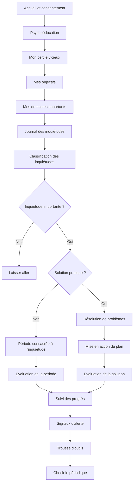
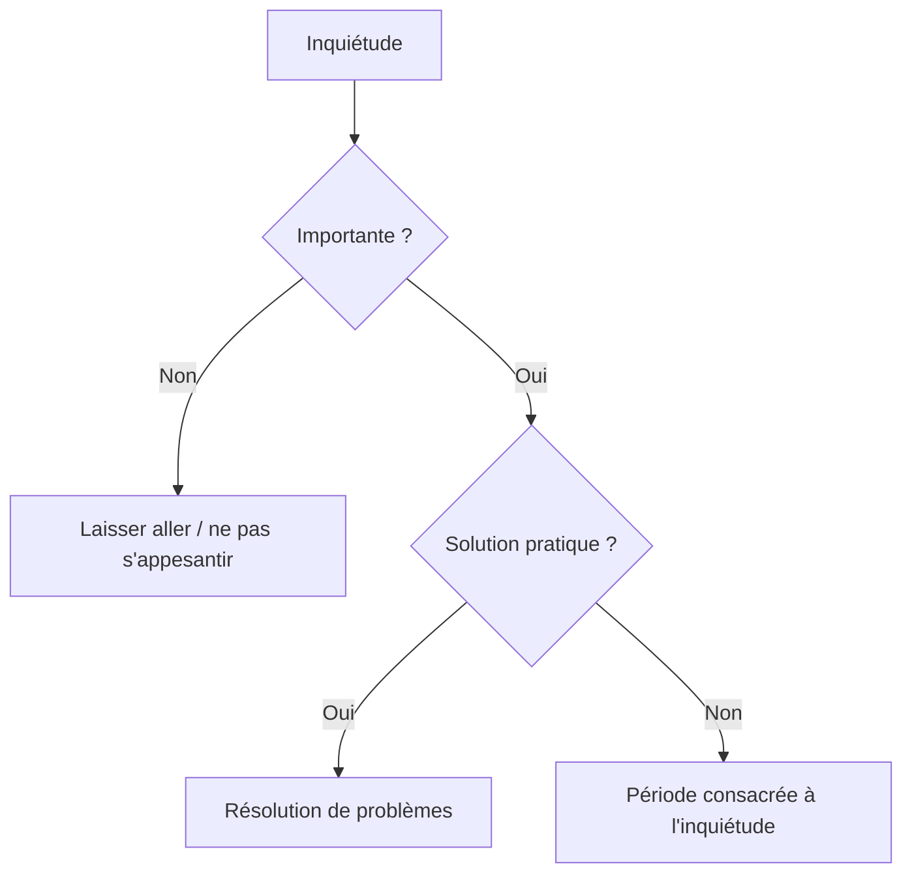
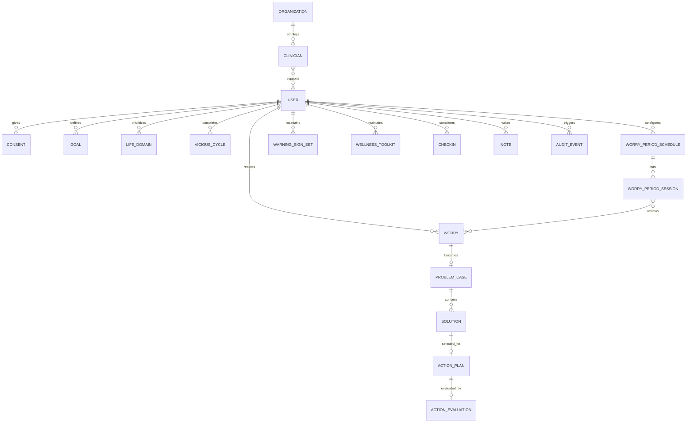
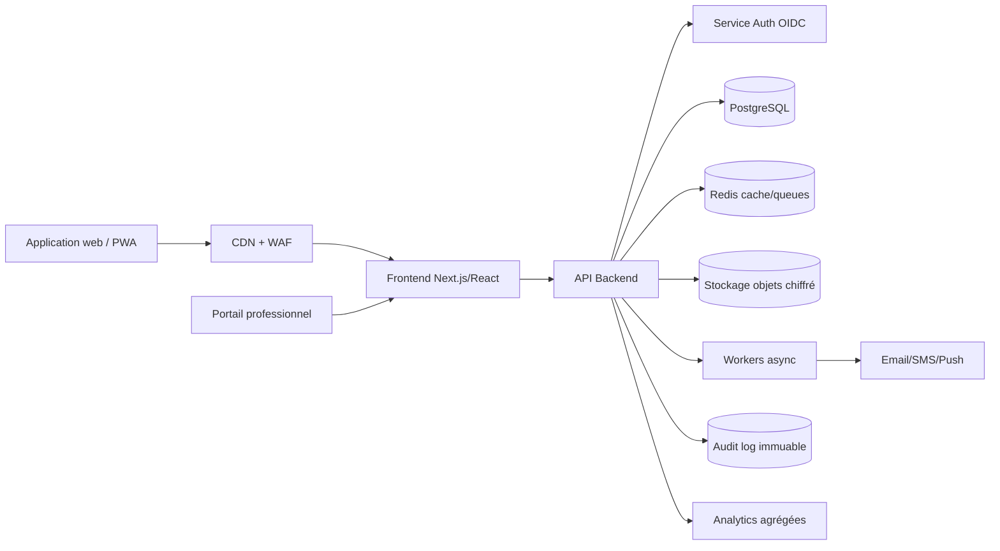

# Spécification fonctionnelle et technique exhaustive — outil web « Gérer vos inquiétudes »

**Version :** 1.0  
**Date :** 2026-06-06  
**Langue cible :** français  
**Source fonctionnelle principale :** guide *Gérer vos inquiétudes*, Université d'Exeter / CEDAR, adaptation francophone du guide de TCC de faible intensité.  
**But de ce document :** transformer le contenu du guide en spécifications exploitables pour concevoir, développer, déployer et maintenir une application web permettant à un utilisateur de réaliser les exercices en ligne, idéalement avec l'appui d'un professionnel formé.

> **Avertissement important**  
> Ce document est une spécification produit et technique. Il ne remplace pas une validation clinique, juridique, réglementaire ou de cybersécurité. L'application finale devra être validée par des professionnels qualifiés en santé mentale, en protection des données et, selon le pays de déploiement, en réglementation des logiciels de santé. Le guide source indique qu'il est conçu pour être utilisé en collaboration avec un professionnel de la santé mentale et qu'il ne remplace pas une thérapie.

> **Note de droits d'auteur**  
> La présente spécification ne vise pas à reproduire intégralement le guide. Elle en extrait la structure thérapeutique, les exercices, les champs de données et la logique fonctionnelle pour permettre une adaptation numérique. Toute reprise textuelle, graphique, iconographique ou commerciale du guide source doit respecter ses conditions de licence et obtenir les autorisations nécessaires.

---

## Table des matières

1. [Résumé exécutif](#1-résumé-exécutif)
2. [Objectifs du produit](#2-objectifs-du-produit)
3. [Périmètre clinique et pédagogique](#3-périmètre-clinique-et-pédagogique)
4. [Cartographie du guide vers l'application](#4-cartographie-du-guide-vers-lapplication)
5. [Parcours utilisateur détaillé](#5-parcours-utilisateur-détaillé)
6. [Modules cliniques et fiches numériques](#6-modules-cliniques-et-fiches-numériques)
7. [Règles de décision et algorithmes métier](#7-règles-de-décision-et-algorithmes-métier)
8. [Spécifications UX/UI](#8-spécifications-uxui)
9. [Rôles, permissions et cas d'utilisation](#9-rôles-permissions-et-cas-dutilisation)
10. [Modèle de données canonique](#10-modèle-de-données-canonique)
11. [Schéma SQL indicatif](#11-schéma-sql-indicatif)
12. [API REST détaillée](#12-api-rest-détaillée)
13. [Interopérabilité santé et export](#13-interopérabilité-santé-et-export)
14. [Architecture technique cible](#14-architecture-technique-cible)
15. [Sécurité applicative](#15-sécurité-applicative)
16. [Protection des données et conformité](#16-protection-des-données-et-conformité)
17. [Sécurité clinique et gestion des risques](#17-sécurité-clinique-et-gestion-des-risques)
18. [Notifications, rappels et planification](#18-notifications-rappels-et-planification)
19. [Tableaux de bord et analytics](#19-tableaux-de-bord-et-analytics)
20. [Accessibilité, inclusion et localisation](#20-accessibilité-inclusion-et-localisation)
21. [Moteur de contenu et versionnement](#21-moteur-de-contenu-et-versionnement)
22. [Tests, qualité et critères d'acceptation](#22-tests-qualité-et-critères-dacceptation)
23. [Observabilité, exploitation et support](#23-observabilité-exploitation-et-support)
24. [Déploiement, infrastructure et DevOps](#24-déploiement-infrastructure-et-devops)
25. [Roadmap de réalisation](#25-roadmap-de-réalisation)
26. [Annexes techniques](#26-annexes-techniques)
27. [Références utiles](#27-références-utiles)

---

## 1. Résumé exécutif

L'application web à concevoir est un **outil numérique d'autosoins guidés basé sur la thérapie cognitive-comportementale de faible intensité**, centré sur deux techniques :

1. **La période consacrée à l'inquiétude** : l'utilisateur planifie un moment dédié pour traiter ses inquiétudes hypothétiques, les note lorsqu'elles apparaissent, se recentre sur le présent, puis les examine pendant la période prévue.
2. **La résolution de problèmes** : l'utilisateur transforme les inquiétudes pratiques en problèmes définissables, génère des solutions, analyse forces/faiblesses, choisit une solution, planifie une action, l'exécute et l'évalue.

L'application doit permettre :

- d'accompagner l'utilisateur de manière progressive dans les stades du guide ;
- de numériser toutes les fiches papier ;
- de sauvegarder, visualiser et exporter les données de l'utilisateur ;
- de soutenir l'usage accompagné par un professionnel ;
- de respecter des exigences fortes de confidentialité, de sécurité et d'accessibilité ;
- de prévenir les usages inappropriés, notamment en cas de crise, d'urgence ou de détresse élevée.

Le produit ne doit pas être conçu comme un outil de diagnostic automatique. Il doit être présenté comme un support structuré de gestion des inquiétudes, avec possibilité d'intégration dans un parcours de soin ou de soutien psychologique.

---

## 2. Objectifs du produit

### 2.1 Objectifs utilisateur

L'utilisateur doit pouvoir :

- comprendre le lien entre anxiété, inquiétude, pensées, émotions, sensations physiques et comportements ;
- identifier son propre cercle vicieux de l'inquiétude ;
- fixer des objectifs personnels, précis, réalistes et formulés positivement ;
- repérer les domaines importants de sa vie ;
- consigner ses inquiétudes au fil de la journée ;
- classer ses inquiétudes en trois catégories :
  - non importantes ;
  - importantes et pouvant être résolues ;
  - importantes mais ne pouvant pas être résolues ;
- choisir la bonne technique selon le type d'inquiétude ;
- planifier et utiliser une période quotidienne consacrée à l'inquiétude ;
- résoudre des problèmes pratiques à l'aide d'un protocole en sept étapes ;
- conserver les traces de ses exercices et suivre ses progrès ;
- construire une trousse d'outils personnelle pour rester en bonne santé ;
- mettre en place des bilans réguliers après la fin du programme.

### 2.2 Objectifs professionnels

Le professionnel de santé mentale, si activé dans le produit, doit pouvoir :

- inviter un utilisateur à utiliser l'outil ;
- suivre l'avancement des modules, sans consulter les détails privés sauf consentement explicite ;
- consulter certaines fiches partagées par l'utilisateur ;
- annoter, commenter ou valider des exercices ;
- repérer les blocages fréquents ;
- aider à reformuler un objectif, un problème pratique ou une solution ;
- recevoir une alerte en cas de signal de risque défini par le protocole de sécurité ;
- exporter une synthèse clinique minimale, traçable et compréhensible.

### 2.3 Objectifs organisationnels

L'organisation qui déploie l'outil doit pouvoir :

- gérer plusieurs professionnels, équipes et établissements ;
- appliquer des politiques de confidentialité et de conservation des données ;
- auditer les accès aux données sensibles ;
- personnaliser les coordonnées d'aide, ressources locales et messages de crise ;
- maintenir le contenu clinique dans des versions contrôlées ;
- produire des indicateurs agrégés anonymisés ou fortement pseudonymisés, uniquement si compatible avec le consentement et la loi applicable.

### 2.4 Objectifs hors périmètre

La première version ne doit pas :

- poser un diagnostic de trouble d'anxiété généralisée ;
- remplacer un professionnel de santé mentale ;
- interpréter automatiquement l'état clinique de l'utilisateur ;
- encourager la rumination, la vérification excessive ou la recherche de réassurance ;
- partager les données avec des tiers commerciaux ;
- utiliser les textes personnels pour entraîner des modèles d'IA sans consentement spécifique, libre, éclairé et révocable.

---

## 3. Périmètre clinique et pédagogique

### 3.1 Public cible

Public cible principal : adultes ou jeunes adultes capables de lire le français et souhaitant apprendre à gérer des inquiétudes excessives ou difficiles à contrôler.

Modes d'usage possibles :

- **mode accompagné** : l'utilisateur travaille avec un professionnel formé ;
- **mode autonome encadré** : l'utilisateur utilise l'outil seul avec accès à des ressources de soutien ;
- **mode programme institutionnel** : l'outil est intégré à un service de santé mentale, de médecine familiale, d'aide aux étudiants ou de prévention.

### 3.2 Prérequis cliniques

Avant le début du programme, l'application doit présenter :

- un avertissement que l'outil n'est pas destiné aux urgences ;
- une recommandation de consulter un professionnel si les symptômes sont intenses, persistants ou invalidants ;
- un écran de ressources locales d'urgence et de crise ;
- une information sur la confidentialité et le stockage des données ;
- un consentement explicite pour créer un compte et saisir des données sensibles.

### 3.3 Structure clinique générale

Le guide source suit une progression logique :

1. accueil et introduction ;
2. psychoéducation sur l'inquiétude et le trouble d'anxiété généralisée ;
3. compréhension du cercle vicieux ;
4. fixation d'objectifs ;
5. identification des domaines importants de la vie ;
6. journal des inquiétudes ;
7. classification des inquiétudes ;
8. décision entre laisser aller, période d'inquiétude et résolution de problèmes ;
9. période consacrée à l'inquiétude ;
10. résolution de problèmes ;
11. maintien des acquis et prévention de la rechute.

### 3.4 Principes de fidélité au modèle

L'application doit respecter les principes suivants :

- **Autonomie** : l'utilisateur contrôle son rythme et ses choix.
- **Structuration** : les exercices doivent être découpés en étapes courtes.
- **Non-réassurance** : le système ne doit pas répondre aux inquiétudes par des garanties du type « tout ira bien ».
- **Tolérance à l'incertitude** : l'outil doit aider à vivre avec l'incertitude plutôt qu'à la supprimer.
- **Différenciation pratique/hypothétique** : toute inquiétude doit être orientée vers la technique appropriée.
- **Action concrète** : les problèmes pratiques doivent aboutir à des plans d'action précis.
- **Révision** : l'utilisateur doit réévaluer ce qu'il a appris après une période d'inquiétude ou une action de résolution de problème.
- **Progression observable** : les fiches doivent permettre de voir les inquiétudes barrées, résolues ou devenues moins perturbantes.

---

## 4. Cartographie du guide vers l'application

| Pages du guide | Contenu source | Fonctionnalité web |
|---:|---|---|
| 1-3 | Introduction, cadre TCC, usage avec professionnel | Onboarding, consentement, présentation du programme |
| 4 | Deux techniques : période d'inquiétude et résolution de problèmes | Vue d'ensemble du parcours et des deux outils principaux |
| 5-7 | Histoire d'Amanda | Module narratif optionnel, exemple guidé, mode « voir un exemple » |
| 8-11 | Trouble d'anxiété généralisée, signes, cercle vicieux, intolérance à l'incertitude | Psychoéducation interactive, cartes d'information, auto-réflexion |
| 12-13 | Fiche « Mon cercle vicieux » | Formulaire cercle vicieux avec 6 zones : situation, sensations, pensées, comportements, émotions, impact |
| 14-17 | Objectifs : précis, réalistes, positifs ; fiche objectifs | Objectifs personnels notés de 0 à 6 |
| 18-19 | Domaines importants de la vie | Liste priorisée de 5 domaines de vie |
| 20-22 | Fiche « Mes inquiétudes » | Journal des inquiétudes horodaté |
| 23 | Aide le soir / sommeil | Micro-module « inquiétudes nocturnes » et action rapide depuis le lit |
| 24-26 | Types d'inquiétudes | Écran de classification en 3 colonnes |
| 27 | Hypothétique avec solution pratique | Assistant de décision pour distinguer pratique vs hypothétique |
| 28 | Diagramme décisionnel | Moteur d'orientation : laisser aller, période d'inquiétude ou résolution de problèmes |
| 29-34 | Période consacrée à l'inquiétude | Planification, capture, recentrage, session, évaluation |
| 35-45 | Résolution de problèmes en 7 étapes | Workflow de résolution de problèmes avec fiches solutions, forces/faiblesses, plan et bilan |
| 46 | Signaux d'alerte | Fiche « Mes signaux d'alerte » |
| 47 | Trousse d'outils pour rester en bonne santé | Fiche stratégie personnelle et bibliothèque d'habiletés |
| 48-49 | Faire le point avec moi-même | Check-in périodique et engagement écrit |
| 50-51 | Notes | Journal libre et notes personnelles |
| 52 | Auteurs, copyright, conditions | Mentions légales, crédits, licence, avertissement clinique |

---

## 5. Parcours utilisateur détaillé

### 5.1 Diagramme global



### 5.2 Parcours initial

1. L'utilisateur arrive sur une page de présentation claire : finalité, durée approximative, mode accompagné recommandé.
2. Le système affiche un avertissement : urgence, crise, détresse sévère, coordonnées locales.
3. L'utilisateur choisit :
   - créer un compte ;
   - utiliser en mode invité local ;
   - rejoindre un professionnel par code d'invitation.
4. L'utilisateur accepte :
   - conditions d'utilisation ;
   - politique de confidentialité ;
   - consentement de traitement de données sensibles ;
   - consentement séparé pour partage avec un professionnel, si applicable.
5. L'utilisateur sélectionne ses préférences :
   - langue ;
   - fuseau horaire ;
   - rappels ;
   - accessibilité ;
   - niveau de guidage.

### 5.3 Parcours de progression

Chaque module doit comporter :

- un objectif pédagogique ;
- une durée estimée ;
- un exemple ;
- un exercice ;
- une sauvegarde automatique ;
- un bouton « continuer plus tard » ;
- un résumé de ce qui a été appris ;
- une possibilité de partager ou non la fiche avec un professionnel.

### 5.4 Parcours de retour quotidien

L'utilisateur doit pouvoir, depuis l'accueil :

- ajouter rapidement une inquiétude ;
- consulter sa période d'inquiétude du jour ;
- reprendre un problème en cours ;
- voir ses objectifs ;
- consulter ses stratégies de recentrage ;
- noter une observation ou un progrès ;
- accéder aux ressources d'aide.

### 5.5 Parcours de fin de programme

À la fin :

- génération d'un récapitulatif personnel ;
- fiche des signaux d'alerte ;
- trousse d'outils ;
- engagement écrit de check-in ;
- plan de maintien ;
- export PDF ou Markdown ;
- option de partage au professionnel ;
- rappel périodique configurable.

---

## 6. Modules cliniques et fiches numériques

### 6.1 Module 0 — Accueil, consentement et sécurité

#### Objectif

Permettre un démarrage sûr et informé.

#### Écrans

1. Présentation de l'outil.
2. Public visé et limites.
3. Urgence et ressources.
4. Confidentialité et données.
5. Création de compte ou mode invité.
6. Consentements.

#### Champs de données

| Champ | Type | Obligatoire | Description |
|---|---|---:|---|
| `user_id` | UUID | Oui | Identifiant utilisateur |
| `display_name` | string | Non | Nom affiché |
| `birth_year` | integer | Selon juridiction | Utilisé pour l'âge minimal |
| `timezone` | string IANA | Oui | Planification des rappels |
| `locale` | enum | Oui | `fr-CA`, `fr-FR`, etc. |
| `emergency_region` | string | Oui | Région pour les ressources locales |
| `consent_terms_at` | datetime | Oui | Consentement aux conditions |
| `consent_privacy_at` | datetime | Oui | Consentement confidentialité |
| `consent_health_data_at` | datetime | Oui si compte cloud | Données de santé ou assimilées |
| `professional_sharing_enabled` | boolean | Oui | Partage avec un professionnel |

#### Critères d'acceptation

- L'utilisateur ne peut pas saisir d'inquiétude dans le cloud sans consentement explicite au traitement des données sensibles.
- L'utilisateur peut utiliser un mode local hors compte si le produit le prévoit.
- Les ressources de crise sont visibles depuis toutes les pages.

---

### 6.2 Module 1 — Psychoéducation : inquiétude, anxiété et TAG

#### Objectif

Expliquer que l'inquiétude peut être utile dans certaines situations mais peut devenir problématique lorsqu'elle devient fréquente, incontrôlable et envahissante.

#### Contenus à présenter

- Définition simple de l'inquiétude.
- Différence entre inquiétude utile et inquiétude envahissante.
- Présentation du trouble d'anxiété généralisée comme cadre descriptif non diagnostique.
- Signes possibles dans quatre domaines : sensations physiques, pensées, comportements, émotions.
- Notion d'intolérance à l'incertitude.
- Comportements d'inquiétude : réassurance, sur-préparation, vérification, procrastination, distraction, évitement.

#### Composants UI

- Cartes d'information courtes.
- Illustrations non médicalisantes.
- Accordéons « En savoir plus ».
- Quiz de compréhension non évaluatif.
- Bouton « Cela me parle » pour marquer des éléments pertinents.

#### Données

```json
{
  "psychoeducation_reflections": [
    {
      "topic": "physical_sensations",
      "selected_items": ["tension", "fatigue", "difficulté de concentration"],
      "free_text": "Je remarque surtout cela le soir."
    }
  ]
}
```

#### Règles

- Les formulations doivent éviter de diagnostiquer.
- Les textes doivent rappeler que les symptômes peuvent avoir plusieurs causes et que l'utilisateur doit consulter si nécessaire.
- L'utilisateur peut passer ce module, mais le système doit encourager sa lecture avant les exercices.

---

### 6.3 Module 2 — Fiche « Mon cercle vicieux »

#### Objectif

Aider l'utilisateur à visualiser l'interaction entre situation, sensations physiques, pensées, comportements, émotions et impact sur la vie.

#### Champs

| Champ | Type | Description |
|---|---|---|
| `situation` | text | Situation déclenchante ou contexte |
| `physical_sensations` | text[] ou tags | Tension, agitation, sommeil, nausées, fatigue, etc. |
| `thoughts` | text[] | Pensées automatiques ou inquiétudes |
| `behaviors` | text[] | Réassurance, évitement, vérification, sur-préparation, etc. |
| `emotions` | text[] | Anxiété, peur, appréhension, nervosité, accablement, etc. |
| `impact` | text | Effet sur travail, relations, loisirs, santé, sommeil |
| `created_at` | datetime | Création |
| `updated_at` | datetime | Modification |
| `shared_with_professional` | boolean | Partage volontaire |

#### UI

- Diagramme circulaire à quatre quadrants.
- Champ « situation » en haut.
- Champ « impact » en bas.
- Autocomplétion de tags avec possibilité de texte libre.
- Mode exemple masquable.
- Option « télécharger ma fiche ».

#### Validation

- `situation` ou au moins deux quadrants doivent être renseignés pour terminer l'étape.
- Les champs peuvent rester incomplets ; un brouillon doit être sauvegardé.
- Les données ne doivent jamais être affichées au professionnel sans consentement.

---

### 6.4 Module 3 — Mes objectifs

#### Objectif

Formuler jusqu'à cinq objectifs personnels à court terme, précis, réalistes et positifs, puis mesurer la capacité actuelle de l'utilisateur à les réaliser sur une échelle de 0 à 6.

#### Règles de formulation

- Précis : l'objectif décrit un comportement observable.
- Réaliste : réalisable dans les prochaines semaines.
- Positif : orienté vers ce que l'utilisateur fera plutôt que ce qu'il arrêtera.

#### Champs

| Champ | Type | Contraintes |
|---|---|---|
| `goal_id` | UUID | Identifiant |
| `title` | string | Optionnel, généré depuis le texte |
| `statement` | text | 20 à 1000 caractères recommandés |
| `target_horizon` | enum | `short_term`, `medium_term`, `long_term` |
| `current_ability_score` | integer | 0 à 6 |
| `created_date` | date | Date utilisateur |
| `status` | enum | `draft`, `active`, `achieved`, `archived` |
| `review_notes` | text | Notes de suivi |

#### UX spécifique

- Assistant de reformulation non-directif : « Comment saurez-vous que cet objectif est atteint ? »
- Détection d'objectif négatif : si le texte contient « arrêter », « ne plus », « moins », proposer une reformulation positive.
- Graphique d'évolution du score 0-6 par objectif.

---

### 6.5 Module 4 — Domaines importants de ma vie

#### Objectif

Identifier cinq domaines de vie qui comptent actuellement pour l'utilisateur afin de prioriser les problèmes à résoudre.

#### Exemples de catégories

- famille ;
- relation de couple ;
- amis ;
- travail ou études ;
- santé ;
- finances ;
- loisirs ;
- responsabilités ;
- spiritualité ou valeurs ;
- logement.

#### Champs

```json
{
  "life_domains": [
    {
      "rank": 1,
      "label": "Relation avec mon conjoint",
      "category": "relationships",
      "notes": "Je veux être plus présente le week-end."
    }
  ]
}
```

#### Règles

- Minimum recommandé : 3 domaines.
- Maximum : 5 dans le parcours standard, extensible en configuration.
- Les domaines servent à contextualiser les inquiétudes sans imposer de jugement.

---

### 6.6 Module 5 — Journal « Mes inquiétudes »

#### Objectif

Saisir les inquiétudes dès qu'elles apparaissent, avec suffisamment de précision pour pouvoir les classer ensuite.

#### Champs de la fiche

| Champ | Type | Description |
|---|---|---|
| `worry_id` | UUID | Identifiant |
| `occurred_at` | datetime | Date et heure de l'inquiétude |
| `situation` | text | Situation déclenchante |
| `thoughts` | text | Ce que l'utilisateur pense |
| `feared_outcome` | text | Ce qu'il a peur qu'il arrive |
| `emotions` | string[] | Émotions ressenties |
| `emotion_intensity` | integer | Optionnel, 0 à 10 |
| `body_sensations` | string[] | Optionnel |
| `tags` | string[] | Travail, santé, famille, finances, etc. |
| `source` | enum | `manual`, `quick_capture`, `night_mode`, `clinician_session` |
| `status` | enum | `unclassified`, `classified`, `dismissed`, `converted_to_problem`, `archived` |

#### UI

- Bouton flottant « Ajouter une inquiétude » accessible partout.
- Capture rapide en trois champs : situation, pensée, peur.
- Mode complet avec émotions, intensité, tags.
- Mode nuit : interface sombre, peu stimulante, saisie minimale.
- Dictée vocale optionnelle, avec traitement local si possible.

#### Validation

- `occurred_at` prérempli avec l'heure courante.
- Au moins un champ parmi `situation`, `thoughts`, `feared_outcome` doit être renseigné.
- Les inquiétudes doivent rester modifiables.

---

### 6.7 Module 6 — Mes types d'inquiétudes

#### Objectif

Classer les inquiétudes dans trois catégories pour déterminer l'action adaptée.

#### Catégories

| Code | Libellé | Description fonctionnelle |
|---|---|---|
| `not_important` | Pas importantes | Inquiétudes sans lien significatif avec les domaines importants et sans conséquence grave |
| `practical` | Importantes et pouvant être résolues | Inquiétudes liées à un problème actuel sur lequel une action concrète est possible |
| `hypothetical` | Importantes, mais ne pouvant être résolues | Inquiétudes de type « Et si... » sans action concrète immédiate ou sans signe actuel |

#### Champs

| Champ | Type | Description |
|---|---|---|
| `classification` | enum | Une des trois catégories |
| `classification_reason` | text | Raisonnement de l'utilisateur |
| `is_important` | boolean | Réponse à « est-ce important ? » |
| `has_practical_solution` | boolean | Réponse à « puis-je agir maintenant ? » |
| `action_path` | enum | `let_go`, `worry_period`, `problem_solving` |
| `classified_at` | datetime | Date de classification |
| `user_overrode_suggestion` | boolean | Si suggestion automatique modifiée |

#### UI

- Trois colonnes glisser-déposer.
- Assistant de classification par questions :
  1. Est-ce lié à un domaine important ou à une conséquence sérieuse ?
  2. Puis-je faire quelque chose maintenant ?
  3. Existe-t-il un plan précis et raisonnable ?
  4. Suis-je en train de chercher surtout à me rassurer ou à me préparer à l'inconnu ?
- Suggestion automatique facultative, toujours modifiable.

---

### 6.8 Module 7 — Décision : que faire avec cette inquiétude ?

#### Objectif

Orienter l'utilisateur vers la bonne stratégie.

#### Logique



#### Écrans résultants

- **Pas importante** : message bref de lâcher-prise + recentrage.
- **Pratique** : bouton « créer un dossier de résolution de problèmes ».
- **Hypothétique** : bouton « ajouter à ma période consacrée à l'inquiétude ».

#### Garde-fous

- Si l'inquiétude concerne une conséquence grave et action urgente, le système doit éviter de la reporter artificiellement.
- Si l'utilisateur tente de créer des plans infinis pour une inquiétude hypothétique, le système doit signaler le risque de sur-préparation.
- Le système ne doit pas valider une recherche de réassurance comme solution durable.

---

### 6.9 Module 8 — Période consacrée à l'inquiétude

#### Objectif

Permettre à l'utilisateur de réserver une période quotidienne pour examiner les inquiétudes hypothétiques, réduire leur intrusion pendant la journée et pratiquer le recentrage.

#### Étapes numériques

1. **Planifier** une période quotidienne, souvent autour de 20 minutes, à un moment calme et pas trop proche du coucher.
2. **Noter** les inquiétudes qui surgissent dans la journée.
3. **Se recentrer** sur le présent après la capture.
4. **Utiliser la période prévue** pour relire les inquiétudes, s'en préoccuper volontairement, barrer celles qui ne dérangent plus, convertir celles qui ont une solution pratique.
5. **Évaluer** ce qui a été appris seulement à la fin de la période.

#### Champs de planification

| Champ | Type | Description |
|---|---|---|
| `schedule_id` | UUID | Identifiant |
| `preferred_time` | time | Heure choisie |
| `duration_minutes` | integer | 5 à 60, défaut 20 |
| `days_of_week` | int[] | 1-7 |
| `location_hint` | string | Endroit calme choisi |
| `do_not_disturb_enabled` | boolean | Mode silencieux local si mobile |
| `bedtime_buffer_minutes` | integer | Écart minimal avant le coucher |
| `reminder_enabled` | boolean | Rappel |

#### Champs de session

| Champ | Type | Description |
|---|---|---|
| `session_id` | UUID | Identifiant |
| `started_at` | datetime | Début |
| `ended_at` | datetime | Fin |
| `planned_duration_minutes` | integer | Durée prévue |
| `actual_duration_minutes` | integer | Durée réelle |
| `worry_ids_reviewed` | UUID[] | Inquiétudes examinées |
| `worries_crossed_out` | UUID[] | Inquiétudes qui ne dérangent plus |
| `worries_converted_to_problem` | UUID[] | Inquiétudes transférées en résolution de problèmes |
| `learning_notes` | text | Ce que l'utilisateur a appris |
| `difficulty_score` | integer | 0 à 10, optionnel |
| `helpful_score` | integer | 0 à 10, optionnel |

#### Recentrage

Le composant de recentrage doit proposer :

- retour à la tâche en cours ;
- orientation sensorielle : voir, entendre, toucher, sentir, goûter ;
- respiration simple non médicale ;
- changement de tâche si le retour à la tâche initiale est trop difficile ;
- rappel que l'inquiétude sera reprise plus tard.

#### Règles critiques

- L'évaluation ne doit être proposée qu'après la fin de la durée prévue.
- Le système doit éviter d'allonger indéfiniment la période.
- Une inquiétude pratique repérée pendant la période doit pouvoir être transférée vers la résolution de problèmes.
- Une inquiétude urgente ne doit pas être retardée.

---

### 6.10 Module 9 — Résolution de problèmes

#### Objectif

Traiter les inquiétudes pratiques par une démarche structurée en sept étapes.

#### Étapes

1. Choisir une inquiétude pouvant être résolue.
2. Transformer l'inquiétude en problème pratique.
3. Relever des solutions potentielles sans les écarter trop tôt.
4. Analyser forces et faiblesses.
5. Sélectionner une solution.
6. Planifier la solution de manière précise.
7. Essayer la solution et évaluer comment cela s'est passé.

#### Dossier de résolution de problème

| Champ | Type | Description |
|---|---|---|
| `case_id` | UUID | Identifiant |
| `worry_id` | UUID nullable | Inquiétude source |
| `original_worry` | text | Inquiétude choisie |
| `practical_problem` | text | Problème formulé concrètement |
| `status` | enum | `draft`, `brainstorming`, `analysis`, `planned`, `in_action`, `evaluated`, `closed`, `reopened` |
| `created_at` | datetime | Création |
| `updated_at` | datetime | Modification |
| `closed_at` | datetime nullable | Fermeture |

#### Solutions potentielles

| Champ | Type | Description |
|---|---|---|
| `solution_id` | UUID | Identifiant |
| `case_id` | UUID | Dossier |
| `description` | text | Solution proposée |
| `strengths` | text | Forces / avantages |
| `weaknesses` | text | Faiblesses / inconvénients |
| `choice` | enum | `yes`, `no`, `maybe`, `selected` |
| `is_worry_behavior_flagged` | boolean | Risque de comportement d'inquiétude |
| `flag_reason` | text | Réassurance, vérification excessive, sur-planification, procrastination, etc. |

#### Plan d'action

Le plan doit répondre aux questions :

- Quoi ?
- Où ?
- Quand ?
- Avec qui ?
- Quelles ressources ?
- Quelles étapes ?

| Champ | Type | Description |
|---|---|---|
| `action_plan_id` | UUID | Identifiant |
| `selected_solution_id` | UUID | Solution choisie |
| `what` | text | Action |
| `where` | text | Lieu |
| `when_at` | datetime | Date/heure prévue |
| `with_whom` | text | Personnes impliquées |
| `resources_needed` | text | Temps, argent, matériel, soutien |
| `steps` | jsonb | Liste ordonnée d'étapes |
| `barriers` | text | Obstacles possibles |
| `backup_plan` | text | Plan alternatif optionnel |

#### Mise en action et évaluation

| Champ | Type | Description |
|---|---|---|
| `what_i_did` | text | Ce qui a été fait exactement |
| `went_well` | text | Ce qui a bien marché |
| `unexpected` | text | Ce qui ne s'est pas passé comme prévu |
| `learned` | text | Apprentissages |
| `effectiveness_score` | integer | 0 à 10 |
| `next_step` | enum | `close`, `retry_solution`, `choose_other_solution`, `break_down_problem`, `ask_support` |

#### Garde-fous

Le système doit détecter et signaler les solutions qui ressemblent à des comportements d'inquiétude :

- demander constamment à quelqu'un de rassurer ;
- vérifier de manière répétée sans nécessité ;
- planifier excessivement pour éliminer toute incertitude ;
- procrastiner sous couvert d'attente ;
- éviter la situation ;
- se distraire pour ne jamais traiter le problème.

Le message doit être non culpabilisant : « Cette solution peut aider à court terme, mais risque d'entretenir l'inquiétude. Peux-tu imaginer une action plus durable ? »

---

### 6.11 Module 10 — Restez en bonne santé

#### Objectif

Construire un plan de maintien après la progression principale.

#### Sous-fiches

1. **Mes signaux d'alerte** : sensations, pensées, émotions, comportements.
2. **Ma trousse d'outils** : activités utiles, habiletés acquises, facteurs qui ont aidé.
3. **Faire le point avec moi-même** : questions périodiques et engagement écrit.

#### Champs — signaux d'alerte

```json
{
  "warning_signs": {
    "physical_sensations": ["tension", "sommeil perturbé"],
    "thoughts": ["je ne vais pas y arriver"],
    "emotions": ["appréhension", "irritabilité"],
    "behaviors": ["vérification répétée", "recherche de réassurance"]
  }
}
```

#### Champs — trousse d'outils

| Champ | Type | Description |
|---|---|---|
| `helpful_activities` | text | Activités ayant aidé |
| `skills_learned` | text | Habiletés acquises |
| `practice_enablers` | text | Ce qui a aidé à pratiquer |
| `favorite_refocus_strategies` | string[] | Stratégies de recentrage |
| `problem_solving_reminders` | text | Rappels utiles |

#### Champs — check-in

| Champ | Type | Description |
|---|---|---|
| `checkin_frequency` | enum | `weekly`, `biweekly`, `monthly`, `custom` |
| `commitment_text` | text | Engagement écrit |
| `next_checkin_at` | datetime | Prochain bilan |
| `harmful_behaviors_returned` | boolean | Comportements nuisibles réapparus |
| `old_thoughts_returned` | boolean | Pensées similaires au début |
| `physical_symptoms_excessive` | boolean | Sensations excessives/incontrôlables |
| `disturbing_emotions_returned` | boolean | Émotions perturbantes revenues |
| `what_can_i_do` | text | Plan d'aide |

---

## 7. Règles de décision et algorithmes métier

### 7.1 Classification des inquiétudes

#### Pseudocode

```pseudo
function classifyWorry(worry, userAnswers):
    if userAnswers.hasImmediateSeriousConsequence == true:
        return {
            category: "practical",
            action_path: "problem_solving_or_immediate_action",
            warning: "Ne pas reporter une action urgente."
        }

    if userAnswers.isImportant == false:
        return {
            category: "not_important",
            action_path: "let_go"
        }

    if userAnswers.canActNow == true and userAnswers.hasSpecificPlan == true:
        if userAnswers.solutionIsMainlyReassuranceOrOverplanning == true:
            return {
                category: "needs_review",
                action_path: "reflect_on_worry_behavior"
            }
        return {
            category: "practical",
            action_path: "problem_solving"
        }

    return {
        category: "hypothetical",
        action_path: "worry_period"
    }
```

### 7.2 Détection de comportement d'inquiétude

Critères à repérer dans une solution :

| Indice | Exemple | Action système |
|---|---|---|
| Réassurance répétée | « demander encore à mon conjoint si tout va bien » | Proposer une alternative durable |
| Vérification excessive | « vérifier toutes les 5 minutes » | Signaler le risque d'entretien de l'anxiété |
| Sur-préparation | « faire 10 plans pour chaque possibilité » | Inviter à choisir une étape réaliste |
| Évitement | « ne pas aller à la réunion » | Demander si cela résout vraiment le problème |
| Procrastination | « attendre que quelqu'un le fasse » | Inviter à définir une action datée |
| Distraction permanente | « regarder des vidéos jusqu'à oublier » | Distinguer pause utile et évitement |

### 7.3 Règles de planification de la période d'inquiétude

- Durée par défaut : 20 minutes, configurable.
- Recommandation : pas trop proche du coucher.
- Une seule période principale par jour en version standard.
- Le système peut suggérer de réduire progressivement la durée si l'utilisateur la trouve moins nécessaire.
- Les inquiétudes non examinées restent disponibles pour la prochaine session.
- Les inquiétudes barrées ne sont pas supprimées ; elles changent de statut.

### 7.4 Règles de progression

| Module | Condition de complétion minimale |
|---|---|
| Psychoéducation | Avoir parcouru les cartes clés ou marqué comme lu |
| Cercle vicieux | Au moins une situation + deux zones renseignées |
| Objectifs | Au moins un objectif actif avec score 0-6 |
| Domaines importants | Au moins trois domaines |
| Journal des inquiétudes | Au moins une inquiétude ou passage volontaire |
| Classification | Au moins une inquiétude classée ou démonstration complétée |
| Période d'inquiétude | Horaire défini + première session ou planification terminée |
| Résolution de problèmes | Un dossier avec au moins un problème pratique et une solution |
| Maintien | Signaux d'alerte + trousse ou check-in configuré |

### 7.5 Gestion des urgences

Le système doit interrompre le flux standard en cas de :

- mention explicite de danger imminent pour soi ou autrui ;
- demande d'aide urgente ;
- détresse très élevée si le protocole de l'organisation le définit ;
- contenu indiquant que l'utilisateur ne peut pas rester en sécurité.

Action :

1. afficher immédiatement les ressources d'urgence locales ;
2. recommander de contacter les services d'urgence ou une personne de confiance ;
3. proposer de quitter l'exercice et d'accéder à une page de sécurité ;
4. si un professionnel est associé et si le consentement/protocole le permet, créer une alerte ;
5. journaliser l'événement de sécurité avec minimisation des données.

---

## 8. Spécifications UX/UI

### 8.1 Principes de design

- Interface calme, non saturée.
- Textes courts, langage simple.
- Une tâche principale par écran.
- Sauvegarde automatique visible.
- Contrôle utilisateur : retour, pause, ignorer, continuer plus tard.
- Pas de gamification anxiogène.
- Encouragements sobres : reconnaître l'effort sans promettre de résultat.

### 8.2 Navigation principale

Barre de navigation :

- Accueil
- Ajouter une inquiétude
- Mes exercices
- Ma période d'inquiétude
- Résolution de problèmes
- Progrès
- Ressources
- Paramètres

### 8.3 Écran d'accueil

Sections :

1. Carte « Aujourd'hui » : prochain rappel, période d'inquiétude, problème en cours.
2. Bouton principal « Noter une inquiétude ».
3. Progression du programme.
4. Objectifs actifs.
5. Dernier apprentissage.
6. Ressources d'aide.

### 8.4 Composant « capture rapide »

États :

- ouvert depuis bouton flottant ;
- ouvert depuis notification ;
- mode nuit ;
- hors ligne.

Champs minimaux :

- « Quelle est la situation ? »
- « Qu'est-ce qui te passe par la tête ? »
- « Qu'as-tu peur qu'il arrive ? »

Après sauvegarde :

- message : « C'est noté. Tu pourras y revenir pendant ta période prévue. »
- proposition de recentrage : « Revenir à ce que je faisais ».

### 8.5 Écran de classification

Design :

- cartes d'inquiétudes à gauche ;
- trois colonnes de classification ;
- panneau d'aide à droite ;
- possibilité de glisser-déposer ;
- mode accessible avec boutons radio.

### 8.6 Écran de période d'inquiétude

États :

- avant la session : liste des inquiétudes en attente, minuteur non démarré ;
- pendant : minuteur, liste, option barrer, convertir en problème ;
- fin : formulaire d'évaluation ;
- après : résumé.

Règles UI :

- ne pas afficher d'analyse avant la fin ;
- empêcher la suppression accidentelle ;
- bouton « J'ai besoin d'aide maintenant » toujours visible.

### 8.7 Écran de résolution de problèmes

UX :

- parcours en étapes, style assistant ;
- barre de progression 1/7 ;
- panneau de rappel : « ne rien écarter trop tôt » pendant brainstorming ;
- matrice forces/faiblesses ;
- plan d'action daté ;
- rappel après l'action prévue ;
- bilan structuré.

### 8.8 Export utilisateur

Formats :

- PDF imprimable ;
- Markdown ;
- JSON portable ;
- FHIR QuestionnaireResponse si interopérabilité santé activée.

Contenu exportable :

- objectifs ;
- fiches ;
- inquiétudes classées ;
- périodes d'inquiétude ;
- plans de résolution ;
- trousse d'outils ;
- check-ins.

L'utilisateur doit pouvoir choisir les sections exportées.

---

## 9. Rôles, permissions et cas d'utilisation

### 9.1 Rôles

| Rôle | Description |
|---|---|
| `guest_user` | Utilisateur local sans compte cloud |
| `registered_user` | Utilisateur avec compte |
| `supported_user` | Utilisateur lié à un professionnel |
| `clinician` | Professionnel de santé mentale ou intervenant |
| `clinical_supervisor` | Superviseur pouvant consulter des données agrégées ou dossiers assignés |
| `organization_admin` | Administrateur organisationnel |
| `content_editor` | Responsable des contenus pédagogiques |
| `security_admin` | Responsable sécurité et audit |
| `support_agent` | Support technique avec accès très limité |

### 9.2 Matrice de permissions simplifiée

| Action | Utilisateur | Clinicien | Admin org | Support |
|---|---:|---:|---:|---:|
| Créer une inquiétude | Oui | Non | Non | Non |
| Voir ses propres fiches | Oui | Si partagé | Non par défaut | Non |
| Commenter une fiche | Non | Si autorisé | Non | Non |
| Exporter ses données | Oui | Si partagé et autorisé | Non | Non |
| Configurer ressources locales | Non | Non | Oui | Non |
| Voir logs techniques | Non | Non | Limité | Limité |
| Modifier contenu clinique | Non | Non | Selon rôle | Non |
| Supprimer compte | Oui | Non | Sur demande contrôlée | Non |

### 9.3 Cas d'utilisation utilisateur

| ID | Cas d'utilisation | Résultat attendu |
|---|---|---|
| UC-U-001 | Créer un compte | Compte sécurisé et consentements enregistrés |
| UC-U-002 | Remplir le cercle vicieux | Fiche sauvegardée et consultable |
| UC-U-003 | Ajouter une inquiétude rapide | Inquiétude horodatée, statut non classé |
| UC-U-004 | Classer une inquiétude | Action recommandée affichée |
| UC-U-005 | Planifier une période | Rappel créé selon préférences |
| UC-U-006 | Faire une session d'inquiétude | Session enregistrée, apprentissages notés |
| UC-U-007 | Résoudre un problème | Dossier complet de 7 étapes |
| UC-U-008 | Créer sa trousse d'outils | Plan de maintien sauvegardé |
| UC-U-009 | Exporter ses données | Fichier généré avec sections choisies |
| UC-U-010 | Révoquer le partage | Professionnel perd l'accès futur |

### 9.4 Cas d'utilisation professionnel

| ID | Cas d'utilisation | Résultat attendu |
|---|---|---|
| UC-C-001 | Inviter un utilisateur | Code d'invitation ou lien sécurisé |
| UC-C-002 | Voir progression | Tableau de bord sans contenu privé non partagé |
| UC-C-003 | Consulter une fiche partagée | Lecture traçable dans audit log |
| UC-C-004 | Ajouter un commentaire | Commentaire visible par l'utilisateur |
| UC-C-005 | Préparer une séance | Synthèse des exercices partagés |
| UC-C-006 | Recevoir une alerte sécurité | Notification conforme au protocole |

---

## 10. Modèle de données canonique

### 10.1 Entités principales



### 10.2 Conventions

- Tous les identifiants : UUID v4 ou UUID v7.
- Toutes les dates : stockées en UTC, affichées selon `timezone` utilisateur.
- Données sensibles textuelles : chiffrement applicatif champ par champ recommandé.
- Les statuts ne doivent jamais dépendre uniquement d'un texte libre.
- Les données supprimées doivent être soit effacées, soit tombstoned selon politique de conservation.

### 10.3 Énumérations

```yaml
WorryCategory:
  - not_important
  - practical
  - hypothetical
  - needs_review

WorryActionPath:
  - let_go
  - worry_period
  - problem_solving
  - immediate_action
  - clinical_review

ProblemCaseStatus:
  - draft
  - brainstorming
  - analysis
  - planned
  - in_action
  - evaluated
  - closed
  - reopened

ConsentType:
  - terms
  - privacy
  - health_data_processing
  - clinician_sharing
  - notifications_email
  - notifications_sms
  - analytics_aggregated
  - research_optional

ShareScope:
  - none
  - progress_only
  - selected_exercises
  - full_workbook

RiskEventType:
  - user_requested_emergency_help
  - self_harm_language_detected
  - harm_to_others_language_detected
  - severe_distress_score
  - clinician_manual_flag
```

### 10.4 Données sensibles

Données à considérer comme particulièrement sensibles :

- inquiétudes et pensées personnelles ;
- émotions, symptômes, sensations corporelles ;
- notes libres ;
- commentaires professionnels ;
- informations sur les relations, finances, travail, santé ;
- logs pouvant révéler l'utilisation d'un outil de santé mentale.

Recommandation : minimiser les données collectées et chiffrer les contenus libres.

---

## 11. Schéma SQL indicatif

> Exemple pour PostgreSQL. À adapter selon le cadre de sécurité, l'ORM et la stratégie de chiffrement.

```sql
CREATE EXTENSION IF NOT EXISTS pgcrypto;

CREATE TYPE worry_category AS ENUM (
  'not_important',
  'practical',
  'hypothetical',
  'needs_review'
);

CREATE TYPE worry_status AS ENUM (
  'unclassified',
  'classified',
  'dismissed',
  'crossed_out',
  'converted_to_problem',
  'archived'
);

CREATE TYPE problem_status AS ENUM (
  'draft',
  'brainstorming',
  'analysis',
  'planned',
  'in_action',
  'evaluated',
  'closed',
  'reopened'
);

CREATE TABLE app_user (
  id UUID PRIMARY KEY DEFAULT gen_random_uuid(),
  email CITEXT UNIQUE,
  display_name TEXT,
  locale TEXT NOT NULL DEFAULT 'fr-CA',
  timezone TEXT NOT NULL DEFAULT 'America/Toronto',
  emergency_region TEXT,
  created_at TIMESTAMPTZ NOT NULL DEFAULT now(),
  updated_at TIMESTAMPTZ NOT NULL DEFAULT now(),
  deleted_at TIMESTAMPTZ,
  account_status TEXT NOT NULL DEFAULT 'active'
);

CREATE TABLE consent_record (
  id UUID PRIMARY KEY DEFAULT gen_random_uuid(),
  user_id UUID NOT NULL REFERENCES app_user(id) ON DELETE CASCADE,
  consent_type TEXT NOT NULL,
  version TEXT NOT NULL,
  granted BOOLEAN NOT NULL,
  granted_at TIMESTAMPTZ NOT NULL DEFAULT now(),
  revoked_at TIMESTAMPTZ,
  ip_hash TEXT,
  user_agent_hash TEXT
);

CREATE TABLE vicious_cycle (
  id UUID PRIMARY KEY DEFAULT gen_random_uuid(),
  user_id UUID NOT NULL REFERENCES app_user(id) ON DELETE CASCADE,
  situation_ciphertext BYTEA,
  physical_sensations_ciphertext BYTEA,
  thoughts_ciphertext BYTEA,
  behaviors_ciphertext BYTEA,
  emotions_ciphertext BYTEA,
  impact_ciphertext BYTEA,
  shared_with_professional BOOLEAN NOT NULL DEFAULT false,
  created_at TIMESTAMPTZ NOT NULL DEFAULT now(),
  updated_at TIMESTAMPTZ NOT NULL DEFAULT now()
);

CREATE TABLE goal (
  id UUID PRIMARY KEY DEFAULT gen_random_uuid(),
  user_id UUID NOT NULL REFERENCES app_user(id) ON DELETE CASCADE,
  statement_ciphertext BYTEA NOT NULL,
  target_horizon TEXT NOT NULL DEFAULT 'short_term',
  current_ability_score SMALLINT CHECK (current_ability_score BETWEEN 0 AND 6),
  status TEXT NOT NULL DEFAULT 'active',
  created_date DATE NOT NULL DEFAULT CURRENT_DATE,
  created_at TIMESTAMPTZ NOT NULL DEFAULT now(),
  updated_at TIMESTAMPTZ NOT NULL DEFAULT now()
);

CREATE TABLE life_domain (
  id UUID PRIMARY KEY DEFAULT gen_random_uuid(),
  user_id UUID NOT NULL REFERENCES app_user(id) ON DELETE CASCADE,
  rank SMALLINT NOT NULL CHECK (rank BETWEEN 1 AND 10),
  label_ciphertext BYTEA NOT NULL,
  category TEXT,
  notes_ciphertext BYTEA,
  created_at TIMESTAMPTZ NOT NULL DEFAULT now(),
  UNIQUE(user_id, rank)
);

CREATE TABLE worry (
  id UUID PRIMARY KEY DEFAULT gen_random_uuid(),
  user_id UUID NOT NULL REFERENCES app_user(id) ON DELETE CASCADE,
  occurred_at TIMESTAMPTZ NOT NULL,
  situation_ciphertext BYTEA,
  thoughts_ciphertext BYTEA,
  feared_outcome_ciphertext BYTEA,
  emotions JSONB NOT NULL DEFAULT '[]'::jsonb,
  emotion_intensity SMALLINT CHECK (emotion_intensity BETWEEN 0 AND 10),
  tags JSONB NOT NULL DEFAULT '[]'::jsonb,
  category worry_category,
  status worry_status NOT NULL DEFAULT 'unclassified',
  classification_reason_ciphertext BYTEA,
  action_path TEXT,
  created_at TIMESTAMPTZ NOT NULL DEFAULT now(),
  updated_at TIMESTAMPTZ NOT NULL DEFAULT now()
);

CREATE INDEX idx_worry_user_occurred ON worry(user_id, occurred_at DESC);
CREATE INDEX idx_worry_status ON worry(user_id, status);

CREATE TABLE worry_period_schedule (
  id UUID PRIMARY KEY DEFAULT gen_random_uuid(),
  user_id UUID NOT NULL REFERENCES app_user(id) ON DELETE CASCADE,
  preferred_time TIME NOT NULL,
  duration_minutes SMALLINT NOT NULL DEFAULT 20 CHECK (duration_minutes BETWEEN 5 AND 60),
  days_of_week SMALLINT[] NOT NULL DEFAULT ARRAY[1,2,3,4,5,6,7],
  location_hint_ciphertext BYTEA,
  reminder_enabled BOOLEAN NOT NULL DEFAULT true,
  active BOOLEAN NOT NULL DEFAULT true,
  created_at TIMESTAMPTZ NOT NULL DEFAULT now()
);

CREATE TABLE worry_period_session (
  id UUID PRIMARY KEY DEFAULT gen_random_uuid(),
  schedule_id UUID REFERENCES worry_period_schedule(id) ON DELETE SET NULL,
  user_id UUID NOT NULL REFERENCES app_user(id) ON DELETE CASCADE,
  started_at TIMESTAMPTZ NOT NULL,
  ended_at TIMESTAMPTZ,
  planned_duration_minutes SMALLINT NOT NULL,
  actual_duration_minutes SMALLINT,
  learning_notes_ciphertext BYTEA,
  difficulty_score SMALLINT CHECK (difficulty_score BETWEEN 0 AND 10),
  helpful_score SMALLINT CHECK (helpful_score BETWEEN 0 AND 10),
  created_at TIMESTAMPTZ NOT NULL DEFAULT now()
);

CREATE TABLE worry_period_session_worry (
  session_id UUID NOT NULL REFERENCES worry_period_session(id) ON DELETE CASCADE,
  worry_id UUID NOT NULL REFERENCES worry(id) ON DELETE CASCADE,
  session_action TEXT NOT NULL DEFAULT 'reviewed',
  PRIMARY KEY(session_id, worry_id)
);

CREATE TABLE problem_case (
  id UUID PRIMARY KEY DEFAULT gen_random_uuid(),
  user_id UUID NOT NULL REFERENCES app_user(id) ON DELETE CASCADE,
  worry_id UUID REFERENCES worry(id) ON DELETE SET NULL,
  original_worry_ciphertext BYTEA,
  practical_problem_ciphertext BYTEA,
  status problem_status NOT NULL DEFAULT 'draft',
  created_at TIMESTAMPTZ NOT NULL DEFAULT now(),
  updated_at TIMESTAMPTZ NOT NULL DEFAULT now(),
  closed_at TIMESTAMPTZ
);

CREATE TABLE problem_solution (
  id UUID PRIMARY KEY DEFAULT gen_random_uuid(),
  case_id UUID NOT NULL REFERENCES problem_case(id) ON DELETE CASCADE,
  description_ciphertext BYTEA NOT NULL,
  strengths_ciphertext BYTEA,
  weaknesses_ciphertext BYTEA,
  choice TEXT CHECK (choice IN ('yes', 'no', 'maybe', 'selected')),
  is_worry_behavior_flagged BOOLEAN NOT NULL DEFAULT false,
  flag_reason TEXT,
  created_at TIMESTAMPTZ NOT NULL DEFAULT now()
);

CREATE TABLE action_plan (
  id UUID PRIMARY KEY DEFAULT gen_random_uuid(),
  case_id UUID NOT NULL REFERENCES problem_case(id) ON DELETE CASCADE,
  selected_solution_id UUID REFERENCES problem_solution(id) ON DELETE SET NULL,
  what_ciphertext BYTEA,
  where_ciphertext BYTEA,
  when_at TIMESTAMPTZ,
  with_whom_ciphertext BYTEA,
  resources_needed_ciphertext BYTEA,
  steps_ciphertext BYTEA,
  barriers_ciphertext BYTEA,
  backup_plan_ciphertext BYTEA,
  status TEXT NOT NULL DEFAULT 'planned',
  created_at TIMESTAMPTZ NOT NULL DEFAULT now()
);

CREATE TABLE action_evaluation (
  id UUID PRIMARY KEY DEFAULT gen_random_uuid(),
  action_plan_id UUID NOT NULL REFERENCES action_plan(id) ON DELETE CASCADE,
  what_i_did_ciphertext BYTEA,
  went_well_ciphertext BYTEA,
  unexpected_ciphertext BYTEA,
  learned_ciphertext BYTEA,
  effectiveness_score SMALLINT CHECK (effectiveness_score BETWEEN 0 AND 10),
  next_step TEXT,
  evaluated_at TIMESTAMPTZ NOT NULL DEFAULT now()
);

CREATE TABLE checkin (
  id UUID PRIMARY KEY DEFAULT gen_random_uuid(),
  user_id UUID NOT NULL REFERENCES app_user(id) ON DELETE CASCADE,
  checkin_at TIMESTAMPTZ NOT NULL DEFAULT now(),
  harmful_behaviors_returned BOOLEAN,
  old_thoughts_returned BOOLEAN,
  physical_symptoms_excessive BOOLEAN,
  disturbing_emotions_returned BOOLEAN,
  what_can_i_do_ciphertext BYTEA,
  created_at TIMESTAMPTZ NOT NULL DEFAULT now()
);

CREATE TABLE audit_event (
  id UUID PRIMARY KEY DEFAULT gen_random_uuid(),
  actor_user_id UUID REFERENCES app_user(id) ON DELETE SET NULL,
  target_user_id UUID REFERENCES app_user(id) ON DELETE SET NULL,
  event_type TEXT NOT NULL,
  resource_type TEXT,
  resource_id UUID,
  ip_hash TEXT,
  user_agent_hash TEXT,
  metadata JSONB NOT NULL DEFAULT '{}'::jsonb,
  created_at TIMESTAMPTZ NOT NULL DEFAULT now()
);
```

---

## 12. API REST détaillée

### 12.1 Principes API

- Préfixe : `/api/v1`.
- Authentification : OAuth2/OIDC ou session sécurisée avec cookies `HttpOnly`, `Secure`, `SameSite`.
- Toutes les routes manipulant des données utilisateur exigent un jeton valide.
- Les identifiants doivent être non devinables.
- Les réponses ne doivent pas exposer les champs chiffrés bruts.
- Les erreurs ne doivent pas divulguer de données sensibles.

### 12.2 Conventions de réponse

```json
{
  "data": {},
  "meta": {
    "request_id": "req_01HX...",
    "api_version": "1.0"
  }
}
```

Erreur :

```json
{
  "error": {
    "code": "VALIDATION_ERROR",
    "message": "Certains champs doivent être corrigés.",
    "fields": {
      "current_ability_score": "Doit être compris entre 0 et 6."
    }
  },
  "meta": {
    "request_id": "req_01HX..."
  }
}
```

### 12.3 Authentification et compte

| Méthode | Route | Description |
|---|---|---|
| POST | `/auth/register` | Créer un compte |
| POST | `/auth/login` | Connexion |
| POST | `/auth/logout` | Déconnexion |
| POST | `/auth/mfa/enroll` | Activer MFA |
| POST | `/auth/password/reset` | Réinitialisation |
| GET | `/me` | Profil utilisateur |
| PATCH | `/me` | Mise à jour profil |
| DELETE | `/me` | Demande de suppression |

### 12.4 Consentements

| Méthode | Route | Description |
|---|---|---|
| GET | `/consents/current` | Versions de consentement requises |
| POST | `/consents` | Accorder ou refuser un consentement |
| GET | `/consents/history` | Historique utilisateur |
| POST | `/consents/{id}/revoke` | Révoquer un consentement |

### 12.5 Cercle vicieux

```http
POST /api/v1/vicious-cycles
Content-Type: application/json
```

```json
{
  "situation": "Une échéance importante au travail",
  "physical_sensations": ["agitation", "fatigue"],
  "thoughts": ["Tout doit être parfait"],
  "behaviors": ["sur-préparation"],
  "emotions": ["appréhension", "irritabilité"],
  "impact": "Je me coupe de mon entourage",
  "shared_with_professional": false
}
```

Routes :

| Méthode | Route | Description |
|---|---|---|
| GET | `/vicious-cycles` | Liste |
| POST | `/vicious-cycles` | Création |
| GET | `/vicious-cycles/{id}` | Détail |
| PATCH | `/vicious-cycles/{id}` | Modification |
| DELETE | `/vicious-cycles/{id}` | Suppression |
| POST | `/vicious-cycles/{id}/share` | Partage au professionnel |

### 12.6 Objectifs

| Méthode | Route | Description |
|---|---|---|
| GET | `/goals` | Liste des objectifs |
| POST | `/goals` | Créer un objectif |
| PATCH | `/goals/{id}` | Modifier |
| POST | `/goals/{id}/reviews` | Ajouter une mesure 0-6 |
| POST | `/goals/{id}/archive` | Archiver |

Payload :

```json
{
  "statement": "Je passerai un moment sans consulter mes courriels de travail le samedi matin.",
  "target_horizon": "short_term",
  "current_ability_score": 2
}
```

### 12.7 Inquiétudes

| Méthode | Route | Description |
|---|---|---|
| GET | `/worries` | Liste filtrable |
| POST | `/worries` | Capture |
| GET | `/worries/{id}` | Détail |
| PATCH | `/worries/{id}` | Modification |
| POST | `/worries/{id}/classify` | Classification |
| POST | `/worries/{id}/cross-out` | Barrer |
| POST | `/worries/{id}/convert-to-problem` | Créer un dossier problème |
| DELETE | `/worries/{id}` | Suppression |

Payload classification :

```json
{
  "is_important": true,
  "has_practical_solution": false,
  "classification": "hypothetical",
  "classification_reason": "Je ne peux pas agir maintenant, c'est surtout un scénario futur.",
  "action_path": "worry_period"
}
```

### 12.8 Période consacrée à l'inquiétude

| Méthode | Route | Description |
|---|---|---|
| GET | `/worry-period/schedule` | Horaire actif |
| PUT | `/worry-period/schedule` | Créer/remplacer horaire |
| POST | `/worry-period/sessions` | Démarrer une session |
| PATCH | `/worry-period/sessions/{id}` | Mettre à jour pendant session |
| POST | `/worry-period/sessions/{id}/end` | Terminer |
| POST | `/worry-period/sessions/{id}/evaluate` | Évaluation finale |

Payload session end :

```json
{
  "ended_at": "2026-06-06T19:20:00Z",
  "worries_reviewed": [
    {"worry_id": "uuid", "action": "crossed_out"},
    {"worry_id": "uuid", "action": "converted_to_problem"}
  ],
  "learning_notes": "Plusieurs inquiétudes concernaient le même thème.",
  "difficulty_score": 4,
  "helpful_score": 7
}
```

### 12.9 Résolution de problèmes

| Méthode | Route | Description |
|---|---|---|
| GET | `/problem-cases` | Liste |
| POST | `/problem-cases` | Créer dossier |
| GET | `/problem-cases/{id}` | Détail complet |
| PATCH | `/problem-cases/{id}` | Modifier problème pratique |
| POST | `/problem-cases/{id}/solutions` | Ajouter solution |
| PATCH | `/problem-cases/{id}/solutions/{solution_id}` | Modifier solution |
| POST | `/problem-cases/{id}/select-solution` | Choisir solution |
| POST | `/problem-cases/{id}/action-plan` | Créer plan |
| POST | `/problem-cases/{id}/evaluation` | Évaluer action |
| POST | `/problem-cases/{id}/close` | Clôturer |
| POST | `/problem-cases/{id}/reopen` | Réouvrir |

### 12.10 Maintien et check-ins

| Méthode | Route | Description |
|---|---|---|
| GET | `/maintenance/warning-signs` | Signaux d'alerte |
| PUT | `/maintenance/warning-signs` | Enregistrer |
| GET | `/maintenance/toolkit` | Trousse d'outils |
| PUT | `/maintenance/toolkit` | Enregistrer |
| GET | `/checkins` | Historique |
| POST | `/checkins` | Créer bilan |
| PUT | `/checkins/schedule` | Fréquence |

### 12.11 Exports

| Méthode | Route | Description |
|---|---|---|
| POST | `/exports` | Demander un export |
| GET | `/exports/{id}` | Statut |
| GET | `/exports/{id}/download` | Télécharger |

Payload :

```json
{
  "format": "pdf",
  "sections": ["goals", "worries", "problem_cases", "toolkit"],
  "date_range": {
    "from": "2026-01-01",
    "to": "2026-06-06"
  },
  "include_professional_comments": true
}
```

---

## 13. Interopérabilité santé et export

### 13.1 Approche

L'application peut rester autonome. Si elle doit s'intégrer à un écosystème de santé, il faut prévoir des exports structurés.

Options :

- PDF lisible par l'utilisateur ;
- Markdown ou HTML ;
- JSON propriétaire documenté ;
- HL7 FHIR pour intégration clinique.

### 13.2 Mapping FHIR indicatif

| Donnée application | Ressource FHIR possible | Remarque |
|---|---|---|
| Fiche cercle vicieux | Questionnaire + QuestionnaireResponse | Formulaire structuré |
| Objectifs | Goal | Possible si intégré au dossier patient |
| Inquiétudes | QuestionnaireResponse ou Observation | Prudence : texte libre très sensible |
| Résolution de problème | QuestionnaireResponse, CarePlan, Task | Selon niveau d'intégration |
| Check-in | QuestionnaireResponse | Réponse à formulaire périodique |
| Professionnel | Practitioner / PractitionerRole | Si intégration soin |
| Consentement | Consent | Si partage formalisé |

### 13.3 Exemple JSON propriétaire

```json
{
  "export_version": "1.0",
  "generated_at": "2026-06-06T12:00:00Z",
  "user": {
    "id": "pseudonymized-user-id",
    "locale": "fr-CA"
  },
  "goals": [
    {
      "statement": "Objectif personnel...",
      "current_ability_score": 3,
      "status": "active"
    }
  ],
  "worries": [
    {
      "occurred_at": "2026-06-06T09:00:00Z",
      "situation": "...",
      "category": "hypothetical",
      "status": "crossed_out"
    }
  ]
}
```

---

## 14. Architecture technique cible

### 14.1 Architecture logique



### 14.2 Stack recommandée

#### Frontend

- Next.js ou React + Vite.
- TypeScript strict.
- PWA avec service worker.
- Gestion d'état : TanStack Query + Zustand ou Redux Toolkit.
- Formulaires : React Hook Form + Zod.
- Accessibilité : tests axe-core.
- Internationalisation : i18next ou FormatJS.

#### Backend

Options :

- Node.js/NestJS + TypeScript ;
- Python/FastAPI + Pydantic ;
- Java/Spring Boot pour contexte institutionnel.

Recommandation : NestJS ou FastAPI selon compétences de l'équipe.

#### Base de données

- PostgreSQL 15+.
- Chiffrement au repos géré par l'infrastructure.
- Chiffrement applicatif pour textes libres.
- Row Level Security si multi-tenant.
- Partitions possibles sur audit logs et notifications.

#### File/Export

- Stockage objets compatible S3.
- Chiffrement côté serveur et/ou client.
- URL de téléchargement signées à durée courte.
- Suppression automatique des exports temporaires.

#### Jobs asynchrones

- Envoi de rappels.
- Génération d'exports.
- Rotation de clés.
- Purge selon rétention.
- Agrégation analytics.

#### Observabilité

- Logs structurés sans contenu clinique libre.
- Traces distribuées.
- Métriques Prometheus/OpenTelemetry.
- Alerting sur erreurs, latence, jobs échoués, accès anormaux.

### 14.3 Découpage en services

Pour V1, un monolithe modulaire est préférable :

- module `auth` ;
- module `users` ;
- module `content` ;
- module `workbook` ;
- module `worries` ;
- module `worry_period` ;
- module `problem_solving` ;
- module `maintenance` ;
- module `sharing` ;
- module `notifications` ;
- module `exports` ;
- module `audit` ;
- module `admin`.

Évolution possible en services séparés uniquement si contraintes de charge, d'organisation ou de conformité.

### 14.4 Mode hors ligne

Le mode hors ligne doit être envisagé, car les inquiétudes peuvent survenir à tout moment.

Approche :

- IndexedDB chiffrée côté client pour brouillons et captures rapides ;
- synchronisation différée ;
- résolution de conflits par `updated_at` + version vectorielle ;
- avertissement clair si des données restent uniquement locales ;
- possibilité de purger les données locales.

---

## 15. Sécurité applicative

### 15.1 Exigences globales

- TLS 1.2 minimum, TLS 1.3 recommandé.
- HSTS activé.
- Cookies `HttpOnly`, `Secure`, `SameSite=Lax` ou `Strict`.
- Protection CSRF si cookies de session.
- Protection XSS : échappement, CSP stricte, sanitisation Markdown.
- Protection SSRF sur exports/imports.
- Rate limiting par IP, utilisateur et route sensible.
- MFA pour professionnels et administrateurs.
- Session timeout configurable.
- Détection d'anomalies d'accès.
- Audit log immuable pour consultation des données.

### 15.2 Chiffrement

Niveaux recommandés :

1. Chiffrement au repos par le fournisseur cloud.
2. Chiffrement applicatif des champs textuels sensibles.
3. Gestion de clés via KMS/HSM.
4. Rotation de clés annuelle ou selon incident.
5. Séparation des clés par environnement et, idéalement, par tenant.

### 15.3 RBAC et ABAC

RBAC définit le rôle. ABAC complète selon :

- relation professionnel-utilisateur active ;
- consentement de partage actif ;
- organisation ;
- périmètre de partage ;
- finalité d'accès ;
- état d'urgence/protocole.

Exemple de règle :

```rego
allow {
  input.actor.role == "clinician"
  input.action == "read"
  input.resource.type == "vicious_cycle"
  input.relationship.active == true
  input.consent.clinician_sharing == true
  input.resource.shared_with_professional == true
}
```

### 15.4 Audit

Événements à journaliser :

- connexion, déconnexion, échec de connexion ;
- création, lecture, export, partage, suppression de fiche ;
- accès professionnel à une fiche ;
- changement de consentement ;
- alerte clinique ;
- accès administrateur ;
- génération et téléchargement d'export ;
- modification de contenu clinique ;
- changement de configuration de rétention.

Les journaux d'audit ne doivent pas contenir les textes libres des inquiétudes.

### 15.5 Sécurité frontend

- Ne jamais stocker de jetons longue durée dans `localStorage`.
- Chiffrer les brouillons IndexedDB si mode hors ligne.
- Verrouillage local optionnel par biométrie ou code sur mobile/PWA.
- Masquage rapide de l'écran via bouton « confidentialité ».
- Prévenir l'affichage de données sensibles dans les notifications push.

### 15.6 Gestion des dépendances

- SCA automatisée : Dependabot/Renovate.
- SBOM CycloneDX.
- Signature des artefacts.
- Scans conteneurs.
- Politique de correctifs : critique < 72h, élevé < 14 jours.

---

## 16. Protection des données et conformité

### 16.1 Données de santé ou assimilées

Les données saisies peuvent révéler l'état de santé mentale, les émotions, les symptômes ou des événements personnels. Il faut donc les traiter comme données sensibles, même si l'application n'est pas intégrée à un dossier médical.

### 16.2 Principes de minimisation

- Ne collecter que les données nécessaires à l'exercice.
- Rendre les champs optionnels lorsque possible.
- Éviter de demander des diagnostics.
- Permettre l'utilisation sans nom réel.
- Séparer les données d'identité des données d'exercices.
- Ne pas journaliser les textes libres.

### 16.3 Consentements séparés

Consentements distincts :

- conditions d'utilisation ;
- politique de confidentialité ;
- traitement de données sensibles ;
- notifications ;
- partage avec un professionnel ;
- export vers un système tiers ;
- analytics agrégées ;
- recherche ou amélioration produit, si applicable.

### 16.4 Droits utilisateur

Fonctions à prévoir :

- accès à ses données ;
- export portable ;
- rectification ;
- suppression ;
- révocation du partage ;
- révocation des notifications ;
- limitation du traitement selon juridiction ;
- historique des consentements.

### 16.5 Conservation

Politique configurable :

| Type de donnée | Durée par défaut recommandée | Remarque |
|---|---:|---|
| Brouillons locaux | 30 jours | Purge automatique configurable |
| Exports temporaires | 7 jours | URL signée courte |
| Inquiétudes et fiches | Tant que compte actif | Suppression sur demande, sauf obligation légale |
| Audit logs | 1 à 10 ans selon contexte | Minimisés et sans contenu libre |
| Analytics agrégées | Indéfinie si anonymisées | Vérifier anonymisation réelle |
| Comptes supprimés | Suppression ou anonymisation sous 30-90 jours | Selon loi applicable |

### 16.6 Juridictions

#### Union européenne / France

- Les données concernant la santé sont des catégories particulières de données au sens du RGPD.
- Le RGPD exige une base légale et, pour les données sensibles, une condition spécifique.
- Les mesures de sécurité doivent être adaptées au risque, incluant notamment pseudonymisation, chiffrement, confidentialité, intégrité, disponibilité et résilience lorsque pertinent.
- En France, si l'application héberge des données de santé à caractère personnel dans un cadre soumis au droit français, l'hébergement HDS peut être requis.

#### Québec / Canada

- Au Québec, la Loi 25 a renforcé les obligations de protection des renseignements personnels.
- Au Canada, la LPRPDE/PIPEDA s'applique aux organisations privées qui collectent, utilisent ou communiquent des renseignements personnels dans le cadre d'activités commerciales, sous réserve des lois provinciales applicables.

#### Autres pays

- Évaluer les lois locales sur santé, protection des données, mineurs, télépsychologie, hébergement et transfert transfrontalier.

### 16.7 Transferts internationaux

- Cartographier les sous-traitants.
- Documenter les pays de traitement.
- Prévoir clauses contractuelles et mesures supplémentaires si nécessaire.
- Informer l'utilisateur.
- Permettre un hébergement régional.

---

## 17. Sécurité clinique et gestion des risques

### 17.1 Risques cliniques principaux

| Risque | Exemple | Mesure de réduction |
|---|---|---|
| Retard de prise en charge | Utilisateur en crise utilise seulement l'app | Écrans de crise et orientation urgente |
| Rumination accrue | Période d'inquiétude trop longue | Minuteur, limites, évaluation différée |
| Réassurance numérique | L'app répond aux inquiétudes par garanties | Pas de chatbot rassurant par défaut |
| Mauvaise classification | Inquiétude urgente classée hypothétique | Questions d'urgence, avertissements |
| Sur-planification | Résolution de problèmes devient contrôle excessif | Détection des comportements d'inquiétude |
| Perte de confidentialité | Notification visible sur écran verrouillé | Notifications neutres |
| Dépendance à l'outil | Utilisation compulsive | Encourager réduction progressive et autonomie |

### 17.2 Messages de sécurité

L'application doit fournir, dans les zones pertinentes :

- « Cet outil n'est pas destiné aux urgences. »
- « Si tu risques de te blesser ou de blesser quelqu'un, contacte immédiatement les services d'urgence ou une personne de confiance. »
- « Si tes difficultés s'aggravent ou deviennent incontrôlables, contacte un professionnel. »

### 17.3 Escalade

Niveaux :

| Niveau | Déclencheur | Action |
|---|---|---|
| 0 | Usage normal | Aucun |
| 1 | Détresse légère à modérée | Ressources d'aide, encouragement à contacter soutien |
| 2 | Détresse élevée récurrente | Suggestion de contacter professionnel, partage volontaire |
| 3 | Risque potentiel | Page sécurité + ressources + option alerte professionnel |
| 4 | Danger imminent | Message d'urgence immédiat + protocole organisationnel |

### 17.4 IA et automatisation

Si une IA est ajoutée :

- elle ne doit pas poser de diagnostic ;
- elle ne doit pas prétendre remplacer un professionnel ;
- les suggestions doivent être explicables ;
- l'utilisateur doit rester décisionnaire ;
- aucune donnée ne doit être envoyée à un modèle tiers sans base légale et consentement ;
- les réponses doivent être limitées à l'aide à la formulation, la synthèse personnelle et la navigation ;
- un filtre de crise doit être indépendant du modèle génératif ;
- les sorties doivent être testées cliniquement.

### 17.5 Dossier de gestion des risques

Livrables recommandés :

- analyse des dangers ;
- matrice risque / gravité / probabilité ;
- plan de mitigation ;
- tests de sécurité clinique ;
- procédure incident ;
- revue clinique périodique ;
- traçabilité exigences -> tests -> risques.

---

## 18. Notifications, rappels et planification

### 18.1 Types de notifications

| Type | Exemple de contenu | Données sensibles ? |
|---|---|---:|
| Rappel période d'inquiétude | « C'est le moment prévu pour ton exercice. » | Non |
| Rappel plan d'action | « Tu as une action prévue aujourd'hui. » | Non |
| Check-in | « Prends quelques minutes pour faire le point. » | Non |
| Professionnel | « Nouveau commentaire disponible. » | Faible |
| Sécurité | « Ressources d'aide disponibles. » | Neutre |

Ne jamais afficher sur écran verrouillé : contenu d'inquiétude, émotions, problème, commentaire clinique.

### 18.2 Canaux

- Email.
- Push web/PWA.
- SMS uniquement si nécessaire et avec consentement explicite.
- Rappels locaux navigateur/appareil.

### 18.3 Préférences

- Activation/désactivation par type.
- Plages horaires silencieuses.
- Texte neutre personnalisable.
- Fuseau horaire utilisateur.
- Fréquence maximale quotidienne.

### 18.4 Règles anti-surcharge

- Maximum recommandé : 3 notifications par jour.
- Pas de rappel de période d'inquiétude après l'heure de coucher configurée.
- Pas de notification répétitive si l'utilisateur ignore plusieurs rappels ; proposer de reconfigurer.

---

## 19. Tableaux de bord et analytics

### 19.1 Tableau de bord utilisateur

Indicateurs personnels :

- progression des modules ;
- objectifs actifs et scores 0-6 ;
- nombre d'inquiétudes capturées ;
- répartition par catégorie ;
- inquiétudes barrées ;
- problèmes résolus ;
- périodes d'inquiétude réalisées ;
- stratégies utiles ;
- prochains check-ins.

Formulation recommandée : « tendances personnelles », pas « performance ».

### 19.2 Tableau de bord professionnel

Données par utilisateur, selon consentement :

- progression globale ;
- modules bloqués ;
- dernières fiches partagées ;
- nombre de problèmes en cours ;
- check-ins manqués ;
- alertes sécurité ;
- commentaires à traiter.

### 19.3 Analytics organisationnelles

Uniquement agrégées et minimisées :

- taux d'activation ;
- taux de complétion par module ;
- utilisation des rappels ;
- nombre moyen de sessions ;
- export anonymisé des indicateurs non textuels ;
- aucun texte libre sans anonymisation robuste et base légale.

### 19.4 Mesures à éviter

- score d'anxiété supposé sans instrument validé ;
- classement des utilisateurs ;
- prédiction de diagnostic ;
- analyse émotionnelle opaque ;
- mesure de productivité clinique.

---

## 20. Accessibilité, inclusion et localisation

### 20.1 Exigence cible

Viser au minimum WCAG 2.2 niveau AA.

### 20.2 Points clés

- Navigation clavier complète.
- Contrastes suffisants.
- Labels explicites sur tous les champs.
- Messages d'erreur associés aux champs.
- Alternatives textuelles aux diagrammes.
- Pas d'information transmise uniquement par couleur.
- Compatible lecteur d'écran.
- Taille de texte ajustable.
- Pas de minuterie bloquante sans pause ou extension.
- Langage clair, phrases courtes.
- Mode faible stimulation.
- Mode sombre optionnel, particulièrement pour le mode nuit.

### 20.3 Localisation

Variantes :

- `fr-CA` : vocabulaire québécois ;
- `fr-FR` : vocabulaire France ;
- `en` si version originale ;
- autres langues via moteur de contenu.

Tous les textes cliniques traduits doivent être relus par un professionnel et, idéalement, testés avec utilisateurs cibles.

### 20.4 Inclusion

- Éviter les exemples trop spécifiques à une culture.
- Permettre à l'utilisateur de personnaliser les domaines de vie.
- Éviter les hypothèses de couple, emploi, famille, religion.
- Prévoir un style non infantilisant.

---

## 21. Moteur de contenu et versionnement

### 21.1 Objectif

Séparer le contenu clinique de la logique applicative afin de :

- modifier les textes sans redéployer le backend ;
- tracer les versions ;
- gérer plusieurs langues ;
- faire valider les contenus ;
- associer chaque exercice à un schéma de données.

### 21.2 Structure YAML indicative

```yaml
module_id: worry_period
version: 1.0.0
locale: fr-CA
title: "Période consacrée à l'inquiétude"
clinical_owner: "Comité clinique"
review_status: approved
screens:
  - screen_id: intro
    type: lesson
    title: "Pourquoi planifier une période ?"
    body_markdown: |
      Ce module aide à réserver un moment précis pour revenir aux inquiétudes hypothétiques.
    estimated_minutes: 3
  - screen_id: schedule
    type: form
    schema_ref: worry_period_schedule_v1
  - screen_id: refocus
    type: exercise
    component: sensory_refocus
completion_rules:
  - type: form_completed
    schema_ref: worry_period_schedule_v1
```

### 21.3 Workflow éditorial

1. Rédaction par auteur.
2. Relecture clinique.
3. Relecture juridique/licence.
4. Relecture accessibilité/langage clair.
5. Tests utilisateurs.
6. Publication en préproduction.
7. Validation QA.
8. Publication production.
9. Archivage version précédente.

### 21.4 Traçabilité

Chaque contenu doit avoir :

- identifiant stable ;
- version sémantique ;
- auteur ;
- validateur ;
- date de validation ;
- source ;
- statut ;
- historique des changements.

---

## 22. Tests, qualité et critères d'acceptation

### 22.1 Tests unitaires

- Classification des inquiétudes.
- Validation des scores 0-6.
- Validation des durées de période.
- Détection de solutions de type réassurance.
- Calcul des rappels selon fuseau horaire.
- Permissions de partage.
- Chiffrement/déchiffrement de champs.

### 22.2 Tests d'intégration

- Création d'un compte + consentement + première fiche.
- Capture d'inquiétude + classification + transfert vers période.
- Capture d'inquiétude + conversion en résolution de problème.
- Partage d'une fiche avec professionnel.
- Révocation du partage.
- Export complet.
- Suppression de compte.

### 22.3 Tests E2E

Scénario complet :

1. L'utilisateur crée un compte.
2. Il complète le cercle vicieux.
3. Il crée deux objectifs.
4. Il note cinq inquiétudes.
5. Il classe trois inquiétudes.
6. Il planifie une période de 20 minutes.
7. Il effectue une session.
8. Il convertit une inquiétude pratique en problème.
9. Il complète les sept étapes.
10. Il crée sa trousse d'outils.
11. Il exporte son résumé.

### 22.4 Tests accessibilité

- Axe automatisé.
- Navigation clavier manuelle.
- Lecteur d'écran NVDA/VoiceOver.
- Contraste.
- Zoom 200%.
- Réduction des animations.
- Tests utilisateur avec personnes ayant difficultés cognitives ou anxieuses.

### 22.5 Tests sécurité

- SAST.
- DAST.
- SCA.
- Pentest annuel.
- Tests d'autorisation horizontale et verticale.
- Tests XSS sur textes libres.
- Tests CSRF.
- Tests export.
- Tests de fuite dans logs.

### 22.6 Tests cliniques de fidélité

Cas à vérifier :

- L'application ne donne pas de réassurance excessive.
- L'application ne transforme pas une inquiétude hypothétique en plan infini.
- L'utilisateur est redirigé vers résolution de problèmes uniquement si action concrète possible.
- Les actions urgentes ne sont pas reportées.
- Les écrans de crise sont accessibles partout.
- Le parcours reste compréhensible sans professionnel.

### 22.7 Critères d'acceptation MVP

Le MVP est acceptable si :

- toutes les fiches principales sont numérisées ;
- le journal des inquiétudes fonctionne en mobile ;
- la classification dirige correctement vers les deux techniques ;
- la période d'inquiétude possède planification, capture, session et évaluation ;
- la résolution de problèmes permet les sept étapes ;
- l'utilisateur peut exporter ses données ;
- la sécurité minimale est validée ;
- l'accessibilité AA est raisonnablement atteinte ;
- les avertissements cliniques sont validés ;
- aucun texte libre sensible n'apparaît dans les logs.

---

## 23. Observabilité, exploitation et support

### 23.1 Métriques techniques

- taux d'erreur API ;
- latence p95/p99 ;
- disponibilité ;
- jobs de rappel échoués ;
- exports échoués ;
- taux d'échec login ;
- erreurs frontend ;
- conflits de synchronisation offline.

### 23.2 Métriques sécurité

- accès professionnel par utilisateur ;
- tentatives d'accès refusées ;
- changements de consentement ;
- téléchargements d'exports ;
- activité admin ;
- anomalies géographiques ;
- volume de requêtes suspect.

### 23.3 Logs

Interdit dans les logs :

- texte d'inquiétude ;
- émotions libres ;
- notes ;
- commentaires professionnels ;
- exports ;
- tokens.

Autorisé :

- identifiant pseudonymisé ;
- type d'événement ;
- statut ;
- durée ;
- code erreur ;
- request_id.

### 23.4 Support

Le support technique doit :

- ne pas accéder aux contenus cliniques ;
- utiliser des diagnostics techniques ;
- demander à l'utilisateur d'exporter volontairement si nécessaire ;
- tracer tout accès ;
- disposer de scripts pour suppression, verrouillage compte, révocation sessions.

---

## 24. Déploiement, infrastructure et DevOps

### 24.1 Environnements

- `local` : développement.
- `dev` : intégration.
- `staging` : tests QA, données fictives.
- `preprod` : répétition production.
- `prod` : production.

Données réelles interdites en local/dev/staging sauf mécanisme contrôlé et anonymisation.

### 24.2 Infrastructure recommandée

- Conteneurs Docker.
- Kubernetes ou PaaS managé.
- PostgreSQL managé avec chiffrement.
- Redis managé.
- Object storage chiffré.
- WAF/CDN.
- Secrets manager.
- KMS.
- Sauvegardes automatisées.
- Réplication multi-zone.

### 24.3 CI/CD

Pipeline :

1. lint ;
2. tests unitaires ;
3. build ;
4. SAST/SCA ;
5. tests d'intégration ;
6. build image ;
7. scan conteneur ;
8. signature image ;
9. déploiement staging ;
10. tests E2E ;
11. approbation ;
12. déploiement production blue/green ou canary.

### 24.4 Sauvegarde et reprise

- RPO cible : 15 minutes à 1 heure selon contexte.
- RTO cible : 4 heures pour production.
- Tests de restauration trimestriels.
- Sauvegardes chiffrées.
- Séparation des environnements.

### 24.5 SLO indicatifs

| Service | Objectif |
|---|---:|
| Disponibilité API | 99,5% MVP ; 99,9% cible |
| Latence p95 API | < 300 ms hors exports |
| Génération export | < 2 min p95 |
| Envoi rappel | +/- 5 min |
| Perte de données | 0 perte confirmée après sauvegarde utilisateur |

---

## 25. Roadmap de réalisation

### 25.1 Phase 0 — Cadrage

- Validation droits d'utilisation du contenu.
- Comité clinique.
- Analyse réglementaire.
- Cartographie données.
- Prototype UX basse fidélité.
- Choix architecture.

### 25.2 Phase 1 — MVP autonome

Fonctions :

- compte utilisateur ;
- consentements ;
- modules psychoéducation ;
- cercle vicieux ;
- objectifs ;
- domaines ;
- journal des inquiétudes ;
- classification ;
- période d'inquiétude ;
- résolution de problèmes ;
- maintien ;
- export PDF/JSON ;
- notifications simples ;
- ressources de crise.

### 25.3 Phase 2 — Mode accompagné

Fonctions :

- portail professionnel ;
- invitation utilisateur ;
- partage sélectif ;
- commentaires ;
- dashboard progression ;
- alertes selon protocole ;
- audit renforcé.

### 25.4 Phase 3 — Institutionnel

Fonctions :

- multi-tenant ;
- SSO ;
- configuration ressources locales ;
- reporting agrégé ;
- hébergement régional ;
- intégration FHIR ;
- workflows de supervision.

### 25.5 Phase 4 — Optimisation

Fonctions :

- mode hors ligne robuste ;
- personnalisation avancée ;
- analyse de thèmes locale ;
- assistant de reformulation contrôlé ;
- bibliothèque de stratégies ;
- études d'utilisabilité et d'efficacité.

---

## 26. Annexes techniques

### 26.1 JSON Schema — Worry

```json
{
  "$schema": "https://json-schema.org/draft/2020-12/schema",
  "$id": "https://example.org/schemas/worry.schema.json",
  "type": "object",
  "required": ["occurred_at"],
  "properties": {
    "occurred_at": {"type": "string", "format": "date-time"},
    "situation": {"type": "string", "maxLength": 5000},
    "thoughts": {"type": "string", "maxLength": 5000},
    "feared_outcome": {"type": "string", "maxLength": 5000},
    "emotions": {
      "type": "array",
      "items": {"type": "string", "maxLength": 100},
      "maxItems": 20
    },
    "emotion_intensity": {"type": "integer", "minimum": 0, "maximum": 10},
    "category": {
      "type": "string",
      "enum": ["not_important", "practical", "hypothetical", "needs_review"]
    },
    "status": {
      "type": "string",
      "enum": ["unclassified", "classified", "dismissed", "crossed_out", "converted_to_problem", "archived"]
    }
  },
  "anyOf": [
    {"required": ["situation"]},
    {"required": ["thoughts"]},
    {"required": ["feared_outcome"]}
  ]
}
```

### 26.2 JSON Schema — ProblemCase

```json
{
  "$schema": "https://json-schema.org/draft/2020-12/schema",
  "$id": "https://example.org/schemas/problem-case.schema.json",
  "type": "object",
  "required": ["practical_problem"],
  "properties": {
    "original_worry": {"type": "string", "maxLength": 5000},
    "practical_problem": {"type": "string", "maxLength": 5000},
    "solutions": {
      "type": "array",
      "items": {
        "type": "object",
        "required": ["description"],
        "properties": {
          "description": {"type": "string", "maxLength": 3000},
          "strengths": {"type": "string", "maxLength": 3000},
          "weaknesses": {"type": "string", "maxLength": 3000},
          "choice": {"type": "string", "enum": ["yes", "no", "maybe", "selected"]}
        }
      }
    },
    "action_plan": {
      "type": "object",
      "properties": {
        "what": {"type": "string"},
        "where": {"type": "string"},
        "when_at": {"type": "string", "format": "date-time"},
        "with_whom": {"type": "string"},
        "resources_needed": {"type": "string"},
        "steps": {"type": "array", "items": {"type": "string"}}
      }
    }
  }
}
```

### 26.3 Exemple de structure frontend

```text
src/
  app/
    layout.tsx
    page.tsx
    worries/
    worry-period/
    problem-solving/
    maintenance/
    settings/
  components/
    forms/
    workbook/
    safety/
    charts/
    layout/
  modules/
    auth/
    consent/
    workbook/
    worries/
    worryPeriod/
    problemSolving/
    maintenance/
    sharing/
  lib/
    api.ts
    encryption.ts
    validation.ts
    analytics.ts
    permissions.ts
  content/
    fr-CA/
      modules/*.yaml
  tests/
```

### 26.4 Exemple de structure backend

```text
backend/
  src/
    auth/
    users/
    consents/
    workbook/
    worries/
    worry-period/
    problem-solving/
    maintenance/
    sharing/
    notifications/
    exports/
    audit/
    admin/
    common/
      encryption/
      permissions/
      validation/
      logging/
  migrations/
  tests/
  openapi/
```

### 26.5 Backlog initial détaillé

| Priorité | User story | Critères |
|---|---|---|
| P0 | En tant qu'utilisateur, je peux créer un compte sécurisé | Email vérifié, consentements enregistrés |
| P0 | Je peux ajouter une inquiétude rapidement | Moins de 20 secondes, mobile-friendly |
| P0 | Je peux classer mes inquiétudes | Trois catégories, action recommandée |
| P0 | Je peux planifier ma période d'inquiétude | Heure, durée, rappel |
| P0 | Je peux faire une session avec minuteur | Revue, barrer, convertir, évaluer |
| P0 | Je peux résoudre un problème en 7 étapes | Toutes les étapes sauvegardées |
| P0 | Je peux exporter mes données | PDF ou JSON |
| P0 | Je peux supprimer mon compte | Processus confirmé et traçable |
| P1 | Je peux partager une fiche avec un professionnel | Consentement sélectif |
| P1 | Le professionnel peut commenter | Audit accès |
| P1 | Je peux utiliser l'app hors ligne | Capture locale synchronisée |
| P1 | Je peux configurer mes notifications | Consentement et préférences |
| P2 | Intégration FHIR | Export QuestionnaireResponse |
| P2 | Analytics agrégées | Aucun texte libre |

### 26.6 Check-list de lancement

- [ ] Autorisation/licence du contenu source validée.
- [ ] Textes adaptés relus cliniquement.
- [ ] Politique confidentialité validée.
- [ ] Consentements séparés implémentés.
- [ ] DPIA/PIA réalisé si nécessaire.
- [ ] Modèle de menace réalisé.
- [ ] Tests OWASP effectués.
- [ ] Tests accessibilité effectués.
- [ ] Parcours de crise validé.
- [ ] Sauvegardes testées.
- [ ] Journalisation sans données sensibles vérifiée.
- [ ] Procédure incident prête.
- [ ] Support formé.
- [ ] Monitoring en place.
- [ ] Plan de réversibilité/export prêt.

---

## 27. Références utiles

### Source clinique principale

- *Gérer vos inquiétudes*, Université d'Exeter / CEDAR, guide de thérapie cognitive-comportementale de faible intensité adapté en français. Document source fourni par l'utilisateur.

### Accessibilité

- [W3C — Web Content Accessibility Guidelines WCAG 2.2](https://www.w3.org/TR/WCAG22/)
- [W3C WAI — How to Meet WCAG 2.2 Quick Reference](https://www.w3.org/WAI/WCAG22/quickref/)

### Sécurité

- [OWASP — Application Security Verification Standard](https://owasp.org/www-project-application-security-verification-standard/)
- [OWASP — ASVS GitHub](https://github.com/OWASP/ASVS)

### Protection des données

- [RGPD — Article 4, définitions dont données concernant la santé](https://gdpr-info.eu/art-4-gdpr/)
- [RGPD — Article 9, catégories particulières de données](https://gdpr-info.eu/art-9-gdpr/)
- [RGPD — Article 32, sécurité du traitement](https://gdpr-info.eu/art-32-gdpr/)
- [Commission d'accès à l'information du Québec — principaux changements de la Loi 25](https://www.cai.gouv.qc.ca/protection-renseignements-personnels/sujets-et-domaines-dinteret/principaux-changements-loi-25)
- [Commissariat à la protection de la vie privée du Canada — PIPEDA requirements in brief](https://www.priv.gc.ca/en/privacy-topics/privacy-laws-in-canada/the-personal-information-protection-and-electronic-documents-act-pipeda/pipeda_brief/)

### Hébergement de données de santé / France

- [Agence du Numérique en Santé — Certification HDS](https://esante.gouv.fr/labels-certifications/hds/certification-des-hebergeurs-de-donnees-de-sante)
- [Agence du Numérique en Santé — HDS](https://esante.gouv.fr/produits-services/hds)

### Logiciels de santé et réglementation européenne

- [Commission européenne — Guidance MDCG, medical devices](https://health.ec.europa.eu/medical-devices-sector/new-regulations/guidance-mdcg-endorsed-documents-and-other-guidance_en)
- [Commission européenne — MDCG 2019-11 rev.1, qualification/classification of software](https://health.ec.europa.eu/latest-updates/update-mdcg-2019-11-rev1-qualification-and-classification-software-regulation-eu-2017745-and-2025-06-17_en)
- [Commission européenne — MDCG 2025-4, medical device software apps on online platforms](https://health.ec.europa.eu/latest-updates/mdcg-2025-4-guidance-safe-making-available-medical-device-software-mdsw-apps-online-platforms-june-2025-06-16_en)

### Interopérabilité

- [HL7 FHIR R4 — Questionnaire](https://hl7.org/fhir/R4/questionnaire.html)
- [HL7 FHIR R4 — QuestionnaireResponse](https://hl7.org/fhir/R4/questionnaireresponse.html)

---

## Conclusion

La numérisation de *Gérer vos inquiétudes* doit être pensée comme un **classeur thérapeutique interactif, sécurisé et accompagné**, et non comme un simple formulaire web. La valeur principale du produit repose sur :

- la fidélité à la logique TCC du guide ;
- la qualité de l'expérience de saisie au moment où les inquiétudes apparaissent ;
- la distinction rigoureuse entre inquiétudes pratiques et hypothétiques ;
- la sécurité des données personnelles ;
- la possibilité de travailler avec un professionnel ;
- la capacité à conserver, relire et apprendre de ses propres exercices.

La version MVP peut être développée de manière relativement compacte avec un monolithe modulaire, une base PostgreSQL chiffrée, une PWA mobile-first et un moteur de contenu versionné. Les extensions professionnelles, institutionnelles et interopérables doivent être ajoutées après validation clinique, juridique, réglementaire et de sécurité.
