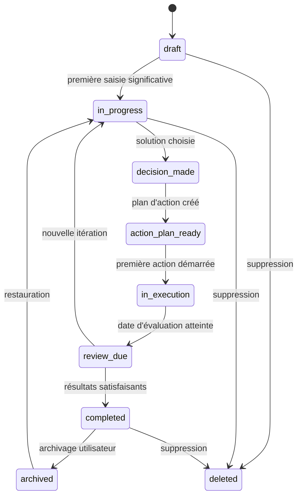
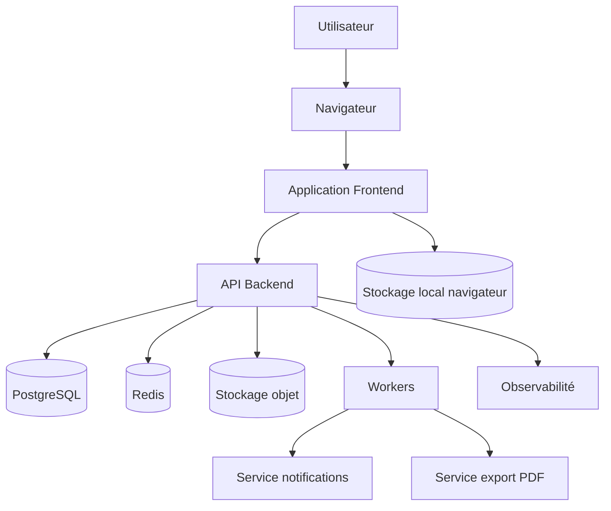
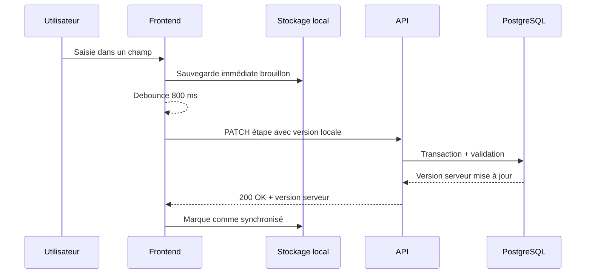
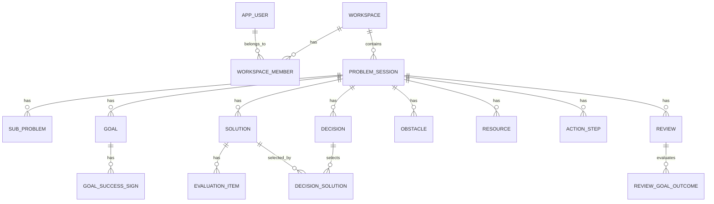

# Spécification complète — Outil web de résolution de problèmes

## 1. Résumé exécutif

Ce document décrit de façon exhaustive un outil web destiné à guider une personne, un professionnel d’accompagnement ou une équipe dans une démarche structurée de résolution de problèmes. L’outil reprend la logique méthodologique du document source, qui organise la démarche en dix étapes successives : prise d’arrêt, posture constructive, définition du problème, définition des objectifs, génération de solutions, analyse des avantages et inconvénients, choix d’une ou plusieurs solutions, identification des obstacles et ressources, plan d’action, puis évaluation des résultats.

L’application à construire doit être plus qu’un simple formulaire numérique. Elle doit fournir une expérience guidée, progressive, sauvegardée, sécurisée et exportable. Elle doit aider l’utilisateur à clarifier un problème, éviter la précipitation, produire plusieurs options, comparer ces options, transformer une décision en actions concrètes, puis réévaluer les résultats après un délai raisonnable.

Le présent fichier sert de cahier des charges détaillé pour concevoir, développer, tester, déployer et maintenir une version web de cet outil.

## 2. Objectifs du produit

### 2.1 Objectif principal

Permettre à un utilisateur de réaliser en ligne une démarche complète de résolution de problèmes, étape par étape, avec une structure suffisamment précise pour encourager la réflexion, la formulation concrète, la comparaison réaliste des solutions et le passage à l’action.

### 2.2 Objectifs secondaires

- Rendre la méthode accessible sur ordinateur, tablette et mobile.
- Permettre la sauvegarde automatique d’une démarche incomplète.
- Offrir une vue synthétique du problème, des objectifs, des solutions, de la décision, du plan d’action et de l’évaluation.
- Permettre l’export en Markdown, PDF, JSON et éventuellement DOCX.
- Permettre une utilisation anonyme locale ou une utilisation connectée synchronisée.
- Préserver la confidentialité des données personnelles et sensibles.
- Proposer des aides contextuelles sans remplacer le jugement de l’utilisateur.
- Permettre une utilisation individuelle, accompagnée ou collaborative selon le contexte.

### 2.3 Résultat attendu pour l’utilisateur

À la fin d’une démarche, l’utilisateur doit disposer d’un dossier structuré contenant :

1. Une définition précise du problème.
2. Les objectifs concrets à atteindre.
3. Une liste de solutions possibles.
4. Une analyse des avantages et inconvénients par solution, à court, moyen et long terme.
5. La ou les solutions choisies.
6. Les obstacles et ressources associés.
7. Un plan d’action daté.
8. Une date d’évaluation.
9. Une évaluation des résultats et, si nécessaire, une relance du cycle.

## 3. Portée fonctionnelle

### 3.1 Inclus dans la première version

La première version doit inclure :

- Création d’une démarche de résolution de problème.
- Assistant guidé en 10 étapes.
- Sauvegarde automatique.
- Reprise d’une démarche en cours.
- Tableau de bord des démarches.
- Matrice avantages / inconvénients par solution.
- Plan d’action avec étapes et dates.
- Date d’évaluation.
- Export Markdown et PDF.
- Mode local sans compte, avec stockage navigateur.
- Mode connecté optionnel avec stockage serveur.
- Interface responsive.
- Accessibilité clavier et lecteurs d’écran.

### 3.2 À inclure dans une version ultérieure

- Collaboration en temps réel.
- Partage avec un accompagnateur.
- Modèles de problèmes fréquents.
- Rappels par courriel, notification push ou calendrier.
- Assistance IA optionnelle pour reformuler, brainstormer ou identifier des risques.
- Analyse de progression personnelle.
- Applications mobiles natives.
- Mode hors ligne complet avec synchronisation différée.
- Intégration agenda.
- Export DOCX.
- Chiffrement de bout en bout.

### 3.3 Hors portée explicite

- Diagnostic médical, psychologique, juridique ou financier.
- Substitution à un professionnel qualifié.
- Décision automatique à la place de l’utilisateur.
- Classement moral ou normatif des solutions.
- Surveillance de l’utilisateur.
- Vente ou partage de données personnelles.

## 4. Principes méthodologiques

La méthode doit rester fidèle à trois principes structurants :

1. **Ralentir avant d’agir.** La première étape sert à reconnaître qu’un problème mérite une réflexion structurée.
2. **Clarifier avant de choisir.** La définition du problème et des objectifs précède la recherche de solutions.
3. **Comparer avant de décider.** Les solutions ne doivent pas être évaluées trop tôt ; elles sont d’abord générées, puis comparées selon leurs conséquences à court, moyen et long terme.

L’application ne doit donc pas pousser l’utilisateur vers une décision trop rapide. Elle doit au contraire rendre visibles les étapes de clarification, de génération, d’évaluation et d’action.

## 5. Description exhaustive de la méthode intégrée

## 5.1 Vue d’ensemble des dix étapes

| N° | Étape | Intention | Sortie principale |
|---:|---|---|---|
| 1 | Stop | Reconnaître qu’un problème mérite une pause réflexive | Confirmation de démarrage |
| 2 | Attitude constructive | Adopter une posture de défi plutôt que de menace | Reformulation constructive |
| 3 | Définir le problème | Décrire le problème précisément, concrètement et de manière délimitée | Énoncé du problème et priorisation |
| 4 | Objectifs | Définir les résultats attendus et les signes concrets de réussite | Objectifs mesurables ou observables |
| 5 | Solutions possibles | Produire toutes les options sans les juger immédiatement | Liste de solutions candidates |
| 6 | Avantages / inconvénients | Comparer les solutions réalistes à court, moyen et long terme | Matrices d’analyse par solution |
| 7 | Choisir | Sélectionner une ou plusieurs solutions et accepter leurs compromis | Décision argumentée |
| 8 | Obstacles / ressources | Identifier les difficultés et moyens nécessaires | Liste d’obstacles et de ressources |
| 9 | Plan d’action | Transformer la solution en étapes datées et réalistes | Plan d’action exécutable |
| 10 | Évaluation | Vérifier les résultats et relancer la méthode si besoin | Bilan, décision de clôture ou itération |

## 5.2 Étape 1 — Stop

### Intention

L’utilisateur doit prendre conscience que le problème n’est pas trivial et mérite une réflexion dédiée. Cette étape évite de répondre de manière impulsive ou automatique.

### Interface recommandée

- Écran court, non chargé.
- Message de démarrage : « Je reconnais que ce problème mérite une réflexion structurée. »
- Bouton principal : « Commencer la démarche ».
- Option : champ libre « Pourquoi est-ce important de m’arrêter maintenant ? »

### Données collectées

| Champ | Type | Obligatoire | Description |
|---|---|---:|---|
| `acknowledged` | booléen | oui | Confirme que l’utilisateur démarre volontairement la démarche |
| `initial_context` | texte long | non | Situation brute exprimée spontanément |
| `created_at` | datetime | oui | Date de création de la démarche |

### Validations

- `acknowledged` doit être `true` pour passer à l’étape suivante.
- `initial_context` peut rester vide.

### Aides contextuelles

- « Il n’est pas nécessaire d’avoir déjà une solution. »
- « L’objectif de cette étape est simplement de créer un espace de réflexion. »

## 5.3 Étape 2 — Attitude constructive

### Intention

Aider l’utilisateur à considérer le problème comme un défi ou une occasion de progrès plutôt que comme une menace absolue.

### Interface recommandée

- Champ : « Formulation spontanée du problème ».
- Champ : « Formulation constructive possible ».
- Suggestions non intrusives : transformer « Je suis bloqué » en « Je cherche une prochaine action réaliste ».

### Données collectées

| Champ | Type | Obligatoire | Description |
|---|---|---:|---|
| `threat_framing` | texte long | non | Perception initiale négative ou menaçante |
| `constructive_reframing` | texte long | oui recommandé | Reformulation orientée défi, apprentissage ou action |
| `confidence_level` | entier 1-5 | non | Sentiment de capacité à aborder le problème |

### Validations

- Aucune obligation stricte de positivité artificielle.
- Le système doit accepter une formulation nuancée : un problème peut rester difficile tout en étant abordable.

### Aides contextuelles

- « Une attitude constructive ne signifie pas nier la difficulté. »
- « Cherchez une formulation qui ouvre une possibilité d’action. »

## 5.4 Étape 3 — Définir le problème

### Intention

Délimiter le problème de façon précise, concrète et priorisée. Si plusieurs problèmes sont présents, ils doivent être séparés et classés par gravité et urgence.

### Interface recommandée

- Champ principal : « Quel est le problème précis ? »
- Assistant de découpage : « Ce problème contient-il plusieurs sous-problèmes ? »
- Liste ordonnable de problèmes.
- Score de gravité.
- Score d’urgence.
- Score de priorité calculé.

### Données collectées

| Champ | Type | Obligatoire | Description |
|---|---|---:|---|
| `problem_statement` | texte long | oui | Définition concrète et délimitée du problème |
| `problem_scope` | texte long | non | Ce qui est inclus et exclu |
| `subproblems[]` | tableau | non | Sous-problèmes distincts |
| `severity` | entier 1-5 | oui si priorisation | Gravité perçue |
| `urgency` | entier 1-5 | oui si priorisation | Urgence perçue |
| `priority_score` | nombre | calculé | Score de priorité |
| `selected_problem_id` | UUID | non | Problème choisi si plusieurs existent |

### Règles de priorisation

Formule simple :

```text
priority_score = severity * urgency
```

Formule pondérée possible :

```text
priority_score = (severity * 0.6) + (urgency * 0.4)
```

La version produit doit permettre de configurer la formule. Par défaut, la multiplication peut être plus intuitive pour faire ressortir les problèmes à la fois graves et urgents.

### Validations

- `problem_statement` doit contenir au moins 20 caractères en mode guidé.
- Le système doit signaler les formulations trop vagues : « tout va mal », « mon travail », « ma famille ».
- Une formulation doit idéalement inclure : contexte, personne concernée, fait observable, limite temporelle ou situationnelle.

### Exemple de transformation

| Formulation vague | Formulation plus utile |
|---|---|
| « Je suis débordé » | « Depuis trois semaines, je n’arrive pas à terminer mes tâches administratives avant vendredi, ce qui retarde mes livrables. » |
| « Ça ne marche pas avec mon collègue » | « Lors des réunions du lundi, les responsabilités ne sont pas clarifiées, ce qui entraîne des doublons dans le travail. » |

## 5.5 Étape 4 — Objectifs

### Intention

Définir ce que l’utilisateur souhaite obtenir et les signes concrets indiquant que l’objectif est atteint.

### Interface recommandée

- Liste d’objectifs.
- Pour chaque objectif : résultat attendu, indicateur concret, échéance éventuelle.
- Option : distinguer objectif minimal, satisfaisant et idéal.

### Données collectées

| Champ | Type | Obligatoire | Description |
|---|---|---:|---|
| `goals[]` | tableau | oui | Objectifs associés au problème |
| `goal.description` | texte | oui | Objectif formulé clairement |
| `goal.success_signs[]` | tableau texte | oui recommandé | Signes concrets de réussite |
| `goal.deadline` | date | non | Date souhaitée |
| `goal.importance` | entier 1-5 | non | Importance de l’objectif |
| `goal.is_minimum` | booléen | non | Marque un objectif minimal acceptable |

### Validations

- Au moins un objectif est requis.
- Chaque objectif doit avoir au moins un signe de réussite ou une description suffisamment observable.
- Le système doit encourager les objectifs réalistes et spécifiques.

### Aides contextuelles

- « À quoi verrez-vous concrètement que le problème est amélioré ? »
- « Qu’est-ce qui serait différent dans les faits ? »

## 5.6 Étape 5 — Solutions possibles

### Intention

Générer toutes les solutions qui viennent à l’esprit, y compris celles qui semblent imparfaites, sans évaluation immédiate. L’objectif est de débloquer l’imagination et d’éviter la recherche prématurée d’une solution parfaite.

### Interface recommandée

- Zone de saisie rapide avec touche Entrée pour ajouter une solution.
- Mode brainstorming avec minuteur optionnel.
- Compteur de solutions.
- Masquage temporaire des champs d’évaluation pour éviter le jugement prématuré.
- Option : demander des informations complémentaires ou solliciter une suggestion externe.

### Données collectées

| Champ | Type | Obligatoire | Description |
|---|---|---:|---|
| `solutions[]` | tableau | oui | Solutions candidates |
| `solution.title` | texte court | oui | Nom de la solution |
| `solution.description` | texte long | non | Détails de l’idée |
| `solution.source` | enum | non | `user`, `assistant`, `external_advice`, `template` |
| `solution.is_realistic_candidate` | booléen | non | Marqueur utilisé avant l’étape 6 |
| `solution.created_at` | datetime | oui | Date d’ajout |

### Validations

- Recommander au moins trois solutions, sans bloquer si l’utilisateur n’en trouve qu’une.
- Empêcher la suppression définitive sans confirmation.
- Autoriser les idées faibles, partielles ou provisoires.

### Aides contextuelles

- « Ne choisissez pas encore. Listez seulement. »
- « Une solution imparfaite peut en inspirer une meilleure. »

## 5.7 Étape 6 — Avantages / inconvénients

### Intention

Évaluer chaque solution réaliste en listant ses avantages et inconvénients à court, moyen et long terme.

### Interface recommandée

- Une matrice par solution.
- Colonnes : avantages, inconvénients.
- Lignes : court terme, moyen terme, long terme.
- Possibilité d’ajouter plusieurs éléments dans chaque cellule.
- Possibilité d’ajouter un poids ou une importance à chaque avantage/inconvénient.
- Vue comparative entre solutions.

### Structure de matrice

| Horizon | Avantages | Inconvénients |
|---|---|---|
| Court terme | Liste d’éléments | Liste d’éléments |
| Moyen terme | Liste d’éléments | Liste d’éléments |
| Long terme | Liste d’éléments | Liste d’éléments |

### Données collectées

| Champ | Type | Obligatoire | Description |
|---|---|---:|---|
| `evaluations[]` | tableau | oui | Évaluations par solution |
| `evaluation.solution_id` | UUID | oui | Solution évaluée |
| `evaluation.items[]` | tableau | oui recommandé | Avantages et inconvénients |
| `item.type` | enum | oui | `advantage` ou `disadvantage` |
| `item.horizon` | enum | oui | `short_term`, `medium_term`, `long_term` |
| `item.description` | texte | oui | Élément évaluatif |
| `item.weight` | entier 1-5 | non | Importance subjective |
| `item.probability` | entier 1-5 | non | Probabilité subjective |

### Score optionnel d’aide à la décision

Le score ne doit pas décider à la place de l’utilisateur. Il peut servir d’indicateur visuel.

```text
item_score = weight * probability
solution_score = sum(advantage_scores) - sum(disadvantage_scores)
```

Pondération possible des horizons :

```text
short_term_weight = 1.0
medium_term_weight = 1.25
long_term_weight = 1.5
```

Score pondéré :

```text
weighted_item_score = weight * probability * horizon_weight
```

### Validations

- Une solution ne doit pas être considérée comme évaluée si toutes les cellules sont vides.
- Le système doit inviter l’utilisateur à considérer au moins deux horizons temporels.
- Les champs de poids et probabilité doivent rester optionnels pour ne pas alourdir l’expérience.

### Aides contextuelles

- « Que gagnez-vous rapidement ? »
- « Quels coûts ou risques apparaissent plus tard ? »
- « Quels effets cette solution peut-elle avoir dans quelques semaines ou quelques mois ? »

## 5.8 Étape 7 — Choisir

### Intention

Choisir une ou plusieurs solutions et accepter explicitement les compromis associés : les inconvénients de la solution choisie et les avantages des solutions non retenues.

### Interface recommandée

- Cartes comparatives des solutions.
- Résumé des avantages/inconvénients majeurs.
- Sélection simple ou multiple.
- Champ : « Pourquoi ce choix ? »
- Champ : « Quels compromis est-ce que j’accepte ? »
- Champ : « Quelles solutions sont écartées et pourquoi ? »

### Données collectées

| Champ | Type | Obligatoire | Description |
|---|---|---:|---|
| `selected_solution_ids[]` | UUID[] | oui | Solutions choisies |
| `decision_rationale` | texte long | oui recommandé | Justification du choix |
| `accepted_disadvantages` | texte long | oui recommandé | Inconvénients acceptés |
| `forgone_advantages` | texte long | non | Avantages des solutions écartées |
| `decision_confidence` | entier 1-5 | non | Niveau de confiance |
| `decision_date` | date | oui | Date du choix |

### Validations

- Au moins une solution doit être choisie.
- Si aucune solution n’a été évaluée, afficher un avertissement avant de choisir.
- Si plusieurs solutions sont choisies, demander si elles sont complémentaires, alternatives ou séquentielles.

### Aides contextuelles

- « Il n’existe pas toujours une solution parfaite. »
- « Le but est de choisir une option suffisamment bonne et assumée. »

## 5.9 Étape 8 — Obstacles et ressources

### Intention

Identifier ce qui pourrait empêcher la mise en œuvre et ce qui est nécessaire pour réussir.

### Interface recommandée

- Deux listes parallèles : obstacles et ressources.
- Pour chaque obstacle : probabilité, impact, stratégie de contournement.
- Pour chaque ressource : type, disponibilité, responsable, date d’obtention.

### Données collectées

| Champ | Type | Obligatoire | Description |
|---|---|---:|---|
| `obstacles[]` | tableau | non mais recommandé | Obstacles à surmonter |
| `obstacle.description` | texte | oui | Description de l’obstacle |
| `obstacle.impact` | entier 1-5 | non | Impact potentiel |
| `obstacle.likelihood` | entier 1-5 | non | Probabilité |
| `obstacle.mitigation` | texte | non | Mesure de prévention ou réponse |
| `resources[]` | tableau | non mais recommandé | Ressources nécessaires |
| `resource.description` | texte | oui | Description de la ressource |
| `resource.type` | enum | non | `time`, `money`, `person`, `skill`, `information`, `tool`, `authorization`, `other` |
| `resource.owner` | texte | non | Personne ou entité responsable |
| `resource.available_at` | date | non | Date de disponibilité |

### Validations

- Au moins une réflexion doit être demandée sur les obstacles et ressources, même si l’utilisateur répond « aucun obstacle identifié ».
- Les ressources critiques doivent être reliées au plan d’action.

### Aides contextuelles

- « Qu’est-ce qui pourrait vous empêcher d’agir ? »
- « De quoi avez-vous besoin pour commencer ? »
- « Qui peut vous aider ? »

## 5.10 Étape 9 — Plan d’action

### Intention

Transformer la décision en étapes concrètes, datées, réalistes et assez simples pour permettre un passage rapide à l’action.

### Interface recommandée

- Tableau des étapes.
- Colonnes : ordre, action, responsable, date prévue, statut, dépendances, notes.
- Mise en évidence de la première action.
- Bouton : « Marquer comme fait ».
- Rappels optionnels.
- Vue calendrier.

### Données collectées

| Champ | Type | Obligatoire | Description |
|---|---|---:|---|
| `action_steps[]` | tableau | oui | Étapes du plan |
| `action_step.order` | entier | oui | Ordre d’exécution |
| `action_step.description` | texte | oui | Action concrète |
| `action_step.owner` | texte ou UUID | non | Responsable |
| `action_step.due_date` | date | oui recommandé | Date prévue |
| `action_step.status` | enum | oui | `todo`, `in_progress`, `done`, `blocked`, `cancelled` |
| `action_step.dependencies[]` | UUID[] | non | Étapes préalables |
| `action_step.first_step` | booléen | non | Indique l’étape initiale |
| `action_step.estimated_effort` | texte ou nombre | non | Effort estimé |

### Validations

- Au moins une étape est obligatoire.
- La première étape doit être suffisamment concrète.
- Une date passée doit déclencher un avertissement, sauf si l’étape est déjà terminée.
- Les dépendances ne doivent pas créer de cycle.

### Détection d’action trop vague

Exemples d’actions trop vagues :

- « M’organiser ».
- « Régler la situation ».
- « Faire mieux ».

Exemples d’actions plus exploitables :

- « Lister les tâches administratives en retard mardi à 9 h pendant 20 minutes. »
- « Envoyer un courriel à Marie pour clarifier les responsabilités avant vendredi. »

## 5.11 Étape 10 — Évaluation

### Intention

Évaluer les résultats après un délai raisonnable et relancer la méthode si nécessaire.

### Interface recommandée

- Date d’évaluation planifiée.
- Questionnaire de bilan.
- Comparaison avec les objectifs initiaux.
- Choix final : clore, ajuster le plan, revenir à une étape précédente, créer une nouvelle itération.

### Données collectées

| Champ | Type | Obligatoire | Description |
|---|---|---:|---|
| `review_date` | date | oui | Date prévue d’évaluation |
| `review_completed_at` | datetime | non | Date réelle d’évaluation |
| `goal_outcomes[]` | tableau | non | Résultats par objectif |
| `overall_result` | enum | non | `resolved`, `improved`, `unchanged`, `worse`, `unknown` |
| `lessons_learned` | texte long | non | Apprentissages |
| `next_decision` | enum | non | `close`, `adjust_action_plan`, `return_to_problem_definition`, `generate_more_solutions`, `start_new_cycle` |

### Validations

- Une date d’évaluation doit être définie lors de la création du plan d’action ou immédiatement après.
- Le système doit pouvoir rouvrir une démarche après évaluation.

## 6. Modèle d’expérience utilisateur

## 6.1 Modes d’utilisation

### Mode guidé

Le mode guidé présente les étapes une par une. Il convient à l’utilisateur qui découvre la méthode ou qui souhaite être accompagné.

Caractéristiques :

- Un seul écran principal par étape.
- Progression visible.
- Conseils contextuels.
- Validation minimale avant passage à l’étape suivante.
- Sauvegarde automatique.
- Possibilité de revenir en arrière.

### Mode expert

Le mode expert affiche l’ensemble de la démarche sur une page ou dans des panneaux repliables.

Caractéristiques :

- Navigation rapide.
- Saisie non linéaire.
- Idéal pour professionnels ou utilisateurs récurrents.
- Validations moins intrusives.
- Vue synthèse permanente.

### Mode atelier

Le mode atelier est destiné à une équipe ou à un accompagnement professionnel.

Caractéristiques :

- Facilitation par un animateur.
- Gestion des participants.
- Brainstorming anonyme optionnel.
- Vote ou priorisation des solutions.
- Export de compte rendu.

## 6.2 Parcours utilisateur nominal

1. L’utilisateur ouvre l’application.
2. Il choisit « Nouvelle démarche ».
3. Il saisit un titre provisoire.
4. Il confirme l’étape Stop.
5. Il reformule le problème de manière constructive.
6. Il définit précisément le problème.
7. Il fixe un ou plusieurs objectifs.
8. Il liste plusieurs solutions possibles.
9. Il analyse les solutions réalistes.
10. Il choisit une ou plusieurs solutions.
11. Il identifie obstacles et ressources.
12. Il construit un plan d’action.
13. Il fixe une date d’évaluation.
14. Il exporte ou sauvegarde la démarche.
15. À la date prévue, il évalue les résultats.

## 6.3 Parcours de reprise

1. L’utilisateur revient sur le tableau de bord.
2. Il voit les démarches en cours, en retard ou à évaluer.
3. Il ouvre une démarche.
4. L’application le ramène à la dernière étape modifiée.
5. Les champs sont restaurés.
6. L’utilisateur continue ou ajuste les étapes précédentes.

## 6.4 Parcours d’évaluation différée

1. L’utilisateur reçoit un rappel ou consulte son tableau de bord.
2. La démarche apparaît comme « Évaluation due ».
3. Il ouvre l’étape 10.
4. L’outil affiche les objectifs, le plan d’action et les actions terminées.
5. L’utilisateur note les résultats.
6. Il choisit de clore, ajuster ou relancer la démarche.

## 6.5 Parcours sans compte

- Les données sont stockées localement dans le navigateur.
- L’utilisateur peut exporter un fichier local.
- Une bannière explique que la suppression du stockage navigateur peut supprimer les données.
- Option : conversion vers compte utilisateur.

## 6.6 Parcours avec compte

- Authentification par courriel, mot de passe, SSO ou lien magique.
- Synchronisation multi-appareils.
- Sauvegarde serveur.
- Gestion des exports et suppressions.
- Tableau de bord personnel.

## 7. Architecture fonctionnelle de l’application

## 7.1 Modules principaux

| Module | Responsabilité |
|---|---|
| Tableau de bord | Lister, filtrer, reprendre et créer des démarches |
| Assistant guidé | Présenter les dix étapes en séquence |
| Éditeur de problème | Gérer définition, objectifs et sous-problèmes |
| Générateur de solutions | Saisie et organisation des solutions candidates |
| Matrice d’évaluation | Avantages/inconvénients par horizon temporel |
| Décision | Sélection et justification de la solution retenue |
| Obstacles/ressources | Anticipation opérationnelle |
| Plan d’action | Étapes, dates, statuts et rappels |
| Évaluation | Bilan et éventuelle itération |
| Export | Markdown, PDF, JSON, DOCX ultérieur |
| Authentification | Comptes, sessions, permissions |
| Synchronisation | Sauvegarde locale/serveur et résolution de conflits |
| Notifications | Rappels d’action et d’évaluation |
| Administration | Configuration, supervision, support |

## 7.2 États d’une démarche

| État | Description |
|---|---|
| `draft` | Démarche créée mais peu renseignée |
| `in_progress` | Démarche active |
| `decision_made` | Solution choisie |
| `action_plan_ready` | Plan d’action défini |
| `in_execution` | Actions en cours |
| `review_due` | Évaluation attendue |
| `completed` | Démarche clôturée |
| `archived` | Démarche masquée mais conservée |
| `deleted` | Suppression logique avant purge |

## 7.3 Machine à états



## 8. Spécifications d’interface

## 8.1 Structure globale

### Navigation principale

- Logo / nom de l’application.
- Tableau de bord.
- Nouvelle démarche.
- Modèles.
- Exports.
- Paramètres.
- Aide.

### Écran de démarche

- En-tête : titre, statut, progression, dernière sauvegarde.
- Barre d’étapes : 1 à 10.
- Zone principale : contenu de l’étape active.
- Panneau latéral : résumé, conseils, validations, actions rapides.
- Pied : précédent, enregistrer, suivant, exporter.

## 8.2 Composants UI obligatoires

| Composant | Description | Contraintes |
|---|---|---|
| `StepProgress` | Barre de progression en 10 étapes | Accessible clavier et ARIA |
| `AutosaveIndicator` | Indique l’état de sauvegarde | États : sauvegardé, en cours, erreur |
| `GuidedTextarea` | Champ long avec aide contextuelle | Autosize, compteur optionnel |
| `ProblemPriorityList` | Liste de sous-problèmes triables | Drag & drop accessible ou alternative boutons |
| `GoalList` | Liste d’objectifs et signes de réussite | Ajout/suppression contrôlés |
| `SolutionBrainstorm` | Ajout rapide de solutions | Empêcher l’évaluation prématurée en mode brainstorming |
| `EvaluationMatrix` | Avantages/inconvénients par horizon | Cellules répétables |
| `DecisionPanel` | Sélection de solutions et compromis | Résumé comparatif |
| `ObstacleResourceBoard` | Deux colonnes obstacles/ressources | Association possible aux actions |
| `ActionPlanTable` | Étapes datées | Statuts, dates, rappels |
| `ReviewForm` | Bilan final | Comparaison aux objectifs |
| `ExportMenu` | Export multi-format | Markdown et PDF en V1 |

## 8.3 Règles de design

- Éviter les écrans anxiogènes ou surchargés.
- Préférer des libellés clairs à des termes techniques.
- Toujours indiquer la possibilité de revenir en arrière.
- Ne jamais présenter un score comme une vérité objective.
- Afficher les dates dans le format local de l’utilisateur.
- Préserver une version imprimable propre.
- Ne pas utiliser de motifs visuels culpabilisants pour les retards.

## 8.4 Responsive design

### Mobile

- Une seule colonne.
- Barre d’étapes compacte.
- Matrice transformée en cartes empilées.
- Plan d’action affiché sous forme de liste.
- Boutons fixes en bas uniquement si non obstructifs.

### Tablette

- Deux colonnes possibles.
- Panneau de conseils repliable.
- Matrice conservée si largeur suffisante.

### Desktop

- Panneau latéral de synthèse.
- Comparaison multi-solutions plus confortable.
- Tableaux complets.

## 8.5 Accessibilité

L’application doit viser au minimum WCAG 2.2 AA.

Exigences :

- Navigation complète au clavier.
- Focus visible.
- Contrastes suffisants.
- Labels explicites pour tous les champs.
- Messages d’erreur reliés aux champs.
- Alternatives au glisser-déposer.
- Pas d’information uniquement transmise par la couleur.
- Support lecteur d’écran.
- Structure de titres cohérente.
- Sauvegarde annoncée de manière non intrusive.
- Aucun timer obligatoire sans pause ou désactivation.

## 9. Spécifications données

## 9.1 Entités métier

### User

Représente un utilisateur connecté.

| Champ | Type | Contraintes |
|---|---|---|
| `id` | UUID | PK |
| `email` | string | unique, nullable si compte anonyme migré |
| `display_name` | string | nullable |
| `locale` | string | ex. `fr-CA`, `fr-FR` |
| `timezone` | string | IANA timezone |
| `created_at` | timestamptz | obligatoire |
| `updated_at` | timestamptz | obligatoire |
| `deleted_at` | timestamptz | nullable |

### Workspace

Espace personnel ou collaboratif.

| Champ | Type | Contraintes |
|---|---|---|
| `id` | UUID | PK |
| `name` | string | obligatoire |
| `type` | enum | `personal`, `team`, `professional` |
| `owner_user_id` | UUID | FK User |
| `created_at` | timestamptz | obligatoire |

### ProblemSession

Démarche complète de résolution de problème.

| Champ | Type | Contraintes |
|---|---|---|
| `id` | UUID | PK |
| `workspace_id` | UUID | FK Workspace |
| `created_by` | UUID | FK User nullable en mode local importé |
| `title` | string | obligatoire |
| `status` | enum | voir états |
| `current_step` | integer | 1 à 10 |
| `initial_context` | text | nullable |
| `constructive_reframing` | text | nullable |
| `problem_statement` | text | nullable |
| `problem_scope` | text | nullable |
| `selected_problem_id` | UUID | nullable |
| `decision_date` | date | nullable |
| `review_date` | date | nullable |
| `review_completed_at` | timestamptz | nullable |
| `overall_result` | enum | nullable |
| `created_at` | timestamptz | obligatoire |
| `updated_at` | timestamptz | obligatoire |
| `deleted_at` | timestamptz | nullable |

### SubProblem

Sous-problème séparé et priorisable.

| Champ | Type | Contraintes |
|---|---|---|
| `id` | UUID | PK |
| `session_id` | UUID | FK ProblemSession |
| `description` | text | obligatoire |
| `severity` | integer | 1 à 5 |
| `urgency` | integer | 1 à 5 |
| `priority_score` | numeric | calculé ou stocké |
| `sort_order` | integer | obligatoire |

### Goal

Objectif associé à la démarche.

| Champ | Type | Contraintes |
|---|---|---|
| `id` | UUID | PK |
| `session_id` | UUID | FK ProblemSession |
| `description` | text | obligatoire |
| `deadline` | date | nullable |
| `importance` | integer | 1 à 5 nullable |
| `is_minimum` | boolean | défaut false |
| `sort_order` | integer | obligatoire |

### GoalSuccessSign

Signe concret que l’objectif est atteint.

| Champ | Type | Contraintes |
|---|---|---|
| `id` | UUID | PK |
| `goal_id` | UUID | FK Goal |
| `description` | text | obligatoire |
| `sort_order` | integer | obligatoire |

### Solution

Solution possible.

| Champ | Type | Contraintes |
|---|---|---|
| `id` | UUID | PK |
| `session_id` | UUID | FK ProblemSession |
| `title` | string | obligatoire |
| `description` | text | nullable |
| `source` | enum | `user`, `assistant`, `external_advice`, `template` |
| `is_realistic_candidate` | boolean | défaut true |
| `is_selected` | boolean | défaut false |
| `sort_order` | integer | obligatoire |
| `created_at` | timestamptz | obligatoire |

### EvaluationItem

Avantage ou inconvénient associé à une solution et un horizon.

| Champ | Type | Contraintes |
|---|---|---|
| `id` | UUID | PK |
| `solution_id` | UUID | FK Solution |
| `type` | enum | `advantage`, `disadvantage` |
| `horizon` | enum | `short_term`, `medium_term`, `long_term` |
| `description` | text | obligatoire |
| `weight` | integer | 1 à 5 nullable |
| `probability` | integer | 1 à 5 nullable |
| `sort_order` | integer | obligatoire |

### Decision

Décision et compromis.

| Champ | Type | Contraintes |
|---|---|---|
| `id` | UUID | PK |
| `session_id` | UUID | FK ProblemSession |
| `rationale` | text | nullable |
| `accepted_disadvantages` | text | nullable |
| `forgone_advantages` | text | nullable |
| `confidence` | integer | 1 à 5 nullable |
| `created_at` | timestamptz | obligatoire |

### Obstacle

Obstacle à anticiper.

| Champ | Type | Contraintes |
|---|---|---|
| `id` | UUID | PK |
| `session_id` | UUID | FK ProblemSession |
| `description` | text | obligatoire |
| `impact` | integer | 1 à 5 nullable |
| `likelihood` | integer | 1 à 5 nullable |
| `mitigation` | text | nullable |
| `sort_order` | integer | obligatoire |

### Resource

Ressource nécessaire.

| Champ | Type | Contraintes |
|---|---|---|
| `id` | UUID | PK |
| `session_id` | UUID | FK ProblemSession |
| `description` | text | obligatoire |
| `type` | enum | `time`, `money`, `person`, `skill`, `information`, `tool`, `authorization`, `other` |
| `owner` | string | nullable |
| `available_at` | date | nullable |
| `sort_order` | integer | obligatoire |

### ActionStep

Étape du plan d’action.

| Champ | Type | Contraintes |
|---|---|---|
| `id` | UUID | PK |
| `session_id` | UUID | FK ProblemSession |
| `description` | text | obligatoire |
| `owner` | string | nullable |
| `due_date` | date | nullable mais recommandé |
| `status` | enum | `todo`, `in_progress`, `done`, `blocked`, `cancelled` |
| `first_step` | boolean | défaut false |
| `estimated_effort_minutes` | integer | nullable |
| `sort_order` | integer | obligatoire |
| `completed_at` | timestamptz | nullable |

### Review

Bilan d’évaluation.

| Champ | Type | Contraintes |
|---|---|---|
| `id` | UUID | PK |
| `session_id` | UUID | FK ProblemSession |
| `overall_result` | enum | `resolved`, `improved`, `unchanged`, `worse`, `unknown` |
| `lessons_learned` | text | nullable |
| `next_decision` | enum | `close`, `adjust_action_plan`, `return_to_problem_definition`, `generate_more_solutions`, `start_new_cycle` |
| `created_at` | timestamptz | obligatoire |

## 9.2 Schéma relationnel PostgreSQL indicatif

```sql
CREATE EXTENSION IF NOT EXISTS "uuid-ossp";
CREATE EXTENSION IF NOT EXISTS pgcrypto;

CREATE TYPE workspace_type AS ENUM ('personal', 'team', 'professional');
CREATE TYPE session_status AS ENUM (
  'draft', 'in_progress', 'decision_made', 'action_plan_ready',
  'in_execution', 'review_due', 'completed', 'archived', 'deleted'
);
CREATE TYPE solution_source AS ENUM ('user', 'assistant', 'external_advice', 'template');
CREATE TYPE evaluation_type AS ENUM ('advantage', 'disadvantage');
CREATE TYPE time_horizon AS ENUM ('short_term', 'medium_term', 'long_term');
CREATE TYPE resource_type AS ENUM ('time', 'money', 'person', 'skill', 'information', 'tool', 'authorization', 'other');
CREATE TYPE action_status AS ENUM ('todo', 'in_progress', 'done', 'blocked', 'cancelled');
CREATE TYPE review_result AS ENUM ('resolved', 'improved', 'unchanged', 'worse', 'unknown');
CREATE TYPE review_next_decision AS ENUM ('close', 'adjust_action_plan', 'return_to_problem_definition', 'generate_more_solutions', 'start_new_cycle');

CREATE TABLE app_user (
  id UUID PRIMARY KEY DEFAULT gen_random_uuid(),
  email CITEXT UNIQUE,
  display_name TEXT,
  locale TEXT NOT NULL DEFAULT 'fr',
  timezone TEXT NOT NULL DEFAULT 'UTC',
  created_at TIMESTAMPTZ NOT NULL DEFAULT now(),
  updated_at TIMESTAMPTZ NOT NULL DEFAULT now(),
  deleted_at TIMESTAMPTZ
);

CREATE TABLE workspace (
  id UUID PRIMARY KEY DEFAULT gen_random_uuid(),
  name TEXT NOT NULL,
  type workspace_type NOT NULL DEFAULT 'personal',
  owner_user_id UUID REFERENCES app_user(id) ON DELETE SET NULL,
  created_at TIMESTAMPTZ NOT NULL DEFAULT now()
);

CREATE TABLE workspace_member (
  workspace_id UUID NOT NULL REFERENCES workspace(id) ON DELETE CASCADE,
  user_id UUID NOT NULL REFERENCES app_user(id) ON DELETE CASCADE,
  role TEXT NOT NULL CHECK (role IN ('owner', 'editor', 'viewer')),
  created_at TIMESTAMPTZ NOT NULL DEFAULT now(),
  PRIMARY KEY (workspace_id, user_id)
);

CREATE TABLE problem_session (
  id UUID PRIMARY KEY DEFAULT gen_random_uuid(),
  workspace_id UUID NOT NULL REFERENCES workspace(id) ON DELETE CASCADE,
  created_by UUID REFERENCES app_user(id) ON DELETE SET NULL,
  title TEXT NOT NULL,
  status session_status NOT NULL DEFAULT 'draft',
  current_step INTEGER NOT NULL DEFAULT 1 CHECK (current_step BETWEEN 1 AND 10),
  acknowledged_stop BOOLEAN NOT NULL DEFAULT false,
  initial_context TEXT,
  threat_framing TEXT,
  constructive_reframing TEXT,
  problem_statement TEXT,
  problem_scope TEXT,
  selected_problem_id UUID,
  decision_date DATE,
  review_date DATE,
  review_completed_at TIMESTAMPTZ,
  overall_result review_result,
  created_at TIMESTAMPTZ NOT NULL DEFAULT now(),
  updated_at TIMESTAMPTZ NOT NULL DEFAULT now(),
  deleted_at TIMESTAMPTZ
);

CREATE TABLE sub_problem (
  id UUID PRIMARY KEY DEFAULT gen_random_uuid(),
  session_id UUID NOT NULL REFERENCES problem_session(id) ON DELETE CASCADE,
  description TEXT NOT NULL,
  severity INTEGER CHECK (severity BETWEEN 1 AND 5),
  urgency INTEGER CHECK (urgency BETWEEN 1 AND 5),
  priority_score NUMERIC GENERATED ALWAYS AS (
    COALESCE(severity, 0) * COALESCE(urgency, 0)
  ) STORED,
  sort_order INTEGER NOT NULL DEFAULT 0,
  created_at TIMESTAMPTZ NOT NULL DEFAULT now()
);

ALTER TABLE problem_session
ADD CONSTRAINT fk_selected_problem
FOREIGN KEY (selected_problem_id) REFERENCES sub_problem(id) ON DELETE SET NULL;

CREATE TABLE goal (
  id UUID PRIMARY KEY DEFAULT gen_random_uuid(),
  session_id UUID NOT NULL REFERENCES problem_session(id) ON DELETE CASCADE,
  description TEXT NOT NULL,
  deadline DATE,
  importance INTEGER CHECK (importance BETWEEN 1 AND 5),
  is_minimum BOOLEAN NOT NULL DEFAULT false,
  sort_order INTEGER NOT NULL DEFAULT 0,
  created_at TIMESTAMPTZ NOT NULL DEFAULT now()
);

CREATE TABLE goal_success_sign (
  id UUID PRIMARY KEY DEFAULT gen_random_uuid(),
  goal_id UUID NOT NULL REFERENCES goal(id) ON DELETE CASCADE,
  description TEXT NOT NULL,
  sort_order INTEGER NOT NULL DEFAULT 0
);

CREATE TABLE solution (
  id UUID PRIMARY KEY DEFAULT gen_random_uuid(),
  session_id UUID NOT NULL REFERENCES problem_session(id) ON DELETE CASCADE,
  title TEXT NOT NULL,
  description TEXT,
  source solution_source NOT NULL DEFAULT 'user',
  is_realistic_candidate BOOLEAN NOT NULL DEFAULT true,
  is_selected BOOLEAN NOT NULL DEFAULT false,
  sort_order INTEGER NOT NULL DEFAULT 0,
  created_at TIMESTAMPTZ NOT NULL DEFAULT now()
);

CREATE TABLE evaluation_item (
  id UUID PRIMARY KEY DEFAULT gen_random_uuid(),
  solution_id UUID NOT NULL REFERENCES solution(id) ON DELETE CASCADE,
  type evaluation_type NOT NULL,
  horizon time_horizon NOT NULL,
  description TEXT NOT NULL,
  weight INTEGER CHECK (weight BETWEEN 1 AND 5),
  probability INTEGER CHECK (probability BETWEEN 1 AND 5),
  sort_order INTEGER NOT NULL DEFAULT 0,
  created_at TIMESTAMPTZ NOT NULL DEFAULT now()
);

CREATE TABLE decision (
  id UUID PRIMARY KEY DEFAULT gen_random_uuid(),
  session_id UUID NOT NULL REFERENCES problem_session(id) ON DELETE CASCADE,
  rationale TEXT,
  accepted_disadvantages TEXT,
  forgone_advantages TEXT,
  confidence INTEGER CHECK (confidence BETWEEN 1 AND 5),
  created_at TIMESTAMPTZ NOT NULL DEFAULT now()
);

CREATE TABLE decision_solution (
  decision_id UUID NOT NULL REFERENCES decision(id) ON DELETE CASCADE,
  solution_id UUID NOT NULL REFERENCES solution(id) ON DELETE CASCADE,
  PRIMARY KEY (decision_id, solution_id)
);

CREATE TABLE obstacle (
  id UUID PRIMARY KEY DEFAULT gen_random_uuid(),
  session_id UUID NOT NULL REFERENCES problem_session(id) ON DELETE CASCADE,
  description TEXT NOT NULL,
  impact INTEGER CHECK (impact BETWEEN 1 AND 5),
  likelihood INTEGER CHECK (likelihood BETWEEN 1 AND 5),
  mitigation TEXT,
  sort_order INTEGER NOT NULL DEFAULT 0,
  created_at TIMESTAMPTZ NOT NULL DEFAULT now()
);

CREATE TABLE resource (
  id UUID PRIMARY KEY DEFAULT gen_random_uuid(),
  session_id UUID NOT NULL REFERENCES problem_session(id) ON DELETE CASCADE,
  description TEXT NOT NULL,
  type resource_type NOT NULL DEFAULT 'other',
  owner TEXT,
  available_at DATE,
  sort_order INTEGER NOT NULL DEFAULT 0,
  created_at TIMESTAMPTZ NOT NULL DEFAULT now()
);

CREATE TABLE action_step (
  id UUID PRIMARY KEY DEFAULT gen_random_uuid(),
  session_id UUID NOT NULL REFERENCES problem_session(id) ON DELETE CASCADE,
  description TEXT NOT NULL,
  owner TEXT,
  due_date DATE,
  status action_status NOT NULL DEFAULT 'todo',
  first_step BOOLEAN NOT NULL DEFAULT false,
  estimated_effort_minutes INTEGER CHECK (estimated_effort_minutes >= 0),
  sort_order INTEGER NOT NULL DEFAULT 0,
  completed_at TIMESTAMPTZ,
  created_at TIMESTAMPTZ NOT NULL DEFAULT now(),
  updated_at TIMESTAMPTZ NOT NULL DEFAULT now()
);

CREATE TABLE action_dependency (
  action_step_id UUID NOT NULL REFERENCES action_step(id) ON DELETE CASCADE,
  depends_on_action_step_id UUID NOT NULL REFERENCES action_step(id) ON DELETE CASCADE,
  PRIMARY KEY (action_step_id, depends_on_action_step_id),
  CHECK (action_step_id <> depends_on_action_step_id)
);

CREATE TABLE review (
  id UUID PRIMARY KEY DEFAULT gen_random_uuid(),
  session_id UUID NOT NULL REFERENCES problem_session(id) ON DELETE CASCADE,
  overall_result review_result NOT NULL,
  lessons_learned TEXT,
  next_decision review_next_decision NOT NULL,
  created_at TIMESTAMPTZ NOT NULL DEFAULT now()
);

CREATE TABLE review_goal_outcome (
  id UUID PRIMARY KEY DEFAULT gen_random_uuid(),
  review_id UUID NOT NULL REFERENCES review(id) ON DELETE CASCADE,
  goal_id UUID NOT NULL REFERENCES goal(id) ON DELETE CASCADE,
  outcome TEXT,
  achieved BOOLEAN,
  score INTEGER CHECK (score BETWEEN 1 AND 5)
);

CREATE INDEX idx_problem_session_workspace ON problem_session(workspace_id);
CREATE INDEX idx_problem_session_status ON problem_session(status);
CREATE INDEX idx_problem_session_review_date ON problem_session(review_date);
CREATE INDEX idx_solution_session ON solution(session_id);
CREATE INDEX idx_action_step_session_due ON action_step(session_id, due_date);
```

## 9.3 Interfaces TypeScript indicatives

```ts
export type UUID = string;

export type SessionStatus =
  | 'draft'
  | 'in_progress'
  | 'decision_made'
  | 'action_plan_ready'
  | 'in_execution'
  | 'review_due'
  | 'completed'
  | 'archived'
  | 'deleted';

export type TimeHorizon = 'short_term' | 'medium_term' | 'long_term';
export type EvaluationType = 'advantage' | 'disadvantage';

export interface ProblemSession {
  id: UUID;
  workspaceId: UUID;
  title: string;
  status: SessionStatus;
  currentStep: number;
  acknowledgedStop: boolean;
  initialContext?: string;
  threatFraming?: string;
  constructiveReframing?: string;
  problemStatement?: string;
  problemScope?: string;
  subProblems: SubProblem[];
  goals: Goal[];
  solutions: Solution[];
  decision?: Decision;
  obstacles: Obstacle[];
  resources: Resource[];
  actionSteps: ActionStep[];
  reviewDate?: string;
  reviews: Review[];
  createdAt: string;
  updatedAt: string;
}

export interface SubProblem {
  id: UUID;
  description: string;
  severity?: number;
  urgency?: number;
  priorityScore?: number;
  sortOrder: number;
}

export interface Goal {
  id: UUID;
  description: string;
  successSigns: GoalSuccessSign[];
  deadline?: string;
  importance?: number;
  isMinimum: boolean;
  sortOrder: number;
}

export interface GoalSuccessSign {
  id: UUID;
  description: string;
  sortOrder: number;
}

export interface Solution {
  id: UUID;
  title: string;
  description?: string;
  source: 'user' | 'assistant' | 'external_advice' | 'template';
  isRealisticCandidate: boolean;
  isSelected: boolean;
  evaluations: EvaluationItem[];
  sortOrder: number;
  createdAt: string;
}

export interface EvaluationItem {
  id: UUID;
  type: EvaluationType;
  horizon: TimeHorizon;
  description: string;
  weight?: number;
  probability?: number;
  sortOrder: number;
}

export interface Decision {
  id: UUID;
  selectedSolutionIds: UUID[];
  rationale?: string;
  acceptedDisadvantages?: string;
  forgoneAdvantages?: string;
  confidence?: number;
  createdAt: string;
}

export interface Obstacle {
  id: UUID;
  description: string;
  impact?: number;
  likelihood?: number;
  mitigation?: string;
  sortOrder: number;
}

export interface Resource {
  id: UUID;
  description: string;
  type: 'time' | 'money' | 'person' | 'skill' | 'information' | 'tool' | 'authorization' | 'other';
  owner?: string;
  availableAt?: string;
  sortOrder: number;
}

export interface ActionStep {
  id: UUID;
  description: string;
  owner?: string;
  dueDate?: string;
  status: 'todo' | 'in_progress' | 'done' | 'blocked' | 'cancelled';
  firstStep: boolean;
  estimatedEffortMinutes?: number;
  dependencies: UUID[];
  sortOrder: number;
  completedAt?: string;
}

export interface Review {
  id: UUID;
  overallResult: 'resolved' | 'improved' | 'unchanged' | 'worse' | 'unknown';
  goalOutcomes: ReviewGoalOutcome[];
  lessonsLearned?: string;
  nextDecision:
    | 'close'
    | 'adjust_action_plan'
    | 'return_to_problem_definition'
    | 'generate_more_solutions'
    | 'start_new_cycle';
  createdAt: string;
}
```

## 9.4 Format JSON d’export

```json
{
  "schema_version": "1.0",
  "exported_at": "2026-06-06T12:00:00Z",
  "session": {
    "id": "00000000-0000-0000-0000-000000000000",
    "title": "Exemple de démarche",
    "status": "action_plan_ready",
    "current_step": 9,
    "step_1_stop": {
      "acknowledged": true,
      "initial_context": "Description initiale libre."
    },
    "step_2_constructive_attitude": {
      "threat_framing": "Je me sens bloqué.",
      "constructive_reframing": "Je peux identifier une première action réaliste."
    },
    "step_3_problem_definition": {
      "problem_statement": "Problème défini concrètement.",
      "problem_scope": "Limites du problème.",
      "subproblems": []
    },
    "step_4_goals": [],
    "step_5_solutions": [],
    "step_6_evaluations": [],
    "step_7_decision": null,
    "step_8_obstacles_resources": {
      "obstacles": [],
      "resources": []
    },
    "step_9_action_plan": [],
    "step_10_review": {
      "review_date": null,
      "reviews": []
    }
  }
}
```

## 10. Spécification API REST

## 10.1 Principes généraux

- API versionnée sous `/api/v1`.
- Authentification par cookie sécurisé ou jeton Bearer selon architecture.
- Réponses JSON.
- Validation côté serveur systématique.
- Idempotence pour les sauvegardes automatiques.
- Pagination sur les listes.
- Journalisation sans données sensibles en clair.

## 10.2 Codes d’erreur standards

| Code HTTP | Code applicatif | Description |
|---:|---|---|
| 400 | `VALIDATION_ERROR` | Données invalides |
| 401 | `UNAUTHENTICATED` | Authentification requise |
| 403 | `FORBIDDEN` | Droits insuffisants |
| 404 | `NOT_FOUND` | Ressource introuvable |
| 409 | `CONFLICT` | Conflit de version ou synchronisation |
| 422 | `STEP_INCOMPLETE` | Étape incomplète |
| 429 | `RATE_LIMITED` | Limite de requêtes dépassée |
| 500 | `INTERNAL_ERROR` | Erreur serveur |

Format d’erreur :

```json
{
  "error": {
    "code": "VALIDATION_ERROR",
    "message": "Le champ problem_statement est requis.",
    "details": [
      {
        "field": "problem_statement",
        "reason": "required"
      }
    ],
    "request_id": "req_123"
  }
}
```

## 10.3 Authentification

| Méthode | Endpoint | Description |
|---|---|---|
| POST | `/api/v1/auth/register` | Créer un compte |
| POST | `/api/v1/auth/login` | Ouvrir une session |
| POST | `/api/v1/auth/logout` | Fermer la session |
| POST | `/api/v1/auth/magic-link` | Envoyer un lien magique |
| GET | `/api/v1/auth/me` | Obtenir l’utilisateur courant |
| DELETE | `/api/v1/auth/me` | Demander suppression du compte |

## 10.4 Sessions de résolution de problème

| Méthode | Endpoint | Description |
|---|---|---|
| GET | `/api/v1/sessions` | Lister les démarches |
| POST | `/api/v1/sessions` | Créer une démarche |
| GET | `/api/v1/sessions/{sessionId}` | Obtenir une démarche complète |
| PATCH | `/api/v1/sessions/{sessionId}` | Modifier les métadonnées |
| DELETE | `/api/v1/sessions/{sessionId}` | Supprimer une démarche |
| POST | `/api/v1/sessions/{sessionId}/archive` | Archiver |
| POST | `/api/v1/sessions/{sessionId}/restore` | Restaurer |
| POST | `/api/v1/sessions/{sessionId}/duplicate` | Dupliquer |

### Création

Requête :

```json
{
  "title": "Résoudre un problème professionnel",
  "mode": "guided",
  "workspace_id": "00000000-0000-0000-0000-000000000000"
}
```

Réponse :

```json
{
  "id": "11111111-1111-1111-1111-111111111111",
  "title": "Résoudre un problème professionnel",
  "status": "draft",
  "current_step": 1,
  "created_at": "2026-06-06T12:00:00Z"
}
```

## 10.5 Endpoints par étape

### Étape 1 — Stop

```http
PUT /api/v1/sessions/{sessionId}/steps/1
```

```json
{
  "acknowledged_stop": true,
  "initial_context": "Je veux prendre le temps de clarifier la situation."
}
```

### Étape 2 — Attitude constructive

```http
PUT /api/v1/sessions/{sessionId}/steps/2
```

```json
{
  "threat_framing": "Je vois ce problème comme bloquant.",
  "constructive_reframing": "Je peux chercher une solution progressive.",
  "confidence_level": 3
}
```

### Étape 3 — Définition du problème

```http
PUT /api/v1/sessions/{sessionId}/steps/3
```

```json
{
  "problem_statement": "Définition précise du problème.",
  "problem_scope": "Ce qui est inclus et exclu.",
  "subproblems": [
    {
      "id": null,
      "description": "Sous-problème A",
      "severity": 4,
      "urgency": 3,
      "sort_order": 1
    }
  ],
  "selected_problem_id": null
}
```

### Étape 4 — Objectifs

```http
PUT /api/v1/sessions/{sessionId}/steps/4
```

```json
{
  "goals": [
    {
      "description": "Obtenir un résultat observable.",
      "success_signs": ["Signe concret 1", "Signe concret 2"],
      "deadline": "2026-07-01",
      "importance": 5,
      "is_minimum": true,
      "sort_order": 1
    }
  ]
}
```

### Étape 5 — Solutions possibles

```http
PUT /api/v1/sessions/{sessionId}/steps/5
```

```json
{
  "solutions": [
    {
      "title": "Solution A",
      "description": "Description de la solution.",
      "source": "user",
      "is_realistic_candidate": true,
      "sort_order": 1
    }
  ]
}
```

### Étape 6 — Avantages / inconvénients

```http
PUT /api/v1/sessions/{sessionId}/steps/6
```

```json
{
  "evaluations": [
    {
      "solution_id": "22222222-2222-2222-2222-222222222222",
      "items": [
        {
          "type": "advantage",
          "horizon": "short_term",
          "description": "Facile à démarrer.",
          "weight": 4,
          "probability": 5,
          "sort_order": 1
        },
        {
          "type": "disadvantage",
          "horizon": "long_term",
          "description": "Peut nécessiter un ajustement plus tard.",
          "weight": 3,
          "probability": 3,
          "sort_order": 2
        }
      ]
    }
  ]
}
```

### Étape 7 — Choisir

```http
PUT /api/v1/sessions/{sessionId}/steps/7
```

```json
{
  "selected_solution_ids": ["22222222-2222-2222-2222-222222222222"],
  "decision_rationale": "Cette solution est réaliste et alignée avec l'objectif minimal.",
  "accepted_disadvantages": "Elle demande du temps cette semaine.",
  "forgone_advantages": "Une autre solution aurait été plus rapide mais moins durable.",
  "decision_confidence": 4,
  "decision_date": "2026-06-06"
}
```

### Étape 8 — Obstacles / ressources

```http
PUT /api/v1/sessions/{sessionId}/steps/8
```

```json
{
  "obstacles": [
    {
      "description": "Manque de temps disponible.",
      "impact": 4,
      "likelihood": 3,
      "mitigation": "Bloquer un créneau de 30 minutes.",
      "sort_order": 1
    }
  ],
  "resources": [
    {
      "description": "Créneau de travail calme.",
      "type": "time",
      "owner": "Utilisateur",
      "available_at": "2026-06-10",
      "sort_order": 1
    }
  ]
}
```

### Étape 9 — Plan d’action

```http
PUT /api/v1/sessions/{sessionId}/steps/9
```

```json
{
  "action_steps": [
    {
      "description": "Réaliser la première action concrète.",
      "owner": "Utilisateur",
      "due_date": "2026-06-10",
      "status": "todo",
      "first_step": true,
      "estimated_effort_minutes": 30,
      "dependencies": [],
      "sort_order": 1
    }
  ],
  "review_date": "2026-07-01"
}
```

### Étape 10 — Évaluation

```http
POST /api/v1/sessions/{sessionId}/reviews
```

```json
{
  "overall_result": "improved",
  "goal_outcomes": [
    {
      "goal_id": "33333333-3333-3333-3333-333333333333",
      "outcome": "Objectif partiellement atteint.",
      "achieved": false,
      "score": 3
    }
  ],
  "lessons_learned": "La première étape était utile, mais le délai était trop court.",
  "next_decision": "adjust_action_plan"
}
```

## 10.6 Export

| Méthode | Endpoint | Description |
|---|---|---|
| GET | `/api/v1/sessions/{sessionId}/export.md` | Export Markdown |
| GET | `/api/v1/sessions/{sessionId}/export.pdf` | Export PDF |
| GET | `/api/v1/sessions/{sessionId}/export.json` | Export JSON |
| POST | `/api/v1/sessions/{sessionId}/share-links` | Créer un lien de partage |

Paramètres :

| Paramètre | Type | Description |
|---|---|---|
| `include_metadata` | booléen | Inclure dates, identifiants, statut |
| `include_scores` | booléen | Inclure scores d’aide à la décision |
| `redact_personal_data` | booléen | Masquer certains champs sensibles |
| `format` | enum | `compact`, `full`, `professional` |

## 11. Architecture technique recommandée

## 11.1 Stack recommandée

### Frontend

- Framework : Next.js ou React + Vite.
- Langage : TypeScript.
- UI : composants maison ou bibliothèque accessible.
- Gestion formulaire : React Hook Form ou équivalent.
- Validation : Zod.
- État serveur : TanStack Query.
- État local : Zustand ou Redux Toolkit si nécessaire.
- Édition riche légère : Markdown textarea ou éditeur ProseMirror optionnel.
- Tests : Vitest, Testing Library, Playwright.

### Backend

- Runtime : Node.js LTS ou Python FastAPI.
- API : REST en V1 ; GraphQL optionnel plus tard.
- Validation : Zod côté Node ou Pydantic côté Python.
- Base de données : PostgreSQL.
- Cache et files de tâches : Redis.
- Stockage fichiers : S3 compatible.
- Notifications : worker asynchrone.
- Export PDF : génération côté serveur via Playwright, WeasyPrint ou service dédié.

### Infrastructure

- Conteneurs Docker.
- Reverse proxy : Nginx, Traefik ou service managé.
- Déploiement : Kubernetes, Fly.io, Render, Railway, AWS ECS, GCP Cloud Run ou Azure Container Apps.
- Observabilité : OpenTelemetry, Prometheus, Grafana, Sentry.
- CI/CD : GitHub Actions ou GitLab CI.

## 11.2 Architecture logique



## 11.3 Architecture de sauvegarde



## 11.4 Stratégie de synchronisation

Chaque démarche possède un champ `updated_at` et une version incrémentale `revision`.

Règles :

- Toute modification serveur incrémente `revision`.
- Le client envoie `If-Match: revision` ou un champ `client_revision`.
- Si la révision serveur diffère, répondre `409 CONFLICT`.
- Le client propose alors : écraser, fusionner, créer une copie.
- Les champs textuels peuvent être fusionnés avec stratégie Last Writer Wins en V1, puis CRDT en version collaborative.

## 12. Validation métier détaillée

## 12.1 Validation par étape

| Étape | Validation bloquante | Validation non bloquante |
|---:|---|---|
| 1 | Stop confirmé | Contexte initial vide |
| 2 | Aucune en mode souple | Reformulation constructive absente |
| 3 | Problème défini | Formulation vague, absence de priorité |
| 4 | Au moins un objectif | Aucun signe concret |
| 5 | Au moins une solution | Moins de trois solutions |
| 6 | Au moins une solution évaluée | Horizons incomplets |
| 7 | Au moins une solution choisie | Justification absente |
| 8 | Aucune bloquante | Aucun obstacle ou ressource identifié |
| 9 | Au moins une action | Dates manquantes ou action vague |
| 10 | Résultat global si évaluation soumise | Apprentissages absents |

## 12.2 Détection des formulations vagues

La détection peut combiner :

- Longueur minimale.
- Absence de verbe d’action.
- Mots trop généraux : « tout », « rien », « toujours », « jamais », « problème », « situation ».
- Absence de contexte temporel.
- Absence de fait observable.

Pseudo-code :

```ts
function detectVagueProblem(statement: string): string[] {
  const warnings: string[] = [];
  const normalized = statement.trim().toLowerCase();

  if (normalized.length < 20) {
    warnings.push('La formulation semble très courte.');
  }

  const vagueTerms = ['tout', 'rien', 'toujours', 'jamais', 'situation', 'problème'];
  const vagueCount = vagueTerms.filter(term => normalized.includes(term)).length;

  if (vagueCount >= 2) {
    warnings.push('La formulation contient plusieurs termes très généraux.');
  }

  const hasTimeMarker = /(depuis|avant|après|quand|lundi|mardi|semaine|mois|jour|date)/i.test(statement);
  if (!hasTimeMarker) {
    warnings.push('Ajoutez éventuellement un repère temporel.');
  }

  return warnings;
}
```

## 12.3 Détection d’action concrète

Une action est probablement concrète si elle contient :

- Un verbe observable.
- Un objet clair.
- Une date ou une condition de démarrage.
- Une durée ou une limite raisonnable.

Pseudo-code :

```ts
function evaluateActionConcreteness(action: ActionStep): {
  score: number;
  warnings: string[];
} {
  let score = 0;
  const warnings: string[] = [];
  const text = action.description.toLowerCase();

  const actionVerbs = ['appeler', 'écrire', 'envoyer', 'lister', 'préparer', 'réserver', 'demander', 'planifier', 'vérifier', 'acheter', 'créer'];
  if (actionVerbs.some(v => text.includes(v))) score += 1;
  else warnings.push('Ajoutez un verbe d’action concret.');

  if (action.dueDate) score += 1;
  else warnings.push('Ajoutez une date prévue.');

  if (action.estimatedEffortMinutes && action.estimatedEffortMinutes <= 120) score += 1;
  else warnings.push('Estimez un effort réaliste, idéalement court pour la première action.');

  if (text.length >= 30) score += 1;
  else warnings.push('Décrivez l’action avec un peu plus de précision.');

  return { score, warnings };
}
```

## 13. Algorithmes d’aide à la décision

## 13.1 Priorisation des problèmes

```ts
export function computePriorityScore(severity?: number, urgency?: number): number | null {
  if (!severity || !urgency) return null;
  return severity * urgency;
}
```

Interprétation suggérée :

| Score | Niveau |
|---:|---|
| 1-4 | Faible |
| 5-9 | Modéré |
| 10-16 | Élevé |
| 17-25 | Critique |

## 13.2 Score d’une solution

```ts
const horizonWeights = {
  short_term: 1,
  medium_term: 1.25,
  long_term: 1.5
} as const;

export function computeSolutionScore(items: EvaluationItem[]): number {
  return items.reduce((total, item) => {
    const weight = item.weight ?? 3;
    const probability = item.probability ?? 3;
    const horizonWeight = horizonWeights[item.horizon];
    const raw = weight * probability * horizonWeight;
    return item.type === 'advantage' ? total + raw : total - raw;
  }, 0);
}
```

Important :

- Afficher le score comme « indicateur subjectif ».
- Ne jamais masquer les détails qualitatifs.
- Permettre à l’utilisateur de choisir une solution au score plus faible s’il l’assume.

## 13.3 Détection de déséquilibre d’analyse

```ts
export function detectEvaluationImbalance(items: EvaluationItem[]): string[] {
  const warnings: string[] = [];
  const advantages = items.filter(i => i.type === 'advantage').length;
  const disadvantages = items.filter(i => i.type === 'disadvantage').length;
  const horizons = new Set(items.map(i => i.horizon));

  if (advantages === 0) warnings.push('Aucun avantage n’a été listé.');
  if (disadvantages === 0) warnings.push('Aucun inconvénient n’a été listé.');
  if (horizons.size < 2) warnings.push('Essayez de considérer plusieurs horizons temporels.');

  return warnings;
}
```

## 14. Export Markdown attendu

L’export Markdown d’une démarche doit être lisible hors application.

Structure recommandée :

```md
# Démarche de résolution de problème — <titre>

## Métadonnées

- Date de création : ...
- Dernière modification : ...
- Statut : ...
- Date d’évaluation prévue : ...

## 1. Stop

...

## 2. Attitude constructive

...

## 3. Définition du problème

...

## 4. Objectifs

...

## 5. Solutions possibles

...

## 6. Avantages / inconvénients

### Solution A

| Horizon | Avantages | Inconvénients |
|---|---|---|
| Court terme | ... | ... |
| Moyen terme | ... | ... |
| Long terme | ... | ... |

## 7. Choix

...

## 8. Obstacles et ressources

...

## 9. Plan d’action

| # | Étape | Responsable | Date | Statut |
|---:|---|---|---|---|

## 10. Évaluation

...
```

## 15. Génération PDF

## 15.1 Exigences

- Le PDF doit être imprimable en A4 et Letter.
- Les tableaux ne doivent pas être coupés de manière illisible.
- Les champs vides peuvent être affichés si l’utilisateur choisit un export « formulaire ».
- Les données remplies doivent être affichées en export « compte rendu ».
- Les métadonnées sensibles doivent pouvoir être exclues.

## 15.2 Stratégies techniques

### Option A — HTML vers PDF avec Playwright

1. Générer une page HTML d’export.
2. Appliquer une feuille CSS print.
3. Utiliser Chromium headless pour produire le PDF.

Avantages : rendu fidèle au frontend, flexible.

Inconvénients : dépendance Chromium, coût serveur plus élevé.

### Option B — Génération serveur avec moteur PDF

Exemples : WeasyPrint, PDFKit, PrinceXML.

Avantages : contrôle typographique, pipeline backend clair.

Inconvénients : styles parfois distincts du frontend.

## 15.3 CSS print minimal

```css
@page {
  size: A4;
  margin: 18mm;
}

body {
  font-family: system-ui, sans-serif;
  font-size: 11pt;
  line-height: 1.45;
}

h1, h2, h3 {
  page-break-after: avoid;
}

table {
  width: 100%;
  border-collapse: collapse;
  page-break-inside: avoid;
}

th, td {
  border: 1px solid #222;
  padding: 6px;
  vertical-align: top;
}

.no-print {
  display: none !important;
}
```

## 16. Sécurité, confidentialité et conformité

## 16.1 Nature des données

Les données peuvent être sensibles, car l’utilisateur peut y décrire des difficultés personnelles, professionnelles, familiales, financières ou de santé. Le niveau de protection doit être élevé même si l’application n’est pas officiellement médicale.

## 16.2 Mesures minimales

- HTTPS obligatoire.
- Cookies `HttpOnly`, `Secure`, `SameSite=Lax` ou `Strict`.
- Protection CSRF si authentification par cookies.
- Protection XSS par échappement systématique.
- Validation serveur des entrées.
- Limitation de débit.
- Chiffrement au repos de la base ou du volume.
- Chiffrement applicatif des champs sensibles en option.
- Gestion stricte des secrets.
- Journalisation sans contenu utilisateur sensible.
- Suppression logique puis purge définitive planifiée.

## 16.3 Confidentialité par conception

- Minimiser les données demandées.
- Permettre un usage sans compte.
- Ne pas utiliser les contenus personnels pour l’entraînement de modèles sans consentement explicite.
- Offrir export et suppression des données.
- Afficher clairement les conditions de conservation.
- Prévoir un mode « masquer le contenu » dans l’interface.

## 16.4 RGPD et droits utilisateurs

Fonctions à prévoir :

- Consentement explicite aux conditions.
- Accès aux données.
- Export portable.
- Rectification.
- Suppression.
- Limitation du traitement.
- Journal des consentements.
- Durée de conservation configurable.

## 16.5 Menaces principales

| Menace | Risque | Mitigation |
|---|---|---|
| XSS dans champs libres | Vol ou altération de données | Échappement, sanitization, CSP |
| Fuite de données par logs | Exposition de contenus sensibles | Redaction automatique |
| Accès non autorisé | Consultation de démarches privées | RBAC, RLS, vérifications d’objet |
| Perte de données | Frustration, préjudice | Autosave, backups, exports |
| Synchronisation conflictuelle | Écrasement de saisie | Révisions, conflits visibles |
| Export partagé par erreur | Divulgation | Confirmation et expiration des liens |
| Prompt injection si IA | Suggestions manipulées | Isolation, filtrage, non-exécution |

## 16.6 Politique de conservation

Valeurs configurables recommandées :

- Compte actif : conservation jusqu’à suppression utilisateur.
- Corbeille : 30 jours.
- Logs techniques : 30 à 90 jours.
- Exports temporaires : suppression après 24 heures.
- Liens de partage : expiration par défaut après 7 jours.

## 17. Assistance IA optionnelle

## 17.1 Objectif

L’IA peut aider à reformuler, clarifier, brainstormer ou détecter des oublis. Elle ne doit pas choisir à la place de l’utilisateur.

## 17.2 Fonctions possibles

| Étape | Assistance possible |
|---:|---|
| 2 | Proposer une reformulation constructive |
| 3 | Repérer les formulations vagues |
| 4 | Suggérer des signes concrets de réussite |
| 5 | Proposer des pistes de solutions |
| 6 | Suggérer des avantages/inconvénients oubliés |
| 8 | Aider à identifier obstacles et ressources |
| 9 | Transformer une intention en actions concrètes |
| 10 | Aider à structurer le bilan |

## 17.3 Garde-fous

- L’utilisateur doit demander explicitement l’assistance.
- Les suggestions doivent être marquées comme suggestions.
- Ne pas présenter les suggestions comme des recommandations définitives.
- Ne pas produire de diagnostic.
- Ne pas générer de contenu manipulateur.
- Ne pas suggérer d’actions dangereuses.
- Pour les situations de crise ou de danger immédiat, afficher des ressources d’urgence adaptées au pays si possible.
- Permettre de désactiver complètement l’IA.

## 17.4 Exemple de prompt système pour l’assistant IA

```text
Tu aides l'utilisateur à appliquer une méthode structurée de résolution de problèmes.
Tu ne décides pas à sa place.
Tu poses des questions de clarification, proposes des formulations concrètes et aides à lister des options.
Tu évites les diagnostics médicaux, psychologiques, juridiques ou financiers.
Tu indiques clairement que tes propositions sont des pistes à adapter.
Tu respectes l'étape actuelle de la méthode et ne précipites pas la décision.
```

## 17.5 Exemple de requête IA pour l’étape 5

```json
{
  "task": "brainstorm_solutions",
  "problem_statement": "...",
  "goals": ["..."],
  "existing_solutions": ["..."],
  "constraints": {
    "max_suggestions": 5,
    "tone": "prudent et concret",
    "avoid_evaluation": true
  }
}
```

## 17.6 Exemple de réponse IA attendue

```json
{
  "suggestions": [
    {
      "title": "Demander une clarification",
      "description": "Prévoir un court échange pour clarifier les attentes avant de choisir une solution plus lourde.",
      "why_it_might_help": "Cette piste peut réduire l'incertitude sans engagement important."
    }
  ],
  "cautions": [
    "Ces pistes ne remplacent pas votre jugement ni un avis professionnel adapté."
  ]
}
```

## 18. Collaboration et partage

## 18.1 Rôles

| Rôle | Droits |
|---|---|
| Propriétaire | Tous droits, suppression, partage |
| Éditeur | Lire et modifier |
| Commentateur | Lire et commenter |
| Lecteur | Lire seulement |
| Facilitateur | Gérer un atelier, verrouiller certaines étapes |

## 18.2 Partage par lien

Options :

- Lecture seule.
- Commentaires autorisés.
- Date d’expiration.
- Mot de passe optionnel.
- Révocation immédiate.
- Journal des accès.

## 18.3 Collaboration temps réel

Version ultérieure :

- WebSocket ou WebTransport.
- Présence des utilisateurs.
- Verrouillage souple des champs.
- Historique des modifications.
- CRDT ou Operational Transform pour édition simultanée.

## 19. Notifications et rappels

## 19.1 Types de rappels

- Rappel de terminer une démarche commencée.
- Rappel de démarrer la première action.
- Rappel d’échéance d’une action.
- Rappel de date d’évaluation.

## 19.2 Canaux

- Courriel.
- Notification push web.
- Fichier calendrier `.ics`.
- Webhook en version avancée.

## 19.3 Règles

- Opt-in obligatoire.
- Fréquence limitée.
- Désinscription simple.
- Messages discrets sans contenu sensible par défaut.

Exemple de courriel sans contenu sensible :

```text
Objet : Rappel pour votre démarche

Bonjour,
Vous avez une étape prévue aujourd’hui dans votre démarche de résolution de problème.
Connectez-vous pour consulter les détails.
```

## 20. Recherche, filtres et tableau de bord

## 20.1 Tableau de bord

Informations affichées :

- Titre.
- Statut.
- Étape actuelle.
- Date de dernière modification.
- Prochaine action.
- Date d’évaluation.
- Indicateur de retard.

## 20.2 Filtres

- Statut.
- Date de création.
- Date de modification.
- Date d’évaluation.
- Démarches terminées.
- Démarches archivées.
- Mot-clé.

## 20.3 Recherche

Recherche plein texte sur :

- Titre.
- Définition du problème.
- Objectifs.
- Solutions.
- Actions.
- Notes d’évaluation.

Implémentation PostgreSQL :

```sql
ALTER TABLE problem_session
ADD COLUMN search_vector tsvector;

CREATE INDEX idx_problem_session_search
ON problem_session USING GIN(search_vector);
```

Mise à jour via trigger ou job applicatif.

## 21. Internationalisation

## 21.1 Langues

- V1 : français.
- V2 : anglais.
- Prévoir dès le départ l’extraction des chaînes.

## 21.2 Localisation

- Dates selon locale.
- Fuseaux horaires IANA.
- Formats papier A4/Letter.
- Ressources d’urgence par pays si module de sécurité activé.
- Ton adapté : français Canada et français France peuvent différer légèrement.

## 22. Performance

## 22.1 Objectifs

| Indicateur | Cible |
|---|---:|
| First Contentful Paint | < 1,8 s sur connexion correcte |
| Interaction to Next Paint | < 200 ms |
| Sauvegarde autosave | < 1 s côté perception utilisateur |
| Chargement d’une démarche | < 1,5 s pour 95 % des cas |
| Export PDF | < 10 s pour 95 % des démarches standard |

## 22.2 Optimisations

- Code splitting par page.
- Chargement paresseux des exports et modules IA.
- Debounce des sauvegardes.
- Compression Brotli/Gzip.
- Index DB adaptés.
- Pagination du tableau de bord.
- Cache HTTP pour assets statiques.

## 23. Fiabilité et reprise après incident

## 23.1 Sauvegarde automatique

- Sauvegarde locale immédiate.
- Sauvegarde serveur après debounce.
- Indicateur visuel permanent.
- Reprise après fermeture onglet.
- File d’attente hors ligne.

## 23.2 Backups

- Sauvegarde PostgreSQL quotidienne.
- Point-in-time recovery si hébergement compatible.
- Test de restauration mensuel.
- Chiffrement des sauvegardes.

## 23.3 Disponibilité cible

- MVP : 99,5 %.
- Production mature : 99,9 %.

## 24. Observabilité

## 24.1 Logs

Inclure :

- `request_id`.
- utilisateur pseudonymisé.
- endpoint.
- statut HTTP.
- durée.
- erreur technique.

Exclure :

- Texte complet des problèmes.
- Objectifs personnels.
- Solutions et notes libres.
- Exports.

## 24.2 Métriques

- Nombre de démarches créées.
- Taux de complétion par étape.
- Temps moyen par étape.
- Erreurs API.
- Latence API.
- Échecs d’export.
- Conflits de synchronisation.

## 24.3 Traces

Tracer les requêtes longues, notamment :

- Export PDF.
- Recherche.
- Synchronisation.
- Notifications.
- Appels IA éventuels.

## 25. Tests

## 25.1 Tests unitaires

À couvrir :

- Validation de chaque étape.
- Calcul de priorité.
- Calcul de score de solution.
- Détection de formulations vagues.
- Détection d’actions concrètes.
- Sérialisation JSON.
- Génération Markdown.
- Permissions.

## 25.2 Tests d’intégration

Scénarios :

- Créer une démarche complète.
- Modifier chaque étape.
- Revenir à une étape précédente.
- Générer un export Markdown.
- Générer un export PDF.
- Supprimer et restaurer.
- Passer une démarche à `review_due`.
- Soumettre une évaluation.

## 25.3 Tests E2E

Scénario nominal :

1. Création d’un compte.
2. Création d’une démarche.
3. Saisie des dix étapes.
4. Export Markdown.
5. Déconnexion.
6. Reconnexion.
7. Vérification de la persistance.

Scénario mobile :

1. Ouvrir l’application sur viewport 390 px.
2. Remplir étape 1 à 5.
3. Vérifier que la matrice est utilisable en cartes.
4. Vérifier que les boutons restent accessibles.

Scénario hors ligne :

1. Commencer une démarche.
2. Couper le réseau.
3. Modifier plusieurs champs.
4. Rétablir le réseau.
5. Vérifier synchronisation et absence de perte.

## 25.4 Tests d’accessibilité

- Axe-core automatisé.
- Tests clavier manuels.
- Lecteur d’écran sur parcours principal.
- Vérification contrastes.
- Vérification messages d’erreur.
- Vérification des tableaux en mode lecteur d’écran.

## 25.5 Tests de sécurité

- Injection XSS dans tous les champs libres.
- CSRF.
- Broken Object Level Authorization.
- Rate limiting.
- Expiration de session.
- Contrôle des liens de partage.
- Vérification absence de données sensibles dans logs.

## 26. Critères d’acceptation par étape

## 26.1 Étape 1

- L’utilisateur peut confirmer le démarrage.
- Une démarche ne peut pas passer à l’étape 2 en mode strict sans confirmation.
- La date de création est enregistrée.

## 26.2 Étape 2

- L’utilisateur peut saisir une reformulation constructive.
- L’application accepte une reformulation nuancée.
- L’aide contextuelle est visible.

## 26.3 Étape 3

- L’utilisateur peut définir un problème principal.
- L’utilisateur peut ajouter plusieurs sous-problèmes.
- Les sous-problèmes peuvent être priorisés.
- L’application calcule un score de priorité.

## 26.4 Étape 4

- L’utilisateur peut ajouter plusieurs objectifs.
- Chaque objectif peut avoir plusieurs signes de réussite.
- Les objectifs peuvent être triés.

## 26.5 Étape 5

- L’utilisateur peut ajouter rapidement des solutions.
- Le système n’impose pas d’évaluation immédiate.
- Les solutions peuvent être modifiées, triées, supprimées.

## 26.6 Étape 6

- Chaque solution réaliste peut recevoir une matrice complète.
- Les avantages et inconvénients sont séparés.
- Les horizons court, moyen et long terme sont représentés.
- Une vue comparative est disponible.

## 26.7 Étape 7

- L’utilisateur peut choisir une ou plusieurs solutions.
- Le choix peut être justifié.
- Les compromis peuvent être notés.

## 26.8 Étape 8

- L’utilisateur peut ajouter obstacles et ressources.
- Chaque obstacle peut avoir une mitigation.
- Chaque ressource peut avoir un type et une disponibilité.

## 26.9 Étape 9

- L’utilisateur peut créer un plan d’action ordonné.
- Chaque action peut avoir une date et un statut.
- La première action peut être identifiée.
- La date d’évaluation peut être définie.

## 26.10 Étape 10

- L’utilisateur peut évaluer les résultats.
- L’évaluation peut être reliée aux objectifs.
- L’utilisateur peut clôturer ou relancer la démarche.

## 27. Plan de développement

## 27.1 Phase 0 — Cadrage

Livrables :

- Validation du cahier des charges.
- Maquettes basse fidélité.
- Choix stack.
- Modèle de données validé.
- Stratégie confidentialité.

## 27.2 Phase 1 — MVP local

Fonctions :

- Application frontend seule.
- Stockage local navigateur.
- Assistant guidé 10 étapes.
- Export Markdown.

Objectif : tester la valeur d’usage sans infrastructure lourde.

## 27.3 Phase 2 — Backend et comptes

Fonctions :

- Authentification.
- PostgreSQL.
- Synchronisation serveur.
- Tableau de bord.
- Export PDF.

## 27.4 Phase 3 — Rappels et amélioration UX

Fonctions :

- Notifications courriel.
- Vue calendrier.
- Amélioration mobile.
- Recherche.
- Accessibilité renforcée.

## 27.5 Phase 4 — Collaboration et IA optionnelle

Fonctions :

- Partage.
- Commentaires.
- Assistance IA.
- Modèles.
- Historique avancé.

## 28. Backlog priorisé

## 28.1 Priorité P0

- Assistant guidé complet.
- Sauvegarde locale.
- Export Markdown.
- Validation minimale.
- Matrice avantages/inconvénients.
- Plan d’action.
- Évaluation.

## 28.2 Priorité P1

- Comptes utilisateurs.
- Stockage serveur.
- PDF.
- Tableau de bord.
- Rappels.
- Recherche simple.

## 28.3 Priorité P2

- Collaboration.
- IA optionnelle.
- Modèles.
- Historique de versions.
- Export DOCX.

## 28.4 Priorité P3

- Application mobile native.
- Chiffrement de bout en bout.
- Analytics avancés personnels.
- Marketplace de modèles.

## 29. Maquettes textuelles

## 29.1 Écran tableau de bord

```text
+------------------------------------------------------------+
| Outil de résolution de problèmes             [Nouveau +]   |
+------------------------------------------------------------+
| Filtres: [En cours] [À évaluer] [Terminées] [Recherche...] |
+------------------------------------------------------------+
| Démarche                          Étape   Prochaine date   |
| ---------------------------------------------------------- |
| Clarifier situation travail        6/10    12 juin         |
| Choisir organisation semaine       9/10    aujourd'hui     |
| Discussion familiale               10/10   à évaluer       |
+------------------------------------------------------------+
```

## 29.2 Écran assistant guidé

```text
+------------------------------------------------------------+
| Titre de la démarche                Sauvegardé à 14:32     |
| Étapes: 1 2 3 4 5 6 7 8 9 10                              |
+-------------------------------+----------------------------+
| Étape 5 — Solutions possibles | Conseils                   |
|                               | - Ne jugez pas encore      |
| [Ajouter une solution...]     | - Visez plusieurs options  |
|                               | - Une idée imparfaite aide |
| Solutions:                    |                            |
| 1. ...                        | Résumé                     |
| 2. ...                        | Problème: ...              |
| 3. ...                        | Objectifs: ...             |
+-------------------------------+----------------------------+
| [Précédent]                         [Suivant]              |
+------------------------------------------------------------+
```

## 30. Gestion des contenus et microcopies

## 30.1 Ton

- Clair.
- Respectueux.
- Non culpabilisant.
- Orienté action.
- Réaliste.

## 30.2 Messages de sauvegarde

| État | Message |
|---|---|
| En cours | « Sauvegarde… » |
| Succès | « Sauvegardé » |
| Local seulement | « Sauvegardé sur cet appareil » |
| Hors ligne | « Hors ligne : vos changements seront synchronisés plus tard » |
| Erreur | « La sauvegarde a échoué. Réessayer » |

## 30.3 Messages d’aide par étape

| Étape | Message court |
|---:|---|
| 1 | « Prenez un moment pour reconnaître que ce problème mérite une réflexion. » |
| 2 | « Cherchez une formulation qui ouvre une possibilité d’action. » |
| 3 | « Plus le problème est précis, plus il devient traitable. » |
| 4 | « Décrivez ce qui montrera concrètement que la situation s’est améliorée. » |
| 5 | « Listez les solutions sans les juger pour l’instant. » |
| 6 | « Comparez les effets à court, moyen et long terme. » |
| 7 | « Choisissez une option suffisamment bonne et assumez ses compromis. » |
| 8 | « Anticipez ce qui peut bloquer et ce qui peut aider. » |
| 9 | « Définissez une première action simple et rapide. » |
| 10 | « Évaluez les résultats et ajustez si nécessaire. » |

## 31. Stockage local

## 31.1 Technologie

- IndexedDB recommandé pour données structurées.
- LocalStorage seulement pour préférences légères.
- Service Worker pour mode hors ligne ultérieur.

## 31.2 Clés

| Clé | Contenu |
|---|---|
| `ps:settings` | préférences utilisateur locales |
| `ps:sessions:index` | index local des démarches |
| `ps:sessions:{id}` | contenu complet d’une démarche |
| `ps:sync_queue` | opérations à synchroniser |

## 31.3 File de synchronisation

```ts
interface SyncOperation {
  id: UUID;
  sessionId: UUID;
  operation: 'create' | 'update' | 'delete';
  payload: unknown;
  localRevision: number;
  createdAt: string;
  retryCount: number;
}
```

## 32. Permissions et contrôle d’accès

## 32.1 RBAC

| Action | Owner | Editor | Commenter | Viewer |
|---|---:|---:|---:|---:|
| Lire | oui | oui | oui | oui |
| Modifier | oui | oui | non | non |
| Commenter | oui | oui | oui | non |
| Exporter | oui | oui | configurable | configurable |
| Partager | oui | non par défaut | non | non |
| Supprimer | oui | non | non | non |

## 32.2 Vérification objet

Chaque requête doit vérifier :

1. L’utilisateur est authentifié ou dispose d’un lien valide.
2. La session appartient à un workspace accessible.
3. Le rôle autorise l’action.
4. Le lien de partage n’est pas expiré.

## 33. Historique et audit

## 33.1 Historique utilisateur

Version P2 : conserver un historique par étape.

| Champ | Description |
|---|---|
| `entity_type` | type d’objet modifié |
| `entity_id` | identifiant |
| `changed_by` | utilisateur |
| `change_type` | création, modification, suppression |
| `diff` | changement structuré |
| `created_at` | date |

## 33.2 Audit sécurité

Journaliser :

- Connexion.
- Échec connexion.
- Création lien de partage.
- Suppression.
- Export.
- Changement de rôle.

Ne pas journaliser le contenu libre en clair.

## 34. Configuration

## 34.1 Variables d’environnement

```env
APP_ENV=production
APP_URL=https://example.com
DATABASE_URL=postgres://...
REDIS_URL=redis://...
SESSION_SECRET=...
ENCRYPTION_KEY=...
SMTP_HOST=...
SMTP_PORT=587
SMTP_USER=...
SMTP_PASSWORD=...
S3_ENDPOINT=...
S3_BUCKET=...
S3_ACCESS_KEY_ID=...
S3_SECRET_ACCESS_KEY=...
AI_PROVIDER=disabled
AI_API_KEY=...
LOG_LEVEL=info
```

## 34.2 Feature flags

| Flag | Description | Défaut |
|---|---|---|
| `enable_accounts` | Active les comptes | true en prod |
| `enable_pdf_export` | Active export PDF | true |
| `enable_ai_assist` | Active assistance IA | false |
| `enable_collaboration` | Active partage/collab | false |
| `enable_notifications` | Active rappels | true |
| `enable_local_only_mode` | Autorise mode sans compte | true |

## 35. Déploiement Docker Compose indicatif

```yaml
services:
  web:
    image: problem-solver-web:latest
    ports:
      - "3000:3000"
    environment:
      APP_ENV: production
      DATABASE_URL: postgres://postgres:postgres@db:5432/problem_solver
      REDIS_URL: redis://redis:6379
    depends_on:
      - db
      - redis

  worker:
    image: problem-solver-worker:latest
    environment:
      DATABASE_URL: postgres://postgres:postgres@db:5432/problem_solver
      REDIS_URL: redis://redis:6379
    depends_on:
      - db
      - redis

  db:
    image: postgres:16
    environment:
      POSTGRES_DB: problem_solver
      POSTGRES_USER: postgres
      POSTGRES_PASSWORD: postgres
    volumes:
      - pgdata:/var/lib/postgresql/data

  redis:
    image: redis:7

volumes:
  pgdata:
```

## 36. CI/CD

## 36.1 Pipeline minimal

1. Installer dépendances.
2. Vérifier formatage.
3. Lancer lint.
4. Lancer tests unitaires.
5. Lancer tests d’intégration.
6. Construire l’image Docker.
7. Scanner dépendances.
8. Déployer sur environnement staging.
9. Lancer tests E2E staging.
10. Promotion production manuelle ou automatique.

## 36.2 Exemple GitHub Actions

```yaml
name: ci

on:
  push:
    branches: [main]
  pull_request:

jobs:
  test:
    runs-on: ubuntu-latest
    steps:
      - uses: actions/checkout@v4
      - uses: actions/setup-node@v4
        with:
          node-version: 22
          cache: npm
      - run: npm ci
      - run: npm run lint
      - run: npm run test
      - run: npm run build
```

## 37. Stratégie de migration

## 37.1 Migrations base de données

- Utiliser Prisma Migrate, Drizzle, Knex, Flyway ou Alembic selon stack.
- Toute migration doit être réversible lorsque possible.
- Les migrations destructives doivent être en deux temps : ajout nouveau champ, backfill, bascule, suppression ancien champ.

## 37.2 Versionnement du schéma d’export

- Champ obligatoire `schema_version`.
- Maintenir lecteurs rétrocompatibles.
- Documenter les changements.
- Fournir script de migration des exports JSON.

## 38. Documentation utilisateur

## 38.1 Pages d’aide

- Comprendre la méthode.
- Créer une démarche.
- Définir un problème précisément.
- Générer des solutions.
- Comparer les solutions.
- Construire un plan d’action.
- Évaluer les résultats.
- Exporter ou supprimer ses données.
- Confidentialité.

## 38.2 Tutoriel intégré

- Première ouverture : mini-visite de 4 écrans.
- Exemples préremplis anonymes.
- Possibilité de désactiver.

## 39. Indicateurs produit

Mesurer sans exposer les contenus personnels :

| Indicateur | Utilité |
|---|---|
| Taux de création de démarche | Adoption |
| Taux de passage étape 1 vers 3 | Compréhension du démarrage |
| Taux de complétion étape 10 | Efficacité du parcours |
| Nombre moyen de solutions | Qualité du brainstorming |
| Nombre moyen d’actions | Passage à l’action |
| Exports générés | Valeur perçue |
| Retours à une étape précédente | Utilisation itérative |

## 40. Risques produit

| Risque | Impact | Réponse |
|---|---|---|
| Formulaire trop long | Abandon | Mode guidé progressif, sauvegarde, mode expert |
| Utilisateur cherche conseil direct | Frustration | Aides contextuelles et IA optionnelle claire |
| Données trop sensibles | Risque confidentialité | Mode local, chiffrement, minimisation |
| Score mal interprété | Mauvaise décision | Expliquer subjectivité, garder qualitatif visible |
| Oubli d’évaluation | Méthode incomplète | Rappels et tableau de bord |
| Actions trop vagues | Pas de passage à l’action | Détection et exemples |

## 41. Exemple de squelette frontend

```text
src/
  app/
    dashboard/
      page.tsx
    sessions/
      [sessionId]/
        page.tsx
        export/
          page.tsx
  components/
    layout/
    steps/
      Step01Stop.tsx
      Step02ConstructiveAttitude.tsx
      Step03ProblemDefinition.tsx
      Step04Goals.tsx
      Step05Solutions.tsx
      Step06EvaluationMatrix.tsx
      Step07Decision.tsx
      Step08ObstaclesResources.tsx
      Step09ActionPlan.tsx
      Step10Review.tsx
    common/
      StepProgress.tsx
      AutosaveIndicator.tsx
      GuidedTextarea.tsx
      DateField.tsx
  domain/
    session.ts
    validation.ts
    scoring.ts
  services/
    api.ts
    localStore.ts
    exportMarkdown.ts
  tests/
```

## 42. Exemple de logique de génération Markdown

```ts
export function renderSessionAsMarkdown(session: ProblemSession): string {
  const lines: string[] = [];

  lines.push(`# Démarche de résolution de problème — ${session.title}`);
  lines.push('');
  lines.push('## Métadonnées');
  lines.push(`- Statut : ${session.status}`);
  lines.push(`- Étape actuelle : ${session.currentStep}/10`);
  lines.push(`- Créée le : ${session.createdAt}`);
  lines.push(`- Dernière modification : ${session.updatedAt}`);
  lines.push('');

  lines.push('## 1. Stop');
  lines.push(session.initialContext ?? '_Non renseigné_');
  lines.push('');

  lines.push('## 2. Attitude constructive');
  lines.push(session.constructiveReframing ?? '_Non renseigné_');
  lines.push('');

  lines.push('## 3. Définition du problème');
  lines.push(session.problemStatement ?? '_Non renseigné_');
  lines.push('');

  lines.push('## 4. Objectifs');
  for (const goal of session.goals) {
    lines.push(`- ${goal.description}`);
    for (const sign of goal.successSigns) {
      lines.push(`  - Signe de réussite : ${sign.description}`);
    }
  }
  lines.push('');

  lines.push('## 5. Solutions possibles');
  for (const solution of session.solutions) {
    lines.push(`- **${solution.title}**${solution.description ? ` — ${solution.description}` : ''}`);
  }
  lines.push('');

  lines.push('## 6. Avantages / inconvénients');
  for (const solution of session.solutions) {
    lines.push(`### ${solution.title}`);
    lines.push('| Horizon | Avantages | Inconvénients |');
    lines.push('|---|---|---|');
    for (const horizon of ['short_term', 'medium_term', 'long_term'] as const) {
      const advantages = solution.evaluations
        .filter(item => item.horizon === horizon && item.type === 'advantage')
        .map(item => item.description)
        .join('<br>');
      const disadvantages = solution.evaluations
        .filter(item => item.horizon === horizon && item.type === 'disadvantage')
        .map(item => item.description)
        .join('<br>');
      lines.push(`| ${horizon} | ${advantages || '_—_'} | ${disadvantages || '_—_'} |`);
    }
    lines.push('');
  }

  return lines.join('\n');
}
```

## 43. API de validation côté frontend avec Zod

```ts
import { z } from 'zod';

export const ratingSchema = z.number().int().min(1).max(5).optional();

export const subProblemSchema = z.object({
  id: z.string().uuid().optional(),
  description: z.string().min(10),
  severity: ratingSchema,
  urgency: ratingSchema,
  sortOrder: z.number().int().min(0)
});

export const goalSchema = z.object({
  id: z.string().uuid().optional(),
  description: z.string().min(10),
  successSigns: z.array(z.string().min(3)).default([]),
  deadline: z.string().date().optional(),
  importance: ratingSchema,
  isMinimum: z.boolean().default(false),
  sortOrder: z.number().int().min(0)
});

export const solutionSchema = z.object({
  id: z.string().uuid().optional(),
  title: z.string().min(2),
  description: z.string().optional(),
  source: z.enum(['user', 'assistant', 'external_advice', 'template']).default('user'),
  isRealisticCandidate: z.boolean().default(true),
  sortOrder: z.number().int().min(0)
});

export const evaluationItemSchema = z.object({
  id: z.string().uuid().optional(),
  solutionId: z.string().uuid(),
  type: z.enum(['advantage', 'disadvantage']),
  horizon: z.enum(['short_term', 'medium_term', 'long_term']),
  description: z.string().min(2),
  weight: ratingSchema,
  probability: ratingSchema,
  sortOrder: z.number().int().min(0)
});
```

## 44. Gestion des erreurs utilisateur

## 44.1 Principes

- Un message d’erreur doit expliquer comment corriger.
- Ne pas blâmer l’utilisateur.
- Les avertissements ne doivent pas bloquer inutilement.
- Les erreurs de sauvegarde doivent proposer une nouvelle tentative et conserver une copie locale.

## 44.2 Exemples

| Situation | Message |
|---|---|
| Problème vide | « Décrivez le problème avant de continuer. Même une première version imparfaite suffit. » |
| Objectif absent | « Ajoutez au moins un objectif pour savoir ce que vous cherchez à obtenir. » |
| Aucune solution | « Listez au moins une solution possible avant de passer à l’analyse. » |
| Plan sans action | « Ajoutez une première action, même très petite. » |
| Sauvegarde échouée | « La sauvegarde serveur a échoué, mais vos changements sont conservés sur cet appareil. » |

## 45. Éthique et limites

L’outil doit soutenir la réflexion, pas imposer des choix. Il doit éviter de donner l’illusion qu’un problème complexe peut toujours être résolu par une simple grille. Il doit rester transparent sur ses limites.

Principes :

- Respect de l’autonomie.
- Explicabilité des scores.
- Possibilité de ne pas répondre à certaines questions.
- Non-jugement.
- Confidentialité.
- Orientation vers des ressources appropriées en cas de danger, crise ou besoin professionnel.

## 46. Éléments de conformité éditoriale

Si l’outil est publié publiquement, prévoir :

- Mention de la source méthodologique.
- Conditions d’utilisation.
- Politique de confidentialité.
- Avertissement sur les limites de l’outil.
- Contact support.
- Procédure de signalement d’un problème.

## 47. Définition du MVP recommandé

Le MVP le plus cohérent est une application web locale et exportable :

- Pas de compte obligatoire.
- Données dans IndexedDB.
- Démarche guidée en dix étapes.
- Export Markdown.
- Export PDF simple.
- Interface responsive.
- Aides contextuelles.
- Détection basique des champs trop vagues.

Cette approche réduit les risques de confidentialité et accélère le test utilisateur. Le backend peut être ajouté ensuite pour la synchronisation, les rappels et la collaboration.

## 48. Checklist de lancement

### Produit

- [ ] Les dix étapes sont présentes.
- [ ] Le parcours complet est testable sans compte.
- [ ] Les données sont sauvegardées automatiquement.
- [ ] L’export Markdown fonctionne.
- [ ] L’export PDF fonctionne.
- [ ] La date d’évaluation est visible.

### Technique

- [ ] Tests unitaires principaux verts.
- [ ] Tests E2E du parcours nominal verts.
- [ ] Scan dépendances sans vulnérabilité critique.
- [ ] Sauvegardes configurées.
- [ ] Monitoring configuré.
- [ ] Logs sans données sensibles.

### Sécurité et conformité

- [ ] HTTPS forcé.
- [ ] Politique de confidentialité disponible.
- [ ] Suppression de données disponible.
- [ ] Export de données disponible.
- [ ] Protection XSS vérifiée.
- [ ] Permissions testées.

### Accessibilité

- [ ] Navigation clavier complète.
- [ ] Focus visible.
- [ ] Contrastes validés.
- [ ] Champs correctement labellisés.
- [ ] Erreurs accessibles.

## 49. Glossaire

| Terme | Définition |
|---|---|
| Démarche | Instance complète de résolution d’un problème |
| Étape | Une des dix phases de la méthode |
| Problème | Situation à clarifier et améliorer |
| Sous-problème | Partie distincte d’un problème plus large |
| Objectif | Résultat recherché |
| Signe de réussite | Indice concret qu’un objectif est atteint |
| Solution candidate | Option possible avant décision |
| Horizon | Temporalité d’évaluation : court, moyen, long terme |
| Compromis | Inconvénient accepté ou avantage abandonné |
| Ressource | Moyen nécessaire à l’action |
| Plan d’action | Liste d’étapes concrètes et datées |
| Évaluation | Bilan après mise en œuvre |

## 50. Annexes

## 50.1 Formulaire condensé utilisable comme fallback HTML

```html
<form>
  <h2>1. Stop</h2>
  <label>
    <input type="checkbox" name="acknowledged_stop" />
    Je reconnais que ce problème mérite une réflexion structurée.
  </label>

  <h2>2. Attitude constructive</h2>
  <textarea name="constructive_reframing"></textarea>

  <h2>3. Définir le problème</h2>
  <textarea name="problem_statement" required></textarea>

  <h2>4. Objectifs</h2>
  <textarea name="goals"></textarea>

  <h2>5. Solutions possibles</h2>
  <textarea name="solutions"></textarea>

  <h2>6. Avantages / inconvénients</h2>
  <table>
    <thead>
      <tr><th>Horizon</th><th>Avantages</th><th>Inconvénients</th></tr>
    </thead>
    <tbody>
      <tr><td>Court terme</td><td><textarea></textarea></td><td><textarea></textarea></td></tr>
      <tr><td>Moyen terme</td><td><textarea></textarea></td><td><textarea></textarea></td></tr>
      <tr><td>Long terme</td><td><textarea></textarea></td><td><textarea></textarea></td></tr>
    </tbody>
  </table>

  <h2>7. Choisir</h2>
  <textarea name="decision"></textarea>

  <h2>8. Obstacles et ressources</h2>
  <textarea name="obstacles"></textarea>
  <textarea name="resources"></textarea>

  <h2>9. Plan d’action</h2>
  <textarea name="action_plan"></textarea>

  <h2>10. Évaluation</h2>
  <input type="date" name="review_date" />
  <textarea name="review"></textarea>
</form>
```

## 50.2 Exemple de composant React simplifié — matrice

```tsx
import type { EvaluationItem, TimeHorizon } from '../domain/session';

const horizons: Array<{ id: TimeHorizon; label: string }> = [
  { id: 'short_term', label: 'Court terme' },
  { id: 'medium_term', label: 'Moyen terme' },
  { id: 'long_term', label: 'Long terme' }
];

interface Props {
  solutionId: string;
  items: EvaluationItem[];
  onAddItem: (item: Omit<EvaluationItem, 'id'>) => void;
}

export function EvaluationMatrix({ solutionId, items, onAddItem }: Props) {
  return (
    <table>
      <caption>Avantages et inconvénients de la solution</caption>
      <thead>
        <tr>
          <th scope="col">Horizon</th>
          <th scope="col">Avantages</th>
          <th scope="col">Inconvénients</th>
        </tr>
      </thead>
      <tbody>
        {horizons.map(horizon => (
          <tr key={horizon.id}>
            <th scope="row">{horizon.label}</th>
            <td>
              {items
                .filter(item => item.horizon === horizon.id && item.type === 'advantage')
                .map(item => <p key={item.id}>{item.description}</p>)}
              <button
                type="button"
                onClick={() => onAddItem({
                  solutionId,
                  horizon: horizon.id,
                  type: 'advantage',
                  description: '',
                  sortOrder: items.length
                })}
              >
                Ajouter un avantage
              </button>
            </td>
            <td>
              {items
                .filter(item => item.horizon === horizon.id && item.type === 'disadvantage')
                .map(item => <p key={item.id}>{item.description}</p>)}
              <button
                type="button"
                onClick={() => onAddItem({
                  solutionId,
                  horizon: horizon.id,
                  type: 'disadvantage',
                  description: '',
                  sortOrder: items.length
                })}
              >
                Ajouter un inconvénient
              </button>
            </td>
          </tr>
        ))}
      </tbody>
    </table>
  );
}
```

## 50.3 Diagramme entité-relation simplifié



## 50.4 Liste minimale des routes frontend

| Route | Page |
|---|---|
| `/` | Accueil |
| `/dashboard` | Tableau de bord |
| `/sessions/new` | Nouvelle démarche |
| `/sessions/:id` | Assistant guidé |
| `/sessions/:id/summary` | Synthèse |
| `/sessions/:id/export` | Export |
| `/sessions/:id/review` | Évaluation |
| `/settings` | Paramètres |
| `/privacy` | Confidentialité |
| `/help` | Aide |

## 50.5 Checklist d’implémentation de la méthode

- [ ] Étape 1 : reconnaître le besoin de pause.
- [ ] Étape 2 : reformulation constructive.
- [ ] Étape 3 : problème précis, concret et délimité.
- [ ] Étape 3 bis : séparation et priorisation si plusieurs problèmes.
- [ ] Étape 4 : objectifs concrets et signes de réussite.
- [ ] Étape 5 : liste de solutions sans évaluation immédiate.
- [ ] Étape 6 : matrices avantages/inconvénients par solution réaliste.
- [ ] Étape 6 bis : horizons court, moyen, long terme.
- [ ] Étape 7 : choix et acceptation des compromis.
- [ ] Étape 8 : obstacles et ressources.
- [ ] Étape 9 : plan détaillé, échéancier précis et première action facile.
- [ ] Étape 10 : évaluation après délai raisonnable et itération si nécessaire.

---

Fin du document.
