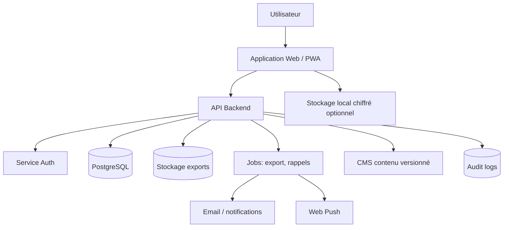

# Spécifications exhaustives — outil web « Je suis le centre de ma vie »

**Document cible :** cahier des charges fonctionnel et technique pour transformer le livret d’exercices « Je suis le centre de ma vie » en application web utilisable en ligne.  
**Version :** 1.0  
**Langue :** français  
**Périmètre :** application de journal thérapeutique guidé, auto-évaluations, exercices progressifs, suivi, rappels, export et sécurité psychologique.  
**Source de contenu :** livret PDF « Livret-Complet-Exercices-Je-suis-le-centre-de-ma-vie.pdf », 38 pages, Dr Versaevel / Thérapie « Rénover mon estime de soi ».  
**Avertissement :** ce document est une spécification produit et technique. Il ne constitue pas un avis médical, juridique ou réglementaire. Avant mise en ligne, faire valider le contenu, les droits d’utilisation, la conformité RGPD/HDS éventuelle, les seuils cliniques, les messages de sécurité et les parcours de crise par des professionnels compétents.

---

## 1. Vision générale

L’outil web doit convertir un livret papier de thérapie de l’estime de soi en expérience numérique progressive. L’utilisateur doit pouvoir :

1. comprendre le programme ;
2. compléter des questionnaires initiaux ;
3. recevoir des scores et des interprétations ;
4. réaliser les exercices module par module ;
5. conserver ses réponses dans un journal personnel ;
6. suivre son évolution ;
7. reprendre les exercices dans le temps ;
8. exporter ses données ;
9. recevoir des alertes non culpabilisantes lorsque le programme semble insuffisant ou inadapté ;
10. utiliser le programme en autonomie, ou avec un professionnel si un mode accompagnement est activé.

Le produit doit préserver l’esprit du livret : un **journal de bord personnel**, centré sur l’évolution de l’utilisateur, organisé en modules. La plateforme ne doit pas donner l’impression de « noter » ou « juger » l’utilisateur ; les scores servent à se repérer, à suivre l’évolution et à orienter vers de l’aide si nécessaire.

---

## 2. Principes fondateurs du produit

### 2.1. Principes thérapeutiques à préserver

- **Progressivité :** le programme suit un enchaînement : évaluation, compréhension, engagement, identification des croyances, diversification des leviers, connaissance de soi, bienveillance, affirmation des besoins/valeurs, relations.
- **Journalisation :** l’utilisateur écrit, relit, complète, affine.
- **Responsabilisation sans culpabilisation :** l’utilisateur identifie ses leviers d’action, sans se reprocher ses stratégies actuelles.
- **Sécurité psychologique :** le programme reconnaît ses limites, notamment en cas de dépression possible, anxiété sévère, idées suicidaires ou souffrance persistante.
- **Auto-compassion :** l’application doit encourager la bienveillance envers soi.
- **Confidentialité :** les réponses peuvent contenir des informations intimes, familiales, relationnelles, corporelles, émotionnelles et potentiellement médicales.

### 2.2. Principes numériques

- **Mobile first**, car l’utilisateur peut écrire au quotidien.
- **Sauvegarde automatique**, pour éviter la perte d’écrits personnels.
- **Utilisation possible sans compte** en mode local chiffré, si le modèle produit le permet.
- **Compte personnel optionnel** pour synchronisation multi-appareils.
- **Export personnel** en PDF, Markdown et JSON.
- **Accessibilité forte** : lisibilité, contraste, navigation clavier, lecteur d’écran, langage simple, mode faible stimulation.
- **Traçabilité du contenu** : chaque exercice, questionnaire et seuil doit être versionné.
- **Aucune publicité ni revente de données**.

---

## 3. Périmètre fonctionnel

### 3.1. MVP recommandé

Le MVP doit inclure :

- création de compte ou session locale ;
- consentement et avertissements ;
- parcours guidé en 9 modules ;
- questionnaires scorés : Rosenberg, dépression de Beck, anxiété de Beck, amour de soi, image de soi ;
- exercices d’écriture libres ;
- actions planifiées ;
- journal anti-téflon ;
- rappel quotidien/hebdomadaire ;
- tableau de bord de progression ;
- export PDF/Markdown ;
- suppression complète du compte ;
- mécanismes de sécurité en cas de score ou réponse à risque.

### 3.2. Fonctionnalités V1+ recommandées

- mode professionnel : partage volontaire avec psychologue/psychothérapeute ;
- mode PWA hors-ligne avec synchronisation différée ;
- visualisation de courbes d’évolution ;
- bibliothèque de ressources de crise et d’aide ;
- relances personnalisées ;
- reprise intelligente après interruption ;
- contenus audio optionnels pour consignes et encouragements ;
- assistant conversationnel très encadré, sans diagnostic, pour reformuler les réponses ou aider à clarifier une action ;
- CMS interne pour maintenir les modules et les questionnaires sans redéployer le code.

### 3.3. Hors périmètre initial

- diagnostic médical automatisé ;
- remplacement d’un thérapeute ;
- prescription de traitement ;
- notation publique, gamification compétitive ou partage social ;
- forum non modéré ;
- analyse automatique intrusive des écrits intimes ;
- notifications culpabilisantes ;
- revente, scoring publicitaire ou ciblage marketing basé sur les réponses.

---

## 4. Cartographie exhaustive du programme

### 4.1. Vue d’ensemble des modules

| Module | Objectif utilisateur | Types d’interaction | Sorties principales |
|---|---|---|---|
| Accueil | Comprendre le journal de bord, démarrer | lecture, consentement | session, consentement, date de début |
| Module 1 | Évaluer estime de soi, dépression, anxiété | questionnaires scorés | scores Rosenberg, Beck dépression, Beck anxiété, recommandations |
| Module 2 | Mesurer amour de soi et image de soi | questionnaires scorés + texte | scores /50, dimensions altérées, notes personnelles |
| Module 3 | Explorer les racines et s’engager | questions libres + contrat | souvenirs/ressentis, signature d’engagement |
| Module 4 | Identifier les croyances limitantes | réflexion guidée, « petits monstres », actions | liste de croyances, actions d’affaiblissement |
| Module 5 | Diversifier les leviers de valorisation externe | grille d’auto-positionnement, plan d’action, gratitude | leviers sous-utilisés, dépendances, journal gratitude |
| Module 6 | Se connaître réellement | listes, textes, tags | traits, valeurs, passions, aversions, forces, limites, besoins |
| Module 7 | Développer bienveillance et journal anti-téflon | écriture, journal quotidien/hebdo | messages à soi, journal positif, consolidation |
| Module 8 | Respecter besoins et valeurs avec assertivité | plan d’action, scripts CNV | besoins/valeurs prioritaires, obstacles, scripts de discussion |
| Module 9 | Choisir les relations favorables | cartographie relationnelle | personnes ressources, relations à distance, actions |
| Finalisation | Mesurer l’évolution et consolider | re-tests, bilan | score final, comparaison, plan de consolidation |

### 4.2. Règles de progression

- Par défaut, les modules sont débloqués dans l’ordre.
- L’utilisateur peut revenir en arrière à tout moment.
- Les modules 1 à 3 forment une phase d’évaluation/compréhension/engagement.
- Les modules 4 à 9 forment la phase active de rénovation de l’estime de soi.
- La finalisation n’est débloquée qu’après le module 9, mais les questionnaires peuvent être répétés manuellement.
- Les exercices facultatifs doivent être marqués comme tels, non masqués.
- Le système doit proposer des temps de pause après les exercices sensibles : enfance, échecs, corps, idées suicidaires, relations altérantes.

---

## 5. Spécification fonctionnelle détaillée par module

## 5.1. Accueil et onboarding

### Objectifs

- Présenter le programme comme un journal de bord.
- Expliquer les limites : auto-accompagnement, non-diagnostic, ne remplace pas un suivi médical.
- Obtenir un consentement explicite.
- Proposer un choix : mode local, compte synchronisé, compte accompagné.

### Écrans

1. **Écran de bienvenue**
   - titre du programme ;
   - durée indicative ;
   - organisation en modules ;
   - promesse : suivre l’évolution, réaliser les exercices, revenir sur ses réponses.

2. **Écran de sécurité**
   - mention : si l’utilisateur est en danger immédiat ou pense se faire du mal, contacter les urgences locales ou une ligne de crise ;
   - bouton « J’ai compris » ;
   - lien ressources.

3. **Écran confidentialité**
   - données stockées ;
   - finalité ;
   - droits ;
   - export/suppression ;
   - option de protection par code local.

4. **Création de session**
   - pseudo ;
   - email optionnel ;
   - mot de passe ou magic link ;
   - choix du fuseau horaire ;
   - autorisation notifications.

### Champs de données

- `user_id`
- `display_name`
- `birth_year` optionnel ; éviter la date complète sauf nécessité.
- `country` optionnel, utile pour ressources de crise.
- `timezone`
- `consent_version`
- `privacy_mode`: `local_only`, `cloud_sync`, `professional_shared`
- `emergency_resources_acknowledged_at`

### Critères d’acceptation

- Impossible de commencer sans consentement explicite.
- Les données sensibles ne sont pas collectées avant consentement.
- Le mode local indique clairement les limites de récupération en cas de perte d’appareil.

---

## 5.2. Module 1 — Évaluation initiale

### Objectif

Mesurer l’estime de soi initiale, vérifier si un épisode dépressif possible rend le programme inadapté temporairement, puis évaluer l’anxiété.

### Sous-parcours

1. Date de début du module.
2. Questionnaire d’estime de soi de Rosenberg.
3. Calcul et interprétation du score.
4. Questionnaire de dépression de Beck, version courte 13 rubriques dans le livret.
5. Calcul du score et alerte si score > 15.
6. Questionnaire d’anxiété de Beck, 21 items.
7. Calcul du score et interprétation.
8. Bilan module 1.

### Questionnaire Rosenberg

- 10 items.
- Choix : `Oui`, `Plutôt oui`, `Plutôt non`, `Non`.
- Score total : minimum 10, maximum 40.
- Items positifs : 1, 3, 4, 7, 10.
- Items inversés : 2, 5, 6, 8, 9.
- Interprétation :
  - `> 34` : estime haute et stable, facteur protecteur si perception stable ;
  - `31–34` : moyenne ;
  - `25–30` : faible ;
  - `< 25` : très abîmée ;
  - `< 31` : le programme est probablement bénéfique, sous réserve de ne pas être déprimé.

#### Items Rosenberg à encoder

| Code | Item | Barème |
|---|---|---|
| `rse_01` | Dans l’ensemble, je suis satisfait de moi. | Oui=4, Plutôt oui=3, Plutôt non=2, Non=1 |
| `rse_02` | Parfois je pense que je ne vaux rien. | Oui=1, Plutôt oui=2, Plutôt non=3, Non=4 |
| `rse_03` | Je pense que j’ai un certain nombre de bonnes qualités. | Oui=4, Plutôt oui=3, Plutôt non=2, Non=1 |
| `rse_04` | Je suis capable de faire les choses aussi bien que la plupart des gens. | Oui=4, Plutôt oui=3, Plutôt non=2, Non=1 |
| `rse_05` | Je sens qu’il n’y a pas grand-chose en moi dont je puisse être fier. | Oui=1, Plutôt oui=2, Plutôt non=3, Non=4 |
| `rse_06` | Parfois, je me sens réellement inutile. | Oui=1, Plutôt oui=2, Plutôt non=3, Non=4 |
| `rse_07` | Je pense que je suis quelqu’un de valable, au moins autant que les autres gens. | Oui=4, Plutôt oui=3, Plutôt non=2, Non=1 |
| `rse_08` | J’aimerais pouvoir avoir plus de respect pour moi-même. | Oui=1, Plutôt oui=2, Plutôt non=3, Non=4 |
| `rse_09` | Tout bien considéré, j’ai tendance à penser que je suis un(e) raté(e). | Oui=1, Plutôt oui=2, Plutôt non=3, Non=4 |
| `rse_10` | J’ai une opinion positive de moi-même. | Oui=4, Plutôt oui=3, Plutôt non=2, Non=1 |

### Questionnaire de dépression de Beck — version du livret

- 13 rubriques.
- Chaque rubrique propose 4 choix scorés 0, 1, 2, 3.
- Score total : minimum 0, maximum 39.
- Interprétation du livret : si score > 15, épisode dépressif possible, avis médical indispensable si non fait ; il est conseillé de ne pas suivre le programme avant que la dépression soit soignée.

#### Rubriques à encoder

| Code | Rubrique | Type | Score |
|---|---|---|---|
| `bdi_01` | Tristesse | choix unique 4 options | 0 à 3 |
| `bdi_02` | Courage / pessimisme | choix unique 4 options | 0 à 3 |
| `bdi_03` | Échec | choix unique 4 options | 0 à 3 |
| `bdi_04` | Satisfaction | choix unique 4 options | 0 à 3 |
| `bdi_05` | Culpabilité | choix unique 4 options | 0 à 3 |
| `bdi_06` | Déception envers soi | choix unique 4 options | 0 à 3 |
| `bdi_07` | Souffrance / idées de mort ou suicide | choix unique 4 options | 0 à 3 |
| `bdi_08` | Intérêt pour les autres | choix unique 4 options | 0 à 3 |
| `bdi_09` | Décision | choix unique 4 options | 0 à 3 |
| `bdi_10` | Esthétique / apparence | choix unique 4 options | 0 à 3 |
| `bdi_11` | Travail / effort | choix unique 4 options | 0 à 3 |
| `bdi_12` | Fatigue | choix unique 4 options | 0 à 3 |
| `bdi_13` | Appétit | choix unique 4 options | 0 à 3 |

#### Règles de sécurité spécifiques

- Si `bdi_07 >= 1`, afficher immédiatement un message de sécurité, sans attendre la fin du questionnaire.
- Si `bdi_07 >= 2`, afficher un message prioritaire indiquant de contacter immédiatement un service d’urgence ou une ligne de crise, et bloquer la progression vers les modules suivants tant que l’utilisateur n’a pas vu les ressources.
- Si `bdi_total > 15`, afficher un écran d’orientation : avis médical conseillé/indispensable selon formulation validée, possibilité de sauvegarder, pause recommandée.
- Le système ne doit jamais afficher « vous êtes dépressif » ; il doit afficher « votre score suggère qu’un avis médical est nécessaire ».
- Ne pas envoyer de notification contenant « suicide », « dépression », « score » en clair.

### Questionnaire d’anxiété de Beck

- 21 items.
- Période : les 7 derniers jours.
- Choix : `Pas du tout = 0`, `Un peu / pas trop dérangeant = 1`, `Modérément / déplaisant = 2`, `Beaucoup / très dérangeant = 3`.
- Score total : 0 à 63.
- Interprétation :
  - 8–15 : anxiété légère ;
  - 16–25 : anxiété modérée ;
  - > 26 : anxiété sévère et influence négative sur la qualité de vie ;
  - si score reste bien au-dessus de 26 en fin de programme, recommander un programme dédié stress/anxiété ou un accompagnement.

#### Items BAI à encoder

1. Sensations d’engourdissements ou de picotements
2. Bouffées de chaleur
3. « Jambes molles », tremblement dans les jambes
4. Incapacité à me détendre
5. Crainte que le pire ne survienne
6. Étourdissement ou vertiges, désorientation
7. Battements cardiaques marqués ou rapides
8. Manque d’assurance dans mes mouvements
9. Terrifié(e)
10. Nervosité
11. Sensation d’étouffement
12. Tremblements des mains
13. Tremblements et faiblesse du corps, chancelant(e)
14. Crainte de perdre le contrôle de soi
15. Respiration difficile
16. Peur de mourir
17. Sensation de peur, « avoir la frousse »
18. Indigestion ou malaise abdominal
19. Sensation de défaillance ou d’évanouissement
20. Rougissement du visage
21. Transpiration hors chaleur

### Écrans de résultat Module 1

- Score Rosenberg avec jauge non stigmatisante.
- Score dépression avec alerte si nécessaire.
- Score anxiété.
- Synthèse : « où j’en suis aujourd’hui ».
- CTA : continuer, mettre le programme en pause, exporter, contacter un professionnel.

### Critères d’acceptation

- Les scores se calculent en temps réel et sont vérifiés par tests unitaires.
- Les seuils sont éditables dans le CMS avec versioning.
- Les alertes de sécurité s’affichent sans stocker d’évènement sensible dans les analytics.
- Si l’utilisateur quitte pendant un questionnaire, la reprise conserve les réponses partielles.

---

## 5.3. Module 2 — Amour de soi et image de soi

### Objectif

Mesurer deux composantes de l’estime de soi : l’amour de soi et l’image de soi.

### Questionnaire « Bilan de l’Amour de soi »

- 10 items.
- Choix : `Non=0`, `Plutôt non=2`, `Plutôt oui=4`, `Oui=5`.
- Score total : 0 à 50.
- Interprétation : 40 ou plus = bon amour de soi.
- Les réponses `Non` ou `Plutôt non` indiquent une altération possible.

#### Items à encoder

1. Prendre soin de son apparence physique.
2. Prendre soin de sa santé.
3. Prendre le temps d’activités pour son bien et se ressourcer.
4. Se dire qu’on mérite d’être aimé(e).
5. Se dire qu’on mérite d’être heureux(se).
6. Savoir se préserver en disant « stop » ou « non ».
7. Savoir demander de l’aide et du soutien.
8. Se remettre assez rapidement d’une rupture amicale ou affective.
9. Apprécier les moments seul(e).
10. Faire le premier pas dans les relations amicales ou affectives.

### Questionnaire « Bilan de l’image de soi »

- 10 items.
- Items 1 à 7 : `Non=0`, `Plutôt non=2`, `Plutôt oui=4`, `Oui=5`.
- Items 8 à 10 inversés : `Non=5`, `Plutôt non=4`, `Plutôt oui=2`, `Oui=0`.
- Score total : 0 à 50.
- Interprétation : 40 ou plus = bonne image de soi.
- Altération possible : `Non` ou `Plutôt non` aux items 1–7, `Oui` ou `Plutôt oui` aux items 8–10.

#### Items à encoder

1. Bien se connaître : goûts, valeurs, besoins.
2. Se trouver quelqu’un de bien et s’accepter avec qualités et défauts.
3. Douter rarement de ses choix.
4. Bien réagir aux critiques et aux échecs.
5. Oser réaliser les projets en tête.
6. Persévérer face à une difficulté.
7. Affronter les personnes ou situations qui font peur.
8. Être très sensible au regard porté sur soi.
9. Se laisser fortement influencer.
10. Avoir très peur des situations où l’on doit se débrouiller seul(e).

### Écrits personnels

Après chaque questionnaire, l’utilisateur décrit :

- comment il perçoit la dimension chez lui ;
- si elle est altérée ;
- sur quoi il s’appuie pour penser cela.

### Critères d’acceptation

- Les items inversés sont visuellement signalés côté développeur, mais pas comme pièges côté utilisateur.
- L’interface explique simplement le score sans réduire la personne à un nombre.
- Les réponses faibles peuvent être réutilisées dans le module 4 pour identifier les croyances limitantes.

---

## 5.4. Module 3 — Explorer mes racines et contrat d’engagement

### Objectif

Explorer le vécu d’enfance perçu autour de l’affection, de la valorisation des compétences et de la surprotection, puis signer un contrat d’engagement dans la suite du programme.

### Exercices

1. **Qualité des nourritures affectives**
   - réaction des parents face au besoin d’attention et de soutien ;
   - impression d’avoir reçu assez d’affection ;
   - si non/plutôt non : deux épisodes ayant nourri ce ressenti.

2. **Qualité de la valorisation des compétences**
   - réaction des parents face à l’échec ;
   - exigence ou critique ;
   - impression d’avoir été encouragé(e) et valorisé(e) ;
   - si non/plutôt non : deux épisodes.

3. **Surprotection**
   - parents surprotecteurs ;
   - monde vu comme dangereux ;
   - si oui/plutôt oui : deux épisodes.

4. **Contrat d’engagement**
   - reconnaissance des difficultés ;
   - droit à l’amour et au respect ;
   - valeur personnelle ;
   - responsabilité d’identifier et affaiblir les croyances limitantes ;
   - actions de valorisation ;
   - connaissance et acceptation de soi ;
   - bienveillance ;
   - besoins/valeurs ;
   - relations favorables ;
   - signature.

### Spécifications UX

- Prévoir un bouton « faire une pause ».
- Prévoir une zone « je préfère ne pas répondre maintenant ».
- Autoriser des réponses différées.
- Afficher une note : les souvenirs et perceptions peuvent être complexes ; le but n’est pas d’accuser, mais de comprendre les racines.
- La signature peut être : case à cocher, prénom, dessin tactile, horodatage.

### Données

- `affection_response_text`
- `affection_received_choice`
- `affection_episodes[]`
- `competence_validation_text`
- `encouraged_choice`
- `encouragement_episodes[]`
- `overprotection_text`
- `overprotection_choice`
- `overprotection_episodes[]`
- `contract_signed_at`
- `contract_signature_type`
- `contract_signature_value_hash`

---

## 5.5. Module 4 — Repérer mes « petits monstres »

### Objectif

Identifier les croyances limitantes associées à des évitements ou comportements liés à une estime de soi altérée, leur donner un nom, comprendre comment elles sont nourries ou affaiblies, puis définir deux actions.

### Entrées réutilisées

- Réponses faibles au bilan amour de soi.
- Réponses faibles ou inversées au bilan image de soi.
- Éventuelles notes du module 3.

### Comportements sources proposés

- Apparence physique.
- Activités de ressourcement.
- Dire stop/non.
- Demander de l’aide.
- Faire le premier pas relationnel.
- Oser réaliser des projets.
- Persévérer.
- Affronter les personnes/situations qui font peur.

### Autres comportements de bonne estime de soi à proposer comme check-list

- Oser dire ce que je pense et ce que je veux.
- Oser dire quand je ne sais pas.
- Faire les choses que j’aime même si je suis seul(e).
- Dire « j’ai peur » ou « je suis malheureux(se) » sans se sentir rabaissé(e).
- Aimer les autres sans avoir besoin de les surveiller.
- Se donner le droit de décevoir ou de rater.
- Tirer les leçons de ses erreurs.
- Demander de l’aide sans se sentir inférieur(e).
- Se donner le droit de changer d’avis après réflexion.
- Faire preuve d’humour sur soi-même.
- Montrer son corps ou se mettre en maillot même s’il ne plaît pas.
- Soigner son apparence même sans correspondre à un idéal.
- S’accepter tel(le) que l’on est.

### Modèle « monstre »

Chaque monstre doit avoir :

- nom ;
- croyance limitante ;
- situations où il apparaît ;
- comportements qui le nourrissent ;
- comportements qui l’affaiblissent ;
- niveau d’intensité optionnel 0–10 ;
- actions associées ;
- bilan après action.

### Règles

- Maximum recommandé : 4 monstres.
- Deux actions minimum à choisir pour la semaine.
- Les actions doivent être petites, concrètes, datées.
- Après réalisation : description de ce qui s’est passé et du ressenti.
- Question finale : que faire pour chasser durablement les monstres ?

### Données

```json
{
  "monster_id": "uuid",
  "user_id": "uuid",
  "name": "Newton",
  "belief": "Je ne suis pas doué pour apprendre",
  "source_items": ["self_image_05", "self_image_06"],
  "feeds_when": "J’évite de commencer une formation",
  "weakens_when": "Je tente une petite étape et je demande de l’aide",
  "intensity": 7,
  "actions": [
    {
      "title": "Regarder 20 minutes de cours",
      "due_date": "2026-06-12",
      "status": "planned",
      "result_text": null,
      "feeling_text": null
    }
  ]
}
```

### Critères d’acceptation

- Le système suggère des pistes à partir des réponses précédentes, mais l’utilisateur garde le contrôle.
- Aucune croyance n’est imposée.
- Le langage de l’interface reste imagé et non pathologisant.

---

## 5.6. Module 5 — Arrosoir externe, leviers et gratitude

### Objectif

Aider l’utilisateur à diversifier les sources de valorisation externe, activer plusieurs leviers et repérer les dépendances à certains leviers.

### Grille des leviers

Chaque levier est évalué par :

- `Pas utilisé ou pas assez`
- `Utilisé modérément`
- `Dépendance`

#### Leviers à encoder

1. Séduire, rechercher une relation amoureuse ou amicale.
2. Utiliser la fanfaronnade, l’humour ou la provocation.
3. Être généreux, altruiste, empathique, aider autrui.
4. Être dans la complaisance.
5. Conformisme.
6. Anticonformisme.
7. Valoriser son image.
8. Performer dans une activité ou au travail.
9. Se valoriser par le biais d’un tiers.
10. Exprimer ses émotions et difficultés.
11. Exprimer ses remerciements et sa gratitude.
12. Se faire respecter.
13. Prendre des responsabilités.
14. Autre moyen personnalisé.

> Le livret parle de 12 leviers, tout en listant conformisme et anticonformisme séparément et un champ « autres moyens ». La spécification technique doit conserver ces deux éléments séparés pour éviter une perte d’information. Le libellé produit peut afficher « 12 familles de leviers + variantes ».

### Prompts associés aux leviers sous-utilisés

Pour chaque levier évalué `Pas utilisé ou pas assez`, proposer une réflexion :

- Comment séduire/charmer davantage dans les relations affectives ou amicales ?
- Comment attirer l’attention d’un groupe avec humour ou provocation adaptée ?
- Comment être plus à l’écoute, généreux(se), empathique ?
- Quand est-il préférable de ne pas tout dire ?
- Comment se sentir plus intégré(e) dans un groupe correspondant à soi ?
- Quels détails cultiver pour se sentir différent(e) et unique ?
- Comment améliorer l’image renvoyée ?
- Quel domaine investir pour être reconnu(e) compétent(e) ?
- Quel gagnant ou groupe soutenir ?
- Comment exprimer davantage ses émotions ?
- Comment exprimer plus de gratitude ?
- Comment se défendre lorsqu’on manque de respect ?
- Dans quel domaine prendre des responsabilités ou un rôle de leader ?

### Gestion des dépendances

- L’utilisateur liste les leviers avec dépendance.
- L’application rappelle que ces dépendances ont pu être une solution momentanée et ne doivent pas être culpabilisées.
- L’application propose de diversifier les leviers et de développer ensuite l’arrosoir interne.

### Exercice facultatif gratitude

- Durée : 15 jours.
- Chaque soir : noter 3 moments agréables.
- Pour chaque moment :
  - description ;
  - émotion ;
  - personne ayant contribué ;
  - remerciement effectué ou à faire ;
  - contribution personnelle.

### Données

- `lever_assessments[]`
- `dependency_levers[]`
- `underused_lever_ideas[]`
- `gratitude_entries[]`
- `gratitude_streak`

### UX

- Afficher les leviers en cartes.
- Permettre une vue « dépendances », « leviers modérés », « leviers à développer ».
- Rappels doux pour la gratitude pendant 15 jours.

---

## 5.7. Module 6 — Qui suis-je vraiment ?

### Objectif

Aider l’utilisateur à mieux se connaître : personnalité, rapport au corps, parcours de vie, valeurs, passions, aversions, compétences, limites et besoins.

### Parcours

1. Choisir au moins 10 traits de personnalité.
2. Optionnel : associer objets, symboles, personnages ou animaux à chaque trait.
3. Optionnel : demander à un proche de choisir 10 traits.
4. Décrire ce que l’exercice a appris.
5. Identifier deux parties du corps moins aimées et deux aimées.
6. Identifier quatre réussites.
7. Identifier deux échecs marquants.
8. Identifier deux événements de vie blessants.
9. Choisir 5 à 10 valeurs.
10. Explorer passions.
11. Explorer aversions.
12. Explorer compétences et forces.
13. Explorer limites, incompétences et peurs.
14. Identifier besoins.

### Liste de traits de personnalité

La liste doit être encodée comme tags sélectionnables, avec possibilité d’ajout libre. Les traits peuvent être des forces ou faiblesses selon le contexte.

- actif/dynamique/énergique
- généreux/serviable
- adaptable/souple
- prudent
- honnête/sincère/franc
- aimable/agréable
- bienveillant
- discret
- impartial/objectif
- ambitieux
- éloquent
- rationnel/réaliste
- impatient
- analytique
- impulsif
- réactif
- anxieux/inquiet
- prévoyant
- vigilant
- distant/froid
- indécis
- assidu/consciencieux
- indépendant
- réservé/timide/introverti
- astucieux/inventif
- inflexible/ferme
- attentif/à l’écoute
- distrait/étourdi
- intuitif
- influençable/suiveur
- audacieux
- responsable
- instable
- autonome
- esthète
- dominant/autoritaire
- spirituel
- autoritaire/sévère/strict
- joueur
- rigide/têtu
- bavard
- lent
- communicatif/sociable
- drôle
- logique
- calculateur
- loyal/fiable
- séducteur/charmeur
- calme
- lucide/perspicace
- capricieux
- efficace/rapide
- meneur/leader
- colérique
- méthodique
- sensible/émotif
- combatif
- naturel/spontané
- conciliant
- affectueux
- négociateur
- confiant/sûr de soi
- nonchalant/désinvolte
- sérieux
- conflictuel
- observateur
- confus/brouillon/dispersé
- endurant/résistant
- optimiste
- convaincant/persuasif
- respectueux/poli
- solitaire
- ordonné/organisé
- coopératif/solidaire
- aidant/généreux
- souriant
- courageux/téméraire
- original/atypique
- créatif/imaginatif
- immature
- crédule/naïf
- passionné
- critique
- susceptible
- pédagogue
- curieux
- perfectionniste
- entreprenant
- décidé/déterminé
- persévérant/tenace
- pessimiste
- synthétique
- désordonné
- pondéré/réfléchi
- détendu/apaisé/zen
- d’humeur égale
- pratique/pragmatique
- dévoué/volontaire
- précis/rigoureux
- modeste
- diplomate
- discipliné
- gai/heureux
- extraverti/expressif
- tolérant
- rebelle/indomptable
- juste
- aimant apprendre pour soi
- rêveur

### Liste de valeurs

La liste doit être encodée comme tags sélectionnables, avec ajout libre et regroupement possible par familles.

- acceptation
- accomplissement
- adaptabilité
- ouverture
- amour/passion
- altruisme
- amusement/jouer
- ambition
- amitié
- amour donné
- apprendre/savoir
- s’assumer
- autorité
- amour reçu
- authenticité
- discipline/ordre
- autonomie
- aventure/risque
- beauté
- bien-être
- bienveillance
- bonheur
- bravoure
- calme
- chaleur
- charme
- changement
- clarté
- cohérence
- solidarité
- compassion
- compétence
- compréhension
- concentration
- confiance en soi
- confort
- courage
- contrôle
- conviction
- coopération
- cordialité
- conformisme
- créativité
- croissance
- culture
- curiosité
- développement personnel
- défi
- désir
- détermination
- devoir
- sacrifice
- discrétion
- disponibilité
- diversité
- droiture
- dynamisme
- éducation
- efficacité
- égalité
- empathie
- endurance
- encouragement/valorisation
- engagement
- enthousiasme
- équité/justice
- espoir
- esthétique
- expertise
- expressivité
- extravagance
- famille
- fermeté
- fiabilité
- excellence
- exigence
- fidélité
- flexibilité/souplesse
- force
- forme physique
- franchise
- gaieté
- générosité
- gratitude
- harmonie
- héroïsme
- humilité
- humour
- honnêteté
- indépendance
- intelligence
- jeunesse
- joie/gaieté
- justice
- liberté
- loyauté
- maîtrise de soi
- médiation
- nature/écologie
- non-conformisme
- ouverture d’esprit
- paix dans le monde
- partage
- performance
- plaisir
- politesse
- paix intérieure
- raffinement/finesse
- se réaliser
- réflexion
- pardon
- respect
- retenue/modération
- responsabilité
- relaxation/détente
- stabilité
- sacré
- sagesse
- richesse
- rationalité
- sensibilité
- sensualité
- sang-froid
- santé
- simplicité
- sociabilité
- sérénité
- sécurité
- spiritualité
- succès/réussite
- solitude
- synergie
- tradition
- surprise/découverte
- sympathie
- travail
- variété
- tolérance
- transmission
- vitalité
- volonté
- vérité
- vigilance
- poursuite d’un but
- pouvoir
- exemplarité

### UX recommandée

- Sélecteur de tags avec recherche.
- Limite douce : « choisissez au moins 10 traits » ; pas de blocage si l’exercice est émotionnellement difficile.
- Possibilité de marquer un trait comme `force`, `fragilité`, `les deux`, `selon contexte`.
- Pour les valeurs : tri par importance et sélection finale de 5 à 10 valeurs.
- Pour le rapport au corps : mode discret et avertissement de sensibilité.
- Pour les événements blessants : bouton pause et lien ressources.

### Données

- `personality_traits[]`
- `trait_symbols[]`
- `external_traits_feedback[]`
- `body_liked_parts[]`
- `body_disliked_parts[]`
- `successes[]`
- `failures[]`
- `wounding_life_events[]`
- `values[]`
- `passions[]`
- `aversions[]`
- `strengths[]`
- `limits[]`
- `needs[]`

---

## 5.8. Module 7 — Bienveillance et anti-téflon

### Objectif

Apprendre à se parler comme à un ami, puis entraîner le cerveau à repérer les expériences positives pour consolider l’estime de soi.

### Exercice 1 : parler comme à un ami

Entrées reprises du module 6 :

- parties du corps peu aimées ;
- échecs marquants ;
- événements de vie blessants ;
- limites et incompétences.

Interaction : l’utilisateur imagine qu’un ami lui confie ces réponses, puis écrit ce qu’il lui dirait pour être réconfortant, soutenant et encourageant.

### Exercice 2 : journal anti-téflon

Phase 1 : chaque soir pendant une semaine, compléter :

- Aujourd’hui, j’ai pu…
- Aujourd’hui, j’ai su…
- Aujourd’hui, j’ai réussi à…
- Aujourd’hui, je peux me féliciter de…
- Aujourd’hui, je peux être reconnaissant envers…
- Aujourd’hui, je peux avoir de la gratitude pour…
- Aujourd’hui, je regrette… mais j’ai appris que…

Phase 2 : une fois par semaine pendant 3 mois.

### Exercice facultatif : anti-téflon enfance

- Reprendre les perceptions du module 3.
- Rechercher les moments d’attention, affection, encouragement, valorisation et sécurité dans l’enfance.

### UX

- Journal simple, rapide, agréable à remplir.
- Rappels configurables : heure du soir, fréquence, pause.
- Streak non culpabilisant : ne pas afficher « échec » si jour manqué.
- Visualisation : calendrier avec points remplis, pas de classement.

### Critères d’acceptation

- L’utilisateur peut créer plusieurs entrées par jour.
- Les entrées peuvent être verrouillées par code local.
- Les notifications ne contiennent pas de contenu sensible.

---

## 5.9. Module 8 — Respecter mes besoins et incarner mes valeurs

### Objectif

Passer de la connaissance de soi à l’action : répondre davantage à ses besoins, incarner ses valeurs et s’affirmer avec assertivité grâce à une structure proche de la communication non violente.

### Partie 1 : besoins

- Reprendre les besoins du module 6.
- Demander si l’utilisateur répond globalement à ses besoins actuellement.
- Identifier ce qui empêche de répondre aux besoins : personnes, situations, contraintes, croyances.
- Définir 2 à 3 actions pour répondre davantage aux besoins.
- Si une action implique une personne : écrire un script assertif.

### Partie 2 : valeurs

- Reprendre les 5 à 10 valeurs du module 6.
- Choisir les 3 plus importantes.
- Définir concrètement ce qu’elles signifient dans les domaines affectif, familial, scolaire ou professionnel.
- Évaluer si elles sont incarnées actuellement.
- Identifier les obstacles.
- Définir 2 à 3 actions.
- Écrire un script assertif si nécessaire.

### Structure de script assertif

1. Inviter à la discussion.
2. Décrire les faits.
3. Exprimer le ressenti.
4. Nommer le besoin contrarié ou la valeur contrariée.
5. Écouter l’autre avec empathie.

### Sécurité relationnelle

- L’application doit rappeler que l’utilisateur ne doit pas se mettre en danger.
- En cas de violence, domination, menace ou tension excessive : proposer de reculer, demander de l’aide, consulter des ressources.
- Si plusieurs tentatives de discussion n’aboutissent pas et augmentent la tension : suggérer la prise de distance plutôt que l’insistance.

### Données

- `needs_review_text`
- `needs_obstacles[]`
- `needs_actions[]`
- `values_top3[]`
- `values_concrete_meaning[]`
- `values_obstacles[]`
- `values_actions[]`
- `assertive_scripts[]`

---

## 5.10. Module 9 — Relations favorables et relations altérantes

### Objectif

Identifier les personnes ou groupes qui favorisent l’estime de soi, puis ceux qui l’altèrent, afin de nourrir les relations précieuses et de prendre de la distance avec les relations délétères.

### Exercice 1 : personnes favorisant l’estime de soi

Critères proposés : personnes aimantes, affectueuses, encourageantes, généreuses, bienveillantes, empathiques, compréhensives, avec qui les stratégies de rénovation fonctionnent.

Données :

- personnes ou groupes ;
- type de relation ;
- ce qu’elles apportent ;
- comment nourrir la relation dans les semaines à venir ;
- actions de gratitude/générosité.

### Exercice 2 : personnes altérant l’estime de soi

Critères proposés : absence de retour positif aux leviers, freins aux besoins/valeurs, personnes froides, critiques, égoïstes, jugeantes, non compréhensives.

Données :

- personnes ou groupes ;
- comportements observés ;
- effet sur l’estime de soi ;
- niveau de danger ou tension ;
- tentative d’assertivité possible ;
- distance à prendre ;
- action dans les semaines à venir.

### UX et confidentialité

- Encourager l’utilisation d’initiales ou surnoms.
- Éviter de collecter des données identifiantes de tiers non nécessaires.
- Si mode professionnel partagé : masquer par défaut les noms de tiers, sauf consentement de l’utilisateur.

---

## 5.11. Finalisation

### Objectif

Faire le point sur l’évolution, consolider l’exercice anti-téflon et réorienter si nécessaire.

### Étapes

1. Repasser le questionnaire Rosenberg.
2. Comparer score final et score initial.
3. Répondre : « Mon score a-t-il augmenté ? ».
4. Répondre : « Au-delà du score, qu’est-ce que le programme m’a appris ? Quels changements ai-je constatés ? ».
5. Continuer l’exercice anti-téflon plusieurs semaines.
6. Si la souffrance liée à l’estime de soi persiste malgré les efforts : suggérer de se rapprocher d’un psychologue ou psychothérapeute.
7. Repasser l’inventaire d’anxiété de Beck.
8. Si anxiété sévère : recommander un programme dédié stress/anxiété ou un accompagnement.

### Tableau d’évolution

| Indicateur | Début | Fin | Variation | Commentaire |
|---|---:|---:|---:|---|
| Rosenberg | score initial | score final | final - initial | interprétation |
| Anxiété Beck | score initial | score final | final - initial | interprétation |
| Modules complétés | n/a | nombre | n/a | progression |
| Journaux anti-téflon | n/a | nombre | n/a | consolidation |
| Actions réalisées | n/a | nombre | n/a | capacité d’action |

---

# 6. Modèle de contenu technique

## 6.1. Types de blocs de contenu

L’ensemble du programme doit être encodé dans un modèle de contenu versionné. Éviter de coder les questionnaires directement dans les composants React.

| Type | Usage | Champs essentiels |
|---|---|---|
| `lesson_text` | contenu pédagogique court | `markdown`, `estimated_reading_time` |
| `single_choice_scored` | questionnaire avec score | `question`, `options[{label,value,score}]` |
| `single_choice` | choix non scoré | `question`, `options[]` |
| `multi_select` | traits, valeurs | `options[]`, `min`, `max`, `allow_custom` |
| `textarea` | réflexion libre | `prompt`, `min_length`, `sensitive_level` |
| `list_builder` | listes d’épisodes/actions/personnes | `item_schema`, `min_items`, `max_items` |
| `action_plan` | action datée | `title`, `due_date`, `status`, `reflection` |
| `journal_entry` | journal quotidien | `prompts[]`, `date`, `mood_optional` |
| `signature` | contrat | `signature_type`, `value_hash`, `signed_at` |
| `score_result` | écran de score | `scale_id`, `thresholds`, `messages` |
| `safety_notice` | alerte | `severity`, `message`, `resources`, `requires_ack` |
| `relationship_card` | module 9 | `alias`, `category`, `impact`, `actions` |

## 6.2. Exemple de définition JSON d’un questionnaire

```json
{
  "scale_id": "rosenberg_self_esteem_v1",
  "title": "Questionnaire d’estime de soi",
  "version": "1.0.0",
  "scoring": {
    "type": "sum",
    "min": 10,
    "max": 40,
    "thresholds": [
      { "id": "very_low", "condition": "score < 25" },
      { "id": "low", "condition": "score >= 25 && score <= 30" },
      { "id": "average", "condition": "score >= 31 && score <= 34" },
      { "id": "high", "condition": "score > 34" }
    ]
  },
  "items": [
    {
      "id": "rse_01",
      "text": "Dans l’ensemble, je suis satisfait de moi.",
      "type": "single_choice_scored",
      "options": [
        { "label": "Oui", "value": "yes", "score": 4 },
        { "label": "Plutôt oui", "value": "rather_yes", "score": 3 },
        { "label": "Plutôt non", "value": "rather_no", "score": 2 },
        { "label": "Non", "value": "no", "score": 1 }
      ]
    }
  ]
}
```

## 6.3. Versioning de contenu

Chaque questionnaire et module doit posséder :

- `content_version` sémantique ;
- `source_reference` ;
- `published_at` ;
- `deprecated_at` optionnel ;
- `clinical_reviewed_by` optionnel ;
- `legal_reviewed_by` optionnel ;
- `license_status`: `unknown`, `internal_use`, `permission_obtained`, `replace_required` ;
- `change_log`.

Si une version de questionnaire change, les anciens scores doivent rester liés à l’ancienne version pour conserver l’historique.

---

# 7. Algorithmes de scoring

## 7.1. Pseudocode générique

```ts
type Answer = { itemId: string; value: string; score?: number };
type ScaleDefinition = {
  id: string;
  min: number;
  max: number;
  items: Array<{
    id: string;
    required: boolean;
    options: Array<{ value: string; score: number }>;
  }>;
};

function calculateSumScore(scale: ScaleDefinition, answers: Answer[]) {
  const answerByItem = new Map(answers.map(a => [a.itemId, a]));
  let total = 0;
  const missing: string[] = [];

  for (const item of scale.items) {
    const answer = answerByItem.get(item.id);
    if (!answer) {
      if (item.required) missing.push(item.id);
      continue;
    }
    const option = item.options.find(o => o.value === answer.value);
    if (!option) throw new Error(`Invalid answer for ${item.id}`);
    total += option.score;
  }

  return {
    total,
    complete: missing.length === 0,
    missing
  };
}
```

## 7.2. Rosenberg

```ts
function interpretRosenberg(score: number) {
  if (score > 34) return "high";
  if (score >= 31 && score <= 34) return "average";
  if (score >= 25 && score <= 30) return "low";
  return "very_low";
}
```

## 7.3. Dépression de Beck — version courte du livret

```ts
function interpretBeckDepression13(score: number) {
  return score > 15 ? "medical_advice_recommended" : "no_threshold_alert";
}

function detectSelfHarmRisk(bdi07Score: number) {
  if (bdi07Score >= 2) return "urgent";
  if (bdi07Score === 1) return "elevated";
  return "none";
}
```

## 7.4. Anxiété de Beck

```ts
function interpretBeckAnxiety(score: number) {
  if (score > 26) return "severe";
  if (score >= 16) return "moderate";
  if (score >= 8) return "mild";
  return "minimal_or_unspecified";
}
```

## 7.5. Amour de soi

```ts
function interpretSelfLove(score: number) {
  return score >= 40 ? "good_self_love" : "possible_alteration";
}
```

## 7.6. Image de soi

```ts
function interpretSelfImage(score: number) {
  return score >= 40 ? "good_self_image" : "possible_alteration";
}
```

## 7.7. Évolution finale

```ts
function compareScores(initial: number, final: number) {
  const delta = final - initial;
  return {
    delta,
    improved: delta > 0,
    stable: delta === 0,
    decreased: delta < 0
  };
}
```

---

# 8. Architecture produit

## 8.1. Diagramme logique



## 8.2. Stack recommandée

### Frontend

- React ou Next.js avec TypeScript.
- Formulaires : React Hook Form ou équivalent.
- Validation : Zod, Valibot ou équivalent.
- UI accessible : composants Radix UI, Ariakit ou composants internes testés.
- PWA : service worker, stockage IndexedDB chiffré.
- État local : Zustand, Redux Toolkit ou TanStack Query selon complexité.
- Graphiques : librairie accessible, ou SVG maison pour courbes simples.
- Markdown : rendu sécurisé avec sanitizer.

### Backend

- Node.js avec NestJS/Fastify, ou Python FastAPI.
- PostgreSQL pour données relationnelles et JSONB.
- Redis pour rate limiting, sessions courtes, files de jobs.
- Stockage objet compatible S3 pour exports temporaires.
- Worker séparé pour PDF/Markdown export et rappels.
- API REST versionnée, éventuellement GraphQL pour l’interface professionnelle.

### Infrastructure

- Hébergement UE recommandé.
- Option hébergeur HDS si la qualification réglementaire l’exige.
- Docker pour tous les services.
- CI/CD avec tests automatisés.
- Secrets dans vault managé.
- Observabilité : logs structurés, métriques, traces, alertes.

### Architecture alternative très confidentielle

Pour un outil destiné à minimiser les données serveur :

- application PWA statique ;
- contenu embarqué versionné ;
- données chiffrées côté client ;
- synchronisation optionnelle via coffre chiffré ;
- serveur ne voit pas les réponses en clair ;
- export local.

Cette option réduit les risques mais complique : récupération de compte, partage professionnel, recherche plein texte, rappels avancés.

---

# 9. Modèle de données détaillé

## 9.1. Entités principales

### User

- identité minimale ;
- préférences ;
- statut consentement ;
- mode confidentialité ;
- dates de création/suppression.

### ProgramEnrollment

- utilisateur inscrit à une version du programme ;
- progression ;
- date de début/fin ;
- statut pause/suspendu/terminé.

### ModuleProgress

- module ;
- statut ;
- date de début ;
- date de completion ;
- pourcentage ;
- dernière étape ouverte.

### ExerciseResponse

- réponse à un bloc de contenu ;
- version du contenu ;
- payload chiffrable ;
- horodatage ;
- statut brouillon/final.

### Score

- scale_id ;
- version ;
- total ;
- interprétation ;
- complétude ;
- réponses source ;
- horodatage.

### JournalEntry

- type : gratitude, anti-teflon, libre ;
- date ;
- prompts ;
- texte ;
- tags émotionnels optionnels.

### ActionPlan

- module source ;
- titre ;
- description ;
- date cible ;
- statut ;
- résultat ;
- ressenti.

### RelationshipEntry

- alias de personne/groupe ;
- type : favorable ou altérant ;
- effet ;
- actions ;
- niveau de sécurité.

### SafetyEvent

- type d’évènement ;
- sévérité ;
- action affichée ;
- accusé de lecture ;
- ne doit jamais contenir le texte libre intime de l’utilisateur.

### ExportJob

- format ;
- statut ;
- URL signée temporaire ;
- expiration ;
- paramètres d’inclusion.

## 9.2. Schéma SQL indicatif

```sql
CREATE TABLE users (
  id UUID PRIMARY KEY DEFAULT gen_random_uuid(),
  email CITEXT UNIQUE,
  display_name TEXT,
  password_hash TEXT,
  timezone TEXT NOT NULL DEFAULT 'Europe/Paris',
  locale TEXT NOT NULL DEFAULT 'fr-FR',
  privacy_mode TEXT NOT NULL CHECK (privacy_mode IN ('local_only','cloud_sync','professional_shared')),
  created_at TIMESTAMPTZ NOT NULL DEFAULT now(),
  updated_at TIMESTAMPTZ NOT NULL DEFAULT now(),
  deleted_at TIMESTAMPTZ
);

CREATE TABLE consents (
  id UUID PRIMARY KEY DEFAULT gen_random_uuid(),
  user_id UUID NOT NULL REFERENCES users(id) ON DELETE CASCADE,
  consent_version TEXT NOT NULL,
  accepted_at TIMESTAMPTZ NOT NULL DEFAULT now(),
  ip_hash TEXT,
  user_agent_hash TEXT
);

CREATE TABLE content_versions (
  id UUID PRIMARY KEY DEFAULT gen_random_uuid(),
  content_key TEXT NOT NULL,
  version TEXT NOT NULL,
  title TEXT NOT NULL,
  content_json JSONB NOT NULL,
  source_reference TEXT,
  license_status TEXT NOT NULL DEFAULT 'unknown',
  clinical_review_status TEXT NOT NULL DEFAULT 'pending',
  legal_review_status TEXT NOT NULL DEFAULT 'pending',
  published_at TIMESTAMPTZ,
  deprecated_at TIMESTAMPTZ,
  created_at TIMESTAMPTZ NOT NULL DEFAULT now(),
  UNIQUE(content_key, version)
);

CREATE TABLE program_enrollments (
  id UUID PRIMARY KEY DEFAULT gen_random_uuid(),
  user_id UUID NOT NULL REFERENCES users(id) ON DELETE CASCADE,
  program_key TEXT NOT NULL,
  content_version_id UUID NOT NULL REFERENCES content_versions(id),
  status TEXT NOT NULL CHECK (status IN ('active','paused','suspended','completed','abandoned')),
  started_at TIMESTAMPTZ NOT NULL DEFAULT now(),
  completed_at TIMESTAMPTZ,
  last_opened_at TIMESTAMPTZ
);

CREATE TABLE module_progress (
  id UUID PRIMARY KEY DEFAULT gen_random_uuid(),
  enrollment_id UUID NOT NULL REFERENCES program_enrollments(id) ON DELETE CASCADE,
  module_key TEXT NOT NULL,
  status TEXT NOT NULL CHECK (status IN ('locked','available','in_progress','completed','skipped')),
  progress_percent NUMERIC(5,2) NOT NULL DEFAULT 0,
  started_at TIMESTAMPTZ,
  completed_at TIMESTAMPTZ,
  last_step_key TEXT,
  UNIQUE(enrollment_id, module_key)
);

CREATE TABLE exercise_responses (
  id UUID PRIMARY KEY DEFAULT gen_random_uuid(),
  enrollment_id UUID NOT NULL REFERENCES program_enrollments(id) ON DELETE CASCADE,
  user_id UUID NOT NULL REFERENCES users(id) ON DELETE CASCADE,
  module_key TEXT NOT NULL,
  exercise_key TEXT NOT NULL,
  block_key TEXT NOT NULL,
  content_version TEXT NOT NULL,
  response_payload JSONB NOT NULL,
  is_encrypted BOOLEAN NOT NULL DEFAULT false,
  status TEXT NOT NULL CHECK (status IN ('draft','submitted','archived')) DEFAULT 'draft',
  created_at TIMESTAMPTZ NOT NULL DEFAULT now(),
  updated_at TIMESTAMPTZ NOT NULL DEFAULT now(),
  submitted_at TIMESTAMPTZ
);

CREATE INDEX idx_exercise_responses_user_module
ON exercise_responses(user_id, module_key, exercise_key);

CREATE TABLE scores (
  id UUID PRIMARY KEY DEFAULT gen_random_uuid(),
  enrollment_id UUID NOT NULL REFERENCES program_enrollments(id) ON DELETE CASCADE,
  user_id UUID NOT NULL REFERENCES users(id) ON DELETE CASCADE,
  scale_id TEXT NOT NULL,
  scale_version TEXT NOT NULL,
  phase TEXT NOT NULL CHECK (phase IN ('initial','repeat','final')),
  total_score NUMERIC(8,2) NOT NULL,
  min_score NUMERIC(8,2) NOT NULL,
  max_score NUMERIC(8,2) NOT NULL,
  interpretation_key TEXT NOT NULL,
  complete BOOLEAN NOT NULL DEFAULT true,
  missing_items TEXT[] DEFAULT '{}',
  source_response_ids UUID[] NOT NULL,
  created_at TIMESTAMPTZ NOT NULL DEFAULT now()
);

CREATE TABLE journal_entries (
  id UUID PRIMARY KEY DEFAULT gen_random_uuid(),
  user_id UUID NOT NULL REFERENCES users(id) ON DELETE CASCADE,
  enrollment_id UUID REFERENCES program_enrollments(id) ON DELETE CASCADE,
  journal_type TEXT NOT NULL CHECK (journal_type IN ('gratitude','anti_teflon','childhood_anti_teflon','free')),
  entry_date DATE NOT NULL,
  payload JSONB NOT NULL,
  is_encrypted BOOLEAN NOT NULL DEFAULT true,
  created_at TIMESTAMPTZ NOT NULL DEFAULT now(),
  updated_at TIMESTAMPTZ NOT NULL DEFAULT now()
);

CREATE INDEX idx_journal_user_date ON journal_entries(user_id, entry_date DESC);

CREATE TABLE action_plans (
  id UUID PRIMARY KEY DEFAULT gen_random_uuid(),
  user_id UUID NOT NULL REFERENCES users(id) ON DELETE CASCADE,
  enrollment_id UUID REFERENCES program_enrollments(id) ON DELETE CASCADE,
  source_module_key TEXT NOT NULL,
  title TEXT NOT NULL,
  description TEXT,
  due_date DATE,
  status TEXT NOT NULL CHECK (status IN ('planned','done','postponed','cancelled')) DEFAULT 'planned',
  result_text TEXT,
  feeling_text TEXT,
  created_at TIMESTAMPTZ NOT NULL DEFAULT now(),
  updated_at TIMESTAMPTZ NOT NULL DEFAULT now()
);

CREATE TABLE relationship_entries (
  id UUID PRIMARY KEY DEFAULT gen_random_uuid(),
  user_id UUID NOT NULL REFERENCES users(id) ON DELETE CASCADE,
  enrollment_id UUID REFERENCES program_enrollments(id) ON DELETE CASCADE,
  alias TEXT NOT NULL,
  relation_context TEXT,
  impact_type TEXT NOT NULL CHECK (impact_type IN ('supports_self_esteem','harms_self_esteem')),
  impact_description TEXT,
  planned_action TEXT,
  safety_level TEXT CHECK (safety_level IN ('unknown','safe','tense','dangerous')) DEFAULT 'unknown',
  created_at TIMESTAMPTZ NOT NULL DEFAULT now(),
  updated_at TIMESTAMPTZ NOT NULL DEFAULT now()
);

CREATE TABLE safety_events (
  id UUID PRIMARY KEY DEFAULT gen_random_uuid(),
  user_id UUID NOT NULL REFERENCES users(id) ON DELETE CASCADE,
  enrollment_id UUID REFERENCES program_enrollments(id) ON DELETE SET NULL,
  event_type TEXT NOT NULL,
  severity TEXT NOT NULL CHECK (severity IN ('info','warning','high','urgent')),
  source_scale_id TEXT,
  source_item_id TEXT,
  score_snapshot JSONB,
  message_key TEXT NOT NULL,
  acknowledged_at TIMESTAMPTZ,
  created_at TIMESTAMPTZ NOT NULL DEFAULT now()
);

CREATE TABLE export_jobs (
  id UUID PRIMARY KEY DEFAULT gen_random_uuid(),
  user_id UUID NOT NULL REFERENCES users(id) ON DELETE CASCADE,
  enrollment_id UUID REFERENCES program_enrollments(id) ON DELETE CASCADE,
  format TEXT NOT NULL CHECK (format IN ('pdf','markdown','json')),
  status TEXT NOT NULL CHECK (status IN ('queued','processing','ready','failed','expired')),
  include_sensitive BOOLEAN NOT NULL DEFAULT true,
  object_key TEXT,
  download_expires_at TIMESTAMPTZ,
  created_at TIMESTAMPTZ NOT NULL DEFAULT now(),
  completed_at TIMESTAMPTZ
);
```

## 9.3. Chiffrement recommandé

- TLS obligatoire.
- Chiffrement au repos côté base ou disque.
- Chiffrement applicatif des champs les plus intimes : textes libres, journaux, relations, événements de vie.
- Clés gérées par KMS.
- Rotation des clés.
- Ne jamais indexer en clair les textes libres sensibles.
- Pour recherche locale : index côté client si mode chiffré.

## 9.4. Données à éviter

- Date de naissance complète si inutile.
- Adresse postale.
- Noms complets de tiers.
- Données de santé non nécessaires.
- Transcriptions brutes dans les logs.
- Scores dans les outils analytics externes.

---

# 10. API détaillée

## 10.1. Principes

- API REST JSON versionnée : `/api/v1`.
- Authentification par session sécurisée ou JWT court + refresh token sécurisé.
- Idempotence pour sauvegardes de réponses.
- Validation stricte côté serveur.
- Ne jamais exposer un contenu d’un autre utilisateur.
- Tous les endpoints sensibles nécessitent rate limiting.

## 10.2. Authentification

### `POST /api/v1/auth/register`

```json
{
  "email": "user@example.com",
  "password": "motdepassefort",
  "displayName": "Camille",
  "timezone": "Europe/Paris",
  "privacyMode": "cloud_sync"
}
```

### `POST /api/v1/auth/login`

```json
{
  "email": "user@example.com",
  "password": "motdepassefort"
}
```

### `POST /api/v1/auth/logout`

Supprime session/refresh token.

### `POST /api/v1/auth/delete-account`

Suppression ou anonymisation selon politique validée. Doit demander confirmation forte.

## 10.3. Consentements

### `GET /api/v1/consents/current`

Retourne la version actuelle.

### `POST /api/v1/consents/accept`

```json
{
  "consentVersion": "2026-06-privacy-v1",
  "accepted": true
}
```

## 10.4. Programme et modules

### `POST /api/v1/programs/enroll`

```json
{
  "programKey": "je_suis_le_centre_de_ma_vie",
  "contentVersion": "1.0.0"
}
```

### `GET /api/v1/programs/current`

Retour : progression globale, module courant, alertes actives.

### `GET /api/v1/modules`

Retour : liste des modules disponibles, statuts, pourcentage.

### `GET /api/v1/modules/{moduleKey}`

Retour : contenu versionné du module, blocs, réponses existantes.

## 10.5. Réponses

### `PUT /api/v1/responses/{blockKey}`

Sauvegarde idempotente.

```json
{
  "enrollmentId": "uuid",
  "moduleKey": "module_01",
  "exerciseKey": "rosenberg_initial",
  "contentVersion": "1.0.0",
  "status": "draft",
  "responsePayload": {
    "value": "rather_yes"
  }
}
```

### `POST /api/v1/responses/submit-exercise`

```json
{
  "enrollmentId": "uuid",
  "moduleKey": "module_01",
  "exerciseKey": "rosenberg_initial"
}
```

Retour : scores calculés, événements de sécurité éventuels, prochaine étape.

## 10.6. Scores

### `POST /api/v1/scores/calculate`

```json
{
  "enrollmentId": "uuid",
  "scaleId": "rosenberg_self_esteem_v1",
  "phase": "initial"
}
```

### Réponse

```json
{
  "scaleId": "rosenberg_self_esteem_v1",
  "totalScore": 28,
  "minScore": 10,
  "maxScore": 40,
  "interpretationKey": "low",
  "complete": true,
  "message": "Votre score se situe dans une zone d’estime de soi faible. Le programme peut vous être bénéfique si votre état actuel vous permet de le suivre."
}
```

## 10.7. Journaux

### `POST /api/v1/journal-entries`

```json
{
  "journalType": "anti_teflon",
  "entryDate": "2026-06-06",
  "payload": {
    "today_i_could": "...",
    "today_i_knew": "...",
    "today_i_succeeded": "...",
    "congratulate": "...",
    "recognize_person": "...",
    "gratitude": "...",
    "regret_and_learning": "..."
  }
}
```

### `GET /api/v1/journal-entries?type=anti_teflon&from=2026-06-01&to=2026-06-30`

Retour pagination.

## 10.8. Actions

### `POST /api/v1/action-plans`

```json
{
  "sourceModuleKey": "module_04",
  "title": "Demander de l’aide à un collègue",
  "description": "Formuler une demande simple avant vendredi",
  "dueDate": "2026-06-12"
}
```

### `PATCH /api/v1/action-plans/{id}`

Mise à jour statut/résultat/ressenti.

## 10.9. Relations

### `POST /api/v1/relationships`

```json
{
  "alias": "A.",
  "relationContext": "ami proche",
  "impactType": "supports_self_esteem",
  "impactDescription": "M’écoute sans me juger",
  "plannedAction": "Lui proposer un café cette semaine"
}
```

## 10.10. Exports

### `POST /api/v1/exports`

```json
{
  "enrollmentId": "uuid",
  "format": "markdown",
  "includeSensitive": true,
  "sections": ["scores", "responses", "journal", "actions"]
}
```

### `GET /api/v1/exports/{jobId}`

Retour : statut, lien temporaire si prêt.

## 10.11. Mode professionnel

### `POST /api/v1/share-links`

```json
{
  "enrollmentId": "uuid",
  "scope": ["scores", "module_summaries", "selected_responses"],
  "expiresAt": "2026-07-06T00:00:00Z",
  "maskThirdPartyNames": true
}
```

### Règles

- Partage toujours initié par l’utilisateur.
- Révocable à tout moment.
- Journal d’accès visible par l’utilisateur.
- Pas d’accès professionnel par défaut.

---

# 11. UX/UI détaillée

## 11.1. Navigation

- Dashboard principal avec :
  - module courant ;
  - progression ;
  - prochaine action ;
  - journal du jour ;
  - scores récents ;
  - bouton export.
- Barre latérale ou menu bas mobile : Accueil, Modules, Journal, Actions, Bilan, Paramètres.
- Chaque module est un parcours en étapes.

## 11.2. Composants

### `ModuleCard`

- titre ;
- objectif ;
- durée estimée ;
- statut ;
- CTA reprendre/commencer/relire.

### `QuestionnaireStepper`

- item courant ;
- progression ;
- boutons précédent/suivant ;
- clavier accessible ;
- sauvegarde automatique ;
- possibilité de quitter.

### `ScoreCard`

- score ;
- échelle min-max ;
- interprétation ;
- message de prudence ;
- bouton détails ;
- comparaison si score précédent.

### `ReflectionTextarea`

- prompt ;
- aide contextuelle ;
- compteur optionnel ;
- autosave ;
- bouton « masquer mon texte ».

### `ActionPlanCard`

- action ;
- date cible ;
- statut ;
- bouton « fait » ;
- champ résultat et ressenti.

### `JournalPromptCard`

- prompt du jour ;
- réponse rapide ;
- navigation entre prompts.

### `SafetyBanner`

- sévérité ;
- texte validé ;
- ressources ;
- bouton d’accusé de lecture ;
- pas de fermeture simple pour urgent.

## 11.3. Ton éditorial

- Utiliser « je » dans les prompts, car le livret est écrit en première personne.
- Utiliser « vous » dans les messages applicatifs.
- Éviter les injonctions du type « vous devez absolument » sauf situations de sécurité validées.
- Préférer « vous pouvez », « il peut être utile », « prenez le temps ».
- Ne jamais afficher de messages de honte en cas d’inactivité.

## 11.4. Accessibilité

- Conformité cible : WCAG 2.2 AA.
- Tous les contrôles accessibles au clavier.
- Labels explicites pour tous les champs.
- Contraste minimum conforme.
- Police lisible, taille réglable.
- Mode sombre et mode haut contraste.
- Désactivation des animations.
- Messages d’erreur lisibles et reliés aux champs.
- Pas d’information transmise uniquement par couleur.
- Écrans de questionnaires compatibles lecteur d’écran.
- Boutons radio natifs ou composants ARIA testés.

## 11.5. Micro-interactions

- Autosave discret : « enregistré ».
- Félicitations sobres à la fin d’un module.
- Rappels paramétrables.
- Après exercice sensible : proposer respiration/pause/fermer.

## 11.6. Wireframes textuels

### Dashboard mobile

```text
+------------------------------------------------+
| Bonjour Camille                                |
| Programme : Je suis le centre de ma vie         |
| Progression : ███████░░░ 60%                    |
+------------------------------------------------+
| Module actuel                                  |
| Module 6 - Mieux me connaître                   |
| [Reprendre]                                     |
+------------------------------------------------+
| Aujourd’hui                                    |
| Journal anti-téflon à compléter                 |
| Action prévue : demander de l’aide              |
+------------------------------------------------+
| Scores                                         |
| Estime de soi initiale : 28/40                  |
| Anxiété initiale : 18/63                        |
+------------------------------------------------+
| Modules | Journal | Actions | Bilan | Réglages  |
+------------------------------------------------+
```

### Questionnaire

```text
Module 1 - Estime de soi                  3 / 10
------------------------------------------------
Je pense que j’ai un certain nombre de bonnes qualités.

( ) Oui
( ) Plutôt oui
( ) Plutôt non
( ) Non

[Précédent]                         [Suivant]
Enregistré il y a 2 secondes
```

### Résultat score

```text
Votre score : 28 / 40
------------------------------------------------
Ce score se situe dans une zone d’estime de soi faible.
Ce résultat n’est pas une étiquette. Il sert de point de départ pour suivre votre évolution.

[Voir le détail] [Continuer]
```

---

# 12. Sécurité psychologique et clinique

## 12.1. Règles générales

- Ne jamais diagnostiquer.
- Ne jamais promettre une guérison.
- Toujours rappeler que l’utilisateur peut consulter un professionnel.
- En cas de score ou réponse sensible, orienter plutôt que paniquer.
- Les messages de crise doivent être validés par un professionnel.
- Prévoir ressources locales selon pays.

## 12.2. Détection d’alerte

| Déclencheur | Sévérité | Action |
|---|---|---|
| BDI total > 15 | haute | message d’avis médical, pause recommandée |
| Item idées de mort/suicide = 1 | haute | ressources, encouragement à contacter un proche/professionnel |
| Item idées de mort/suicide >= 2 | urgente | écran de crise, ressources urgentes, blocage temporaire progression |
| Anxiété > 26 | avertissement | recommander réévaluation finale et programme stress/anxiété/accompagnement |
| Relation marquée dangereuse | haute | conseils de sécurité, ressources violences, pas d’incitation à confrontation |
| Texte libre contenant danger imminent si analyse activée | urgente | uniquement si l’utilisateur a consenti à l’analyse locale ou serveur ; validation stricte |

## 12.3. Écran de crise type

Contenu à faire valider :

- « Votre réponse indique une souffrance importante. Vous n’avez pas à gérer cela seul(e). Si vous êtes en danger immédiat, contactez les urgences de votre pays ou rendez-vous dans le service d’urgence le plus proche. »
- boutons : `Voir les ressources`, `Appeler un proche`, `Je suis accompagné(e)`, `Mettre le programme en pause`.
- ne pas afficher de compte à rebours.
- ne pas envoyer d’email récapitulatif avec le contenu.

## 12.4. Journalisation des alertes

- Stocker uniquement : type, sévérité, source item, score, horodatage, accusé de lecture.
- Ne pas stocker de texte libre dans `safety_events`.
- Éviter tout envoi à des tiers sans consentement explicite, sauf obligation légale clairement qualifiée par juriste.

---

# 13. Confidentialité, conformité et droits

## 13.1. Qualification des données

Les réponses peuvent révéler :

- santé mentale ;
- anxiété ;
- dépression possible ;
- idées de mort ;
- histoire familiale ;
- relations ;
- image corporelle ;
- valeurs et croyances.

Le produit doit donc être conçu comme manipulant des données hautement sensibles, même si la qualification réglementaire exacte dépend du contexte de mise en ligne.

## 13.2. Mesures minimales

- Consentement explicite et granulaire.
- Politique de confidentialité claire.
- Droit d’accès, export, rectification, suppression.
- Minimisation des données.
- Chiffrement.
- Journalisation d’accès.
- Revue de sécurité.
- Analyse d’impact relative à la protection des données si nécessaire.
- Hébergement UE par défaut.
- Pas d’analytics tiers intrusifs.
- Pas d’entraînement de modèle IA sur les réponses sans consentement séparé, explicite et révocable.

## 13.3. Hébergement HDS

Si l’application est exploitée en France, collecte des données dans une finalité de prévention, diagnostic, soin ou suivi, ou si elle est utilisée par des professionnels de santé, il faut faire qualifier l’obligation éventuelle d’hébergement de données de santé. L’architecture doit rester compatible avec un hébergeur certifié HDS.

## 13.4. Droits d’auteur et licences

À vérifier avant production :

- droits sur le livret source ;
- droit de reproduction/adaptation en application web ;
- droits sur les questionnaires de Beck ;
- droits sur l’échelle de Rosenberg selon version/langue ;
- droit d’utiliser les formulations exactes ;
- mentions d’auteur ;
- conditions d’utilisation du contenu thérapeutique.

Le CMS doit inclure un champ `license_status`. Aucun contenu litigieux ne doit être publié en production sans validation.

## 13.5. Références externes à consulter

- CNIL — RGPD et secteur santé : https://www.cnil.fr/fr/le-rgpd-applique-au-secteur-de-la-sante
- CNIL — formalités données de santé : https://www.cnil.fr/fr/quelles-formalites-pour-les-traitements-de-donnees-de-sante
- Agence du Numérique en Santé — certification HDS : https://esante.gouv.fr/produits-services/hds
- W3C — WCAG 2.2 : https://www.w3.org/TR/WCAG22/
- Beck Institute — permissions : https://beckinstitute.org/permission-to-use-beck-institute-materials/
- Pearson Assessments — Beck family of assessments : https://www.pearsonassessments.com/professional-assessments/products/programs/beck-family-of-assessments.html

---

# 14. Exports

## 14.1. Formats

### Export PDF

- Présentation lisible, pagination, table des matières.
- Option masquer les réponses sensibles.
- Option inclure seulement scores et synthèses.
- Watermark « export personnel ».

### Export Markdown

- Un fichier `.md` structuré par modules.
- Inclure scores, réponses, journaux, actions.
- Compatible Obsidian/Notion import.

### Export JSON

- Données brutes portables.
- Inclure versions de contenu.
- Inclure schéma JSON.

## 14.2. Exemple export Markdown

```markdown
# Mon journal - Je suis le centre de ma vie

## Module 1 - Évaluation

- Rosenberg initial : 28 / 40
- Dépression Beck : 8 / 39
- Anxiété Beck : 18 / 63

## Module 4 - Mes petits monstres

### Newton

Croyance : ...
Je le nourris quand : ...
Je l’affaiblis quand : ...
Action : ...
```

## 14.3. Sécurité export

- Générer en tâche asynchrone.
- Lien signé expirant rapidement.
- Suppression automatique après expiration.
- Journaliser l’export.
- Ne pas joindre un export sensible par email.

---

# 15. Notifications et rappels

## 15.1. Types

- Rappel module en cours.
- Rappel action planifiée.
- Rappel journal anti-téflon quotidien.
- Rappel journal anti-téflon hebdomadaire pendant 3 mois.
- Rappel gratitude pendant 15 jours.
- Rappel réévaluation finale.

## 15.2. Ton

Exemples non sensibles :

- « Prenez quelques minutes pour votre journal. »
- « Votre exercice du jour vous attend. »
- « Une petite action prévue cette semaine peut être reprise. »

À éviter :

- « Votre dépression… »
- « Vous n’avez pas fait votre thérapie… »
- « Score faible… »

## 15.3. Paramètres utilisateur

- activer/désactiver ;
- heure ;
- jours ;
- pause temporaire ;
- canal : email, push, aucun ;
- mode discret.

---

# 16. Mode professionnel optionnel

## 16.1. Objectif

Permettre à l’utilisateur de partager volontairement une partie de son journal avec un professionnel.

## 16.2. Fonctionnalités

- Créer un lien de partage limité.
- Choisir les sections partagées.
- Masquer certains exercices.
- Masquer noms de tiers.
- Expiration automatique.
- Révocation instantanée.
- Journal d’accès.
- Commentaires professionnels optionnels, séparés des réponses utilisateur.

## 16.3. Règles

- Aucune activation par défaut.
- Pas de partage automatique en cas d’alerte, sauf dispositif juridique et clinique explicitement défini.
- Le professionnel doit accepter des conditions d’accès.

---

# 17. Assistant IA optionnel

## 17.1. Cas d’usage autorisés

- Reformuler une action en version plus concrète.
- Aider à transformer une réflexion vague en petite étape.
- Proposer une structure de phrase assertive à partir des principes du module 8.
- Résumer les réponses choisies par l’utilisateur pour son export.
- Suggérer des catégories de valeurs ou de besoins sans imposer.

## 17.2. Cas d’usage interdits

- Diagnostic.
- Interprétation clinique autonome.
- Prédiction de risque.
- Décision de crise sans règle validée.
- Thérapie conversationnelle libre non supervisée.
- Conseils juridiques/médicaux personnalisés.
- Analyse de tiers identifiés.

## 17.3. Architecture IA sûre

- Désactivée par défaut.
- Consentement séparé.
- RAG limité au contenu validé.
- Pas d’entraînement sur les données utilisateur.
- Filtrage des données envoyées au modèle.
- Journalisation minimale.
- Bouton « effacer cette conversation ».
- Les suggestions sont modifiables, jamais enregistrées sans action utilisateur.

---

# 18. Administration et CMS

## 18.1. Rôles

- `content_editor` : modifie textes, prompts, seuils non publiés.
- `clinical_reviewer` : valide contenu clinique.
- `legal_reviewer` : valide droits/licences.
- `admin` : gère publication.
- `support` : aide technique sans accès aux réponses sensibles par défaut.

## 18.2. Workflow publication

1. Brouillon.
2. Relecture éditoriale.
3. Relecture clinique.
4. Relecture juridique/licence.
5. Test staging.
6. Publication.
7. Archivage version précédente.

## 18.3. Champs CMS

- `module_key`
- `exercise_key`
- `block_key`
- `title`
- `body_markdown`
- `prompt`
- `sensitive_level`
- `scoring_formula`
- `thresholds`
- `safety_rules`
- `license_status`
- `review_status`
- `translations`

---

# 19. Observabilité et analytics respectueux

## 19.1. Évènements autorisés

- module démarré/terminé ;
- exercice soumis ;
- export demandé ;
- rappel activé/désactivé ;
- erreur technique ;
- temps de chargement.

## 19.2. Évènements interdits ou à agréger

- contenu textuel des réponses ;
- score exact si analytics tiers ;
- item suicidaire ;
- noms de relations ;
- valeurs/besoins individuels sans anonymisation.

## 19.3. Métriques techniques

- disponibilité ;
- latence API p95 ;
- taux d’erreur ;
- jobs export réussis ;
- notifications délivrées ;
- erreurs frontend ;
- volume base ;
- temps de sauvegarde autosave.

---

# 20. Tests et validation

## 20.1. Tests unitaires obligatoires

- score Rosenberg : items positifs/inversés.
- score BDI : total 0–39, seuil >15.
- item BDI souffrance : détection `none/elevated/urgent`.
- score BAI : total 0–63, seuils 8/16/>26.
- amour de soi : total 0–50.
- image de soi : inversion items 8–10.
- comparaison initial/final.
- permissions de partage.
- suppression compte.

## 20.2. Jeux de tests scoring

| Échelle | Réponses | Score attendu |
|---|---|---:|
| Rosenberg tout minimum | tous choix à 1 point | 10 |
| Rosenberg tout maximum | tous choix à 4 points | 40 |
| Amour de soi tout Oui | 10 × 5 | 50 |
| Amour de soi tout Non | 10 × 0 | 0 |
| Image de soi tout favorable | items 1–7 Oui, 8–10 Non | 50 |
| BDI tout 0 | 13 × 0 | 0 |
| BDI tout 3 | 13 × 3 | 39 |
| BAI tout 0 | 21 × 0 | 0 |
| BAI tout 3 | 21 × 3 | 63 |

## 20.3. Tests E2E

1. L’utilisateur crée un compte, accepte le consentement, complète Rosenberg, voit son score.
2. L’utilisateur obtient BDI > 15 et voit l’écran d’orientation.
3. L’utilisateur choisit une option de souffrance suicidaire et voit l’écran de crise.
4. L’utilisateur complète Module 2, puis Module 4 pré-remplit des pistes à partir des réponses faibles.
5. L’utilisateur crée un monstre, définit deux actions, marque une action comme faite.
6. L’utilisateur remplit un journal anti-téflon pendant 7 jours.
7. L’utilisateur exporte en Markdown.
8. L’utilisateur supprime son compte et ne peut plus se connecter.
9. L’utilisateur partage une section avec un professionnel puis révoque.

## 20.4. Tests d’accessibilité

- Navigation clavier complète.
- Lecteur d’écran sur questionnaires.
- Contraste.
- Zoom 200%.
- Erreurs de formulaire.
- Focus visible.
- Pas de piège clavier.

## 20.5. Tests sécurité

- OWASP ASVS niveau adapté.
- Injection SQL.
- XSS dans textes libres et markdown.
- CSRF si cookies.
- Rate limiting auth.
- Énumération email.
- Contrôle d’accès horizontal.
- Fuite dans logs.
- Export non accessible après expiration.
- Suppression effective.

---

# 21. Performance et disponibilité

## 21.1. Objectifs indicatifs

- Temps de chargement initial < 3 s en 4G correcte.
- Sauvegarde autosave < 500 ms côté perception utilisateur.
- API p95 < 300 ms hors export.
- Export généré < 60 s pour un journal standard.
- Disponibilité cible MVP : 99,5 %.
- RPO sauvegardes : 24 h maximum, idéalement 1 h.
- RTO : 4 h MVP, 1 h V1.

## 21.2. Optimisations

- Découpage des modules.
- Chargement paresseux des listes longues.
- Cache local du contenu versionné.
- Compression Brotli/Gzip.
- Index DB sur `user_id`, `enrollment_id`, dates.
- Exports en asynchrone.

---

# 22. Stratégie de déploiement

## 22.1. Environnements

- `local`
- `development`
- `staging`
- `production`

## 22.2. CI/CD

Pipeline :

1. lint ;
2. typecheck ;
3. tests unitaires ;
4. tests sécurité dépendances ;
5. build ;
6. migrations dry-run ;
7. tests E2E staging ;
8. déploiement production ;
9. smoke tests ;
10. rollback automatique si erreur critique.

## 22.3. Sauvegardes

- Snapshots DB chiffrés.
- Test de restauration mensuel.
- Séparation clés/sauvegardes.
- Exports temporaires exclus des sauvegardes longue durée si possible.

---

# 23. Roadmap recommandée

## Phase 0 — Cadrage

- Validation droits/licences.
- Validation clinique.
- Qualification réglementaire.
- Choix hébergement.
- Définition messages de crise.

## Phase 1 — Prototype contenu

- Encodage modules 1–2.
- Scoring.
- UI questionnaires.
- Export simple.

## Phase 2 — MVP complet

- Modules 1–9.
- Journal anti-téflon.
- Actions.
- Rappels.
- Export PDF/Markdown/JSON.
- Suppression compte.
- Sécurité psychologique.

## Phase 3 — Production sécurisée

- Audit sécurité.
- Revue accessibilité.
- Tests utilisateurs.
- Revue juridique.
- Monitoring.

## Phase 4 — Accompagnement

- Mode professionnel.
- Partage sélectif.
- Assistant IA optionnel.
- CMS avancé.

---

# 24. Backlog d’user stories

## Onboarding

- En tant qu’utilisateur, je peux comprendre le programme avant de commencer.
- En tant qu’utilisateur, je peux choisir un mode local ou synchronisé.
- En tant qu’utilisateur, je peux accepter clairement les conditions et la confidentialité.

## Questionnaires

- En tant qu’utilisateur, je peux répondre aux questionnaires sur mobile.
- En tant qu’utilisateur, je peux voir mes scores immédiatement.
- En tant qu’utilisateur, je peux comprendre mes scores sans me sentir jugé.
- En tant qu’utilisateur, je reçois une orientation claire si mon score suggère une aide extérieure.

## Exercices

- En tant qu’utilisateur, je peux écrire librement mes réponses.
- En tant qu’utilisateur, je peux revenir modifier une réponse.
- En tant qu’utilisateur, je peux transformer une réflexion en action datée.
- En tant qu’utilisateur, je peux faire une pause dans un exercice sensible.

## Journal

- En tant qu’utilisateur, je peux remplir mon journal anti-téflon chaque soir.
- En tant qu’utilisateur, je peux consulter mes anciennes entrées.
- En tant qu’utilisateur, je peux recevoir un rappel discret.

## Données

- En tant qu’utilisateur, je peux exporter toutes mes données.
- En tant qu’utilisateur, je peux supprimer définitivement mon compte.
- En tant qu’utilisateur, je peux masquer ou verrouiller mes textes sensibles.

## Professionnel

- En tant qu’utilisateur, je peux partager seulement ce que je choisis.
- En tant qu’utilisateur, je peux révoquer l’accès.
- En tant que professionnel, je peux consulter les sections autorisées sans télécharger tout le journal.

---

# 25. Critères de réussite produit

## Indicateurs quantitatifs

- taux de complétion module 1 ;
- taux de complétion module 2 ;
- taux d’utilisateurs atteignant module 7 ;
- nombre moyen d’entrées anti-téflon ;
- taux d’export ;
- taux de suppression compte ;
- temps moyen par module ;
- taux d’abandon après alertes de sécurité ;
- taux d’erreurs techniques.

## Indicateurs qualitatifs

- sentiment de sécurité ;
- clarté des consignes ;
- absence de culpabilisation ;
- utilité perçue des scores ;
- facilité d’écriture ;
- facilité d’export ;
- pertinence du ton.

---

# 26. Risques principaux et mitigations

| Risque | Gravité | Mitigation |
|---|---|---|
| Utilisateur suicidaire sans aide | Critique | détection item sensible, ressources urgentes, messages validés |
| Utilisation comme diagnostic | Haute | langage non diagnostic, avertissements, validation clinique |
| Données intimes exposées | Critique | chiffrement, contrôle accès, minimisation, audit |
| Droits non obtenus sur questionnaires | Haute | revue juridique, CMS license_status, remplacement si nécessaire |
| Mauvais scoring | Haute | tests unitaires, revue clinique, versioning |
| Notifications indiscrètes | Moyenne | mode discret, pas de contenu sensible |
| Relation dangereuse encouragée à confrontation | Haute | règles de sécurité module 8/9 |
| Abandon par surcharge | Moyenne | modules courts, pause, autosave, reprise |
| Accessibilité insuffisante | Moyenne | WCAG 2.2 AA, audits, tests lecteurs d’écran |
| IA donnant un conseil inadapté | Haute | IA désactivée par défaut, garde-fous, pas de diagnostic |

---

# 27. Annexes techniques

## 27.1. Clés de modules proposées

```json
[
  { "key": "intro", "title": "Bienvenue" },
  { "key": "module_01", "title": "Évaluation initiale" },
  { "key": "module_02", "title": "Amour de soi et image de soi" },
  { "key": "module_03", "title": "Explorer mes racines" },
  { "key": "module_04", "title": "Repérer mes petits monstres" },
  { "key": "module_05", "title": "Arrosoir externe et leviers" },
  { "key": "module_06", "title": "Mieux me connaître" },
  { "key": "module_07", "title": "Bienveillance et anti-téflon" },
  { "key": "module_08", "title": "Besoins, valeurs et assertivité" },
  { "key": "module_09", "title": "Relations et estime de soi" },
  { "key": "finalisation", "title": "Bilan final" }
]
```

## 27.2. Structure d’un module dans le CMS

```json
{
  "module_key": "module_04",
  "title": "Repérer mes petits monstres",
  "order": 4,
  "estimated_duration_minutes": 45,
  "sensitive_level": "medium",
  "prerequisites": ["module_02"],
  "blocks": [
    {
      "block_key": "intro_monsters",
      "type": "lesson_text",
      "markdown": "..."
    },
    {
      "block_key": "monster_list",
      "type": "list_builder",
      "min_items": 1,
      "max_items": 4,
      "item_schema": "monster_v1"
    }
  ]
}
```

## 27.3. Schéma JSON d’un item d’action

```json
{
  "$id": "action_plan_v1",
  "type": "object",
  "required": ["title", "sourceModuleKey"],
  "properties": {
    "title": { "type": "string", "minLength": 1, "maxLength": 160 },
    "description": { "type": "string", "maxLength": 2000 },
    "dueDate": { "type": "string", "format": "date" },
    "status": { "enum": ["planned", "done", "postponed", "cancelled"] },
    "resultText": { "type": "string", "maxLength": 4000 },
    "feelingText": { "type": "string", "maxLength": 4000 },
    "sourceModuleKey": { "type": "string" }
  }
}
```

## 27.4. Politique de rétention indicative

| Donnée | Durée par défaut | Suppression utilisateur |
|---|---:|---|
| Compte | jusqu’à suppression | oui |
| Réponses exercices | jusqu’à suppression | oui |
| Scores | jusqu’à suppression | oui |
| Journaux | jusqu’à suppression | oui |
| Exports temporaires | 24 h à 7 jours | oui immédiat |
| Logs techniques | 30 à 90 jours | anonymisation |
| Audit accès | 6 à 24 mois selon conformité | selon cadre légal |

## 27.5. Variables d’environnement

```env
APP_ENV=production
APP_URL=https://example.org
DATABASE_URL=postgres://...
REDIS_URL=redis://...
OBJECT_STORAGE_BUCKET=...
KMS_KEY_ID=...
SESSION_SECRET=...
EMAIL_PROVIDER=...
PUSH_VAPID_PUBLIC_KEY=...
PUSH_VAPID_PRIVATE_KEY=...
CONTENT_CMS_TOKEN=...
EXPORT_SIGNED_URL_TTL_SECONDS=86400
```

## 27.6. Exemple de policy CSP

```http
Content-Security-Policy:
  default-src 'self';
  script-src 'self';
  style-src 'self' 'unsafe-inline';
  img-src 'self' data:;
  connect-src 'self' https://api.example.org;
  frame-ancestors 'none';
  base-uri 'self';
  form-action 'self';
```

---

# 28. Définition de « terminé »

Le projet peut être considéré prêt pour une première mise en production si :

- tous les modules sont encodés et relus ;
- les droits d’utilisation sont clarifiés ;
- les scores sont testés ;
- les messages de sécurité sont validés ;
- le parcours d’urgence fonctionne ;
- l’utilisateur peut exporter et supprimer ses données ;
- l’application passe un audit d’accessibilité de base ;
- l’application passe un audit sécurité minimal ;
- la politique de confidentialité est publiée ;
- l’hébergement est qualifié ;
- l’équipe support sait traiter les demandes sans accéder par défaut aux contenus sensibles.

---

# 29. Résumé exécutif pour l’équipe de développement

L’application à construire est un **journal thérapeutique web sécurisé** structuré en 9 modules, avec questionnaires scorés et exercices d’écriture. Le cœur technique repose sur un moteur de contenu versionné, un moteur de scoring testé, des réponses chiffrées, un système d’actions/journaux/rappels et des exports. Le cœur produit repose sur la confidentialité, le ton non jugeant, la sécurité psychologique et le respect de la progression du livret.

Les points les plus critiques sont :

1. exactitude du scoring ;
2. gestion de l’item suicidaire et des scores de dépression ;
3. confidentialité des textes libres ;
4. droits d’utilisation des contenus et questionnaires ;
5. accessibilité ;
6. possibilité de pause et de recours professionnel ;
7. export et suppression des données.

