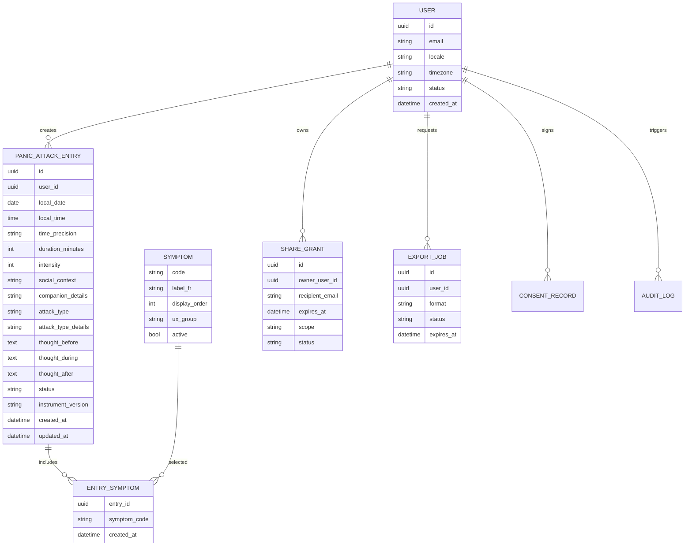
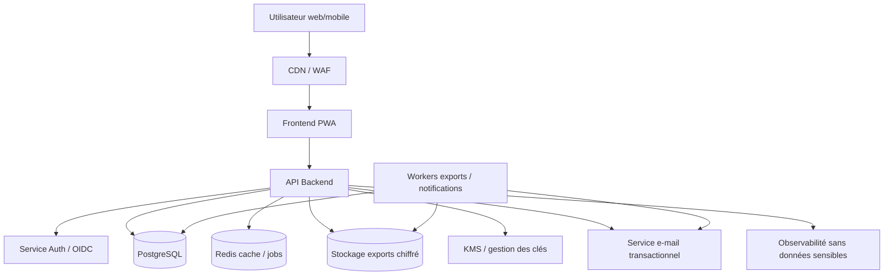

# GAAP Online — Spécification exhaustive pour un outil web d’auto-observation des attaques de panique

**Version :** 1.0  
**Date :** 2026-06-06  
**Document source :** `triggers-suivi.pdf` — Grille d’Auto-Observation des Attaques de Panique (GAAP) fournie par l’utilisateur.  
**Type de document :** cahier des charges fonctionnel + spécification technique + modèle de données + préconisations sécurité/conformité.  
**Public visé :** équipe produit, UX/UI, développeurs front-end, back-end, DevOps, sécurité, DPO/juriste, professionnels de santé impliqués dans la validation clinique.

---

## Table des matières

1. [Synthèse du besoin](#1-synthèse-du-besoin)  
2. [Description exhaustive de la grille GAAP d’origine](#2-description-exhaustive-de-la-grille-gaap-dorigine)  
3. [Objectifs du produit web](#3-objectifs-du-produit-web)  
4. [Périmètre fonctionnel](#4-périmètre-fonctionnel)  
5. [Parcours utilisateurs](#5-parcours-utilisateurs)  
6. [Spécification UX/UI détaillée](#6-spécification-uxui-détaillée)  
7. [Règles métier et validations](#7-règles-métier-et-validations)  
8. [Modèle de données fonctionnel](#8-modèle-de-données-fonctionnel)  
9. [Schéma de base de données recommandé](#9-schéma-de-base-de-données-recommandé)  
10. [API REST et contrats d’échange](#10-api-rest-et-contrats-déchange)  
11. [Architecture logicielle recommandée](#11-architecture-logicielle-recommandée)  
12. [Mode hors ligne, PWA et synchronisation](#12-mode-hors-ligne-pwa-et-synchronisation)  
13. [Sécurité applicative](#13-sécurité-applicative)  
14. [Confidentialité, RGPD, données de santé et HDS](#14-confidentialité-rgpd-données-de-santé-et-hds)  
15. [Accessibilité et ergonomie en contexte d’anxiété](#15-accessibilité-et-ergonomie-en-contexte-danxiété)  
16. [Tableaux de bord et analyses](#16-tableaux-de-bord-et-analyses)  
17. [Exports, partages et interopérabilité](#17-exports-partages-et-interopérabilité)  
18. [Notifications et rappels](#18-notifications-et-rappels)  
19. [Administration, support et supervision](#19-administration-support-et-supervision)  
20. [Tests et critères d’acceptation](#20-tests-et-critères-dacceptation)  
21. [Plan de livraison MVP puis versions ultérieures](#21-plan-de-livraison-mvp-puis-versions-ultérieures)  
22. [Risques produit, cliniques, juridiques et techniques](#22-risques-produit-cliniques-juridiques-et-techniques)  
23. [Annexes techniques](#23-annexes-techniques)  
24. [Références externes utiles](#24-références-externes-utiles)

---

## 1. Synthèse du besoin

Le document fourni est une grille papier intitulée **« Grille d’Auto-Observation des Attaques de Panique (GAAP) »**. Elle sert à consigner, après une attaque de panique, les informations principales permettant de mieux comprendre le contexte, le déclencheur, les sensations ressenties et les pensées avant, pendant et après l’épisode.

L’objectif de ce cahier des charges est de transformer cette grille papier en **outil web utilisable en ligne**, accessible depuis ordinateur, tablette et mobile, avec un soin particulier porté à :

- la saisie rapide en période de vulnérabilité ;
- la confidentialité de données de santé mentale potentiellement sensibles ;
- la simplicité d’usage ;
- la possibilité d’exporter ou de partager volontairement les observations avec un professionnel ;
- la robustesse technique ;
- l’accessibilité ;
- la conformité RGPD et, selon le contexte de déploiement, les exigences françaises relatives à l’hébergement de données de santé.

### 1.1. Proposition de nom produit

Nom court recommandé : **GAAP Online**  
Nom long : **Grille numérique d’auto-observation des attaques de panique**

### 1.2. Positionnement

GAAP Online doit être conçu comme un **outil d’auto-observation et de suivi personnel**, non comme un outil de diagnostic automatisé.

Il ne doit pas :

- diagnostiquer un trouble panique ;
- recommander un traitement ;
- remplacer une consultation médicale ou psychothérapeutique ;
- interpréter les entrées comme une certitude clinique ;
- déclencher une décision médicale automatisée.

Il peut :

- aider l’utilisateur à enregistrer ce qu’il a vécu ;
- structurer ses observations ;
- visualiser des tendances ;
- faciliter une discussion avec un professionnel ;
- exporter un journal clair et exploitable.

### 1.3. Mention de sécurité à intégrer dans le produit

Le produit doit afficher une mention simple, visible lors de l’onboarding et dans l’aide :

> Cet outil sert à noter vos observations. Il ne remplace pas un avis médical ou psychologique. En cas de danger immédiat, de détresse intense, d’idées suicidaires ou de symptômes physiques inhabituels ou inquiétants, contactez les services d’urgence ou un professionnel de santé.

Cette mention doit être adaptée au pays de déploiement.

---

## 2. Description exhaustive de la grille GAAP d’origine

La grille source est un tableau papier prévu pour plusieurs lignes d’observation. Chaque ligne correspond à une attaque de panique ou à un épisode d’anxiété intense répondant à la définition donnée en bas de page.

### 2.1. Définition de l’attaque de panique dans la grille source

La grille définit une attaque de panique comme un niveau d’anxiété élevé accompagné :

- de fortes réactions physiques ;
- de réactions psychologiques ;
- d’un désir intense d’échapper à la situation.

Exemples de réactions physiques mentionnées dans la grille :

- étouffement ;
- étourdissements ;
- palpitations ;
- tremblements.

Exemples de réactions psychologiques mentionnées :

- peur de mourir ;
- peur de devenir fou ;
- peur de perdre le contrôle.

### 2.2. Champs présents dans la grille papier

Chaque observation contient les colonnes suivantes :

| Champ source | Description | Format attendu dans l’outil numérique |
|---|---|---|
| Date | Date de l’attaque | Date ISO `YYYY-MM-DD` + affichage localisé |
| Heure | Heure de début ou heure approximative de l’attaque | Heure locale `HH:mm` |
| Durée (min.) | Durée estimée en minutes | Entier positif, valeur approximative autorisée |
| Intensité (1-10) | Intensité subjective de l’attaque | Entier ou curseur discret de 1 à 10 |
| Étiez-vous | Seul ou accompagné, avec précision de la personne si accompagné | Enum + champ texte facultatif |
| Type d’attaque de panique | Catégorie de déclenchement | Enum à 4 valeurs + précision facultative |
| Sensations éprouvées | Liste de sensations ou peurs ressenties pendant l’attaque | Sélection multiple |
| À quoi pensiez-vous | Pensées avant, pendant et après l’attaque | 3 zones de texte |

### 2.3. Champ « Étiez-vous »

La grille propose deux choix :

1. seul ;
2. accompagné, avec précision « par qui ».

#### Transposition numérique

Champ recommandé : `social_context`

Valeurs :

- `alone` : seul ;
- `accompanied` : accompagné ;
- `unknown` : non renseigné, à réserver aux brouillons.

Champ complémentaire : `companion_details`

- Type : texte court.
- Obligatoire uniquement si `social_context = accompanied` et si le produit choisit une saisie stricte.
- Recommandation UX : facultatif, avec placeholder « Ex. ami, parent, collègue, inconnu, groupe ».

### 2.4. Champ « Type d’attaque de panique »

La grille propose quatre types :

1. **Déclenchée par l’exposition à une situation anxiogène ou qui a été problématique.**
2. **Déclenchée à la pensée d’une situation qui inquiète, que l’utilisateur craint problématique et qui va survenir.**
3. **Déclenchée par des sensations physiques.**
4. **Spontanée, inattendue, qui arrive comme par surprise.**

Pour les réponses 1, 2 et 3, la grille demande de préciser.

#### Transposition numérique

Champ recommandé : `attack_type`

Valeurs :

- `situational_exposure`
- `anticipated_situation_thought`
- `physical_sensation_trigger`
- `unexpected_spontaneous`

Champ complémentaire : `attack_type_details`

- Type : texte long ou court selon l’interface.
- Obligatoire recommandé pour les valeurs 1, 2 et 3 en mode « complet ».
- Facultatif en mode « saisie rapide ».
- Non applicable ou facultatif pour `unexpected_spontaneous`.

### 2.5. Champ « Sensations éprouvées lors de l’attaque »

La grille source propose 13 items :

| N° source | Libellé source | Code technique recommandé |
|---:|---|---|
| 1 | Étouffement | `choking_shortness_of_breath` |
| 2 | Étourdissements | `dizziness` |
| 3 | Palpitations | `palpitations` |
| 4 | Tremblements | `trembling` |
| 5 | Transpiration | `sweating` |
| 6 | Étranglement | `feeling_of_strangling` |
| 7 | Nausée ou gêne abdominale | `nausea_abdominal_discomfort` |
| 8 | Irréalité / ne pas être là | `derealization_depersonalization` |
| 9 | Engourdissements / picotements | `numbness_tingling` |
| 10 | Chaleurs / frissons | `hot_flushes_chills` |
| 11 | Douleur ou gêne thoracique | `chest_pain_discomfort` |
| 12 | Peur de mourir | `fear_of_dying` |
| 13 | Peur de devenir fou ou de perdre le contrôle | `fear_of_losing_control_or_going_crazy` |

#### Transposition numérique

- Composant recommandé : groupe de cases à cocher.
- Nombre de choix : 0 à 13 en brouillon, 1 à 13 en entrée finalisée si l’application impose une saisie complète.
- Option facultative : « Autre sensation » avec champ texte, uniquement si validé cliniquement, car cela dépasse la grille source.
- Option facultative : intensité par sensation, mais à ne pas inclure dans le MVP sauf besoin clinique explicite.

### 2.6. Champ « À quoi pensiez-vous ? »

La grille demande les pensées :

- avant l’attaque ;
- pendant l’attaque ;
- après l’attaque.

#### Transposition numérique

Trois champs distincts :

- `thought_before`
- `thought_during`
- `thought_after`

Caractéristiques :

- Type : texte long.
- Longueur recommandée : 0 à 2 000 caractères par champ en MVP.
- Chiffrement applicatif recommandé, car il s’agit de texte libre contenant potentiellement des données très sensibles.
- Prévoir autosauvegarde locale pendant la saisie.
- Prévoir un bouton « Je ne sais pas / je préfère ne pas répondre ».

---

## 3. Objectifs du produit web

### 3.1. Objectifs utilisateurs

1. **Saisir rapidement une attaque de panique** sans devoir réfléchir à une structure complexe.
2. **Retrouver ses observations** sous forme de journal.
3. **Identifier des tendances personnelles** : moments, contextes, types de déclencheurs, sensations fréquentes, intensité moyenne.
4. **Préparer une consultation** en exportant un résumé clair.
5. **Conserver le contrôle** sur ses données : modification, suppression, export, partage sélectif.
6. **Utiliser l’outil sur mobile** immédiatement après un épisode.
7. **Pouvoir saisir hors ligne** si l’utilisateur n’a pas de réseau.

### 3.2. Objectifs produit

1. Numériser fidèlement la grille GAAP.
2. Réduire la friction de saisie.
3. Améliorer la qualité des données par des validations douces.
4. Préserver la confidentialité par conception.
5. Permettre un MVP simple, puis une évolution modulaire.
6. Séparer clairement observation, analyse descriptive et interprétation clinique.
7. Faciliter l’usage en cabinet ou en autonomie.

### 3.3. Objectifs techniques

1. Architecture web responsive, PWA, sécurisée.
2. API documentée, versionnée et testée.
3. Base de données relationnelle robuste.
4. Chiffrement en transit et au repos.
5. Journalisation sans contenu sensible.
6. Sauvegardes chiffrées.
7. Contrôles d’accès stricts.
8. Déploiement possible sur infrastructure compatible données de santé.
9. Observabilité technique sans exposition de données personnelles.

---

## 4. Périmètre fonctionnel

### 4.1. MVP indispensable

Le MVP doit inclure :

- création de compte ou mode local ;
- onboarding avec information de sécurité et consentement ;
- création d’une entrée GAAP ;
- consultation de la liste des entrées ;
- modification d’une entrée ;
- suppression d’une entrée ;
- sauvegarde automatique en brouillon ;
- sélection des sensations éprouvées ;
- export PDF ;
- export CSV ;
- paramètres de confidentialité ;
- authentification sécurisée ;
- tableau de bord descriptif minimal ;
- interface responsive mobile.

### 4.2. Fonctionnalités v1 recommandées

- PWA installable ;
- fonctionnement hors ligne ;
- synchronisation multi-appareils ;
- rappels configurables ;
- partage temporaire avec un professionnel ;
- export JSON ;
- filtre par période, intensité, type, sensation ;
- graphiques de tendances ;
- journal d’accès utilisateur ;
- suppression complète du compte ;
- téléchargement de toutes les données.

### 4.3. Fonctionnalités v2 optionnelles

- mode « thérapeute » avec consentement explicite ;
- espace organisation pour cabinet ou établissement ;
- commentaires du professionnel sur une entrée ;
- questionnaires complémentaires ;
- tags personnalisés ;
- entrée vocale locale transformée en texte, uniquement avec consentement ;
- intégration agenda ;
- résumé automatique local ou serveur, uniquement si juridiquement et cliniquement validé ;
- export interopérable vers format clinique structuré ;
- support multilingue.

### 4.4. Hors périmètre recommandé pour MVP

À exclure du MVP :

- diagnostic automatisé ;
- score clinique propriétaire non validé ;
- recommandations thérapeutiques automatisées ;
- détection de crise avec alerte automatique à un tiers ;
- partage social ;
- publicité ;
- monétisation par exploitation des données ;
- intégration de trackers marketing tiers ;
- envoi de contenu sensible dans des outils analytiques externes.

---

## 5. Parcours utilisateurs

### 5.1. Acteurs

#### Utilisateur principal

Personne qui souhaite suivre ses attaques de panique.

Droits :

- créer ses entrées ;
- modifier ses entrées ;
- supprimer ses entrées ;
- exporter ses données ;
- partager ou révoquer un accès ;
- gérer ses paramètres.

#### Professionnel invité

Psychologue, médecin, psychiatre, infirmier, thérapeute ou autre professionnel autorisé par l’utilisateur.

Droits possibles :

- consulter les entrées partagées ;
- filtrer les entrées ;
- télécharger un rapport si l’utilisateur l’a autorisé ;
- ajouter des notes professionnelles uniquement si cette fonctionnalité est activée.

Droits interdits sans consentement :

- accéder à toutes les données ;
- modifier les entrées de l’utilisateur ;
- partager les données à un tiers ;
- conserver une copie au-delà des conditions acceptées.

#### Administrateur technique

Personne chargée de la maintenance.

Droits :

- gérer les comptes au niveau technique ;
- traiter les incidents ;
- consulter des métadonnées minimales.

Droits interdits :

- lire les pensées libres ou le contenu des observations, sauf procédure exceptionnelle documentée, justifiée et tracée.

### 5.2. Parcours A — Première utilisation

1. L’utilisateur arrive sur la page d’accueil.
2. Il lit une description courte de l’outil.
3. Il choisit :
   - mode local sans compte ;
   - mode compte personnel synchronisé ;
   - mode avec code d’invitation d’un professionnel.
4. Il lit l’avertissement de non-substitution médicale.
5. Il accepte les conditions et la politique de confidentialité.
6. Il configure éventuellement :
   - code PIN local ;
   - authentification biométrique côté appareil si disponible ;
   - rappels ;
   - langue ;
   - mode sombre.
7. Il accède au tableau de bord vide avec bouton principal « Ajouter une observation ».

### 5.3. Parcours B — Saisie rapide juste après une attaque

Objectif : permettre une saisie en moins d’une minute.

Étapes :

1. Bouton « Nouvelle observation ».
2. Écran 1 : date/heure préremplies à maintenant, intensité, durée estimée.
3. Écran 2 : seul/accompagné, type d’attaque.
4. Écran 3 : sensations sous forme de grandes cases à cocher.
5. Écran 4 : pensées avant/pendant/après, facultatives.
6. Sauvegarde.
7. Message rassurant :
   - « Observation enregistrée. Vous pourrez la compléter plus tard. »

### 5.4. Parcours C — Saisie complète après coup

Objectif : compléter une entrée de façon structurée.

Étapes :

1. L’utilisateur ouvre une entrée brouillon.
2. Il complète les champs manquants.
3. L’interface signale les champs recommandés, sans blocage excessif.
4. Il finalise l’entrée.
5. L’entrée apparaît dans le journal.

### 5.5. Parcours D — Consultation du journal

1. Accès à l’onglet « Journal ».
2. Liste chronologique inversée.
3. Chaque carte affiche :
   - date ;
   - heure ;
   - intensité ;
   - durée ;
   - type ;
   - sensations principales ;
   - statut brouillon/complet.
4. Filtres :
   - période ;
   - intensité ;
   - type ;
   - sensation ;
   - contexte seul/accompagné.
5. Ouverture d’une entrée en détail.

### 5.6. Parcours E — Analyse des tendances

1. Accès à l’onglet « Tendances ».
2. Sélection d’une période.
3. Visualisation :
   - nombre d’attaques ;
   - intensité moyenne ;
   - durée moyenne ;
   - types les plus fréquents ;
   - sensations fréquentes ;
   - répartition par heure ou jour ;
   - contexte seul/accompagné.
4. Texte d’accompagnement prudent :
   - « Ces tendances sont descriptives et ne constituent pas une interprétation médicale. »

### 5.7. Parcours F — Export pour consultation

1. L’utilisateur clique sur « Exporter ».
2. Il choisit :
   - période ;
   - format PDF, CSV ou JSON ;
   - inclure ou exclure les pensées libres ;
   - inclure ou exclure les détails de personnes accompagnantes ;
   - anonymiser certaines informations.
3. Il confirme.
4. Le fichier est généré.
5. Le produit affiche un rappel :
   - « Vérifiez le fichier avant de le partager. »

### 5.8. Parcours G — Partage sécurisé avec un professionnel

1. L’utilisateur ouvre « Partage ».
2. Il ajoute l’adresse e-mail ou le code professionnel.
3. Il choisit :
   - période partagée ;
   - types de champs partagés ;
   - durée de validité ;
   - lecture seule ou commentaires autorisés.
4. Il confirme avec authentification renforcée.
5. Le professionnel reçoit une invitation.
6. L’utilisateur peut révoquer l’accès à tout moment.
7. Toutes les consultations sont journalisées et visibles par l’utilisateur.

---

## 6. Spécification UX/UI détaillée

### 6.1. Principes d’interface

L’interface doit être :

- calme ;
- prévisible ;
- rapide ;
- lisible ;
- sans surcharge ;
- sans vocabulaire culpabilisant ;
- sans animations intrusives ;
- utilisable d’une seule main sur mobile ;
- compatible lecteur d’écran ;
- utilisable avec clavier uniquement.

### 6.2. Structure de navigation

Navigation principale recommandée :

1. **Accueil / Tableau de bord**
2. **Nouvelle observation**
3. **Journal**
4. **Tendances**
5. **Exports**
6. **Partage**
7. **Paramètres**
8. **Aide**

Sur mobile, utiliser une barre de navigation basse avec 4 entrées principales :

- Accueil ;
- Ajouter ;
- Journal ;
- Plus.

### 6.3. Écran d’accueil

Éléments :

- message d’accueil ;
- bouton principal « Ajouter une observation » ;
- dernière observation ;
- mini-statistiques des 7 ou 30 derniers jours ;
- raccourci « Continuer un brouillon » ;
- lien discret vers l’aide.

Exemple de carte :

```text
Vos 30 derniers jours
- 4 observations
- Intensité moyenne : 6,5 / 10
- Sensations fréquentes : palpitations, étourdissements
```

### 6.4. Formulaire de création — version en étapes

#### Étape 1 — Quand et avec quelle intensité ?

Champs :

- date ;
- heure ;
- durée ;
- intensité.

Recommandations :

- date et heure préremplies ;
- bouton « Je ne sais pas » pour durée ;
- curseur d’intensité de 1 à 10 avec libellés :
  - 1 = très faible ;
  - 5 = modérée ;
  - 10 = maximale.

#### Étape 2 — Contexte

Champs :

- Étiez-vous seul ou accompagné ?
- Si accompagné : par qui ?

Composants :

- boutons radio larges ;
- champ texte conditionnel.

#### Étape 3 — Type d’attaque

Options :

- Situation anxiogène/problématique ;
- Pensée d’une situation à venir ;
- Sensations physiques ;
- Spontanée/inattendue.

Chaque option doit contenir une explication courte.

Exemple :

```text
Déclenchée par une situation
Vous étiez exposé à une situation anxiogène ou déjà problématique.
```

Champ conditionnel :

- « Précisez si vous le souhaitez ».

#### Étape 4 — Sensations ressenties

Cases à cocher groupées en catégories visuelles facultatives :

- respiration / gorge ;
- équilibre / perception ;
- cœur / poitrine ;
- corps ;
- ventre ;
- peurs.

Mapping recommandé :

Respiration / gorge :

- Étouffement ;
- Étranglement.

Équilibre / perception :

- Étourdissements ;
- Irréalité / ne pas être là.

Cœur / poitrine :

- Palpitations ;
- Douleur ou gêne thoracique.

Corps :

- Tremblements ;
- Transpiration ;
- Engourdissements / picotements ;
- Chaleurs / frissons.

Ventre :

- Nausée ou gêne abdominale.

Peurs :

- Peur de mourir ;
- Peur de devenir fou ou de perdre le contrôle.

#### Étape 5 — Pensées

Trois champs :

- Avant l’attaque ;
- Pendant l’attaque ;
- Après l’attaque.

Aides à la saisie :

- « Notez des mots, phrases ou images mentales, même approximatifs. »
- « Vous pouvez laisser vide. »
- « Vous pourrez compléter plus tard. »

### 6.5. Variante « formulaire en une page »

Pour desktop ou professionnel :

Sections accordéon :

1. Date, heure, durée, intensité ;
2. Contexte ;
3. Type ;
4. Sensations ;
5. Pensées ;
6. Notes facultatives.

Le formulaire en une page doit rester disponible pour les utilisateurs avancés.

### 6.6. Brouillons et autosauvegarde

Règles :

- toute saisie doit être autosauvegardée localement toutes les 2 à 5 secondes ;
- si l’utilisateur quitte la page, afficher « Brouillon sauvegardé » ;
- une entrée peut rester en statut `draft` ;
- une entrée finalisée passe en statut `completed`.

### 6.7. Microcopies recommandées

Libellés courts :

- « Ajouter une observation »
- « Sauvegarder »
- « Sauvegarder comme brouillon »
- « Finaliser »
- « Compléter plus tard »
- « Exporter »
- « Supprimer cette observation »
- « Révoquer le partage »

Messages de validation :

- « L’intensité doit être comprise entre 1 et 10. »
- « La durée doit être indiquée en minutes. »
- « Cette observation est enregistrée. »
- « Votre brouillon est sauvegardé sur cet appareil. »

Messages à éviter :

- « Crise grave détectée »
- « Votre état se dégrade »
- « Vous devez consulter »
- « Anomalie »
- « Échec de contrôle »

### 6.8. Design system minimal

#### Couleurs

Le design doit être apaisant, mais le cahier des charges ne fixe pas une palette obligatoire.

Contraintes :

- contraste texte/fond conforme WCAG 2.2 AA ;
- mode sombre ;
- ne pas coder l’intensité uniquement par couleur ;
- éviter rouge vif pour les alertes non critiques.

#### Typographie

- taille minimale texte : 16 px ;
- interligne confortable ;
- titres hiérarchisés ;
- largeur de ligne limitée à 70-80 caractères sur desktop.

#### Composants

Composants nécessaires :

- `Button`
- `IconButton`
- `TextInput`
- `Textarea`
- `RadioGroup`
- `CheckboxCard`
- `Slider`
- `DatePicker`
- `TimePicker`
- `Stepper`
- `Toast`
- `Modal`
- `ConfirmDialog`
- `EntryCard`
- `TrendChart`
- `ExportPanel`
- `SharePermissionPanel`

### 6.9. États d’erreur

Types :

- erreur de validation ;
- perte de connexion ;
- conflit de synchronisation ;
- session expirée ;
- export impossible ;
- partage expiré ;
- suppression irréversible.

Principe :

- toujours expliquer ce qui s’est passé ;
- proposer une action claire ;
- ne jamais exposer d’informations techniques sensibles.

---

## 7. Règles métier et validations

### 7.1. Statuts d’une observation

| Statut | Description | Conditions |
|---|---|---|
| `draft` | Brouillon incomplet | Créé automatiquement pendant la saisie |
| `completed` | Observation finalisée | Champs minimaux renseignés |
| `archived` | Masquée du journal principal | Action volontaire |
| `deleted` | Suppression logique temporaire | Avant purge définitive |

### 7.2. Champs minimaux pour finaliser

Recommandation MVP :

- date ;
- heure ou option « heure approximative/inconnue » ;
- intensité ;
- au moins un type ou `unknown` si l’utilisateur ne sait pas ;
- au moins une sensation ou confirmation « aucune / non renseignée ».

Variante stricte :

- date ;
- heure ;
- durée ;
- intensité ;
- contexte ;
- type ;
- sensations.

La variante stricte n’est pas recommandée pour un outil destiné à être utilisé juste après une attaque, car elle peut augmenter la charge cognitive.

### 7.3. Règles de date et heure

- `occurred_at` ne doit pas être dans le futur de plus de 5 minutes.
- L’utilisateur peut corriger le fuseau horaire.
- Si l’heure est inconnue, stocker :
  - `local_time = null`
  - `time_precision = unknown`
- Si l’heure est approximative, stocker :
  - `time_precision = approximate`

### 7.4. Règles de durée

- Unité : minute.
- Type : entier.
- Valeur recommandée : 1 à 1440.
- Autoriser `null` si inconnu.
- Option UX : boutons rapides 5, 10, 15, 30, 60 min.
- Si durée > 180 min, demander confirmation non bloquante :
  - « Voulez-vous confirmer cette durée ? »

### 7.5. Règles d’intensité

- Valeur entière de 1 à 10.
- Pas de décimales en MVP.
- Option « non renseignée » possible en brouillon uniquement.
- Affichage : `7 / 10`.

### 7.6. Règles du contexte social

- `social_context = accompanied` peut déclencher l’affichage de `companion_details`.
- Le champ `companion_details` doit être limité, par exemple 120 caractères.
- Éviter de demander le nom complet d’une personne tierce.
- Microcopie recommandée :
  - « Évitez d’indiquer un nom complet si ce n’est pas nécessaire. »

### 7.7. Règles du type d’attaque

- Une seule catégorie principale dans le MVP pour rester fidèle à la grille.
- Option avancée : plusieurs catégories si l’utilisateur estime qu’il y en a plusieurs.
- Pour les catégories 1 à 3, afficher un champ de précision.
- Pour la catégorie 4, champ de précision facultatif.

### 7.8. Règles des sensations

- Sélection multiple.
- Ordre d’affichage identique à la grille ou regroupé avec possibilité de voir l’ordre original.
- Stockage par code stable, pas par libellé, pour permettre la traduction.
- Historiser les versions de libellés si le questionnaire évolue.

### 7.9. Règles des pensées

- Trois champs distincts.
- Longueur maximale configurable.
- Chiffrement recommandé au niveau applicatif.
- Pas d’analyse automatique par défaut.
- Pas d’envoi à un service tiers sans consentement explicite.

### 7.10. Versionnement du questionnaire

Le contenu GAAP doit être versionné.

Exemple :

```json
{
  "instrument_code": "GAAP",
  "instrument_version": "1.0",
  "language": "fr-FR",
  "source": "triggers-suivi.pdf"
}
```

Chaque observation doit stocker la version utilisée afin de conserver l’interprétabilité historique.

---

## 8. Modèle de données fonctionnel

### 8.1. Entités principales

#### `User`

Représente un utilisateur.

Attributs :

- identifiant ;
- e-mail ;
- statut ;
- langue ;
- fuseau horaire ;
- préférences ;
- date de création ;
- date de dernière connexion.

#### `PanicAttackEntry`

Représente une observation GAAP.

Attributs :

- date ;
- heure ;
- durée ;
- intensité ;
- contexte social ;
- détails accompagnant ;
- type d’attaque ;
- détails du type ;
- sensations ;
- pensées avant ;
- pensées pendant ;
- pensées après ;
- statut ;
- version du questionnaire ;
- métadonnées de création et modification.

#### `Symptom`

Référentiel des sensations.

Attributs :

- code ;
- libellé français ;
- ordre ;
- catégorie UX ;
- statut actif/inactif.

#### `EntrySymptom`

Association entre observation et sensation.

Attributs :

- identifiant observation ;
- code sensation ;
- date d’ajout.

#### `ShareGrant`

Autorisation de partage.

Attributs :

- utilisateur propriétaire ;
- destinataire ;
- périmètre ;
- date d’expiration ;
- droits ;
- statut ;
- date de révocation.

#### `AuditLog`

Trace des actions sensibles.

Attributs :

- acteur ;
- action ;
- ressource ;
- date ;
- adresse IP tronquée ou pseudonymisée ;
- user-agent réduit ;
- résultat.

#### `ExportJob`

Export demandé par l’utilisateur.

Attributs :

- format ;
- période ;
- champs inclus ;
- statut ;
- lien temporaire ;
- expiration.

#### `ConsentRecord`

Preuve de consentement ou acceptation.

Attributs :

- type ;
- version du texte ;
- date ;
- adresse IP tronquée ;
- retrait éventuel.

### 8.2. Diagramme entité-relation logique



### 8.3. Codes de référentiel

#### Types d’attaque

```json
[
  {
    "code": "situational_exposure",
    "label_fr": "Déclenchée par l’exposition à une situation anxiogène ou problématique",
    "requires_details": true,
    "source_order": 1
  },
  {
    "code": "anticipated_situation_thought",
    "label_fr": "Déclenchée par la pensée d’une situation inquiétante à venir",
    "requires_details": true,
    "source_order": 2
  },
  {
    "code": "physical_sensation_trigger",
    "label_fr": "Déclenchée par des sensations physiques",
    "requires_details": true,
    "source_order": 3
  },
  {
    "code": "unexpected_spontaneous",
    "label_fr": "Spontanée, inattendue, arrivant par surprise",
    "requires_details": false,
    "source_order": 4
  }
]
```

#### Sensations

```json
[
  {"code": "choking_shortness_of_breath", "label_fr": "Étouffement", "source_order": 1, "ux_group": "respiration_gorge"},
  {"code": "dizziness", "label_fr": "Étourdissements", "source_order": 2, "ux_group": "equilibre_perception"},
  {"code": "palpitations", "label_fr": "Palpitations", "source_order": 3, "ux_group": "coeur_poitrine"},
  {"code": "trembling", "label_fr": "Tremblements", "source_order": 4, "ux_group": "corps"},
  {"code": "sweating", "label_fr": "Transpiration", "source_order": 5, "ux_group": "corps"},
  {"code": "feeling_of_strangling", "label_fr": "Étranglement", "source_order": 6, "ux_group": "respiration_gorge"},
  {"code": "nausea_abdominal_discomfort", "label_fr": "Nausée ou gêne abdominale", "source_order": 7, "ux_group": "ventre"},
  {"code": "derealization_depersonalization", "label_fr": "Irréalité / ne pas être là", "source_order": 8, "ux_group": "equilibre_perception"},
  {"code": "numbness_tingling", "label_fr": "Engourdissements / picotements", "source_order": 9, "ux_group": "corps"},
  {"code": "hot_flushes_chills", "label_fr": "Chaleurs / frissons", "source_order": 10, "ux_group": "corps"},
  {"code": "chest_pain_discomfort", "label_fr": "Douleur ou gêne thoracique", "source_order": 11, "ux_group": "coeur_poitrine"},
  {"code": "fear_of_dying", "label_fr": "Peur de mourir", "source_order": 12, "ux_group": "peurs"},
  {"code": "fear_of_losing_control_or_going_crazy", "label_fr": "Peur de devenir fou ou de perdre le contrôle", "source_order": 13, "ux_group": "peurs"}
]
```

---

## 9. Schéma de base de données recommandé

### 9.1. Choix recommandé

Base : **PostgreSQL**  
Raisons :

- transactions robustes ;
- contraintes d’intégrité ;
- support JSONB si nécessaire ;
- index puissants ;
- chiffrement au niveau disque possible ;
- compatibilité avec architectures HDS/cloud privé ;
- gestion fiable des migrations.

### 9.2. Principes de stockage

1. Les libellés ne doivent pas être stockés dans les observations, seulement les codes.
2. Les textes libres doivent être chiffrés au niveau applicatif ou au minimum au repos.
3. Les suppressions utilisateur doivent être distinguées :
   - suppression logique immédiate ;
   - purge physique différée selon politique de rétention.
4. Les logs ne doivent jamais contenir les pensées, les détails de type ou les détails accompagnant.
5. Les exports doivent expirer automatiquement.
6. Les données analytiques doivent être calculées à la demande ou stockées sous forme agrégée non identifiante.

### 9.3. SQL DDL indicatif

```sql
CREATE EXTENSION IF NOT EXISTS pgcrypto;

CREATE TYPE user_status AS ENUM (
  'active',
  'pending_email_verification',
  'disabled',
  'deleted'
);

CREATE TYPE entry_status AS ENUM (
  'draft',
  'completed',
  'archived',
  'deleted'
);

CREATE TYPE time_precision AS ENUM (
  'exact',
  'approximate',
  'unknown'
);

CREATE TYPE social_context AS ENUM (
  'alone',
  'accompanied',
  'unknown'
);

CREATE TYPE attack_type AS ENUM (
  'situational_exposure',
  'anticipated_situation_thought',
  'physical_sensation_trigger',
  'unexpected_spontaneous',
  'unknown'
);

CREATE TYPE symptom_code AS ENUM (
  'choking_shortness_of_breath',
  'dizziness',
  'palpitations',
  'trembling',
  'sweating',
  'feeling_of_strangling',
  'nausea_abdominal_discomfort',
  'derealization_depersonalization',
  'numbness_tingling',
  'hot_flushes_chills',
  'chest_pain_discomfort',
  'fear_of_dying',
  'fear_of_losing_control_or_going_crazy'
);

CREATE TABLE app_user (
  id UUID PRIMARY KEY DEFAULT gen_random_uuid(),
  email CITEXT UNIQUE,
  email_verified_at TIMESTAMPTZ,
  password_hash TEXT,
  locale TEXT NOT NULL DEFAULT 'fr-FR',
  timezone TEXT NOT NULL DEFAULT 'Europe/Paris',
  status user_status NOT NULL DEFAULT 'pending_email_verification',
  created_at TIMESTAMPTZ NOT NULL DEFAULT now(),
  updated_at TIMESTAMPTZ NOT NULL DEFAULT now(),
  deleted_at TIMESTAMPTZ
);

CREATE TABLE user_security_settings (
  user_id UUID PRIMARY KEY REFERENCES app_user(id) ON DELETE CASCADE,
  mfa_enabled BOOLEAN NOT NULL DEFAULT FALSE,
  webauthn_enabled BOOLEAN NOT NULL DEFAULT FALSE,
  session_timeout_minutes INTEGER NOT NULL DEFAULT 30 CHECK (session_timeout_minutes BETWEEN 5 AND 1440),
  created_at TIMESTAMPTZ NOT NULL DEFAULT now(),
  updated_at TIMESTAMPTZ NOT NULL DEFAULT now()
);

CREATE TABLE panic_attack_entry (
  id UUID PRIMARY KEY DEFAULT gen_random_uuid(),
  user_id UUID NOT NULL REFERENCES app_user(id) ON DELETE CASCADE,

  local_date DATE NOT NULL,
  local_time TIME,
  time_precision time_precision NOT NULL DEFAULT 'exact',
  timezone TEXT NOT NULL DEFAULT 'Europe/Paris',

  duration_minutes INTEGER CHECK (
    duration_minutes IS NULL OR
    duration_minutes BETWEEN 1 AND 1440
  ),

  intensity SMALLINT CHECK (
    intensity IS NULL OR
    intensity BETWEEN 1 AND 10
  ),

  social_context social_context NOT NULL DEFAULT 'unknown',

  -- Chiffrer côté application si possible.
  companion_details_enc BYTEA,
  companion_details_nonce BYTEA,

  attack_type attack_type NOT NULL DEFAULT 'unknown',

  -- Chiffrer côté application si possible.
  attack_type_details_enc BYTEA,
  attack_type_details_nonce BYTEA,

  thought_before_enc BYTEA,
  thought_before_nonce BYTEA,
  thought_during_enc BYTEA,
  thought_during_nonce BYTEA,
  thought_after_enc BYTEA,
  thought_after_nonce BYTEA,

  status entry_status NOT NULL DEFAULT 'draft',
  instrument_code TEXT NOT NULL DEFAULT 'GAAP',
  instrument_version TEXT NOT NULL DEFAULT '1.0',

  client_created_at TIMESTAMPTZ,
  client_updated_at TIMESTAMPTZ,
  created_at TIMESTAMPTZ NOT NULL DEFAULT now(),
  updated_at TIMESTAMPTZ NOT NULL DEFAULT now(),
  archived_at TIMESTAMPTZ,
  deleted_at TIMESTAMPTZ,

  CHECK (
    status <> 'completed'
    OR (
      intensity IS NOT NULL
      AND attack_type IS NOT NULL
      AND social_context IS NOT NULL
    )
  )
);

CREATE INDEX idx_panic_entry_user_date
  ON panic_attack_entry (user_id, local_date DESC, local_time DESC);

CREATE INDEX idx_panic_entry_user_status
  ON panic_attack_entry (user_id, status);

CREATE INDEX idx_panic_entry_attack_type
  ON panic_attack_entry (user_id, attack_type);

CREATE TABLE entry_symptom (
  entry_id UUID NOT NULL REFERENCES panic_attack_entry(id) ON DELETE CASCADE,
  symptom symptom_code NOT NULL,
  created_at TIMESTAMPTZ NOT NULL DEFAULT now(),
  PRIMARY KEY (entry_id, symptom)
);

CREATE INDEX idx_entry_symptom_symptom
  ON entry_symptom (symptom);

CREATE TABLE consent_record (
  id UUID PRIMARY KEY DEFAULT gen_random_uuid(),
  user_id UUID NOT NULL REFERENCES app_user(id) ON DELETE CASCADE,
  consent_type TEXT NOT NULL,
  document_version TEXT NOT NULL,
  accepted BOOLEAN NOT NULL,
  accepted_at TIMESTAMPTZ NOT NULL DEFAULT now(),
  withdrawn_at TIMESTAMPTZ,
  ip_truncated INET,
  user_agent_hash TEXT
);

CREATE TABLE share_grant (
  id UUID PRIMARY KEY DEFAULT gen_random_uuid(),
  owner_user_id UUID NOT NULL REFERENCES app_user(id) ON DELETE CASCADE,
  recipient_email CITEXT NOT NULL,
  recipient_user_id UUID REFERENCES app_user(id) ON DELETE SET NULL,
  scope JSONB NOT NULL,
  permissions JSONB NOT NULL DEFAULT '{"read": true, "export": false, "comment": false}',
  status TEXT NOT NULL DEFAULT 'pending',
  token_hash TEXT UNIQUE,
  expires_at TIMESTAMPTZ NOT NULL,
  revoked_at TIMESTAMPTZ,
  created_at TIMESTAMPTZ NOT NULL DEFAULT now(),
  updated_at TIMESTAMPTZ NOT NULL DEFAULT now(),

  CHECK (expires_at > created_at)
);

CREATE INDEX idx_share_grant_owner
  ON share_grant (owner_user_id, status);

CREATE TABLE export_job (
  id UUID PRIMARY KEY DEFAULT gen_random_uuid(),
  user_id UUID NOT NULL REFERENCES app_user(id) ON DELETE CASCADE,
  format TEXT NOT NULL CHECK (format IN ('pdf', 'csv', 'json')),
  status TEXT NOT NULL DEFAULT 'pending',
  parameters JSONB NOT NULL,
  file_object_key TEXT,
  file_sha256 TEXT,
  expires_at TIMESTAMPTZ,
  created_at TIMESTAMPTZ NOT NULL DEFAULT now(),
  completed_at TIMESTAMPTZ,
  failed_at TIMESTAMPTZ
);

CREATE TABLE audit_log (
  id UUID PRIMARY KEY DEFAULT gen_random_uuid(),
  actor_user_id UUID REFERENCES app_user(id) ON DELETE SET NULL,
  action TEXT NOT NULL,
  resource_type TEXT NOT NULL,
  resource_id UUID,
  outcome TEXT NOT NULL CHECK (outcome IN ('success', 'failure')),
  ip_truncated INET,
  user_agent_hash TEXT,
  metadata JSONB NOT NULL DEFAULT '{}',
  created_at TIMESTAMPTZ NOT NULL DEFAULT now()
);

CREATE INDEX idx_audit_actor_date
  ON audit_log (actor_user_id, created_at DESC);
```

### 9.4. Migrations

Outil recommandé :

- Prisma Migrate ;
- Flyway ;
- Liquibase ;
- Alembic si back-end Python ;
- migrations SQL manuelles versionnées si équipe expérimentée.

Exigences :

- migration testée en environnement de préproduction ;
- rollback documenté ;
- sauvegarde avant migration destructive ;
- compatibilité ascendante API pendant au moins une version.

### 9.5. Politique de rétention

Valeurs indicatives à valider juridiquement :

| Donnée | Rétention recommandée |
|---|---|
| Observations actives | Tant que le compte existe |
| Brouillons | Tant que le compte existe ou purge après 12 mois d’inactivité configurable |
| Exports générés | 24 h à 7 jours maximum |
| Logs techniques non sensibles | 6 à 12 mois |
| Logs d’audit sécurité | 12 à 36 mois selon contexte |
| Compte supprimé | Purge après délai de réversibilité, par exemple 30 jours |
| Sauvegardes | Cycle court, par exemple 30 à 90 jours, avec purge conforme |

---

## 10. API REST et contrats d’échange

### 10.1. Principes API

- API versionnée : `/api/v1`.
- Authentification par cookie de session sécurisé ou OAuth2/OIDC.
- JSON uniquement.
- Pas de données sensibles dans l’URL.
- Pagination obligatoire sur les listes.
- Idempotence pour la création depuis mode hors ligne.
- Codes d’erreur standardisés.
- Validation serveur systématique.
- Contrôle d’accès sur chaque ressource.

### 10.2. Format d’erreur standard

```json
{
  "error": {
    "code": "VALIDATION_ERROR",
    "message": "Certains champs sont invalides.",
    "details": [
      {
        "field": "intensity",
        "message": "L’intensité doit être comprise entre 1 et 10."
      }
    ],
    "request_id": "req_01J..."
  }
}
```

### 10.3. Objet `PanicAttackEntry`

```json
{
  "id": "4e5f4f4b-6d9e-4a41-93f8-7a33a17af987",
  "local_date": "2026-06-06",
  "local_time": "14:35",
  "time_precision": "exact",
  "timezone": "Europe/Paris",
  "duration_minutes": 12,
  "intensity": 8,
  "social_context": "accompanied",
  "companion_details": "ami",
  "attack_type": "physical_sensation_trigger",
  "attack_type_details": "Sensation de cœur qui s’accélère",
  "symptoms": [
    "palpitations",
    "dizziness",
    "fear_of_losing_control_or_going_crazy"
  ],
  "thought_before": "Je me suis demandé si quelque chose n’allait pas.",
  "thought_during": "J’ai pensé que j’allais perdre le contrôle.",
  "thought_after": "J’étais fatigué et inquiet que cela recommence.",
  "status": "completed",
  "instrument_code": "GAAP",
  "instrument_version": "1.0",
  "created_at": "2026-06-06T12:40:00Z",
  "updated_at": "2026-06-06T12:42:00Z"
}
```

### 10.4. Endpoints principaux

#### Créer une observation

```http
POST /api/v1/entries
Content-Type: application/json
```

Corps :

```json
{
  "client_id": "local_01JZ...",
  "local_date": "2026-06-06",
  "local_time": "14:35",
  "time_precision": "exact",
  "timezone": "Europe/Paris",
  "duration_minutes": 12,
  "intensity": 8,
  "social_context": "alone",
  "attack_type": "unexpected_spontaneous",
  "symptoms": ["palpitations", "trembling"],
  "thought_before": "",
  "thought_during": "Je ne comprenais pas ce qui arrivait.",
  "thought_after": "",
  "status": "draft"
}
```

Réponse `201` :

```json
{
  "data": {
    "id": "4e5f4f4b-6d9e-4a41-93f8-7a33a17af987",
    "status": "draft",
    "created_at": "2026-06-06T12:40:00Z"
  }
}
```

#### Lister les observations

```http
GET /api/v1/entries?from=2026-01-01&to=2026-06-06&status=completed&page=1&page_size=25
```

Réponse :

```json
{
  "data": [
    {
      "id": "4e5f4f4b-6d9e-4a41-93f8-7a33a17af987",
      "local_date": "2026-06-06",
      "local_time": "14:35",
      "duration_minutes": 12,
      "intensity": 8,
      "attack_type": "unexpected_spontaneous",
      "symptoms": ["palpitations", "trembling"],
      "status": "completed"
    }
  ],
  "pagination": {
    "page": 1,
    "page_size": 25,
    "total": 1
  }
}
```

#### Lire une observation

```http
GET /api/v1/entries/{entry_id}
```

#### Modifier une observation

```http
PATCH /api/v1/entries/{entry_id}
Content-Type: application/json
```

Corps partiel :

```json
{
  "duration_minutes": 15,
  "status": "completed"
}
```

#### Supprimer une observation

```http
DELETE /api/v1/entries/{entry_id}
```

Réponse :

```json
{
  "data": {
    "id": "4e5f4f4b-6d9e-4a41-93f8-7a33a17af987",
    "deleted": true
  }
}
```

#### Obtenir les statistiques descriptives

```http
GET /api/v1/entries/stats?from=2026-01-01&to=2026-06-06
```

Réponse :

```json
{
  "data": {
    "entry_count": 12,
    "completed_count": 10,
    "draft_count": 2,
    "average_intensity": 6.7,
    "median_intensity": 7,
    "average_duration_minutes": 14.5,
    "most_frequent_symptoms": [
      {"symptom": "palpitations", "count": 8},
      {"symptom": "dizziness", "count": 6}
    ],
    "attack_type_distribution": [
      {"attack_type": "unexpected_spontaneous", "count": 4},
      {"attack_type": "physical_sensation_trigger", "count": 3}
    ]
  }
}
```

#### Créer un export

```http
POST /api/v1/exports
Content-Type: application/json
```

Corps :

```json
{
  "format": "pdf",
  "from": "2026-01-01",
  "to": "2026-06-06",
  "include_thoughts": true,
  "include_companion_details": false,
  "include_summary_charts": true
}
```

Réponse :

```json
{
  "data": {
    "export_id": "exp_01JZ...",
    "status": "pending"
  }
}
```

#### Télécharger un export

```http
GET /api/v1/exports/{export_id}/download
```

Contraintes :

- lien signé ;
- expiration courte ;
- authentification requise ;
- téléchargement journalisé ;
- fichier supprimé automatiquement après expiration.

#### Créer un partage

```http
POST /api/v1/shares
Content-Type: application/json
```

Corps :

```json
{
  "recipient_email": "professionnel@example.org",
  "scope": {
    "from": "2026-01-01",
    "to": "2026-06-06",
    "include_thoughts": true,
    "include_companion_details": false
  },
  "permissions": {
    "read": true,
    "export": false,
    "comment": false
  },
  "expires_at": "2026-07-06T23:59:59Z"
}
```

#### Révoquer un partage

```http
DELETE /api/v1/shares/{share_id}
```

### 10.5. Extrait OpenAPI indicatif

```yaml
openapi: 3.1.0
info:
  title: GAAP Online API
  version: 1.0.0
  description: API pour la saisie et la consultation d'observations GAAP.
servers:
  - url: https://api.example.com/api/v1
paths:
  /entries:
    post:
      summary: Créer une observation
      operationId: createEntry
      security:
        - sessionCookie: []
      requestBody:
        required: true
        content:
          application/json:
            schema:
              $ref: '#/components/schemas/PanicAttackEntryCreate'
      responses:
        '201':
          description: Observation créée
          content:
            application/json:
              schema:
                $ref: '#/components/schemas/PanicAttackEntryResponse'
        '400':
          description: Erreur de validation
    get:
      summary: Lister les observations
      operationId: listEntries
      security:
        - sessionCookie: []
      parameters:
        - in: query
          name: from
          schema:
            type: string
            format: date
        - in: query
          name: to
          schema:
            type: string
            format: date
        - in: query
          name: page
          schema:
            type: integer
            minimum: 1
            default: 1
        - in: query
          name: page_size
          schema:
            type: integer
            minimum: 1
            maximum: 100
            default: 25
      responses:
        '200':
          description: Liste paginée
components:
  securitySchemes:
    sessionCookie:
      type: apiKey
      in: cookie
      name: gaap_session
  schemas:
    PanicAttackEntryCreate:
      type: object
      required:
        - local_date
        - timezone
      properties:
        client_id:
          type: string
          maxLength: 100
        local_date:
          type: string
          format: date
        local_time:
          type:
            - string
            - "null"
          pattern: "^([01][0-9]|2[0-3]):[0-5][0-9]$"
        time_precision:
          type: string
          enum: [exact, approximate, unknown]
        timezone:
          type: string
          example: Europe/Paris
        duration_minutes:
          type:
            - integer
            - "null"
          minimum: 1
          maximum: 1440
        intensity:
          type:
            - integer
            - "null"
          minimum: 1
          maximum: 10
        social_context:
          type: string
          enum: [alone, accompanied, unknown]
        companion_details:
          type: string
          maxLength: 120
        attack_type:
          type: string
          enum:
            - situational_exposure
            - anticipated_situation_thought
            - physical_sensation_trigger
            - unexpected_spontaneous
            - unknown
        attack_type_details:
          type: string
          maxLength: 500
        symptoms:
          type: array
          uniqueItems: true
          items:
            type: string
        thought_before:
          type: string
          maxLength: 2000
        thought_during:
          type: string
          maxLength: 2000
        thought_after:
          type: string
          maxLength: 2000
        status:
          type: string
          enum: [draft, completed]
```

---

## 11. Architecture logicielle recommandée

### 11.1. Vue d’ensemble

Architecture recommandée :



### 11.2. Stack recommandée

#### Front-end

- TypeScript ;
- React ou Vue ;
- Next.js ou Nuxt si rendu hybride nécessaire ;
- PWA avec service worker ;
- IndexedDB pour stockage local ;
- WebCrypto pour chiffrement local ;
- Zod ou Valibot pour validation côté client ;
- Playwright pour tests end-to-end ;
- Testing Library pour tests composants.

#### Back-end

Option TypeScript :

- Node.js ;
- NestJS ;
- Prisma ou Drizzle ORM ;
- PostgreSQL ;
- Redis ;
- BullMQ ou équivalent pour jobs.

Option Python :

- FastAPI ;
- SQLAlchemy ;
- Alembic ;
- PostgreSQL ;
- Redis ;
- Celery ou RQ pour jobs.

Le choix TypeScript full-stack facilite le partage des types entre front-end et back-end. Le choix Python facilite certains traitements de données et exports, mais le MVP ne nécessite pas de calcul avancé.

#### Infrastructure

- conteneurs Docker ;
- Kubernetes, Nomad ou PaaS compatible données de santé ;
- reverse proxy ;
- WAF ;
- secrets manager ;
- KMS ;
- sauvegardes chiffrées ;
- monitoring ;
- alerting ;
- pipeline CI/CD.

### 11.3. Environnements

Minimum :

1. `local` : développement ;
2. `dev` : intégration ;
3. `staging` : préproduction proche production ;
4. `prod` : production.

Exigences :

- données de production interdites en environnement non-production ;
- jeux de données synthétiques ;
- secrets séparés ;
- accès restreints ;
- migrations testées sur staging.

### 11.4. Découpage applicatif back-end

Modules recommandés :

- `AuthModule`
- `UsersModule`
- `EntriesModule`
- `SymptomsModule`
- `StatsModule`
- `ExportsModule`
- `SharingModule`
- `ConsentModule`
- `AuditModule`
- `NotificationsModule`
- `AdminModule`
- `SecurityModule`

### 11.5. Découpage front-end

Routes recommandées :

```text
/
 /onboarding
 /login
 /register
 /app
 /app/new
 /app/entries
 /app/entries/:id
 /app/trends
 /app/exports
 /app/sharing
 /app/settings
 /app/help
 /professional/invitations/:token
 /professional/shared
```

### 11.6. Gestion d’état front-end

État serveur :

- TanStack Query, RTK Query ou équivalent.

État local sensible :

- stocker le minimum ;
- chiffrer les brouillons si persistés ;
- nettoyer après déconnexion ;
- ne pas mettre de pensées libres dans l’URL, les logs ou les événements analytiques.

### 11.7. Stratégie d’authentification

Recommandation :

- cookie de session HTTPOnly, Secure, SameSite ;
- rotation de session après connexion ;
- expiration courte ;
- refresh token en cookie sécurisé si nécessaire ;
- MFA optionnelle dès v1 ;
- WebAuthn/passkeys recommandé.

Alternative :

- OIDC avec fournisseur conforme aux exigences du contexte de santé.

### 11.8. Gestion des fichiers d’export

- génération asynchrone ;
- stockage objet chiffré ;
- nom de fichier non sensible ;
- lien signé court ;
- suppression automatique ;
- journalisation des téléchargements.

Exemple de nom :

```text
gaap-export-2026-01-01_2026-06-06.pdf
```

Ne pas inclure le nom complet de l’utilisateur dans le nom du fichier par défaut.

---

## 12. Mode hors ligne, PWA et synchronisation

### 12.1. Pourquoi un mode hors ligne

Les attaques de panique peuvent survenir dans des contextes sans réseau ou avec connexion instable. L’utilisateur doit pouvoir enregistrer une observation sans attendre le serveur.

### 12.2. Exigences PWA

- manifest web app ;
- service worker ;
- cache des assets statiques ;
- page hors ligne ;
- file d’attente de synchronisation ;
- installation mobile ;
- mise à jour contrôlée du service worker ;
- compatibilité iOS/Android autant que possible.

### 12.3. Stockage local

Technologie recommandée :

- IndexedDB ;
- Dexie.js ou wrapper équivalent ;
- chiffrement via WebCrypto.

Données stockées localement :

- brouillons ;
- entrées non synchronisées ;
- référentiels de libellés ;
- préférences non sensibles.

Données à éviter localement :

- exports PDF ;
- données partagées de tiers ;
- tokens longue durée non sécurisés.

### 12.4. Stratégie de chiffrement local

Option simple MVP :

- IndexedDB non chiffré mais nettoyage strict après déconnexion.

Option recommandée :

- clé locale dérivée d’un code PIN ou d’un secret stocké par le navigateur si disponible ;
- chiffrement AES-GCM ;
- nonces uniques par enregistrement ;
- rotation si l’utilisateur change de code.

Option sécurité élevée :

- chiffrement de bout en bout ;
- clé jamais envoyée au serveur ;
- limitation des analyses serveur ;
- exports générés côté client.

### 12.5. Synchronisation

Chaque entrée locale doit avoir :

- `client_id` stable ;
- `client_created_at` ;
- `client_updated_at` ;
- `sync_status` :
  - `pending_create`
  - `pending_update`
  - `pending_delete`
  - `synced`
  - `conflict`
  - `failed`

### 12.6. Résolution de conflit

Cas typiques :

- même entrée modifiée sur deux appareils ;
- suppression sur un appareil, modification sur un autre ;
- version serveur plus récente.

Politique recommandée :

1. comparer `updated_at` serveur et `client_updated_at` ;
2. si conflit simple, conserver la version la plus récente ;
3. si conflit de champs sensibles, créer une copie et demander à l’utilisateur ;
4. ne jamais perdre silencieusement une pensée libre.

### 12.7. Idempotence

L’API de création doit accepter `client_id`.

Règle :

- si `client_id` existe déjà pour l’utilisateur, retourner l’entrée existante au lieu de créer un doublon.

---

## 13. Sécurité applicative

### 13.1. Niveau de sécurité cible

Cible recommandée :

- alignement sur **OWASP ASVS 5.0 niveau 2** pour une application manipulant des données sensibles ;
- durcissement complémentaire sur les données de santé et les textes libres ;
- tests de sécurité à chaque version majeure ;
- pentest avant production.

### 13.2. Principes

1. Confidentialité par défaut.
2. Moindre privilège.
3. Défense en profondeur.
4. Journalisation des accès sans contenu sensible.
5. Chiffrement systématique en transit.
6. Chiffrement au repos.
7. Séparation des environnements.
8. Revue de code obligatoire.
9. Dépendances surveillées.
10. Plan de réponse à incident.

### 13.3. Transport

Exigences :

- TLS 1.2 minimum, TLS 1.3 recommandé ;
- HSTS ;
- redirection HTTP vers HTTPS ;
- cookies Secure ;
- désactivation des suites faibles ;
- certificats renouvelés automatiquement ;
- surveillance d’expiration certificat.

### 13.4. Sessions

Exigences :

- cookies `HttpOnly`, `Secure`, `SameSite=Lax` ou `Strict` ;
- identifiant de session aléatoire ;
- rotation après login ;
- invalidation après logout ;
- expiration d’inactivité ;
- expiration absolue ;
- détection de sessions concurrentes facultative ;
- page « appareils connectés » en v1.

### 13.5. Mots de passe

Si l’application gère des mots de passe :

- Argon2id recommandé ;
- politique de longueur minimale ;
- autoriser les gestionnaires de mots de passe ;
- ne pas imposer des règles absurdes qui réduisent la sécurité ;
- protection contre credential stuffing ;
- rate limiting ;
- vérification optionnelle contre mots de passe compromis si service conforme.

### 13.6. MFA et passkeys

- Passkeys/WebAuthn recommandés.
- TOTP possible.
- Codes de secours chiffrés.
- MFA obligatoire pour administrateurs.
- MFA fortement conseillé pour professionnels.

### 13.7. Autorisation

Chaque requête doit vérifier :

- l’identité ;
- le propriétaire de la ressource ;
- les droits de partage ;
- le statut de l’entrée ;
- le statut du compte ;
- l’expiration de l’accès.

Ne jamais faire confiance à l’ID utilisateur envoyé par le client.

### 13.8. Protection XSS

- échappement systématique ;
- Content Security Policy stricte ;
- interdiction d’injecter du HTML utilisateur ;
- sanitization si rendu riche futur ;
- pas de markdown utilisateur rendu en HTML sans sanitizer ;
- dépendances front auditées.

### 13.9. Protection CSRF

Si cookie de session :

- token CSRF ;
- SameSite ;
- vérification Origin/Referer ;
- méthodes mutatives protégées.

### 13.10. Protection injection

- requêtes préparées ;
- ORM correctement utilisé ;
- validation d’entrée ;
- allowlist sur enums ;
- pas de concaténation SQL ;
- pas de requêtes dynamiques non contrôlées.

### 13.11. Journalisation

À journaliser :

- connexion ;
- déconnexion ;
- échec de connexion ;
- création/suppression/export/partage ;
- téléchargement d’export ;
- révocation de partage ;
- actions administrateur ;
- changement de paramètres sécurité.

À ne pas journaliser :

- pensées libres ;
- détails de déclencheurs ;
- détails accompagnants ;
- symptômes associés à une entrée précise, sauf sous forme strictement nécessaire et protégée ;
- tokens ;
- mots de passe ;
- contenu d’exports.

### 13.12. Chiffrement

#### En transit

- HTTPS partout.
- Connexions internes chiffrées si infrastructure multi-nœuds.
- Connexion DB chiffrée.

#### Au repos

- chiffrement disque ;
- chiffrement sauvegardes ;
- chiffrement stockage objet ;
- chiffrement applicatif pour champs sensibles.

#### Champs à chiffrer applicativement en priorité

- `thought_before`
- `thought_during`
- `thought_after`
- `attack_type_details`
- `companion_details`
- notes optionnelles
- commentaires professionnels

### 13.13. Gestion des clés

Recommandation :

- KMS externe ou HSM selon criticité ;
- enveloppe de chiffrement ;
- clé maître gérée hors base ;
- clé de données par utilisateur ou par tenant ;
- rotation planifiée ;
- révocation ;
- journalisation d’usage des clés ;
- séparation des rôles.

### 13.14. Sauvegardes

Exigences :

- sauvegardes chiffrées ;
- tests de restauration ;
- séparation logique ou physique ;
- rétention documentée ;
- accès restreint ;
- purge alignée sur suppression des comptes dans la mesure techniquement possible.

### 13.15. Secrets

- aucun secret dans le code ;
- aucun secret dans les images Docker ;
- secrets injectés à l’exécution ;
- rotation ;
- accès par environnement ;
- audit.

### 13.16. Sécurité CI/CD

- analyse dépendances ;
- SAST ;
- secret scanning ;
- lint ;
- tests ;
- génération SBOM ;
- signature d’images si possible ;
- revue de pull request ;
- protection des branches ;
- déploiement traçable.

### 13.17. En-têtes HTTP

Recommandés :

```http
Strict-Transport-Security: max-age=31536000; includeSubDomains; preload
Content-Security-Policy: default-src 'self'; frame-ancestors 'none'; base-uri 'self'
X-Content-Type-Options: nosniff
Referrer-Policy: strict-origin-when-cross-origin
Permissions-Policy: camera=(), microphone=(), geolocation=()
Cross-Origin-Opener-Policy: same-origin
Cross-Origin-Resource-Policy: same-origin
```

Adapter CSP selon les besoins réels.

---

## 14. Confidentialité, RGPD, données de santé et HDS

> Cette section est une spécification produit/technique. Elle ne remplace pas une analyse juridique formelle par un DPO ou un juriste.

### 14.1. Nature des données

Les observations GAAP contiennent des informations relatives à la santé mentale et aux symptômes physiques/psychologiques. Elles doivent donc être traitées comme **données de santé à caractère personnel** dès qu’elles sont liées à une personne identifiable.

### 14.2. Principes RGPD à appliquer

- finalité déterminée ;
- minimisation ;
- information claire ;
- base légale documentée ;
- traitement spécifique des données sensibles ;
- limitation de conservation ;
- sécurité ;
- droits des personnes ;
- traçabilité ;
- privacy by design ;
- privacy by default.

### 14.3. Base légale

Selon le contexte, la base légale peut varier :

- consentement explicite de l’utilisateur ;
- prise en charge par un professionnel de santé ;
- autre base prévue par le droit applicable.

Décision à formaliser :

- qui est responsable de traitement ;
- qui est sous-traitant ;
- quelles finalités ;
- quelles catégories de données ;
- quelles durées de conservation ;
- quels destinataires ;
- quels transferts éventuels ;
- quelles mesures de sécurité.

### 14.4. Consentements et informations

L’onboarding doit présenter :

- finalité de l’outil ;
- types de données collectées ;
- données obligatoires/facultatives ;
- destinataires ;
- durée de conservation ;
- droits ;
- modalités de suppression ;
- sécurité ;
- contact DPO/support ;
- conditions de partage avec un professionnel ;
- limites médicales de l’outil.

### 14.5. Minimisation

Éviter :

- nom complet des accompagnants ;
- géolocalisation précise ;
- audio brut ;
- contacts téléphone ;
- données tierces ;
- pièces jointes ;
- trackers tiers ;
- données marketing.

Champs strictement nécessaires au MVP :

- date ;
- heure ;
- durée ;
- intensité ;
- contexte ;
- type ;
- sensations ;
- pensées.

### 14.6. Droits utilisateur

Fonctions à prévoir :

- accès aux données ;
- rectification ;
- suppression d’une entrée ;
- suppression du compte ;
- export complet ;
- retrait de consentement si applicable ;
- limitation de partage ;
- révocation d’un accès professionnel ;
- historique des partages ;
- contact support/DPO.

### 14.7. HDS en France

Si l’outil est exploité dans un contexte français et héberge des données de santé pour le compte d’un professionnel, d’un établissement ou d’un service de santé, l’hébergement peut devoir être réalisé par un hébergeur certifié HDS. Le périmètre exact doit être validé juridiquement.

Spécification technique prudente :

- choisir dès le départ une infrastructure compatible HDS si le produit vise le marché français de la santé ;
- documenter le rôle des prestataires ;
- contractualiser les sous-traitants ;
- vérifier les régions de stockage ;
- interdire les transferts non maîtrisés ;
- exiger des sauvegardes et journaux dans le même périmètre de conformité.

### 14.8. Analyse d’impact

Une analyse d’impact relative à la protection des données est fortement recommandée et probablement nécessaire selon le contexte, car l’application traite des données sensibles liées à la santé mentale.

Contenu DPIA :

- description du traitement ;
- finalités ;
- nécessité/proportionnalité ;
- risques pour les personnes ;
- mesures de réduction des risques ;
- chiffrement ;
- contrôle d’accès ;
- information utilisateur ;
- gestion des incidents ;
- suppression ;
- partage ;
- sous-traitance.

### 14.9. Politique cookies et analytics

Recommandation :

- aucun cookie marketing ;
- analytics anonymisés ou auto-hébergés ;
- consentement si nécessaire ;
- ne pas envoyer d’événements contenant des réponses GAAP ;
- désactiver les replays de session ;
- désactiver les heatmaps sur les formulaires sensibles.

### 14.10. Privacy by default

Paramètres par défaut :

- profil privé ;
- partage désactivé ;
- export sans pensées libres sauf choix explicite ;
- détails accompagnants exclus des exports par défaut ;
- rappels désactivés ou très sobres ;
- pas de notifications contenant de contenu sensible.

---

## 15. Accessibilité et ergonomie en contexte d’anxiété

### 15.1. Cible d’accessibilité

Objectif recommandé :

- conformité WCAG 2.2 niveau AA ;
- tests lecteur d’écran ;
- tests clavier ;
- tests mobile ;
- tests avec zoom 200 % ;
- tests en contraste élevé.

### 15.2. Ergonomie spécifique aux attaques de panique

Le produit peut être utilisé dans un moment émotionnellement difficile. Il doit donc :

- limiter le nombre de choix par écran ;
- permettre d’ignorer des champs ;
- éviter les interruptions ;
- éviter les messages alarmistes ;
- proposer une sauvegarde automatique ;
- proposer de reprendre plus tard ;
- utiliser des phrases courtes ;
- ne pas forcer l’utilisateur à relire immédiatement des pensées anxieuses.

### 15.3. Accessibilité cognitive

- consignes simples ;
- vocabulaire stable ;
- progression visible ;
- bouton retour sans perte de données ;
- possibilité de réduire les graphiques ;
- aide contextuelle ;
- résumé avant sauvegarde facultatif.

### 15.4. Accessibilité visuelle

- contraste suffisant ;
- taille de texte réglable ;
- labels persistants ;
- focus visible ;
- pas de placeholder comme unique label ;
- icônes accompagnées de texte ;
- graphiques avec alternatives textuelles.

### 15.5. Accessibilité motrice

- grandes zones cliquables ;
- navigation clavier complète ;
- pas de gestes complexes obligatoires ;
- temps de session extensible ;
- pas de limite de temps stricte sur le formulaire.

### 15.6. Accessibilité émotionnelle

- ton neutre ;
- absence de jugement ;
- éviter les injonctions ;
- option « masquer les tendances » ;
- option « masquer les anciennes observations » ;
- mode lecture adouci.

---

## 16. Tableaux de bord et analyses

### 16.1. Principes

Les analyses doivent être descriptives, non diagnostiques.

Formulations recommandées :

- « Sur la période sélectionnée… »
- « Vous avez noté… »
- « Les sensations les plus souvent cochées sont… »
- « Ces informations peuvent vous aider à préparer un échange avec un professionnel. »

Formulations à éviter :

- « Vous souffrez de… »
- « Votre déclencheur principal est certainement… »
- « Risque élevé »
- « Anomalie détectée »
- « Diagnostic »

### 16.2. Indicateurs MVP

- nombre d’observations ;
- nombre d’observations complètes ;
- intensité moyenne ;
- intensité médiane ;
- durée moyenne ;
- durée médiane ;
- répartition par type d’attaque ;
- fréquence des sensations ;
- nombre d’attaques par semaine ;
- répartition seul/accompagné.

### 16.3. Indicateurs v1

- tendance d’intensité sur 7/30/90 jours ;
- tendance de durée ;
- heatmap jour/heure ;
- comparaison périodes ;
- sensations co-occurrantes ;
- distribution des intensités ;
- types par contexte ;
- liste des pensées les plus récentes, sans analyse automatique.

### 16.4. Calculs

#### Intensité moyenne

```text
average_intensity = sum(intensity renseignée) / count(intensity renseignée)
```

#### Durée moyenne

```text
average_duration = sum(duration_minutes renseignée) / count(duration_minutes renseignée)
```

#### Fréquence sensation

```text
symptom_frequency(symptom) = count(entries containing symptom)
```

#### Pourcentage sensation

```text
symptom_percentage = count(entries containing symptom) / count(entries with at least one symptom)
```

### 16.5. Graphiques recommandés

1. Courbe ou barres : nombre d’observations par semaine.
2. Histogramme : intensité.
3. Barres horizontales : sensations les plus fréquentes.
4. Donut ou barres : types d’attaque.
5. Heatmap : jour de semaine / heure, v1.
6. Tableau de synthèse exportable.

### 16.6. Seuils et alertes

Ne pas mettre d’alerte clinique automatique dans le MVP.

Si une fonctionnalité d’alerte est envisagée :

- validation clinique ;
- validation juridique ;
- messages prudents ;
- absence de diagnostic ;
- gestion des faux positifs ;
- gestion de responsabilité ;
- journalisation ;
- possibilité de désactivation.

---

## 17. Exports, partages et interopérabilité

### 17.1. Formats d’export

#### PDF

Utilisation :

- consultation ;
- impression ;
- partage avec professionnel.

Contenu :

- couverture ;
- période ;
- avertissement ;
- résumé statistique ;
- tableau des observations ;
- annexe détaillée si choisie.

Options :

- inclure pensées ;
- exclure pensées ;
- inclure détails accompagnants ;
- anonymiser ;
- inclure graphiques ;
- inclure uniquement entrées complètes.

#### CSV

Utilisation :

- tableur ;
- analyse personnelle ;
- import dans autre outil.

Colonnes recommandées :

```text
id
local_date
local_time
time_precision
timezone
duration_minutes
intensity
social_context
companion_details_included
attack_type
attack_type_details_included
symptoms_codes
symptoms_labels_fr
thought_before_included
thought_during_included
thought_after_included
status
created_at
updated_at
```

Pour éviter l’exposition accidentelle, proposer deux CSV :

- `gaap_observations_sans_textes_libres.csv`
- `gaap_observations_complet.csv`

#### JSON

Utilisation :

- sauvegarde ;
- migration ;
- interopérabilité.

Le JSON doit conserver :

- codes ;
- libellés ;
- version questionnaire ;
- métadonnées ;
- préférences d’export.

### 17.2. Exemple JSON export

```json
{
  "export_version": "1.0",
  "instrument": {
    "code": "GAAP",
    "version": "1.0",
    "language": "fr-FR"
  },
  "generated_at": "2026-06-06T13:00:00Z",
  "period": {
    "from": "2026-01-01",
    "to": "2026-06-06"
  },
  "entries": [
    {
      "local_date": "2026-06-06",
      "local_time": "14:35",
      "duration_minutes": 12,
      "intensity": 8,
      "social_context": "alone",
      "attack_type": "unexpected_spontaneous",
      "symptoms": [
        {
          "code": "palpitations",
          "label_fr": "Palpitations"
        }
      ],
      "thoughts": {
        "before": null,
        "during": "Texte inclus seulement si demandé",
        "after": null
      }
    }
  ]
}
```

### 17.3. Partage

Types de partage :

- lien temporaire ;
- invitation par e-mail ;
- partage avec compte professionnel ;
- export manuel.

Le partage par lien doit être évité pour les données de santé sauf sécurité forte.

Si lien temporaire :

- token long aléatoire ;
- token stocké haché ;
- expiration courte ;
- authentification secondaire ou code d’accès ;
- révocation ;
- journalisation.

### 17.4. Périmètre de partage

Options :

- période ;
- entrées complètes uniquement ;
- inclure pensées ;
- inclure détails de personnes ;
- inclure graphiques ;
- autoriser export par le professionnel ;
- autoriser commentaires.

### 17.5. Révocation

L’utilisateur doit pouvoir :

- voir tous les partages actifs ;
- révoquer immédiatement ;
- voir la date de dernier accès ;
- recevoir une confirmation.

---

## 18. Notifications et rappels

### 18.1. Principes

Les notifications doivent être discrètes et non stigmatisantes.

Exemples acceptables :

- « Souhaitez-vous compléter votre observation ? »
- « Votre brouillon peut être complété quand vous le souhaitez. »
- « Rappel de suivi configuré. »

À éviter :

- « Avez-vous encore fait une attaque ? »
- « Crise non renseignée »
- « Votre anxiété augmente »

### 18.2. Types

MVP :

- rappel de brouillon non complété, désactivé par défaut.

V1 :

- rappel personnalisé ;
- rappel hebdomadaire de revue ;
- notification d’expiration de partage ;
- notification d’export prêt.

### 18.3. Canaux

- in-app ;
- e-mail transactionnel ;
- push web, optionnel.

Les notifications ne doivent jamais contenir :

- intensité ;
- type d’attaque ;
- pensées ;
- symptômes ;
- détails accompagnants.

### 18.4. Préférences

L’utilisateur doit pouvoir configurer :

- activer/désactiver ;
- fréquence ;
- plage horaire ;
- canal ;
- libellé discret ;
- pause temporaire.

---

## 19. Administration, support et supervision

### 19.1. Interface admin

Fonctions minimales :

- recherche utilisateur par e-mail ;
- statut compte ;
- suspension compte ;
- déclenchement e-mail de vérification ;
- consultation logs techniques ;
- gestion incidents ;
- consultation version déployée ;
- métriques système.

À exclure :

- lecture du contenu des entrées ;
- modification des observations ;
- export des données utilisateur sans procédure formelle.

### 19.2. Support utilisateur

Fonctions :

- FAQ ;
- contact support ;
- demande d’export ;
- demande suppression ;
- signalement bug ;
- guide de confidentialité ;
- guide de partage avec professionnel.

### 19.3. Observabilité

Métriques techniques :

- disponibilité ;
- latence API ;
- taux d’erreur ;
- temps génération export ;
- taille file jobs ;
- échecs de login ;
- échecs de sync ;
- utilisation stockage.

Ne pas collecter comme métrique produit identifiable :

- textes libres ;
- symptômes individuels associés à un utilisateur ;
- intensités individuelles.

### 19.4. Alerting

Alertes :

- taux d’erreur élevé ;
- base indisponible ;
- saturation disque ;
- échec sauvegarde ;
- certificat bientôt expiré ;
- pics d’échecs authentification ;
- erreurs de chiffrement ;
- jobs export bloqués.

---

## 20. Tests et critères d’acceptation

### 20.1. Tests unitaires

À couvrir :

- validation intensité ;
- validation durée ;
- mapping symptômes ;
- mapping types ;
- permissions de partage ;
- génération statistiques ;
- sérialisation export ;
- chiffrement/déchiffrement ;
- conflits de synchronisation.

### 20.2. Tests d’intégration

Scénarios :

- création entrée complète ;
- création brouillon ;
- modification ;
- suppression ;
- export PDF ;
- export CSV ;
- partage ;
- révocation ;
- accès professionnel ;
- session expirée ;
- refresh session ;
- échec réseau.

### 20.3. Tests end-to-end

Parcours E2E :

1. inscription ;
2. onboarding ;
3. ajout observation rapide ;
4. reprise brouillon ;
5. finalisation ;
6. consultation journal ;
7. visualisation tendances ;
8. export PDF ;
9. suppression compte.

### 20.4. Tests accessibilité

- audit automatisé axe-core ;
- navigation clavier ;
- lecteur d’écran ;
- contrastes ;
- zoom 200 % ;
- mobile ;
- formulaires et erreurs ;
- modales ;
- graphiques avec alternatives.

### 20.5. Tests sécurité

- SAST ;
- DAST ;
- scan dépendances ;
- test CSRF ;
- test XSS ;
- test IDOR ;
- test rate limiting ;
- test bruteforce ;
- vérification logs ;
- pentest avant production.

### 20.6. Tests de charge

Objectifs indicatifs MVP :

- 95e percentile API lecture < 300 ms hors génération export ;
- 95e percentile création entrée < 500 ms ;
- génération PDF < 30 s pour 1 000 entrées ;
- disponibilité cible 99,5 % en MVP ;
- montée à 99,9 % si usage clinique institutionnel.

### 20.7. Critères d’acceptation MVP

Une version MVP est acceptable si :

- l’utilisateur peut créer une entrée GAAP complète ;
- tous les champs de la grille papier sont représentés ;
- les 13 sensations sont disponibles ;
- les 4 types sont disponibles ;
- les pensées avant/pendant/après sont séparées ;
- l’entrée peut être modifiée ;
- l’entrée peut être supprimée ;
- le journal liste les observations ;
- un export PDF et CSV est possible ;
- l’interface est utilisable sur mobile ;
- les données sont protégées en transit ;
- les accès sont authentifiés ;
- aucun contenu sensible n’est écrit dans les logs ;
- les mentions de sécurité et confidentialité sont présentes ;
- les tests critiques passent.

---

## 21. Plan de livraison MVP puis versions ultérieures

### 21.1. Phase 0 — Cadrage

Durée indicative : 1 à 3 semaines.

Livrables :

- validation clinique du contenu ;
- validation juridique ;
- DPIA initiale ;
- choix hébergement ;
- architecture cible ;
- wireframes ;
- backlog MVP ;
- définition des rôles.

### 21.2. Phase 1 — MVP technique

Durée indicative : 6 à 10 semaines.

Fonctions :

- auth ;
- onboarding ;
- CRUD observations ;
- journal ;
- export CSV/PDF ;
- sécurité de base ;
- responsive ;
- tests.

### 21.3. Phase 2 — PWA et tendances

Durée indicative : 4 à 8 semaines.

Fonctions :

- mode hors ligne ;
- synchronisation ;
- graphiques ;
- rappels ;
- préférences avancées ;
- accessibilité renforcée.

### 21.4. Phase 3 — Partage professionnel

Durée indicative : 6 à 12 semaines.

Fonctions :

- invitations ;
- partage limité ;
- espace professionnel ;
- audit consultable ;
- révocation ;
- commentaires éventuels.

### 21.5. Phase 4 — Industrialisation

Durée indicative : continue.

Fonctions :

- HDS ou infrastructure certifiée si requise ;
- supervision complète ;
- pentest ;
- gestion incidents ;
- support ;
- documentation ;
- procédures internes.

---

## 22. Risques produit, cliniques, juridiques et techniques

### 22.1. Registre des risques

| Risque | Impact | Probabilité | Mesures |
|---|---:|---:|---|
| Exposition de pensées libres | Très élevé | Moyen | Chiffrement, logs minimisés, contrôle d’accès, pentest |
| Utilisateur croit que l’outil diagnostique | Élevé | Moyen | Mentions claires, pas de diagnostic, wording prudent |
| Saisie trop complexe après une attaque | Moyen | Élevé | Mode rapide, brouillon, champs facultatifs |
| Données de tiers dans accompagnant | Moyen | Moyen | Limitation, microcopie, exclusion export par défaut |
| Partage accidentel trop large | Élevé | Moyen | Aperçu avant partage, scopes, expiration, révocation |
| Non-conformité RGPD/HDS | Très élevé | Moyen | DPO, DPIA, hébergement adapté, contrats |
| Perte de données offline | Élevé | Moyen | Sync robuste, autosave, conflit non destructif |
| Fuite via analytics | Élevé | Moyen | Pas de trackers tiers, événements anonymisés |
| Mauvaise interprétation des tendances | Moyen | Moyen | Analyse descriptive, avertissements |
| Attaque IDOR sur entrées | Très élevé | Moyen | Tests autorisation, RLS, revue sécurité |
| Export accessible trop longtemps | Élevé | Moyen | Expiration courte, liens signés, suppression automatique |
| Notifications indiscrètes | Moyen | Moyen | Contenu neutre, désactivation, pas de détails |

### 22.2. Mesures produit anti-risque

- ne pas afficher de jugement ;
- ne pas inférer de pathologie ;
- masquer les détails par défaut ;
- confirmer avant export ;
- proposer aperçu ;
- limiter les données visibles sur écran verrouillé ;
- supprimer automatiquement les liens temporaires ;
- donner contrôle permanent à l’utilisateur.

### 22.3. Mesures techniques anti-risque

- chiffrement ;
- auth robuste ;
- permissions strictes ;
- scan de vulnérabilités ;
- revues de code ;
- tests IDOR ;
- backups ;
- restauration testée ;
- monitoring ;
- réponse incident.

---

## 23. Annexes techniques

### 23.1. Types TypeScript

```ts
export type EntryStatus = 'draft' | 'completed' | 'archived' | 'deleted';

export type TimePrecision = 'exact' | 'approximate' | 'unknown';

export type SocialContext = 'alone' | 'accompanied' | 'unknown';

export type AttackType =
  | 'situational_exposure'
  | 'anticipated_situation_thought'
  | 'physical_sensation_trigger'
  | 'unexpected_spontaneous'
  | 'unknown';

export type SymptomCode =
  | 'choking_shortness_of_breath'
  | 'dizziness'
  | 'palpitations'
  | 'trembling'
  | 'sweating'
  | 'feeling_of_strangling'
  | 'nausea_abdominal_discomfort'
  | 'derealization_depersonalization'
  | 'numbness_tingling'
  | 'hot_flushes_chills'
  | 'chest_pain_discomfort'
  | 'fear_of_dying'
  | 'fear_of_losing_control_or_going_crazy';

export interface PanicAttackEntry {
  id: string;
  localDate: string;
  localTime: string | null;
  timePrecision: TimePrecision;
  timezone: string;
  durationMinutes: number | null;
  intensity: number | null;
  socialContext: SocialContext;
  companionDetails?: string | null;
  attackType: AttackType;
  attackTypeDetails?: string | null;
  symptoms: SymptomCode[];
  thoughtBefore?: string | null;
  thoughtDuring?: string | null;
  thoughtAfter?: string | null;
  status: EntryStatus;
  instrumentCode: 'GAAP';
  instrumentVersion: string;
  createdAt: string;
  updatedAt: string;
}
```

### 23.2. Validation Zod indicative

```ts
import { z } from 'zod';

export const symptomCodeSchema = z.enum([
  'choking_shortness_of_breath',
  'dizziness',
  'palpitations',
  'trembling',
  'sweating',
  'feeling_of_strangling',
  'nausea_abdominal_discomfort',
  'derealization_depersonalization',
  'numbness_tingling',
  'hot_flushes_chills',
  'chest_pain_discomfort',
  'fear_of_dying',
  'fear_of_losing_control_or_going_crazy',
]);

export const entryCreateSchema = z.object({
  client_id: z.string().max(100).optional(),
  local_date: z.string().regex(/^\d{4}-\d{2}-\d{2}$/),
  local_time: z
    .string()
    .regex(/^([01]\d|2[0-3]):[0-5]\d$/)
    .nullable()
    .optional(),
  time_precision: z.enum(['exact', 'approximate', 'unknown']).default('exact'),
  timezone: z.string().min(1).max(100),
  duration_minutes: z.number().int().min(1).max(1440).nullable().optional(),
  intensity: z.number().int().min(1).max(10).nullable().optional(),
  social_context: z.enum(['alone', 'accompanied', 'unknown']).default('unknown'),
  companion_details: z.string().max(120).nullable().optional(),
  attack_type: z
    .enum([
      'situational_exposure',
      'anticipated_situation_thought',
      'physical_sensation_trigger',
      'unexpected_spontaneous',
      'unknown',
    ])
    .default('unknown'),
  attack_type_details: z.string().max(500).nullable().optional(),
  symptoms: z.array(symptomCodeSchema).max(13).default([]),
  thought_before: z.string().max(2000).nullable().optional(),
  thought_during: z.string().max(2000).nullable().optional(),
  thought_after: z.string().max(2000).nullable().optional(),
  status: z.enum(['draft', 'completed']).default('draft'),
}).superRefine((value, ctx) => {
  if (value.status === 'completed') {
    if (value.intensity == null) {
      ctx.addIssue({
        code: z.ZodIssueCode.custom,
        path: ['intensity'],
        message: "L'intensité est recommandée pour finaliser l'observation.",
      });
    }

    if (
      ['situational_exposure', 'anticipated_situation_thought', 'physical_sensation_trigger'].includes(value.attack_type) &&
      !value.attack_type_details
    ) {
      ctx.addIssue({
        code: z.ZodIssueCode.custom,
        path: ['attack_type_details'],
        message: 'Une précision est recommandée pour ce type.',
      });
    }
  }
});
```

### 23.3. Exemple de composant de sélection des sensations

```tsx
type SymptomOption = {
  code: SymptomCode;
  label: string;
  group: string;
};

type SymptomSelectorProps = {
  value: SymptomCode[];
  options: SymptomOption[];
  onChange: (next: SymptomCode[]) => void;
};

export function SymptomSelector({ value, options, onChange }: SymptomSelectorProps) {
  function toggle(code: SymptomCode) {
    if (value.includes(code)) {
      onChange(value.filter((item) => item !== code));
    } else {
      onChange([...value, code]);
    }
  }

  return (
    <fieldset>
      <legend>Sensations éprouvées lors de l’attaque</legend>
      <div className="symptom-grid">
        {options.map((option) => (
          <label key={option.code} className="checkbox-card">
            <input
              type="checkbox"
              checked={value.includes(option.code)}
              onChange={() => toggle(option.code)}
            />
            <span>{option.label}</span>
          </label>
        ))}
      </div>
    </fieldset>
  );
}
```

### 23.4. Exemple de génération de statistiques SQL

```sql
SELECT
  COUNT(*) FILTER (WHERE status = 'completed') AS completed_count,
  AVG(intensity) AS average_intensity,
  PERCENTILE_CONT(0.5) WITHIN GROUP (ORDER BY intensity) AS median_intensity,
  AVG(duration_minutes) AS average_duration_minutes
FROM panic_attack_entry
WHERE user_id = $1
  AND status IN ('completed', 'draft')
  AND deleted_at IS NULL
  AND local_date BETWEEN $2 AND $3;
```

Fréquence des sensations :

```sql
SELECT
  es.symptom,
  COUNT(*) AS symptom_count
FROM entry_symptom es
JOIN panic_attack_entry e ON e.id = es.entry_id
WHERE e.user_id = $1
  AND e.deleted_at IS NULL
  AND e.local_date BETWEEN $2 AND $3
GROUP BY es.symptom
ORDER BY symptom_count DESC;
```

Répartition par type :

```sql
SELECT
  attack_type,
  COUNT(*) AS count
FROM panic_attack_entry
WHERE user_id = $1
  AND deleted_at IS NULL
  AND local_date BETWEEN $2 AND $3
GROUP BY attack_type
ORDER BY count DESC;
```

### 23.5. Exemple de politique CSP stricte à adapter

```http
Content-Security-Policy:
  default-src 'self';
  script-src 'self';
  style-src 'self' 'unsafe-inline';
  img-src 'self' data:;
  font-src 'self';
  connect-src 'self' https://api.example.com;
  object-src 'none';
  base-uri 'self';
  frame-ancestors 'none';
  form-action 'self';
```

Note : `style-src 'unsafe-inline'` peut être nécessaire selon le framework, mais doit être évité si possible au profit de nonces/hashes.

### 23.6. Checklist MVP

#### Produit

- [ ] Tous les champs de la grille source sont présents.
- [ ] Le formulaire est utilisable en moins de 60 secondes en mode rapide.
- [ ] Les brouillons sont sauvegardés.
- [ ] Les entrées sont modifiables.
- [ ] Les entrées sont supprimables.
- [ ] Les exports PDF/CSV existent.
- [ ] Les textes d’avertissement sont présents.
- [ ] Aucun diagnostic n’est affiché.

#### Technique

- [ ] API versionnée.
- [ ] Auth sécurisée.
- [ ] Validation client et serveur.
- [ ] Base PostgreSQL migrée.
- [ ] Sauvegardes configurées.
- [ ] Logs sans contenu sensible.
- [ ] Chiffrement en transit.
- [ ] Chiffrement au repos.
- [ ] Tests unitaires et E2E.
- [ ] Monitoring.

#### Sécurité/conformité

- [ ] Registre de traitement initial.
- [ ] DPIA initiale.
- [ ] Politique de confidentialité.
- [ ] Consentement ou base légale documentée.
- [ ] DPA sous-traitants.
- [ ] Hébergement adapté.
- [ ] Procédure incident.
- [ ] Procédure suppression.
- [ ] Revue sécurité.
- [ ] Plan de pentest.

### 23.7. Backlog initial détaillé

| Epic | User story | Priorité |
|---|---|---|
| Onboarding | En tant qu’utilisateur, je comprends le but et les limites de l’outil | P0 |
| Auth | En tant qu’utilisateur, je peux créer un compte sécurisé | P0 |
| Observation | En tant qu’utilisateur, je peux créer une observation GAAP | P0 |
| Observation | En tant qu’utilisateur, je peux sauvegarder un brouillon | P0 |
| Observation | En tant qu’utilisateur, je peux modifier une observation | P0 |
| Observation | En tant qu’utilisateur, je peux supprimer une observation | P0 |
| Journal | En tant qu’utilisateur, je peux voir mes observations par date | P0 |
| Export | En tant qu’utilisateur, je peux exporter mes données en PDF | P0 |
| Export | En tant qu’utilisateur, je peux exporter mes données en CSV | P0 |
| Sécurité | En tant qu’utilisateur, mes données ne sont pas visibles par d’autres | P0 |
| Confidentialité | En tant qu’utilisateur, je peux supprimer mon compte | P0 |
| Tendances | En tant qu’utilisateur, je vois des statistiques descriptives | P1 |
| PWA | En tant qu’utilisateur, je peux saisir hors ligne | P1 |
| Partage | En tant qu’utilisateur, je peux partager temporairement mes observations | P1 |
| Pro | En tant que professionnel invité, je peux consulter les données partagées | P2 |

---

## 24. Références externes utiles

Ces références servent de points d’appui pour les choix de sécurité, accessibilité et conformité. Elles doivent être vérifiées par l’équipe projet au moment du lancement.

1. CNIL — Définition des données de santé : https://www.cnil.fr/fr/quest-ce-ce-quune-donnee-de-sante  
2. CNIL — Thématique santé : https://www.cnil.fr/fr/thematiques/sante  
3. CNIL — Formalités pour les traitements de données de santé : https://www.cnil.fr/fr/quelles-formalites-pour-les-traitements-de-donnees-de-sante  
4. Agence du Numérique en Santé — Certification HDS : https://esante.gouv.fr/produits-services/hds  
5. Agence du Numérique en Santé — Hébergement des données de santé : https://esante.gouv.fr/labels-certifications/hebergement-des-donnees-de-sante  
6. W3C — WCAG 2.2 : https://www.w3.org/TR/WCAG22/  
7. OWASP — Application Security Verification Standard : https://owasp.org/www-project-application-security-verification-standard/  
8. OWASP — Developer Guide ASVS : https://devguide.owasp.org/en/03-requirements/05-asvs/

---

## Conclusion

La transformation de la grille GAAP papier en outil web est techniquement simple dans son cœur fonctionnel, mais exigeante dès que l’on prend en compte la sensibilité des données, le contexte de santé mentale, les partages avec des professionnels, l’usage mobile après un épisode anxieux, la conformité et la sécurité.

La recommandation principale est de livrer d’abord un MVP strictement fidèle à la grille source, sobre et sécurisé, puis d’ajouter progressivement les fonctionnalités de tendance, PWA, partage professionnel et interopérabilité. Le produit doit rester un outil d’auto-observation contrôlé par l’utilisateur, sans diagnostic automatisé ni interprétation clinique non validée.
