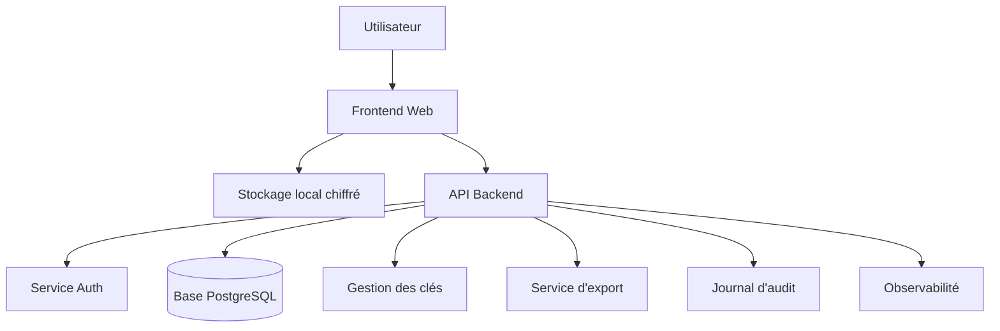

# Spécifications complètes — Outil web « Liste des situations évitées »

**Version du document :** 1.0  
**Date :** 2026-06-06  
**Langue cible :** français  
**Objet :** transformer la fiche papier « Liste des situations évitées » en un outil web sécurisé, accessible, utilisable en autonomie ou avec un professionnel.  
**Statut :** document de cadrage produit + spécifications fonctionnelles et techniques.

---

## 1. Résumé exécutif

La fiche source est un outil structuré en trois actions :

1. lister les situations que la personne s’empêche de faire ou évite à cause de la crainte qu’elles provoquent ;
2. attribuer à chaque situation une cote d’anxiété estimée de **0 à 100 / 100** ;
3. classer les situations par ordre croissant de crainte, de la moins anxiogène à la plus anxiogène.

L’objectif de l’outil web est de reproduire fidèlement cette logique, tout en ajoutant les capacités attendues d’un service en ligne : sauvegarde, tri automatique, accessibilité, export, confidentialité, partage contrôlé, versionnage, ergonomie mobile et sécurité renforcée. L’application ne doit pas interpréter médicalement les réponses, poser un diagnostic, remplacer un professionnel de santé ni produire des recommandations thérapeutiques automatisées non validées.

---

## 2. Source fonctionnelle de référence

### 2.1 Contenu de la fiche d’origine

La fiche papier porte le titre **« Liste des situations évitées »**. Elle comporte :

- une consigne de liste libre ;
- une consigne de cotation de l’anxiété sur une échelle de **0 à 100 %** ;
- une consigne de classement par ordre croissant de crainte ;
- un tableau final à deux colonnes : **Situation** et **Anxiété (0 à 100 %)**.

### 2.2 Interprétation produit

La version web doit être conçue comme un **outil de saisie, de hiérarchisation et de restitution**. Son cœur fonctionnel est simple :

```text
Saisir une situation évitée → Estimer l’anxiété → Trier → Relire → Exporter ou partager
```

Toute fonctionnalité supplémentaire doit rester secondaire et ne pas modifier le principe d’origine. Les extensions utiles, telles que notes personnelles, dates, tags, historique ou export PDF, doivent être optionnelles.

---

## 3. Finalité de l’outil

### 3.1 Finalité principale

Aider une personne à identifier et organiser les situations qu’elle évite en raison de la peur ou de l’anxiété, afin d’obtenir une hiérarchie claire allant des situations les moins anxiogènes aux situations les plus anxiogènes.

### 3.2 Finalités secondaires

- faciliter la discussion avec un professionnel ;
- conserver un historique de travail ;
- permettre une auto-observation structurée ;
- réduire les erreurs de classement par tri automatique ;
- favoriser la reprise ultérieure grâce à la sauvegarde ;
- rendre la fiche utilisable sur mobile, tablette et ordinateur ;
- proposer une exportation lisible, imprimable et partageable.

### 3.3 Ce que l’outil ne doit pas faire

L’outil ne doit pas :

- établir un diagnostic ;
- mesurer objectivement la sévérité d’un trouble ;
- décider d’un traitement ;
- remplacer une consultation ;
- inciter l’utilisateur à s’exposer seul à une situation dangereuse ;
- produire des conseils thérapeutiques personnalisés sans validation humaine ;
- vendre, louer ou exploiter commercialement les contenus saisis ;
- afficher des comparaisons culpabilisantes ou normatives.

---

## 4. Utilisateurs et rôles

## 4.1 Persona A — Utilisateur autonome

**Objectif :** remplir la liste pour soi-même.  
**Besoins :** simplicité, confidentialité, sauvegarde locale ou privée, export.  
**Risque principal :** abandon si l’interface est trop clinique ou trop complexe.

## 4.2 Persona B — Patient accompagné

**Objectif :** préparer ou compléter un travail avec un professionnel.  
**Besoins :** partager une liste, l’annoter, la présenter en séance.  
**Risque principal :** partage involontaire de données sensibles.

## 4.3 Persona C — Professionnel

**Objectif :** utiliser l’outil comme support de séance ou entre deux séances.  
**Besoins :** créer une fiche vierge, inviter un patient, visualiser le classement, exporter.  
**Risque principal :** confusion entre outil administratif, outil clinique et dispositif médical.

## 4.4 Persona D — Administrateur technique

**Objectif :** maintenir la plateforme.  
**Besoins :** supervision, sécurité, disponibilité.  
**Restriction critique :** aucun accès direct aux contenus personnels sauf procédure exceptionnelle, journalisée, justifiée et explicitement prévue.

---

## 5. Concepts métier

| Concept | Définition | Champs essentiels |
|---|---|---|
| Situation évitée | Événement, lieu, action, interaction ou contexte que l’utilisateur évite ou s’empêche de faire à cause de la crainte ressentie ou anticipée. | texte, score d’anxiété, ordre |
| Cote d’anxiété | Évaluation subjective de l’anxiété anticipée, de 0 à 100 %. | entier 0–100 |
| Hiérarchie | Liste triée par anxiété croissante. | situations triées |
| Fiche | Ensemble de situations liées à une même démarche de réflexion. | titre, propriétaire, dates |
| Version | État sauvegardé de la fiche à un instant donné. | horodatage, auteur, diff |
| Partage | Autorisation donnée à un tiers de consulter ou commenter une fiche. | destinataire, droits, expiration |
| Export | Restitution hors application. | PDF, CSV, Markdown, JSON |

---

## 6. Périmètre fonctionnel

## 6.1 Fonctionnalités indispensables — MVP

1. Affichage de l’introduction et des consignes.
2. Création d’une fiche.
3. Saisie de plusieurs situations évitées.
4. Attribution d’un score de 0 à 100 à chaque situation.
5. Validation des scores.
6. Classement automatique par score croissant.
7. Modification et suppression des lignes.
8. Sauvegarde.
9. Export imprimable.
10. Interface responsive.
11. Accessibilité clavier et lecteur d’écran.
12. Protection minimale des données personnelles.

## 6.2 Fonctionnalités recommandées — Version 1

1. Mode invité local sans compte.
2. Compte utilisateur optionnel.
3. Sauvegarde chiffrée côté serveur.
4. Export PDF, CSV, Markdown et JSON.
5. Partage temporaire par lien sécurisé.
6. Historique des modifications.
7. Duplication de fiche.
8. Notes facultatives par situation.
9. Tags facultatifs.
10. Recherche et filtrage.
11. Aide contextuelle.
12. Prévisualisation imprimable.
13. Gestion de la suppression définitive.
14. Journal d’activité sans contenu sensible.

## 6.3 Fonctionnalités avancées — Version 2+

1. Portail professionnel.
2. Collaboration patient-professionnel.
3. Commentaires non intrusifs.
4. Modèles de fiches personnalisables.
5. Comparaison de versions.
6. Planification facultative d’étapes de travail.
7. Visualisation en histogramme ou courbe de hiérarchie.
8. Mode hors ligne complet via PWA.
9. Import depuis CSV ou JSON.
10. API d’intégration avec un logiciel tiers.
11. Gestion multi-langues.
12. Audit de conformité.

## 6.4 Hors périmètre recommandé

Sauf validation réglementaire, clinique et juridique, les éléments suivants doivent rester hors périmètre :

- diagnostic automatisé ;
- recommandations de traitement ;
- scores cliniques propriétaires ;
- messagerie d’urgence ;
- surveillance comportementale ;
- publicité ciblée ;
- modèles d’IA analysant librement les contenus sans consentement explicite ;
- vente de données agrégées.

---

## 7. Parcours utilisateur principal

## 7.1 Parcours sans compte

```text
Arrivée → Explication → Mode local → Saisie → Cotation → Tri → Export → Suppression locale ou conservation navigateur
```

Caractéristiques :

- aucune inscription ;
- stockage local via IndexedDB ou LocalStorage chiffré ;
- avertissement clair : la perte du navigateur, du cache ou de l’appareil peut supprimer les données ;
- export encouragé avant fermeture ;
- aucune donnée envoyée au serveur sauf consentement explicite.

## 7.2 Parcours avec compte

```text
Arrivée → Explication → Création de compte → Consentement → Fiche → Sauvegarde cloud → Export / partage
```

Caractéristiques :

- authentification forte ;
- sauvegarde chiffrée ;
- gestion des droits ;
- récupération multi-appareils ;
- suppression définitive possible.

## 7.3 Parcours accompagné par un professionnel

```text
Professionnel crée une fiche ou invite → Patient complète → Professionnel consulte avec autorisation → Export séance
```

Caractéristiques :

- invitation explicite ;
- droits limités dans le temps ;
- journalisation des accès ;
- révocation immédiate du partage ;
- aucun accès implicite du professionnel aux autres fiches.

---

## 8. Règles métier détaillées

## 8.1 Situation

| Règle | Spécification |
|---|---|
| Champ obligatoire | Oui, sauf ligne brouillon non sauvegardée. |
| Longueur minimale | 2 caractères. |
| Longueur maximale recommandée | 500 caractères pour le texte principal. |
| Notes additionnelles | Optionnelles, maximum 2 000 caractères. |
| Doublons | Autorisés mais signalés. |
| Texte vide | Interdit à l’enregistrement. |
| Édition | Possible tant que l’utilisateur possède le droit `edit`. |
| Suppression | Possible avec confirmation si la ligne est déjà sauvegardée. |
| Archivage | Recommandé plutôt que suppression immédiate dans les fiches partagées. |

## 8.2 Score d’anxiété

| Règle | Spécification |
|---|---|
| Type | Entier. |
| Minimum | 0. |
| Maximum | 100. |
| Décimales | Non autorisées dans la version fidèle à la fiche. |
| Valeur absente | Ligne considérée incomplète. |
| Saisie | Champ numérique + curseur synchronisé. |
| Libellé | « Anxiété estimée, de 0 à 100 % ». |
| Validation | Côté client et côté serveur. |
| Interprétation clinique | Aucune interprétation automatique. |

## 8.3 Classement

| Règle | Spécification |
|---|---|
| Ordre par défaut | Score croissant. |
| Égalités | Conserver l’ordre de création ou permettre un ordre manuel secondaire. |
| Tri manuel | Optionnel ; ne doit pas masquer le score. |
| Tri automatique | Bouton explicite ou activé automatiquement après chaque modification. |
| Indicateur | Afficher « trié du moins anxiogène au plus anxiogène ». |

## 8.4 Sauvegarde

| Situation | Comportement attendu |
|---|---|
| Utilisateur local | Sauvegarde navigateur chiffrée si possible. |
| Utilisateur connecté | Sauvegarde serveur après validation. |
| Perte réseau | Mise en file d’attente locale. |
| Conflit multi-appareil | Détection par version et résolution assistée. |
| Suppression | Corbeille temporaire configurable puis purge. |

---

## 9. Exigences d’interface

## 9.1 Principes UX

L’interface doit être :

- calme, sobre et non culpabilisante ;
- lisible sur mobile ;
- utilisable au clavier ;
- compatible lecteur d’écran ;
- explicite sur la confidentialité ;
- centrée sur une seule tâche à la fois ;
- dépourvue de gamification excessive.

## 9.2 Ton rédactionnel

Le ton doit être :

- neutre ;
- encourageant ;
- factuel ;
- non médicalisant si l’utilisateur n’est pas accompagné ;
- sans injonction.

Exemples recommandés :

```text
Notez une situation que vous évitez ou que vous vous empêchez de faire.
Attribuez ensuite une estimation d’anxiété de 0 à 100 %.
Vous pourrez modifier cette liste à tout moment.
```

À éviter :

```text
Vos peurs sont irrationnelles.
Vous devez affronter cette situation.
Votre score indique un trouble sévère.
```

## 9.3 Écran 1 — Accueil

### Objectif

Présenter l’outil et obtenir le choix du mode d’utilisation.

### Contenu

- titre : « Liste des situations évitées » ;
- description courte ;
- explication des trois étapes ;
- bouton principal : « Commencer » ;
- option : « Utiliser sans compte » ;
- option : « Me connecter » ;
- lien : confidentialité ;
- avertissement : outil de réflexion, pas un service d’urgence.

### Wireframe textuel

```text
┌──────────────────────────────────────────────┐
│ Liste des situations évitées                 │
│                                              │
│ 1. Listez les situations évitées             │
│ 2. Cotez l’anxiété de 0 à 100 %              │
│ 3. Classez-les du moins au plus anxiogène    │
│                                              │
│ [Commencer sans compte] [Se connecter]       │
│                                              │
│ Confidentialité · Aide · Export              │
└──────────────────────────────────────────────┘
```

## 9.4 Écran 2 — Saisie libre initiale

### Objectif

Permettre de noter rapidement toutes les situations avant de les coter.

### Composants

- zone de texte multiligne ;
- bouton « Transformer en lignes » ;
- aide : une situation par ligne ;
- compteur de lignes ;
- bouton « Passer à la cotation ».

### Exemple

```text
Prendre le métro aux heures de pointe
Téléphoner à une administration
Aller à une soirée où je ne connais presque personne
```

### Règles

- chaque ligne non vide devient une situation ;
- les lignes identiques sont importées mais signalées ;
- les espaces superflus sont supprimés ;
- aucun score n’est attribué automatiquement.

## 9.5 Écran 3 — Cotation

### Objectif

Attribuer une cote d’anxiété à chaque situation.

### Composants par ligne

- texte de la situation ;
- champ numérique 0–100 ;
- curseur 0–100 ;
- bouton « note » ;
- bouton supprimer ;
- état de validation.

### Wireframe textuel

```text
┌────────────────────────────────────────────────────────────┐
│ Situation                                      Anxiété      │
├────────────────────────────────────────────────────────────┤
│ Prendre le métro aux heures de pointe          [ 65 ] %     │
│ ━━━━━━━━━━━━━━━━━━━━━━━━━━━━━━━━━━━━━━━●━━━━             │
│ [Ajouter une note] [Supprimer]                            │
├────────────────────────────────────────────────────────────┤
│ Téléphoner à une administration               [ 40 ] %     │
│ ━━━━━━━━━━━━━━━━━━━━━━━●━━━━━━━━━━━━━━━━━━                  │
└────────────────────────────────────────────────────────────┘
```

## 9.6 Écran 4 — Classement

### Objectif

Afficher la hiérarchie finale.

### Composants

- tableau trié ;
- rang ;
- situation ;
- score ;
- indicateur visuel discret ;
- actions : modifier, exporter, partager.

### Exemple

| Rang | Situation | Anxiété |
|---:|---|---:|
| 1 | Téléphoner à une administration | 40 % |
| 2 | Prendre le métro aux heures de pointe | 65 % |
| 3 | Aller à une soirée inconnue | 80 % |

## 9.7 Écran 5 — Export et partage

### Options d’export

| Format | Usage | Contenu |
|---|---|---|
| PDF | impression, séance | titre, date, tableau, notes optionnelles |
| CSV | tableur | colonnes structurées |
| Markdown | carnet personnel | tableau lisible |
| JSON | sauvegarde technique | structure complète |

### Options de partage

- lien temporaire ;
- expiration obligatoire ;
- mot de passe optionnel mais recommandé ;
- droits : lecture seule, commentaire, édition ;
- révocation immédiate ;
- journal des accès visible par le propriétaire.

---

## 10. Exigences d’accessibilité

L’application doit viser au minimum une conformité **WCAG 2.2 niveau AA**.

## 10.1 Navigation clavier

- tous les contrôles doivent être accessibles par `Tab` ;
- ordre de tabulation logique ;
- focus visible ;
- raccourcis non obligatoires ;
- drag-and-drop complété par des boutons « monter » / « descendre ».

## 10.2 Lecteurs d’écran

- libellés explicites ;
- `aria-describedby` pour les aides ;
- annonces des erreurs ;
- annonce du tri appliqué ;
- pas de score représenté uniquement par la couleur.

## 10.3 Contraste et lisibilité

- contraste suffisant ;
- taille de police minimale 16 px ;
- interlignage confortable ;
- largeur de ligne limitée ;
- thème sombre optionnel ;
- pas d’animations rapides.

## 10.4 Gestion des curseurs

Un curseur seul n’est pas suffisant. Il doit toujours être doublé d’un champ numérique accessible.

```html
<label for="anxiety-1">Anxiété estimée pour cette situation, de 0 à 100 %</label>
<input id="anxiety-1" type="number" min="0" max="100" step="1" />
<input aria-label="Curseur d’anxiété" type="range" min="0" max="100" step="1" />
```

## 10.5 Critères d’acceptation accessibilité

- remplir une fiche complète sans souris ;
- remplir une fiche complète avec lecteur d’écran ;
- comprendre les erreurs sans couleur ;
- exporter sans interaction complexe ;
- zoom 200 % sans perte de fonctionnalité ;
- interface utilisable sur écran étroit.

---

## 11. Architecture fonctionnelle

## 11.1 Modules principaux

```text
Application Web
├── Module d’accueil et consentement
├── Module fiche
│   ├── saisie libre
│   ├── cotation
│   ├── classement
│   └── notes facultatives
├── Module export
├── Module partage
├── Module compte utilisateur
├── Module confidentialité
├── Module administration technique
└── Module audit et supervision
```

## 11.2 Architecture logique



## 11.3 Architecture recommandée

| Couche | Choix recommandé | Alternatives |
|---|---|---|
| Frontend | Next.js + React + TypeScript | Vue/Nuxt, SvelteKit |
| UI | composants maison accessibles | Radix UI, React Aria |
| Backend | NestJS TypeScript ou FastAPI Python | Django, Spring Boot |
| Base relationnelle | PostgreSQL | MariaDB |
| Cache | Redis | Valkey |
| Stockage export | S3 compatible chiffré | stockage local chiffré |
| Auth | OIDC/OAuth2 + MFA | auth interne robuste |
| Déploiement | conteneurs Docker | PaaS managé |
| Observabilité | OpenTelemetry + Prometheus + Grafana | Datadog, New Relic |
| CI/CD | GitHub Actions ou GitLab CI | Azure DevOps |

## 11.4 Mode local-first recommandé

Étant donné la sensibilité potentielle des données, le mode **local-first** est recommandé :

1. l’utilisateur peut utiliser l’outil sans compte ;
2. les données restent dans le navigateur ;
3. la synchronisation cloud est optionnelle ;
4. l’utilisateur sait clairement quand une donnée quitte son appareil ;
5. le partage nécessite une action explicite.

---

## 12. Modèle de données métier

## 12.1 Entité `Worksheet`

| Champ | Type | Obligatoire | Description |
|---|---|---:|---|
| `id` | UUID | oui | identifiant unique |
| `ownerId` | UUID nullable | non | utilisateur propriétaire si connecté |
| `title` | string | oui | titre de la fiche |
| `description` | string nullable | non | description libre |
| `createdAt` | datetime | oui | création |
| `updatedAt` | datetime | oui | dernière modification |
| `status` | enum | oui | draft, active, archived, deleted |
| `locale` | string | oui | langue, ex. `fr-FR` |
| `schemaVersion` | integer | oui | version du modèle |

## 12.2 Entité `AvoidedSituation`

| Champ | Type | Obligatoire | Description |
|---|---|---:|---|
| `id` | UUID | oui | identifiant unique |
| `worksheetId` | UUID | oui | fiche liée |
| `text` | string | oui | description de la situation |
| `anxietyScore` | integer nullable | non | score 0–100 |
| `notes` | string nullable | non | notes privées |
| `tags` | string[] | non | catégories libres |
| `createdAt` | datetime | oui | création |
| `updatedAt` | datetime | oui | modification |
| `createdOrder` | integer | oui | ordre initial |
| `manualOrder` | integer nullable | non | ordre secondaire optionnel |
| `isArchived` | boolean | oui | masquage logique |

## 12.3 Entité `ShareGrant`

| Champ | Type | Obligatoire | Description |
|---|---|---:|---|
| `id` | UUID | oui | identifiant unique |
| `worksheetId` | UUID | oui | fiche partagée |
| `createdBy` | UUID | oui | propriétaire |
| `recipientEmailHash` | string nullable | non | empreinte du destinataire si email |
| `tokenHash` | string | oui | empreinte du jeton, jamais le jeton brut |
| `permission` | enum | oui | read, comment, edit |
| `expiresAt` | datetime | oui | expiration |
| `revokedAt` | datetime nullable | non | révocation |
| `createdAt` | datetime | oui | création |

## 12.4 Entité `AuditEvent`

| Champ | Type | Description |
|---|---|---|
| `id` | UUID | identifiant |
| `actorId` | UUID nullable | utilisateur ou système |
| `eventType` | string | type d’événement |
| `targetType` | string | worksheet, situation, share |
| `targetId` | UUID | cible |
| `timestamp` | datetime | horodatage |
| `ipHash` | string nullable | empreinte IP, pas IP brute si possible |
| `userAgentHash` | string nullable | empreinte user-agent |
| `metadata` | JSONB | métadonnées non sensibles |

Important : `AuditEvent.metadata` ne doit pas contenir le texte des situations, les notes ou les scores sauf nécessité forte et documentée.

---

## 13. Interfaces TypeScript recommandées

```ts
export type WorksheetStatus = 'draft' | 'active' | 'archived' | 'deleted';
export type SharePermission = 'read' | 'comment' | 'edit';

export interface Worksheet {
  id: string;
  ownerId?: string | null;
  title: string;
  description?: string | null;
  status: WorksheetStatus;
  locale: string;
  schemaVersion: number;
  createdAt: string;
  updatedAt: string;
  situations: AvoidedSituation[];
}

export interface AvoidedSituation {
  id: string;
  worksheetId: string;
  text: string;
  anxietyScore?: number | null;
  notes?: string | null;
  tags: string[];
  createdOrder: number;
  manualOrder?: number | null;
  isArchived: boolean;
  createdAt: string;
  updatedAt: string;
}

export interface RankedSituation extends AvoidedSituation {
  rank: number;
  isComplete: boolean;
}

export interface ValidationError {
  field: string;
  code: string;
  message: string;
}
```

---

## 14. Schéma JSON d’import/export

```json
{
  "$schema": "https://example.org/schemas/avoided-situations-worksheet.v1.json",
  "schemaVersion": 1,
  "exportedAt": "2026-06-06T12:00:00Z",
  "worksheet": {
    "id": "b4e2d8f4-78cf-42c2-9999-4c94d9ad0001",
    "title": "Liste des situations évitées",
    "locale": "fr-FR",
    "createdAt": "2026-06-06T10:00:00Z",
    "updatedAt": "2026-06-06T11:00:00Z",
    "situations": [
      {
        "id": "0a2c42a4-0d43-4c73-9999-ea8205e10001",
        "text": "Téléphoner à une administration",
        "anxietyScore": 40,
        "notes": null,
        "tags": [],
        "createdOrder": 1
      }
    ]
  }
}
```

## 14.1 Contraintes JSON

- `schemaVersion` obligatoire ;
- `anxietyScore` entier ou `null` ;
- `anxietyScore` doit être compris entre 0 et 100 ;
- `text` doit être non vide après trim ;
- les identifiants doivent être des UUID ;
- les dates doivent être en ISO 8601 ;
- les notes peuvent être absentes ou nulles ;
- le fichier exporté ne doit pas inclure de secrets, tokens ou données d’audit.

---

## 15. Algorithmes

## 15.1 Validation d’une situation

```ts
function validateSituation(input: Partial<AvoidedSituation>): ValidationError[] {
  const errors: ValidationError[] = [];

  const text = input.text?.trim() ?? '';
  if (text.length < 2) {
    errors.push({
      field: 'text',
      code: 'TEXT_TOO_SHORT',
      message: 'La situation doit contenir au moins 2 caractères.'
    });
  }

  if (text.length > 500) {
    errors.push({
      field: 'text',
      code: 'TEXT_TOO_LONG',
      message: 'La situation ne doit pas dépasser 500 caractères.'
    });
  }

  const score = input.anxietyScore;
  if (score !== null && score !== undefined) {
    if (!Number.isInteger(score)) {
      errors.push({
        field: 'anxietyScore',
        code: 'SCORE_NOT_INTEGER',
        message: 'Le score doit être un nombre entier.'
      });
    }
    if (score < 0 || score > 100) {
      errors.push({
        field: 'anxietyScore',
        code: 'SCORE_OUT_OF_RANGE',
        message: 'Le score doit être compris entre 0 et 100.'
      });
    }
  }

  return errors;
}
```

## 15.2 Classement par anxiété croissante

```ts
function rankSituations(situations: AvoidedSituation[]): RankedSituation[] {
  return situations
    .filter((s) => !s.isArchived)
    .map((s) => ({
      ...s,
      isComplete: Number.isInteger(s.anxietyScore)
    }))
    .sort((a, b) => {
      // Les situations sans score sont placées à la fin.
      if (a.anxietyScore == null && b.anxietyScore == null) {
        return a.createdOrder - b.createdOrder;
      }
      if (a.anxietyScore == null) return 1;
      if (b.anxietyScore == null) return -1;

      // Tri principal : anxiété croissante.
      if (a.anxietyScore !== b.anxietyScore) {
        return a.anxietyScore - b.anxietyScore;
      }

      // Tri secondaire stable : ordre de création.
      return a.createdOrder - b.createdOrder;
    })
    .map((s, index) => ({ ...s, rank: index + 1 }));
}
```

## 15.3 Import d’une saisie multiligne

```ts
function parseBulkInput(text: string): string[] {
  return text
    .split(/\r?\n/)
    .map((line) => line.trim())
    .filter((line) => line.length > 0)
    .slice(0, 200);
}
```

## 15.4 Détection de doublons

```ts
function normalizeForDuplicateDetection(text: string): string {
  return text
    .trim()
    .toLocaleLowerCase('fr-FR')
    .normalize('NFD')
    .replace(/[\u0300-\u036f]/g, '')
    .replace(/\s+/g, ' ');
}

function findPotentialDuplicates(situations: AvoidedSituation[]): string[][] {
  const groups = new Map<string, string[]>();
  for (const situation of situations) {
    const key = normalizeForDuplicateDetection(situation.text);
    groups.set(key, [...(groups.get(key) ?? []), situation.id]);
  }
  return [...groups.values()].filter((ids) => ids.length > 1);
}
```

## 15.5 Conflits de synchronisation

Stratégie recommandée : **optimistic concurrency control**.

- chaque fiche possède un `versionNumber` ;
- chaque mutation envoie la version connue ;
- le serveur refuse si la version est obsolète ;
- le client récupère la dernière version ;
- l’utilisateur choisit entre fusion, remplacement ou duplication.

Pseudo-code :

```ts
async function updateWorksheet(worksheetId: string, patch: Patch, knownVersion: number) {
  const current = await repository.get(worksheetId);
  if (current.versionNumber !== knownVersion) {
    throw new ConflictError('WORKSHEET_VERSION_CONFLICT');
  }
  return repository.applyPatch(worksheetId, patch, knownVersion + 1);
}
```

---

## 16. API REST proposée

## 16.1 Principes

- API JSON ;
- versionnement dans le chemin : `/api/v1` ;
- authentification par cookie sécurisé ou bearer token selon contexte ;
- validation stricte côté serveur ;
- pagination pour les listes ;
- pas de contenu sensible dans les logs ;
- erreurs normalisées.

## 16.2 Endpoints fiches

### Créer une fiche

```http
POST /api/v1/worksheets
Content-Type: application/json
```

Requête :

```json
{
  "title": "Liste des situations évitées",
  "description": null,
  "locale": "fr-FR"
}
```

Réponse `201` :

```json
{
  "id": "b4e2d8f4-78cf-42c2-9999-4c94d9ad0001",
  "title": "Liste des situations évitées",
  "description": null,
  "locale": "fr-FR",
  "status": "draft",
  "schemaVersion": 1,
  "createdAt": "2026-06-06T10:00:00Z",
  "updatedAt": "2026-06-06T10:00:00Z"
}
```

### Lister les fiches

```http
GET /api/v1/worksheets?status=active&limit=20&cursor=abc
```

### Lire une fiche

```http
GET /api/v1/worksheets/{worksheetId}
```

### Mettre à jour une fiche

```http
PATCH /api/v1/worksheets/{worksheetId}
If-Match: "version-12"
Content-Type: application/json
```

```json
{
  "title": "Hiérarchie des situations évitées - juin"
}
```

### Archiver une fiche

```http
POST /api/v1/worksheets/{worksheetId}/archive
```

### Supprimer une fiche

```http
DELETE /api/v1/worksheets/{worksheetId}
```

## 16.3 Endpoints situations

### Ajouter une situation

```http
POST /api/v1/worksheets/{worksheetId}/situations
Content-Type: application/json
```

```json
{
  "text": "Prendre le métro aux heures de pointe",
  "anxietyScore": 65,
  "notes": null,
  "tags": []
}
```

### Ajouter plusieurs situations

```http
POST /api/v1/worksheets/{worksheetId}/situations/bulk
Content-Type: application/json
```

```json
{
  "situations": [
    { "text": "Téléphoner à une administration" },
    { "text": "Aller à une soirée inconnue" }
  ]
}
```

### Mettre à jour une situation

```http
PATCH /api/v1/worksheets/{worksheetId}/situations/{situationId}
Content-Type: application/json
```

```json
{
  "anxietyScore": 40
}
```

### Supprimer ou archiver une situation

```http
DELETE /api/v1/worksheets/{worksheetId}/situations/{situationId}
```

### Obtenir la hiérarchie triée

```http
GET /api/v1/worksheets/{worksheetId}/ranking
```

Réponse :

```json
{
  "worksheetId": "b4e2d8f4-78cf-42c2-9999-4c94d9ad0001",
  "sort": "anxietyScore:asc,createdOrder:asc",
  "items": [
    {
      "rank": 1,
      "id": "0a2c42a4-0d43-4c73-9999-ea8205e10001",
      "text": "Téléphoner à une administration",
      "anxietyScore": 40
    }
  ]
}
```

## 16.4 Endpoints export

```http
POST /api/v1/worksheets/{worksheetId}/exports
Content-Type: application/json
```

```json
{
  "format": "pdf",
  "includeNotes": false,
  "includeMetadata": true
}
```

Réponse :

```json
{
  "exportId": "3e0c72d2-2fe4-4a08-9999-0f8657010001",
  "status": "ready",
  "downloadUrl": "https://example.org/downloads/signed-url",
  "expiresAt": "2026-06-06T12:00:00Z"
}
```

## 16.5 Endpoints partage

### Créer un partage

```http
POST /api/v1/worksheets/{worksheetId}/shares
Content-Type: application/json
```

```json
{
  "permission": "read",
  "expiresAt": "2026-06-13T23:59:59Z",
  "recipientEmail": "professionnel@example.org"
}
```

### Révoquer un partage

```http
POST /api/v1/worksheets/{worksheetId}/shares/{shareId}/revoke
```

## 16.6 Endpoints droits de la personne

```http
GET    /api/v1/me/data-export
POST   /api/v1/me/data-export
DELETE /api/v1/me/account
POST   /api/v1/me/consents
GET    /api/v1/me/audit-log
```

## 16.7 Format d’erreur standard

```json
{
  "error": {
    "code": "SCORE_OUT_OF_RANGE",
    "message": "Le score doit être compris entre 0 et 100.",
    "field": "anxietyScore",
    "requestId": "req_01HXYZ"
  }
}
```

---

## 17. Base de données relationnelle

## 17.1 Extension PostgreSQL

```sql
CREATE EXTENSION IF NOT EXISTS "pgcrypto";
```

## 17.2 Table `users`

```sql
CREATE TABLE users (
    id UUID PRIMARY KEY DEFAULT gen_random_uuid(),
    email_hash TEXT UNIQUE,
    display_name TEXT,
    locale TEXT NOT NULL DEFAULT 'fr-FR',
    created_at TIMESTAMPTZ NOT NULL DEFAULT now(),
    updated_at TIMESTAMPTZ NOT NULL DEFAULT now(),
    deleted_at TIMESTAMPTZ
);
```

## 17.3 Table `worksheets`

```sql
CREATE TABLE worksheets (
    id UUID PRIMARY KEY DEFAULT gen_random_uuid(),
    owner_id UUID REFERENCES users(id) ON DELETE SET NULL,
    title TEXT NOT NULL CHECK (char_length(title) BETWEEN 1 AND 200),
    description TEXT CHECK (description IS NULL OR char_length(description) <= 2000),
    status TEXT NOT NULL DEFAULT 'draft'
        CHECK (status IN ('draft', 'active', 'archived', 'deleted')),
    locale TEXT NOT NULL DEFAULT 'fr-FR',
    schema_version INTEGER NOT NULL DEFAULT 1,
    version_number INTEGER NOT NULL DEFAULT 1,
    created_at TIMESTAMPTZ NOT NULL DEFAULT now(),
    updated_at TIMESTAMPTZ NOT NULL DEFAULT now(),
    archived_at TIMESTAMPTZ,
    deleted_at TIMESTAMPTZ
);

CREATE INDEX idx_worksheets_owner_status ON worksheets(owner_id, status);
```

## 17.4 Table `avoided_situations`

```sql
CREATE TABLE avoided_situations (
    id UUID PRIMARY KEY DEFAULT gen_random_uuid(),
    worksheet_id UUID NOT NULL REFERENCES worksheets(id) ON DELETE CASCADE,
    text TEXT NOT NULL CHECK (char_length(trim(text)) BETWEEN 2 AND 500),
    anxiety_score INTEGER CHECK (anxiety_score IS NULL OR anxiety_score BETWEEN 0 AND 100),
    notes TEXT CHECK (notes IS NULL OR char_length(notes) <= 2000),
    tags TEXT[] NOT NULL DEFAULT '{}',
    created_order INTEGER NOT NULL,
    manual_order INTEGER,
    is_archived BOOLEAN NOT NULL DEFAULT false,
    created_at TIMESTAMPTZ NOT NULL DEFAULT now(),
    updated_at TIMESTAMPTZ NOT NULL DEFAULT now()
);

CREATE INDEX idx_situations_worksheet_score
    ON avoided_situations(worksheet_id, anxiety_score, created_order)
    WHERE is_archived = false;
```

## 17.5 Table `share_grants`

```sql
CREATE TABLE share_grants (
    id UUID PRIMARY KEY DEFAULT gen_random_uuid(),
    worksheet_id UUID NOT NULL REFERENCES worksheets(id) ON DELETE CASCADE,
    created_by UUID REFERENCES users(id) ON DELETE SET NULL,
    recipient_email_hash TEXT,
    token_hash TEXT NOT NULL UNIQUE,
    permission TEXT NOT NULL CHECK (permission IN ('read', 'comment', 'edit')),
    expires_at TIMESTAMPTZ NOT NULL,
    revoked_at TIMESTAMPTZ,
    created_at TIMESTAMPTZ NOT NULL DEFAULT now()
);

CREATE INDEX idx_share_grants_worksheet ON share_grants(worksheet_id);
CREATE INDEX idx_share_grants_token_hash ON share_grants(token_hash);
```

## 17.6 Table `audit_events`

```sql
CREATE TABLE audit_events (
    id UUID PRIMARY KEY DEFAULT gen_random_uuid(),
    actor_id UUID REFERENCES users(id) ON DELETE SET NULL,
    event_type TEXT NOT NULL,
    target_type TEXT NOT NULL,
    target_id UUID,
    occurred_at TIMESTAMPTZ NOT NULL DEFAULT now(),
    ip_hash TEXT,
    user_agent_hash TEXT,
    metadata JSONB NOT NULL DEFAULT '{}'
);

CREATE INDEX idx_audit_actor_time ON audit_events(actor_id, occurred_at DESC);
CREATE INDEX idx_audit_target ON audit_events(target_type, target_id);
```

## 17.7 Table `consents`

```sql
CREATE TABLE consents (
    id UUID PRIMARY KEY DEFAULT gen_random_uuid(),
    user_id UUID REFERENCES users(id) ON DELETE CASCADE,
    consent_type TEXT NOT NULL,
    version TEXT NOT NULL,
    granted BOOLEAN NOT NULL,
    granted_at TIMESTAMPTZ NOT NULL DEFAULT now(),
    withdrawn_at TIMESTAMPTZ,
    evidence JSONB NOT NULL DEFAULT '{}'
);
```

---

## 18. Sécurité

## 18.1 Classification des données

Les situations évitées et scores peuvent révéler des informations intimes relatives à la santé mentale, aux habitudes, à la vie sociale, au travail, à la famille ou à la sécurité personnelle. Le système doit donc les traiter comme des données hautement sensibles, même si l’application est présentée comme un simple outil de réflexion.

## 18.2 Menaces principales

| Menace | Impact | Mesures |
|---|---|---|
| Accès non autorisé à une fiche | divulgation de données sensibles | auth forte, contrôle d’accès objet, chiffrement |
| Partage involontaire | exposition à un tiers | confirmation, expiration, révocation |
| Logs contenant du texte utilisateur | fuite interne | redaction, interdiction de log du contenu |
| Compromission compte | accès aux fiches | MFA, alertes, sessions limitées |
| Injection | fuite ou altération | requêtes préparées, validation, ORM sécurisé |
| XSS | vol de session | échappement, CSP, cookies HttpOnly |
| CSRF | actions non consenties | SameSite, token CSRF |
| Export oublié | accès au fichier | URL signée, expiration courte |
| Sauvegardes lisibles | fuite massive | chiffrement, accès restreint, rotation |
| Administrateur curieux | atteinte à la confidentialité | moindre privilège, audit, chiffrement applicatif |

## 18.3 Authentification

Recommandations :

- OIDC/OAuth2 avec fournisseur fiable ou système interne audité ;
- MFA pour professionnels et administrateurs ;
- WebAuthn/passkeys si possible ;
- sessions courtes pour comptes sensibles ;
- cookies `HttpOnly`, `Secure`, `SameSite=Lax` ou `Strict` ;
- rotation des tokens ;
- déconnexion de tous les appareils ;
- notification de nouvelle connexion.

## 18.4 Autorisation

Contrôle d’accès par objet :

```text
Un utilisateur peut lire une fiche si :
- il en est propriétaire ; ou
- il dispose d’un partage actif non expiré ; ou
- il possède un rôle professionnel explicitement autorisé sur cette fiche.
```

Pseudo-code :

```ts
function canReadWorksheet(actor: Actor, worksheet: Worksheet, grants: ShareGrant[]): boolean {
  if (worksheet.ownerId === actor.id) return true;

  return grants.some((grant) =>
    grant.worksheetId === worksheet.id &&
    grant.revokedAt == null &&
    new Date(grant.expiresAt) > new Date() &&
    ['read', 'comment', 'edit'].includes(grant.permission)
  );
}
```

## 18.5 Chiffrement

### En transit

- HTTPS obligatoire ;
- HSTS ;
- redirection HTTP vers HTTPS ;
- certificats renouvelés automatiquement ;
- désactivation des suites faibles.

### Au repos

- chiffrement disque ou volume ;
- chiffrement des sauvegardes ;
- chiffrement des exports ;
- séparation logique des clés ;
- rotation des clés ;
- accès KMS journalisé.

### Applicatif

Option renforcée : chiffrer les champs `text` et `notes` avant stockage. Dans ce cas :

- recherche plein texte limitée ;
- tri possible car le score peut rester séparé, ou être chiffré avec stratégie adaptée ;
- support administrateur réduit ;
- meilleure confidentialité interne.

## 18.6 Journalisation

À journaliser :

- connexion ;
- création de fiche ;
- export ;
- partage ;
- révocation ;
- suppression ;
- changement de consentement ;
- échec d’accès.

À ne pas journaliser :

- texte des situations ;
- notes ;
- scores détaillés ;
- contenu des exports ;
- jetons bruts ;
- adresses IP brutes si une empreinte suffit.

## 18.7 En-têtes de sécurité

```http
Strict-Transport-Security: max-age=31536000; includeSubDomains; preload
Content-Security-Policy: default-src 'self'; script-src 'self'; object-src 'none'; base-uri 'self'; frame-ancestors 'none'
X-Content-Type-Options: nosniff
Referrer-Policy: strict-origin-when-cross-origin
Permissions-Policy: geolocation=(), microphone=(), camera=()
```

## 18.8 Sécurité applicative

Le projet doit intégrer :

- revue de code ;
- analyse statique ;
- analyse des dépendances ;
- tests d’intrusion avant mise en production ;
- secret scanning ;
- SBOM ;
- signature d’images conteneur ;
- politique de correction des vulnérabilités ;
- sauvegardes testées ;
- plan de réponse à incident.

---

## 19. Confidentialité et conformité

## 19.1 Principes

- minimisation : demander le moins d’informations possible ;
- finalité explicite : remplir, sauvegarder, exporter ou partager la fiche ;
- consentement clair lorsque nécessaire ;
- transparence sur les traitements ;
- droit d’accès, rectification, export et suppression ;
- conservation limitée ;
- absence de publicité ciblée ;
- absence de revente ;
- séparation des environnements ;
- protection dès la conception.

## 19.2 Données à éviter

L’application ne doit pas demander par défaut :

- nom légal ;
- numéro de sécurité sociale ;
- adresse postale ;
- date de naissance ;
- diagnostic ;
- traitement médical ;
- coordonnées d’un proche ;
- documents médicaux.

## 19.3 Données nécessaires au MVP

Mode local :

- titre de fiche ;
- situations ;
- scores ;
- notes facultatives ;
- préférences locales.

Mode compte :

- email ou identifiant ;
- mot de passe ou identifiant OIDC ;
- consentements ;
- métadonnées de sécurité ;
- contenu de fiche.

## 19.4 Conservation

| Donnée | Conservation recommandée |
|---|---|
| Fiches actives | tant que le compte existe ou selon choix utilisateur |
| Fiches supprimées | corbeille courte puis purge |
| Exports temporaires | expiration courte, par exemple 24 h |
| Logs sécurité | durée limitée et justifiée |
| Données de compte supprimé | purge ou anonymisation selon obligations |

## 19.5 Points juridiques à valider

À valider avec un juriste spécialisé avant production :

- qualification exacte des données ;
- base légale applicable ;
- conditions de traitement de données sensibles ;
- hébergement applicable selon pays et contexte ;
- nécessité d’une analyse d’impact ;
- responsabilité entre éditeur, professionnel et établissement ;
- conditions d’utilisation ;
- gestion des mineurs ;
- obligations en cas de violation de données ;
- statut éventuel de dispositif médical si des fonctionnalités d’aide au traitement sont ajoutées.

---

## 20. Gestion de crise et messages de sécurité

Le contenu saisi peut parfois exprimer une détresse importante. L’application doit gérer ce sujet avec prudence.

## 20.1 Principes

- ne pas analyser automatiquement la personne ;
- ne pas afficher de diagnostic ;
- ne pas bloquer la saisie ;
- proposer une aide générale, configurable par pays ;
- permettre au propriétaire de masquer les messages s’ils sont trop intrusifs ;
- documenter clairement les limites de l’outil.

## 20.2 Message générique recommandé

```text
Cet outil sert à organiser des situations évitées. Il ne remplace pas une aide professionnelle. Si vous êtes en danger immédiat ou pensez pouvoir vous faire du mal, contactez les services d’urgence de votre pays ou une personne de confiance.
```

## 20.3 Configuration régionale

Les ressources d’urgence doivent être administrables par région et maintenues à jour hors code applicatif :

```json
{
  "region": "FR",
  "emergencyMessage": "En cas de danger immédiat, contactez les services d'urgence.",
  "resources": [
    {
      "label": "Ressource nationale configurable",
      "url": "https://example.org/resource",
      "phone": null
    }
  ],
  "lastReviewedAt": "2026-06-06"
}
```

---

## 21. Export

## 21.1 Export PDF

### Contenu par défaut

- titre ;
- date d’export ;
- consigne résumée ;
- tableau trié : rang, situation, anxiété ;
- mention de confidentialité ;
- aucune donnée de compte inutile.

### Options

- inclure les notes ;
- inclure les tags ;
- inclure la date de création ;
- anonymiser le titre ;
- masquer les scores non renseignés ;
- ajouter un espace de notes manuscrites.

## 21.2 Export CSV

Colonnes recommandées :

```csv
rank,situation,anxiety_score,notes,tags,created_at,updated_at
1,"Téléphoner à une administration",40,"","",2026-06-06T10:00:00Z,2026-06-06T11:00:00Z
```

## 21.3 Export Markdown

```markdown
# Liste des situations évitées

| Rang | Situation | Anxiété |
|---:|---|---:|
| 1 | Téléphoner à une administration | 40 % |
```

## 21.4 Export JSON

L’export JSON doit être strictement conforme au schéma versionné et permettre une réimportation fiable.

## 21.5 Sécurité des exports

- fichier généré à la demande ;
- lien signé ;
- expiration courte ;
- suppression automatique ;
- nom de fichier non révélateur par défaut ;
- absence d’indexation ;
- avertissement avant téléchargement sur appareil partagé.

---

## 22. Partage et collaboration

## 22.1 Cas d’usage

- partager la hiérarchie avec un professionnel ;
- recevoir un commentaire ;
- préparer une séance ;
- exporter une copie ;
- révoquer l’accès après usage.

## 22.2 Permissions

| Permission | Lire | Commenter | Modifier | Exporter |
|---|---:|---:|---:|---:|
| `read` | oui | non | non | optionnel |
| `comment` | oui | oui | non | optionnel |
| `edit` | oui | oui | oui | optionnel |

## 22.3 Règles de partage

- expiration obligatoire ;
- durée par défaut courte ;
- révocation immédiate ;
- pas de partage public indexable ;
- confirmation avant partage ;
- affichage permanent des personnes ayant accès ;
- notification au propriétaire lors d’un nouvel accès ;
- impossibilité de repartager sauf permission explicite.

## 22.4 Écran de confirmation

```text
Vous êtes sur le point de partager cette fiche.
Le destinataire pourra voir les situations et les scores d’anxiété.

Permission : Lecture seule
Expiration : 7 jours

[Confirmer le partage] [Annuler]
```

---

## 23. Versionnage et historique

## 23.1 Objectifs

- permettre l’annulation ;
- comprendre les modifications ;
- restaurer une version ;
- résoudre les conflits ;
- sécuriser la collaboration.

## 23.2 Événements versionnés

- création de fiche ;
- ajout d’une situation ;
- modification du texte ;
- modification du score ;
- ajout ou modification de note ;
- suppression ou archivage ;
- réorganisation manuelle ;
- export ;
- partage.

## 23.3 Stockage des versions

Deux approches possibles :

### Snapshot

Chaque version stocke l’état complet.

Avantages : restauration simple.  
Inconvénients : stockage plus volumineux.

### Event sourcing léger

Chaque version stocke un événement.

Avantages : historique précis.  
Inconvénients : complexité plus élevée.

Recommandation : snapshots périodiques + événements non sensibles.

---

## 24. Performance

## 24.1 Objectifs

| Indicateur | Cible |
|---|---:|
| Temps de chargement initial | < 2 s sur connexion correcte |
| Interaction de saisie | < 100 ms |
| Tri de 200 situations | < 50 ms côté client |
| Export PDF standard | < 5 s |
| Sauvegarde après modification | < 1 s perçu |
| Disponibilité cible | 99,5 % minimum pour version cloud |

## 24.2 Contraintes de volume

| Élément | Limite recommandée |
|---|---:|
| Situations par fiche | 200 |
| Notes par situation | 2 000 caractères |
| Fiches par utilisateur MVP | 100 |
| Exports temporaires par jour | 50 |
| Partages actifs par fiche | 20 |

## 24.3 Optimisations

- autosave debounce 500–1 500 ms ;
- tri côté client ;
- pagination des fiches ;
- lazy loading des exports ;
- compression HTTP ;
- bundle splitting ;
- cache statique ;
- CDN pour assets non sensibles.

---

## 25. Mode hors ligne et PWA

## 25.1 Fonctionnalités hors ligne

- créer une fiche ;
- ajouter des situations ;
- coter ;
- trier ;
- exporter Markdown/CSV ;
- sauvegarder localement ;
- synchroniser plus tard.

## 25.2 Stratégie technique

- Service Worker ;
- IndexedDB ;
- file de mutations ;
- identifiants UUID côté client ;
- résolution de conflits ;
- chiffrement local si code PIN ou passphrase.

## 25.3 Limites à afficher

```text
Vous êtes hors ligne. Vos modifications sont conservées sur cet appareil et seront synchronisées lorsque la connexion sera rétablie, si la synchronisation cloud est activée.
```

---

## 26. Internationalisation

## 26.1 Langues

Langue initiale : français.  
Langues futures possibles : anglais, espagnol, allemand, néerlandais.

## 26.2 Formatage

- nombres : locale utilisateur ;
- dates : locale utilisateur ;
- fuseaux horaires : stockage UTC, affichage local ;
- pourcentage : conserver la valeur entière 0–100 ;
- texte de droite à gauche : prévoir support CSS logique.

## 26.3 Structure i18n

```json
{
  "worksheet.title.default": "Liste des situations évitées",
  "situation.text.label": "Situation",
  "situation.anxiety.label": "Anxiété estimée",
  "situation.anxiety.help": "Indiquez une valeur de 0 à 100 %.",
  "ranking.title": "Classement par anxiété croissante"
}
```

---

## 27. Design system

## 27.1 Composants

- bouton ;
- champ texte ;
- zone de texte ;
- champ numérique ;
- curseur ;
- tableau accessible ;
- carte situation ;
- alerte ;
- modal de confirmation ;
- menu export ;
- badge de partage ;
- indicateur de sauvegarde ;
- toast discret ;
- skeleton loading.

## 27.2 États des composants

Chaque composant doit couvrir :

- normal ;
- focus ;
- hover ;
- disabled ;
- erreur ;
- succès ;
- chargement ;
- lecture seule.

## 27.3 Tableau accessible

Le tableau final doit utiliser une structure HTML sémantique :

```html
<table>
  <caption>Situations classées par anxiété croissante</caption>
  <thead>
    <tr>
      <th scope="col">Rang</th>
      <th scope="col">Situation</th>
      <th scope="col">Anxiété</th>
    </tr>
  </thead>
  <tbody>
    <tr>
      <td>1</td>
      <td>Téléphoner à une administration</td>
      <td>40&nbsp;%</td>
    </tr>
  </tbody>
</table>
```

---

## 28. Observabilité

## 28.1 Métriques techniques

- disponibilité ;
- latence API ;
- taux d’erreur ;
- erreurs frontend ;
- durée génération export ;
- échecs de synchronisation ;
- taux de conflit ;
- tentatives d’accès refusées.

## 28.2 Métriques produit non sensibles

Acceptables :

- nombre de fiches créées ;
- nombre de situations par fiche en agrégé ;
- formats d’export utilisés ;
- usage mode local vs compte ;
- taux d’abandon par écran.

À éviter :

- contenu des situations ;
- scores individuels ;
- notes ;
- identification d’un utilisateur dans les tableaux de bord produit.

## 28.3 Logs

Format recommandé :

```json
{
  "timestamp": "2026-06-06T10:00:00Z",
  "level": "info",
  "event": "worksheet_export_requested",
  "actorId": "user_anon_hash",
  "worksheetId": "worksheet_hash",
  "format": "pdf",
  "requestId": "req_01HXYZ"
}
```

---

## 29. Tests

## 29.1 Tests unitaires

| Fonction | Cas à tester |
|---|---|
| validation score | -1, 0, 50, 100, 101, décimal, null |
| validation texte | vide, espaces, 1 caractère, 500 caractères, 501 caractères |
| tri | scores croissants, égalités, scores absents |
| import multiligne | lignes vides, espaces, doublons |
| export | échappement CSV, caractères spéciaux |
| permissions | propriétaire, lecteur, éditeur, lien expiré |

## 29.2 Tests d’intégration

- création fiche + ajout situations + classement ;
- sauvegarde puis rechargement ;
- partage puis révocation ;
- export PDF puis suppression de l’export ;
- suppression compte ;
- conflit de version ;
- perte réseau et reprise.

## 29.3 Tests end-to-end

Scénario principal :

```gherkin
Feature: Créer une liste de situations évitées

Scenario: L'utilisateur remplit et trie une fiche
  Given je suis sur la page d'accueil
  When je commence une fiche sans compte
  And j'ajoute "Téléphoner à une administration"
  And j'attribue le score 40
  And j'ajoute "Prendre le métro aux heures de pointe"
  And j'attribue le score 65
  Then la hiérarchie affiche "Téléphoner à une administration" en premier
  And je peux exporter la fiche en Markdown
```

## 29.4 Tests d’accessibilité

- audit automatisé ;
- test clavier manuel ;
- test lecteur d’écran ;
- test contraste ;
- test zoom ;
- test mobile ;
- test formulaire avec erreurs.

## 29.5 Tests sécurité

- tests d’injection ;
- tests XSS ;
- tests CSRF ;
- contrôle d’accès horizontal ;
- brute force login ;
- expiration liens partagés ;
- vérification absence de données sensibles dans logs ;
- analyse dépendances ;
- pentest avant lancement public.

## 29.6 Tests de confidentialité

- export complet des données ;
- suppression définitive ;
- retrait consentement ;
- révocation partage ;
- expiration export ;
- demande d’accès ;
- vérification minimisation.

---

## 30. Déploiement

## 30.1 Environnements

| Environnement | Usage | Données réelles |
|---|---|---:|
| local | développement | non |
| test | intégration | non |
| staging | validation préproduction | non, sauf procédure encadrée |
| production | utilisateurs réels | oui |

## 30.2 Pipeline CI/CD

Étapes recommandées :

1. installation dépendances ;
2. lint ;
3. vérification types ;
4. tests unitaires ;
5. tests intégration ;
6. analyse sécurité dépendances ;
7. build frontend ;
8. build backend ;
9. génération SBOM ;
10. scan image conteneur ;
11. déploiement staging ;
12. tests E2E ;
13. validation manuelle ;
14. déploiement production ;
15. smoke tests ;
16. monitoring renforcé post-déploiement.

## 30.3 Conteneurs

Exemple `docker-compose` de développement :

```yaml
services:
  web:
    build: ./apps/web
    ports:
      - "3000:3000"
    environment:
      API_BASE_URL: http://api:8080

  api:
    build: ./apps/api
    ports:
      - "8080:8080"
    environment:
      DATABASE_URL: postgres://app:app@db:5432/avoided
      REDIS_URL: redis://redis:6379

  db:
    image: postgres:16
    environment:
      POSTGRES_USER: app
      POSTGRES_PASSWORD: app
      POSTGRES_DB: avoided
    volumes:
      - pgdata:/var/lib/postgresql/data

  redis:
    image: redis:7

volumes:
  pgdata:
```

## 30.4 Sauvegardes

- sauvegarde base quotidienne minimum ;
- sauvegarde avant migration ;
- chiffrement ;
- test de restauration mensuel ;
- séparation des droits ;
- conservation limitée ;
- documentation RPO/RTO.

## 30.5 Migrations

- migrations versionnées ;
- rollback documenté ;
- migration sans perte ;
- tests sur copie anonymisée ;
- verrouillage minimum ;
- surveillance après migration.

---

## 31. Gouvernance clinique et éditoriale

Même si l’outil est simple, le domaine est sensible. Il faut prévoir une gouvernance de contenu.

## 31.1 Comité de validation recommandé

- responsable produit ;
- professionnel de santé mentale ;
- expert accessibilité ;
- expert sécurité ;
- juriste données personnelles ;
- représentant utilisateurs.

## 31.2 Validation du contenu

À valider :

- consignes ;
- messages d’aide ;
- messages d’erreur ;
- avertissements ;
- ressources de soutien ;
- exports ;
- emails ;
- pages légales.

## 31.3 Traçabilité

Chaque texte sensible doit avoir :

- auteur ;
- date ;
- version ;
- relecteur ;
- justification ;
- historique.

---

## 32. Emails transactionnels

## 32.1 Principes

- ne pas inclure les situations dans les emails ;
- ne pas inclure les scores ;
- objet discret ;
- lien expirant ;
- texte clair sur le partage.

## 32.2 Exemple invitation

```text
Objet : Une fiche vous a été partagée

Bonjour,

Une personne vous a partagé une fiche dans l’outil Liste des situations évitées.
Ce lien expire le 13 juin 2026.

[Ouvrir la fiche]

Si vous ne vous attendiez pas à recevoir ce message, vous pouvez l’ignorer.
```

---

## 33. Administration

## 33.1 Fonctions administrateur

- gestion des comptes techniques ;
- supervision des erreurs ;
- configuration des ressources régionales ;
- consultation des métriques agrégées ;
- rotation de secrets ;
- gestion des incidents ;
- export des journaux de sécurité.

## 33.2 Restrictions administrateur

Par défaut, un administrateur ne doit pas pouvoir :

- lire les situations ;
- lire les notes ;
- modifier une fiche utilisateur ;
- prolonger un partage sans demande utilisateur ;
- exporter les contenus utilisateur.

Toute procédure exceptionnelle doit être :

- documentée ;
- justifiée ;
- approuvée ;
- limitée dans le temps ;
- journalisée ;
- notifiée si approprié.

---

## 34. Analyse des risques produit

| Risque | Niveau | Mitigation |
|---|---:|---|
| L’utilisateur croit recevoir un diagnostic | élevé | avertissements, absence d’interprétation, wording neutre |
| Données sensibles exposées | élevé | chiffrement, minimisation, partage prudent |
| Interface anxiogène | moyen | design calme, contrôle utilisateur |
| Score mal compris | moyen | aide claire : estimation subjective |
| Perte de données locales | moyen | avertissement, export, sync optionnelle |
| Usage par mineurs | moyen/élevé | politique d’âge, consentement selon juridiction |
| Accessibilité insuffisante | moyen | audits, tests utilisateurs |
| Fonctionnalités avancées transformant le statut réglementaire | élevé | revue juridique avant extension |

---

## 35. Critères d’acceptation MVP

Le MVP est acceptable si :

1. l’utilisateur peut créer une fiche sans compte ;
2. l’utilisateur peut saisir au moins 20 situations ;
3. chaque situation peut recevoir un score entier de 0 à 100 ;
4. les scores invalides sont refusés ;
5. le classement croissant est correct ;
6. les égalités conservent un ordre stable ;
7. l’utilisateur peut modifier une situation ;
8. l’utilisateur peut supprimer une situation ;
9. l’utilisateur peut exporter une version imprimable ;
10. l’interface fonctionne sur mobile ;
11. l’interface est utilisable au clavier ;
12. aucun texte de situation n’apparaît dans les logs ;
13. l’utilisateur comprend où ses données sont stockées ;
14. une fiche locale peut être supprimée ;
15. les consignes de la fiche source sont respectées.

---

## 36. Roadmap proposée

## 36.1 Phase 0 — Cadrage

- validation du périmètre ;
- choix local-only ou cloud ;
- revue juridique ;
- maquettes ;
- choix architecture ;
- plan de sécurité ;
- contenu éditorial.

## 36.2 Phase 1 — MVP local

- accueil ;
- saisie ;
- cotation ;
- tri ;
- export Markdown/CSV ;
- sauvegarde navigateur ;
- suppression locale ;
- tests accessibilité de base.

## 36.3 Phase 2 — Compte et cloud

- authentification ;
- base de données ;
- chiffrement ;
- sauvegarde multi-appareils ;
- export PDF ;
- droits de la personne ;
- monitoring.

## 36.4 Phase 3 — Partage

- liens temporaires ;
- permissions ;
- révocation ;
- journal d’accès ;
- emails transactionnels ;
- portail professionnel limité.

## 36.5 Phase 4 — Produit avancé

- PWA hors ligne ;
- versionnage ;
- commentaires ;
- visualisations ;
- i18n ;
- intégrations.

---

## 37. Backlog détaillé

## 37.1 Épics

| Épic | Description | Priorité |
|---|---|---:|
| E1 | Saisie et cotation | P0 |
| E2 | Classement | P0 |
| E3 | Export | P0 |
| E4 | Sauvegarde locale | P0 |
| E5 | Accessibilité | P0 |
| E6 | Authentification | P1 |
| E7 | Sauvegarde cloud | P1 |
| E8 | Partage | P1 |
| E9 | Historique | P2 |
| E10 | Portail professionnel | P2 |

## 37.2 Stories MVP

```text
US-001 En tant qu’utilisateur, je peux lire une explication simple de l’outil.
US-002 En tant qu’utilisateur, je peux créer une fiche sans compte.
US-003 En tant qu’utilisateur, je peux ajouter une situation évitée.
US-004 En tant qu’utilisateur, je peux saisir plusieurs situations d’un coup.
US-005 En tant qu’utilisateur, je peux attribuer un score de 0 à 100.
US-006 En tant qu’utilisateur, je suis averti si le score est invalide.
US-007 En tant qu’utilisateur, je peux trier les situations par anxiété croissante.
US-008 En tant qu’utilisateur, je peux modifier ou supprimer une situation.
US-009 En tant qu’utilisateur, je peux exporter ma fiche.
US-010 En tant qu’utilisateur, je peux supprimer mes données locales.
US-011 En tant qu’utilisateur au clavier, je peux remplir toute la fiche.
US-012 En tant qu’utilisateur, je comprends que l’outil ne remplace pas une aide professionnelle.
```

---

## 38. Spécification frontend détaillée

## 38.1 Structure de routes

```text
/                       Accueil
/new                    Nouvelle fiche
/worksheets             Liste des fiches, si compte
/worksheets/:id         Édition fiche
/worksheets/:id/ranking Classement
/worksheets/:id/export  Export
/share/:token           Consultation partagée
/privacy                Confidentialité
/help                   Aide
```

## 38.2 State management

État local minimal :

```ts
interface WorksheetEditorState {
  worksheet: Worksheet;
  rankedSituations: RankedSituation[];
  dirty: boolean;
  saving: boolean;
  lastSavedAt?: string;
  validationErrors: Record<string, ValidationError[]>;
  mode: 'local' | 'cloud' | 'shared-readonly' | 'shared-edit';
}
```

## 38.3 Autosave

- déclenchement après modification ;
- debounce 1 seconde ;
- sauvegarde immédiate avant export ;
- indicateur « sauvegardé » ;
- message d’erreur non bloquant ;
- file d’attente hors ligne.

## 38.4 Gestion des erreurs frontend

| Erreur | Message |
|---|---|
| Score vide | « Ajoutez une valeur entre 0 et 100, ou laissez cette ligne en brouillon. » |
| Score hors limite | « Le score doit être compris entre 0 et 100. » |
| Texte vide | « Décrivez brièvement la situation. » |
| Perte réseau | « Connexion interrompue. Vos modifications restent sur cet appareil. » |
| Partage expiré | « Ce lien de partage n’est plus actif. » |
| Accès refusé | « Vous n’avez pas accès à cette fiche. » |

---

## 39. Spécification backend détaillée

## 39.1 Services backend

```text
WorksheetService
├── createWorksheet
├── updateWorksheet
├── archiveWorksheet
├── deleteWorksheet
├── listWorksheets
└── getWorksheetWithSituations

SituationService
├── addSituation
├── bulkAddSituations
├── updateSituation
├── deleteSituation
└── rankSituations

ExportService
├── createExportJob
├── renderPdf
├── renderCsv
├── renderMarkdown
└── purgeExpiredExports

ShareService
├── createShare
├── validateShareToken
├── revokeShare
└── listShares

PrivacyService
├── exportUserData
├── deleteAccount
├── recordConsent
└── listAuditEvents
```

## 39.2 Validation serveur

Toutes les validations frontend doivent être répétées côté serveur. Le serveur ne doit jamais faire confiance au client.

Validation recommandée avec Zod :

```ts
import { z } from 'zod';

export const SituationInputSchema = z.object({
  text: z.string().trim().min(2).max(500),
  anxietyScore: z.number().int().min(0).max(100).nullable().optional(),
  notes: z.string().max(2000).nullable().optional(),
  tags: z.array(z.string().trim().min(1).max(40)).max(10).default([])
});
```

## 39.3 Contrôle d’accès backend

Chaque endpoint doit appeler une vérification de permission centralisée.

```ts
await authorization.requirePermission({
  actor,
  worksheetId,
  permission: 'edit'
});
```

Interdiction : vérifier uniquement côté frontend.

---

## 40. Spécification mobile

## 40.1 Contraintes

- écran étroit ;
- saisie tactile ;
- environnement potentiellement partagé ;
- interruption fréquente ;
- clavier numérique pour score.

## 40.2 Adaptation UI

Desktop : tableau.  
Mobile : cartes empilées.

Carte mobile :

```text
┌─────────────────────────────────────┐
│ Prendre le métro aux heures de pointe│
│ Anxiété : [ 65 ] %                  │
│ [curseur]                           │
│ [Note] [Modifier] [Supprimer]       │
└─────────────────────────────────────┘
```

## 40.3 Gestes

Les gestes tactiles ne doivent jamais être le seul moyen d’agir. Toute action swipe doit avoir un bouton équivalent.

---

## 41. Spécification des notifications

## 41.1 Notifications internes

- sauvegarde réussie ;
- export prêt ;
- lien copié ;
- partage révoqué ;
- erreur réseau.

## 41.2 Notifications externes

Désactivées par défaut. Si activées :

- consentement explicite ;
- contenu discret ;
- pas de situation ni score ;
- fréquence limitée ;
- désactivation simple.

---

## 42. Fonctionnalités d’IA éventuelles

L’outil peut fonctionner sans IA. Si des fonctionnalités d’IA sont envisagées, elles doivent être strictement encadrées.

## 42.1 Usages acceptables avec consentement

- reformuler une situation en langage plus clair ;
- proposer de séparer une phrase contenant plusieurs situations ;
- détecter les doublons ;
- aider à résumer la fiche pour export.

## 42.2 Usages à éviter

- attribuer automatiquement un score d’anxiété ;
- diagnostiquer ;
- recommander une exposition ;
- interpréter la personnalité ;
- prédire un risque clinique ;
- entraîner un modèle sur les contenus sans consentement explicite.

## 42.3 Garde-fous

- opt-in explicite ;
- affichage clair lorsque l’IA est utilisée ;
- possibilité de désactiver ;
- pas d’envoi à un tiers sans consentement ;
- journalisation minimale ;
- validation humaine pour tout texte sensible ;
- pas de décision automatisée.

---

## 43. Exemples de données

## 43.1 Fiche exemple

| Rang | Situation | Anxiété |
|---:|---|---:|
| 1 | Demander un renseignement à un vendeur | 25 % |
| 2 | Téléphoner à une administration | 40 % |
| 3 | Prendre le métro aux heures de pointe | 65 % |
| 4 | Aller à une soirée où je connais peu de monde | 80 % |
| 5 | Faire une présentation devant un groupe | 90 % |

## 43.2 Exemple JSON interne

```json
{
  "id": "worksheet_demo",
  "title": "Liste des situations évitées",
  "situations": [
    {
      "id": "sit_001",
      "text": "Demander un renseignement à un vendeur",
      "anxietyScore": 25,
      "createdOrder": 1
    },
    {
      "id": "sit_002",
      "text": "Téléphoner à une administration",
      "anxietyScore": 40,
      "createdOrder": 2
    }
  ]
}
```

---

## 44. Checklist de lancement

## 44.1 Produit

- [ ] consignes validées ;
- [ ] parcours principal testé ;
- [ ] export lisible ;
- [ ] suppression disponible ;
- [ ] mode local documenté ;
- [ ] partage désactivable ;
- [ ] messages non culpabilisants.

## 44.2 Technique

- [ ] validations frontend ;
- [ ] validations backend ;
- [ ] tests unitaires ;
- [ ] tests E2E ;
- [ ] monitoring ;
- [ ] sauvegardes ;
- [ ] restauration testée ;
- [ ] pipeline CI/CD ;
- [ ] documentation API.

## 44.3 Sécurité

- [ ] HTTPS ;
- [ ] CSP ;
- [ ] cookies sécurisés ;
- [ ] contrôle d’accès objet ;
- [ ] chiffrement au repos ;
- [ ] logs sans contenu sensible ;
- [ ] scan dépendances ;
- [ ] pentest ;
- [ ] plan incident.

## 44.4 Confidentialité

- [ ] politique de confidentialité ;
- [ ] minimisation ;
- [ ] export des données ;
- [ ] suppression compte ;
- [ ] consentements ;
- [ ] durée de conservation ;
- [ ] revue juridique ;
- [ ] registre de traitement ;
- [ ] analyse d’impact si nécessaire.

## 44.5 Accessibilité

- [ ] navigation clavier ;
- [ ] lecteur d’écran ;
- [ ] focus visible ;
- [ ] contraste ;
- [ ] zoom 200 % ;
- [ ] labels ;
- [ ] erreurs accessibles ;
- [ ] alternatives aux gestes.

---

## 45. Définition de « prêt pour production »

Le service est prêt pour production lorsque :

1. le MVP respecte fidèlement la fiche d’origine ;
2. la sécurité a été testée ;
3. les données sensibles ne sont pas exposées dans les logs ;
4. les exports expirent correctement ;
5. les sauvegardes sont restaurables ;
6. l’accessibilité a été auditée ;
7. la documentation utilisateur est disponible ;
8. les documents légaux ont été validés ;
9. le support incident est défini ;
10. la suppression des données est fonctionnelle ;
11. le monitoring ne collecte pas de contenus sensibles ;
12. les limites de l’outil sont clairement affichées.

---

## 46. Documentation utilisateur à prévoir

Pages recommandées :

- « Comment utiliser l’outil » ;
- « Que signifie la cote 0 à 100 % ? » ;
- « Où sont stockées mes données ? » ;
- « Comment exporter ma fiche ? » ;
- « Comment supprimer mes données ? » ;
- « Comment partager avec un professionnel ? » ;
- « Limites de l’outil » ;
- « Confidentialité » ;
- « Accessibilité ».

---

## 47. Documentation développeur à prévoir

- installation locale ;
- variables d’environnement ;
- architecture ;
- modèle de données ;
- API OpenAPI ;
- conventions de code ;
- sécurité ;
- tests ;
- déploiement ;
- migrations ;
- gestion incidents ;
- rotation clés ;
- procédure d’anonymisation.

---

## 48. Exemple de structure de dépôt

```text
avoided-situations-tool/
├── apps/
│   ├── web/
│   │   ├── src/
│   │   ├── public/
│   │   └── package.json
│   └── api/
│       ├── src/
│       ├── migrations/
│       └── package.json
├── packages/
│   ├── shared-types/
│   ├── validation/
│   └── ui/
├── docs/
│   ├── architecture.md
│   ├── api.md
│   ├── security.md
│   └── privacy.md
├── infra/
│   ├── docker/
│   ├── terraform/
│   └── k8s/
├── tests/
│   ├── e2e/
│   └── accessibility/
└── README.md
```

---

## 49. Références techniques et réglementaires à consulter

Ces références doivent être vérifiées périodiquement, car les standards et textes applicables peuvent évoluer.

1. **Fiche source fournie** — « Liste des situations évitées », Goulet, J., 2013, document PDF transmis pour cadrage fonctionnel.
2. **W3C — Web Content Accessibility Guidelines 2.2** — https://www.w3.org/TR/WCAG22/
3. **W3C/WAI — How to Meet WCAG 2.2** — https://www.w3.org/WAI/WCAG22/quickref/
4. **OWASP Application Security Verification Standard** — https://owasp.org/www-project-application-security-verification-standard/
5. **OWASP Top 10 Web Application Security Risks** — https://owasp.org/www-project-top-ten/
6. **CNIL — Quelles formalités pour les traitements de données de santé ?** — https://www.cnil.fr/fr/quelles-formalites-pour-les-traitements-de-donnees-de-sante
7. **CNIL — Qu’est-ce qu’une donnée de santé ?** — https://www.cnil.fr/fr/quest-ce-ce-quune-donnee-de-sante
8. **EDPB — GDPR Article 9, special categories of personal data** — https://www.edpb.europa.eu/gdpr-articles/article-9-processing-special-categories-personal-data_en

---

## 50. Synthèse

La transformation de la fiche « Liste des situations évitées » en outil web doit conserver la simplicité du support papier : lister, coter, classer. La valeur ajoutée numérique doit porter principalement sur la facilité d’usage, l’accessibilité, la sauvegarde, l’export et le partage contrôlé. La priorité technique doit être la confidentialité, car les réponses peuvent être très personnelles. La priorité produit doit être la clarté : l’utilisateur doit toujours comprendre ce qu’il saisit, ce que le score signifie, où les données sont stockées et qui peut y accéder.
