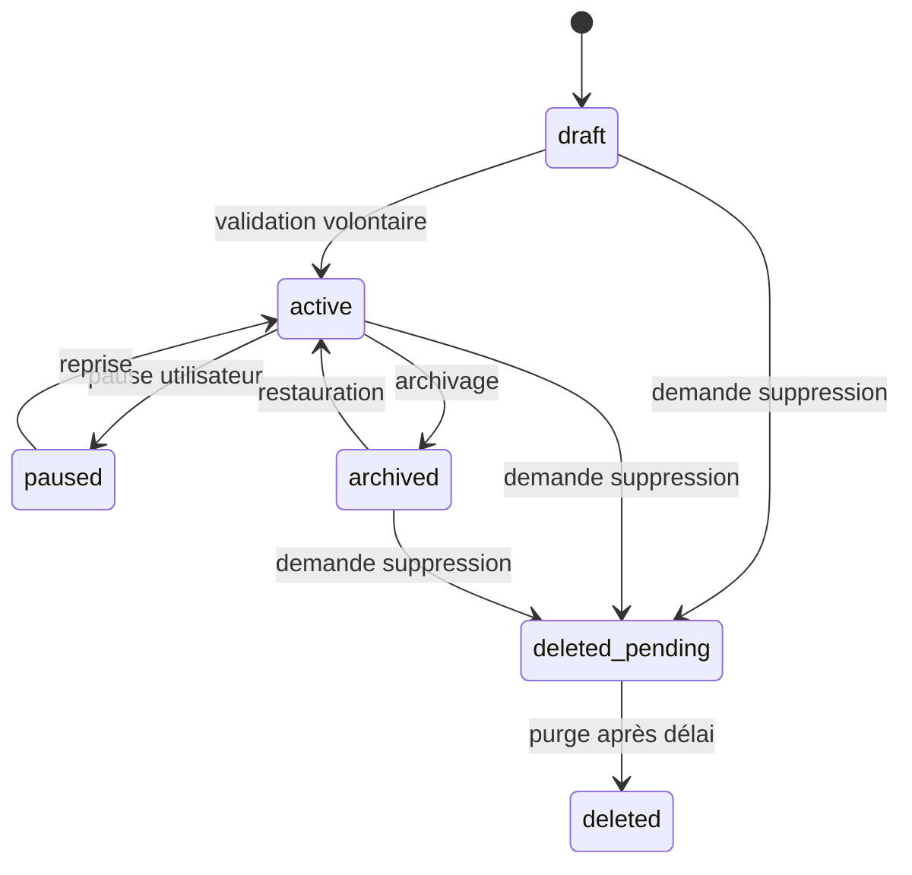
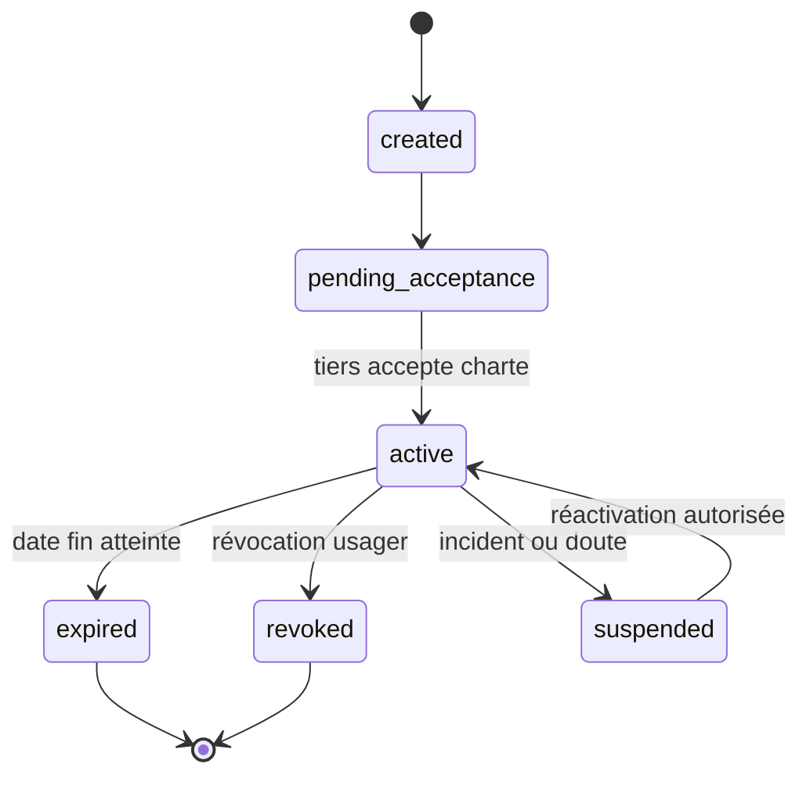
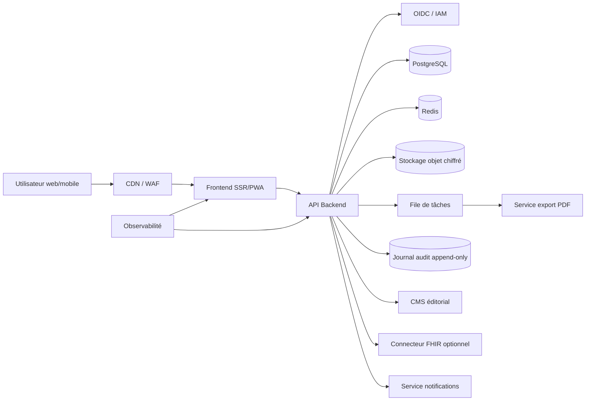

# Spécifications fonctionnelles et techniques — Outil web interactif **La Fleur de Patricia**

## 1. Objet du document

Ce document décrit de manière exhaustive un outil web permettant de transformer le carnet **La Fleur de Patricia — Carnet du rétablissement en santé mentale à destination de l’usager, de son proche et du professionnel** en une expérience numérique structurée, sécurisée, accessible, progressive et utilisable en ligne.

L’objectif est de fournir à une équipe produit, design, développement, sécurité, conformité, exploitation, accompagnement clinique et gouvernance usagers un cahier des charges complet pour concevoir, développer, déployer, maintenir et auditer une solution web centrée sur le rétablissement en santé mentale.

Le document couvre :

- la description du carnet source et de ses contenus ;
- la transformation du carnet papier en parcours numérique ;
- les parcours de l’usager, du proche, du pair-aidant et du professionnel ;
- la modélisation d’une **fleur personnelle de rétablissement** ;
- les modules pédagogiques correspondant aux onze pétales ;
- les espaces de notes, ressources, stratégies, objectifs et partage ;
- les exigences de sécurité, confidentialité, conformité et accessibilité ;
- l’architecture applicative et technique ;
- le modèle de données PostgreSQL ;
- les API REST ;
- les schémas JSON ;
- l’interopérabilité possible avec FHIR ;
- les règles métier, les tests, le MVP, la roadmap et les critères d’acceptation.

> **Avertissement important** : l’outil web décrit ici est un support d’information, de réflexion, de psychoéducation, d’expression personnelle, d’accompagnement et de soutien au rétablissement. Il ne doit pas être présenté comme un dispositif de diagnostic, un outil de prédiction, un traitement autonome, une décision médicale automatisée, une injonction au rétablissement ou une substitution à un accompagnement humain. Les contenus cliniques, juridiques et éditoriaux doivent être validés par des professionnels compétents, des représentants d’usagers, un DPO, un RSSI et un service juridique avant mise en production.

> **Point de vigilance éthique** : le carnet source insiste sur le fait que le rétablissement appartient à l’usager, qu’il s’agit d’un cheminement personnel et qu’aucune pression au rétablissement ne doit être exercée. L’outil numérique doit donc préserver la liberté de rythme, de silence, de non-réponse, de refus de partage et de retrait.

---

## 2. Résumé du carnet source

### 2.1 Nature de l’outil source

Le document source est une brochure de 53 pages intitulée **La Fleur de Patricia**. Il s’agit d’un carnet du rétablissement en santé mentale, destiné simultanément :

- à la personne concernée, nommée dans la source **usager** ;
- à ses proches ;
- aux professionnels ;
- aux pairs et pairs-aidants ;
- aux collectifs et services souhaitant comprendre ou soutenir le rétablissement.

Le carnet est daté d’octobre 2018. Les textes sont attribués à Pascale Fransolet ; le copyright est indiqué comme propriété de l’association **En Route** ; la reproduction est autorisée moyennant mention de la source. Les illustrations sont de Denis de Wind et la réalisation graphique de Bénédicte Stordeur. Toute adaptation numérique publique doit néanmoins être relue juridiquement, car une reproduction autorisée avec mention de la source n’implique pas automatiquement tous les droits d’adaptation, d’extraction, d’illustration, de diffusion commerciale, d’hébergement ou de création d’une base de données.

L’outil source est principalement :

- un **carnet pédagogique** ;
- un **support de discussion** ;
- un **support d’auto-réflexion** ;
- un **support de formation** ;
- un **objet de médiation** entre usagers, proches et professionnels ;
- un **outil de déstigmatisation** ;
- un **support de narration et d’espoir** ;
- un **cadre de compréhension critique** du paradigme du rétablissement.

### 2.2 Idée directrice

La source présente le rétablissement comme un concept, un modèle, un processus et un cheminement personnel. Elle distingue notamment :

- le **rétablissement expérientiel ou subjectif**, qui appartient exclusivement à la personne qui le vit ;
- le **rétablissement clinique ou objectif**, qui renvoie davantage à des critères mesurables par les professionnels ;
- l’**empowerment**, ou pouvoir d’agir ;
- l’**inclusion sociale** ;
- la **pair-aidance** ;
- les **stratégies personnelles** ;
- la place des **proches** ;
- la transformation des pratiques professionnelles vers un modèle orienté rétablissement.

Le carnet utilise la métaphore de la fleur inspirée du travail de Patricia E. Deegan. Le centre de la fleur représente le soi actuel, et les pétales représentent des pans importants de l’identité, de la vie, des ressources, des aspirations et des vulnérabilités. Cette métaphore peut être transformée en composant numérique central : **Ma fleur de rétablissement**.

### 2.3 Structure générale observée

| Partie source | Pages source indicatives | Fonction dans le carnet | Transformation numérique recommandée |
|---|---:|---|---|
| Couverture | 1 | Présentation du titre, de la cible et de l’univers graphique | Page d’accueil, identité visuelle, onboarding |
| Crédits | 2 | Responsables, droits, contributeurs, soutien | Page crédits, mentions légales, licence, attribution |
| Table des matières | 3 | Structure en introduction, avant-propos, 11 pétales, conclusion, bibliographie | Navigation globale, sommaire interactif, progression |
| Introduction | 4-5 | Paradigme du rétablissement, usager au centre, absence de pression | Module de contexte, charte éthique, consentement d’usage |
| Avant-propos | 6-8 | Métaphore de la fleur de Patricia, identité, vulnérabilités, possibles | Module “Ma fleur”, tutoriel, première activité personnelle |
| Pétale 1 — Histoire | 9-12 | Histoire du mouvement, Pussin/Pinel, usagers, pair-aidance, Belgique | Module pédagogique historique, frise interactive |
| Pétale 2 — Définitions | 13-17 | Définition du rétablissement, processus personnel, non-linéarité, forces | Module “Ma définition du rétablissement” |
| Pétale 3 — Espoir | 18-19 | Espoir comme cœur du rétablissement, rôle des autres | Module “Mes sources d’espoir” |
| Pétale 4 — Amour et amitié | 20-23 | Relations, proches, isolement, soutien, partenariat | Module “Mon réseau relationnel” |
| Pétale 5 — Entraide et pair-aidance | 24-28 | Entraide entre pairs, savoir expérientiel, pair-aidance | Module “Pairs, entraide et savoir expérientiel” |
| Pétale 6 — Se rétablir n’est pas guérir | 29-30 | Différence entre guérison et rétablissement | Module “Vivre avec / transformer / apprivoiser” |
| Pétale 7 — Rétablissement clinique | 31-32 | Vision clinique, critères, preuves, limites | Module “Mes objectifs personnels vs objectifs cliniques” |
| Pétale 8 — Pouvoir d’agir | 33-34 | Empowerment, choix, décision, savoir expérientiel | Module “Mes décisions et mon pouvoir d’agir” |
| Pétale 9 — Stratégies ou l’art de s’outiller | 35-36 | Boîte à outils, WRAP, CommonGround, Emilia | Module “Ma boîte à outils” |
| Pétale 10 — Professionnels | 37-40 | Partenariat, respect, empathie, confiance, décision partagée | Module “Préparer une rencontre avec un professionnel” |
| Pétale 11 — Questions et critiques | 41-43 | Risques, critiques, contexte social, citoyenneté | Module “Mes droits, limites et conditions de rétablissement” |
| Conclusion | 44-45 | Temps, catalyseurs, stigmatisation, confiance | Module final, bilan, projet de suite |
| Bibliographie | 46-47 | Sources et références | Bibliothèque et ressources validées |
| En images / notes | 48-52 | Illustrations, espace de notes | Galerie optionnelle, notes personnelles, carnet exportable |
| Dos / logo | 53 | Identité graphique et partenaires | Crédits et pied de page |

### 2.4 Principes éditoriaux à conserver

L’outil numérique doit conserver l’esprit du carnet source :

1. **Le rétablissement est personnel** : la personne conserve la direction de son propre parcours.
2. **Le rétablissement n’est pas une injonction** : l’outil ne doit pas pousser artificiellement à compléter, partager ou “réussir” un parcours.
3. **L’espoir est central** : l’interface doit soutenir l’espoir sans nier les difficultés.
4. **Les forces et ressources priment sur les déficiences** : les questions et prompts doivent partir des ressources, des aspirations et du sens.
5. **Les symptômes ne résument pas la personne** : l’identité ne doit jamais être réduite à un diagnostic.
6. **La pair-aidance est valorisée** : l’expérience vécue peut devenir une expertise, avec précaution sur le dévoilement de soi.
7. **Les proches sont partenaires, mais non propriétaires du parcours** : leurs contributions doivent être consenties, contextualisées et révocables.
8. **Les professionnels accompagnent sans se substituer** : ils peuvent soutenir, clarifier, guider, mais ne “rétablissent” pas la personne.
9. **Le contexte social compte** : logement, travail, précarité, stigmatisation, opportunités et droits doivent être intégrés.
10. **Les critiques du rétablissement sont légitimes** : l’outil doit éviter la normalisation, la culpabilisation, la sur-responsabilisation et l’usage gestionnaire du concept.
11. **Le temps est indispensable** : l’outil doit permettre une progression lente, fragmentée, répétée, suspendue ou reprise.

### 2.5 Nature des données produites par l’outil web

Une version numérique peut produire ou stocker des données particulièrement sensibles :

- identité de la personne ;
- informations sur son vécu psychique ;
- diagnostic éventuellement mentionné librement ;
- fragilités, vulnérabilités, symptômes, effets secondaires, traitements ;
- histoire de soins, hospitalisations, enfermement, mise en observation ;
- réseau familial, amical, social et professionnel ;
- coordonnées de proches et personnes ressources ;
- notes intimes ;
- objectifs personnels ;
- croyances, spiritualité, sexualité, aspirations ;
- difficultés sociales : logement, emploi, précarité, isolement ;
- contenus rédigés par des pairs, proches ou professionnels.

Ces données doivent être considérées au minimum comme des données personnelles très sensibles et, dans beaucoup de cas, comme des données de santé au sens du RGPD.

---

## 3. Objectifs produit

### 3.1 Objectif général

Mettre à disposition un outil web sécurisé, accessible et respectueux du pouvoir d’agir permettant à une personne de :

- découvrir les notions du rétablissement en santé mentale ;
- construire progressivement sa propre fleur de rétablissement ;
- identifier ses ressources, relations, espoirs, stratégies et objectifs ;
- prendre des notes et revenir sur son parcours ;
- préparer des échanges avec des proches, pairs-aidants ou professionnels ;
- exporter un carnet personnel lisible ;
- partager sélectivement certains éléments avec les personnes de son choix ;
- utiliser le carnet comme support d’accompagnement sans être réduite à un score ou un diagnostic.

### 3.2 Objectifs détaillés

1. **Numériser la structure du carnet** sous forme de modules progressifs correspondant aux onze pétales.
2. **Créer une expérience de lecture active**, combinant contenus pédagogiques courts, questions de réflexion, notes et activités.
3. **Permettre à la personne de composer sa fleur personnelle**, avec des pétales prédéfinis, personnalisables, ajoutables, masquables et réordonnables.
4. **Valoriser le savoir expérientiel**, en permettant de consigner ce que la personne sait d’elle-même, de ses forces et de ses stratégies.
5. **Soutenir l’espoir**, sans produire d’injonction positive ni nier les moments de découragement.
6. **Identifier les relations soutenantes**, les proches, les pairs, les collectifs, les professionnels et les environnements aidants.
7. **Structurer la boîte à outils personnelle** : stratégies de bien-être, stratégies en cas de difficulté, sources d’apaisement, signaux personnels, activités ressources.
8. **Préparer les échanges avec les professionnels** : objectifs, questions, préférences, décisions à discuter, points de vigilance.
9. **Introduire la décision partagée** sans remplacer le jugement clinique.
10. **Permettre un mode accompagné** dans lequel un professionnel ou un pair-aidant peut aider à la rédaction avec consentement explicite.
11. **Permettre un mode proche**, limité à des contributions demandées et approuvées par la personne.
12. **Permettre la reprise dans le temps**, avec brouillons, rappels doux, historique, version active et archives.
13. **Fournir un export PDF/Markdown/HTML imprimable**, fidèle à l’esprit du carnet, mais clairement daté et versionné.
14. **Assurer une confidentialité fine**, jusqu’au niveau du pétale, de l’entrée, de la note ou du document exporté.
15. **Éviter tout scoring de rétablissement** ; les indicateurs doivent mesurer la progression d’usage, pas la valeur de la personne.
16. **Permettre une interopérabilité optionnelle** avec les systèmes de santé via FHIR, lorsque cela est utile et juridiquement encadré.
17. **Respecter les exigences d’accessibilité**, notamment pour les troubles cognitifs, psychiques, visuels, moteurs et attentionnels.
18. **Prévenir les usages dangereux** : surveillance, pression institutionnelle, obligation de complétion, interprétation automatique non validée, accès abusif.

### 3.3 Non-objectifs

L’outil ne doit pas :

- diagnostiquer une pathologie ;
- évaluer automatiquement le niveau de rétablissement ;
- prédire une rechute ou une crise ;
- imposer une trajectoire de soins ;
- imposer le vocabulaire du rétablissement à une personne qui ne s’y reconnaît pas ;
- remplacer une relation thérapeutique, sociale ou de pair-aidance ;
- produire une décision médicale ;
- transmettre automatiquement des informations à un tiers ;
- rendre obligatoire la participation d’un proche ou d’un professionnel ;
- transformer les notes personnelles en données administratives sans consentement ;
- utiliser les données pour des décisions d’orientation, d’accès aux soins, d’assurance, d’emploi, de sanction ou de contrainte ;
- intégrer une IA générative interprétant les contenus sensibles sans AIPD, validation clinique, information claire, consentement et garde-fous.

### 3.4 Indicateurs de succès

| Indicateur | Cible MVP | Méthode de mesure | Limites éthiques |
|---|---:|---|---|
| Taux d’activation d’un carnet | ≥ 60 % des comptes créés | Événement de création du carnet | Ne pas confondre usage et rétablissement |
| Taux de création d’au moins 3 pétales personnels | ≥ 50 % | Comptage technique | Ne pas afficher comme performance clinique |
| Taux d’utilisation des notes | À mesurer | Nombre de notes créées | Pas d’analyse sémantique par défaut |
| Taux d’export réussi | ≥ 99 % | Logs techniques | Aucun contenu dans les logs |
| Temps médian pour accéder à son carnet | < 5 secondes | Monitoring applicatif | Hors environnements dégradés |
| Taux de révocation de partage honoré | 100 % | Tests d’autorisation | Critique sécurité |
| Taux de conformité accessibilité | Conforme cible RGAA/WCAG définie | Audit externe | À planifier avant production |
| Incidents de confidentialité | 0 majeur | Process RSSI/DPO | Tout incident doit être notifié selon procédure |
| Satisfaction qualitative | À mesurer en pilote | Entretiens, questionnaires facultatifs | Ne jamais en faire une obligation |

---

## 4. Périmètre fonctionnel

### 4.1 Utilisateurs cibles

| Profil | Description | Droits principaux | Restrictions |
|---|---|---|---|
| Personne concernée | Personne créant et utilisant son carnet | Créer, lire, modifier, supprimer, exporter, partager, révoquer | Aucune pression à compléter |
| Proche | Personne invitée par l’usager | Lire uniquement les éléments partagés, proposer une contribution si demandé | Aucun accès par défaut |
| Pair | Personne ayant une expérience similaire, invitée ou en groupe | Accompagner, partager des ressources, contribuer à des ateliers | Pas d’accès individuel sans consentement |
| Pair-aidant | Pair formé ou reconnu dans une structure | Faciliter un module, aider à rédiger, soutenir l’espoir | Pas de modification non approuvée |
| Professionnel traditionnel | Soignant, travailleur social, psychologue, coordinateur, éducateur | Accompagner, commenter, valider des informations factuelles si demandé | Ne peut pas prendre la main sur le carnet |
| Animateur de groupe | Personne animant un atelier collectif | Gérer session, contenus collectifs, ressources | Pas d’accès aux carnets privés sauf partage explicite |
| Administrateur fonctionnel | Paramétrage organisationnel | Gérer modèles, structures, bibliothèques, rôles | Pas de lecture du contenu personnel par défaut |
| Administrateur technique | Exploitation | Supervision technique, sauvegardes, incidents | Pas de lecture en clair du contenu sans procédure exceptionnelle |
| DPO | Protection des données | Audit conformité, droits RGPD, registre | Accès aux métadonnées nécessaires, contenu minimal |
| RSSI | Sécurité | Politique sécurité, audits, incidents | Accès technique strictement contrôlé |
| Super-administrateur éditeur | Gestion multi-tenant | Gestion des organisations et versions de contenu | Pas d’accès aux carnets sauf mandat légal/contractuel explicite |

### 4.2 Fonctionnalités incluses MVP

| Domaine | Fonctionnalité MVP | Priorité |
|---|---|---:|
| Compte | Création de compte, connexion, déconnexion, récupération sécurisée | P0 |
| Onboarding | Présentation, consentement, avertissement, choix du mode autonome/accompagné | P0 |
| Contenu | Modules éditoriaux courts des 11 pétales | P0 |
| Fleur | Création d’une fleur personnelle avec pétales personnalisables | P0 |
| Notes | Notes personnelles par module et notes libres | P0 |
| Stratégies | Boîte à outils personnelle | P0 |
| Export | Export PDF du carnet personnel | P0 |
| Partage | Partage sélectif en lecture seule par lien sécurisé ou compte invité | P1 |
| Accompagnement | Invitation d’un professionnel ou pair-aidant à commenter | P1 |
| Bibliothèque | Ressources validées et bibliographie | P1 |
| Accessibilité | Conformité aux critères prioritaires RGAA/WCAG | P0 |
| Audit | Journal d’accès et de modification | P0 |
| Administration | Gestion de modèles, contenus et organisations | P1 |

### 4.3 Fonctionnalités hors MVP ou avancées

| Fonctionnalité | Description | Conditions avant activation |
|---|---|---|
| Groupes d’entraide numériques | Sessions collectives, ateliers par pétale, contributions anonymisées | Charte, modération, consentement, risques sociaux |
| Interopérabilité FHIR | Export QuestionnaireResponse, CarePlan, DocumentReference | Accord SI santé, DPIA, sécurité, mapping validé |
| Mode hors-ligne | PWA avec stockage local chiffré | Analyse sécurité spécifique |
| Application mobile native | iOS/Android | Nécessité d’audit stores, sécurité locale |
| IA d’aide à la rédaction | Reformulation ou synthèse locale/contrôlée | AIPD, validation clinique, transparence, désactivation facile |
| Recommandations personnalisées | Suggestions de ressources selon modules | Pas de profilage sensible sans consentement |
| Données agrégées de pilotage | Statistiques anonymisées par structure | Seuils d’anonymat, minimisation, interdiction de surveillance |
| Signature numérique | Attestation de rédaction, approbation professionnelle | Analyse juridique selon contexte |

---

## 5. Principes éthiques, cliniques et de design

### 5.1 Charte de conception

L’interface doit être conçue selon les principes suivants :

1. **Autonomie** : la personne choisit ce qu’elle écrit, garde, partage ou supprime.
2. **Rythme** : aucune injonction de complétion ; les rappels sont doux, désactivables et non culpabilisants.
3. **Espoir réaliste** : l’outil soutient l’espoir sans minimiser la souffrance.
4. **Confidentialité par défaut** : rien n’est partagé sans action explicite.
5. **Non-réduction** : la personne n’est pas définie par son diagnostic ou ses symptômes.
6. **Participation** : proches, pairs et professionnels peuvent être invités, jamais imposés.
7. **Pluralité** : la personne peut refuser le mot rétablissement et utiliser son propre vocabulaire.
8. **Accessibilité psychique** : interface calme, sans urgence artificielle, avec pauses, sauvegarde automatique et formulation non jugeante.
9. **Traçabilité** : tout accès, export, partage, révocation et modification est journalisé.
10. **Réversibilité** : annuler, archiver, restaurer, révoquer, télécharger et supprimer doivent être simples.

### 5.2 Risques à prévenir

| Risque | Exemple | Garde-fou produit |
|---|---|---|
| Injonction au rétablissement | “Vous n’avez pas terminé votre parcours” | Formulations neutres : “reprendre plus tard” |
| Sur-responsabilisation | Faire porter à la personne l’échec du système | Module critique sur obstacles sociaux et droits |
| Surveillance institutionnelle | Suivi du nombre de notes par un service | Analytics agrégées, pas de contenu, finalité claire |
| Accès abusif par proches | Lecture de notes intimes | Partage granulaire, révocation, alertes d’accès |
| Accès abusif par professionnels | Consultation hors prise en charge | RBAC/ABAC, justification, audit, break-glass encadré |
| Déstabilisation émotionnelle | Question trop intrusive | Skip, pause, contenu de soutien, ressources d’aide |
| Confusion thérapeutique | Outil présenté comme traitement | Avertissement, supervision, validation clinique |
| Confusion juridique | Carnet confondu avec directives anticipées | Mentions de portée, liens vers outils spécifiques |
| Exploitation commerciale | Analyse des notes pour publicité | Interdiction contractuelle, pas de tracking tiers |
| Discrimination | Usage par employeur/assureur | Cloisonnement, CGU, information, interdiction de finalités secondaires |

### 5.3 Langage recommandé

Le langage doit être :

- simple ;
- non infantilisant ;
- non culpabilisant ;
- centré sur la personne ;
- compatible avec le vocabulaire des usagers ;
- adaptable aux usages locaux ;
- traduisible ;
- validé avec des représentants d’usagers.

Éviter :

- “tu dois”, “il faut absolument”, “échec”, “non conforme”, “score faible”, “mauvaise réponse” ;
- les messages de type gamification compétitive ;
- les indicateurs rouges anxiogènes ;
- les injonctions “pense positif” ;
- les formulations qui opposent brutalement patient et professionnel ;
- les suggestions automatiques interprétant la gravité d’une situation.

Préférer :

- “vous pouvez”, “à votre rythme”, “passer cette étape”, “reprendre plus tard”, “ce qui compte pour vous”, “ce qui vous aide”, “ce que vous souhaitez partager”, “ce que vous souhaitez garder privé”.

---

## 6. Architecture de l’expérience utilisateur

### 6.1 Vue d’ensemble des espaces

L’application doit être organisée en sept espaces principaux :

| Espace | Objectif | Contenu principal |
|---|---|---|
| Accueil | Comprendre l’outil et entrer dans son carnet | Présentation, charte, consentement, reprise |
| Parcours en pétales | Lire et travailler les 11 modules | Contenu, exercices, notes, progression |
| Ma fleur | Visualiser et personnaliser son identité/ressources | Pétales, ressources, vulnérabilités, possibles |
| Ma boîte à outils | Regrouper stratégies et ressources | Actions utiles, milieux aidants, personnes ressources |
| Mes échanges | Préparer rencontre ou partage | Questions, objectifs, documents exportés |
| Bibliothèque | Accéder aux ressources | Bibliographie, liens, documents validés |
| Paramètres et confidentialité | Contrôler les données | Consentements, partages, exports, suppression |

### 6.2 Navigation recommandée

La navigation doit permettre :

- une entrée par module ;
- une entrée par besoin immédiat : “j’ai besoin d’espoir”, “je veux préparer un rendez-vous”, “je veux noter une stratégie”, “je veux partager quelque chose” ;
- une entrée par rôle : usager, proche, pair-aidant, professionnel ;
- une recherche plein texte dans les contenus personnels et éditoriaux, avec option de désactivation de l’indexation locale ;
- une reprise depuis le dernier point travaillé ;
- un mode “lecture seule” ;
- un mode “atelier” pour séances accompagnées.

### 6.3 Écran d’accueil personnalisé

L’écran d’accueil d’un carnet actif doit afficher :

- prénom ou nom d’usage choisi ;
- état du carnet : brouillon, actif, archivé ;
- bouton “Continuer là où j’en étais” ;
- raccourcis : Ma fleur, Mes notes, Ma boîte à outils, Exporter, Partager ;
- dernier module visité ;
- rappel de confidentialité ;
- accès rapide à “Masquer l’écran” si contexte sensible ;
- lien vers les ressources d’aide et d’urgence configurées localement, sans déclenchement automatique.

### 6.4 Composant “Masquer l’écran”

Pour protéger la confidentialité en environnement partagé :

- bouton visible en permanence ;
- raccourci clavier `Esc Esc` ou `Ctrl+Shift+H` ;
- masque instantané vers une page neutre ;
- option de verrouillage après masquage ;
- absence de contenu sensible dans le titre du navigateur ;
- désactivation possible de notifications sensibles.

### 6.5 Sauvegarde automatique

Règles :

- sauvegarde locale temporaire toutes les 10 secondes pendant la saisie ;
- sauvegarde serveur toutes les 30 secondes ou à la perte de focus ;
- indicateur discret : “brouillon enregistré” ;
- gestion de conflit si deux sessions modifient la même entrée ;
- versionnage à chaque validation explicite ;
- aucun contenu sensible dans les messages d’erreur.

### 6.6 Gestion des pauses émotionnelles

Chaque module doit proposer :

- bouton “faire une pause” ;
- bouton “passer cette question” ;
- bouton “j’y reviendrai plus tard” ;
- liens vers des ressources d’ancrage non médicalisées ;
- possibilité de verrouiller le module ;
- reprise simple ;
- absence de pénalité de complétion.

---

## 7. Modélisation fonctionnelle des onze pétales

### 7.1 Structure commune d’un module pétale

Chaque pétale doit être représenté par un modèle standard :

| Champ | Type | Description |
|---|---|---|
| `module_id` | string | Identifiant stable du module |
| `source_petale_number` | integer | Numéro de pétale source ou `0` pour intro/avant-propos |
| `title` | string | Titre affiché |
| `subtitle` | string | Sous-titre facultatif |
| `source_pages` | array | Pages source indicatives |
| `learning_objectives` | array | Objectifs pédagogiques |
| `content_blocks` | array | Textes éditoriaux, illustrations, citations courtes autorisées |
| `reflection_prompts` | array | Questions de réflexion personnelle |
| `activity_templates` | array | Activités structurées |
| `personal_outputs` | array | Données personnelles produites |
| `share_default` | enum | `private`, `shareable`, `professional_only`, `never_share` |
| `risk_level` | enum | Sensibilité du module |
| `accessibility_notes` | array | Précautions d’interface |
| `clinical_notes` | array | Points d’attention pour accompagnants |

### 7.2 Introduction — Comprendre le rétablissement

**Objectif numérique** : poser le cadre, expliquer que l’outil appartient à la personne, présenter le rétablissement personnel et prévenir toute pression.

Fonctions :

- page de contexte ;
- choix du vocabulaire préféré : rétablissement, chemin, parcours, mieux-être, projet de vie, autre ;
- consentement de départ ;
- charte : “Je peux avancer à mon rythme”, “Je peux ne pas répondre”, “Je contrôle mes partages”.

Sorties personnelles possibles :

- phrase d’intention personnelle ;
- vocabulaire choisi ;
- niveau de confort avec le mot “rétablissement” ;
- personnes avec lesquelles la personne souhaite éventuellement en parler.

### 7.3 Avant-propos — Ma fleur personnelle

**Objectif numérique** : introduire la métaphore de la fleur et permettre à la personne de créer une première représentation de son identité actuelle.

Pétales proposés par défaut, personnalisables :

- amis ;
- culture ;
- famille ;
- travail ;
- formation ;
- spiritualité ;
- rêves ;
- espoirs ;
- sexualité ;
- pétale des possibles ;
- vulnérabilités.

La personne doit pouvoir :

- renommer les pétales ;
- masquer un pétale ;
- ajouter un pétale ;
- réordonner les pétales ;
- associer une couleur ou icône non stigmatisante ;
- écrire une note par pétale ;
- indiquer si le pétale est une force, une aspiration, une zone fragile, une ressource, une question ou un mélange ;
- ajouter des éléments concrets : personnes, lieux, activités, valeurs, souvenirs, objectifs ;
- créer une version “ancienne”, “actuelle” et “future” de la fleur ;
- exporter la fleur seule ou dans le carnet complet.

### 7.4 Pétale 1 — Histoire

**Objectif numérique** : expliquer que le rétablissement est porté par des mouvements d’usagers et par l’histoire de la pair-aidance.

Fonctions :

- frise chronologique interactive ;
- fiches courtes : Pussin/Pinel, Alcooliques Anonymes, mouvements d’usagers, Judi Chamberlin, savoir expérientiel, Belgique ;
- activité “quelle histoire m’a donné de l’espoir ?” ;
- espace “récits qui m’ont aidé”.

Données personnelles :

- témoignages ou récits inspirants ;
- livres, vidéos, personnes ou expériences donnant espoir ;
- moments où la personne a senti qu’un autre chemin était possible.

### 7.5 Pétale 2 — Définitions

**Objectif numérique** : permettre à la personne de définir son propre rétablissement.

Fonctions :

- explication de la non-linéarité ;
- exercices sur forces, limites, sens, rôles, valeurs ;
- activité “ma définition en une phrase” ;
- activité “ce que le rétablissement n’est pas pour moi”.

Données personnelles :

- définition personnelle ;
- mots associés ;
- mots refusés ;
- forces identifiées ;
- limites acceptées ou à explorer ;
- rôles importants : ami, parent, travailleur, artiste, citoyen, pair, autre.

### 7.6 Pétale 3 — Espoir

**Objectif numérique** : aider la personne à identifier ce qui soutient l’espoir, y compris lorsque celui-ci est faible ou absent.

Fonctions :

- liste de sources d’espoir ;
- “boîte d’espoir” : phrases, personnes, images, souvenirs, musiques, lieux ;
- option “quand je n’ai pas d’espoir, qui peut le garder pour moi ?” ;
- messages de rappel configurables par la personne.

Données personnelles :

- sources d’espoir ;
- signaux que l’espoir revient ;
- personnes qui croient en moi ;
- choses que je veux protéger.

### 7.7 Pétale 4 — Amour et amitié

**Objectif numérique** : cartographier le réseau de relations, les liens soutenants, les besoins d’information des proches et les limites de partage.

Fonctions :

- carte relationnelle ;
- distinction proches / amis / pairs / professionnels / collectifs / lieux ;
- champ “ce qui me fait du bien dans cette relation” ;
- champ “ce que je ne souhaite pas partager” ;
- invitation de proche avec consentement granulaire ;
- fiche pour proches : comment soutenir sans prendre la place de la personne.

Données personnelles :

- contacts ;
- rôles ;
- préférences de communication ;
- limites relationnelles ;
- personnes à éviter dans certains contextes ;
- besoins des proches, si la personne choisit de les documenter.

### 7.8 Pétale 5 — Entraide entre pairs et pair-aidance

**Objectif numérique** : valoriser l’entraide, expliquer la pair-aidance et permettre de repérer les groupes ou pairs aidants.

Fonctions :

- fiche “entraide entre pairs” ;
- fiche “pair-aidance professionnelle ou structurée” ;
- annuaire local facultatif de groupes et associations ;
- préparation d’un premier contact ;
- espace de notes sur ce que la personne souhaite ou ne souhaite pas dévoiler.

Données personnelles :

- expériences de soutien par les pairs ;
- groupes fréquentés ;
- envies de participation ;
- limites de dévoilement ;
- questions à poser à un pair-aidant.

### 7.9 Pétale 6 — Se rétablir n’est pas guérir

**Objectif numérique** : aider à différencier guérison, rétablissement, acceptation, transformation, apprentissage et vie avec les symptômes.

Fonctions :

- explication pédagogique ;
- activité “ce que je veux retrouver / ce que je veux transformer / ce que je veux créer” ;
- activité “symptômes et identité : ce qui ne me résume pas” ;
- notes sur médication ou soins uniquement si la personne le souhaite, avec avertissement de validation médicale.

Données personnelles :

- rapport au mot guérison ;
- objectifs de vie indépendants des symptômes ;
- éléments que la personne souhaite apprivoiser ;
- questions à discuter avec un médecin ou thérapeute.

### 7.10 Pétale 7 — Rétablissement clinique

**Objectif numérique** : expliquer la vision clinique sans laisser cette vision écraser les objectifs personnels.

Fonctions :

- comparaison rétablissement personnel / rétablissement clinique ;
- activité “mes objectifs personnels” ;
- activité “objectifs des professionnels et objectifs à moi” ;
- espace de préparation d’entretien clinique ;
- possibilité de masquer entièrement le module si vécu comme trop médicalisant.

Données personnelles :

- objectifs personnels ;
- objectifs discutés avec professionnels ;
- indicateurs personnels de mieux-être ;
- sujets que la personne souhaite que les professionnels abordent autrement.

### 7.11 Pétale 8 — Pouvoir d’agir, pouvoir de vie

**Objectif numérique** : soutenir la prise de décision, la connaissance de soi, la participation et l’empowerment individuel et collectif.

Fonctions :

- matrice “ce sur quoi j’ai du pouvoir / ce sur quoi j’ai besoin d’aide / ce qui dépend du contexte” ;
- fiche “mes droits et mes choix” ;
- activité “mes décisions importantes” ;
- activité “ce dont j’ai besoin pour décider” ;
- lien vers outils de décision partagée.

Données personnelles :

- décisions à préparer ;
- informations nécessaires ;
- personnes à consulter ;
- préférences ;
- expériences où la personne a repris du pouvoir.

### 7.12 Pétale 9 — Stratégies ou l’art de s’outiller

**Objectif numérique** : construire une boîte à outils personnelle et éventuellement articuler le carnet avec un WRAP ou un plan de crise.

Fonctions :

- création de stratégies ;
- catégorisation : quotidien, déclencheurs, signes avant-coureurs, grand mal-être, crise, après-crise ;
- rating facultatif d’utilité par la personne ;
- ressources : lieux, activités, musiques, objets, routines, personnes ;
- export “ma boîte à outils” ;
- lien optionnel vers un plan de crise ou directives anticipées déjà existantes.

Données personnelles :

- stratégies ;
- conditions d’utilisation ;
- stratégies qui n’aident pas ;
- signaux personnels ;
- actions à essayer ;
- actions validées par expérience.

### 7.13 Pétale 10 — Et les professionnels dans tout ça ?

**Objectif numérique** : faciliter une relation de partenariat, de respect, d’empathie, de confiance et de décision partagée.

Fonctions :

- préparation de rendez-vous ;
- liste de questions ;
- priorisation des sujets ;
- documents à apporter ;
- compte rendu personnel après rendez-vous ;
- partage temporaire avec un professionnel ;
- champ “ce que j’attends du professionnel” ;
- champ “ce que je ne souhaite pas”.

Données personnelles :

- objectifs de rendez-vous ;
- décisions à prendre ;
- préférences de communication ;
- sujets sensibles ;
- professionnels de confiance ;
- expériences positives et négatives de soins.

### 7.14 Pétale 11 — Questions et critiques

**Objectif numérique** : intégrer les limites et critiques du paradigme du rétablissement pour éviter la culpabilisation et reconnaître les obstacles sociaux.

Fonctions :

- contenu pédagogique sur risques de sur-responsabilisation ;
- activité “ce qui dépend de moi / ce qui dépend du réseau / ce qui dépend de la société” ;
- module droits, citoyenneté et obstacles ;
- espace “ce que l’organisation doit changer pour mieux m’accompagner” ;
- collecte qualitative facultative pour améliorer les services, avec anonymisation et consentement.

Données personnelles :

- obstacles sociaux ;
- discriminations ou stigmatisations vécues, si la personne souhaite les noter ;
- besoins en logement, travail, formation, lien social ;
- revendications ou souhaits de participation citoyenne.

### 7.15 Conclusion — Bilan et suite

**Objectif numérique** : aider la personne à faire un bilan non évaluatif et à décider de la suite.

Fonctions :

- synthèse personnelle ;
- export complet ;
- choix de révision dans le temps ;
- invitation à relire plus tard ;
- message sur le rythme personnel ;
- rappel que le carnet peut rester inachevé.

Données personnelles :

- phrase de clôture ;
- prochains petits pas ;
- personnes avec qui partager ;
- date souhaitée de relecture ;
- version active du carnet.

---

## 8. Fonctions détaillées du module “Ma fleur”

### 8.1 Concept

Le module **Ma fleur** est le cœur visuel et fonctionnel de l’outil. Il transforme la métaphore de Patricia E. Deegan en objet numérique interactif.

La fleur ne doit pas être un score. Elle doit être une représentation personnelle, modifiable, incomplète, non linéaire et non normative.

### 8.2 Objets fonctionnels

| Objet | Description | Exemple |
|---|---|---|
| Centre | Identité actuelle ou nom choisi | “Moi aujourd’hui”, prénom, symbole |
| Pétale | Dimension de vie | Amis, travail, famille, rêves, vulnérabilités |
| Entrée de pétale | Note ou élément concret | “la marche”, “mon frère”, “reprendre une formation” |
| Ressource | Élément qui soutient | Personne, lieu, activité, valeur, souvenir |
| Vulnérabilité | Élément fragile ou à protéger | Fatigue, isolement, surcharge |
| Possible | Aspiration, idée, rêve, exploration | Projet, formation, voyage, rencontre |
| Lien | Relation entre deux pétales | Travail lié à confiance, amis liés à espoir |
| Version | État de la fleur à une date | Ancienne fleur, fleur actuelle, fleur souhaitée |

### 8.3 Éditeur visuel

L’éditeur doit permettre :

- création d’un pétale par bouton ;
- glisser-déposer avec alternative clavier ;
- formulaire textuel équivalent pour accessibilité ;
- zoom et affichage liste ;
- couleurs personnalisables avec contraste garanti ;
- icônes non médicalisantes ;
- vue “fleur” et vue “tableau” ;
- impression en noir et blanc ;
- export SVG/PNG/PDF ;
- masquage d’un pétale dans un export ;
- annotation de sensibilité par pétale.

### 8.4 Types de pétales

| Type | Description | Partage par défaut |
|---|---|---|
| `resource` | Force ou ressource | Privé |
| `relationship` | Relation ou réseau | Privé |
| `activity` | Activité ou rôle | Privé |
| `identity` | Dimension identitaire | Très privé |
| `hope` | Rêve, espoir, aspiration | Privé |
| `vulnerability` | Fragilité, limite, risque | Très privé |
| `care` | Soins, traitement, relation professionnelle | Très privé |
| `social_context` | Logement, emploi, droits, finances | Très privé |
| `custom` | Catégorie libre | Privé |

### 8.5 États d’un pétale

Un pétale peut avoir les états suivants :

- `draft` : brouillon ;
- `active` : visible dans la fleur ;
- `hidden` : masqué mais conservé ;
- `archived` : archivé ;
- `deleted_pending` : suppression programmée ;
- `deleted` : supprimé définitivement selon politique de rétention.

### 8.6 Actions sensibles

Les actions suivantes doivent déclencher une confirmation explicite :

- partage d’un pétale ;
- ajout d’un proche à un pétale ;
- export contenant un pétale sensible ;
- suppression définitive ;
- ajout d’une information sur un tiers ;
- passage d’un brouillon en version active ;
- publication dans un groupe ou atelier.

---

## 9. Notes, journal et traces personnelles

### 9.1 Types de notes

| Type de note | Description | Exemple d’usage |
|---|---|---|
| Note libre | Texte personnel hors module | Journal intime, idées |
| Note de pétale | Note rattachée à un pétale | “Ce pétale est important cette semaine” |
| Note de module | Réflexion sur un chapitre | Réponse à une question |
| Note de rendez-vous | Préparation ou compte rendu | Questions au psychiatre |
| Note de ressource | Élément aidant | Lieu, association, livre |
| Note de crise | Information utile en difficulté | Peut être liée à un plan de crise |
| Note de proche | Contribution externe demandée | “Ce que j’observe quand tu vas mieux” |
| Note professionnelle | Commentaire d’un professionnel | Visible selon droits |

### 9.2 Confidentialité des notes

Chaque note doit porter :

- propriétaire ;
- auteur ;
- date ;
- statut ;
- sensibilité ;
- portée de partage ;
- historique de modification ;
- consentements associés ;
- indicateur d’inclusion dans export.

### 9.3 Versionnage

Règles :

- chaque modification sauvegarde une révision technique ;
- l’utilisateur voit un historique simplifié ;
- restauration possible ;
- différences textuelles visibles ;
- suppression logique avant purge ;
- rétention configurable ;
- exports horodatés et liés à une version.

### 9.4 Journal sans surveillance

L’outil peut proposer un journal, mais il ne doit pas :

- exiger une écriture quotidienne ;
- analyser émotionnellement les notes par défaut ;
- détecter automatiquement un risque ;
- envoyer des alertes à des tiers sans mécanisme juridiquement validé ;
- transformer le journal en indicateur de compliance.

---

## 10. Partage, collaboration et accompagnement

### 10.1 Philosophie de partage

Le partage doit être **opt-in**, granulaire, révocable et compréhensible. L’absence de partage est le comportement par défaut.

### 10.2 Niveaux de partage

| Niveau | Description | Exemple |
|---|---|---|
| Aucun | Contenu privé | Note personnelle |
| Lecture ponctuelle | Lien ou accès expirant | Export pour un rendez-vous |
| Lecture permanente | Accès tant que non révoqué | Professionnel référent |
| Commentaire | Le tiers peut commenter sans modifier | Pair-aidant |
| Contribution proposée | Le tiers propose un ajout à valider | Proche |
| Co-rédaction accompagnée | Saisie en présence ou à distance avec validation | Atelier avec professionnel |
| Export externe | PDF téléchargé ou imprimé | Perte de contrôle après téléchargement |

### 10.3 Matrice de droits

| Action | Personne concernée | Proche | Pair-aidant | Professionnel | Admin fonctionnel | Admin technique |
|---|---:|---:|---:|---:|---:|---:|
| Créer carnet | oui | non | non | avec mandat | non | non |
| Lire tout le carnet | oui | non par défaut | non par défaut | non par défaut | non | non |
| Modifier contenu personnel | oui | non | non | non | non | non |
| Proposer commentaire | oui | si invité | si invité | si invité | non | non |
| Valider proposition | oui | non | non | non | non | non |
| Exporter | oui | si autorisé | si autorisé | si autorisé | non | non |
| Partager | oui | non | non | non | non | non |
| Révoquer partage | oui | non | non | non | non | non |
| Consulter logs personnels | oui | non | non | selon droits | non | non |
| Paramétrer contenu modèle | non | non | non | selon rôle | oui | non |
| Maintenance technique | non | non | non | non | non | oui, sans contenu lisible |

### 10.4 Workflow de contribution externe

1. La personne invite un tiers sur un périmètre précis.
2. Le tiers accepte une charte de confidentialité.
3. Le tiers voit uniquement les sections autorisées.
4. Le tiers rédige une contribution ou un commentaire.
5. La contribution reste en attente.
6. La personne reçoit une notification non sensible.
7. La personne accepte, modifie, archive ou refuse.
8. La décision est journalisée.
9. Le tiers ne peut pas voir les sections non partagées.

### 10.5 Mode atelier

Le mode atelier permet une séance accompagnée :

- création d’une session ;
- sélection de modules ;
- écran partagé possible ;
- prise de notes par la personne ou par un accompagnant ;
- validation de chaque saisie ;
- export de synthèse ;
- fin de session avec révocation automatique des accès temporaires ;
- journal de session.

---

## 11. Contenus éditoriaux et CMS

### 11.1 Types de blocs éditoriaux

| Type | Usage | Contraintes |
|---|---|---|
| `intro_text` | Introduction de module | Texte court, non culpabilisant |
| `source_summary` | Résumé du carnet source | Paraphrase, source mentionnée |
| `quote` | Citation courte | Vérifier droits, longueur limitée, attribution |
| `testimony` | Témoignage | Autorisation et contexte obligatoires |
| `reflection_prompt` | Question personnelle | Réponse facultative |
| `activity` | Exercice structuré | Accessibilité clavier |
| `info_box` | Encadré pédagogique | Pas de jargon excessif |
| `warning_box` | Prudence clinique/juridique | Clair, non anxiogène |
| `resource_link` | Lien externe | Vérification périodique |
| `bibliography_item` | Source | Métadonnées complètes |
| `illustration` | Image | Droits, alt text, licence |

### 11.2 Gouvernance des contenus

Chaque contenu doit avoir :

- identifiant stable ;
- titre ;
- type ;
- version ;
- auteur ;
- relecteur éditorial ;
- relecteur clinique ;
- relecteur usager ;
- statut : brouillon, en revue, validé, publié, retiré ;
- date de publication ;
- date de dernière revue ;
- date de revue programmée ;
- source ;
- droits/licence ;
- niveau de sensibilité ;
- variantes de langue ;
- texte alternatif si visuel ;
- statut d’accessibilité.

### 11.3 Politique de citations et droits

Le carnet source autorise la reproduction avec mention de la source. Pour une plateforme web publique, la politique recommandée est néanmoins :

- mentionner systématiquement **La Fleur de Patricia**, association En Route, auteure, illustrateur et date ;
- éviter de reproduire l’intégralité du texte dans l’application sans validation ;
- privilégier des résumés et activités originales inspirées du carnet ;
- demander une autorisation explicite pour l’utilisation des illustrations originales ;
- conserver un registre des contenus reproduits ;
- indiquer clairement les modifications et adaptations ;
- prévoir une procédure de retrait de contenu.

### 11.4 Bibliothèque de ressources

La bibliothèque doit permettre :

- classement par thème : espoir, pair-aidance, empowerment, proches, professionnels, WRAP, droits, logement, emploi, stigmatisation ;
- filtrage par territoire ;
- statut de validation ;
- date de vérification du lien ;
- lien externe ouvert avec avertissement ;
- ressources internes ;
- export de bibliographie ;
- signalement d’un lien mort.

---

## 12. Règles métier

### 12.1 Règles générales

| Code | Règle |
|---|---|
| RM-001 | Un carnet appartient toujours à une personne concernée ou à un compte pseudonyme explicitement créé pour elle. |
| RM-002 | Aucune section n’est obligatoire, sauf consentement initial et acceptation des informations de confidentialité. |
| RM-003 | Le système doit permettre de passer un module sans justification. |
| RM-004 | La progression ne doit pas être présentée comme une mesure de rétablissement. |
| RM-005 | Les notes personnelles sont privées par défaut. |
| RM-006 | Un tiers ne peut jamais accéder à un contenu sans invitation, habilitation et journalisation. |
| RM-007 | Toute contribution externe doit être validée par la personne avant intégration dans son carnet actif. |
| RM-008 | Tout export doit afficher la date, la version, le périmètre exporté et un avertissement de confidentialité. |
| RM-009 | La suppression d’un carnet doit être possible selon les obligations légales et contractuelles. |
| RM-010 | L’outil ne doit pas calculer de score clinique de rétablissement. |
| RM-011 | Les rappels doivent être désactivables. |
| RM-012 | Les données de tiers doivent être minimisées et signalées comme telles. |
| RM-013 | Un professionnel ne peut pas modifier un contenu personnel sans mécanisme explicite de co-rédaction et validation. |
| RM-014 | Les actions de type “break-glass” doivent être exceptionnelles, justifiées, horodatées, revues et notifiées selon politique. |
| RM-015 | Les contenus éditoriaux doivent être versionnés, et le carnet doit indiquer la version du référentiel utilisée. |

### 12.2 Règles de complétion

| Élément | Obligatoire | Règle |
|---|---:|---|
| Création compte | Oui si stockage serveur | Peut être pseudonymisée selon contexte |
| Consentement confidentialité | Oui | Versionné |
| Nom civil | Non | Privilégier nom d’usage |
| Date de naissance | Non par défaut | Obligatoire seulement si intégration dossier patient |
| Diagnostic | Non | Jamais demandé comme préalable |
| Traitements | Non | Avertissement : ne pas modifier sans avis médical |
| Pétales | Non | Modifiables et masquables |
| Notes | Non | Privées par défaut |
| Proches | Non | Invitation explicite |
| Professionnels | Non | Invitation explicite ou contexte organisationnel |
| Export | Non | Action volontaire |

### 12.3 Règles de sensibilité

| Sensibilité | Exemples | Protection |
|---|---|---|
| Faible | Préférences d’affichage | Authentification standard |
| Moyenne | Progression module, favoris | Privé, pas de partage par défaut |
| Élevée | Notes, objectifs, relations | Chiffrement, audit, partage explicite |
| Très élevée | Vulnérabilités, crise, diagnostic, traitements, sexualité, trauma | Confirmation renforcée, masquage export, accès restreint |
| Critique | Risque immédiat mentionné, données de tiers sensibles | Politique clinique/juridique locale, pas d’automatisation sans protocole |

### 12.4 Règles de notification

Les notifications ne doivent jamais contenir de données sensibles en clair.

Exemples autorisés :

- “Vous avez une nouvelle proposition à relire.”
- “Votre export est prêt.”
- “Un partage arrive à expiration.”

Exemples interdits :

- “Votre note sur vos symptômes a été commentée.”
- “Votre psychiatre a lu votre pétale vulnérabilités.”
- “Votre plan de crise a été ouvert.”

### 12.5 Règles de modération des groupes

Si des espaces collectifs sont activés :

- charte obligatoire ;
- pas de publication automatique de données de santé ;
- pseudonymat possible ;
- signalement de contenu ;
- modération humaine formée ;
- interdiction de conseils médicaux directifs ;
- procédure pour situations inquiétantes ;
- possibilité de quitter le groupe ;
- export des contributions personnelles ;
- suppression ou anonymisation selon politique.

---

## 13. Modèle conceptuel de données

### 13.1 Entités principales

| Entité | Description |
|---|---|
| `Organization` | Structure utilisatrice ou éditeur |
| `User` | Compte applicatif |
| `IdentityProfile` | Profil personnel minimal |
| `RecoveryWorkbook` | Carnet de rétablissement d’une personne |
| `WorkbookVersion` | Version du carnet |
| `ModuleTemplate` | Module éditorial type |
| `ModuleProgress` | Progression personnelle dans un module |
| `ReflectionEntry` | Réponse ou note personnelle |
| `Flower` | Fleur personnelle |
| `FlowerPetal` | Pétale personnel |
| `FlowerPetalEntry` | Élément dans un pétale |
| `Strategy` | Stratégie de rétablissement |
| `ResourceItem` | Ressource personnelle ou bibliographique |
| `ContactPerson` | Proche, pair, professionnel, personne ressource |
| `ShareGrant` | Autorisation de partage |
| `Contribution` | Proposition ou commentaire d’un tiers |
| `ExportJob` | Export PDF/HTML/Markdown |
| `ConsentRecord` | Consentement et information |
| `AuditEvent` | Journal d’accès et d’action |
| `Attachment` | Document ou média téléversé |
| `ContentBlock` | Bloc éditorial CMS |
| `ReviewRecord` | Relecture éditoriale/clinique/usager |

### 13.2 Relations principales

- Une organisation possède plusieurs utilisateurs, contenus et modèles.
- Un utilisateur peut avoir un ou plusieurs carnets selon politique.
- Un carnet possède plusieurs versions.
- Un carnet utilise une version donnée du référentiel éditorial.
- Une fleur appartient à un carnet.
- Une fleur possède plusieurs pétales.
- Un pétale possède plusieurs entrées.
- Une note peut être liée à un module, un pétale, une stratégie, un rendez-vous ou être libre.
- Un partage porte sur un périmètre précis : carnet, module, note, pétale, export.
- Une contribution est liée à un partage et doit être validée.
- Tous les accès et modifications produisent un événement d’audit.

### 13.3 Cycle de vie du carnet



### 13.4 Cycle de vie d’un partage



---

## 14. Modèle PostgreSQL proposé

### 14.1 Extensions et conventions

```sql
CREATE EXTENSION IF NOT EXISTS pgcrypto;
CREATE EXTENSION IF NOT EXISTS citext;

-- Convention :
-- - identifiants UUID générés par gen_random_uuid()
-- - horodatage timestamptz en UTC
-- - suppression logique via deleted_at
-- - JSONB pour contenus flexibles versionnés
-- - contraintes CHECK pour états métiers
-- - Row Level Security activable selon stratégie multi-tenant
```

### 14.2 Types énumérés

```sql
CREATE TYPE workbook_status AS ENUM (
  'draft', 'active', 'paused', 'archived', 'deleted_pending', 'deleted'
);

CREATE TYPE sensitivity_level AS ENUM (
  'low', 'medium', 'high', 'very_high', 'critical'
);

CREATE TYPE share_scope_type AS ENUM (
  'workbook', 'module', 'flower', 'petal', 'reflection', 'strategy', 'resource', 'export'
);

CREATE TYPE share_permission AS ENUM (
  'read', 'comment', 'suggest', 'co_write', 'export'
);

CREATE TYPE actor_role AS ENUM (
  'person', 'relative', 'peer', 'peer_support_worker', 'professional',
  'facilitator', 'functional_admin', 'technical_admin', 'dpo', 'rssi', 'system'
);

CREATE TYPE contribution_status AS ENUM (
  'draft', 'submitted', 'accepted', 'accepted_with_changes', 'rejected', 'archived'
);

CREATE TYPE export_format AS ENUM ('pdf', 'html', 'markdown', 'json', 'fhir');

CREATE TYPE audit_action AS ENUM (
  'create', 'read', 'update', 'delete', 'restore', 'export', 'share', 'revoke_share',
  'login', 'logout', 'break_glass', 'consent', 'comment', 'suggest', 'admin_change'
);
```

### 14.3 Tables organisations et comptes

```sql
CREATE TABLE organizations (
  id uuid PRIMARY KEY DEFAULT gen_random_uuid(),
  name text NOT NULL,
  slug citext UNIQUE NOT NULL,
  country_code char(2) NOT NULL DEFAULT 'BE',
  default_locale text NOT NULL DEFAULT 'fr-BE',
  data_region text NOT NULL,
  hds_required boolean NOT NULL DEFAULT false,
  created_at timestamptz NOT NULL DEFAULT now(),
  updated_at timestamptz NOT NULL DEFAULT now(),
  deleted_at timestamptz
);

CREATE TABLE users (
  id uuid PRIMARY KEY DEFAULT gen_random_uuid(),
  organization_id uuid REFERENCES organizations(id),
  email citext,
  phone text,
  auth_subject text UNIQUE,
  role actor_role NOT NULL DEFAULT 'person',
  locale text NOT NULL DEFAULT 'fr-FR',
  mfa_enabled boolean NOT NULL DEFAULT false,
  account_status text NOT NULL DEFAULT 'active'
    CHECK (account_status IN ('invited','active','suspended','closed','deleted')),
  last_login_at timestamptz,
  created_at timestamptz NOT NULL DEFAULT now(),
  updated_at timestamptz NOT NULL DEFAULT now(),
  deleted_at timestamptz,
  CONSTRAINT users_contact_check CHECK (email IS NOT NULL OR phone IS NOT NULL OR auth_subject IS NOT NULL)
);

CREATE TABLE identity_profiles (
  id uuid PRIMARY KEY DEFAULT gen_random_uuid(),
  user_id uuid NOT NULL REFERENCES users(id) ON DELETE CASCADE,
  display_name text NOT NULL,
  preferred_pronouns text,
  birth_date date,
  external_patient_id text,
  civil_name_encrypted bytea,
  emergency_hide_enabled boolean NOT NULL DEFAULT true,
  metadata jsonb NOT NULL DEFAULT '{}'::jsonb,
  created_at timestamptz NOT NULL DEFAULT now(),
  updated_at timestamptz NOT NULL DEFAULT now()
);
```

### 14.4 Tables consentements

```sql
CREATE TABLE consent_records (
  id uuid PRIMARY KEY DEFAULT gen_random_uuid(),
  user_id uuid NOT NULL REFERENCES users(id),
  organization_id uuid REFERENCES organizations(id),
  consent_type text NOT NULL,
  consent_version text NOT NULL,
  status text NOT NULL CHECK (status IN ('granted','refused','withdrawn','expired')),
  granted_at timestamptz,
  withdrawn_at timestamptz,
  evidence jsonb NOT NULL DEFAULT '{}'::jsonb,
  ip_hash text,
  user_agent_hash text,
  created_at timestamptz NOT NULL DEFAULT now()
);

CREATE INDEX consent_records_user_idx ON consent_records(user_id, consent_type, status);
```

### 14.5 Tables carnet et versions

```sql
CREATE TABLE recovery_workbooks (
  id uuid PRIMARY KEY DEFAULT gen_random_uuid(),
  owner_user_id uuid NOT NULL REFERENCES users(id),
  organization_id uuid REFERENCES organizations(id),
  title text NOT NULL DEFAULT 'Mon carnet du rétablissement',
  status workbook_status NOT NULL DEFAULT 'draft',
  vocabulary_preference text,
  editorial_template_version text NOT NULL,
  active_version_id uuid,
  sensitivity sensitivity_level NOT NULL DEFAULT 'very_high',
  created_at timestamptz NOT NULL DEFAULT now(),
  updated_at timestamptz NOT NULL DEFAULT now(),
  archived_at timestamptz,
  deleted_at timestamptz
);

CREATE TABLE workbook_versions (
  id uuid PRIMARY KEY DEFAULT gen_random_uuid(),
  workbook_id uuid NOT NULL REFERENCES recovery_workbooks(id) ON DELETE CASCADE,
  version_number integer NOT NULL,
  status text NOT NULL CHECK (status IN ('draft','active','archived','superseded')),
  snapshot jsonb NOT NULL,
  created_by uuid REFERENCES users(id),
  created_at timestamptz NOT NULL DEFAULT now(),
  UNIQUE(workbook_id, version_number)
);

ALTER TABLE recovery_workbooks
  ADD CONSTRAINT fk_active_version
  FOREIGN KEY (active_version_id) REFERENCES workbook_versions(id);
```

### 14.6 Tables modules et progression

```sql
CREATE TABLE module_templates (
  id uuid PRIMARY KEY DEFAULT gen_random_uuid(),
  module_key text NOT NULL,
  version text NOT NULL,
  title text NOT NULL,
  source_petale_number integer,
  source_pages int[] NOT NULL DEFAULT '{}',
  content jsonb NOT NULL,
  default_sensitivity sensitivity_level NOT NULL DEFAULT 'medium',
  status text NOT NULL CHECK (status IN ('draft','review','published','retired')),
  published_at timestamptz,
  created_at timestamptz NOT NULL DEFAULT now(),
  updated_at timestamptz NOT NULL DEFAULT now(),
  UNIQUE(module_key, version)
);

CREATE TABLE module_progress (
  id uuid PRIMARY KEY DEFAULT gen_random_uuid(),
  workbook_id uuid NOT NULL REFERENCES recovery_workbooks(id) ON DELETE CASCADE,
  module_template_id uuid NOT NULL REFERENCES module_templates(id),
  status text NOT NULL DEFAULT 'not_started'
    CHECK (status IN ('not_started','started','paused','completed','skipped','hidden')),
  started_at timestamptz,
  completed_at timestamptz,
  last_opened_at timestamptz,
  progress_percent integer CHECK (progress_percent BETWEEN 0 AND 100),
  private_notes_count integer NOT NULL DEFAULT 0,
  metadata jsonb NOT NULL DEFAULT '{}'::jsonb,
  created_at timestamptz NOT NULL DEFAULT now(),
  updated_at timestamptz NOT NULL DEFAULT now(),
  UNIQUE(workbook_id, module_template_id)
);
```

### 14.7 Tables fleur

```sql
CREATE TABLE flowers (
  id uuid PRIMARY KEY DEFAULT gen_random_uuid(),
  workbook_id uuid NOT NULL REFERENCES recovery_workbooks(id) ON DELETE CASCADE,
  label text NOT NULL DEFAULT 'Ma fleur',
  center_label text,
  view_mode text NOT NULL DEFAULT 'current'
    CHECK (view_mode IN ('past','current','future','custom')),
  layout jsonb NOT NULL DEFAULT '{}'::jsonb,
  created_at timestamptz NOT NULL DEFAULT now(),
  updated_at timestamptz NOT NULL DEFAULT now(),
  deleted_at timestamptz
);

CREATE TABLE flower_petals (
  id uuid PRIMARY KEY DEFAULT gen_random_uuid(),
  flower_id uuid NOT NULL REFERENCES flowers(id) ON DELETE CASCADE,
  label text NOT NULL,
  petal_type text NOT NULL DEFAULT 'custom',
  description text,
  position_index integer NOT NULL DEFAULT 0,
  color_token text,
  icon_token text,
  sensitivity sensitivity_level NOT NULL DEFAULT 'high',
  status text NOT NULL DEFAULT 'active'
    CHECK (status IN ('draft','active','hidden','archived','deleted_pending','deleted')),
  include_in_default_export boolean NOT NULL DEFAULT false,
  created_by uuid REFERENCES users(id),
  created_at timestamptz NOT NULL DEFAULT now(),
  updated_at timestamptz NOT NULL DEFAULT now(),
  deleted_at timestamptz
);

CREATE TABLE flower_petal_entries (
  id uuid PRIMARY KEY DEFAULT gen_random_uuid(),
  petal_id uuid NOT NULL REFERENCES flower_petals(id) ON DELETE CASCADE,
  entry_type text NOT NULL DEFAULT 'note'
    CHECK (entry_type IN ('note','resource','person','place','activity','goal','vulnerability','possible','question')),
  title text,
  body text,
  tags text[] NOT NULL DEFAULT '{}',
  sensitivity sensitivity_level NOT NULL DEFAULT 'high',
  position_index integer NOT NULL DEFAULT 0,
  created_by uuid REFERENCES users(id),
  created_at timestamptz NOT NULL DEFAULT now(),
  updated_at timestamptz NOT NULL DEFAULT now(),
  deleted_at timestamptz
);
```

### 14.8 Tables notes, stratégies et ressources

```sql
CREATE TABLE reflection_entries (
  id uuid PRIMARY KEY DEFAULT gen_random_uuid(),
  workbook_id uuid NOT NULL REFERENCES recovery_workbooks(id) ON DELETE CASCADE,
  module_progress_id uuid REFERENCES module_progress(id) ON DELETE SET NULL,
  petal_id uuid REFERENCES flower_petals(id) ON DELETE SET NULL,
  prompt_key text,
  title text,
  body text NOT NULL,
  entry_kind text NOT NULL DEFAULT 'free_note'
    CHECK (entry_kind IN ('free_note','module_answer','appointment_note','journal','relative_input','professional_comment')),
  sensitivity sensitivity_level NOT NULL DEFAULT 'high',
  include_in_default_export boolean NOT NULL DEFAULT false,
  author_user_id uuid NOT NULL REFERENCES users(id),
  owner_user_id uuid NOT NULL REFERENCES users(id),
  contribution_id uuid,
  created_at timestamptz NOT NULL DEFAULT now(),
  updated_at timestamptz NOT NULL DEFAULT now(),
  deleted_at timestamptz
);

CREATE TABLE strategies (
  id uuid PRIMARY KEY DEFAULT gen_random_uuid(),
  workbook_id uuid NOT NULL REFERENCES recovery_workbooks(id) ON DELETE CASCADE,
  title text NOT NULL,
  description text,
  category text NOT NULL DEFAULT 'general'
    CHECK (category IN ('daily','trigger','warning_sign','distress','crisis','after_crisis','relationship','appointment','custom','general')),
  when_to_use text,
  how_to_use text,
  what_helps text,
  what_does_not_help text,
  user_effectiveness integer CHECK (user_effectiveness BETWEEN 0 AND 5),
  validated_by_experience boolean,
  sensitivity sensitivity_level NOT NULL DEFAULT 'high',
  include_in_default_export boolean NOT NULL DEFAULT false,
  created_by uuid REFERENCES users(id),
  created_at timestamptz NOT NULL DEFAULT now(),
  updated_at timestamptz NOT NULL DEFAULT now(),
  deleted_at timestamptz
);

CREATE TABLE resource_items (
  id uuid PRIMARY KEY DEFAULT gen_random_uuid(),
  workbook_id uuid REFERENCES recovery_workbooks(id) ON DELETE CASCADE,
  organization_id uuid REFERENCES organizations(id),
  resource_type text NOT NULL
    CHECK (resource_type IN ('personal','bibliography','web_link','association','service','place','book','video','document')),
  title text NOT NULL,
  description text,
  url text,
  tags text[] NOT NULL DEFAULT '{}',
  validation_status text NOT NULL DEFAULT 'unverified'
    CHECK (validation_status IN ('unverified','validated','expired','retired')),
  last_checked_at timestamptz,
  sensitivity sensitivity_level NOT NULL DEFAULT 'medium',
  created_by uuid REFERENCES users(id),
  created_at timestamptz NOT NULL DEFAULT now(),
  updated_at timestamptz NOT NULL DEFAULT now(),
  deleted_at timestamptz
);
```

### 14.9 Tables contacts et partage

```sql
CREATE TABLE contact_people (
  id uuid PRIMARY KEY DEFAULT gen_random_uuid(),
  workbook_id uuid NOT NULL REFERENCES recovery_workbooks(id) ON DELETE CASCADE,
  display_name text NOT NULL,
  relationship_type text NOT NULL
    CHECK (relationship_type IN ('relative','friend','peer','peer_support_worker','professional','association','other')),
  contact_encrypted bytea,
  notes text,
  consent_to_store boolean NOT NULL DEFAULT false,
  sensitivity sensitivity_level NOT NULL DEFAULT 'high',
  created_by uuid REFERENCES users(id),
  created_at timestamptz NOT NULL DEFAULT now(),
  updated_at timestamptz NOT NULL DEFAULT now(),
  deleted_at timestamptz
);

CREATE TABLE share_grants (
  id uuid PRIMARY KEY DEFAULT gen_random_uuid(),
  workbook_id uuid NOT NULL REFERENCES recovery_workbooks(id) ON DELETE CASCADE,
  owner_user_id uuid NOT NULL REFERENCES users(id),
  grantee_user_id uuid REFERENCES users(id),
  grantee_email citext,
  scope_type share_scope_type NOT NULL,
  scope_id uuid,
  permissions share_permission[] NOT NULL DEFAULT ARRAY['read']::share_permission[],
  expires_at timestamptz,
  status text NOT NULL DEFAULT 'pending'
    CHECK (status IN ('pending','active','expired','revoked','suspended')),
  access_token_hash text,
  created_at timestamptz NOT NULL DEFAULT now(),
  accepted_at timestamptz,
  revoked_at timestamptz,
  last_accessed_at timestamptz,
  metadata jsonb NOT NULL DEFAULT '{}'::jsonb
);

CREATE INDEX share_grants_scope_idx ON share_grants(workbook_id, scope_type, scope_id, status);
```

### 14.10 Tables contributions, exports, audit

```sql
CREATE TABLE contributions (
  id uuid PRIMARY KEY DEFAULT gen_random_uuid(),
  share_grant_id uuid NOT NULL REFERENCES share_grants(id) ON DELETE CASCADE,
  workbook_id uuid NOT NULL REFERENCES recovery_workbooks(id) ON DELETE CASCADE,
  target_type text NOT NULL,
  target_id uuid,
  author_user_id uuid NOT NULL REFERENCES users(id),
  body text NOT NULL,
  status contribution_status NOT NULL DEFAULT 'draft',
  reviewed_by uuid REFERENCES users(id),
  reviewed_at timestamptz,
  review_comment text,
  created_at timestamptz NOT NULL DEFAULT now(),
  updated_at timestamptz NOT NULL DEFAULT now()
);

CREATE TABLE export_jobs (
  id uuid PRIMARY KEY DEFAULT gen_random_uuid(),
  workbook_id uuid NOT NULL REFERENCES recovery_workbooks(id) ON DELETE CASCADE,
  requested_by uuid NOT NULL REFERENCES users(id),
  format export_format NOT NULL,
  scope jsonb NOT NULL,
  status text NOT NULL DEFAULT 'queued'
    CHECK (status IN ('queued','processing','completed','failed','expired','deleted')),
  file_object_key text,
  file_hash text,
  expires_at timestamptz,
  created_at timestamptz NOT NULL DEFAULT now(),
  completed_at timestamptz,
  deleted_at timestamptz
);

CREATE TABLE audit_events (
  id uuid PRIMARY KEY DEFAULT gen_random_uuid(),
  organization_id uuid REFERENCES organizations(id),
  actor_user_id uuid REFERENCES users(id),
  actor_role actor_role NOT NULL,
  action audit_action NOT NULL,
  target_type text NOT NULL,
  target_id uuid,
  workbook_id uuid,
  purpose text,
  legal_basis text,
  ip_hash text,
  user_agent_hash text,
  request_id text,
  metadata jsonb NOT NULL DEFAULT '{}'::jsonb,
  created_at timestamptz NOT NULL DEFAULT now()
);

CREATE INDEX audit_events_workbook_idx ON audit_events(workbook_id, created_at DESC);
CREATE INDEX audit_events_actor_idx ON audit_events(actor_user_id, created_at DESC);
```

### 14.11 Tables CMS et revue

```sql
CREATE TABLE content_blocks (
  id uuid PRIMARY KEY DEFAULT gen_random_uuid(),
  module_template_id uuid REFERENCES module_templates(id) ON DELETE CASCADE,
  block_key text NOT NULL,
  block_type text NOT NULL,
  locale text NOT NULL DEFAULT 'fr-FR',
  content jsonb NOT NULL,
  source_reference text,
  license_note text,
  status text NOT NULL DEFAULT 'draft'
    CHECK (status IN ('draft','review','approved','published','retired')),
  created_by uuid REFERENCES users(id),
  created_at timestamptz NOT NULL DEFAULT now(),
  updated_at timestamptz NOT NULL DEFAULT now(),
  UNIQUE(module_template_id, block_key, locale)
);

CREATE TABLE review_records (
  id uuid PRIMARY KEY DEFAULT gen_random_uuid(),
  content_block_id uuid REFERENCES content_blocks(id) ON DELETE CASCADE,
  reviewer_user_id uuid REFERENCES users(id),
  review_type text NOT NULL CHECK (review_type IN ('editorial','clinical','legal','accessibility','user_representative','security')),
  decision text NOT NULL CHECK (decision IN ('approved','changes_requested','rejected')),
  comments text,
  reviewed_at timestamptz NOT NULL DEFAULT now()
);
```

---

## 15. Schéma YAML source recommandé

Ce YAML décrit le référentiel éditorial et fonctionnel. Il peut être stocké en Git, validé par CI et importé en base.

```yaml
id: fleur_de_patricia_recovery_workbook
version: "1.0.0"
locale: fr-FR
source:
  title: "La Fleur de Patricia"
  subtitle: "Carnet du rétablissement en santé mentale"
  date: "2018-10"
  owner: "Association En Route"
  attribution_required: true
  rights_note: "Reproduction autorisée moyennant mention de la source ; vérifier les droits d'adaptation web et d'illustration."
principles:
  - autonomy
  - no_pressure_to_recover
  - hope_without_denial
  - strengths_based
  - peer_experience
  - shared_decision
  - privacy_by_default
  - accessibility_by_design
modules:
  - key: introduction
    petal_number: 0
    title: "Introduction"
    source_pages: [3, 4]
    sensitivity: medium
    objectives:
      - "Comprendre le rétablissement comme cheminement personnel."
      - "Affirmer que la personne garde la direction de son parcours."
    outputs:
      - key: vocabulary_preference
        type: choice_or_text
      - key: personal_intention
        type: long_text
    share_default: private
  - key: avant_propos_fleur
    petal_number: 0
    title: "La fleur de Patricia"
    source_pages: [5, 6, 7]
    sensitivity: high
    objectives:
      - "Comprendre la métaphore de la fleur."
      - "Créer une première fleur personnelle."
    activities:
      - create_flower
      - compare_past_current_future
    outputs:
      - key: flower
        type: flower_model
  - key: petale_01_histoire
    petal_number: 1
    title: "Histoire"
    source_pages: [8, 9, 10, 11]
    sensitivity: medium
    outputs:
      - key: inspiring_stories
        type: list_text
  - key: petale_02_definitions
    petal_number: 2
    title: "Définitions"
    source_pages: [12, 13, 14, 15, 16]
    sensitivity: high
    outputs:
      - key: my_recovery_definition
        type: long_text
      - key: words_i_use
        type: tags
      - key: words_i_do_not_use
        type: tags
  - key: petale_03_espoir
    petal_number: 3
    title: "Espoir"
    source_pages: [17, 18]
    sensitivity: high
    outputs:
      - key: hope_sources
        type: list_structured
      - key: people_who_hold_hope
        type: contact_refs
  - key: petale_04_amour_amitie
    petal_number: 4
    title: "Amour et amitié"
    source_pages: [19, 20, 21, 22]
    sensitivity: very_high
    outputs:
      - key: relationship_map
        type: graph
      - key: sharing_boundaries
        type: long_text
  - key: petale_05_entraide_pairs
    petal_number: 5
    title: "Entraide entre pairs et pair-aidance"
    source_pages: [23, 24, 25, 26, 27]
    sensitivity: high
    outputs:
      - key: peer_support_experiences
        type: long_text
      - key: peer_groups
        type: resource_refs
  - key: petale_06_pas_guerir
    petal_number: 6
    title: "Se rétablir n'est pas guérir"
    source_pages: [28, 29]
    sensitivity: high
    outputs:
      - key: relationship_to_healing
        type: long_text
      - key: what_i_want_to_transform
        type: list_text
  - key: petale_07_clinique
    petal_number: 7
    title: "Rétablissement clinique"
    source_pages: [30, 31]
    sensitivity: very_high
    outputs:
      - key: personal_vs_clinical_goals
        type: structured_table
  - key: petale_08_pouvoir_agir
    petal_number: 8
    title: "Pouvoir d'agir, pouvoir de vie"
    source_pages: [32, 33]
    sensitivity: high
    outputs:
      - key: decisions_to_prepare
        type: list_structured
      - key: power_map
        type: structured_table
  - key: petale_09_strategies
    petal_number: 9
    title: "Stratégies ou l'art de s'outiller"
    source_pages: [34, 35, 36]
    sensitivity: very_high
    outputs:
      - key: strategy_toolbox
        type: strategy_collection
  - key: petale_10_professionnels
    petal_number: 10
    title: "Et les professionnels dans tout ça ?"
    source_pages: [37, 38, 39, 40]
    sensitivity: very_high
    outputs:
      - key: appointment_preparation
        type: appointment_plan
      - key: shared_decision_topics
        type: list_structured
  - key: petale_11_critiques
    petal_number: 11
    title: "Des questions, des critiques"
    source_pages: [41, 42, 43]
    sensitivity: high
    outputs:
      - key: social_obstacles
        type: list_structured
      - key: rights_and_citizenship_notes
        type: long_text
  - key: conclusion
    petal_number: 12
    title: "Conclusion"
    source_pages: [44, 45]
    sensitivity: high
    outputs:
      - key: next_steps
        type: list_structured
      - key: review_date
        type: date
exports:
  default:
    format: pdf
    include:
      - flower
      - selected_reflections
      - selected_strategies
      - bibliography
    exclude_by_default:
      - very_high
      - critical
```

---

## 16. Schémas JSON fonctionnels

### 16.1 `RecoveryWorkbook`

```json
{
  "$schema": "https://json-schema.org/draft/2020-12/schema",
  "$id": "https://example.org/schemas/recovery-workbook.json",
  "title": "RecoveryWorkbook",
  "type": "object",
  "required": ["id", "ownerUserId", "status", "templateVersion", "createdAt"],
  "properties": {
    "id": { "type": "string", "format": "uuid" },
    "ownerUserId": { "type": "string", "format": "uuid" },
    "title": { "type": "string", "maxLength": 200 },
    "status": { "enum": ["draft", "active", "paused", "archived", "deleted_pending", "deleted"] },
    "templateVersion": { "type": "string" },
    "vocabularyPreference": { "type": ["string", "null"], "maxLength": 100 },
    "activeVersionId": { "type": ["string", "null"], "format": "uuid" },
    "sensitivity": { "enum": ["low", "medium", "high", "very_high", "critical"] },
    "createdAt": { "type": "string", "format": "date-time" },
    "updatedAt": { "type": "string", "format": "date-time" }
  }
}
```

### 16.2 `FlowerPetal`

```json
{
  "$schema": "https://json-schema.org/draft/2020-12/schema",
  "$id": "https://example.org/schemas/flower-petal.json",
  "title": "FlowerPetal",
  "type": "object",
  "required": ["id", "flowerId", "label", "petalType", "status"],
  "properties": {
    "id": { "type": "string", "format": "uuid" },
    "flowerId": { "type": "string", "format": "uuid" },
    "label": { "type": "string", "minLength": 1, "maxLength": 80 },
    "petalType": {
      "enum": ["resource", "relationship", "activity", "identity", "hope", "vulnerability", "care", "social_context", "custom"]
    },
    "description": { "type": ["string", "null"], "maxLength": 5000 },
    "positionIndex": { "type": "integer", "minimum": 0 },
    "colorToken": { "type": ["string", "null"] },
    "iconToken": { "type": ["string", "null"] },
    "sensitivity": { "enum": ["low", "medium", "high", "very_high", "critical"] },
    "status": { "enum": ["draft", "active", "hidden", "archived", "deleted_pending", "deleted"] },
    "includeInDefaultExport": { "type": "boolean", "default": false },
    "entries": {
      "type": "array",
      "items": { "$ref": "https://example.org/schemas/flower-petal-entry.json" }
    }
  }
}
```

### 16.3 `ReflectionEntry`

```json
{
  "$schema": "https://json-schema.org/draft/2020-12/schema",
  "$id": "https://example.org/schemas/reflection-entry.json",
  "title": "ReflectionEntry",
  "type": "object",
  "required": ["id", "workbookId", "body", "entryKind", "authorUserId", "ownerUserId"],
  "properties": {
    "id": { "type": "string", "format": "uuid" },
    "workbookId": { "type": "string", "format": "uuid" },
    "moduleKey": { "type": ["string", "null"] },
    "petalId": { "type": ["string", "null"], "format": "uuid" },
    "promptKey": { "type": ["string", "null"] },
    "title": { "type": ["string", "null"], "maxLength": 200 },
    "body": { "type": "string", "minLength": 1, "maxLength": 50000 },
    "entryKind": {
      "enum": ["free_note", "module_answer", "appointment_note", "journal", "relative_input", "professional_comment"]
    },
    "sensitivity": { "enum": ["low", "medium", "high", "very_high", "critical"] },
    "includeInDefaultExport": { "type": "boolean" },
    "authorUserId": { "type": "string", "format": "uuid" },
    "ownerUserId": { "type": "string", "format": "uuid" },
    "createdAt": { "type": "string", "format": "date-time" },
    "updatedAt": { "type": "string", "format": "date-time" }
  }
}
```

### 16.4 `Strategy`

```json
{
  "$schema": "https://json-schema.org/draft/2020-12/schema",
  "$id": "https://example.org/schemas/strategy.json",
  "title": "Strategy",
  "type": "object",
  "required": ["id", "workbookId", "title", "category"],
  "properties": {
    "id": { "type": "string", "format": "uuid" },
    "workbookId": { "type": "string", "format": "uuid" },
    "title": { "type": "string", "minLength": 1, "maxLength": 200 },
    "description": { "type": ["string", "null"], "maxLength": 10000 },
    "category": {
      "enum": ["daily", "trigger", "warning_sign", "distress", "crisis", "after_crisis", "relationship", "appointment", "custom", "general"]
    },
    "whenToUse": { "type": ["string", "null"] },
    "howToUse": { "type": ["string", "null"] },
    "whatHelps": { "type": ["string", "null"] },
    "whatDoesNotHelp": { "type": ["string", "null"] },
    "userEffectiveness": { "type": ["integer", "null"], "minimum": 0, "maximum": 5 },
    "validatedByExperience": { "type": ["boolean", "null"] },
    "sensitivity": { "enum": ["low", "medium", "high", "very_high", "critical"] },
    "includeInDefaultExport": { "type": "boolean" }
  }
}
```

### 16.5 `ShareGrant`

```json
{
  "$schema": "https://json-schema.org/draft/2020-12/schema",
  "$id": "https://example.org/schemas/share-grant.json",
  "title": "ShareGrant",
  "type": "object",
  "required": ["id", "workbookId", "scopeType", "permissions", "status"],
  "properties": {
    "id": { "type": "string", "format": "uuid" },
    "workbookId": { "type": "string", "format": "uuid" },
    "granteeUserId": { "type": ["string", "null"], "format": "uuid" },
    "granteeEmail": { "type": ["string", "null"], "format": "email" },
    "scopeType": { "enum": ["workbook", "module", "flower", "petal", "reflection", "strategy", "resource", "export"] },
    "scopeId": { "type": ["string", "null"], "format": "uuid" },
    "permissions": {
      "type": "array",
      "items": { "enum": ["read", "comment", "suggest", "co_write", "export"] },
      "minItems": 1
    },
    "expiresAt": { "type": ["string", "null"], "format": "date-time" },
    "status": { "enum": ["pending", "active", "expired", "revoked", "suspended"] }
  }
}
```

---

## 17. API REST détaillée

### 17.1 Principes API

- Base URL versionnée : `/api/v1`.
- JSON UTF-8 uniquement.
- Authentification par OAuth 2.1 / OpenID Connect ou session serveur sécurisée.
- Autorisation par RBAC + ABAC.
- Idempotence sur opérations sensibles via header `Idempotency-Key`.
- Pagination par curseur.
- Journalisation de toutes les lectures sensibles.
- Pas de contenu personnel sensible dans les logs applicatifs.
- Erreurs normalisées RFC 7807 `application/problem+json`.

### 17.2 Endpoints compte et consentement

| Méthode | Endpoint | Description | Droits |
|---|---|---|---|
| GET | `/me` | Profil courant | authentifié |
| PATCH | `/me/profile` | Modifier profil | propriétaire |
| GET | `/me/consents` | Lister consentements | propriétaire |
| POST | `/me/consents` | Enregistrer consentement | propriétaire |
| POST | `/me/consents/{id}/withdraw` | Retirer consentement | propriétaire |
| POST | `/auth/logout` | Déconnexion | authentifié |

### 17.3 Endpoints carnet

| Méthode | Endpoint | Description | Droits |
|---|---|---|---|
| POST | `/workbooks` | Créer un carnet | personne |
| GET | `/workbooks` | Lister ses carnets | propriétaire |
| GET | `/workbooks/{workbookId}` | Lire carnet | propriétaire ou partage |
| PATCH | `/workbooks/{workbookId}` | Modifier métadonnées | propriétaire |
| POST | `/workbooks/{workbookId}/activate` | Activer une version | propriétaire |
| POST | `/workbooks/{workbookId}/pause` | Mettre en pause | propriétaire |
| POST | `/workbooks/{workbookId}/archive` | Archiver | propriétaire |
| POST | `/workbooks/{workbookId}/restore` | Restaurer | propriétaire |
| DELETE | `/workbooks/{workbookId}` | Demander suppression | propriétaire |
| GET | `/workbooks/{workbookId}/versions` | Lister versions | propriétaire |
| POST | `/workbooks/{workbookId}/versions` | Créer snapshot | propriétaire |

### 17.4 Endpoints modules

| Méthode | Endpoint | Description |
|---|---|---|
| GET | `/modules` | Liste des modules publiés |
| GET | `/modules/{moduleKey}` | Détail d’un module |
| GET | `/workbooks/{workbookId}/modules` | Progression du carnet |
| PATCH | `/workbooks/{workbookId}/modules/{moduleKey}` | Modifier statut/progression |
| POST | `/workbooks/{workbookId}/modules/{moduleKey}/skip` | Marquer comme passé |
| POST | `/workbooks/{workbookId}/modules/{moduleKey}/pause` | Mettre en pause |

### 17.5 Endpoints fleur

| Méthode | Endpoint | Description |
|---|---|---|
| POST | `/workbooks/{workbookId}/flowers` | Créer une fleur |
| GET | `/workbooks/{workbookId}/flowers` | Lister fleurs |
| GET | `/flowers/{flowerId}` | Lire fleur |
| PATCH | `/flowers/{flowerId}` | Modifier centre/layout |
| DELETE | `/flowers/{flowerId}` | Supprimer fleur |
| POST | `/flowers/{flowerId}/petals` | Créer pétale |
| PATCH | `/petals/{petalId}` | Modifier pétale |
| DELETE | `/petals/{petalId}` | Supprimer pétale |
| POST | `/petals/{petalId}/entries` | Ajouter entrée |
| PATCH | `/petal-entries/{entryId}` | Modifier entrée |
| DELETE | `/petal-entries/{entryId}` | Supprimer entrée |
| POST | `/flowers/{flowerId}/render` | Générer rendu SVG/PNG |

### 17.6 Endpoints notes et stratégies

| Méthode | Endpoint | Description |
|---|---|---|
| POST | `/workbooks/{workbookId}/reflections` | Créer note |
| GET | `/workbooks/{workbookId}/reflections` | Lister notes |
| GET | `/reflections/{entryId}` | Lire note |
| PATCH | `/reflections/{entryId}` | Modifier note |
| DELETE | `/reflections/{entryId}` | Supprimer note |
| POST | `/workbooks/{workbookId}/strategies` | Créer stratégie |
| GET | `/workbooks/{workbookId}/strategies` | Lister stratégies |
| PATCH | `/strategies/{strategyId}` | Modifier stratégie |
| DELETE | `/strategies/{strategyId}` | Supprimer stratégie |

### 17.7 Endpoints partage

| Méthode | Endpoint | Description |
|---|---|---|
| POST | `/workbooks/{workbookId}/shares` | Créer partage |
| GET | `/workbooks/{workbookId}/shares` | Lister partages |
| GET | `/shares/{shareId}` | Détail partage |
| POST | `/shares/{shareId}/accept` | Accepter invitation |
| POST | `/shares/{shareId}/revoke` | Révoquer partage |
| POST | `/shares/{shareId}/suspend` | Suspendre partage |
| POST | `/shares/{shareId}/contributions` | Proposer contribution |
| GET | `/workbooks/{workbookId}/contributions` | Lister contributions |
| POST | `/contributions/{contributionId}/accept` | Accepter contribution |
| POST | `/contributions/{contributionId}/reject` | Refuser contribution |

### 17.8 Endpoints exports

| Méthode | Endpoint | Description |
|---|---|---|
| POST | `/workbooks/{workbookId}/exports` | Demander export |
| GET | `/exports/{exportId}` | Statut export |
| GET | `/exports/{exportId}/download` | Télécharger export |
| DELETE | `/exports/{exportId}` | Supprimer export |

### 17.9 Endpoints audit et confidentialité

| Méthode | Endpoint | Description |
|---|---|---|
| GET | `/workbooks/{workbookId}/audit` | Journal visible par la personne |
| GET | `/workbooks/{workbookId}/privacy-summary` | Synthèse partages et accès |
| POST | `/workbooks/{workbookId}/privacy-lock` | Verrouiller carnet |
| POST | `/workbooks/{workbookId}/privacy-unlock` | Déverrouiller carnet |
| POST | `/privacy/erase-request` | Demande de suppression/export RGPD |

---

## 18. Extrait OpenAPI

```yaml
openapi: 3.1.0
info:
  title: API La Fleur de Patricia
  version: 1.0.0
  description: API pour carnet numérique de rétablissement en santé mentale.
servers:
  - url: https://api.example.org/api/v1
security:
  - oidc: []
components:
  securitySchemes:
    oidc:
      type: openIdConnect
      openIdConnectUrl: https://auth.example.org/.well-known/openid-configuration
  schemas:
    Problem:
      type: object
      properties:
        type: { type: string }
        title: { type: string }
        status: { type: integer }
        detail: { type: string }
        instance: { type: string }
    CreateWorkbookRequest:
      type: object
      properties:
        title:
          type: string
          default: "Mon carnet du rétablissement"
        vocabularyPreference:
          type: string
        templateVersion:
          type: string
      required: [templateVersion]
    Workbook:
      type: object
      properties:
        id: { type: string, format: uuid }
        title: { type: string }
        status: { type: string }
        templateVersion: { type: string }
        createdAt: { type: string, format: date-time }
        updatedAt: { type: string, format: date-time }
paths:
  /workbooks:
    post:
      summary: Créer un carnet
      operationId: createWorkbook
      requestBody:
        required: true
        content:
          application/json:
            schema:
              $ref: '#/components/schemas/CreateWorkbookRequest'
      responses:
        '201':
          description: Carnet créé
          content:
            application/json:
              schema:
                $ref: '#/components/schemas/Workbook'
        '400':
          description: Requête invalide
          content:
            application/problem+json:
              schema:
                $ref: '#/components/schemas/Problem'
  /workbooks/{workbookId}/exports:
    post:
      summary: Demander un export du carnet
      parameters:
        - name: workbookId
          in: path
          required: true
          schema: { type: string, format: uuid }
      requestBody:
        required: true
        content:
          application/json:
            schema:
              type: object
              required: [format, scope]
              properties:
                format:
                  enum: [pdf, html, markdown, json, fhir]
                scope:
                  type: object
                includeSensitive:
                  type: boolean
                  default: false
      responses:
        '202':
          description: Export en file d'attente
```

---

## 19. Interopérabilité santé et FHIR

### 19.1 Positionnement

Le carnet numérique n’est pas nécessairement un document médical. Selon le contexte de déploiement, il peut être :

- un outil personnel hors dossier de soins ;
- un support partagé ponctuellement avec un professionnel ;
- un document joint au dossier patient ;
- un élément de plan de soins ou d’accompagnement ;
- un questionnaire ou recueil narratif ;
- un document de coordination.

Le choix d’interopérabilité doit être décidé avec le DPO, le RSSI, les responsables métier, les représentants d’usagers et l’équipe SI santé.

### 19.2 Ressources FHIR candidates

| Besoin | Ressource FHIR possible | Remarques |
|---|---|---|
| Définir le modèle du carnet ou d’un module | `Questionnaire` | Adapté aux questions structurées et prompts |
| Transmettre les réponses d’un module | `QuestionnaireResponse` | Adapté aux réponses, même partielles |
| Représenter une synthèse de carnet | `DocumentReference` | Pour attacher un PDF au dossier |
| Représenter un plan personnel d’actions | `CarePlan` | Pertinent pour stratégies ou plan d’accompagnement |
| Représenter objectifs personnels | `Goal` | Pour objectifs choisis par la personne |
| Représenter préférences et consentements | `Consent` | À profiler localement |
| Tracer auteur/source | `Provenance` | Indispensable pour contributions et exports |
| Représenter patient/usager | `Patient` | Uniquement si intégration au SI de santé |
| Représenter proche | `RelatedPerson` | Nécessite consentement et minimisation |
| Représenter professionnel | `Practitioner` / `PractitionerRole` | Selon annuaire local |

### 19.3 Mapping `Questionnaire`

Chaque module peut devenir un `Questionnaire.item` de type `group`. Les questions de réflexion peuvent devenir des items de type `text`, `choice`, `boolean`, `date`, etc.

Exemple conceptuel :

```json
{
  "resourceType": "Questionnaire",
  "url": "https://example.org/fhir/Questionnaire/fleur-de-patricia-v1",
  "version": "1.0.0",
  "status": "active",
  "title": "La Fleur de Patricia - Carnet du rétablissement",
  "subjectType": ["Patient"],
  "item": [
    {
      "linkId": "petale-02-definitions",
      "text": "Définitions",
      "type": "group",
      "item": [
        {
          "linkId": "petale-02-definition-personnelle",
          "text": "Avec vos mots, que signifie le rétablissement pour vous ?",
          "type": "text",
          "required": false
        }
      ]
    }
  ]
}
```

### 19.4 Mapping `QuestionnaireResponse`

Une réponse partielle à un module peut devenir :

```json
{
  "resourceType": "QuestionnaireResponse",
  "questionnaire": "https://example.org/fhir/Questionnaire/fleur-de-patricia-v1",
  "status": "in-progress",
  "subject": { "reference": "Patient/example" },
  "authored": "2026-06-06T10:00:00Z",
  "item": [
    {
      "linkId": "petale-02-definition-personnelle",
      "text": "Avec vos mots, que signifie le rétablissement pour vous ?",
      "answer": [
        { "valueString": "Texte personnel de la personne, si elle choisit de le transmettre." }
      ]
    }
  ]
}
```

### 19.5 Mapping `CarePlan`

Les stratégies et objectifs personnels peuvent alimenter un `CarePlan` si l’organisation souhaite intégrer le carnet dans le parcours de soins.

Attention : le `CarePlan` peut être perçu comme un plan clinique. Pour préserver le pouvoir d’agir, le `CarePlan.intent` doit refléter clairement la nature du document : plan proposé, plan personnel, document partagé, et non ordre médical.

### 19.6 Règles d’interopérabilité

1. Ne transmettre que ce que la personne a explicitement choisi de transmettre.
2. Conserver la version source du carnet et du module.
3. Indiquer l’auteur réel : personne, proche, professionnel, système.
4. Transmettre les métadonnées de consentement.
5. Éviter de transformer les notes personnelles en observations cliniques sans validation.
6. Préserver le contexte de rédaction.
7. Permettre le retrait ou la mise à jour selon les règles du dossier de destination.
8. Journaliser chaque export FHIR.

---

## 20. Architecture applicative

### 20.1 Architecture cible



### 20.2 Composants

| Composant | Rôle | Technologies possibles |
|---|---|---|
| Frontend | Interface utilisateur accessible | React/Next.js, Vue/Nuxt, SvelteKit |
| Backend API | Règles métier, autorisations, export, audit | NestJS, FastAPI, Spring Boot, Django |
| Base relationnelle | Données structurées et JSONB | PostgreSQL |
| Cache | Sessions, verrous, rate limiting | Redis |
| Stockage objet | Exports, pièces jointes | S3 compatible, chiffré |
| IAM | Authentification, MFA, rôles | Keycloak, Auth0, Azure AD B2C, FranceConnect+ selon contexte |
| CMS | Contenus éditoriaux versionnés | Strapi, Directus, Sanity, Git-based CMS |
| PDF renderer | Exports imprimables | Playwright/Chromium, WeasyPrint, PrinceXML |
| Queue | Tâches longues | RabbitMQ, SQS, Redis Queue, Celery |
| FHIR gateway | Interopérabilité | HAPI FHIR, Smile CDR, connecteur maison |
| Observabilité | Logs, métriques, traces | OpenTelemetry, Prometheus, Grafana, Loki |
| Secrets | Gestion des secrets | Vault, KMS cloud, SealedSecrets |

### 20.3 Architecture multi-tenant

Si plusieurs organisations utilisent l’outil :

- chaque organisation a un `organization_id` ;
- les contenus peuvent être globaux ou spécifiques ;
- les rôles sont scoped par organisation ;
- les exports portent l’identité de l’organisation ;
- les politiques de rétention peuvent varier ;
- les données doivent être cloisonnées au niveau base, application et audit ;
- Row Level Security PostgreSQL est recommandée ;
- tests d’isolation tenant obligatoires.

### 20.4 Choix SSR/PWA

Recommandation :

- SSR pour accessibilité, SEO des contenus publics et temps de chargement ;
- PWA limitée pour lecture et saisie brouillon, si analyse sécurité favorable ;
- stockage local chiffré uniquement si nécessaire ;
- mode hors-ligne désactivé par défaut pour données très sensibles ;
- écran de verrouillage si l’application revient du background.

---

## 21. Sécurité applicative

### 21.1 Exigences de sécurité générales

- HTTPS obligatoire, TLS 1.2 minimum, TLS 1.3 recommandé.
- HSTS activé.
- Cookies `Secure`, `HttpOnly`, `SameSite=Lax` ou `Strict`.
- CSRF protégé si sessions cookies.
- OAuth/OIDC avec PKCE pour clients publics.
- MFA recommandé pour professionnels et administrateurs.
- Rate limiting par IP, compte, organisation et endpoint.
- Protection anti-bruteforce.
- Validation stricte des entrées.
- Encodage de sortie et CSP robuste.
- Protection XSS, SSRF, CSRF, injection SQL, path traversal.
- Uploads scannés, limités, stockés hors racine web.
- Journalisation sécurisée.
- Gestion des secrets par coffre.
- Revue de code et SAST/DAST.
- Tests d’intrusion avant mise en production.

### 21.2 Classification OWASP ASVS recommandée

Compte tenu de la sensibilité des données, viser au minimum :

- ASVS niveau 2 pour l’ensemble de l’application ;
- exigences de niveau 3 pour authentification, gestion de session, accès aux données sensibles, cryptographie, journalisation et administration ;
- revue spécifique des fonctions de partage et d’export.

### 21.3 Autorisation RBAC + ABAC

RBAC : rôle général de l’utilisateur.

ABAC : décision d’accès selon :

- propriétaire du carnet ;
- organisation ;
- type de ressource ;
- sensibilité ;
- partage actif ;
- permission ;
- expiration ;
- finalité déclarée ;
- contexte professionnel ;
- éventuelle situation d’urgence encadrée ;
- consentement associé.

Pseudo-code :

```python
def can_access(actor, action, resource, context):
    if actor.is_owner(resource.workbook):
        return True
    if action == "admin_maintenance" and actor.role == "technical_admin":
        return resource.content_access_required is False
    grant = find_active_share(actor, resource, action)
    if grant and not grant.is_expired and grant.covers(resource):
        return True
    if context.break_glass:
        return actor.has_break_glass_role and context.justification and policy_allows(resource)
    return False
```

### 21.4 Chiffrement

| Donnée | Au repos | En transit | Complément |
|---|---|---|---|
| Base PostgreSQL | Chiffrement disque + colonnes sensibles | TLS | KMS, rotation clés |
| Exports PDF | Chiffrement objet | TLS | Expiration, suppression automatique |
| Pièces jointes | Chiffrement objet | TLS | Antivirus, contrôle MIME |
| Contacts | Colonne chiffrée | TLS | Minimisation |
| Logs | Pseudonymisation | TLS | Pas de contenu sensible |
| Sauvegardes | Chiffrées | TLS | Tests restauration |

### 21.5 Journalisation d’audit

Événements obligatoires :

- connexion/déconnexion ;
- lecture d’un carnet ;
- lecture d’une note sensible ;
- modification ;
- suppression ;
- export ;
- téléchargement d’export ;
- création/modification/révocation de partage ;
- contribution externe ;
- accès administrateur ;
- accès break-glass ;
- changement de consentement ;
- changement de rôle ;
- changement de politique de rétention.

Le journal d’audit doit être :

- horodaté ;
- immuable ou append-only ;
- protégé contre modification ;
- consultable par la personne pour ses données ;
- exploitable par RSSI/DPO ;
- exempt de contenu libre sensible ;
- conservé selon politique validée.

### 21.6 Break-glass

Un accès exceptionnel doit :

- être désactivé par défaut ;
- être limité aux organisations qui ont une base légale et une procédure ;
- exiger rôle habilité ;
- exiger justification ;
- exiger durée limitée ;
- générer alerte au DPO/RSSI ou référent ;
- notifier la personne selon politique ;
- être revu a posteriori ;
- ne jamais donner accès aux contenus explicitement exclus du partage d’urgence, sauf base légale impérative.

---

## 22. Protection des données, RGPD et conformité

### 22.1 Qualification des données

Le contenu du carnet peut révéler la santé mentale, les difficultés psychiques, le parcours de soins, des vulnérabilités, des stratégies, des relations et parfois des traitements. Il doit donc être traité comme donnée personnelle sensible, souvent donnée concernant la santé.

### 22.2 Finalités de traitement

Finalités recommandées :

1. création et gestion du carnet personnel ;
2. sauvegarde et reprise ;
3. export choisi par la personne ;
4. partage choisi par la personne ;
5. accompagnement par un professionnel ou pair-aidant si invité ;
6. support et sécurité ;
7. amélioration du service sur données minimisées ou anonymisées ;
8. obligations légales et gestion des droits.

Finalités interdites sans base spécifique :

- publicité ;
- profilage commercial ;
- notation de la personne ;
- scoring clinique automatisé ;
- transmission à assureur, employeur ou organisme tiers ;
- recherche sans protocole et consentement/base légale ;
- réutilisation pour entraîner des modèles d’IA sans base spécifique.

### 22.3 Bases légales possibles

À déterminer par contexte :

| Contexte | Base légale possible | Condition |
|---|---|---|
| Outil personnel autonome | Consentement explicite | Retrait aussi simple que l’octroi |
| Service de santé | Mission de soins / obligation légale / intérêt public selon pays | Information claire, secret professionnel |
| Association d’usagers | Consentement explicite ou contrat de service | Gouvernance associative |
| Recherche | Consentement recherche ou base d’intérêt public selon protocole | Comité éthique si applicable |
| Sécurité | Intérêt légitime / obligation légale | Minimisation et transparence |

### 22.4 AIPD / DPIA

Une analyse d’impact relative à la protection des données est fortement recommandée avant production, car le traitement porte sur des données sensibles et peut impliquer des personnes vulnérables.

L’AIPD doit couvrir :

- description du traitement ;
- finalités ;
- données collectées ;
- flux ;
- acteurs ;
- sous-traitants ;
- hébergement ;
- bases légales ;
- information des personnes ;
- droits RGPD ;
- risques sur confidentialité, intégrité, disponibilité ;
- risques de stigmatisation, discrimination, pression ;
- mesures de sécurité ;
- mesures de minimisation ;
- gestion des violations ;
- gouvernance des partages ;
- analyse des exports ;
- analyse des éventuelles fonctions IA.

### 22.5 Droits des personnes

L’outil doit permettre :

- accès aux données ;
- rectification ;
- export portable ;
- suppression selon cadre applicable ;
- retrait du consentement ;
- opposition si applicable ;
- limitation ;
- information sur les partages ;
- journal des accès ;
- suppression de comptes invités ;
- correction des données de tiers ;
- contact DPO.

### 22.6 Données de tiers

Le carnet peut contenir des informations sur des proches et professionnels. Règles :

- minimiser les données ;
- informer lorsque possible ;
- permettre pseudonyme ou rôle sans coordonnées ;
- chiffrer les coordonnées ;
- ne pas partager à d’autres sans consentement ;
- permettre retrait ou correction ;
- afficher un avertissement avant saisie de données d’un tiers.

### 22.7 Durées de conservation

Proposition à valider :

| Donnée | Durée recommandée | Remarque |
|---|---:|---|
| Compte actif | Tant que le compte existe | Revue périodique |
| Carnet actif | Tant que la personne souhaite l’utiliser | Suppression possible |
| Brouillons non actifs | 24 mois après dernière activité | Rappel avant purge |
| Exports | 30 à 90 jours serveur | Téléchargement par personne |
| Partages expirés | Métadonnées 12 à 36 mois | Audit sans contenu |
| Logs audit | 3 à 10 ans selon contexte | À valider juridique |
| Sauvegardes | 30 à 90 jours | Purge différée |
| Comptes invités inactifs | 12 mois | Suppression ou anonymisation |
| Données anonymisées | Selon finalité | Anonymisation irréversible |

### 22.8 Hébergement

Selon le pays et le contexte :

- France : hébergement HDS si l’outil est exploité par un acteur soumis à l’obligation pour données de santé ;
- Belgique : conformité RGPD, secret professionnel, politiques eHealth et exigences sectorielles selon intégration ;
- Union européenne : localisation UE recommandée ;
- sous-traitants : DPA, clauses contractuelles, mesures techniques, registre ;
- transferts hors UE : à éviter ou encadrer strictement.

---

## 23. Accessibilité et inclusion numérique

### 23.1 Objectif de conformité

Cible recommandée :

- WCAG 2.2 niveau AA ;
- RGAA 4.1.2 pour les déploiements soumis au référentiel français ;
- tests avec usagers ayant des troubles cognitifs, psychiques, visuels, moteurs, auditifs ou attentionnels ;
- accessibilité émotionnelle et cognitive au-delà de la conformité technique.

### 23.2 Exigences d’interface

- Navigation clavier complète.
- Focus visible.
- Contrastes conformes.
- Texte redimensionnable à 200 %.
- Pas d’information uniquement par couleur.
- Texte alternatif pour illustrations.
- Captions/transcriptions pour médias.
- Structure de titres cohérente.
- Formulaires avec labels explicites.
- Erreurs compréhensibles.
- Pas de timeout brutal.
- Sauvegarde automatique.
- Mode lecture simple.
- Mode contraste renforcé.
- Réduction des animations.
- Pas de carrousel automatique.
- Compatible lecteur d’écran.
- Export PDF accessible balisé si possible.

### 23.3 Accessibilité cognitive et psychique

Spécifications spécifiques :

- questions courtes ;
- une idée par écran ;
- possibilité de revenir en arrière ;
- indication claire de confidentialité ;
- absence de pression de progression ;
- icônes compréhensibles ;
- explications en langage simple ;
- définitions disponibles au clic ;
- mode “calme” avec interface épurée ;
- possibilité de masquer la progression ;
- possibilité de réduire les couleurs ;
- contenus sensibles précédés d’un avertissement doux ;
- pas de compte à rebours ;
- pas de notification intrusive ;
- bouton pause ;
- bouton masquer écran.

### 23.4 Accessibilité de la fleur visuelle

La fleur doit être accessible en équivalent non graphique :

- vue liste des pétales ;
- vue tableau ;
- description textuelle du rendu ;
- édition clavier ;
- ordre logique ;
- aria labels ;
- texte alternatif généré ;
- export texte ;
- couleurs non essentielles ;
- indication par label, forme et texte.

Exemple d’alternative textuelle :

> “Votre fleur contient 8 pétales actifs : espoir, amis, formation, fatigue, musique, marche, possibles, soins. Le pétale espoir contient 3 entrées. Le pétale fatigue est marqué comme vulnérabilité.”

---

## 24. UX writing et contenus sensibles

### 24.1 Modèles de microcopies

| Situation | Texte recommandé |
|---|---|
| Sauvegarde | “Brouillon enregistré.” |
| Question facultative | “Vous pouvez répondre maintenant, plus tard, ou passer cette question.” |
| Partage | “Vous choisissez exactement ce que cette personne pourra voir.” |
| Export sensible | “Cet export peut contenir des informations intimes. Vérifiez les sections incluses avant de télécharger.” |
| Révocation | “L’accès en ligne sera retiré. Les fichiers déjà téléchargés par l’autre personne ne peuvent pas être récupérés automatiquement.” |
| Suppression | “Cette action supprimera le contenu après le délai indiqué. Vous pouvez d’abord exporter vos données.” |
| Pause | “Vous pouvez fermer maintenant. Vos brouillons sont enregistrés.” |
| Proche | “Votre contribution sera proposée à la personne. Elle décidera de l’intégrer ou non.” |

### 24.2 Contenus déclencheurs

Les modules pouvant évoquer crise, trauma, stigmatisation, hospitalisation ou vulnérabilités doivent inclure :

- un avertissement doux ;
- une possibilité de passer ;
- un lien vers ressources ;
- pas d’image choquante ;
- pas de question intrusive comme prérequis ;
- possibilité d’écrire “je ne souhaite pas répondre”.

### 24.3 Notes sur les traitements

Si l’outil permet de noter des traitements ou effets secondaires :

- préciser que cela n’est pas une prescription ;
- recommander de discuter tout changement avec un professionnel compétent ;
- permettre de masquer ces informations des exports ;
- interdire les recommandations automatiques de posologie ;
- journaliser tout partage avec un professionnel.

---

## 25. Exports et documents générés

### 25.1 Types d’export

| Format | Usage | Conditions |
|---|---|---|
| PDF complet | Carnet personnel imprimable | Sélection des sections, avertissement |
| PDF résumé | Rendez-vous ou atelier | Périmètre limité |
| PDF fleur | Visualisation de la fleur | Alternative texte incluse |
| Markdown | Portabilité personnelle | Attention aux données sensibles |
| HTML | Archive lisible | Fichiers locaux à protéger |
| JSON | Portabilité structurée | Schéma documenté |
| FHIR | SI santé | Consentement et mapping validés |

### 25.2 Génération PDF

Le PDF doit inclure :

- titre ;
- prénom ou nom d’usage selon choix ;
- date d’export ;
- version du carnet ;
- périmètre ;
- avertissement de confidentialité ;
- crédits source ;
- sections sélectionnées ;
- fleur visuelle et alternative textuelle ;
- notes choisies ;
- stratégies choisies ;
- bibliographie ;
- page finale avec date de prochaine révision facultative.

### 25.3 Sélection avant export

Avant export, afficher :

- liste des sections ;
- niveau de sensibilité ;
- cases cochées/décochées ;
- aperçu ;
- avertissement sur les téléchargements ;
- option suppression automatique côté serveur ;
- option mot de passe PDF si validée techniquement ;
- option filigrane “confidentiel”.

### 25.4 Nommage des fichiers

Éviter les noms sensibles. Exemple :

- `carnet-retablissement-2026-06-06.pdf` ;
- éviter `diagnostic-bipolaire-carnet.pdf` ;
- éviter nom/prénom si appareil partagé.

---

## 26. Administration fonctionnelle

### 26.1 Fonctions administrateur

- gérer organisations ;
- gérer utilisateurs ;
- gérer rôles ;
- gérer contenus éditoriaux ;
- gérer ressources bibliographiques ;
- gérer modèles d’exports ;
- paramétrer politiques de conservation ;
- paramétrer messages d’aide ;
- consulter statistiques agrégées ;
- lancer revues de contenu ;
- gérer traductions ;
- exporter registre des traitements ;
- consulter incidents ;
- gérer listes de liens externes.

### 26.2 Séparation des rôles

Un administrateur fonctionnel ne doit pas accéder aux carnets personnels. Un administrateur technique ne doit pas lire le contenu en clair. Les rôles DPO/RSSI doivent avoir accès aux éléments nécessaires à leurs missions, avec journalisation.

### 26.3 Statistiques autorisées

Statistiques agrégées possibles :

- nombre de carnets actifs ;
- modules les plus ouverts ;
- taux d’exports ;
- nombre de partages actifs ;
- taux de complétion technique par module ;
- temps de chargement ;
- erreurs ;
- liens externes morts.

Statistiques interdites par défaut :

- analyse des mots utilisés ;
- détection émotionnelle ;
- scoring de vulnérabilité ;
- classement des personnes ;
- comparaison clinique entre usagers ;
- surveillance de fréquence de notes par un professionnel.

---

## 27. Observabilité, exploitation et sauvegardes

### 27.1 Logs techniques

Les logs doivent contenir :

- request id ;
- horodatage ;
- endpoint ;
- statut HTTP ;
- durée ;
- identifiant pseudonymisé ;
- tenant ;
- erreur technique ;
- jamais le contenu des notes, pétales ou stratégies.

### 27.2 Métriques

- disponibilité ;
- latence p50/p95/p99 ;
- taux d’erreur ;
- taux de succès export ;
- taille de file de tâches ;
- temps génération PDF ;
- tentatives login échouées ;
- révocations de partage ;
- accès break-glass ;
- erreurs d’autorisation.

### 27.3 Alertes

Alertes critiques :

- taux d’erreur API > seuil ;
- accès administrateur inhabituel ;
- multiples refus d’autorisation ;
- taux de login échoué élevé ;
- échec sauvegarde ;
- retard de file export ;
- tentative d’accès tenant croisé ;
- modification de politique de rétention ;
- export massif inhabituel.

### 27.4 Sauvegardes

- sauvegarde base chiffrée quotidienne ;
- sauvegarde incrémentale ou PITR ;
- sauvegarde stockage objet ;
- test de restauration trimestriel ;
- séparation des accès sauvegarde ;
- conservation limitée ;
- purge des données supprimées selon politique ;
- documentation RPO/RTO.

### 27.5 RPO/RTO recommandés

| Environnement | RPO | RTO |
|---|---:|---:|
| MVP pilote | 24 h | 24 h |
| Production standard | 4 h | 8 h |
| Production santé critique | 1 h ou moins | 4 h ou moins |

---

## 28. Tests et assurance qualité

### 28.1 Tests fonctionnels

Cas obligatoires :

- création carnet ;
- reprise brouillon ;
- création fleur ;
- ajout/modification/suppression pétale ;
- ajout note ;
- ajout stratégie ;
- passage d’un module ;
- export avec et sans sections sensibles ;
- partage d’un pétale ;
- révocation partage ;
- contribution proche ;
- validation/refus contribution ;
- suppression carnet ;
- consultation audit ;
- masquage écran.

### 28.2 Tests de sécurité

- authentification ;
- MFA ;
- session fixation ;
- CSRF ;
- XSS stockée et réfléchie ;
- injection SQL ;
- IDOR sur carnet, note, pétale, export ;
- contournement tenant ;
- accès à export expiré ;
- upload malveillant ;
- brute force ;
- rate limiting ;
- secrets exposés ;
- erreurs bavardes ;
- permissions admin ;
- break-glass ;
- révocation de partage.

### 28.3 Tests d’accessibilité

- audit automatisé axe-core ;
- test clavier complet ;
- test lecteur d’écran NVDA/JAWS/VoiceOver ;
- contraste ;
- zoom 200 % ;
- réduction animations ;
- erreurs formulaire ;
- export PDF ;
- fleur en vue liste ;
- test utilisateur avec personnes concernées.

### 28.4 Tests d’utilisabilité sensible

À conduire avec usagers, proches, pairs-aidants et professionnels :

- compréhension de la confidentialité ;
- ressenti face aux questions ;
- capacité à passer une question ;
- clarté du partage ;
- clarté de la révocation ;
- charge cognitive ;
- ressenti de pression ou non ;
- utilité en entretien ;
- acceptabilité de la fleur ;
- lisibilité des exports.

### 28.5 Tests de non-régression contenu

- validation YAML ;
- liens internes ;
- liens externes ;
- alt texts ;
- sources ;
- absence de phrases interdites ;
- validation longueur citations ;
- vérification des modules publiés ;
- génération de tous les exports.

### 28.6 Critères d’acceptation MVP

| Critère | Acceptation |
|---|---|
| Création carnet | Un utilisateur peut créer un carnet sans saisir de diagnostic |
| Progression libre | Tous les modules sont passables |
| Fleur | Un utilisateur peut créer au moins 3 pétales et les exporter |
| Notes | Les notes sont privées par défaut |
| Partage | Un partage peut être créé, utilisé et révoqué |
| Export | PDF généré avec sections sélectionnées |
| Audit | Lecture, export, partage et révocation apparaissent dans le journal |
| Accessibilité | Navigation clavier et lecteur d’écran sur parcours critique |
| Sécurité | Aucun IDOR sur ressources principales |
| Confidentialité | Aucun contenu sensible dans logs techniques |

---

## 29. Déploiement, environnements et DevSecOps

### 29.1 Environnements

| Environnement | Données | Accès |
|---|---|---|
| Local | Fictives | Développeurs |
| CI | Fictives | Pipeline |
| Dev partagé | Fictives | Équipe technique |
| Recette | Fictives ou anonymisées | Produit, QA, métier |
| Préproduction | Données synthétiques réalistes | Équipe restreinte |
| Production | Données réelles | Accès strictement habilité |

Aucune donnée réelle ne doit être copiée en environnement non production sans anonymisation robuste et validation DPO.

### 29.2 Pipeline CI/CD

Étapes recommandées :

1. lint ;
2. tests unitaires ;
3. validation schémas JSON/YAML ;
4. SAST ;
5. scan dépendances ;
6. scan secrets ;
7. build ;
8. tests d’intégration ;
9. tests migrations DB ;
10. tests accessibilité automatisés ;
11. scan image conteneur ;
12. déploiement recette ;
13. DAST ;
14. approbation manuelle production ;
15. déploiement progressif ;
16. smoke tests ;
17. monitoring post-déploiement.

### 29.3 Gestion des migrations

- migrations versionnées ;
- rollback documenté ;
- migrations destructrices interdites sans plan ;
- test sur copie anonymisée ;
- verrouillage minimal ;
- sauvegarde avant migration majeure ;
- vérification post-migration.

### 29.4 Gestion des secrets

- pas de secret dans Git ;
- rotation régulière ;
- accès par rôle ;
- séparation dev/production ;
- audit d’accès ;
- KMS/HSM selon criticité ;
- procédure de révocation.

---

## 30. Performances et scalabilité

### 30.1 Exigences de performance

| Action | Cible |
|---|---:|
| Chargement accueil authentifié | < 2,5 s p95 |
| Ouverture carnet | < 3 s p95 |
| Sauvegarde note | < 500 ms p95 côté API |
| Rendu fleur | < 1 s p95 |
| Lancement export | < 1 s pour mise en queue |
| Génération PDF complet | < 60 s p95 |
| Recherche notes | < 1 s p95 |
| Révocation partage | Effet immédiat côté API |

### 30.2 Volumétrie de référence

Hypothèse pilote :

- 1 000 utilisateurs ;
- 800 carnets ;
- 20 notes par carnet ;
- 12 pétales par fleur ;
- 30 entrées de pétales par carnet ;
- 5 exports par carnet/an ;
- 2 partages actifs par carnet.

Hypothèse production régionale :

- 100 000 utilisateurs ;
- 70 000 carnets ;
- 50 notes par carnet ;
- 1 million de pétales ;
- 5 millions d’entrées ;
- 500 000 exports/an.

### 30.3 Optimisations

- index par `workbook_id` ;
- pagination ;
- matérialisation de synthèses non sensibles ;
- génération PDF asynchrone ;
- cache contenus éditoriaux ;
- CDN pour assets publics ;
- recherche plein texte limitée au contenu du propriétaire ;
- chiffrement colonne ciblé pour données très sensibles ;
- partitionnement audit si volumétrie forte.

---

## 31. Roadmap produit

### 31.1 MVP — 3 à 6 mois

- onboarding ;
- modules éditoriaux résumés ;
- création de fleur ;
- notes personnelles ;
- stratégies ;
- export PDF ;
- confidentialité de base ;
- partage en lecture seule ;
- audit ;
- administration minimale ;
- accessibilité parcours critique ;
- hébergement sécurisé.

### 31.2 Version 1.1

- contributions proches ;
- commentaires professionnels ;
- annuaire ressources ;
- exports personnalisés ;
- vue timeline ;
- revue annuelle ;
- tableau “objectifs personnels / objectifs cliniques” ;
- amélioration des traductions ;
- audit accessibilité externe.

### 31.3 Version 1.2

- mode atelier ;
- groupes d’entraide ;
- gestion avancée des contenus ;
- connecteur FHIR pilote ;
- meilleure visualisation de la fleur ;
- exports accessibles ;
- statistiques agrégées avec seuils d’anonymat.

### 31.4 Version 2.0

- application mobile ;
- PWA hors-ligne chiffrée ;
- bibliothèque territorialisée ;
- intégration avec plan de crise et directives anticipées ;
- aide à la décision partagée ;
- IA facultative de reformulation, sous réserve d’AIPD et validation ;
- multi-langue avancé.

---

## 32. Checklist de mise en production

### 32.1 Produit et métier

- [ ] Contenus relus par usagers.
- [ ] Contenus relus par pairs-aidants.
- [ ] Contenus relus par professionnels.
- [ ] Charte anti-injonction validée.
- [ ] Parcours proche validé.
- [ ] Parcours professionnel validé.
- [ ] Parcours de partage testé.
- [ ] Exports validés.
- [ ] Limites de l’outil affichées.
- [ ] Ressources d’aide locales validées.

### 32.2 Juridique et droits

- [ ] Droits d’adaptation du carnet vérifiés.
- [ ] Droits des illustrations vérifiés.
- [ ] Attribution source affichée.
- [ ] CGU validées.
- [ ] Politique de confidentialité validée.
- [ ] Registre RGPD complété.
- [ ] AIPD réalisée.
- [ ] Contrats sous-traitants signés.
- [ ] Politique de conservation validée.
- [ ] Procédure droits des personnes validée.

### 32.3 Sécurité

- [ ] Modèle de menace réalisé.
- [ ] RBAC/ABAC testé.
- [ ] MFA administrateurs activé.
- [ ] SAST/DAST sans critique.
- [ ] Pentest réalisé.
- [ ] Secrets en coffre.
- [ ] Sauvegardes chiffrées.
- [ ] Restauration testée.
- [ ] Logs sans contenu sensible.
- [ ] Audit activé.
- [ ] Procédure incident validée.

### 32.4 Accessibilité

- [ ] Audit RGAA/WCAG réalisé.
- [ ] Navigation clavier validée.
- [ ] Lecteur d’écran validé.
- [ ] Contrastes validés.
- [ ] Alternatives à la fleur visuelle validées.
- [ ] Export accessible testé.
- [ ] Tests usagers réalisés.
- [ ] Déclaration d’accessibilité préparée si applicable.

### 32.5 Exploitation

- [ ] Monitoring en place.
- [ ] Alertes configurées.
- [ ] RPO/RTO définis.
- [ ] Plan de reprise documenté.
- [ ] Runbooks prêts.
- [ ] Support formé.
- [ ] Process de retrait contenu prêt.
- [ ] Process de revue des liens prêt.
- [ ] Procédure de purge testée.

---

## 33. Annexes

### 33.1 Glossaire

| Terme | Définition opérationnelle dans l’outil |
|---|---|
| Usager | Personne utilisant ou ayant utilisé des services de soins, selon vocabulaire source ; l’outil doit permettre d’autres mots. |
| Rétablissement personnel | Cheminement subjectif, personnel, non linéaire, centré sur le sens, les ressources et la vie choisie. |
| Rétablissement clinique | Vision objectivable par critères de symptômes et fonctionnement social, à ne pas confondre avec le vécu personnel. |
| Empowerment | Pouvoir d’agir, choix, décision, influence et contrôle sur sa vie. |
| Pair | Personne ayant vécu une expérience similaire. |
| Pair-aidant | Pair utilisant son savoir expérientiel au service de pairs et/ou d’équipes, avec recul et posture d’accompagnement. |
| Proche | Personne significative choisie par la personne concernée. |
| Pétale | Dimension de vie, ressource, aspiration, vulnérabilité ou thème du carnet. |
| Fleur | Représentation personnelle et non scorée de l’identité, des ressources, possibles et vulnérabilités. |
| Stratégie | Action, ressource ou manière de faire qui aide la personne à avancer, s’apaiser, décider ou prévenir une difficulté. |
| Partage | Autorisation explicite, limitée et révocable donnée à un tiers. |
| Contribution | Texte proposé par un tiers et intégré uniquement après validation de la personne. |

### 33.2 Prompts de réflexion recommandés

Ces prompts doivent rester facultatifs.

| Module | Prompt |
|---|---|
| Introduction | “Quels mots préférez-vous utiliser pour parler de votre chemin ?” |
| Ma fleur | “Quels pétales représentent des parties importantes de votre vie aujourd’hui ?” |
| Histoire | “Y a-t-il une histoire, une personne ou un témoignage qui vous a donné de l’espoir ?” |
| Définitions | “Avec vos mots, que signifierait se rétablir pour vous ?” |
| Espoir | “Quand l’espoir est faible, qu’est-ce qui peut vous aider à le retrouver ou à le laisser à quelqu’un d’autre temporairement ?” |
| Amour et amitié | “Quelles relations vous soutiennent, même un peu ?” |
| Pair-aidance | “Qu’aimeriez-vous trouver dans un échange avec un pair ?” |
| Guérir/rétablir | “Qu’aimeriez-vous retrouver, transformer ou créer ?” |
| Clinique | “Quels objectifs sont vraiment les vôtres ?” |
| Pouvoir d’agir | “Sur quelle décision souhaitez-vous reprendre un peu de pouvoir ?” |
| Stratégies | “Qu’avez-vous déjà essayé qui vous aide, même partiellement ?” |
| Professionnels | “Qu’aimeriez-vous que le professionnel comprenne de vous avant de parler de symptômes ?” |
| Critiques | “Quelles difficultés ne dépendent pas seulement de vous ?” |
| Conclusion | “Quel serait un petit prochain pas, si vous en avez envie ?” |

### 33.3 Exemple de synthèse exportable

```markdown
# Mon carnet du rétablissement

Exporté le : 2026-06-06
Version : 3
Périmètre : fleur + stratégies + notes sélectionnées

## Ma fleur

Centre : Moi aujourd’hui
Pétales actifs : espoir, amis, famille, musique, formation, possibles, vulnérabilités.

## Ce qui compte pour moi

- Texte choisi par la personne.

## Mes sources d’espoir

- Élément choisi par la personne.

## Ma boîte à outils

- Stratégie 1 : ...
- Stratégie 2 : ...

## À discuter avec un professionnel

- Question 1 : ...

Document confidentiel. À ne partager qu’avec l’accord de la personne concernée.
```

### 33.4 Exemple de politique de partage lisible

```text
Ce que vous partagez : votre pétale “Espoir” et les notes que vous avez cochées.
Avec qui : Marie, proche invitée par email.
Ce que Marie pourra faire : lire et proposer un commentaire.
Ce qu’elle ne pourra pas faire : voir vos autres pétales, modifier votre carnet, exporter sans autorisation.
Durée : 14 jours.
Vous pouvez retirer cet accès à tout moment.
```

### 33.5 Références externes à vérifier avant production

Références réglementaires et techniques à consulter dans leur version officielle au moment du déploiement :

- W3C — WCAG 2.2 : `https://www.w3.org/TR/WCAG22/`
- Portail français de l’accessibilité numérique — RGAA : `https://accessibilite.numerique.gouv.fr/`
- CNIL — RGPD et données de santé : `https://www.cnil.fr/fr/le-rgpd-applique-au-secteur-de-la-sante`
- CNIL — AIPD : `https://www.cnil.fr/fr/RGPD-analyse-impact-protection-des-donnees-aipd`
- ANS — HDS : `https://esante.gouv.fr/produits-services/hds`
- Autorité de protection des données belge : `https://www.autoriteprotectiondonnees.be/`
- Règlement RGPD : `https://eur-lex.europa.eu/legal-content/FR/TXT/?uri=CELEX:32016R0679`
- OWASP ASVS : `https://owasp.org/www-project-application-security-verification-standard/`
- HL7 FHIR R5 Questionnaire : `https://www.hl7.org/fhir/R5/questionnaire.html`
- HL7 FHIR R5 QuestionnaireResponse : `https://www.hl7.org/fhir/R5/questionnaireresponse.html`
- HL7 FHIR R5 CarePlan : `https://www.hl7.org/fhir/R5/careplan.html`

### 33.6 Points à arbitrer avant lancement

| Sujet | Question | Décision attendue |
|---|---|---|
| Droits source | L’adaptation web complète est-elle autorisée ? | Accord écrit ou périmètre limité |
| Illustrations | Peut-on utiliser les dessins originaux ? | Licence ou remplacement |
| Hébergement | HDS requis ou non ? | Analyse juridique par pays |
| Connexion SI santé | Outil personnel ou dossier patient ? | Architecture et base légale |
| Partage urgence | Break-glass activé ou non ? | Procédure clinique/juridique |
| IA | Aide rédactionnelle autorisée ? | AIPD et validation éthique |
| Groupes | Espaces collectifs activés ? | Modération et charte |
| Statistiques | Quels indicateurs agrégés ? | Finalité et seuils |
| Rétention | Durées par type de données ? | Politique validée DPO |
| Langues | Français seulement ou multi-langue ? | Roadmap éditoriale |

### 33.7 Synthèse finale

La version web de **La Fleur de Patricia** doit être pensée comme un **carnet personnel augmenté**, et non comme une simple brochure numérisée. Sa valeur réside dans l’articulation entre :

- un contenu pédagogique fidèle à l’esprit du carnet ;
- une expérience interactive respectueuse du rythme ;
- une fleur personnelle non normative ;
- une boîte à outils de stratégies ;
- une capacité de partage contrôlée ;
- une protection forte de données intimes ;
- une accessibilité réelle ;
- une gouvernance impliquant les usagers.

La réussite du projet dépend moins de la richesse technique que de la fidélité à l’éthique du rétablissement : la personne reste au centre, conserve la main, avance à son rythme, choisit ce qu’elle partage et peut toujours dire non.
